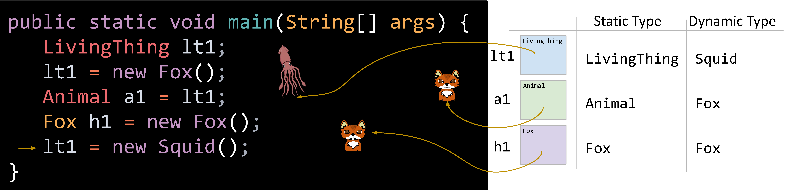
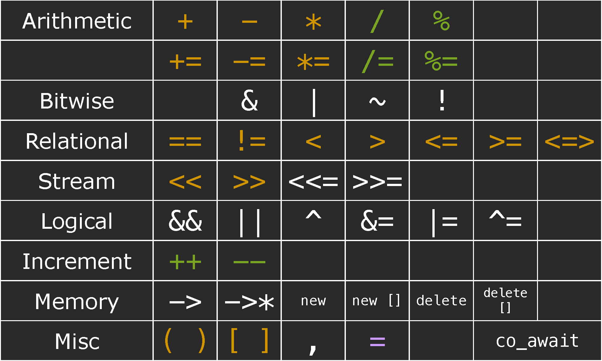
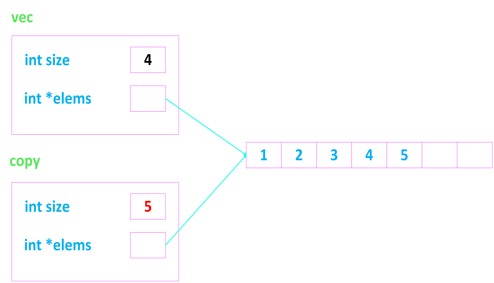
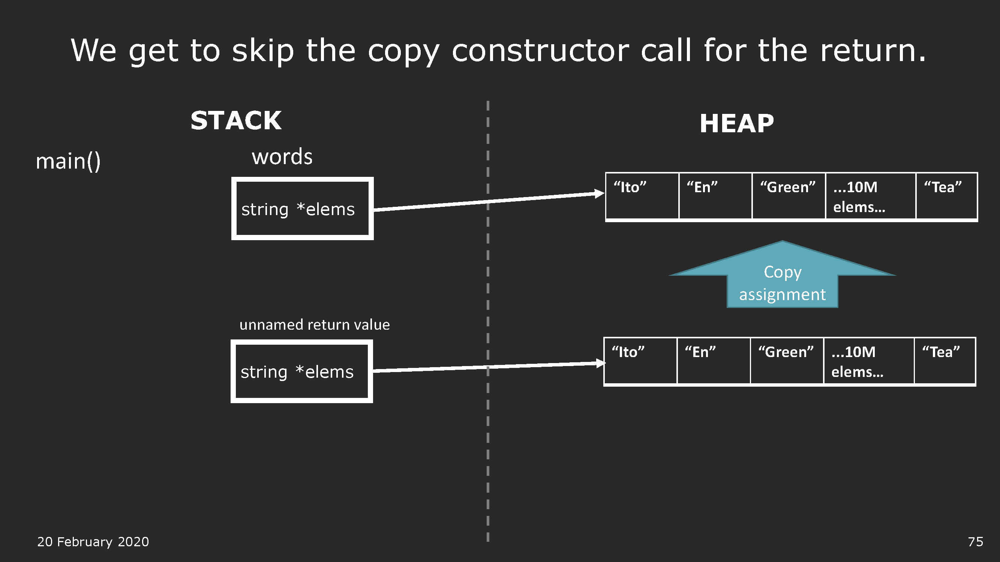
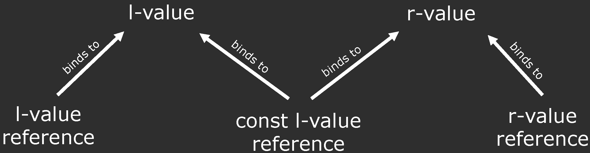

<show-structure for="chapter" depth="3"></show-structure>

# C++ Programming

## &#8544; C++ Fundamentals

### 1 C & C++ Introduction {id="intro"}

<format color="BlueViolet">Properties:</format> 

<list type="bullet">
<li>
    
C/C++ is a <format color="OrangeRed">compiled</format> 
    language.

</li>
<li>
    
C/C++ <format style="italic">compilers</format> map C/C++ 
    programs into architecture-specific machine code (string of 0s 
    and 1s).

    <list type="bullet">
    <li>
        
Unlike Java, which converts to architecture-independent 
        bytecode (run by JVM => Java Virtual Machine).

    </li>
    <li>
        
Unlike Python, which directly <format style="italic">
        interprets</format> the code.

    </li>
    <li>
        
Main difference is when your program is mapped to low-level 
        machine instructions, CPU will directly interprets and runs.
        

    </li>
    </list>
</li>
</list>

<format color="BlueViolet">Compilation Advantages: </format>

<list>
<li>
    
<format color="Fuchsia">Excellent run-time performance: 
    </format>

    
Generally much faster than Python or Java for comparable code 
    because it <format color="OrangeRed">optimizes for the given 
    architecture</format>.

</li>
<li>
    
<format color="Fuchsia">Fair compilation time:</format> 

    
Enhancements in compilation procedure (Makefiles) allow us to
    <format color="OrangeRed">recompile only the modified files
    </format>.

</li>
</list>

<format color="BlueViolet">Compilation Disadvantages:</format> 

<list type="bullet">
<li>
    
Compiled files, including the executable, are arcitecture-
    specific (CPU type and OS).

    <list type="bullet">
    <li>
        
Executable must be <format color="OrangeRed">rebuilt
        </format> on each new system.

    </li>
    <li>
        
i.e. "porting your code" to a new architecture.

    </li>
    </list>
</li>
<li>
    
Instead of "Edit -> Run [repeat]" cycle, "Edit -> Compile -> 
    Run [repeat]" iteration cycle can be slow.

</li>
</list>

### 2 Types and Structs

#### 2.1 Primitive Types

<table style="header-row">
<tr>
    <td>Fundamental Types</td>
    <td>Example</td>
    <td>Memory</td>
</tr>
<tr>
    <td>int</td>
    <td><code-block lang="c++">int val = 5;</code-block></td>
    <td>32 bits (usually)</td>
</tr>
<tr>
    <td>char</td>
    <td><code-block lang="c++">char ch = 'F';</code-block></td>
    <td>8 bits (usually)</td>
</tr>
<tr>
    <td>float</td>
    <td><code-block lang="c++">float decimalVal1 = 5.0;</code-block>
    </td>
    <td>32 bits (usually)</td>
</tr>
<tr>
    <td>double</td>
    <td><code-block lang="c++">double decimalVal2 = 5.0;</code-block>
    </td>
    <td>64 bits (usually)</td>
</tr>
<tr>
    <td>bool</td>
    <td><code-block lang="c++">bool bVal = true;</code-block></td>
    <td>1 bit</td>
</tr>
<tr>
    <td>std::string</td>
    <td><code-block lang="c++">std::string str = "Haven";</code-block>
    </td>
    <td>Depends on architecture</td>
</tr>
</table>

#### 2.2 Structs {id="structs"}

<format color="BlueViolet">Definition:</format> 

<format color="DarkOrange">Struct:</format> A <format style=
"bold">
struct</format> is a group of <format style="bold">named variables
</format>, each with their own type, that allows programmers
to <format style="bold">bundle different types</format> together!

<format color="BlueViolet">Example:</format> 

<compare type="top-bottom" first-title="C++" second-title="C">
<code-block lang="c++">
struct Student { 
    string name; // these are called fields 
    string state; // separate these by semicolons 
    int age; 
};
\/
Student s; 
s.name = "Haven"; 
s.state = "AR"; 
s.age = 22; // use . to access fields
</code-block>
<code-block lang="c">
typedef struct {
    char name[50];
    char state[3];
    int age;
} Student;
\/
Student s;
strcpy(s.name, "Haven");
strcpy(s.state, "AR");
s.age = 22; // use . to access fields
</code-block>
</compare>

### 3 Initialization & References

#### 3.1 Initialization

There are three types of initialization: 

<list type="alpha-lower">

<li>
    
<format color="Fuchsia">Direct Initialization:</format> 

    <code-block lang="c++">
int numOne = 12.0;
// numOne = 12, doesn't type check with direct initialization
    </code-block>
</li>

<li>
    
<format color="Fuchsia">Uniform Initialization (C++ 11):
    </format> 

    <code-block lang="c++">
int numTwo {12.0};
// narrowing conversion of '1.2e+1' from 'double' to 'int'
// type checks with uniform initialization
    </code-block>
</li>

<li>
    
<format color="Fuchsia">Structured binding (C++ 17):</format> 
    Can access multiple values returned by a function.

    <code-block lang="c++">
#include &lt;iostream&gt;
#include &lt;tuple&gt;
#include &lt;string&gt;
\/
std::tuple&lt;std::string, std::string, std::string&gt; getclassInfo() {
    std::string className = "CS106L";
    std::string buildingName = "Turing Auditorium";
    std::string language = "C++";
    return {className, buildingName, language};
}
\/
int main() {
    auto [className, buildingName, language] = getclassInfo();
\/
    std::cout &lt;&lt; "Come to " &lt;&lt; buildingName &lt;&lt; " and join us for " &lt;&lt; className
    &lt;&lt; " to learn " &lt;&lt; language &lt;&lt; "!" &lt;&lt; std::endl;
    // Output: Come to Turing Auditorium and join us for CS106L to learn C++!
\/
    return 0;
}
    </code-block>
</li>

</list>

<format color="BlueViolet">Advantages for Uniform Initialization:
</format> 

<list type="decimal">
<li>
    
It's safe! It doesn't allow for narrowing conversions — which 
    can lead to unexpected behaviour (or critical system failures)

</li>
<li>
    
It's ubiquitous! it works for all types like vectors, maps, and 
    custom classes, among other things!
</li>
</list>

#### 3.2 References

<format color="BlueViolet">Example:</format> 

<code-block lang="c++">
int x = 5;
int& ref = x; // ref is a reference to x
ref = 10; // x is now 10
</code-block>

<format color="BlueViolet">A classic reference-copy bug:</format> 

<compare type="top-bottom" first-title="Bug" second-title="Fixed">
    <code-block lang="c++">
// We are modifying the std::pair's inside of nums
void shift(std::vector&lt;std::pair&lt;int, int&gtl&gt; &nums) { // nums passed by reference
    for (auto [num1, num2] : nums) { // num1 and num2 are copies
        num1++;
        num2++;
    }
}
    </code-block>
    <code-block lang="c++">
// Correct Way
void shift(std::vector&lt;std::pair&lt;int, int&gt;&gt; &nums) { 
    for (auto& [num1, num2] : nums) {
        num1++;
        num2++;
    }
}
    </code-block>
</compare>

### 4 Streams

#### 4.1 Strings

For more information on strings, please visit 
<a href="Data-Structures-and-Algorithms-3.md" anchor="strings-in-java" 
summary="Strings in Java">strings in Java</a>.

<format color="BlueViolet">Examples in C++:</format> 

<code-block lang="c++">
std::string str = "Hello, World!";
std::cout &lt;&lt; str[1] &lt;&lt; std::endl; // e
str[1] = 'a'; // Hallo, World!
</code-block>

#### 4.2 Stringstreams

<list type="bullet">
<li>
    
Constructors with initialtext in the buffer.

</li>
<li>
    
Can optionally provide "modes" such as ate (start at end) or
    bin (read as binary).

</li>
</list>

##### 4.2.1 Output Stringstreams

<format color="IndianRed">Examples</format> 

<code-block lang="c++">
std::ostringstream oss("Ito-En Green Tea");
std::cout &lt;&lt; oss.str() &lt;&lt; std::endl; // Ito-En Green Tea
oss &lt;&lt; "16.9 Ounces";
std::cout &lt;&lt; oss.str() &lt;&lt; std::endl; // 16.9 Ouncesn Tea 
\/
std::ostringstream oss("Ito-En Green Tea", std::ostringstream::ate);
oss &lt;&lt; "16.9 Ounces";
std::cout &lt;&lt; oss.str() &lt;&lt; std::endl; // Ito-En Green Tea16.9 Ounces
</code-block>

<format color="BlueViolet">Positioning Functions:</format> 

<list type="decimal">
<li>
    
<format color="Fuchsia">tellp()</format>

    
Returns the current position of the put pointer in the output 
    string stream.

    <code-block lang="c++" collapsible="true">
#include &lt;iostream&gt;
#include &lt;sstream&gt;
\/
int main() {
    std::ostringstream oss;
    oss &lt;&lt; "Hello";
\/
    std::streampos currentPos = oss.tellp();
    std::cout &lt;&lt; "Current put pointer position: " &lt;&lt; currentPos &lt;&lt; std::endl; // Output: 5
\/
    oss &lt;&lt; " World!";
    currentPos = oss.tellp();
    std::cout &lt;&lt; "New put pointer position: " &lt;&lt; currentPos &lt;&lt; std::endl; // Output: 12
\/
    return 0;
}
    </code-block>
</li>
<li>
    
<format color="Fuchsia">seekp(pos)</format>

    
Moves the put pointer to a specific position within the output 
    string stream.

    
The position can be an absolute offset from the beginning of 
    the stream, or a relative offset from the current position (using
    std::ios::beg, std::ios::cur, or std::ios::end as a second 
    argument).

    <code-block lang="c++" collapsible="true">
#include &lt;iostream&gt;
#include &lt;sstream&gt;
\/
int main() {
    std::ostringstream oss;
    oss &lt;&lt; "Hello World!";
\/
    // 1. Absolute positioning (from the beginning)
    oss.seekp(0); // Move to the beginning
    oss &lt;&lt; "Hi"; // Overwrite "Hello"
\/
    std::cout &lt;&lt; oss.str() &lt;&lt; std::endl; // Output: Hi World!
\/
    // 2. Relative positioning (from the end)
    oss.seekp(-2, std::ios::end); // Move 2 positions back from the end
    oss &lt;&lt; "???"; // Overwrite "d!"
\/
    std::cout &lt;&lt; oss.str() &lt;&lt; std::endl; // Output: Hi Worl???
\/
    // 3. Using std::ios::beg (from the beginning)
    oss.seekp(5, std::ios::beg); // Move 5 positions from the beginning
    oss &lt;&lt; "-"; // Insert "-"
\/
    std::cout &lt;&lt; oss.str() &lt;&lt; std::endl; // Output: Hi Worl-???
\/
    // 4. Using std::ios::cur (from the current position)
    oss.seekp(2, std::ios::cur); // Move 2 positions forward from the current position
    oss &lt;&lt; "+"; // Insert "+"
\/
    std::cout &lt;&lt; oss.str() &lt;&lt; std::endl; // Output: Hi Worl-?+??
\/
    return 0;
}
    </code-block>
</li>
</list>

##### 4.2.2 Input Stringstreams

<warning>

Types matter! Stream stops reading at any whitespace or any invalid
character for the type.

</warning>

<format color="IndianRed">Examples</format> 

<code-block lang="c++">
std::istringstream iss("16.9 Ounces");
double amount;
std::string unit;
iss &gt;&gt; amount &gt;&gt; unit; // amount = 16.9, unit = Ounces
\/
std::istringstream iss("16.9 Ounces");
int amount;
std::string unit;
iss &gt;&gt; amount &gt;&gt; unit; // amount = 16, unit = ".9"
</code-block>

<format color="BlueViolet">Positioning Functions:</format> 

<list type="decimal">
<li>
    
<format color="Fuchsia">tellg()</format>

    
Returns the current position of the get pointer in the input 
    string stream.

    <code-block lang="c++" collapsible="true">
#include &lt;iostream&gt;
#include &lt;sstream&gt;
\/
int main() {
    std::istringstream iss("Hello World");
\/
    iss &gt;&gt; std::ws; // Skip leading whitespaces
\/
    std::cout &lt;&lt; "Current position: " &lt;&lt; iss.tellg() &lt;&lt; std::endl; // Output: 0
\/
    std::string word;
    iss &gt;&gt; word; // Read "Hello"
\/
    std::cout &lt;&lt; "Current position after reading 'Hello': " &lt;&lt; iss.tellg() &lt;&lt; std::endl; // Output: 5 (or 6 if there's a space after Hello)
\/
    return 0;
}
    </code-block>
</li>
<li>
    
<format color="Fuchsia">seekg(pos)</format>

    
Moves the put pointer to a specific position within the output 
    string stream.

    
The position can be an absolute offset from the beginning of 
    the stream, or a relative offset from the current position (using
    std::ios::beg, std::ios::cur, or std::ios::end as a second 
    argument).

    <code-block lang="c++" collapsible="true">
#include &lt;iostream&gt;
#include &lt;sstream&gt;
\/
int main() {
    std::istringstream iss("Hello World");
\/
    // Using absolute position from the beginning
    iss.seekg(7); // Move to the 7th position from the beginning (equivalent to iss.seekg(7, std::ios::beg))
    char char1;
    iss.get(char1); 
    std::cout &lt;&lt; "Character read after seeking to absolute position 7: " &lt;&lt; char1 &lt;&lt; std::endl; // Output: o
\/
    // Using ios::beg (beginning)
    iss.seekg(6, std::ios::beg); // Move to the 6th position from the beginning
    std::string word1;
    iss &gt;&gt; word1; 
    std::cout &lt;&lt; "Word read after seeking from beginning: " &lt;&lt; word1 &lt;&lt; std::endl; // Output: World
\/
    // Using ios::cur (current)
    iss.seekg(2, std::ios::cur); // Move 2 positions forward from the current position (which is after "World")
    char char2;
    iss.get(char2);
    std::cout &lt;&lt; "Character read after seeking from current: " &lt;&lt; char2 &lt;&lt; std::endl; // Output: d 
\/
    // Using ios::end (end)
    iss.seekg(-5, std::ios::end); // Move 5 positions backward from the end
    std::string word2;
    iss &gt;&gt; word2;
    std::cout &lt;&lt; "Word read after seeking from end: " &lt;&lt; word2 &lt;&lt; std::endl; // Output: World
\/
    return 0;
}
    </code-block>
</li>
</list>

<tip>

Two data types:

<list type="decimal">
<li>
    
<format color="Fuchsia">streampos:</format> Represents the 
    position of the get pointer.

</li>
<li>
    
<format color="Fuchsia">streamoff:</format> Represents the 
    difference (offset) between two streampos values.

</li>
</list>

<format color="BlueViolet">Example</format>

<code-block lang="c++" collapsible="true">
#include &lt;iostream&gt;
#include &lt;sstream&gt;
\/
int main() {
    // Create an output string stream
    std::ostringstream oss;
    oss &lt;&lt; "Hello, world!";
\/
    // Get the current position using streampos
    std::streampos pos = oss.tellp();
    std::cout &lt;&lt; "Current position in output stream: " &lt;&lt; pos &lt;&lt; std::endl; // Outputs: 13
\/    
    // Move the position using streamoff
    oss.seekp(5, std::ios::beg);
    pos = oss.tellp();
    std::cout &lt;&lt; "New position in output stream after seekp: " &lt;&lt; pos &lt;&lt; std::endl; // Outputs: 5
\/    
    // Create an input string stream with the data from the output stream
    std::istringstream iss(oss.str());
\/    
    // Get the current position using streampos
    pos = iss.tellg();
    std::cout &lt;&lt; "Current position in input stream: " &lt;&lt; pos &lt;&lt; std::endl; // Outputs: 0
\/    
    // Move the position using streamoff
    iss.seekg(7, std::ios::beg);
    pos = iss.tellg();
    std::cout &lt;&lt; "New position in input stream after seekg: " &lt;&lt; pos &lt;&lt; std::endl; // Outputs: 7
\/    
    return 0;
}
</code-block>
</tip>

##### 4.2.3 Getline

<code-block lang="c++">
std::istream& getline(std::istream& is, std::string& str, char delim);
</code-block>

<list type="bullet">
<li>
    
<format color="Fuchsia">is:</format> The input stream from 
    which to read.

</li>
<li>
    
<format color="Fuchsia">str:</format> The string where the read 
    line will be stored.

</li>
<li>
    
<format color="Fuchsia">delim:</format> The delimiter character 
    that specifies where to stop reading (optional, by default '\n').
    

</li>
</list>

<note>
    
getline() <format color="OrangeRed">consumes</format> the delim 
    character!

</note>

<format color="IndianRed">Exampless</format>

<code-block lang="c++" collapsible="true">
std::string input;
std::cout &lt;&lt; "Enter a line of text: ";
std::getline(std::cin, input);
std::cout &lt;&lt; "You entered: " &lt;&lt; input &lt;&lt; std::endl;
</code-block>

##### 4.2.4 State Bits

<list type="alpha-lower">
<li>
    
<format color="Fuchsia">Good bit</format> - ready for read
    /write. (Nothing unusal, on when other bits are off)

</li>
<li>
    
<format color="Fuchsia">Fail bit</format> - previous 
    operation failed, all future operations frozen. (Type mismatch, 
    file can't be opened, seekg failed)

</li>
<li>
    
<format color="Fuchsia">EOF bit</format> - previous 
    operation reached the end of buffer content (reached the end of 
    buffer).

</li>
<li>
    
<format color="Fuchsia">Bad bit</format> - external error,
    like irrecoverable.(e.g. the file you are reading from suddenly is 
    deleted)

</li>
</list>

<note>

Good and bad are not opposites! (e.g. type mismatch)

Good and fail are not opposites! (e.g. end of file)

Fail and EOF are normally the ones you will be checking.

</note>

<format color="IndianRed">Examples</format> 

<code-block lang="c++">
std::istringstream iss("17");
int amount;
iss &gt;&gt; amount;
std::cout &lt;&lt; (iss.eof() ? "EOF" : "Not EOF") &lt;&lt; std::endl;
// There also exist iss.good(), iss.fail() & iss.bad()
</code-block>

#### 4.3 Input Streams

<format color="BlueViolet">There are four standard iostreams
</format>

<list type="bullet">
<li>
    
<format color="Fuchsia">cout:</format> Standard Output Stream
    .

</li>
<li>
    
<format color="Fuchsia">cin:</format> Standard Input Stream
    (buffered).

</li>
<li>
    
<format color="Fuchsia">cerr (Standard Error Stream):</format> 
    used to output errors (unbuffered).

</li>
<li>
    
<format color="Fuchsia">clog (Standard Logging Stream):
    </format> used for non-critical event logging (buffered).

</li>
</list>

<format color="BlueViolet">cin</format>

<list type="bullet">
<li>
    
The program hangs and waits for user input when the position
    reaches EOF, past the last token in the buffer.

</li>
<li>
    
The position pointer skips whitespace <format color=
    "OrangeRed">after</format> the token with each &gt;&gt; operation.

</li>
<li>
    
The position pointer does the following:

    <list type="bullet">
    <li>
        
consume all whitespaces (spaces, newlines, '\t', '\n', etc
        .)

    </li>
    <li>
        
reads as many characters until:

        <list type="bullet">
        <li>
        
a whitespace is reached, or...

        </li>
        <li>
        
for primitives, the maximum number of bytes necessary to 
        form a valid variable.
</li>
        <li>
Example: if we extract an int from "86.2", we'll get 
        86, with pos at the decimal point.
</li>
        </list>
    </li>
    </list>
</li>
</list>

<format color="IndianRed">Examples</format> 

<compare type="top-bottom" first-title="Example 1" second-title="Example 2">
    <code-block lang="c++">
#include &lt;iostream&gt;
#include &lt;string&gt;
\/
int main() {
    double pi, r;
    std::string name;
    std::cin &gt;&gt; pi;
    std::cin.ignore(); // ignore the newline character
    std::getline(std::cin, name);
    std::cin &gt;&gt; r;
    std::cout &lt;&lt; "Hello, " &lt;&lt; name &lt;&lt; "!" &lt;&lt; std::endl;
    std::cout &lt;&lt; "Value of pi: " &lt;&lt; pi &lt;&lt; std::endl;
    std::cout &lt;&lt; "Value of r: " &lt;&lt; r &lt;&lt; std::endl;
    return 0;
}
    </code-block>
    <code-block lang="c++">
#include &lt;iostream&gt;
#include &lt;string&gt;
\/
int main() {
    double pi, r;
    std::string name;
    std::cin &gt;&gt; pi;
    std::getline(std::cin, name); // read '\n' from previous input
    std::getline(std::cin, name); // read name
    std::cin &gt;&gt; r;
    std::cout &lt;&lt; "Hello, " &lt;&lt; name &lt;&lt; "!" &lt;&lt; std::endl;
    std::cout &lt;&lt; "Value of pi: " &lt;&lt; pi &lt;&lt; std::endl;
    std::cout &lt;&lt; "Value of r: " &lt;&lt; r &lt;&lt; std::endl;
    return 0;
}
    </code-block>
</compare>

<warning>

Don’t use getline() and std::cin() together, unless you really 
really have to!

</warning>

#### 4.4 Output Streams

<format color="BlueViolet">cerr & clog</format>

<code-block lang="c++" collapsible="true">
#include &lt;iostream&gt;
\/
int main() {
    std::cerr &lt;&lt; "Error: Could not open the file!" &lt;&lt; std::endl;
\/
    std::clog &lt;&lt; "Log: User logged in successfully." &lt;&lt; std::endl;
\/
    return 0;
}
</code-block>

<format color="BlueViolet">Input File Streams & Output File Streams
</format>

<table style="both">
<tr>
    <td></td>
    <td>ifstream</td>
    <td>ofstream</td>
</tr>
<tr>
    <td>Purpose</td>
    <td>Input from a file</td>
    <td>Output to a file</td>
</tr>
<tr>
    <td>Mode</td>
    <td>Opens a file in read mode</td>
    <td>Opens a file in write mode</td>
</tr>
<tr>
    <td>Default behavior</td>
    <td>If the file doesn't exist, it fails to open.</td>
    <td>If the file doesn't exist, it creates a new one. If it 
    exists, it overwrites the content by default.</td>
</tr>
<tr>
    <td>Operators</td>
    <td>Primarily used with the extraction operator (&gt;&gt;) to read
    data from the file.</td>
    <td>Primarily used with the insertion operator (&lt;&lt;) to 
    write data to the file.</td>
</tr>
<tr>
    <td>Similarities</td>
    <td colspan="2">
    <list type="alpha-lower">
    <li>
    
They share many common methods like open(), close(), is_open()
    , good(), bad(), fail(), eof(), etc. for managing the file stream
    .

    </li>
    <li>
    
Both inherit properties and methods from the base class fstream
    .

    </li>
    </list>
    </td>
</tr>
</table>

<format color="BlueViolet">Example:</format> 

<code-block lang="c++" collapsible="true">
#include &lt;iostream&gt;
#include &lt;fstream&gt;
\/
int main() {
    // ifstream for reading from a file
    std::ifstream inputFile("myInput.txt");
\/
    if (inputFile.is_open()) {
        std::string line;
        while (std::getline(inputFile, line)) {
            std::cout &lt;&lt; line &lt;&lt; std::endl;
        }
        inputFile.close(); 
    } else {
    std::cerr &lt;&lt; "Unable to open input file." &lt;&lt; std::endl;
    }
\/
    // ofstream for writing to a file
    std::ofstream outputFile("myOutput.txt");
\/
    if (outputFile.is_open()) {
        outputFile &lt;&lt; "This is some text for the output file." &lt;&lt; std::endl;
        outputFile.close();
    } else {
        std::cerr &lt;&lt; "Unable to open output file." &lt;&lt; std::endl;
    }
\/
    return 0;
}
</code-block>

### 5 Modern C++ Types

#### 5.1 Auto

<list type="bullet">
<li>
    
When a type name is too long and a simpler alias makes the
    code more readable, use it.

</li>
<li>
    
In libraries there is a common name for a type within each
    class. Example:

    <list type="bullet">
    <li>
        
vector::iterator, map::iterator, string::iterator

    </li>
    <li>
        
vector::reference, map::reference, string::reference

    </li>
    </list>
</li>
</list>

<warning>

Auto discards const and references!

</warning>

#### 5.2 Pair/Tuple

A pair is simply two objects bundled together.

<note>

Remember to include &lt; utility &gt; and &lt; tuple &gt;

</note>

<format color="IndianRed">Examples</format> 

<code-block lang="c++" collapsible="true">
std::pair&lt;double, int&gt; price(3.4, 5);
\/
// make_pair/tuple (C++ 11) automatically deduces the type!
auto prices = std::make_pair(3.4, 5);
auto values = std::make_tuple(3, 4, "hi");
\/
// access via get/set
prices.first = prices.second;           // prices = {5, 5}
get&lt;0&gt;(values) = get&lt;1&gt;(values);  // values = {4, 4, "hi"}
\/
// structured binding (C++ 17) - extract each binding
auto [a, b] = prices;       // a = 5, b = 5
const auto& [c, d, e] = values; // c = 4, d = 4, e = "hi"
</code-block>

#### 5.3 Conversions

<format color="IndianRed">Exampless</format>

<code-block lang="c++" collapsible="true">
int v1 = static_cast&lt;double&gt;(3.14); // v1 = 3
</code-block>

<code-block lang="c++" collapsible="true">
const int v3 = 3;
int* v4 = const_cast&lt;int*&gt; (&v3); // v4 = 3
</code-block>

#### 5.4 initializer_list

<format color="BlueViolet">Definition</format>: An initializer 
list is a lightweight vector that can be used as a parameter.

<format color="BlueViolet">Example:</format> 

<code-block lang="c++" collapsible="true">
#include &lt;iostream&gt;
#include &lt;vector&gt;
#include &lt;initializer_list&gt;
\/
class MyContainer {
private:
    std::vector&lt;int&gt; data;
\/
public:
    // Constructor using initializer_list
    MyContainer(std::initializer_list&lt;int&gt; values) {
        // Iterate through the initializer_list and populate the vector
        for (int value : values) {
            data.push_back(value);
        }
    }
\/
    void print() const {
        for (int value : data) {
            std::cout &lt;&lt; value &lt;&lt; " ";
        }
        std::cout &lt;&lt; std::endl;
    }
};
\/
int main() {
    // Using initializer_list to initialize MyContainer
    MyContainer container1 = {1, 2, 3, 4, 5};
    container1.print();
\/
    MyContainer container2{6, 7, 8};
    container2.print(); 
\/
    return 0;
}
</code-block>

<warning>

C++ 11 provides a uniform initialization syntax. Using the uniform 
initialization syntax, the initializer list constructor is preferred 
over constructor.

</warning>

<code-block lang="c++" collapsible="true">
std::vector&lt;int&gt; v1(3, 10) // v1 = {10, 10, 10}
std::vector&lt;int&gt; v2{3, 10} // v2 = {3, 10}
</code-block>

#### 5.5 using

Create type aliases with the using keyword.

<compare type="top-bottom" first-title="Types" second-title="Using keyword">
<code-block lang="c++">
std::pair&lt;bool, std::pair&lt;double, double&gt;&gt;;
</code-block>
<code-block lang="c++">
using Zeros = std::pair&lt;double, double&gt;;
using Solution = std::pair&lt;bool, Zeros&gt;;
</code-block>
</compare>

## &#8545; Standard Template Library (STL)

The <format color="DarkOrange">Standard Template Library (STL)
</format> is a software library originally designed by Alexander Stepanov
for the C++ programming language that influenced many parts of the C++ 
Standard Library. It provides four components called algorithms, 
containers, functions, and iterators.

The <format color="DarkOrange">C++ Standard Library</format> is a 
collection of classes and functions, which are written in the core 
language and part of the C++ ISO Standard itself.

<note>

The STL and the C++ Standard Library are two distinct entities.

However, due to the popular use of "STL" and "Standard Template 
Library" in search engines, we occasionally use those names to make it 
easier to find our documentation.

In this documentation, Standard Template Library (STL) refers to the 
C++ Standard Library as a whole.

</note>

### 6 Containers

#### 6.1 Sequence Containers

<format color="DarkOrange">Sequence Containers:</format> Containers
which provide access to sequences of elements.

<list type="bullet">
<li>
    
<code>std::vector&lt;T&gt;</code>

</li>
<li>
    
<code>std::deque&lt;T&gt;</code>

</li>
<li>
    
<code>std::array&lt;T&gt;</code>

</li>
<li>
    
<code>std::list&lt;T&gt;</code>

</li>
<li>
    
<code>std::forward_list&lt;T&gt;</code>

</li>
</list>

##### 6.1.1 Vector

<format color="DarkOrange">Vector:</format> An array with 
changeable size.

<table style="both">
<tr>
    <td></td>
    <td><code>vec[index]</code></td>
    <td><code>vec.at(index)</code></td>
</tr>
<tr>
    <td>Bounds Checking</td>
    <td>No</td>
    <td>Yes</td>
</tr>
<tr>
    <td>Speed</td>
    <td>Fast</td>
    <td>Slow</td>
</tr>
</table>

<warning>

If you write your program <format color="GreenYellow">correctly
</format>, bounds checking will just <format color="OrangeRed">slow
</format> you down.

</warning>

<format color="BlueViolet">Advantages:</format> 

<list type="bullet">
<li>
    
Fast, lightweight & intuitive.

</li>
<li>
    
Grow efficiently <format color="GreenYellow">in one direction
    </format>.

</li>
</list>

<format color="BlueViolet">Disadvantages:</format> 

<list type="bullet">
<li>
    
cannot push_front!

</li>
</list>

##### 6.1.2 Deque

<format color="DarkOrange">Deque:</format> A deque is a doubly 
ended queue.

<format color="BlueViolet">Implementation:</format> 

Instead of storing all elements in a single contiguous block, deque 
internally manages a collection of fixed-size arrays called "chunks" 
or "buffers."

Deque maintains a dynamic array (usually a small array or a 
tree-like structure) called a "map" or "central index". This map 
stores pointers to the beginning of each chunk.

<format color="BlueViolet">Advantages:</format> 

<list type="bullet">
<li>
    
Can push_front!

</li>
</list>

<format color="BlueViolet">Disadvantages:</format> 

<list type="bullet">
<li>
    
For other operations, vector outperform deque.

</li>
</list>

#### 6.2 Container Adapters

<list type="alpha-lower">
<li>
    
<format color="Fuchsia">Stacks:</format> 

    <list type="bullet">
    <li>
    
The standard containers <code>std::vector</code>, <code>
    std::deque</code>, <code>std::list</code> satisfy these 
    requirements.

    </li>
    <li>
    
Just limit the functionality of a vector/deque to only allow
    <code>push_back</code> and <code>pop_back</code>.

    </li>
    </list>
</li>
<li>
    
<format color="Fuchsia">Queues:</format> 

    <list type="bullet">
    <li>
    
The standard containers <code>std::deque</code> and <code>
    std::list</code> satisfy these requirements.

    </li>
    <li>
    
Just limit the functionality of a deque to only allow <code>
    push_back</code> and <code>pop_front</code>.

    </li>
    </list>
</li>
</list>

#### 6.3 Associative Containers

<format color="DarkOrange">Associative containers:</format> Data is
accessed using the <format color="OrangeRed">key</format> instead of
index.

<code-block lang="plantuml">
@startmindmap
* Class Templates
**: Based on ordering property of keys
 Keys need to be comparable using &lt; operator;
*** std::map&lt;T1, T2&gt;
*** std::set&lt;T&gt;
**: Based on hash function
 You need to define how the key can be hashed;
*** std::unordered_map&lt;T1, T2&gt;
*** std::unordered_set&lt;T&gt;
@endmindmap
</code-block>

#### 6.4 Iterators {id="iterators"}

<format color="BlueViolet">Four iterator operations:</format> 

<list type="bullet">
<li>
    
<format color="Fuchsia">Create iterator:</format> 

    
<code>std::set&lt;int&gt;::iterator iter = mySet.begin()</code>

</li>
<li>

<format color="Fuchsia">Dereference iterator to read value 
currently pointed to:</format> 

<code>int val = *iter</code>

</li>
<li>
    
<format color="Fuchsia">Advance iterator:</format> 

    
<code>iter++</code>; or <code>++iter</code>

</li>
<li>
    
<format color="Fuchsia">Compare against another iterator</format> 
    (especially <code>.end()</code> iterator)

</li>
</list>

<format color="BlueViolet">Map Iterators:</format> 

<code-block lang="c++" collapsible="true">
map&lt;int, int&gt; m;
map&lt;int, int&gt;::iterator i = m.begin();
map&lt;int, int&gt;::iterator end = m.end();
while (i != end) {
    cout &lt;&lt; (*i).first &lt;&lt; " " &lt;&lt; (*i).second &lt;&lt; endl;
    i++;
}
</code-block>

<code-block lang="mermaid">
stateDiagram
    direction LR
    Random_Access --> Bidirectional
    Bidirectional --> Forward
    Forward --> Input
    Forward --> Output
</code-block>

##### 6.4.1 Input Iterators

For sequential, single-pass input.

Read only, i.e. can only be dereferenced on <format color= 
"OrangeRed">right</format> side of expression.

<format color="BlueViolet">Example:</format> 

<code-block lang="c++" collapsible="true">
vector&lt;int&gt;::iterator iter = myVector.begin();
int val = *iter;
</code-block>

##### 6.4.2 Output Iterators

For sequential, single-pass output.

Read only, i.e. can only be dereferenced on <format 
color="OrangeRed">left</format> side of expression.

<format color="BlueViolet">Example:</format> 

<code-block lang="c++">
vector&lt;int&gt;::iterator iter = myVector.begin();
*iter = 5;
</code-block>

##### 6.4.3 Forward Iterators

Combines input and output, plus can make multiple passes.

Can read from and write to (if not const iterator).

<format color="BlueViolet">Example:</format> 

<code-block lang="c++">
// multiple passes
vector&lt;int&gt;::iterator iter1 = myVector.begin();
vector&lt;int&gt;::iterator iter2 = myVector.begin();
iter1++;
iter2++;
if (iter1 == iter2) { cout &lt;&lt; "Equal" &lt;&lt; endl; } // Equal
</code-block>

##### 6.4.4 Bidirectional Iterators

Same as forward iterators, plus can go backwards with the decrement
operator (--).

<format color="BlueViolet">Use cases:</format> <code>std::map
</code>, <code>std::set</code>, <code>std::list</code>

##### 6.4.5 Random Access Iterators

Same as bidirectional iterators, plus can be implemented or 
decremented by arbitrary amounts using + and -.

<format color="BlueViolet">Use cases:</format> <code>std::vector
</code>, <code>std::deque</code>, <code>std::string</code>

### 7 Templates

#### 7.1 Template Functions

<format color="IndianRed">Examples</format> 

<code-block lang="c++">
template &lt;typename T&gt;
std::pair&lt;T, T&gt; my_minmax(T a, T b) {
    if (a &lt; b) return {a, b};
    else return {b, a};
}
</code-block>

The following code: 

<code-block lang="c++">
my_minmax(cout, cout);
</code-block>

<format color="Fuchsia">Semantic error:</format> you can’t call 
operator &lt; on two streams.

<format color="Fuchsia">Conceptual error:</format> you can’t 
find the min or max of two streams.

The compiler deduces the types and literally replaces the types.
Compiler will produce semantic errors, not conceptual error.

<code-block lang="c++" collapsible="true">
template &lt;typename Collection, typename DataType&gt;
int countOccurences(const Collection& list, DataType val) {
    int count = 0;
    for (size_t i = 0; i &lt; list.size(); ++i) {
        if (list[i] == val) ++count;
    }
    return count;
}
</code-block>

Problem lies in indexing <code>list[i]</code>.

<code-block lang="c++" collapsible="true">
template &lt;typename Collection, typename DataType&gt;
int countOccurences(const Collection& list, DataType val) {
    int count = 0;
    for (auto iter = list.begin(); iter != list.end(); ++iter) {
        if (*iter == val) ++count;
    }
    return count;
}
</code-block>

Or: 

<code-block lang="c++" collapsible="true">
template &lt;typename Collection, typename DataType&gt;
int countOccurences(const Collection& collection, const DataType& val) {
    int count = 0;
    for (const auto& element : collection) {
        if (element == val) {
            ++count;
        }
    }
    return count;
}
</code-block>

#### 7.2 Template Classes

<procedure title="Template Class">
<step>
    
Add template declaration for class

</step>
<step>
    
Add all the member type aliases

</step>
<step>
    
Add the template declaration to every single class member

</step>
<step>
    
Move everything to the .h file => separate compilation template
    classes are not classes themselves

</step>
</procedure>

### 8 Functions and Algorithms

#### 8.1 Lambda Functions {id="Lambda"}

<code-block lang="c++">
auto isLessThanLimit = [limit](auto val) -&gt; bool {
    return val &lt; limit;
};
</code-block>

<list type="bullet">
<li>
    
<code>auto</code>: We don't know the type, ask compiler.

</li>
<li>
    
<code>[limit]</code>: Capture clause, gives access to outside 
    variables.

</li>
<li>
    
<code>(auto)</code>: Parameter list, can use auto!

</li>
<li>
    
<code>-> bool</code>: Return type, optional.

</li>
</list>

Two types of capture clause: By reference or by value.

<code-block lang="c++" collapsible="true">
// capture all by value, except teas is by reference 
auto func1 = [=, &teas](parameters) -&gt; return-value {   
    // body 
};
\/
// capture all by reference, except banned is by value
auto func2 = [&, banned](parameters) -&gt; return-value {   
    // body
};
</code-block>

<tip>

<code>std::function&lt;R(Args…)&gt;</code> is a generic 
wrapper for all things callable.

<code-block lang="c++">
int add(int a, int b) { 
    return a + b; 
}
\/
int main() {
    std::function&lt;int(int, int)&gt; func; // initially empty
    func = add; // Assign a regular function
    std::cout &lt;&lt; func(2, 3) &lt;&lt; std::endl; // Output: 5
    func =  { return a * b; }; // Reassign a lambda
    std::cout &lt;&lt; func(2, 3) &lt;&lt; std::endl; // Output: 6
    return 0;
}
</code-block>

In this context, <code>std::function&lt;int(int, int)&gt;</code> can 
store any callable object as long as it matches the signature.

<format color="BlueViolet">Benefit: </format>

    <list type="alpha-lower">
    <li>
    
<format color="Fuchsia">Type Erasure for Flexibility:</format> It 
    lets you work with different callable objects through a common 
    interface. You can pass <code>std::function</code> objects to functions
    or store them in data structures without knowing the exact type of the
    underlying callable.

    </li>
    <li>
    
<format color="Fuchsia">Enables Polymorphism with Callables:
    </format> You can have a function that accepts a std::function as a 
    parameter, allowing it to work with different lambda functions or other
    callable types at runtime.

    </li>
    </list>
</tip>

<code>std::bind</code> adapts existing function objects to create new 
ones with specific argument values pre-filled.

<code-block lang="c++">
int multiplyAndAdd(int a, int b, int c) {
    return (a * b) + c;
}
\/
int main() {
    auto operation = std::bind(multiplyAndAdd, std::placeholders::_1,
    std::placeholders::_2, 4);
    std::cout &lt;&lt; operation(2, 3) &lt;&lt; std::endl; // Output: 10 ((2*3) + 4)
}
</code-block>

<list type="bullet">
<li>

<code>std::placeholders::_1</code> means "take the first argument 
passed to operation".

</li>
<li>

<code>std::placeholders::_2</code> means "take the second argument 
passed to operation".

</li>
<li>

4 is the third argument of <code>multiplyAndAdd</code>.

</li>
</list>

<warning>

Lambdas provide a convenient and expressive way to define objects 
that behave like functions. => Lambdas are a type of function object.

</warning>

#### 8.2 Algorithms

##### 8.2.1 std::sort

<format color="BlueViolet">Syntax:</format> 

<code-block lang="c++" collapsible="true">
#include &lt;algorithm&gt; // Required header
\/
// 1. Basic Usage (Sorting using &lt; operator)
template &lt;class RandomAccessIterator&gt;
void sort(RandomAccessIterator first, RandomAccessIterator last);
\/
// 2. Custom Comparison Function
template &lt;class RandomAccessIterator, class Compare&gt;
void sort(RandomAccessIterator first, RandomAccessIterator last, Compare comp);
</code-block>

<format color="BlueViolet">Example:</format> 

<code-block lang="c++">
std::vector&lt;int&gt; numbers = {3, 1, 4, 1, 5};
std::sort(numbers.begin(), numbers.end()); // Sort the entire vector
\/
std::sort(numbers.begin(), numbers.end(), std::greater&lt;int&gt;()); // Sort in descending order
</code-block>

<format color="BlueViolet">Parameters:</format> 

<list type="decimal">
<li>
    
<format color="Fuchsia">first (iterator):</format> An iterator 
    pointing to the beginning of the range you want to sort.

</li>
<li>
    
<format color="Fuchsia">last (iterator):</format> An iterator 
    pointing to one position past the end of the range to be sorted.
    

</li>
<li>
    
<format color="Fuchsia">comp (comparison function) (optional):
    </format> A binary function (takes two arguments) that defines 
    the sorting criterion. It should return true if the first argument
    should come before the second in the sorted order, and false 
    otherwise.

</li>
</list>

<format color="BlueViolet">Important notes:</format> 

<list type="bullet">
<li>
    
You can sort a portion of the entire vector, array, etc.

    <code-block lang="c++">
    std::vector&lt;int&gt; data = {5, 2, 8, 1, 9, 3};
    std::sort(data.begin(), data.begin() + 4); // Result: data = {1, 2, 5, 8, 9, 3}
    </code-block>
</li>
<li>
    
You can overload operator &lt; to define default sorting behavior.
    

    <code-block lang="c++">
struct Item {
    int id;
    std::string name;
};
\/
// Stable Comparison
bool compareByNameStable(const Item& a, const Item& b) {
    if (a.name == b.name) {
        return a.id &lt; b.id; // Keep original order based on 'id' if names are equal
    }
    return a.name &lt; b.name;
}
\/
int main() {
    std::vector&lt;Item&gt; items = {
        {1, "Apple"},
        {2, "Banana"},
        {3, "Apple"} 
    };
    std::sort(items.begin(), items.end(), compareByNameStable);
}
    </code-block>
</li>
<li>
    
<format color="Fuchsia">Average case:</format> <math>
    O(N \log N)</math>

</li>
</list>

##### 8.2.2 std::nth_element

<format color="BlueViolet">Syntax:</format> 

<code-block lang="c++" collapsible="true">
#include &lt;algorithm&gt;
\/
template &lt;class RandomAccessIterator&gt;
void nth_element (RandomAccessIterator first, RandomAccessIterator nth,
RandomAccessIterator last);
\/
// Optional: You can provide a custom comparison function
template &lt;class RandomAccessIterator, class Compare&gt;
void nth_element (RandomAccessIterator first, RandomAccessIterator nth,
RandomAccessIterator last, Compare comp);
</code-block>

<format color="BlueViolet">Example:</format> 

<code-block lang="c++" collapsible="true">
std::vector&lt;int&gt; numbers = {5, 2, 8, 1, 9, 3};
\/
std::nth_element(numbers.begin(), numbers.begin() + 2, numbers.end());
// Output: 2 1 3 8 9 5 (The element at index 2 is now '3',
//          which is the 3rd smallest, but the rest are not sorted)
</code-block>

<format color="BlueViolet">Parameters:</format> 

<list type="decimal">
<li>
    
<format color="Fuchsia">first:</format> Iterator to the 
    beginning of the range.

</li>
<li>
    
<format color="Fuchsia">nth:</format> Iterator pointing to the
    position you want the nth element to be placed in.

</li>
<li>
    
<format color="Fuchsia">last:</format> Iterator to one past 
    the end of the range.

</li>
<li>
    
<format color="Fuchsia">comp (optional):</format> A binary 
    comparison function, similar to std::sort.

</li>
</list>

<format color="BlueViolet">Important notes:</format> 

<list type="bullet">
<li>
    
With this, you can efficiently find the median of a dataset 
    without fully sorting it, or determine the <math>k^{\text{th}}
    </math> smallest or largest element.

</li>
<li>
    
It sorts so <math>n^{\text{th}}</math> element is in correct 
    position, and all elements smaller to left, larger to right, but 
    the elements before the <math>n ^ {\text{th}}</math> element are
    not guaranteed to be sorted among themselves, and neither are the
    elements after it.

</li>
<li>
    
<format color="Fuchsia">Average case:</format> <math>O(N)</math>

</li>
</list>

##### 8.2.3 std::stable_partition

<format color="BlueViolet">Syntax:</format> 

<code-block lang="c++" collapsible="true">
#include &lt;algorithm&gt; // Required header
\/
template &lt;class BidirectionalIterator, class UnaryPredicate&gt;
BidirectionalIterator stable_partition (BidirectionalIterator first,
BidirectionalIterator last,
UnaryPredicate pred);
</code-block>

<format color="BlueViolet">Parameters:</format> 

<list type="decimal">
<li>
    
<format color="Fuchsia">BidirectionalIterator:</format> A 
    template parameter indicating the type of iterators used. These 
    iterators must support bidirectional movement (like those from 
    std::list, std::vector, std::deque).

</li>
<li>
    
<format color="Fuchsia">first (BidirectionalIterator):
    </format> An iterator to the beginning of the range you want to 
    partition.

</li>
<li>
    
<format color="Fuchsia">last (BidirectionalIterator):
    </format> An iterator to one past the end of the range to be 
    partitioned.

</li>
<li>
    
<format color="Fuchsia">UnaryPredicate:</format> A template 
    parameter representing the type of the predicate function.

</li>
<li>
    
<format color="Fuchsia">pred (UnaryPredicate):</format> A 
    function that takes a single argument (an element from the range)
    and returns a bool:

</li>
<li>
    <list type="bullet">
    <li>
    
true: The element satisfies the partitioning criterion.

    </li>
    <li>
    
false: The element does not satisfy the criterion.

    </li>
    </list>
</li>
</list>

<format color="BlueViolet">Example:</format> 

<code-block lang="c++" collapsible="true">
#include &lt;iostream&gt;
#include &lt;vector&gt;
#include &lt;algorithm&gt;
#include &lt;string&gt;
\/
// A simple struct to represent a course (you can customize this)
struct Course {
    std::string name;
};
\/
int main() {
// Sample course data
std::vector&lt;Course&gt; courses = {
    {"CS101"},
    {"MATH101"},
    {"CS202"},
    {"PHYS101"},
    {"CS301"}
};
\/
    std::string dep = "CS";
\/
    // Lambda function to check if a course belongs to the "CS" department
    auto isDep = [dep](const Course& course) {
        return course.name.size() >= dep.size() && 
               course.name.substr(0, dep.size()) == dep;
    };
\/
    // Partition the courses vector, keeping "CS" courses at the beginning
    auto iter = std::stable_partition(courses.begin(), courses.end(), isDep);
\/
    // Remove non-"CS" courses
    courses.erase(iter, courses.end());
\/
    // Output the remaining "CS" courses
    std::cout &lt;&lt; "CS Courses:\n";
    for (const Course& course : courses) {
        std::cout &lt;&lt; course.name &lt;&lt; std::endl;
    }
\/
    return 0;
}
</code-block>

##### 8.2.4 std::copy_if

<format color="BlueViolet">Syntax:</format> 

<code-block lang="c++" collapsible="true">
#include &lt;algorithm&gt; // Required header
\/
template &lt;class InputIterator, class OutputIterator, class UnaryPredicate&gt;
OutputIterator copy_if (InputIterator first, InputIterator last,
OutputIterator result, UnaryPredicate pred);
</code-block>

<list type="decimal">
<li>
    
<format color="Fuchsia">InputIterator:</format> Type of 
    iterator used for the input range.

</li>
<li>
    
<format color="Fuchsia">OutputIterator:</format> Type of 
    iterator used for the output range (where copied elements go).

</li>
<li>
    
<format color="Fuchsia">first (InputIterator):</format> An 
    iterator to the beginning of the input range.

</li>
<li>
    
<format color="Fuchsia">last (InputIterator):</format> An 
    iterator to one past the end of the input range.

</li>
<li>
    
<format color="Fuchsia">result (OutputIterator):</format> An 
    iterator to the beginning of the output range.

</li>
<li>
    
<format color="Fuchsia">UnaryPredicate:</format> Type of the 
    predicate function.

</li>
<li>
    
<format color="Fuchsia">pred (UnaryPredicate):</format> A 
    function that takes a single argument (an element from the input 
    range) and returns:

</li>
<li>
    <list type="bullet">
    <li>
    
true: Copy the element to the output range.

    </li>
    <li>
    
false: Skip the element.

    </li>
    </list>
</li>
</list>

<format color="BlueViolet">Example:</format> 

<code-block lang="c++" collapsible="true">
#include &lt;iostream&gt;
#include &lt;vector&gt;
#include &lt;algorithm&gt;
#include &lt;string&gt;
\/
struct Course {
    std::string name;
};
\/
int main() {
    std::vector&lt;Course&gt; csCourses = {
        {"CS101"},
        {"MATH101"},
        {"CS202"},
        {"PHYS101"},
        {"CS301"}
    };
\/
    std::vector&lt;Course&gt; filteredCourses; 
    std::string dep = "CS";
\/
    auto isDep = [dep](const Course& course) {
        return course.name.size() &gt;= dep.size() && 
               course.name.substr(0, dep.size()) == dep;
    };
\/
    // Copy matching courses to 'filteredCourses'
    // Use back_inserter to add more space!
    std::copy_if(csCourses.begin(), csCourses.end(), 
                 std::back_inserter(filteredCourses), isDep);
\/
    std::cout &lt;&lt; "Filtered CS Courses:\n";
    for (const Course& course : filteredCourses) {
        std::cout &lt;&lt; course.name &lt;&lt; std::endl;
    }
\/
    return 0;
}
</code-block>

##### 8.2.5 std::remove_if

<format color="BlueViolet">Syntax:</format> 

<code-block lang="c++" collapsible="true">
#include &lt;algorithm&gt; // Required header
\/
template &lt;class ForwardIterator, class UnaryPredicate&gt;
ForwardIterator remove_if (ForwardIterator first, ForwardIterator last,
UnaryPredicate pred);
</code-block>

<list type="decimal">
<li>
    
<format color="Fuchsia">ForwardIterator:</format> Type of 
    iterator used for the range. Must support forward movement.

</li>
<li>
    
<format color="Fuchsia">first (ForwardIterator):</format> An 
    iterator to the beginning of the range.

</li>
<li>
    
<format color="Fuchsia">last (ForwardIterator):</format> An 
    iterator to one past the end of the range.

</li>
<li>
    
<format color="Fuchsia">UnaryPredicate:</format> Type of the 
    predicate function.

</li>
<li>
    
<format color="Fuchsia">pred (UnaryPredicate):</format> A 
    function that takes a single argument (an element from the range)
    and returns:

</li>
<li>
    <list type="bullet">
    <li>
        
true: The element should be &quot;removed.&quot;

    </li>
    <li>
        
false: The element should be kept.

    </li>
    </list>
</li>
</list>

## &#8546; Object-Oriented Programming {id="object"}

### 9 Classes and Consts

#### 9.1 Classes

<format color="BlueViolet">Definitions:</format> 

<list type="bullet">
<li>
    
<format color="DarkOrange">Class:</format> a template for
    a new type of objects, defines how objects of a particular 
    type behave.

</li>
<li>
    
<format color="DarkOrange">Object:</format> Entity that 
    combines state and behavior, instance of a class.

</li>
<li>
    
<format color="DarkOrange">Member variables (instance 
    variables, fields):</format> Define state inside each object.
    

</li>
<li>
    
<format color="DarkOrange">Member functions (methods):
    </format> Define behavior inside each object.

</li>
<li>
    
<format color="DarkOrange">Constructor:</format> 
    Initializes the state of newly created objects.

</li>
<li>
    
<format color="DarkOrange">Destructor:</format> Called when the
    object is deleted by the program.

    <list type="bullet">
        <li>
            
Delete any pointers stored as private members.

        </li>
        <li>
            
delete[] any arrays stored as private members.

        </li>
    </list>
</li>
<li>
    
<format color="DarkOrange">Client code:</format> Code 
    that uses the objects defind.

</li>
<li>
    
<format color="DarkOrange">Encapsulation:</format> Hiding 
    implementation details from the client code.

</li>
</list>

C++ separates classes into two kinds of files: 

<list type="bullet">
<li>
    
<format color="Fuchsia">Header File </format> (
    <format color="OrangeRed">.h</format>, .hh, .hpp):
    Containing the interface (declarations).

</li>
<li>
    
<format color="Fuchsia">Source File </format> (
    <format color="OrangeRed">.cpp</format>, .cc, .cxx, .c++, 
    .C): Containing definitions (method bodies).

</li>
    
</list>

Classes have <format color="OrangeRed">three</format> main parts:

<list type="bullet">
<li>
    
<format color="Fuchsia">Constructor and destructor</format>

</li>
<li>
    
<format color="Fuchsia">Member variables</format>

</li>
<li>
    
<format color="Fuchsia">Member functions</format>

</li>
</list>

<format color="BlueViolet">Example (header file):</format> 

<code-block lang="c++" collapsible="true">
// Protection in case multiple .cpp files include this header, so 
// that its contents won't get declared twice.
#ifndef MYCLASS_H
#define MYCLASS_H
\/
class MyClass {
public:
    MyClass(); // Constructor
    ~MyClass(); // Destructor
    void myMethod(); // Member function (behavior inside each function)
    int getMyVariable();
private:
    int myVariable; // Member variable (data inside each object)
};  // Semicolons!
\/
#endif // MYCLASS_H
</code-block>

<format color="BlueViolet">Example (source file):</format> 

<code-block lang="c++" collapsible="true">
#include "MyClass.h"
\/
MyClass::MyClass() {
    myVariable = 0; // Initialize member variable
}
\/
void MyClass::myMethod() {
    myVariable++;
}
\/
MyClass::~MyClass() {
    // Simple destructor implementation
}
\/
int MyClass::getMyVariable() {
    return myVariable;
}
</code-block>

<note>

Why so many extensions?

Depend on the compilers!

<list type="bullet">
<li>
    
Historically, used .C

</li>
<li>
    
Now, Unix most uses <format color="OrangeRed">.cc</format>, 
    and outside Unix mostly uses <format color="OrangeRed">.cpp
    </format>

</li>
<li>
    
.h is technically for C programs, so if mixing C and C++ code, 
    use .hh instead

</li>
</list>
</note>

#### 9.2 Consts

<format color="DarkOrange">Consts:</format> A qualifier for objects
that declares they cannot be modified.

Consts help us find bugs, and allow us to reason about whether 
a variable will be changed.

Within a function that takes a const parameter, you cannot call 
non-const member functions (if the parameter is an object) or modify 
the value (if it's a fundamental type or a pointer to const data) of 
that parameter.

<format color="BlueViolet">Example for value:</format> 

<code-block lang="c++" collapsible="true">
int plus(const int& x) {
    return x + 1; // Error: x is const
}
\/
int plus(const int x) {
return x + 1; // OK: x is a copy
}
</code-block>

<format color="BlueViolet">Example for member functions:</format>

<code-block lang="c++" collapsible="true">
struct Planet { 
    int countPopulation() const; 
    void deathStar(); 
};
\/
int Planet::countPopulation() const {
    return 42;
}
\/
void Planet::deathStar() {
    std::cout &lt;&lt; "BOOM" &lt;&lt; std::endl;
}
\/
void evil(const Planet &p) {
    // OK: countPopulation is const
    std::cout &lt;&lt; p.countPopulation() &lt;&lt; std::endl;
    // ERROR: deathStar isn't const
    p.deathStar();
}
</code-block>

##### 9.2.1 Const Pointers

<code-block lang="c++" collapsible="true">
// constant pointer to a non-constant int
// (*p)++; OK! 
// p++; NOT allowed!
int * const p;
\/
// non-constant pointer to a constant
int const int* p;
int const* p;
\/
// constant pointer to a constant
int const int* const p;
int const* const p;
</code-block>

<warning>

When in doubt, read from right to left!

You can't declare a non-const reference to a const variable!

</warning>

##### 9.2.2 Const Iterators

<code-block lang="c++" collapsible="true">
const vector&lt;int&gt;::iterator itr = v.begin(); 
*itr = 5; // OK! changing what itr points to 
++itr; // ERROR! can’t modify itr
\/
vector&lt;int&gt;::const_iterator itr = v.begin();
*itr = 5; //ERROR! can’t change value of itr
++itr; //OK! changing v
int value = *itr; //OK! reading from itr
</code-block>

### 10 Operators

#### 10.1 Basic Operators

There are 40 (+4) operators you can overload!

<format color="BlueViolet">Examples for default operators 
behaviors:</format> 

<compare type="top-bottom">
<code-block lang="c++">
    std::vector&lt;std::string&gt; v{"Hello", "World"}; 
    std::cout &lt;&lt; v[0]; 
    v[1] += "!";
</code-block>
<code-block lang="c++">
    std::vector&lt;std::string&gt; v{"Hello", "World"};
    std::cout.operator &lt;&lt; (v.operator.c_str());
    v.operator.operator += ("!");
</code-block>
</compare>

In STL, 

<code-block lang="c++">
ostream& operator&lt;&lt;(ostream& s, const string& val) { 
    ...
}
\/
string& vector&lt;string&gt;::operator const { 
    ...
}
</code-block>

#### 10.2 Operator Overloading

<format color="BlueViolet">General rule of Thumb:</format> (Member
& Non-Member)

<list type="decimal">
<li>Some operators must be implemented as members (e.g., [], (), 
-&gt;, =) due to C++ semantics.</li>
<li>Some must be implemented as non-members (eg. &lt;&lt;, if you are
writing class for rhs, not lhs).</li>
<li>If unary operator (eg. ++), implement as member.</li>
<li>If binary operator and treats both operands equally (eg. both 
unchanged) implement as non-member (maybe friend). Examples: +, &lt;
.</li>
<li>If binary operator and not both equally (changes lhs), implement 
as member (allows easy access to lhs private members). Examples: +=
</li>
</list>

<tip>
<list type="decimal">
<li>Always think about const-ness of parameters.</li>
<li>Return reference to support chaining &lt;&lt; calls.</li>
<li>Here we are overloading &lt;&lt; so our class works as the rhs...
but we can't change the class of lhs (stream library).</li>
</list>
</tip>

<format color="IndianRed">Examples</format> 

<format color="Fuchsia">Member Function: </format>

<code-block lang="c++" collapsible="true">
#include &lt;iostream&gt;
\/
class MyClass {
private:
    int data[10];
public:
    // Subscript operator ([])
    int& operator {
        return data[index];
    }
\/
    // Function call operator ()
    int operator()(int a, int b) {
        return data[a] + data[b]; 
    }
\/
    // Assignment operator (=)
    MyClass& operator=(const MyClass& other) {
        if (this != &other) { // Avoid self-assignment
            for (int i = 0; i &lt; 10; ++i) {
                data[i] = other.data[i];
            }
        }
        return *this;
    } 
};
\/
int main() {
    MyClass obj;
    obj[2] = 5; // Using the subscript operator
    obj[3] = 10; // Using the subscript operator
    int sum = obj(2, 3); // Using the function call operator
    std::cout &lt;&lt; "Sum: " &lt;&lt; sum &lt;&lt; std::endl;
\/
    MyClass obj2;
    obj2 = obj; // Using the assignment operator
    return 0;
}
</code-block>

<format color="Fuchsia">Non-Member Function:</format> 

<code-block lang="c++" collapsible="true">
#include &lt;iostream&gt;
\/
class Point {
private:
    int x, y;
public:
    Point(int xVal, int yVal) : x(xVal), y(yVal) {}
\/
    // Friend declaration for the output stream operator
    friend std::ostream& operator&lt;&lt;(std::ostream& out, const Point& p);
};
\/
// Non-member output stream operator (&lt;&lt;)
std::ostream& operator&lt;&lt;(std::ostream& out, const Point& p) {
    out &lt;&lt; "(" &lt;&lt; p.x &lt;&lt; ", " &lt;&lt; p.y &lt;&lt; ")";
    return out;
}
\/
int main() {
    Point p(5, 10);
    std::cout &lt;&lt; "Point coordinates: " &lt;&lt; p &lt;&lt; std::endl; // Using the overloaded &lt;&lt;
    return 0;
}
</code-block>

<note>

Declare non-member functions as friends of a class to give them 
access to private members.

</note>

#### 10.3 Principle of Least Astonishment (POLA)

<format color="BlueViolet">From the C++ Core Guidelines (section C
):</format>

<list type="bullet">
<li>
    
Design operators primarily to mimic conventional usage.

</li>
<li>
    
Use nonmember functions for symmetric operators.

</li>
<li>
    
Use nonmember functions for symmetric operators.

    <list type="bullet">
    <li>
        
Compound operators return reference to *this

    </li>
    <li>
        
Arithmetic operators return copies

    </li>
    <li>
        
In/decrement prefix vs. postfix rules

    </li>
    <li>
        
Indexing requires const and non-const versions

    </li>
    <li>
        
Look at the C++ reference for common patterns!

    </li>
    </list>
</li>
<li>Always provide all out of a set of related operators.</li>
</list>

#### 10.4 Interesting Operators

<format color="BlueViolet">Advanced Multithreading Support (C++ 20)
:</format> 

<code-block lang="c++" collapsible="true">
awaiter operator co_await() const noexcept { 
    return awaiter{ *this }; 
}
</code-block>

<format color="BlueViolet">Spaceship operator (C++20):</format> 

<code-block lang="c++" collapsible="true">
std::strong_ordering operator&lt;=&gt; (const Time& rhs) {
    return hour &lt;=&gt; rhs.hour; 
}
</code-block>

### 11 Special Member Functions

<format color="BlueViolet">Six types of special member functions:
</format> 

Every class has them by default.

These functions are generated only when they're called (and before
any are explicitly defined by you):

<list type="bullet">
<li>

<format color="Fuchsia">Default constructor:</format> Takes no 
parameters and creates a new object.

</li>
<li>

<format color="Fuchsia">Destructor:</format> Called when an object
goes out of scope.

</li>
<li>

<format color="Fuchsia">Copy constructor:</format> Creates a 
<format style="underline">new object</format> as a member-wise copy 
of another.

</li>
<li>

<format color="Fuchsia">Copy assignment operator:</format> Assigns
an <format style="underline">already existing object</format> to 
another.

</li>
<li>

Move constructor

</li>
<li>

Move assignment operator

</li>
</list>

<format color="BlueViolet">Example:</format> 

<code-block lang="c++" collapsible="true">
MyVector&lt;int&gt; function(MyVector&lt;int&gt; vec0) { // copy constructor
    MyVector&lt;int&gt; vec1;                      // default constructor
    MyVector&lt;int&gt; vec2{3, 4, 5};             // initializer list constructor
    MyVector&lt;int&gt; vec3();                    // function declaration - C++’s most vexing parse
    MyVector&lt;int&gt; vec4(vec2);                // copy constructor
    MyVector&lt;int&gt; vec5{};                    // default constructor
    MyVector&lt;int&gt; vec6{vec3 + vec4};         // move constructor
    MyVector&lt;int&gt; vec7 = vec4;               // copy constructor
    vec7 = vec2;                             // copy assignment operator
    return vec7;                             // move constructor
}
</code-block>

<note>

About the return value:

<list type="decimal">
<li>

<format color="Fuchsia">Return Value Optimization (RVO):</format> 
The compiler is allowed to optimize away the copy/move entirely and 
construct vec7 directly in the location where the return value will 
be placed. This eliminates any copying or moving.

</li>
<li>

<format color="Fuchsia">Move Semantics:</format> If RVO is not 
applicable (e.g., due to complex control flow or compiler limitations
), the compiler will prefer to use the move constructor because vec7 
is a local variable that is going out of scope. This means its 
resources can be "moved" to the return value efficiently, rather than
copying them.

</li>
</list>
</note>

#### 11.1 Copy Constructor & Copy Assignment Operator

By default, the copy constructor will create copies of each member
variable.

<format color="IndianRed">Examples</format> 

<code-block lang="c++" collapsible="true">
/** Problem with the following code:
 * When the vectors go out of scope, their destructor tries to free the array.
 */
IntVector operator+(const IntVector & vec, int elem) { 
    IntVector copy = vec; // default copy constructor, copy a pointer to the same array
    copy += element; 
    return copy; 
}
</code-block>

<note>

When the vectors go out of scope, their destructor tries to free 
the array.

</note>

<format color="BlueViolet">Copy constructor:</format> 

<list type="bullet">
<li>

Use initializer list to copy members where assignment does the
correct thing. e.g., int, other objects, etc.

</li>
<li>

Deep copy all members where assignment does not work. e.g.,
pointers to heap memory.

</li>
</list>

<format color="BlueViolet">Copy assignment operator:</format> 

<list type="bullet">
<li>

Clean up any resources in the existing object about to be
overwritten.
</li>
<li>

Copy members using initializer list when assignment works.

</li>
<li>

Deep copy members where assignment does not work.

</li>
</list>

#### 11.2 Delete Operations

Setting a special member function to delete removes its 
functionality.

We can also keep the default copy constructor if we declare other 
constructors.

<format color="IndianRed">Examples</format> 

<code-block lang="c++" collapsible="true">
#include &lt;iostream&gt;
\/
class NonCopyable {
public:
    NonCopyable() = default;  // Default constructor
\/
    NonCopyable(const NonCopyable&) = delete;  // Delete copy constructor
    NonCopyable& operator=(const NonCopyable&) = delete;  // Delete copy assignment
\/
    NonCopyable(NonCopyable&&) = default;  // Default move constructor
    NonCopyable& operator=(NonCopyable&&) = default;  // Default move assignment
\/
    void print() { std::cout &lt;&lt; "NonCopyable object" &lt;&lt; std::endl; }
};
\/
int main() {
    NonCopyable obj1;
    obj1.print();
\/
    NonCopyable obj2 = std::move(obj1); // Move construction is allowed
    obj2.print();
\/
    // NonCopyable obj3 = obj2; // Error: Copy construction is deleted
    // obj1 = obj2; // Error: Copy assignment is deleted
\/
    return 0;
}
</code-block>

#### 11.3 Rule of Zero/Three

<format color="BlueViolet">Rule of Zero:</format> If the default 
operations work, don't define your own custom ones!

When the default one generated by the compiler does not work, 
you need to write your own special member functions.

Most common reason: ownership issues. A member is a handle on a 
resource outside of the class (e.g., pointers, mutexes, filestreams)
.

<format color="BlueViolet">Rule of Three:</format> If you 
explicitly define (or delete) a copy constructor, copy assignment, 
or destructor, you should define (or delete) all three.

<note>

The fact that you defined one of these means one of your members 
has ownership issues that need to be resolved.

</note>

#### 11.4 Copy Elision and Return Value Optimization (RVO)

<format color="IndianRed">Examples</format>

<code-block lang="c++" collapsible="true">
int main() { 
    StringVector words; 
    words = findAllWords(“words.txt”); // print words 
} 
\/
StringVector findAllWords(const string& filename) { 
    StringVector words; 
    // read from filename using an ifstream 
    return words; 
}
</code-block>

### 12 Move Semantics

#### 12.1 lvalues & rvalues

<format color="BlueViolet">Definitions</format> 

<list type="bullet">
<li>
    
<format color="DarkOrange">lvalue:</format> An l-value is an 
    expression that has a name (identity).

</li>
<li>
    
<format color="DarkOrange">rvalue:</format> An r-value is an 
    expression that does not have a name (identity).

</li>
</list>

<table style="both">
    <tr>
        <td></td>
        <td>l-value</td>
        <td>r-value</td>
    </tr>
    <tr>
        <td>Find address using address-of operator (&var)</td>
        <td>Yes</td>
        <td>No</td>
    </tr>
    <tr>
        <td>Intuitive Definition</td>
        <td>Can appear either left or right of an assignment *</td>
        <td>Can appear only on the right of an assignment *</td>
    </tr>
    <tr>
        <td>Lifetime</td>
        <td>Decided by scope</td>
        <td>Ends on the very next line (unless you purposely extend 
        it!)</td>
    </tr>
    <tr>
        <td rowspan="2">Value References</td>
        <td>
An <format color="OrangeRed">l-value</format> 
        reference can bind to an l-value.

        <code-block lang="C++">
            auto& ptr2 = (ptr += 3);
        </code-block>
        </td>
        <td>
An <format color="OrangeRed">r-value</format> 
        reference can bind to an r-value.

        <code-block lang="C++">
            auto&& v4 = v1 + v2;
        </code-block>
        </td>
    </tr>
    <tr>
        <td colspan="2">
A <format color="Plum">const</format> 
        <format color="OrangeRed">l-value</format> reference can bind to 
        either l or r-value.

        <code-block lang="C++">
            const auto& ptr2 = (ptr += 3);
            const auto& v4 = v1 + v2;
        </code-block>
        </td>
    </tr>
</table>

<note>

*: This was technically the definition until 2011. Technically there 
are these weird things called gl-values, pr-values, x-values, ...

</note>

<format color="IndianRed">Examples</format>

<code-block lang="c++" collapsible="true">
int val = 2; // val: lvalue, 2: rvalue
int* ptr = &amp;val; // ptr: lvalue, &val: rvalue
std::vector&lt;int&gt; v1{1, 2, 3}; // v1: lvalue, {1, 2, 3}: rvalue
\/
auto v4 = v1 + v2; // v4: lvalue, v1 + v2: rvalue =&gt; + returns a copy to a temporary
size_t size = v1.size(); // size: lvalue, v1.size(): rvalue
val = static_cast&lt;int&gt;(size); // val: lvalue, static_cast&lt;int&gt;(size): rvalue
// cast returns a copy of size
</code-block>

<warning>

An r-value reference is an alias to an r-value

BUT the r-value reference itself is an l-value

</warning>

#### 12.2 Move Semantics

### 13 Inheritance {id="inheritance"}

#### 13.1 Namespace

<format color="DarkOrange">Namespace:</format> Namespace is an 
abstract container or environment created to hold a logical grouping 
of unique identifiers or symbols (i.e. names).

<format color="BlueViolet">Goal:</format> To resolve identifier 
clash. The same identifier can be independently defined in multiple 
namespaces. That is, an identifier defined in one namespace may or 
may not have the same meaning as the same identifier defined in 
another namespace.

<tip>

Here is an analogy from Wikipedia: 

Imagine that two companies, X and Y, each assign ID numbers to their 
employees. X should not have two employees with the same ID number, 
and likewise for Y; but it is not a problem for the same ID number to
be used at both companies. For example, if Bill works for company X 
and Jane works for company Y, then it is not a problem for each of 
them to be employee #123.

</tip>

<format color="BlueViolet">Most modern languages use namespaces 
to fix this.</format>

<tabs>
    <tab title="C++">
    <code-block lang="c++" collapsible="true">
#include &lt;iostream&gt;
#include &lt;vector&gt;
\/
int main() {
    std::vector&lt;int&gt; v = {1, 2, 3}; // std:: is namespace
    for (int i : v) {
        std::cout &lt;&lt; i &lt;&lt; std::endl;
    }
    return 0;
}
    </code-block>
    </tab>
    <tab title="Python">
    <code-block lang="python">
import numpy as np
\/
a = np.array([1, 2, 3]) // np. is namespace
    </code-block>
    </tab>
    <tab title="Java">
    <code-block lang="java" collapsible="true">
import java.util.ArrayList; // Java packages before identifier
\/
public class Main {
    public static void main(String[] args) {
        ArrayList&lt;Integer&gt; list = new ArrayList&lt;&gt;();
        list.add(1);
        list.add(2);
        list.add(3);
        for (int i : list) {
            System.out.println(i);
        }
    }
}
    </code-block>
    </tab>
    <tab title="JavaScript">
    <code-block lang="javascript">
const fs = require('fs'); 
\/
const data = fs.readFileSync('file.txt', 'utf8'); // fs. is namespace
    </code-block>
    </tab>
</tabs>

#### 13.1 Overriding and Overloading

<format color="BlueViolet">Definition:</format> 

<list type="bullet">
<li>

<format color="DarkOrange">Overloading</format>: Methods with the
same name but different signature.

</li>
<li>

<format color="DarkOrange">Overriding</format>: A subclass to 
provide a specific implementation of a method that is already provided 
by its parent class or interface.

</li>
</list>

<note>

This is an implementation of overloading in the same class.

</note>

<code-block lang="java" collapsible="true">
    // part of code from Quicksort
    public static void sort(Comparable[] a) {
        sort(a, 0, a.length - 1);
    }
\/
    private static void sort(Comparable[] a, int lo, int hi) {
        if (hi &lt;= lo) return;
        int j = partition(a, lo, hi);
        sort(a, lo, j - 1);
        sort(a, j + 1, hi);
    }
</code-block>

<note>

This is an implementation of overloading in different classes.

</note>

<code-block lang="java" collapsible="true">
class Shape {
    public void calculateArea(int side) { 
        System.out.println("Area of a square: " + (side * side)); 
    }
}
\/
class Rectangle extends Shape {
    public void calculateArea(int length, int width) {
        System.out.println("Area of a rectangle: " + (length * width));
    }
}
\/
public class Main {
    public static void main(String[] args) {
        Rectangle myRectangle = new Rectangle();
\/
        myRectangle.calculateArea(5);      // Calls Shape's calculateArea (inherited)
        myRectangle.calculateArea(4, 6);  // Calls Rectangle's calculateArea (overloaded)
    }
}
</code-block>

<note>

This is an implementation of overriding.

</note>

<code-block lang="java" collapsible="true">
interface Animal { 
    void makeSound(); // Abstract method declaration
}
\/
class Dog implements Animal { // Implementing the interface
    @Override
    public void makeSound() {
        System.out.println("Woof!");
    }
}
\/
class Cat implements Animal { // Implementing the interface
    @Override
    public void makeSound() {
        System.out.println("Meow!");
    }
}
\/
public class Main {
    public static void main(String[] args) {
        Animal myDog = new Dog();       
        Animal myCat = new Cat();       
\/
        myDog.makeSound();    // Output: Woof!
        myCat.makeSound();    // Output: Meow!
    }
}
</code-block>

<note>

To look up a name in a class: 

<list type="bullet">
    <li>
        
If it names an attribute in the class, return the 
        attribute value.

    </li>
    <li>
        
Otherwise, look up the name in the base class, if there 
        is one.

    </li>
</list>
</note>

<tip>

For Java, better use <code>@Override</code> !

<format color="BlueViolet">Reasons:</format> 

<list type="bullet">
<li>

<format color="Fuchsia">Protect against typos:</format> If 
you say <code>@Override</code>, but the method isn't actually overriding 
anything, you will get a compile error.

</li>
<li>

<format color="Fuchsia">Reminder:</format> Reminds programmer
that method definition came from somewhere higher up in the inheritance
hierarchy.

</li>
</list>
</tip>

#### 13.2 Types of Inheritance

<format color="BlueViolet">Interface Inheritance: </format>

Specifying the capabilities of a subclass.

<list type="bullet">
<li>

<format color="DarkOrange">Interface:</format> The list of all 
method signatures.

</li>
<li>

Specifies what the subclass can do, but not how.

</li>
</list>

<format color="IndianRed">Examples</format> 

<tabs>
    <tab title="C++ (Shape.h)">
    <code-block lang="c++" collapsible="true">
#ifndef SHAPE_H
#define SHAPE_H
\/
class Shape {
public:
    virtual void draw() const = 0; // Pure virtual function
    virtual ~Shape() = default;    // Virtual destructor
};
\/
#endif //SHAPE_H
    </code-block>
    </tab>
    <tab title="C++ (Circle.h)">
    <code-block lang="c++" collapsible="true">
#ifndef CIRCLE_H
#define CIRCLE_H
\/
#include "Shape.h"
#include &lt;iostream&gt;
\/
class Circle final : public Shape {
public:
    void draw() const override {
        std::cout &lt;&lt; "Drawing Circle" &lt;&lt; std::endl;
    }
};
\/
#endif //CIRCLE_H
    </code-block>
    </tab>
    <tab title="C++ (Square.h)">
    <code-block lang="c++" collapsible="true">
#ifndef SQUARE_H
#define SQUARE_H
\/
#include "Shape.h"
#include &lt;iostream&gt;
\/
class Square final : public Shape {
public:
    void draw() const override {
        std::cout &lt;&lt; "Drawing Square" &lt;&lt; std::endl;
    }
};
\/
#endif //SQUARE_H
    </code-block>
    </tab>
</tabs>

<tabs>
    <tab title="Java (Shape.java)">
    <code-block lang="java" collapsible="true">
public interface Shape {
    double getArea();
    double getPerimeter();
    String toString();
}
    </code-block>
    </tab>
    <tab title="Java (Circle.java)">
    <code-block lang="java" collapsible="true">
public class Circle implements Shape {
    private final double radius;
\/
    public Circle(double radius) {
        this.radius = radius;
    }
\/
    public double getArea() {
        return Math.PI * radius * radius;
    }
\/
    public double getPerimeter() {
        return 2 * Math.PI * radius;
    }
\/
    public String toString() {
        return "Circle with radius " + radius;
    }
}
    </code-block>
    </tab>
</tabs>

<format color="DarkOrange">Implementation Inheritance:</format> 
Subclasses can inherit signatures AND implementation.

<format color="IndianRed">Examples</format>

<tabs>
    <tab title="C++ (Animal.h)">
    <code-block lang="c++" collapsible="true">
#ifndef ANIMAL_H
#define ANIMAL_H
\/
#include &lt;iostream&gt;
\/
class Animal {
public:
    virtual void makeSound() const {
        std::cout &lt;&lt; "Generic animal sound" &lt;&lt; std::endl;
    }
    virtual ~Animal() = default;
};
\/
#endif //ANIMAL_H
    </code-block>
    </tab>
    <tab title="C++ (Dog.h)">
    <code-block lang="c++" collapsible="true">
#ifndef DOG_H
#define DOG_H
\/
#include "Animal.h"
#include &lt;iostream&gt;
\/
class Dog final : public Animal {
public:
    void makeSound() const override {
        std::cout &lt;&lt; "Bark" &lt;&lt; std::endl;
    }
};
\/
#endif //DOG_H
    </code-block>
    </tab>
</tabs>

<code-block lang="java" collapsible="true">
interface Animal {
    default void makeSound() {
        System.out.println("Generic animal sound");
    }
\/
    void eat(); 
}
\/
class Dog implements Animal {
    @Override
    public void eat() {
        System.out.println("Dog is eating");
    }
}
\/
class Cat implements Animal {
    @Override
    public void eat() {
        System.out.println("Cat is eating");
    }
\/
    @Override
    public void makeSound() {
        System.out.println("Meow!");
    }
}
\/
public class Main {
    public static void main(String[] args) {
        Dog myDog = new Dog();
        Cat myCat = new Cat();
\/
        myDog.makeSound(); // Output: Generic animal sound (using default)
        myDog.eat();      // Output: Dog is eating
\/
        myCat.makeSound(); // Output: Meow! (overridden)
        myCat.eat();      // Output: Cat is eating
    }
}
</code-block>

## &#8547; Modern C++

### 14 RAII
