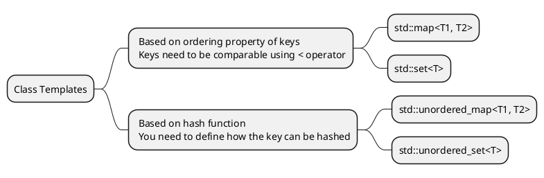
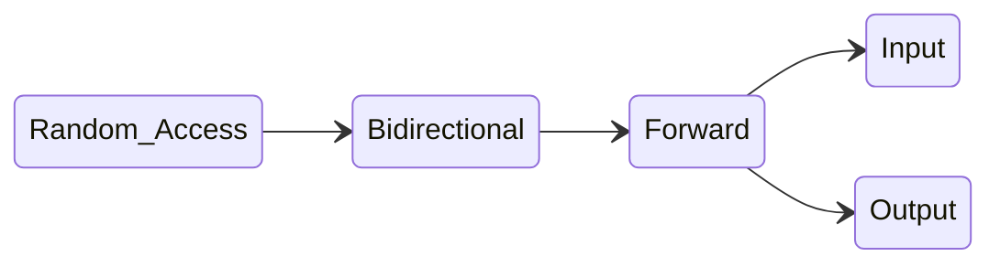

<show-structure for="chapter" depth="3"/>

# C++ Programming

## &#8544; C++ Fundamentals

### 1 C & C++ Introduction {id = "intro"}

<p><format color = "BlueViolet">Properties: </format></p>

<list type = "bullet">
<li>
<p>C/C++ is a <format color = "OrangeRed">compiled</format> language.</p>
</li>
<li>
<p>C/C++ <format style = "italic">compilers</format> map C/C++ programs
into architecture-specific machine code (string of 0s and 1s).</p>
<list type = "bullet">
<li>
<p>Unlike Java, which converts to architecture-independent bytecode (
run by JVM => Java Virtual Machine).</p>
</li>
<li>
<p>Unlike Python, which directly <format style = "italic">interprets
</format> the code.</p>
</li>
<li>
<p>Main difference is when your program is mapped to low-level machine
instructions, CPU will directly interprets and runs.</p>
</li>
</list>
</li>
</list>

<p><format color = "BlueViolet">Compilation Advantages: </format></p>

<list>
<li>
<p><format color = "Fuchsia">Excellent run-time performance: 
</format></p>
<p>Generally much faster than Python or Java for comparable code because
it <format color = "OrangeRed">optimizes for the given architecture
</format>.</p>
</li>
<li>
<p><format color = "Fuchsia">Fair compilation time: 
</format></p>
<p>Enhancements in compilation procedure (Makefiles) allow us to
<format color = "OrangeRed">recompile only the modified files</format>
.</p>
</li>
</list>

<p><format color = "BlueViolet">Compilation Advantages: </format></p>

<list type = "bullet">
<li>
<p>Compiled files, including the executable, are arcitecture-specific.
(CPU type and OS)</p>
<list type = "bullet">
<li>
<p>Executable must be <format color = "OrangeRed">rebuilt</format> 
on each new system.</p>
</li>
<li>
<p>i.e. "porting your code" to a new architecture.</p>
</li>
</list>
</li>
<li>
<p>Instead of "Edit -> Run [repeat]" cycle, "Edit -> Compile -> Run
[repeat]" iteration cycle can be slow.</p>
</li>
</list>

### 2 Streams

#### 2.1 Strings

```C++
std::string str = "Hello, World!";
std::cout << str[1] << std::endl; // e
str[1] = 'a'; // Hallo, World!

std::cout << "[" << std::setw(3) << "It" << "]" <<std::endl; // [ It]
std::cout << "[" << std::left << std::setw(3) << "It" << "]" <<std::endl; // [It ]
std::cout << "[" << std::left << std::setfill('-') << std::setw(3) << "It" << "]" <<std::endl; // [It-]
```

#### 2.2 Stringstreams

<list>
<li>
<p>Constructors with initialtext in the buffer.</p>
</li>
<li>
<p>Can optionally provide &quot;modes&quot; such as ate (start at end) or
bin (read as binary).</p>
</li>
</list>

##### 2.2.1 Output Stringstreams

```C++
std::ostringstream oss("Ito-En Green Tea");
std::cout << oss.str() << std::endl; // Ito-En Green Tea
oss << "16.9 Ounces";
std::cout << oss.str() << std::endl; // 16.9 Ouncesn Tea 

std::ostringstream oss("Ito-En Green Tea", std::ostringstream::ate);
oss << "16.9 Ounces";
std::cout << oss.str() << std::endl; // Ito-En Green Tea16.9 Ounces
```

##### 2.2.2 Input Stringstreams

<warning>
<p>Types matter! Stream stops reading at any whitespace or any invalid
character for the type.</p>
</warning>

```C++
std::istringstream iss("16.9 Ounces");
double amount;
std::string unit;
iss >> amount >> unit; // amount = 16.9, unit = Ounces

std::istringstream iss("16.9 Ounces");
int amount;
std::string unit;
iss >> amount >> unit; // amount = 16, unit = ".9"
```

##### 2.2.3 State Bits

<list>
<li>
<p><format color = "Fuchsia">Good bit</format> - ready for read
/write. (Nothing unusal, on when other bits are off)</p>
</li>
<li>
<p><format color = "Fuchsia">Fail bit</format> - previous 
operation failed, all future operations frozen. (Type mismatch, file 
can't be opened, seekg failed)</p>
</li>
<li>
<p><format color = "Fuchsia">EOF bit</format> - previous 
operation reached the end of buffer content (reached the end of buffer).
</p>
</li>
<li>
<p><format color = "Fuchsia">Bad bit</format> - external error,
like irrecoverable.(e.g. the file you are reading from suddenly is 
deleted)</p>
</li>
</list>

<note>
<p>Good and bad are not opposites! (e.g. type mismatch)</p>
<p>Good and fail are not opposites! (e.g. end of file)</p>
<p>Fail and EOF are normally the ones you will be checking.</p>
</note>

```C++
std::istringstream iss("17");
int amount;
iss >> amount;
std::cout << (iss.eof() ? "EOF" : "Not EOF") << std::endl;
// There also exist iss.good(), iss.fail() & iss.bad()
```

#### 2.3 cin and cout

<list type = "bullet">
<li>
<p>The program hangs and waits for user input when the position
reaches EOF, past the last token in the buffer.</p>
</li>
<li>
<p>The position pointer skips whitespace <format colo = "OrangeRed">after</format> 
the token with each &gt;&gt; operation.</p>
</li>
<li>
<p>The position pointer does the following:</p>
<list type = "bullet">
<li>
<p>consume all whitespaces (spaces, newlines, etc.)</p>
</li>
<li>
<p>reads as many characters until:</p>
<list type = "bullet">
<li>a whitespace is reached, or…</li>
<li>for primitives, the maximum number of bytes necessary to form a valid variable.</li>
<li>example: if we extract an int from “86.2”, we’ll get 86, with pos at the decimal point.</li>
</list>
</li>
</list>
</li>
</list>

### 3 Modern C++ Types

#### 3.1 Auto

<list type = "bullet">
<li>
<p>When a type name is too long and a simpler alias makes the
code more readable, use it.</p>
</li>
<li>
<p>In libraries there is a common name for a type within each
class. Example:</p>
<list tyep = "bullet">
<li>
<p>vector::iterator, map::iterator, string::iterator</p>
</li>
<li>
<p>vector::reference, map::reference, string::reference</p>
</li>
</list>
</li>
</list>

<warning>
<p>Auto discards const and references!</p>
</warning>

#### 3.2 Pair/Tuple

<p>A pair is simply two objects bundled together.</p>

<note>
<p>Remember to include &lt; utility &gt; and &lt; tuple &gt;</p>
</note>

```C++
    std::pair<double, int> price(3.4, 5);

    // make_pair/tuple (C++ 11) automatically deduces the type!
    auto prices = std::make_pair(3.4, 5);
    auto values = std::make_tuple(3, 4, "hi");

    // access via get/set
    prices.first = prices.second;           // prices = {5, 5}
    get<0>(values) = get<1>(values);  // values = {4, 4, "hi"}

    // structured binding (C++ 17) - extract each binding
    auto [a, b] = prices;       // a = 5, b = 5
    const auto& [c, d, e] = values; // c = 4, d = 4, e = "hi"
```

#### 3.3 Conversions

```C++
int v1 = static_cast<double>(3.14);
double v2 = 6;
```

```C++
const int v3 = 3;
int* v4 = const_cast<int*> (&v3);
```

#### 3.4 initializer_list

<p><format color = "BlueViolet">Definition</format>: An initializer 
list is a lightweight vector that can be used as a parameter.</p>

```C++
#include <iostream>
#include <vector>
#include <initializer_list>

class MyContainer {
private:
    std::vector<int> data; 

public:
    // Constructor using initializer_list
    MyContainer(std::initializer_list<int> values) {
        // Iterate through the initializer_list and populate the vector
        for (int value : values) {
            data.push_back(value);
        }
    }

    void print() const {
        for (int value : data) {
            std::cout << value << " ";
        }
        std::cout << std::endl;
    }
};

int main() {
    // Using initializer_list to initialize MyContainer
    MyContainer container1 = {1, 2, 3, 4, 5}; 
    container1.print();  

    MyContainer container2{6, 7, 8};
    container2.print(); 

    return 0;
}
```

<warning><p>C++ 11 provides a uniform initialization syntax. Using the uniform 
initialization syntax, the initializer list constructor is preferred 
over constructor.</p></warning>

```C++
std::vector<int> v1(3, 10) // v1 = {10, 10, 10}
std::vector<int> v2{3, 10} // v2 = {3, 10}
```

## &#8545; Standard Template Library (STL)

### 4 Containers

#### 4.1 Sequence Containers

<p><format color = "DarkOrange">Sequence Containers:</format> Containers
which provide access to sequences of elements.</p>

<list type = "bullet">
<li>
<p><code>std::vector&lt;T&gt;</code></p>
</li>
<li>
<p><code>std::deque&lt;T&gt;</code></p>
</li>
<li>
<p><code>std::array&lt;T&gt;</code></p>
</li>
<li>
<p><code>std::list&lt;T&gt;</code></p>
</li>
<li>
<p><code>std::forward_list&lt;T&gt;</code></p>
</li>
</list>

##### 4.1.1 Vector

<p><format color = "DarkOrange">Vector:</format> An array with 
changeable size.</p>

<table style = "both">
<tr><td></td><td><code>vec[index]</code></td><td><code>vec.at(index)
</code></td></tr>
<tr><td>Bounds Checking</td><td>No</td><td>Yes</td></tr>
<tr><td>Speed</td><td>Fast</td><td>Slow</td></tr>
</table>

<warning>
<p>If you write your program <format color = "GreenYellow">correctly
</format>, bounds checking will just <format color = "OrangeRed">slow
</format> you down.</p>
</warning>

<p><format color = "BlueViolet">Advantages:</format> </p>

<list>
<li>
<p>Fast, lightweight & intuitive.</p>
</li>
<li>
<p>Grow efficiently <format color = "GreenYellow">in one direction
</format>.</p>
</li>
</list>

<p><format color = "BlueViolet">Disadvantages:</format> </p>

<list>
<li>
<p>cannot push_front!</p>
</li>
</list>

##### 4.1.2 Deque

<p><format color = "DarkOrange">Deque:</format> A deque is a doubly 
ended queue.</p>

<p><format color = "BlueViolet">Implementation:</format> </p>
<p>Instead of storing all elements in a single contiguous block, deque 
internally manages a collection of fixed-size arrays called "chunks" 
or "buffers."</p>
<p>Deque maintains a dynamic array (usually a small array or a 
tree-like structure) called a "map" or "central index". This map stores
pointers to the beginning of each chunk.</p>

<p><format color = "BlueViolet">Advantages:</format> </p>

<list>
<li>
<p>Can push_front!</p>
</li>
</list>

<p><format color = "BlueViolet">Disadvantages:</format> </p>

<list>
<li>
<p>For other operations, vector outperform deque.</p>
</li>
</list>

#### 4.2 Container Adapters

<list type = "alpha-lower">
<li>
<p><format color = "Fuchsia">Stacks:</format> </p>
    <list type = "bullet">
    <li>
    <p>The standard containers <code>std::vector</code>, <code>
    std::deque</code>, <code>std::list</code> satisfy these 
    requirements.</p>
    </li>
    <li>
    <p>Just limit the functionality of a vector/deque to only allow
    <code>push_back</code> and <code>pop_back</code>.</p>
    </li>
    </list>
</li>
<li>
<p><format color = "Fuchsia">Queues:</format> </p>
    <list type = "bullet">
    <li>
    <p>The standard containers <code>std::deque</code> and <code>
    std::list</code> satisfy these requirements.</p>
    </li>
    <li>
    <p>Just limit the functionality of a deque to only allow <code>
    push_back</code> and <code>pop_front</code>.</p>
    </li>
    </list>
</li>
</list>

#### 4.3 Associative Containers

<p><format color = "DarkOrange">Associative containers:</format> Data is
accessed using the <format color = "OrangeRed">key</format> instead of
index.</p>



#### 4.4 Iterators

<p><format color = "BlueViolet">Four iterator operations:</format> </p>

<list type = "bullet">
<li>
<p><format color = "Fuchsia">Create iterator:</format> </p>
<p><code>std::set&lt;int&gt;::iterator iter = mySet.begin()</code></p>
</li>
<li>
<p><format color = "Fuchsia">Dereference iterator to read value 
currently pointed to:</format> </p>
<p><code>int val = *iter</code></p>
</li>
<li>
<p><format color = "Fuchsia">Advance iterator:</format> </p>
<p><code>iter++</code>; or <code>++iter</code></p>
</li>
<li>
<p><format color = "Fuchsia">Compare against another iterator</format> 
(especially <code>.end()</code> iterator)</p>
</li>
</list>

<p><format color = "BlueViolet">Map Iterators:</format> </p>

```C++
    map<int, int> m;
    map<int, int>::iterator i = m.begin();
    map<int, int>::iterator end = m.end();
    while (i != end) {
        cout << (*i).first << " " << (*i).second << endl;
        i++;
    }
```



##### 4.4.1 Input Iterators

<p>For sequential, single-pass input.</p>

<p>Read only, i.e. can only be dereferenced on <format color = 
"OrangeRed">right</format> side of expression.</p>

```C++
vector<int>::iterator iter = myVector.begin();
int val = *iter;
```

##### 4.4.2 Output Iterators

<p>For sequential, single-pass output.</p>

<p>Read only, i.e. can only be dereferenced on <format color = 
"OrangeRed">left</format> side of expression.</p>

```C++
vector<int>::iterator iter = myVector.begin();
*iter = 5;
```

##### 4.4.3 Forward Iterators

<p>Combines input and output, plus can make multiple passes.</p>

<p>Can read from and write to (if not const iterator).</p>

```C++
// multiple passes
vector<int>::iterator iter1 = myVector.begin();
vector<int>::iterator iter2 = myVector.begin();
iter1++;
iter2++;
if (iter1 == iter2) { cout << "Equal" << endl; } // Equal
```

##### 4.4.4 Bidirectional Iterators

<p>Same as forward iterators, plus can go backwards with the decrement
operator (--).</p>

<p><format color = "BlueViolet">Use cases:</format> <code>std::map
</code>, <code>std::set</code>, <code>std::list</code></p>

##### 4.4.5 Random Access Iterators

<p>Same as bidirectional iterators, plus can be implemented or 
decremented by arbitrary amounts using + and -.</p>

<p><format color = "BlueViolet">Use cases:</format> <code>std::vector
</code>, <code>std::deque</code>, <code>std::string</code></p>

### 5 Templates

#### 5.1 Template Functions

```C++
template <typename T>
std::pair<T, T> my_minmax(T a, T b) {
    if (a < b) return {a, b};
    else return {b, a};
}
```

<p>The following code: </p>

```C++
my_minmax(cout, cout);
```

<p><format color = "Fuchsia">Semantic error:</format> you can’t call 
operator &lt; on two streams.</p>

<p><format color = "Fuchsia">Conceptual error:</format> you can’t 
find the min or max of two streams.</p>

<p>The compiler deduces the types and literally replaces the types.
Compiler will produce semantic errors, not conceptual error.</p>

```C++
template <typename Collection, typename DataType>
int countOccurences(const Collection& list, DataType val) {
    int count = 0;
    for (size_t i = 0; i < list.size(); ++i) {
        if (list[i] == val) ++count;
    }
    return count;
}
```

<p>Problem lies in indexing <code>list[i]</code>.</p>

```C++
template <typename Collection, typename DataType>
int countOccurences(const Collection& list, DataType val) {
    int count = 0;
    for (auto iter = list.begin(); iter != list.end(); ++iter) {
        if (*iter == val) ++count;
    }
    return count;
}
```

<p>Or: </p>

```C++
template <typename Collection, typename DataType>
int countOccurences(const Collection& collection, const DataType& val) {
    int count = 0;
    for (const auto& element : collection) {
        if (element == val) {
            ++count;
        }
    }
    return count;
}
```

### 6 Functions and Algorithms

#### 6.1 Lambda Functions {id = "Lambda"}

```C++
auto isLessThanLimit = [limit](auto val) -> bool {
    return val < limit;
};
```

<list>
<li>
<p><code>auto</code>: We don't know the type, ask compiler.</p>
</li>
<li>
<p><code>[limit]</code>: Capture clause, gives access to outside 
variables.</p>
</li>
<li>
<p><code>(auto)</code>: Parameter list, can use auto!</p>
</li>
<li>
<p><code>-> bool</code>: Return type, optional.</p>
</li>
</list>

<p>Two types of capture clause: By reference or by value.</p>

```C++
// capture all by value, except teas is by reference 
auto func1 = [=, &teas](parameters) -> return-value {   
    // body 
};

// capture all by reference, except banned is by value 
auto func2 = [&, banned](parameters) -> return-value {   
    // body 
};
```

<tip>
<p><code>std::function&lt;R(Args…)&gt;</code> is a generic 
wrapper for all things callable.</p>
<code-block lang = "C++">
int add(int a, int b) { 
    return a + b; 
}
int main() {
    std::function&lt;int(int, int)&gt; func; // initially empty
    func = add; // Assign a regular function
    std::cout &lt;&lt; func(2, 3) &lt;&lt; std::endl; // Output: 5
    func = [](int a, int b) { return a * b; }; // Reassign a lambda
    std::cout &lt;&lt; func(2, 3) &lt;&lt; std::endl; // Output: 6
    return 0;
}
</code-block>
<p>In this context, <code>std::function&lt;int(int, int)&gt;</code> can 
store any callable object as long as it matches the signature.</p>
<p><format color = "BlueViolet">Benefit: </format></p>
<list type = "alpha-lower">
<li>
<p><format color = "Fuchsia">Type Erasure for Flexibility:</format> It 
lets you work with different callable objects through a common 
interface. You can pass <code>std::function</code> objects to functions
or store them in data structures without knowing the exact type of the
underlying callable.</p>
</li>
<li>
<p><format color = "Fuchsia">Enables Polymorphism with Callables:
</format> You can have a function that accepts a std::function as a 
parameter, allowing it to work with different lambda functions or other
callable types at runtime.</p>
</li>
</list>
</tip>

<p><code>std::bind</code> adapts existing function objects to create new 
ones with specific argument values pre-filled.</p>

```C++
int multiplyAndAdd(int a, int b, int c) {
    return (a * b) + c;
}

int main() {
    auto operation = std::bind(multiplyAndAdd, std::placeholders::_1, 
                                std::placeholders::_2, 4);
    std::cout << operation(2, 3) << std::endl; // Output: 10 ((2*3) + 4)
}
```

<list type = "bullet">
<li>
<p><code>std::placeholders::_1</code> means "take the first argument 
passed to operation".</p>
</li>
<li>
<p><code>std::placeholders::_2</code> means "take the second argument 
passed to operation".</p>
</li>
<li>
<p>4 is the third argument of <code>multiplyAndAdd</code>.</p>
</li>
</list>

<warning>
<p>Lambdas provide a convenient and expressive way to define objects 
that behave like functions. => Lambdas are a type of function object.
</p>
</warning>

#### 6.2 Algorithms

##### 6.2.1 std::sort

<p><format color = "BlueViolet">Syntax:</format> </p>

```C++
#include <algorithm> // Required header

// 1. Basic Usage (Sorting using < operator)
template <class RandomAccessIterator>
void sort(RandomAccessIterator first, RandomAccessIterator last);

// 2. Custom Comparison Function 
template <class RandomAccessIterator, class Compare>
void sort(RandomAccessIterator first, RandomAccessIterator last, Compare comp); 
```

<p><format color = "BlueViolet">Example usage:</format> </p>

```C++
std::vector<int> numbers = {3, 1, 4, 1, 5};
std::sort(numbers.begin(), numbers.end()); // Sort the entire vector

std::sort(numbers.begin(), numbers.end(), std::greater<int>()); // Sort in descending order
```

<p>Parameters: </p>

<list type = "decimal">
<li>
<p>first (iterator): An iterator pointing to the beginning of the range
you want to sort.</p>
</li>
<li>
<p>last (iterator): An iterator pointing to one position past the end 
of the range to be sorted.</p>
</li>
<li>
<p>comp (comparison function) (optional): A binary function (takes two
arguments) that defines the sorting criterion. It should return true if
the first argument should come before the second in the sorted order,
and false otherwise.</p>
</li>
</list>

<p><format color = "BlueViolet">Important notes:</format> </p>

<list type = "bullet">
<li>
<p>You can sort a portion of the entire vector, array, etc.</p>
<code-block>
std::vector&lt;int&gt; data = {5, 2, 8, 1, 9, 3};
std::sort(data.begin(), data.begin() + 4); // Result: data = {1, 2, 5, 8, 9, 3}
</code-block>
</li>
<li>
<p>You can overload operator &lt; to define default sorting behavior.
</p>
<code-block lang = "C++">
struct Item {
    int id;
    std::string name;
};
// Stable Comparison
bool compareByNameStable(const Item& a, const Item& b) {
    if (a.name == b.name) {
        return a.id &lt; b.id; // Keep original order based on 'id' if names are equal
    }
    return a.name &lt; b.name;
}
int main() {
    std::vector&lt;Item&gt; items = {
        {1, "Apple"},
        {2, "Banana"},
        {3, "Apple"} 
    };
    std::sort(items.begin(), items.end(), compareByNameStable);
}
</code-block>
</li>
<li>
<p>Average case: <math>O(N \log N)</math></p>
</li>
</list>

##### 6.2.2 std::nth_element

<p><format color = "BlueViolet">Syntax:</format> </p>

```C++
#include <algorithm>

template <class RandomAccessIterator>
void nth_element (RandomAccessIterator first, RandomAccessIterator nth, 
                  RandomAccessIterator last);

// Optional: You can provide a custom comparison function
template <class RandomAccessIterator, class Compare>
void nth_element (RandomAccessIterator first, RandomAccessIterator nth,
                  RandomAccessIterator last, Compare comp);
```

<p><format color = "BlueViolet">Example usage:</format> </p>

```C++
std::vector<int> numbers = {5, 2, 8, 1, 9, 3};

std::nth_element(numbers.begin(), numbers.begin() + 2, numbers.end());
// Output: 2 1 3 8 9 5 (The element at index 2 is now '3', 
//          which is the 3rd smallest, but the rest are not sorted)
```

<p><format color = "BlueViolet">Parameters:</format> </p>

<list type = "decimal">
<li>
<p>first: Iterator to the beginning of the range.</p>
</li>
<li>
<p>nth: Iterator pointing to the position you want the nth element to
be placed in.</p>
</li>
<li>
<p>last: Iterator to one past the end of the range.</p>
</li>
<li>
<p>comp (optional): A binary comparison function, similar to 
std::sort.</p>
</li>
</list>

<p><format color = "BlueViolet">Important notes:</format> </p>

<list type = "bullet">
<li>
<p>With this, you can efficiently find the median of a dataset without
fully sorting it, or determine the <math>k ^ {\text{th}}</math> 
smallest or largest element.</p>
</li>
<li>
<p>It sorts so <math>n ^ {\text{th}}</math> element is in correct 
position, and all elements smaller to left, larger to right, but the 
elements before the <math>n ^ {\text{th}}</math> element are not 
guaranteed to be sorted among themselves, and neither are the elements
after it.</p>
</li>
<li>
<p>Average case: <math>O(N)</math></p>
</li>
</list>

##### 6.2.3 std::stable_partition

<p><format color = "BlueViolet">Syntax:</format> </p>

```C++
#include <algorithm> // Required header

template <class BidirectionalIterator, class UnaryPredicate>
BidirectionalIterator stable_partition (BidirectionalIterator first,
                                       BidirectionalIterator last, 
                                       UnaryPredicate pred); 
```

<list type = "decimal">
<li>
<p>BidirectionalIterator: A template parameter indicating the type of 
iterators used. These iterators must support bidirectional movement 
(like those from std::list, std::vector, std::deque).</p>
</li>
<li>
<p>first (BidirectionalIterator): An iterator to the beginning of the 
range you want to partition.</p>
</li>
<li>
<p>last (BidirectionalIterator): An iterator to one past the end of 
the range to be partitioned.</p>
</li>
<li>
<p>UnaryPredicate: A template parameter representing the type of the 
predicate function.</p>
</li>
<li>
<p>pred (UnaryPredicate): A function that takes a single argument (an 
element from the range) and returns a bool:</p>
</li>
<li>
    <list type = "bullet">
    <li>
    <p>true: The element satisfies the partitioning criterion.</p>
    </li>
    <li>
    <p>false: The element does not satisfy the criterion.</p>
    </li>
    </list>
</li>
</list>

##### 6.2.4 std::copy_if

<p><format color = "BlueViolet">Syntax:</format> </p>

```C++
#include <algorithm> // Required header

template <class InputIterator, class OutputIterator, class UnaryPredicate>
OutputIterator copy_if (InputIterator first, InputIterator last,
                        OutputIterator result, UnaryPredicate pred);
```

<list type = "decimal">
<li>
<p>InputIterator: Type of iterator used for the input range.</p>
</li>
<li>
<p>OutputIterator: Type of iterator used for the output range (where copied elements go).</p>
</li>
<li>
<p>first (InputIterator): An iterator to the beginning of the input range.</p>
</li>
<li>
<p>last (InputIterator): An iterator to one past the end of the input range.</p>
</li>
<li>
<p>result (OutputIterator): An iterator to the beginning of the output range.</p>
</li>
<li>
<p>UnaryPredicate: Type of the predicate function.</p>
</li>
<li>
<p>pred (UnaryPredicate): A function that takes a single argument (an element from the input range) and returns:</p>
</li>
<li>
    <list type = "bullet">
    <li>
    <p>true: Copy the element to the output range.</p>
    </li>
    <li>
    <p>false: Skip the element.</p>
    </li>
    </list>
</li>
</list>

##### 6.2.5 std::remove_if

<p><format color = "BlueViolet">Syntax:</format> </p>

```C++
#include <algorithm> // Required header

template <class ForwardIterator, class UnaryPredicate>
ForwardIterator remove_if (ForwardIterator first, ForwardIterator last,
                           UnaryPredicate pred);
```

<list type = "decimal">
<li>
<p>ForwardIterator: Type of iterator used for the range. Must support 
forward movement.</p>
</li>
<li>
<p>first (ForwardIterator): An iterator to the beginning of the range.
</p>
</li>
<li>
<p>last (ForwardIterator): An iterator to one past the end of the range
.</p>
</li>
<li>
<p>UnaryPredicate: Type of the predicate function.</p>
</li>
<li>
<p>pred (UnaryPredicate): A function that takes a single argument (an
element from the range) and returns:</p>
</li>
<li>
    <list type = "bullet">
    <li>
    <p>true: The element should be &quot;removed.&quot;</p>
    </li>
    <li>
    <p>false: The element should be kept.</p>
    </li>
    </list>
</li>
</list>


## &#8546; Object-Oriented Programming

### 3. Inheritance

<p><format color = "BlueViolet">Definition:</format> </p>

<list>
<li>
<p><format color = "DarkOrange">Hypernym</format>: A word with a broad 
meaning constituting a category into which words with more specific 
meanings fall.</p>
</li>
<li>
<p><format color = "DarkOrange">Hyponym</format>: Opposite of hypernym.
</p>
</li>
</list>

<p>For example, tree is hyponym of plant, and plant is hypernym of 
tree.</p>

#### 3.1 Overriding and Overloading

<p><format color = "BlueViolet">Definition:</format> </p>

<list type = "bullet">
<li>
<p><format color = "DarkOrange">Overloading</format>: Methods with the
same name but different signature.</p>
</li>
<li>
<p><format color = "DarkOrange">Overriding</format>: A subclass to 
provide a specific implementation of a method that is already provided 
by its parent class or interface.</p>
</li>
</list>

<note>
<p>This is an implementation of overloading in the same class.</p>
</note>

Java

```Java
    // part of code from Quicksort
    public static void sort(Comparable[] a) {
        sort(a, 0, a.length - 1);
    }

    private static void sort(Comparable[] a, int lo, int hi) {
        if (hi <= lo) return;
        int j = partition(a, lo, hi);
        sort(a, lo, j - 1);
        sort(a, j + 1, hi);
    }
```

<note>
<p>This is an implementation of overloading in different classes.</p>
</note>

Java

```Java
class Shape {
    public void calculateArea(int side) { 
        System.out.println("Area of a square: " + (side * side)); 
    }
}

class Rectangle extends Shape {
    public void calculateArea(int length, int width) {
        System.out.println("Area of a rectangle: " + (length * width));
    }
}

public class Main {
    public static void main(String[] args) {
        Rectangle myRectangle = new Rectangle();

        myRectangle.calculateArea(5);      // Calls Shape's calculateArea (inherited)
        myRectangle.calculateArea(4, 6);  // Calls Rectangle's calculateArea (overloaded)
    }
}
```

<note>
<p>This is an implementation of overriding.</p>
</note>

Java

```Java
interface Animal { 
    void makeSound(); // Abstract method declaration
}

class Dog implements Animal { // Implementing the interface
    @Override
    public void makeSound() {
        System.out.println("Woof!");
    }
}

class Cat implements Animal { // Implementing the interface
    @Override
    public void makeSound() {
        System.out.println("Meow!");
    }
}

public class Main {
    public static void main(String[] args) {
        Animal myDog = new Dog();       
        Animal myCat = new Cat();       

        myDog.makeSound();    // Output: Woof!
        myCat.makeSound();    // Output: Meow!
    }
}
```

<tip>
<p>For Java, better use <code>@Override</code> !</p>
<p><format color = "BlueViolet">Reasons:</format> </p>
<list type = "bullet">
<li>
<p><format color = "Fuchsia">Protect against typos:</format> If 
you say <code>@Override</code>, but the method isn't actually overriding 
anything, you will get a compile error.</p>
</li>
<li>
<p><format color = "Fuchsia">Reminder:</format> Reminds programmer
that method definition came from somewhere higher up in the inheritance
hierarchy.</p>
</li>
</list>
</tip>

#### 3.2 Types of Inheritance (Java)

<list type = "alpha-lower">

<li>
<p><format color = "DarkOrange">Interface Inheritance: </format></p>
<p>Specifying the capabilities of a subclass using the 
<code>implements</code> keyword is known as 
<format style = "underline, bold">interface inheritance</format>.</p>

<list type = "bullet">
<li>
<p><format color = "DarkOrange">Interface:</format> The list of all 
method signatures.</p>
</li>
<li>
<p><format color = "DarkOrange">Inheritance:</format> The subclass 
"inherits" the interface from a superclass.</p>
</li>
<li>
<p>Specifies what the subclass can do, but not how.</p>
</li>
<li>
<p>Subclasses <format style = "underline">must</format> override all
of these methods, will fail to compile otherwise!</p>
</li>
</list>
</li>

<li>
<p><format color = "DarkOrange">Implementation Inheritance:</format> 
Subclasses can inherit signatures AND implementation.</p>
</li>

</list>

Java

```Java
interface Animal {
    default void makeSound() {
        System.out.println("Generic animal sound");
    }

    void eat(); 
}

class Dog implements Animal {
    @Override
    public void eat() {
        System.out.println("Dog is eating");
    }
}

class Cat implements Animal {
    @Override
    public void eat() {
        System.out.println("Cat is eating");
    }

    @Override
    public void makeSound() {
        System.out.println("Meow!");
    }
}

public class Main {
    public static void main(String[] args) {
        Dog myDog = new Dog();
        Cat myCat = new Cat();

        myDog.makeSound(); // Output: Generic animal sound (using default)
        myDog.eat();      // Output: Dog is eating

        myCat.makeSound(); // Output: Meow! (overridden)
        myCat.eat();      // Output: Cat is eating
    }
}
```

<table style = "header-row">
<tr><td>Compile-time Type</td><td>Run-time Type</td></tr>
<tr><td>Static type, specified at <format style = "bold">declaration
</format></td><td>Dynamic type, specified at <format style = "bold">
instantiation</format></td></tr>
<tr><td>Never changes</td><td>Equal to the type of object being pointed
at</td></tr>
</table>

#### 3.3 

## &#8547; Modern C++
