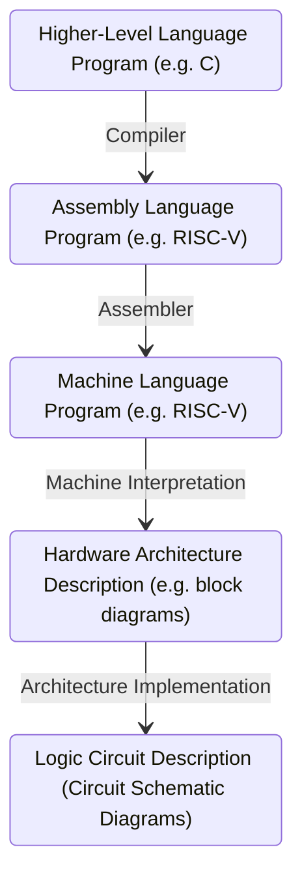
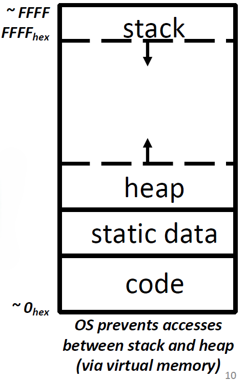
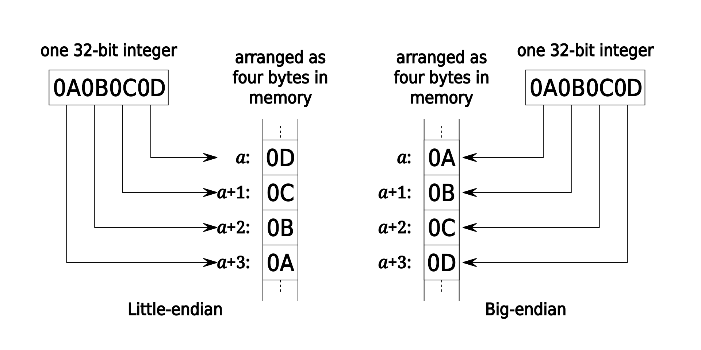

<show-structure for="chapter" depth="3"></show-structure>

# Computer Architecture

## &#8544; C Programming

### 1 Introduction to C

For this part, please refer to <a href = "C-Programming.md" 
anchor = "intro" summary = "C++ Introduction">introduction in
C++ programming</a> for more details.

### 2 C Memory Layout

Program's <format color = "OrangeRed" style = "italic">address space
</format> contains 4 regions: 

<list>
<li>

<format color = "Fuchsia">Stack:</format> local variables,
grow downwards.

</li>
<li>

<format color = "Fuchsia">Heap:</format> space requested via
<code>malloc()</code> and used with pointers; resizes dynamically, 
grow upward.

</li>
<li>

<format color = "Fuchsia">Static Data:</format> global or
static variables, does not grow or shrink.

</li>
<li>

<format color = "Fuchsia">Code:</format> loaded when program 
starts, does not change.

</li>
</list>

<format color = "DodgerBlue">Storage:</format> 

<list>
<li>

<format color = "Fuchsia">Declared outside a function:
</format> Static Data

</li>
<li>

<format color = "Fuchsia">Declared inside a function:
</format> Stack

<list type = "bullet">
<li>

<code>main()</code> is a function.

</li>
<li>

freed when function returns.

</li>
</list>
</li>
<li>

<format color = "Fuchsia">Dynamically allocated (i.e., 
<code>malloc</code>, <code>calloc</code> & <code>realloc</code>):
</format> Heap.

</li>
</list>

#### 2.1 Stack

<list type = "bullet">
<li>

A stack frame includes: 

<list type = "bullet">
<li>

Location of caller function

</li>
<li>

Function arguments

</li>
<li>

Space for local variables

</li>
</list>
</li>
<li>

Stack pointer (SP) tells where lowest (current) stack frame is.

</li>
<li>

When procedure ends, stack pointer is moved back (but data remains
(<format color = "OrangeRed">garbage!</format>)); frees memory for 
future stack frames;

</li>
</list>

#### 2.2 Static Data

<list type = "bullet">
<li>

Place for variables that persist, and data doesn't subject to 
comings and goings like function calls, e.g. string literals,
global variables.

</li>
<li>

String literal example: <code>char * str = “hi”</code>.

</li>
<li>

Size does not change, but sometimes data can be writable.

</li>
</list>

<warning>

String literals cannot change!

</warning>

#### 2.3 Code

<list type = "bullet">
<li>

Copy of your code goes here, C code becomes data too!

</li>
<li>

Does (should) not change, typically read-only.

</li>
</list>

#### 2.4 Addressing & Endianness

<format color = "DodgerBlue">Addresses:</format> 

<list type = "bullet">
<li>

The size of an address (and thus, the size of a pointer) in bytes
depends on architecture. For 64-bit system, the size of an address is 8 
bytes, and the system has <math>2 ^ {64}</math> possible addresses.

</li>
<li>

If a machine is <format style = "bold">byte-addressed</format>, 
then each of its addresses points to a unique <format style = "bold">
byte</format>.

</li>
</list>

<format color = "DodgerBlue">Endianness:</format> 

<list type = "bullet">
<li>

<format color = "Chartreuse">Big Endian:</format> Descending 
numerical significance with ascending memory addresses.

</li>
<li>

<format color = "Chartreuse">Little Endian:</format> Ascending 
numerical significance with ascending memory addresses.

</li>
</list>

<warning>

Endianess ONLY APPLIES to values that occupy multiple bytes.

Endianness refers to STORAGE IN MEMORY NOT number representation.

</warning>

#### 2.5 Heap

Dynamically allocated memory goes on the 
<format color = "OrangeRed">Heap</format>, more permanent and 
persistent than Stack.

<list type = "alpha-lower">
<li>
    
<format color = "Fuchsia">malloc(n)</format>

    <list type = "bullet">
    <li>
    
Allocates a continuous block of <format style = "bold, italic">
    n bytes</format> of uninitialized memory (contains garbage!)

    </li>
    <li>
    
Returns a pointer to the beginning of an allocated block; NULL 
    indicates failed request (check for this!)

    </li>
    <li>
    
<code>int *p = (int *) malloc(n * sizeof(int))</code>

    </li>
    <li>
    
<code>sizeof()</code> makes code more portable.

    </li>
    <li>
    
<code>malloc()</code> returns <code>void *</code>; typecast
    will help you catch coding errors when pointer types don't match.
    

    </li>
    </list>
</li>
<li>

<format color = "Fuchsia">calloc(n, size)</format>

    <list type = "bullet">
    <li>
    
<code>void* calloc(size_t nmemb, size_t size)</code>

    </li>
    <li>
    
nmemb is the number of the members

    </li>
    <li>
    
size is the size of each member

    </li>
    <li>
    
Example for allocating space for 5 integers.

    <code-block lang = "C++">
    int *p = (int*)calloc(5, sizeof(int));
    </code-block>
    </li>
    </list>
</li>
<li>

<format color = "Fuchsia">realloc()</format>

    <list type = "bullet">
    <li>
    
Use it when you need more or less memory in an array.

    </li>
    <li>
    
<code>void *realloc(void *ptr, size_t size)</code>

    </li>
    <li>
    
Takes in a ptr that has been the return of malloc/calloc/realloc
    and a new size.

    </li>
    <li>
    
Returns a pointer with now size space (or NULL) and copies any 
    content from ptr.

    </li>
    <li>
    
Realloc can move or keep the address same, so DO NOT rely on old
    ptr values.

    </li>
    </list>
</li>
<li>

<format color = "Fuchsia">free()</format>

    <list type = "bullet">
    <li>
    
Release memory on the heap: Pass the pointer p to the 
    beginning of allocated block; releases the whole block.

    </li>
    <li>
    
p must be the address <format style = "italic">originally
    </format> returned by m/c/realloc(), otherwise throws system 
    exception.

    </li>
    <li>
    
Don't call <code>free()</code> on a block that has already been
    released or on NULL.

    </li>
    <li>
    
Make sure you don't lose the original address.

    </li>
    </list>
</li>
</list>

## &#8545; Assembly Language

### 3 Introduction to Assembly Language

<format color = "Chartreuse">Assembly:</format> (also known as 
Assembly language, ASM) A low-level programming language where the 
program instructions match a particular architecture's operations.

<format color = "DodgerBlue">Properties:</format> 

<list type = "bullet">
<li>

Splits a program into many small instructions that each do one 
single part of the process.

</li>
<li>

Each architecture will have a different set of operations that it 
supports (although there are similarities).

</li>
<li>

Assembly is not <format style = "italic">portable</format> to other
architectures.

</li>
</list>

<format color = "DodgerBlue">Complex/Reduced Instruction Set 
Computing</format>

<list type = "alpha-lower">
<li>

Early trend - add more and more instructions to do elaborate 
operations

<format color = "Fuchsia">Complex Instruction Set Computing (CISC)
</format>

    <list type = "bullet">
    <li>
    
Difficult to learn and comprehend language

    </li>
    <li>
    
Less work for the compiler

    </li>
    <li>
    
Complicated hardware runs more slowly

    </li>
    </list>
</li>
<li>

Opposite philosophy later began to dominate

<format color = "Fuchsia">Reduced Instruction Set Computing (RISC)
</format>

    <list type = "bullet">
    <li>
    
Simple (and smaller) instruction set makes it easier to build 
    fast hardware.

    </li>
    <li>
    
Let software do the complicated operations by composing simpler 
    ones.

    </li>
    </list>
</li>
</list>
