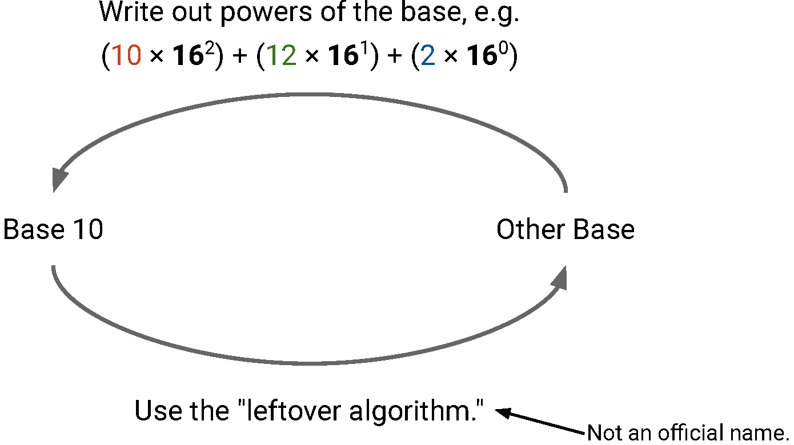
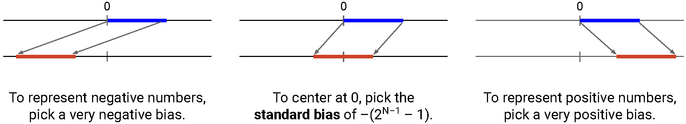
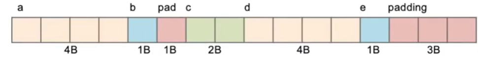
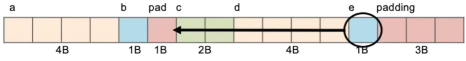
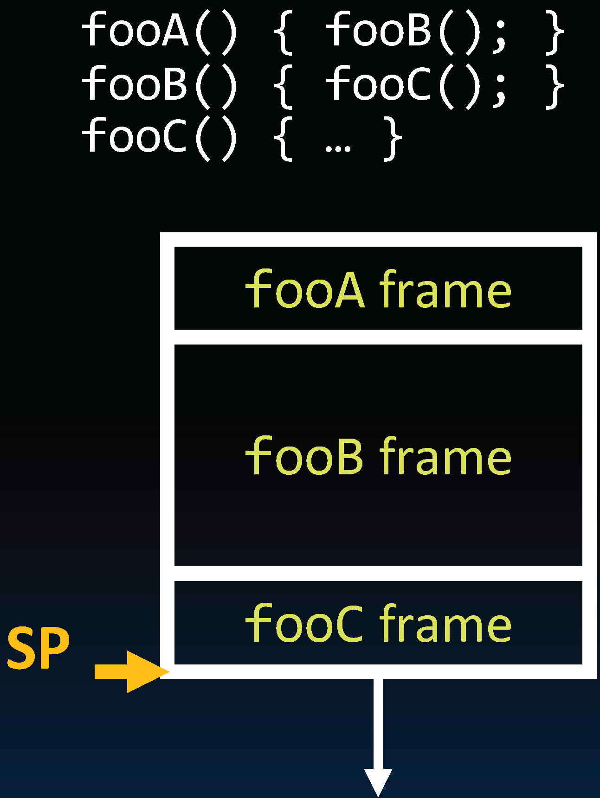
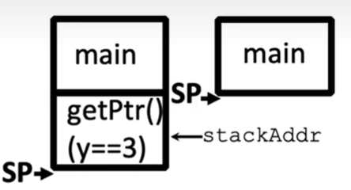
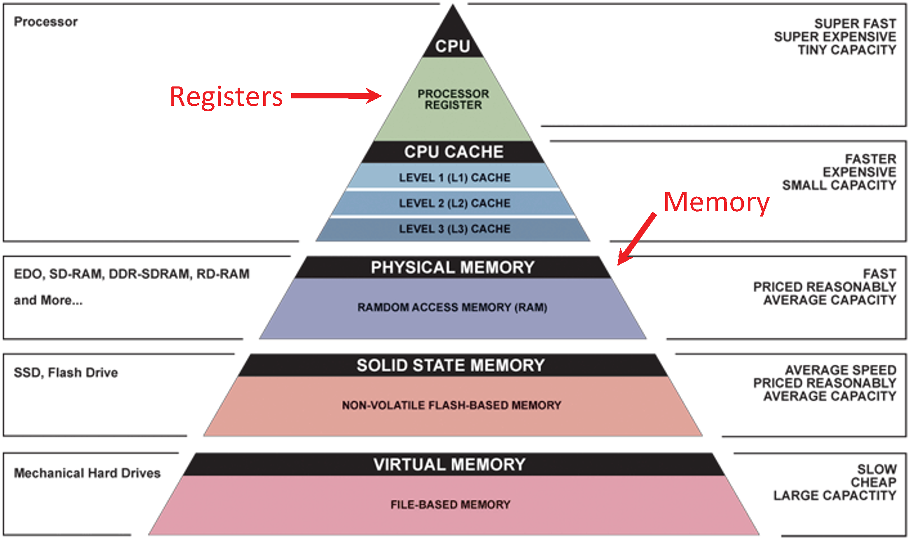

<show-structure for="chapter" depth="3"></show-structure>

# Computer Architecture

## &#8544; C Programming

### 1 Introduction to C

<note>

For this part, please refer to <a href="C-Programming.md" 
anchor="intro" summary="C++ Introduction">introduction in
C++ programming</a>.

</note>

#### 1.1 Number Base

<format color="BlueViolet">Commonly Used Number Bases:</format> 

<list type="bullet">
<li>
    
<format color="Fuchsia">Decimal (base 10)</format>

    <list type="bullet">
    <li>
        
<format color="LawnGreen">Symbols:</format> 0, 1, 2, 3, 4,
        5, 6, 7, 8, 9

    </li>
    <li>
        
<format color="LawnGreen">Notation:</format> <math>
        9472_{10} = 9472</math>

    </li>
    <li>
        
Understandable by humans.

    </li>
    </list>
</li>
<li>
    
<format color="Fuchsia">Binary (base 2)</format>

    <list type="bullet">
    <li>
        
<format color="LawnGreen">Symbols:</format> 0, 1

    </li>
    <li>
        
<format color="LawnGreen">Notation:</format> <math>
        101011_{2} = 0\text{b}101011</math>

    </li>
    <li>
        
Converting numbers to base 2 lets us represent numbers as 
        bits!

    </li>
    </list>
</li>
<li>
    
<format color="Fuchsia">Hexadecimal (base 16)</format>

    <list type="bullet">
    <li>
        
<format color="LawnGreen">Symbols:</format> 0, 1, 2, 3, 4,
        5, 6, 7, 8, 9, A, B, C, D, E, F

    </li>
    <li>
        
<format color="LawnGreen">Notation:</format> <math>
        2\text{A}5\text{D}_{16} = 0\text{x}22400</math>

    </li>
    <li>
        
A convenient shorthand for writing long sequences of bits.

    </li>
    </list>
</li>
</list>

<format color="BlueViolet">Group of bits:</format> 

<list type="bullet">
<li>
    
1 byte = 8 bits&nbsp;&nbsp;&nbsp;&nbsp;2 hex digits&nbsp;
    <math>2^{8}=256</math> different values

</li>
<li>
    
1 nibble = 4 bits&nbsp;1 hex digit&nbsp;&nbsp;&nbsp;<math>
    2^{4}=16</math> different values

</li>
</list>

<format color="BlueViolet">Conversions from ten to other bases:
</format> The leftover algorithm

<list type="bullet">
<li>
    
Check the powers of the base. For base-4: 256, 64, 16, 4, 1.

</li>
<li>
    
How many multiples of 64 fit in my number (73)?

    
<math>73 – 64 = 9</math> left over.

</li>
<li>
    
How many multiples of 16 fit in my remaining number (9)?

    
Still 9 left over.

</li>
<li>
    
How many multiples of 4 fit in my remaining number (9)?

    
<math>9 – (2 \times 4) = 1</math> left over.

</li>
<li>
    
How many multiples of 1 fit in my remaining number (1)?

    
<math>1 – 1 = 0</math> left over, which means we're done!

</li>
</list>

Converting from base 10 to base 2 will create unsigned integers.

<format color="BlueViolet">N-bit unsigned integers:</format> 

<list type="bullet">
<li>
    
Can represent <math>2N</math> different numbers.

</li>
<li>
    
<format color="Fuchsia">Smallest number:</format> <math>
    0\text{b}0000...000</math> represents <math>0</math>.

</li>
<li>
    
<format color="Fuchsia">Largest number:</format> <math>
    0\text{b}1111...111</math> represents <math>2N – 1</math>.

</li>
</list>

<format color="BlueViolet">Overflow:</format> 

<list type="bullet">
<li>
    
<format color="Fuchsia">Overflow:</format> 11111111 + 
    00000001 = 00000000.

</li>
<li>
    
<format color="Fuchsia">Negative overflow:</format> 
    00000001 – 00000010 = 11111111.

</li>
</list>

<format color="BlueViolet">Conclusion:</format> 

<table style="header-row">
<tr>
    <td colspan="2">Unsigned Integer</td>
</tr>
<tr>
    <td>Can represent negative numbers</td>
    <td>&chi;</td>
</tr>
<tr>
    <td>Doing math is easy</td>
    <td>&checkmark;</td>
</tr>
<tr>
    <td>Every bit sequence represents a unique number</td>
    <td>&checkmark;</td>
</tr>
</table>

#### 1.2 Signed Integers

<format color="BlueViolet">Idea:</format> Use the left-most bit 
to indicate if the number is positive (0) or negative (1). This is 
called <format color="OrangeRed">sign-magnitude</format> 
representation.

<list type="bullet">
<li>
    
<format color="Fuchsia">Smallest number:</format> <math>
    0\text{b}1111...111</math> represents <math>–(2^{N – 1} – 1)
    </math>.

</li>
<li>
    
<format color="Fuchsia">Largest number:</format> <math>
    0\text{b}0111...111</math> represents <math>+(2^{N – 1} – 1)
    </math>.

</li>
</list>

<table style="header-row">
<tr>
    <td colspan="2">Sign-Magnitude</td>
</tr>
<tr>
    <td>Can represent negative numbers</td>
    <td>&checkmark;</td>
</tr>
<tr>
    <td>Doing math is easy</td>
    <td>&chi;</td>
</tr>
<tr>
    <td>Every bit sequence represents a unique number</td>
    <td>&chi;</td>
</tr>
</table>

#### 1.3 One's Complement

<format color="BlueViolet">Idea:</format> If the number is 
negative, flip the bits.

<list type="bullet">
<li>
    
+7 is <math>0\text{b}00111</math>.

</li>
<li>
    
-7 is <math>0\text{b}11000</math>.

</li>
<li>
    
Left-most bit acts like a sign bit. If it's 1, someone 
    flipped the bits, so number must be negative.

</li>
<li>
    
<format color="Fuchsia">Smallest number:</format> 
    <math>0\text{b}1000...000</math> represents <math>
    –(2^{N – 1} – 1)</math>.

</li>
<li>
    
<format color="Fuchsia">Largest number:</format> 
    <math>0\text{b}0111...111</math> represents <math>
    +(2^{N – 1} – 1)</math>.

</li>
</list>

<note>

If we count upwards in base-2, the resulting numbers are always 
increasing.

Two representations of zero: 1111 and 0000.

</note>

<table style="header-row">
<tr>
    <td colspan="2">One's Complement</td>
</tr>
<tr>
    <td>Can represent negative numbers</td>
    <td>&checkmark;</td>
</tr>
<tr>
    <td>Doing math is easy</td>
    <td>&checkmark;</td>
</tr>
<tr>
    <td>Every bit sequence represents a unique number</td>
    <td>&chi;</td>
</tr>
</table>

#### 1.4 Two's Complement

<format color="BlueViolet">Idea:</format> If the number is 
negative, flip the bits, and add one (because we shifted to avoid 
double-zero).

<list type="bullet">
<li>
    
<format color="Fuchsia">Smallest number:</format> 
    <math>0\text{b}1000...000</math> represents <math>
    –(2^{N – 1})</math>.

</li>
<li>
    
<format color="Fuchsia">Largest number:</format> 
    <math>0\text{b}0111...111</math> represents <math>
    +(2^{N – 1} – 1)</math>.

</li>
</list>

<note>

<format color="BlueViolet">Another definition:</format> The 
left-most power of 2 is now negative, not positive.

<list type="bullet">
<li>
    
<format color="Fuchsia">Left-most bit 0:</format> Read the 
    rest of the number as an unsigned integer.

</li>
<li>
    
<format color="Fuchsia">Left-most bit 1:</format> Subtract a 
    big power of 2. Resulting number is negative!

</li>
<li>
    
For example, 0000-0111 represent 0->7, while 1000-1111 
    represent -8->-1.

</li>
</list>
</note>

<format color="BlueViolet">To convert two's complement to a 
signed decimal number:</format> 

<list type="bullet">
<li>
    
<format color="Fuchsia">If left-most digit is 0:</format> 
    Positive number.

    <list type="bullet">
    <li>
        
Just read it as unsigned.

    </li>
    </list>
</li>
<li>
    
<format color="Fuchsia">If left-most digit is 1:</format> 
    Negative number.

    <list type="bullet">
    <li>
        
Flip the bits, and add 1.

    </li>
    <li>
        
Convert to base-10, and stick a negative sign in front.
        

    </li>
    </list>
</li>
</list>

Example: What is 0b1110 1100 in decimal?

<list>
<li>
    
Flip the bits: 0b0001 0011

</li>
<li>
    
Add one: 0b0001 0100

</li>
<li>
    
In base-10: –20

</li>
</list>

<format color="BlueViolet">To convert two's complement to a 
signed decimal number:</format> 

<list type="bullet">
<li>
    
<format color="Fuchsia">IIf number is positive:</format> 

    <list type="bullet">
    <li>
        
Just convert it to base-2.

    </li>
    </list>
</li>
<li>
    
<format color="Fuchsia">If number is negative:</format>

    <list type="bullet">
    <li>
        
Pretend it's unsigned, and convert to base-2.

    </li>
    <li>
        
Flip the bits, and add 1.

    </li>
    </list>
</li>
</list>

Example: What is –20 in two's complement binary?

<list type="bullet">
<li>
    
In base-2: 0b0001 0100

</li>
<li>
    
Flip the bits: 0b1110 1011

</li>
<li>
    
Add one: 0b1110 1100

</li>
</list>

<table style="header-row">
<tr>
    <td colspan="2">Two's Complement</td>
</tr>
<tr>
    <td>Can represent negative numbers</td>
    <td>&checkmark;</td>
</tr>
<tr>
    <td>Doing math is easy</td>
    <td>&checkmark;</td>
</tr>
<tr>
    <td>Every bit sequence represents a unique number</td>
    <td>&checkmark;</td>
</tr>
</table>

<note>
    
Because of overflow, addition behaves like modular arithmetic
    .

    
11 and –5 are the same number in mod land: 11 mod 16.

</note>

#### 1.5 Bias Notation

<format color="BlueViolet">Idea:</format> Just like unsigned, 
but shifted on the number line.

<list type="bullet">
<li>
    
<format color="Fuchsia">Smallest number:</format>
    0b0000...000 represents <math>\text{bias}</math>.

</li>
<li>
    
<format color="Fuchsia">Largest number:</format>
    0b1111...111 represents <math>2^{N – 1} + \text{bias}</math>.
    

</li>
</list>

<format color="BlueViolet">To convert from bias to decimal:
</format>

<list type="bullet">
<li>
    
Read as unsigned decimal.

</li>
<li>
    
Add the bias.

</li>
</list>

Example: Assuming standard bias, what is 0b00000001 in decimal?

<list type="bullet">
<li>
    
<math>N = 8</math>, so standard bias is: <math>–(2^{8–1} – 1) 
    = –127</math>.

</li>
<li>
    
Read as unsigned: 1

</li>
<li>
    
Add the bias: <math>1 + (--127) = –126</math>

</li>
</list>

<format color="BlueViolet">To convert from decimal to bias notation:
</format>

<list type="bullet">
<li>
    
Subtract the bias.

</li>
<li>
    
Convert to unsigned binary.

</li>
</list>

Example: What is –126 in 8-bit biased notation?

<list>
<li>
    
<math>N = 8</math>, so standard bias is: <math>–(2^{8–1} – 1) 
    = –127</math>.

</li>
<li>
    
Subtract the bias: –126 – (–127) = 1

</li>
<li>
    
Write in base-2: 0b00000001

</li>
</list>

<table style="header-row">
<tr>
    <td colspan="2">Bias Notation</td>
</tr>
<tr>
    <td>Can represent negative numbers</td>
    <td>&checkmark;</td>
</tr>
<tr>
    <td>Doing math is easy</td>
    <td>&chi;</td>
</tr>
<tr>
    <td>Every bit sequence represents a unique number</td>
    <td>&checkmark;</td>
</tr>
</table>

#### 1.6 Sign Extension

Leftmost is the most significant bit (MSB).

Rightmost is the least significant bit (LSB).

<list type="bullet">
<li>
    
Want to represent the same number using more bits than 
    before.

    <list type="bullet">
    <li>
        
Easy for positive numbers (add leading 0's), more 
        complicated for negative numbers.

    </li>
    <li>
        
<format color="Fuchsia">Sign and magnitude:</format>
        add 0's after the sign bit.

    </li>
    <li>
        
<format color="Fuchsia">One's/Two's Complement:</format>
        copy MSB.

    </li>
    </list>
</li>
<li>
    
<format color="Fuchsia">Example:</format>

    <list type="bullet">
    <li>
        
<format color="LawnGreen">Sign and magnitude:</format> 
        0b1101 = 0b10000101.

    </li>
    <li>
        
<format color="LawnGreen">One's/Two's complement:</format> 
        0b1100 = 0b11111100.

    </li>
    </list>
</li>
</list>

### 2 C Introduction

#### 2.1 Variable C Types

<format color="BlueViolet">char:</format> A char takes up to 1 
byte.

7 bits are enough to store a char (<math>2^{7}=128</math>), but 
we add a bit to round up to 1 byte since computers usually deal with 
multiple of bytes.

<format color="BlueViolet">Typecasting in C:</format> C is a "
weakly" typed language, you can <format color="OrangeRed">typecast
</format> from any type to any other.

<note>

For more information on struct, please visit <a 
href="C-Programming.md" anchor="structs" summary="Struct in C++">
struct in C++</a>.

</note>

<format color="BlueViolet">Union</format>

Unions are similar to structs, but all members share the same
memory location, and union only provides enough space for the largest 
element.

<code-block lang="c++" collapsible="true">
#include &lt;stdio.h&gt;
\/
union Shape {
    int radius; // For circle
    struct {
        int width;
        int height;
    } rectangle; // For rectangle
};
\/
int main() {
    union Shape shape;
    shape.radius = 5;
    printf("Radius: %d\n", shape.radius); // Radius: 5
\/
    shape.rectangle.width = 10;
    shape.rectangle.height = 20;
    printf("Width: %d, Height: %d\n", shape.rectangle.width, shape.rectangle.height);
    // Width: 10, Height: 20
\/
    printf("Radius: %d\n", shape.radius); // No meaning, the radius has been overwritten!
\/
    return 0;
}
</code-block>

<format color="DarkOrange">Enum:</format> A group of related integer 
constants.

<code-block lang="c++" collapsible="true">
enum enum_name {
  constant1, // Assigned 0 by default
  constant2, // Assigned 1 by default
  constant3, // Assigned 2 by default
  ...
};
</code-block>

<format color="BlueViolet">CPP (C Preprocessor) Macro</format>

Prior to compilation, preprocess by performing string replacement in 
the program based on all #define macros.

For example, #define PI 3.14159 => Replace all PI with (3.14159) => 
In effect, makes PI a "constant".

#### 2.2 Addresses & Pointers

<format color="BlueViolet">Definitions</format>

<list type="bullet">
<li>
    
<format color="DarkOrange">Address:</format> An address refers to a 
    particular memory location.
    
</li>
<li>
    
<format color="DarkOrange">Pointer:</format> A pointer is a variable
    that contains the address of another variable.

</li>
</list>

<list type="bullet">
<li>
    
The size of an address (and thus, the size of a pointer) in bytes depend
    on architecture, e.g., for 32-bit, have <math>2^32</math> possible addresses.
    

</li>
<li>
    
byte-addressed = each of its addresses points to a unique byte

    
word-addressed = each of its addresses points to a unique word

</li>
</list>

<note>
    
Don't confuse the address referring to a memory location with the 
    value stored there.

</note>

<code-block lang="c" collapsible="true">
int *p; // Declaration, and tells compiler that variable p is address of an int
int x = 3;
\/
p = &amp;x; // Tells compiler to assign address of x to p
\/
printf("%u %d\n", p, *p); // Gets address of x and value of x
\/
*p = 5; // Changes value of x to 5
\/
void *p1; // Can be used to store any address
</code-block>

<format color="BlueViolet">By value vs. By reference</format>

<compare type="left-right" first-title="By value" second-title="By reference">
<code-block lang="c">
void addOne (int x) {
    x = x + 1; // x = 4, copy of data
}
\/
int y = 3;
addOne(y); // y = 3
</code-block>
<code-block lang="c">
void addOne (int *x) {
    *x = *x + 1; 
}
\/
int y = 3;
addOne(&amp;y); // y = 4
</code-block>
</compare>

#### 2.3 Array

<format color="BlueViolet">Declaration & Initialization</format>

<code-block lang="c" collapsible="true">
int arr[5]; // Declare an array of 5 integers
int arr1[] = {1, 2, 3, 4, 5}; // Declare and initialize an array of 5 integers
printf("%d\n", arr1[2]); // 3, access elements using index
</code-block>

A better pattern: single source of truth!

<code-block lang="c" collapsible="true">
int ARRAY_SIZE = 5;
int arr[ARRAY_SIZE];
for (int i = 0; i &lt; ARRAY_SIZE; i++) {
    arr[i] = i;
}
</code-block>

<note>

An array variable and a pointer to the first (<math>
0^{\text{th}}</math>) element are nearly idenPcal declarations.

arr[0] is same as *arr, arr[2] is same as *(arr+2)

</note>

<format color="BlueViolet">Pointer Arithmetic</format>

<list type="bullet">
<li>
    
<format color="Fuchsia">pointer+n:</format> Add n*sizeof("whatever
    pointer is pointing to")

</li>
<li>
    
<format color="Fuchsia">pointer-n:</format> Subtract n*sizeof("
    whatever pointer is pointing to")

</li>
</list>

<format color="IndianRed">Examples</format>

<code-block lang="c" collapsible="true">
int arr[] = {1, 2, 3, 4, 5};
int *p = arr;
printf("%d\n", *(p+1)); // 2
</code-block>

<code-block lang="c" collapsible="true">
void increment_ptr(int32_t **h) {
    *h = *h + 1;
}
\/
int32_t arr[3] = {50, 60, 70};
int32_t *q = arr;
increment_ptr(&amp;q);
printf("q is %d\n", *q); // q is 60
</code-block>

<code-block lang="c" collapsible="true">
int *p, *q, x;
int a[4];
p = &amp;x;
q = a + 1;
*p = 1;
printf("*p:%d, p:%x, &amp;p:%x\n", *p, p, &amp;p); // *p:1, p:108, &amp;p:100
*q = 2;
printf("*q:%d, q:%x, &amp;q:%x\n", *q, q, &amp;q); // *q:2, q:110, &amp;q:104
*a = 3;
printf("*a:%d, a:%x, &amp;a:%x\n", *a, a, &amp;a); // *a:3, a:10c, &amp;a:10c
// K&R: "An array name is not a variable"
// a is not a variable, so asking for the address of it is meaningless
</code-block>

<format color="BlueViolet">Potential Pitfalls</format>

<list type="bullet">
<li>
    
Array bounds are not checked during element access

    
<format color="LawnGreen">Consequence:</format> We can accidentally
    access off the the end of the array!

</li>
<li>
    
An array is passed to a function as a pointer

    
<format color="LawnGreen">Consequence:</format> The array size is
    lost! Be careful with sizeof()!

</li>
<li>
    
Declared arrays are only allocated when the scope is valid

</li>
</list>

#### 2.4 Strings

<format color="DarkOrange">C String:</format> A C string is just an 
array of characters, followed by a null terminator.

<code-block lang="c">
char str[6] = {'H', 'e', 'l', 'l', 'o', '\0'};
</code-block>

<format color="BlueViolet">String functions</format> (accessible with
#include &lt;string.h&gt;

<list type="alpha-lower">
<li>
    
<format color="Fuchsia">int strlen(char* string):</format>

    
Return the length of the string (not including the null term)

</li>
<li>
    
<format color="Fuchsia">int strcmp(char* str1, char* str2):
    </format>

    
Return 0 if str1 and str2 are identical (no str1 == str2, since 
    this will be checking if they point to the same memory location!)

</li>
<li>
    
<format color="Fuchsia">char* strcpy(char* dst, char* src):
    </format>

    
Copy contents of string src to the memory at dst. Caller must 
    ensure that dst has enough memory to hold the data to be copied.

</li>
</list>

#### 2.5 Word Alignment

<code>sizeof()</code>

<list type="bullet">
<li>
    
The C and C++ programming languages define byte as an "addressable 
    unit of data storage large enough to hold any member of the basic 
    character set of the execution environment", most commonly means the 
    number of bites for a <code>char</code> (8 bits).
    
</li>
<li>
    
<code>sizeof()</code> returns the size in bytes of the type.

</li>
<li>
    
<code>sizeof(char)</code> is always 1!

</li>
<li>
    
Depending on the computer architecture, a byte may consist of 8 or 
    more bits, the exact number being recorded in CHAR_BIT.

</li>
<li>
    
For example, since <code>sizeof(char)</code> is defined to be 1 and assuming
    the integer type is four bytes long, the following code fragment 
    prints 1,4:

    <code-block lang="c" ignore-vars="true">
char c;
printf ("%zu,%zu\n", sizeof c, sizeof (int));
    </code-block>
</li>
</list>

Example use:

<code-block lang="c" collapsible="true">
int x[61];
printf("Size of x array: %zu\n", sizeof(a)/sizeof(int)); // 61
</code-block>

<note>

This only works for arrays defined on the stack in the same function.

Better to keep track of an array size!

</note>

<format color="BlueViolet">Struct Alignment and Padding</format>

<list>
<li>
    
Some processors will not allow you to address 32b values without being
    on 4-byte boundaries.

</li>
<li>
    
Others will just be very slow if you try to access &quot;
    unaligned&quot; memory.

</li>
</list>

<code-block lang="c" collapsible="true">
struct hello {
    int a; 
    char b;
    short c;
    char *d;
    char e;
};
</code-block>

The actual layout on a 32-bit architecture would be: 

sizeof(hello) = 16

Improvement:

<code-block lang="c" collapsible="true">
struct hello {
    int a; 
    char b;
    char e;
    short c;
    char *d;
};
</code-block>

sizeof(hello) = 12

### 3 C Memory Layout

Program's <format color="OrangeRed" style="italic">address space
</format> contains 4 regions: 

<list type="bullet">
<li>
    
<format color="Fuchsia">Stack:</format> Local variables,
    grow downwards.

</li>
<li>
    
<format color="Fuchsia">Heap:</format> Space requested via
    <code>malloc()</code> and used with pointers; resizes dynamically, 
    grow upward.

</li>
<li>
    
<format color="Fuchsia">Static Data:</format> Global or static 
    variables, does not grow or shrink.

</li>
<li>
    
<format color="Fuchsia">Code:</format> Loaded when program 
    starts, does not change.

</li>
</list>

<format color="BlueViolet">Storage for C Programs</format>

<list>
<li>
    
<format color="Fuchsia">Declared outside a function:
    </format> Static Data

</li>
<li>
    
<format color="Fuchsia">Declared inside a function:
    </format> Stack

    
Freed when function returns.

</li>
<li>
    
<format color="Fuchsia">Dynamically allocated (i.e., 
    <code>malloc</code>, <code>calloc</code> & <code>realloc</code>):
    </format> Heap.

</li>
</list>

#### 3.1 Stack

<list type="bullet">
<li>
    
A stack frame includes: 

    <list type="bullet">
    <li>
        
Location of caller function

    </li>
    <li>
        
Function arguments

    </li>
    <li>
        
Space for local variables

    </li>
    </list>
</li>
<li>
    
Stack pointer (SP) tells where lowest (current) stack frame is.

</li>
<li>
    
When procedure ends, stack pointer is moved back (but data remains
    (<format color="OrangeRed">garbage!</format>)); frees memory for 
    future stack frames (LIFO-Last In First Out).

</li>
</list>

<format color="BlueViolet">Stack Misuse</format>

<code-block lang="c" collapsible="true">
int *getPtr() {
    int x = 5;
    return &amp;x;
}
\/
int main() {
    int *stackAddr, content;
    stackAddr = getPtr();
    content = *stackAddr;
    printf("Content: %d\n", content); // Content: 5 (most probably)
    content = *stackAddr;
    printf("Content: %d\n", content); // ???
    return 0;
}
</code-block>

<note>

Never retrun pointers to local variables from functions!

Your compiler will warn you about this - don't ignore such warnings!

</note>

#### 3.2 Static Data

<list type="bullet">
<li>
    
Place for variables that persist, and data doesn't subject to 
    comings and goings like function calls, e.g. <format 
    color="OrangeRed">string literals, global variables</format>.

</li>
<li>
    
String literal example: <code>char * str = "hi"</code>.

    
<code>char str[] = "hi"</code> is on stack!

</li>
<li>
    
Size does not change, but sometimes part of the data can be 
    writable.

</li>
</list>

<warning>
    
String literals cannot change!

</warning>

#### 3.3 Code

<list type="bullet">
<li>
    
Copy of your code goes here, C code becomes data too!

</li>
<li>
    
Does (should) not change, typically read-only.

</li>
</list>

#### 3.4 Endianness

<format color="BlueViolet">Endianness</format>

<list type="bullet">
<li>
    
<format color="DarkOrange">Big Endian:</format> Descending 
    numerical significance with ascending memory addresses.

</li>
<li>
    
<format color="DarkOrange">Little Endian:</format> Ascending 
    numerical significance with ascending memory addresses.

</li>
</list>

<warning>
    
Endianess <format color="OrangeRed">only appplies</format> to values 
    that occupy multiple bytes.

    
Endianness refers to <format color="OrangeRed">storage in memory 
    not</format> number representation.

</warning>

#### 3.5 Heap

Stack is not permanent - when the function returns, the memory will be deallocated
and turn into garbage.

Dynamically allocated memory goes on the <format color="OrangeRed">Heap
</format>, more permanent and persistent than Stack.

<list type="alpha-lower">
<li>
    
<format color="Fuchsia">malloc(n)</format>

    <list type="bullet">
    <li>
    
Allocates a continuous block of <format style = "bold, italic">
    n bytes</format> of uninitialized memory (contains garbage!)

    </li>
    <li>
    
Returns a pointer to the beginning of an allocated block; NULL 
    indicates failed request (check for this!)

    </li>
    <li>
    <code-block lang="c">int *p = (int *) malloc(n * sizeof(int))</code-block>
    </li>
    <li>
    
<code>sizeof()</code> makes code more portable.

    </li>
    <li>
    
<code>malloc()</code> returns <code>void *</code>; typecast
    will help you catch coding errors when pointer types don't match.
    

    </li>
    </list>
</li>
<li>

<format color="Fuchsia">calloc(n, size)</format>

    <list type="bullet">
    <li>
    <code-block lang="c">void* calloc(size_t nmemb, size_t size)</code-block>
    </li>
    <li>
        
nmemb is the number of the members

    </li>
    <li>
        
size is the size of each member

    </li>
    <li>
        
Like malloc, except it initializes the meory to 0.

    </li>
    <li>
        
Example for allocating space for 5 integers.

    <code-block lang = "C++">
    int *p = (int*)calloc(5, sizeof(int));
    </code-block>
    </li>
    </list>
</li>
<li>

<format color="Fuchsia">realloc()</format>

    <list type="bullet">
    <li>
        
Use it when you need more or less memory in an array.

    </li>
    <li>
        <code-block lang="c">void *realloc(void *ptr, size_t size)</code-block>
    </li>
    <li>
        
Takes in a ptr that has been the return of malloc/calloc/realloc
        and a new size.

    </li>
    <li>
        
Returns a pointer with now size space (or NULL) and copies any 
        content from ptr.

    </li>
    <li>
        
Realloc can move or keep the address same, so DO NOT rely on old
        ptr values.

    </li>
    </list>
</li>
<li>

<format color="Fuchsia">free()</format>

    <list type="bullet">
    <li>
    
Release memory on the heap: Pass the pointer p to the 
    beginning of allocated block; releases the whole block.

    </li>
    <li>
    
p must be the address <format style="italic">originally
    </format> returned by m/c/realloc(), otherwise throws system 
    exception.

    </li>
    <li>
    
Don't call <code>free()</code> on a block that has already been
    released or on NULL.

    </li>
    <li>
        
Make sure you don't lose the original address.

    </li>
    </list>
</li>
</list>

#### 3.6 Common Mistakes

<format color="BlueViolet">Memory error types</format>

<list type="bullet">
<li>
    
<format color="Fuchsia">Segmentation Fault:</format> Segmentation 
    fault (often shortened to segfault) or access violation is a fault, 
    or failure condition, raised by hardware with memory protection, notifying 
    an operating system (OS) the software has attempted to access a 
    restricted area of memory (a memory access violation).

</li>
<li>
    
<format color="Fuchsia">Bus error:</format> Bus error is a fault 
    raised by hardware, notifying an operating system (OS) that a process 
    is trying to access memory that the CPU cannot physically address: an 
    invalid address for the address bus, hence the name.

</li>
</list>

## &#8545; Assembly Language

### 3 Introduction to Assembly Language

#### 3.1 Assembly Language

<format color="DarkOrange">Assembly (also known as Assembly 
language, ASM):</format>  A low-level programming language where the 
program instructions match a particular architecture's operations.

<format color="BlueViolet">Properties:</format> 

<list type="bullet">
<li>

Splits a program into many small instructions that each do one 
single part of the process.

</li>
<li>

Each architecture will have a different set of operations that it 
supports (although there are similarities).

</li>
<li>

Assembly is not <format style = "italic">portable</format> to other
architectures.

</li>
</list>

<format color="BlueViolet">Complex/Reduced Instruction Set 
Computing</format>

<list type="alpha-lower">
<li>

Early trend - add more and more instructions to do elaborate 
operations

<format color="Fuchsia">Complex Instruction Set Computing (CISC)
</format>

    <list type="bullet">
    <li>
    
Difficult to learn and comprehend language

    </li>
    <li>
    
Less work for the compiler

    </li>
    <li>
    
Complicated hardware runs more slowly

    </li>
    </list>
</li>
<li>

Opposite philosophy later began to dominate

<format color="Fuchsia">Reduced Instruction Set Computing (RISC)
</format>

    <list type="bullet">
    <li>
    
Simple (and smaller) instruction set makes it easier to build 
    fast hardware.

    </li>
    <li>
    
Let software do the complicated operations by composing simpler 
    ones.

    </li>
    </list>
</li>
</list>

<format color="BlueViolet">Code:</format> 

op dst, src1, src2

<list type="bullet">
<li>

<code>op</code>: operation name ("operator")

</li>
<li>

<code>dst</code>: register getting result ("destination")

</li>
<li>

<code>src1</code>: first register for operation ("source 1")

</li>
<li>

<code>src2</code>: second register for operation ("source 2")

</li>
</list>

#### 3.2 Registers

Assembly uses registers to store values. Registers are: 

<list type="bullet">
<li>
    
Small memories of a fixed size.

</li>
<li>
    
Can be read or written.

</li>
<li>
    
Limited in number.

</li>
<li>
    
Very fast and low power to access.

</li>
</list>

<table style="both">
<tr>
    <td></td>
    <td>Registers</td>
    <td>Memory</td>
</tr>
<tr>
    <td>Speed</td>
    <td>Fast</td>
    <td>Slow</td>
</tr>
<tr>
    <td>Size</td>
    <td>
Small

    
e.g., 32 registers * 32 bit = 128 bytes
</td>
    <td>
Big

4-32 GB
</td>
</tr>
<tr>
    <td>Connection</td>
    <td colspan="2">
    
More variables than registers?

    
Keep most frequently used in registers and move the rest to 
    memory
</td>
</tr>
</table>

<warning>

Some important notes about registers: 

<list type="bullet">
<li>
    
Each ISA has a predetermined number of registers, registers are 
    built in with hardware.

</li>
<li>
    
Register denoted by 'x' can be referenced by number (x0 - x31) or 
    by name.

</li>
<li>
    
Registers have no type.

</li>
<li>
    
Register zero (x0 or zero) always has the value 0 and cannot be 
    changed! Any instruction writing to x0 has no effect!

</li>
<li>

In high-level languages, number of variables limited only by 
available memory.

</li>
</list>
</warning>

#### 3.3 RISC-&#8548; Instructions

In high-level languages, variable types determine operation.

In assembly, operation determines type, i.e., how register contents
are treated.

##### 3.3.1 Basic Arithmetic Instructions

<note>

Assume here that the variables a, b and c are assigned to
registers s1, s2 and s3, respectively.

</note>

<format color="BlueViolet">Types:</format> 

<list type="bullet">
<li>

<format color="Fuchsia">Integer Addition:</format> 

    <list type="bullet">
    <li>
    
C: a = b + c;

    </li>
    <li>
    
RISC-Ⅴ: add s1, s2, s3

    </li>
    </list>
</li>
<li>

<format color="Fuchsia">Integer Subtraction:</format> 

    <list type="bullet">
    <li>
    
C: a = b - c;

    </li>
    <li>
    
RISC-Ⅴ: sub s1, s2, s3

    </li>
    </list>
</li>
</list>

##### 3.3.2 Immediate Instructions

<format color="DarkOrange">Immediates:</format> Numerical 
constants.

<format color="BlueViolet">Syntax:</format> opi dst, src, imm

<list type="bullet">
<li>
    
Operation names end with "i", replace <math>2 ^ {\text{nd}}
    </math> source register with an immeidate.

</li>
<li>
    
Immediates can up to 12-bits in size.

</li>
<li>
    
Interpreted as sign-extended two's complement.

</li>
<li>
    
RISC-Ⅴ hardwires the register zero (x0) to value 0.

    
Example: RISC-Ⅴ: add x3 x4 0

    
&nbsp;&nbsp;&nbsp;&nbsp;&nbsp;&nbsp;&nbsp;&nbsp;&nbsp;&nbsp;
    &nbsp;&nbsp;&nbsp;&nbsp;&nbsp;&nbsp;&nbsp;&nbsp;C:&nbsp;
    &nbsp;&nbsp;&nbsp;&nbsp;&nbsp;&nbsp;&nbsp;&nbsp;&nbsp;&nbsp;
    f = g

</li>
</list>

<warning>

No <code>subi</code> instruction, since RISC-Ⅴ is all about reducing
# of instructions.

</warning>

##### 3.3.3 Data Transfer Instructions

Specialized <format color="OrangeRed">data transfer instructions
</format> move data between registers and memory.

<list type="bullet">
<li>

<format color="Fuchsia">Store:</format> register TO memory

</li>
<li>

<format color="Fuchsia">Load:</format> register FROM memory

</li>
</list>

<format color="BlueViolet">Syntax:</format> memop reg, off (bAbbr)

<list type="bullet">
<li>

<code>memop</code>: operation name ("operator")

</li>
<li>

<code>reg</code>: register for operation source or destination.

</li>
<li>

<code>bAbbr</code>: register with pointer to memory ("base 
address")

</li>
<li>

<code>off</code>: Address offset (immediate) in bytes ("offset")

</li>
</list>

<format color="BlueViolet">Types:</format> 

<list type="bullet">
<li>

<format color="Fuchsia">Load Word:</format> Takes data at 
address <code>bAbbr+off</code> FROM memory and places it into <code>
reg</code>.

</li>
<li>

<format color="Fuchsia">Store Word:</format> Takes data in 
<code>reg</code> and stores it TO memory at <code>bAbbr+off</code>.

</li>
</list>

<format color="BlueViolet">Example:</format> address of int array
[] -> s3, value of b -> s2

<list type="bullet">
<li>

C: array[10] = array[3] + b;

</li>
<li>

RISC-Ⅴ

lw&nbsp;&nbsp;&nbsp;&nbsp;&nbsp;&nbsp;&nbsp;t0, <format color=
"OrangeRed">l2</format> (s3)&nbsp;&nbsp;&nbsp;&nbsp;# t0 = A[<format color="OrangeRed">3
</format>]

add&nbsp;&nbsp;&nbsp;&nbsp;t0, s2, t0&nbsp;&nbsp;&nbsp;&nbsp;&nbsp;# t0 = A[3] + b

sw&nbsp;&nbsp;&nbsp;&nbsp;&nbsp;&nbsp;t0, <format color="OrangeRed">40</format> (s3)&nbsp;&nbsp;# A[<format 
color="OrangeRed">10</format>] = A[3] + b

</li>
</list>

##### 3.3.4 Control Flow Instructions

<format color="DarkOrange">Labels in RISC-Ⅴ</format>: Defined
by a text and followed by a colon (e.g., main:) and refers to the 
instructions that follows; generate control flow by jumping to labels.

<format color="BlueViolet">Types:</format> 

<list type="alpha-lower">
<li>
    
<format color="Fuchsia">Branch If Equal</format> (beq)

    <list type="bullet">
    <li>    
        
<format color="LawnGreen">Syntax:</format> beq reg1, 
        reg2, label

    </li>
    <li>
        
If value in reg1 == value in reg2, go to label.

    </li>
    <li>
        
Otherwise go to next instruction.

    </li>
    </list>
</li>
<li>

<format color="Fuchsia">Branch If Not Equal</format> (bne)

    <list type="bullet">
    <li>    
        
<format color="LawnGreen">Syntax:</format> bne reg1, 
        reg2, label

    </li>
    <li>
        
If value in reg1 &#8800; value in reg2, go to label.

    </li>
    </list>
</li>
<li>

<format color="Fuchsia">Jump</format> (j)

    <list type="bullet">
    <li>    
        
<format color="LawnGreen">Syntax:</format> j label

    </li>
    <li>
        
Unconditional jump to label.

    </li>
    </list>
</li>
<li>

<format color="Fuchsia">Branch Less Than</format> (blt)

    <list type="bullet">
    <li>    
        
<format color="LawnGreen">Syntax:</format> blt reg1, reg2,
        label

    </li>
    <li>
        
If value in reg1 &lt; value in reg2, go to label.

    </li>
    </list>
</li>
<li>

<format color="Fuchsia">Branch Less Than or Equal</format> (ble)

    <list type="bullet">
    <li>    
        
<format color="LawnGreen">Syntax:</format> ble reg1, reg2,
        label

    </li>
    <li>
        
If value in reg1 &#8804; value in reg2, go to label.

    </li>
    </list>
</li>
</list>

<compare first-title="C" second-title="RISC-Ⅴ (beq)">
    <code-block lang = "c">
        if (i == j) {
            a = b; /* then */
        } else {
            a = -b; /* else */
        }
    </code-block>
    <code-block lang = "python">
        # i -> s0, j -> s1
        # a -> s2, b -> s3
        beq s0, s1, then
        else:
        sub s2, x0, s3
        j end
        then:
        add s2, s3, x0
        end:
    </code-block>
</compare>

<format color="BlueViolet">Loops in RISC-Ⅴ:</format> 

<list type="bullet">
<li>
    
There are three types of loops in C: while, do...while, and
    for.

</li>
<li>
    
These can be created with branch instructions as well.

</li>
<li>
    
The key to decision making is the branch statement.

</li>
</list>

<format color="BlueViolet">Program Counter:</format> 

<list type="bullet">
<li>
    
Program Counter (PC): A special register that contains the 
    current address of the code that is being executed.

</li>
<li>
    
Branches and Jumps change the flow of execution by modifying 
    the PC.

</li>
<li>
    
Instructions are stored as data in memory (code section) and 
    have addresses! Labels get converted to instruction addresses.

</li>
<li>
    
The PC tracks where in memory the current instruction is.

</li>
</list>

### 4 RISC-&#8548; Functions

