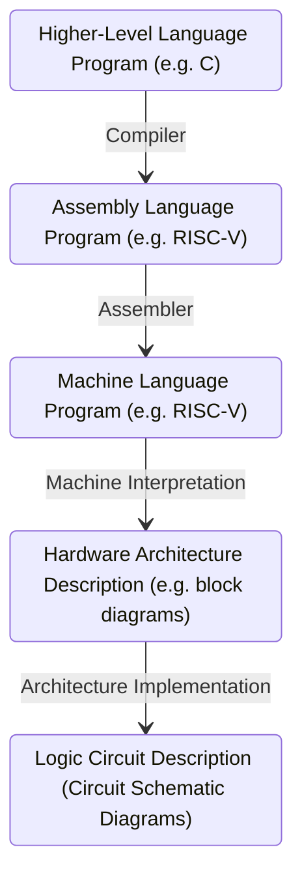
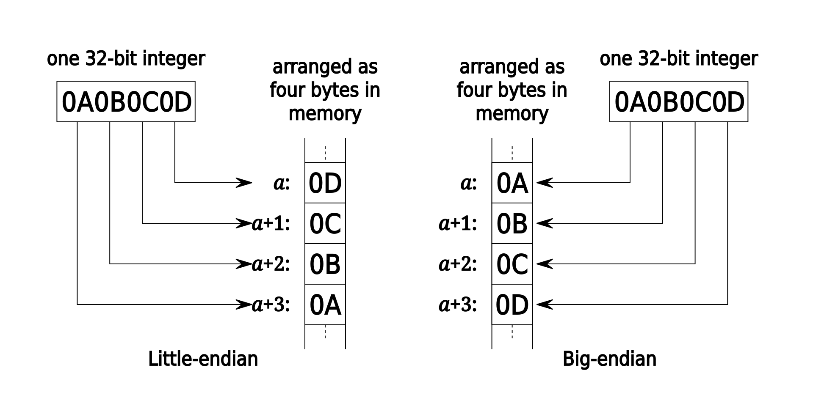

<show-structure for="chapter" depth="3"></show-structure>

# Computer Architecture

## &#8544; C Programming

### 1 Introduction to C

For this part, please refer to <a href = "C-Programming.md" 
anchor = "intro" summary = "C++ Introduction">introduction in
C++ programming</a> for more details.

### 2 C Memory Layout

Program's <format color = "OrangeRed" style = "italic">address space
</format> contains 4 regions: 

<list>
<li>

<format color = "Fuchsia">Stack:</format> local variables,
grow downwards.

</li>
<li>

<format color = "Fuchsia">Heap:</format> space requested via
<code>malloc()</code> and used with pointers; resizes dynamically, 
grow upward.

</li>
<li>

<format color = "Fuchsia">Static Data:</format> global or
static variables, does not grow or shrink.

</li>
<li>

<format color = "Fuchsia">Code:</format> loaded when program 
starts, does not change.

</li>
</list>

<format color = "BlueViolet">Storage:</format> 

<list>
<li>

<format color = "Fuchsia">Declared outside a function:
</format> Static Data

</li>
<li>

<format color = "Fuchsia">Declared inside a function:
</format> Stack

<list type = "bullet">
<li>

<code>main()</code> is a function.

</li>
<li>

freed when function returns.

</li>
</list>
</li>
<li>

<format color = "Fuchsia">Dynamically allocated (i.e., 
<code>malloc</code>, <code>calloc</code> & <code>realloc</code>):
</format> Heap.

</li>
</list>

#### 2.1 Stack

<list type = "bullet">
<li>

A stack frame includes: 

<list type = "bullet">
<li>

Location of caller function

</li>
<li>

Function arguments

</li>
<li>

Space for local variables

</li>
</list>
</li>
<li>

Stack pointer (SP) tells where lowest (current) stack frame is.

</li>
<li>

When procedure ends, stack pointer is moved back (but data remains
(<format color = "OrangeRed">garbage!</format>)); frees memory for 
future stack frames;

</li>
</list>

#### 2.2 Static Data

<list type = "bullet">
<li>

Place for variables that persist, and data doesn't subject to 
comings and goings like function calls, e.g. string literals,
global variables.

</li>
<li>

String literal example: <code>char * str = “hi”</code>.

</li>
<li>

Size does not change, but sometimes data can be writable.

</li>
</list>

<warning>

String literals cannot change!

</warning>

#### 2.3 Code

<list type = "bullet">
<li>

Copy of your code goes here, C code becomes data too!

</li>
<li>

Does (should) not change, typically read-only.

</li>
</list>

#### 2.4 Addressing & Endianness

<format color = "BlueViolet">Addresses:</format> 

<list type = "bullet">
<li>

The size of an address (and thus, the size of a pointer) in bytes
depends on architecture. For 64-bit system, the size of an address is 8 
bytes, and the system has <math>2 ^ {64}</math> possible addresses.

</li>
<li>

If a machine is <format style = "bold">byte-addressed</format>, 
then each of its addresses points to a unique <format style = "bold">
byte</format>.

</li>
</list>

<format color = "BlueViolet">Endianness:</format> 

<list type = "bullet">
<li>

<format color = "DarkOrange">Big Endian:</format> Descending 
numerical significance with ascending memory addresses.

</li>
<li>

<format color = "DarkOrange">Little Endian:</format> Ascending 
numerical significance with ascending memory addresses.

</li>
</list>

<warning>

Endianess ONLY APPLIES to values that occupy multiple bytes.

Endianness refers to STORAGE IN MEMORY NOT number representation.

</warning>

#### 2.5 Heap

Dynamically allocated memory goes on the 
<format color = "OrangeRed">Heap</format>, more permanent and 
persistent than Stack.

<list type = "alpha-lower">
<li>
    
<format color = "Fuchsia">malloc(n)</format>

    <list type = "bullet">
    <li>
    
Allocates a continuous block of <format style = "bold, italic">
    n bytes</format> of uninitialized memory (contains garbage!)

    </li>
    <li>
    
Returns a pointer to the beginning of an allocated block; NULL 
    indicates failed request (check for this!)

    </li>
    <li>
    
<code>int *p = (int *) malloc(n * sizeof(int))</code>

    </li>
    <li>
    
<code>sizeof()</code> makes code more portable.

    </li>
    <li>
    
<code>malloc()</code> returns <code>void *</code>; typecast
    will help you catch coding errors when pointer types don't match.
    

    </li>
    </list>
</li>
<li>

<format color = "Fuchsia">calloc(n, size)</format>

    <list type = "bullet">
    <li>
    
<code>void* calloc(size_t nmemb, size_t size)</code>

    </li>
    <li>
    
nmemb is the number of the members

    </li>
    <li>
    
size is the size of each member

    </li>
    <li>
    
Example for allocating space for 5 integers.

    <code-block lang = "C++">
    int *p = (int*)calloc(5, sizeof(int));
    </code-block>
    </li>
    </list>
</li>
<li>

<format color = "Fuchsia">realloc()</format>

    <list type = "bullet">
    <li>
    
Use it when you need more or less memory in an array.

    </li>
    <li>
    
<code>void *realloc(void *ptr, size_t size)</code>

    </li>
    <li>
    
Takes in a ptr that has been the return of malloc/calloc/realloc
    and a new size.

    </li>
    <li>
    
Returns a pointer with now size space (or NULL) and copies any 
    content from ptr.

    </li>
    <li>
    
Realloc can move or keep the address same, so DO NOT rely on old
    ptr values.

    </li>
    </list>
</li>
<li>

<format color = "Fuchsia">free()</format>

    <list type = "bullet">
    <li>
    
Release memory on the heap: Pass the pointer p to the 
    beginning of allocated block; releases the whole block.

    </li>
    <li>
    
p must be the address <format style = "italic">originally
    </format> returned by m/c/realloc(), otherwise throws system 
    exception.

    </li>
    <li>
    
Don't call <code>free()</code> on a block that has already been
    released or on NULL.

    </li>
    <li>
    
Make sure you don't lose the original address.

    </li>
    </list>
</li>
</list>

## &#8545; Assembly Language

### 3 Introduction to Assembly Language

#### 3.1 Assembly Language

<format color = "DarkOrange">Assembly:</format> (also known as 
Assembly language, ASM) A low-level programming language where the 
program instructions match a particular architecture's operations.

<format color = "BlueViolet">Properties:</format> 

<list type = "bullet">
<li>

Splits a program into many small instructions that each do one 
single part of the process.

</li>
<li>

Each architecture will have a different set of operations that it 
supports (although there are similarities).

</li>
<li>

Assembly is not <format style = "italic">portable</format> to other
architectures.

</li>
</list>

<format color = "BlueViolet">Complex/Reduced Instruction Set 
Computing</format>

<list type = "alpha-lower">
<li>

Early trend - add more and more instructions to do elaborate 
operations

<format color = "Fuchsia">Complex Instruction Set Computing (CISC)
</format>

    <list type = "bullet">
    <li>
    
Difficult to learn and comprehend language

    </li>
    <li>
    
Less work for the compiler

    </li>
    <li>
    
Complicated hardware runs more slowly

    </li>
    </list>
</li>
<li>

Opposite philosophy later began to dominate

<format color = "Fuchsia">Reduced Instruction Set Computing (RISC)
</format>

    <list type = "bullet">
    <li>
    
Simple (and smaller) instruction set makes it easier to build 
    fast hardware.

    </li>
    <li>
    
Let software do the complicated operations by composing simpler 
    ones.

    </li>
    </list>
</li>
</list>

<format color = "BlueViolet">Code:</format> 

op dst, src1, src2

<list type = "bullet">
<li>

<code>op</code>: operation name ("operator")

</li>
<li>

<code>dst</code>: register getting result ("destination")

</li>
<li>

<code>src1</code>: first register for operation ("source 1")

</li>
<li>

<code>src2</code>: second register for operation ("source 2")

</li>
</list>

#### 3.2 Registers

Assembly uses registers to store values. Registers are: 

<list type = "bullet">
<li>

Small memories of a fixed size.

</li>
<li>

Can be read or written.

</li>
<li>

Limited in number.

</li>
<li>

Very fast and low power to access.

</li>
</list>

<table style = "both">
<tr><td></td><td>Registers</td><td>Memory</td></tr>
<tr><td>Speed</td><td>Fast</td><td>Slow</td></tr>
<tr><td>Size</td><td>
Small

e.g., 32 registers * 32 bit = 
128 bytes
</td><td>
Big

4-32 GB
</td></tr>
<tr><td>Connection</td><td colspan = "2">
More variables than 
registers?

Keep most frequently used in registers and move the 
rest to memory
</td></tr>
</table>

<warning>

Some important notes about registers: 

<list type = "bullet">
<li>

Register denoted by 'x' can be referenced by number (x0 - x31) or 
by name.

</li>
<li>

Registers have no type.

</li>
<li>

Register zero (x0 or zero) always has the value 0 and cannot be 
changed! Any instruction writing to x0 has no effect!

</li>
<li>

In high-level languages, number of variables limited only by 
available memory.

</li>
</list>
</warning>

#### 3.3 RISC-&#8548; Instructions

##### 3.3.1 Basic Arithmetic Instructions

<note>

Assume here that the variables a, b and c are assigned to
registers s1, s2 and s3, respectively.

</note>

<format color = "BlueViolet">Types:</format> 

<list type = "bullet">
<li>

<format color = "Fuchsia">Integer Addition:</format> 

    <list type = "bullet">
    <li>
    
C: a = b + c;

    </li>
    <li>
    
RISC-Ⅴ: add s1, s2, s3

    </li>
    </list>
</li>
<li>

<format color = "Fuchsia">Integer Subtraction:</format> 

    <list type = "bullet">
    <li>
    
C: a = b - c;

    </li>
    <li>
    
RISC-Ⅴ: sub s1, s2, s3

    </li>
    </list>
</li>
</list>

##### 3.3.2 Immediate Instructions

<format color = "DarkOrange">Immediates:</format> Numerical 
constants.

<format color = "BlueViolet">Syntax:</format> opi dst, src, imm

<list type = "bullet">
<li>

Operation names end with "i", replace <math>2 ^ {\text{nd}}</math> 
source register with an immeidate.

</li>
<li>

Immediates can up to 12-bits in size.

</li>
<li>

Interpreted as sign-extended two's complement.

</li>
</list>

<warning>

No <code>subi</code> instruction, since RISCV is all about reducing
# of instructions.

</warning>

##### 3.3.3 Data Transfer Instructions

Specialized <format color = "OrangeRed">data transfer instructions
</format> move data between registers and memory.

<list type = "bullet">
<li>

<format color = "Fuchsia">Store:</format> register TO memory

</li>
<li>

<format color = "Fuchsia">Load:</format> register FROM memory

</li>
</list>

<format color = "BlueViolet">Syntax:</format> memop reg, off (bAbbr)

<list type = "bullet">
<li>

<code>memop</code>: operation name ("operator")

</li>
<li>

<code>reg</code>: register for operation source or destination.

</li>
<li>

<code>bAbbr</code>: register with pointer to memory ("base 
address")

</li>
<li>

<code>off</code>: Address offset (immediate) in bytes ("offset")

</li>
</list>

<format color = "BlueViolet">Types:</format> 

<list type = "bullet">
<li>

<format color = "Fuchsia">Load Word:</format> Takes data at 
address <code>bAbbr+off</code> FROM memory and places it into <code>
reg</code>.

</li>
<li>

<format color = "Fuchsia">Store Word:</format> Takes data in 
<code>reg</code> and stores it TO memory at <code>bAbbr+off</code>.

</li>
</list>

<format color = "BlueViolet">Example:</format> address of int array
[] -> s3, value of b -> s2

<list type = "bullet">
<li>

C: array[10] = array[3] + b;

</li>
<li>

RISC-Ⅴ

lw&nbsp;&nbsp;&nbsp;&nbsp;&nbsp;&nbsp;&nbsp;t0, <format color = 
"OrangeRed">l2</format> (s3)&nbsp;&nbsp;&nbsp;&nbsp;# t0 = A[<format color = "OrangeRed">3
</format>]

add&nbsp;&nbsp;&nbsp;&nbsp;t0, s2, t0&nbsp;&nbsp;&nbsp;&nbsp;&nbsp;# t0 = A[3] + b

sw&nbsp;&nbsp;&nbsp;&nbsp;&nbsp;&nbsp;t0, <format color = "OrangeRed">40</format> (s3)&nbsp;&nbsp;# A[<format 
color = "OrangeRed">10</format>] = A[3] + b

</li>
</list>

##### 3.3.4 Control Flow Instructions

<format color = "DarkOrange">Labels in RISC-Ⅴ</format>: Defined
by a text and followed by a colon (e.g., main:) and refers to the 
instructions that follows; generate control flow by jumping to labels.

<format color = "BlueViolet">Types:</format> 

<list type = "alpha-lower">
<li>
    
<format color = "Fuchsia">Branch If Equal</format> (beq)

    <list type = "bullet">
    <li>    
        
<format color = "LawnGreen">Syntax:</format> beq reg1, 
        reg2, label

    </li>
    <li>
        
If value in reg1 == value in reg2, go to label.

    </li>
    <li>
        
Otherwise go to next instruction.

    </li>
    </list>
</li>
<li>

<format color = "Fuchsia">Branch If Not Equal</format> (bne)

    <list type = "bullet">
    <li>    
        
<format color = "LawnGreen">Syntax:</format> bne reg1, 
        reg2, label

    </li>
    <li>
        
If value in reg1 &#8800; value in reg2, go to label.

    </li>
    </list>
</li>
<li>

<format color = "Fuchsia">Jump</format> (j)

    <list type = "bullet">
    <li>    
        
<format color = "LawnGreen">Syntax:</format> j label

    </li>
    <li>
        
Unconditional jump to label.

    </li>
    </list>
</li>
<li>

<format color = "Fuchsia">Branch Less Than</format> (blt)

    <list type = "bullet">
    <li>    
        
<format color = "LawnGreen">Syntax:</format> blt reg1, reg2,
        label

    </li>
    <li>
        
If value in reg1 &lt; value in reg2, go to label.

    </li>
    </list>
</li>
<li>

<format color = "Fuchsia">Branch Less Than or Equal</format> (ble)

    <list type = "bullet">
    <li>    
        
<format color = "LawnGreen">Syntax:</format> ble reg1, reg2,
        label

    </li>
    <li>
        
If value in reg1 &#8804; value in reg2, go to label.

    </li>
    </list>
</li>
</list>

<compare first-title="C" second-title="RISC-Ⅴ (beq)">
    <code-block lang = "c">
        if (i == j) {
            a = b; /* then */
        } else {
            a = -b; /* else */
        }
    </code-block>
    <code-block lang = "python">
        # i -> s0, j -> s1
        # a -> s2, b -> s3
        beq s0, s1, then
        else:
        sub s2, x0, s3
        j end
        then:
        add s2, s3, x0
        end:
    </code-block>
</compare>

<format color = "BlueViolet">Loops in RISC-Ⅴ:</format> 

<list type = "bullet">
<li>
    
There are three types of loops in C: while, do...while, and
    for.

</li>
<li>
    
These can be created with branch instructions as well.

</li>
<li>
    
The key to decision making is the branch statement.

</li>
</list>

<format color = "BlueViolet">Program Counter:</format> 

<list type = "bullet">
<li>
    
Program Counter (PC): A special register that contains the 
    current address of the code that is being executed.

</li>
<li>
    
Branches and Jumps change the flow of execution by modifying 
    the PC.

</li>
<li>
    
Instructions are stored as data in memory (code section) and 
    have addresses! Labels get converted to instruction addresses.

</li>
<li>
    
The PC tracks where in memory the current instruction is.

</li>
</list>

### 4 RISC-&#8548; Functions

