<show-structure for="chapter" depth="3"></show-structure>

# Part &#8544;

<primary-label ref="finish"></primary-label>

## 2 Linked Lists

<p>The sentinel reference always points to a sentinel node.</p>

<p>Sentinel code make it easier to reason about code, and also give 
you specific goals to strive for in making sure your code works.</p>

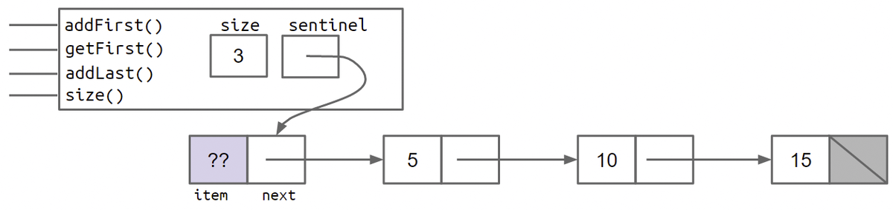

### 2.1 Singly Linked Lists

<p>Java</p>

```Java
import java.util.Iterator;

public class SLList implements Iterable<Integer> {
    public static class IntNode {
        public int item;
        public IntNode next;

        public IntNode(int i, IntNode n) {
            item = i;
            next = n;
        }
    }

    private final IntNode sentinel;
    private int size;

    public SLList() {
        sentinel = new IntNode(63, null);
        size = 0;
    }

    public SLList(int x) {
        sentinel = new IntNode(63, null);
        sentinel.next = new IntNode(x, null);
        size = 1;
    }

    public void addFirst(int x) {
        sentinel.next = new IntNode(x, sentinel.next);
        size += 1;
    }

    public void addLast(int x) {
        size += 1;
        IntNode p = sentinel;
        while (p.next != null) {
            p = p.next;
        }
        p.next = new IntNode(x, null);
    }

    public int size() {
        return size;
    }

    @Override
    public Iterator<Integer> iterator() {
        return new SLListIterator();
    }

    private class SLListIterator implements Iterator<Integer> {
        private IntNode p;

        public SLListIterator() {
            p = sentinel.next; 
        }

        @Override
        public boolean hasNext() {
            return p != null;
        }

        @Override
        public Integer next() {
            int returnItem = p.item;
            p = p.next;
            return returnItem;
        }
    }
}
```

<p>C++</p>

```C++
#ifndef SLLIST_H
#define SLLIST_H

template <typename T>
class SLList {
public:
    class IntNode {
    public:
        T item;
        IntNode* next;

        IntNode(T i, IntNode* n) : item(i), next(n) {}
    };

private:
    IntNode* sentinel;
    int size;

public:
    SLList() : sentinel(new IntNode(0, nullptr)), size(0) {} 

    explicit SLList(T x) : sentinel(new IntNode(0, nullptr)), size(0) {
        sentinel->next = new IntNode(x, nullptr);
        size = 1;
    }

    ~SLList() {
        IntNode* current = sentinel;
        while (current != nullptr) {
            IntNode* next = current->next;
            delete current;
            current = next;
        }
    }

    void addFirst(T x) {
        sentinel->next = new IntNode(x, sentinel->next);
        size++;
    }

    void addLast(T x) {
        IntNode* p = sentinel;
        while (p->next != nullptr) {
            p = p->next;
        }
        p->next = new IntNode(x, nullptr);
        size++;
    }

    [[nodiscard]] int getSize() const {
        return size;
    }

    class iterator {
    private:
        IntNode* current;

    public:
        explicit iterator(IntNode* node) : current(node) {}

        T& operator*() { return current->item; }
        iterator& operator++() {
            current = current->next;
            return *this;
        }
        bool operator!=(const iterator& other) const { return current != other.current; }
    };

    iterator begin() { return iterator(sentinel->next); }
    iterator end() { return iterator(nullptr); }
};

#endif // SLLIST_H
```

<p>Python</p>

```Python
class SLList:
    class IntNode:
        def __init__(self, i, n):
            self.item = i
            self.next = n

    def __init__(self, x=None): 
        self.sentinel = self.IntNode(None, None)
        self.size = 0
        if x is not None:  # If x is provided, add it as the first element
            self.sentinel.next = self.IntNode(x, None)
            self.size = 1

    def addFirst(self, x):
        self.sentinel.next = self.IntNode(x, self.sentinel.next)
        self.size += 1

    def addLast(self, x):
        p = self.sentinel
        while p.next is not None:
            p = p.next
        p.next = self.IntNode(x, None)
        self.size += 1

    def __len__(self):
        return self.size

    def __iter__(self):
        p = self.sentinel.next
        while p is not None:
            yield p.item
            p = p.next
```

### 2.2 Doubly Linked Lists

<note>
<p>This is the use of built-in doubly linked lists.</p>
</note>

<p>Java</p>

```Java
import java.util.LinkedList;

public class AlgorithmForjava {
    public static void main(String[] args) {
        LinkedList<String> linkedList = new LinkedList<>();

        linkedList.add("A");
        linkedList.add("B");
        linkedList.addLast("C");
        linkedList.addFirst("D");
        linkedList.add(2, "E");

        System.out.println("Linked list : " + linkedList);
    }
}
```

C++

```C++
#include <list>
#include <iostream>

int main() {
    std::list<int> myList;

    myList.push_back(1);
    myList.push_back(2);
    myList.push_back(3);

    for(auto i : myList) {
        std::cout << i << " ";
    }

    return 0;
}
```

<note>
<p>This is the implementation of doubly linked lists.</p>
</note>

<p>Java</p>

```Java
import java.util.ArrayList;
import java.util.Iterator;
import java.util.NoSuchElementException;

public class Deque<T> implements Iterable<T> {

    private class Node {
        public T item;
        public Node prev;
        public Node next;

        public Node(T i, Node p, Node n) {
            item = i;
            prev = p;
            next = n;
        }
    }

    private final Node sentinel;
    private int size;

    public Deque() {
        sentinel = new Node(null, null, null);
        sentinel.prev = sentinel;
        sentinel.next = sentinel;
        size = 0;
    }

    public void addFirst(T x) {
        if (x == null) {
            throw new IllegalArgumentException("Cannot add null item");
        }
        Node newNode = new Node(x, sentinel, sentinel.next);
        sentinel.next.prev = newNode;
        sentinel.next = newNode;
        size++;
    }

    public void addLast(T x) {
        Node newNode = new Node(x, sentinel.prev, sentinel);
        sentinel.prev.next = newNode;
        sentinel.prev = newNode;
        size++;
    }

    public ArrayList<T> toList() {
        ArrayList<T> returnList = new ArrayList<>();
        Node p = sentinel.next;
        while (p != sentinel) {
            returnList.add(p.item);
            p = p.next;
        }
        return returnList;
    }

    public boolean isEmpty() {
        return size == 0;
    }

    public int size() {
        return size;
    }

    public T removeFirst() {
        if (isEmpty()) {
            throw new NoSuchElementException("Deque is empty");
        }
        Node first = sentinel.next;
        sentinel.next = first.next;
        first.next.prev = sentinel;
        size--;
        return first.item;
    }

    public T removeLast() {
        if (isEmpty()) {
            throw new NoSuchElementException("Deque is empty");
        }
        Node last = sentinel.prev;
        sentinel.prev = last.prev;
        last.prev.next = sentinel;
        size--;
        return last.item;
    }

    public T get(int index) {
        if (index < 0 || index >= size) {
            return null;
        }
        Node p = sentinel.next;
        for (int i = 0; i < index; i++) {
            p = p.next;
        }
        return p.item;
    }

    public Iterator<T> iterator() {
        return new DequeIterator();
    }

    private class DequeIterator implements Iterator<T> {
        private Node current = sentinel.next; // Start at the first node after sentinel

        public boolean hasNext() {
            return current != sentinel;
        }

        public T next() {
            if (!hasNext()) {
                throw new NoSuchElementException("No more elements");
            }
            T item = current.item;
            current = current.next;
            return item;
        }
    }
}
```

<p>C++</p>

```C++
#ifndef DEQUE_H
#define DEQUE_H

#include <vector>
#include <stdexcept>

template <typename T>
class Deque {
private:
    struct Node {
        T item;
        Node* prev;
        Node* next;

        Node(const T& i, Node* p, Node* n) : item(i), prev(p), next(n) {}
    };

    Node* sentinel;
    int size;

public:
    Deque() {
        sentinel = new Node(T{}, nullptr, nullptr); // Default construct T for sentinel
        sentinel->prev = sentinel;
        sentinel->next = sentinel;
        size = 0;
    }

    ~Deque() {
        Node* current = sentinel->next;
        while (current != sentinel) {
            const Node* temp = current;
            current = current->next;
            delete temp;
        }
        delete sentinel;
    }

    void addFirst(const T& x) {
        Node* newNode = new Node(x, sentinel, sentinel->next);
        sentinel->next->prev = newNode;
        sentinel->next = newNode;
        size++;
    }

    void addLast(const T& x) {
        Node* newNode = new Node(x, sentinel->prev, sentinel);
        sentinel->prev->next = newNode;
        sentinel->prev = newNode;
        size++;
    }

    std::vector<T> toList() const {
        std::vector<T> returnList;
        Node* p = sentinel->next;
        while (p != sentinel) {
            returnList.push_back(p->item);
            p = p->next;
        }
        return returnList;
    }

    [[nodiscard]] bool isEmpty() const {
        return size == 0;
    }

    [[nodiscard]] int getsize() const {
        return size;
    }

    T removeFirst() {
        if (isEmpty()) {
            throw std::runtime_error("Deque is empty");
        }
        Node* first = sentinel->next;
        sentinel->next = first->next;
        first->next->prev = sentinel;
        size--;
        T item = first->item;
        delete first;
        return item;
    }

    T removeLast() {
        if (isEmpty()) {
            throw std::runtime_error("Deque is empty");
        }
        Node* last = sentinel->prev;
        sentinel->prev = last->prev;
        last->prev->next = sentinel;
        size--;
        T item = last->item;
        delete last;
        return item;
    }

    T get(const int index) const {
        if (index < 0 || index >= size) {
            throw std::runtime_error("Index out of bounds"); // Or return a default value
        }
        Node* p = sentinel->next;
        for (int i = 0; i < index; i++) {
            p = p->next;
        }
        return p->item;
    }

    class iterator {
    public:
        using iterator_category = std::bidirectional_iterator_tag;
        using value_type = T;
        using difference_type = std::ptrdiff_t;
        using pointer = T*;
        using reference = T&;

        explicit iterator(Node* ptr) : current(ptr) {}

        reference operator*() const { return current->item; }
        pointer operator->() const { return &current->item; }

        iterator& operator++() {
            current = current->next;
            return *this;
        }

        iterator operator++(int) {
            iterator temp = *this;
            ++(*this);
            return temp;
        }

        iterator& operator--() {
            current = current->prev;
            return *this;
        }

        iterator operator--(int) {
            iterator temp = *this;
            --(*this);
            return temp;
        }

        bool operator==(const iterator& other) const { return current == other.current; }
        bool operator!=(const iterator& other) const { return current != other.current; }

    private:
        Node* current;
    };

    iterator begin() const { return iterator(sentinel->next); }
    iterator end() const { return iterator(sentinel); }
};

#endif // DEQUE_H
```

<p>Python</p>

```Python
class Deque:
    class Node:
        def __init__(self, item, prev, next):
            self.item = item
            self.prev = prev
            self.next = next

    def __init__(self):
        self.sentinel = self.Node(None, None, None)
        self.sentinel.prev = self.sentinel
        self.sentinel.next = self.sentinel
        self.size = 0

    def addFirst(self, x):
        if x is None:
            raise ValueError("Cannot add null item")
        new_node = self.Node(x, self.sentinel, self.sentinel.next)
        self.sentinel.next.prev = new_node
        self.sentinel.next = new_node
        self.size += 1

    def addLast(self, x):
        new_node = self.Node(x, self.sentinel.prev, self.sentinel)
        self.sentinel.prev.next = new_node
        self.sentinel.prev = new_node
        self.size += 1

    def toList(self):
        return_list = []
        p = self.sentinel.next
        while p != self.sentinel:
            return_list.append(p.item)
            p = p.next
        return return_list

    def isEmpty(self):
        return self.size == 0

    def size(self):
        return self.size

    def removeFirst(self):
        if self.isEmpty():
            raise IndexError("Deque is empty")
        first = self.sentinel.next
        self.sentinel.next = first.next
        first.next.prev = self.sentinel
        self.size -= 1
        return first.item

    def removeLast(self):
        if self.isEmpty():
            raise IndexError("Deque is empty")
        last = self.sentinel.prev
        self.sentinel.prev = last.prev
        last.prev.next = self.sentinel
        self.size -= 1
        return last.item

    def get(self, index):
        if index < 0 or index >= self.size:
            return None
        p = self.sentinel.next
        for _ in range(index):
            p = p.next
        return p.item

    def __iter__(self):
        self.current = self.sentinel.next
        return self

    def __next__(self):
        if self.current == self.sentinel:
            raise StopIteration
        item = self.current.item
        self.current = self.current.next
        return item
```

## 3 Union-Find

### 3.1 Quick Find (Eager Approach)

<list type="bullet">
<li>
<p><code>parent[i]</code> is the root of <math>i</math>, <math>p
</math> and <math>q</math> are connected if and only if they have the
same <code>parent[i]</code>.</p>
</li>
<li>
<p><format color="Fuchsia">Find:</format> Check if <math>p
</math> and <math>q</math> have the same <code>parent[i]</code>.</p>
</li>
<li>
<p><format color = "Fuchsia">Union:</format> To merge 
components containing <math>p</math> and <math>q</math>, change all 
entries whose id equals <code>parent[p]</code> to <code>parent[q]
</code>.</p>
</li>
</list>

<tip>
<p><format color="BlueViolet">Defect:</format> </p>
<list type="bullet">
<li>
<p>Union too expensive (<math>N</math> array accesses).</p>
</li>
<li>
<p>Trees are flat, but too expensive to keep them flat.</p>
</li>
</list>
</tip>

### 3.2 Quick Union (Lazy Approach)

<list>
<li>
<p>parent[i] is the parent of <math>i</math>, root of <math>i</math> 
is parent[parent[...[i]]] (keep going until it doesn't change).
</p>
</li>
<li>
<p><format color="Fuchsia">Find:</format> Check if <math>p
</math> and <math>q</math> have the same root.</p>
</li>
<li>
<p><format color="Fuchsia">Union:</format> To merge 
components containing <math>p</math> and <math>q</math>, set the 
parent of <math>p</math>'s root to the parent of <math>q</math>'s 
root.</p>
</li>
</list>

<note>
<p><format color="BlueViolet">Defect:</format> </p>
<list type="bullet">
<li>
<p>Trees can get tall.</p>
</li>
<li>
<p>Find too expensive (could be <math>N</math> array accesses).</p>
</li>
</list>
</note>

### 3.3 Quick Union Improvements

<p>Two Improvements: Weighting and Path Compression (WQUPC).</p>

<procedure title="Weighted quick-union" type="choices">
<step>
<p>Modify quick-union to avoid tall trees.</p>
</step>
<step>
<p>Keep track of size of each tree (number of objects).</p>
</step>
<step>
<p>Balance by linking root of smaller tree to root of larger tree.
</p>
</step>
</procedure>

<procedure title = "Path compression" type="choices">
<step>
<p>Just after computing the root of <math>p</math>, set the parent of 
each examined node to point to that root.</p>
</step>
</procedure>

<list>
<li>
<p><code>rank[i]</code> is the size of the tree rooted at <math>i
</math>.</p>
</li>
<li>
<p>Property: Starting from an empty data structure, any sequence of 
<math>M</math> union-find operations on <math>N</math> objects
makes <math>\leq c(N + M lg* N)</math> array accesses.</p>
</li>
<li>
<p>In theory, WQUPC is not linear; in practice, it is.</p>
</li>
<li>
<p>Application: Percoloation, games, dynamic connectivity, least 
common ancestor, Kruskal's minimum spanning tree algorithm, etc.</p>
</li>
</list>

Java

```Java
public class UnionFind {
    private final int[] parent;
    private final int[] rank;

    public UnionFind(int size) {
        parent = new int[size];
        rank = new int[size];

        for (int i = 0; i < size; i++) {
            parent[i] = i;
            rank[i] = 1;
        }
    }

    public int find(int element) {
        if (parent[element] != element) {
            parent[element] = find(parent[element]); // Path compression
        }
        return parent[element];
    }

    public void union(int element1, int element2) {
        int root1 = find(element1);
        int root2 = find(element2);

        if (root1 != root2) {
            if (rank[root1] > rank[root2]) {
                parent[root2] = root1;
            } else if (rank[root1] < rank[root2]) {
                parent[root1] = root2;
            } else {
                parent[root2] = root1;
                rank[root1] += 1;
            }
        }
    }
}
```

C++

```C++
#include <vector>

class UnionFind {
private:
    std::vector<int> parent;
    std::vector<int> rank;

public:
    UnionFind(int size) {
        parent.resize(size);
        rank.resize(size, 1);

        for (int i = 0; i < size; i++) {
            parent[i] = i;
        }
    }

    int find(int element) {
        if (parent[element] != element) {
            parent[element] = find(parent[element]); // Path compression
        }
        return parent[element];
    }

    void unionSet(int element1, int element2) {
        int root1 = find(element1);
        int root2 = find(element2);

        // Weighted quick union
        if (root1 != root2) {
            if (rank[root1] > rank[root2]) {
                parent[root2] = root1;
            } else if (rank[root1] < rank[root2]) {
                parent[root1] = root2;
            } else {
                parent[root2] = root1;
                rank[root1] += 1;
            }
        }
    }

    bool connected(int element1, int element2) {
        return find(element1) == find(element2);
    }
};
```

Python

```Python
class UnionFind:
    def __init__(self, size):
        self.parent = list(range(size))
        self.rank = [1] * size

    def find(self, element):
        if self.parent[element] != element:
            self.parent[element] = self.find(self.parent[element]) # Path compression
        return self.parent[element]

    def union(self, element1, element2):
        root1 = self.find(element1)
        root2 = self.find(element2)

        # Weighted quick union
        if root1 != root2:
            if self.rank[root1] > self.rank[root2]:
                self.parent[root2] = root1
            elif self.rank[root1] < self.rank[root2]:
                self.parent[root1] = root2
            else:
                self.parent[root2] = root1
                self.rank[root1] += 1

    def connected(self, element1, element2):
        return self.find(element1) == self.find(element2)
```

## 4 Bags, Queues and Stacks

<list>
<li>
<p><format color="Fuchsia">Stack:</format> Examine the item most 
recently added (LIFO: last in first out).</p>
</li>
<li>
<p><format color="Fuchsia">Queue:</format> Examine the item least 
recently added (FIFO: first in first out).</p>
</li>
</list>

### 4.1 Stacks

<p><format color="BlueViolet">Defintion:</format> </p>

<list>
<li>
<p><format color="DarkOrange">Client:</format> program using 
operations defined in interface.</p>
</li>
<li>
<p><format color="DarkOrange">Implementation:</format> actual code 
implementing operations.</p>
</li>
<li>
<p><format color="DarkOrange">Interface:</format> description of 
data types, basic operations.</p>
</li>
</list>

<p>Separate interface from implementation.</p>

<p><format color = "BlueViolet">Benefits</format>: </p>

<list>
<li>
<p>Clients can't know details of implementation =&gt;
client has many implementation from which to choose.</p>
</li>
<li>
<p>Implementation can't know details of client needs =&gt;
many clients can re-use the same implementation.</p>
</li>
<li>
<p><format color="Fuchsia">Design</format>: creates modular,
reusable libraries.</p>
</li>
<li>
<p><format color="Fuchsia">Performance</format>: use optimized
implementation where it matters.</p>
</li>
</list>

#### 4.1.1 Built-In Stacks

<note>
<p>This is the use of built-in stacks.</p>
</note>

Java

```Java
import java.util.Stack;

public class StackExample {
    public static void main(String[] args) {
        Stack<Integer> stack = new Stack<>();

        stack.push(1);
        stack.push(2);
        stack.push(3);

        System.out.println(stack.pop()); // Outputs 3
        System.out.println(stack.pop()); // Outputs 2

        System.out.println(stack.peek()); // Outputs 1

        System.out.println(stack.empty()); 
    }
}
```

C++

```C++
#include <iostream>
#include <stack>

int main() {
    std::stack<int> stack;

    // Push elements to the stack
    stack.push(1);
    stack.push(2);
    stack.push(3);

    std::cout << stack.top() << std::endl; 
    stack.pop();
    std::cout << stack.top() << std::endl; 
    stack.pop();

    std::cout << stack.top() << std::endl; 
    std::cout << (stack.empty() ? "true" : "false") << std::endl;

    return 0;
}
```

Python

```Python
stack = []

stack.append(1)
stack.append(2)
stack.append(3)

print(stack.pop())  
print(stack.pop())

print(stack[-1]) 

print(len(stack) == 0) 
```

#### 4.1.2 Linked-List Implementation

<procedure title = "Stack pop">
<step>
    Save item to return.
</step>
<step>
    Delete first node.
</step>
<step>
    Return saved item.
</step>
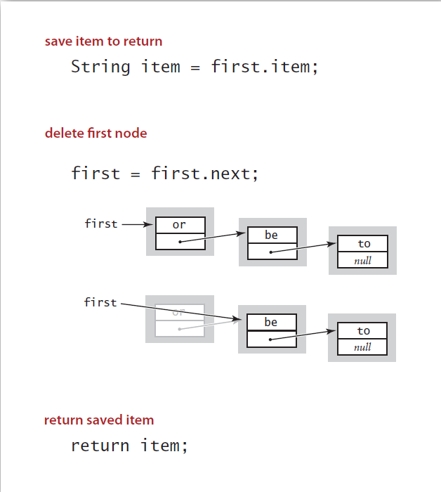
</procedure>

<procedure title="Stack push">
<step>
    Save a link to the list.
</step>
<step>
    Create a new node for the beginning.
</step>
<step>
    Set the instance variables in the new node.
</step>
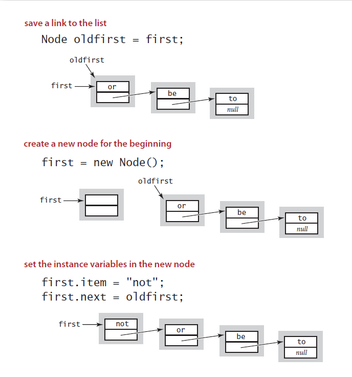
</procedure>

<p><format color = "BlueViolet">Properties:</format> </p>

<list>
<li>
<p>Every operation takes constant time in the worst case.</p>
</li>
<li>
<p>A stack with <math>N</math> items uses <math>\sim 40N</math> bytes
.</p>
</li>
</list>

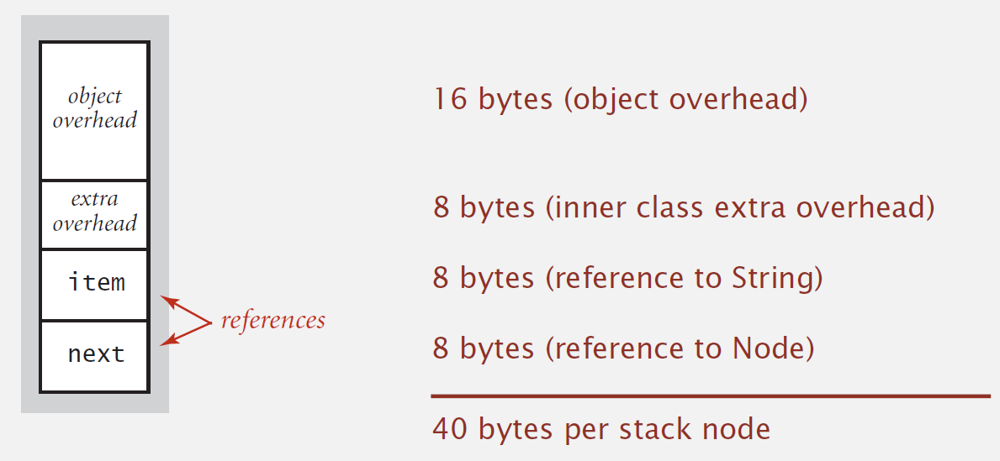

Java

```Java
public class LinkedStackOfStrings {
    private Node first = null;

    private class Node {
        String item;
        Node next;
    }

    public boolean isEmpty() {
        return first == null;
    }

    public void push(String item) {
        Node oldFirst = first;
        first = new Node();
        first.item = item;
        first.next = oldFirst;
    }

    public String pop() {
        String item = first.item;
        first = first.next;
        return item;
    }
}
```

C++

```C++
#include <iostream>

struct Node {
    int data;
    Node* next;
};

class Stack {
private:
    Node* topNode;

public:
    Stack() : topNode(nullptr) {}

    void push(int data) {
        Node* newNode = new Node();
        newNode->data = data;
        newNode->next = topNode;
        topNode = newNode;
    }

    void pop() {
        if (isEmpty()) {
            std::cout << "Stack is empty.\n";
            return;
        }
        Node* tempNode = topNode;
        topNode = topNode->next;
        delete tempNode;
    }

    int top() {
        if (isEmpty()) {
            std::cout << "Stack is empty.\n";
            return -1;
        }
        return topNode->data;
    }

    bool isEmpty() {
        return topNode == nullptr;
    }
};
```

Python

```Python
class Node:
    def __init__(self, data=None):
        self.data = data
        self.next = None

class Stack:
    def __init__(self):
        self.top = None

    def push(self, data):
        new_node = Node(data)
        new_node.next = self.top
        self.top = new_node

    def pop(self):
        if self.is_empty():
            return None
        pop_node = self.top
        self.top = self.top.next
        pop_node.next = None
        return pop_node.data

    def top(self):
        if self.is_empty():
            return None
        return self.top.data

    def is_empty(self):
        return self.top is None
```

#### 4.1.3 Resizing-Array Implementation

<p><format color="BlueViolet">Property:</format> Uses between 
<math>\sim 8N</math> and <math>\sim 32N</math> bytes to
represent a stack with <math>N</math> items.</p>

<list type = "bullet">
<li>
<p><math>\sim 8N</math> when full.</p>
</li>
<li>
<p><math>\sim 32N</math> when one-quarter full.</p>
</li>
</list>

<table style="header-row">
<tr>
    <td>Linked-List Implementation</td>
    <td>Resizing-Array Implementation</td>
</tr>
<tr>
    <td>Every operation takes constant time in the <format 
    color="OrangeRed">worst case.</format></td>
    <td>Every operation takes constant <format color = "OrangeRed">
    amortized</format> time.</td>
</tr>
<tr>
    <td>Uses extra time and space to deal with the links.</td>
    <td>Less wasted space.</td>
</tr>
</table>

Java

```Java
public class ResizingArrayStackOfStrings {
    private String[] s;
    private int N = 0;

    public ResizingArrayStackOfStrings() {
        s = new String[1];
    }

    public boolean isEmpty() {
        return N == 0;
    }

    public void push(String item) {
        if (N == s.length) {
            resize(2 * s.length);
        }
        s[N++] = item;
    }

    public String pop() {
        String item = s[--N];
        s[N] = null;
        if (N > 0 && N == s.length / 4) {
            resize(s.length / 2);
        }
        return item;
    }

    private void resize(int capacity) {
        String[] copy = new String[capacity];
        for (int i = 0; i < N; i++) {
            copy[i] = s[i];
        }
        s = copy;
    }
}
```

### 4.2 Queues

#### 4.2.1 Built-in Queues

Java

```Java
import java.util.LinkedList;
import java.util.Queue;

public class QueueExample {
    public static void main(String[] args) {
        Queue<Integer> queue = new LinkedList<>();

        queue.add(1);
        queue.add(2);
        queue.add(3);

        System.out.println(queue.poll());

        System.out.println(queue.peek()); 

        System.out.println(queue.isEmpty());
    }
}
```

C++

```C++
#include <iostream>
#include <queue>

int main() {
    std::queue<int> q;

    q.push(1);
    q.push(2);
    q.push(3);

    std::cout << q.front() << std::endl; 
    q.pop();

    std::cout << (q.empty() ? "true" : "false") << std::endl; 

    return 0;
}
```

Python

```Python
import queue

q = queue.Queue()

q.put(1)
q.put(2)
q.put(3)

print(q.get())  

print(q.empty()) 
```

#### 4.2.2 Queue Implementation

<procedure title = "Queue dequeue">
<step>
    Save item to return.
</step>
<step>
    Delete first node.
</step>
<step>
    Return saved item.
</step>
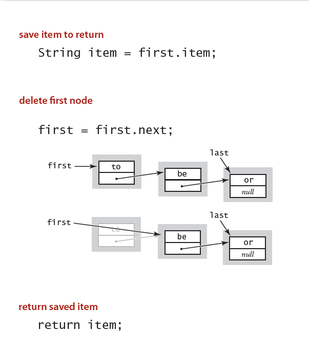
</procedure>

<procedure title="Queue enqueue">
<step>
    Save a link to the last node.
</step>
<step>
    Create a new node for the end.
</step>
<step>
    Link the new node to the end of the list.
</step>
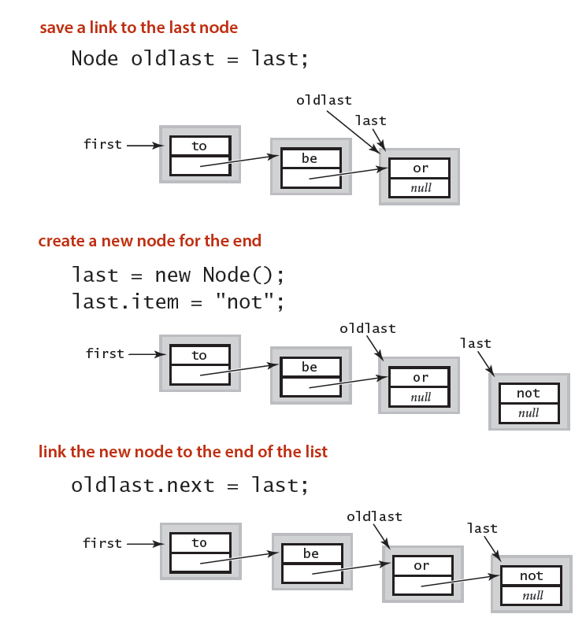
</procedure>

Java

```Java
public class LinkedQueueOfStrings {
    private Node first, last;

    private class Node {
        String item;
        Node next;
    }

    public boolean isEmpty() {
        return first == null;
    }

    public void enqueue(String item) {
        Node oldLast = last;
        last = new Node();
        last.item = item;
        last.next = null;
        if (isEmpty()) {
            first = last;
        } else {
            oldLast.next = last;
        }
    }

    public String dequeue() {
        String item = first.item;
        first = first.next;
        if (isEmpty()) {
            last = null;
        }
        return item;
    }
}
```

C++

```C++
#include <iostream>

struct Node {
    int data;
    Node* next;
};

class Queue {
private:
    Node* front;
    Node* rear;

public:
    Queue() : front(nullptr), rear(nullptr) {}

    void enqueue(int data) {
        Node* newNode = new Node();
        newNode->data = data;
        newNode->next = nullptr;

        if (rear == nullptr) {
            front = rear = newNode;
            return;
        }

        rear->next = newNode;
        rear = newNode;
    }

    void dequeue() {
        if (front == nullptr) {
            std::cout << "Queue is empty.\n";
            return;
        }

        Node* tempNode = front;
        front = front->next;

        if (front == nullptr) {
            rear = nullptr;
        }

        delete tempNode;
    }

    int peek() {
        if (front == nullptr) {
            std::cout << "Queue is empty.\n";
            return -1;
        }
        return front->data;
    }

    bool isEmpty() {
        return front == nullptr;
    }
};
```

Python

```Python
class Node:
    def __init__(self, data=None):
        self.data = data
        self.next = None

class Queue:
    def __init__(self):
        self.front = self.rear = None

    def is_empty(self):
        return self.front is None

    def enqueue(self, data):
        new_node = Node(data)

        if self.rear is None:
            self.front = self.rear = new_node
            return

        self.rear.next = new_node
        self.rear = new_node

    def dequeue(self):
        if self.is_empty():
            return None

        temp = self.front
        self.front = temp.next

        if self.front is None:
            self.rear = None

        return temp.data
```

### 4.3 Generics

Java

```Java
public class Stack<Item> {
    private Node first = null;

    private class Node {
        Item item;
        Node next;
    }

    public boolean isEmpty() {
        return first == null;
    }

    public void push(Item item) {
        Node oldFirst = first;
        first = new Node();
        first.item = item;
        first.next = oldFirst;
    }

    public Item pop() {
        Item item = first.item;
        first = first.next;
        return item;
    }
}
```

C++

```C++
#include <vector>

template<typename T>
class Stack {
private:
    std::vector<T> elements;

public:
    void push(T const& element) {
        elements.push_back(element);
    }

    void pop() {
        if (elements.empty()) {
            throw std::out_of_range("Stack<>::pop(): empty stack");
        }
        elements.pop_back();
    }

    T top() const {
        if (elements.empty()) {
            throw std::out_of_range("Stack<>::top(): empty stack");
        }
        return elements.back();
    }

    bool empty() const {
        return elements.empty();
    }
};
```

> The following code may get a warning about unchecked cast.
>
> This is because Java does not allow generic array creation.
>
{style = "warning"}

Java

```Java
public class FixedCapacityStack<Item> {
    private Item[] s;
    private int N = 0;

    public FixedCapacityStack(int capacity) {
        s = (Item[]) new Object[capacity];
    }

    public boolean isEmpty() {
        return N == 0;
    }

    public void push(Item item) {
        s[N++] = item;
    }

    public Item pop() {
        return s[--N];
    }
```

### 4.4 Iterators

> This is the linked-list implementation of stacks with
> iterators.
>
{style = "note"}

Java

```Java
import java.util.Iterator;

public class Stack<Item> implements Iterable<Item> {
    private Node first = null;

    private class Node {
        Item item;
        Node next;
    }

    public boolean isEmpty() {
        return first == null;
    }

    public void push(Item item) {
        Node oldFirst = first;
        first = new Node();
        first.item = item;
        first.next = oldFirst;
    }

    public Item pop() {
        Item item = first.item;
        first = first.next;
        return item;
    }

    public Iterator<Item> iterator() {
        return new ListIterator();
    }

    private class ListIterator implements Iterator<Item> {
        private Node current = first;

        public boolean hasNext() {
            return current != null;
        }

        public Item next() {
            Item item = current.item;
            current = current.next;
            return item;
        }
    }
}
```

> This is the array implementation of stacks with
> iterators.
>
{style = "note"}

Java

```Java
import java.util.Iterator;

public class Stack<Item> implements Iterable<Item> {
    private Item[] s;
    private int N = 0;

    public Stack(int capacity) {
        s = (Item[]) new Object[capacity];
    }

    public boolean isEmpty() {
        return N == 0;
    }

    public void push(Item item) {
        s[N++] = item;
    }

    public Item pop() {
        return s[--N];
    }

    public Iterator<Item> iterator() {
        return new ReverseArrayIterator();
    }

    private class ReverseArrayIterator implements Iterator<Item> {
        private int i = N;

        public boolean hasNext() {
            return i > 0;
        }

        public Item next() {
            return s[--i];
        }
    }
}
```

### 4.5 Bag (Princeton)

> The order of items in a bag does not matter.
>
{style = "note"}

Java

```Java
import java.util.Iterator;
import java.util.NoSuchElementException;

public class Bag<Item> implements Iterable<Item> {
    private Node<Item> first;  
    private int n;               

    private static class Node<Item> {
        private Item item;
        private Node<Item> next;
    }

    public Bag() {
        first = null;
        n = 0;
    }

    public boolean isEmpty() {
        return first == null;
    }

    public int size() {
        return n;
    }

    public void add(Item item) {
        Node<Item> oldfirst = first;
        first = new Node<Item>();
        first.item = item;
        first.next = oldfirst;
        n++;
    }

    public Iterator<Item> iterator()  {
        return new LinkedIterator(first);
    }

    private class LinkedIterator implements Iterator<Item> {
        private Node<Item> current;

        public LinkedIterator(Node<Item> first) {
            current = first;
        }

        public boolean hasNext()  {
            return current != null;
        }

        public Item next() {
            if (!hasNext()) throw new NoSuchElementException();
            Item item = current.item;
            current = current.next;
            return item;
        }
    }
}
```

## 5 Elementary Sorts

### 5.1 Selection Sort

* Time Complexity: <math>O(N^2)</math>.

* Space Complexity: <math>O(1)</math>.

<procedure title = "Basic Plan of Selection Sort">
<step>
    In iteration <math>i</math>, find index <math>min</math> of smallest remaining entry.
</step>
<step>
    Swap <code>a[i]</code> and <code>a[min]</code>.
</step>
</procedure>

Property:

* Use <math>\frac {N^{2}} {2}</math> compares and <math>N</math> exchanges.

* Quadratic time, even if the input is sorted!

* Data movement is minimal: linear number of exchanges -> suitable for small number of data.

Java

```Java
public class Selection {
    public static void sort(Comparable[] a) {
        int n = a.length;

        for (int i = 0; i < n; i++) {
            int min = i;

            for (int j = i + 1; j < n; j++) {
                if (less(a[j], a[min])) {
                    min = j;
                }
            }

            exch(a, i, min);
        }
    }

    private static boolean less(Comparable v, Comparable w) {
        return v.compareTo(w) < 0;
    }

    private static void exch(Comparable[] a, int i, int j) {
        Comparable temp = a[i];
        a[i] = a[j];
        a[j] = temp;
    }
}
```

C++

```C++
#include <algorithm>

void selectionSort(int arr[], int n) {
    for (int i = 0; i < n - 1; i++) {
        int minIndex = i;
        for (int j = i + 1; j < n; j++) {
            if (arr[j] < arr[minIndex]) {
                minIndex = j;
            }
        }
        std::swap(arr[minIndex], arr[i]);
    }
}
```

Python

```Python
# Python Implementation
def selection_sort(arr):
    for i in range(len(arr)):
        min_index = i
        for j in range(i+1, len(arr)):
            if arr[j] < arr[min_index]:
                min_index = j
        arr[i], arr[min_index] = arr[min_index], arr[i]
```

### 5.2 Insertion Sort {id="insertion-sort"}

<list type = "bullet">
<li> 
    Time Complexity: <math>O(N^2)</math>.
</li>
<li>
    Space Complexity: <math>O(1)</math>.
</li>
</list>

<procedure title = "Basic Plan of Insertion Sort">
<step>
    In iteration <math>i</math>, swap <math>a[i]</math> with each larger entry to its left.
</step>
<step>
    Entries to the left of <math>i</math> are in ascending order.
</step>
</procedure>

<p><format color="BlueViolet">Properties:</format> </p>

<list>
<li>
<p>Definition: An array is partially sorted if each entry is not far
from its final position.</p>
</li>
<li>
<p>To sort a randomly-ordered array with distinct keys, insertion sort uses <math>\frac {N^{2}}{4}</math> compares and
<math>\frac {N^{2}}{4}</math> exchanges on average.</p>
</li>
<li>
<p>For partially-sorted arrays, insertion sort runs in linear time.</p>
<tip>
<p>Proof: The number of exchanges is equal to the number of inversions.</p>
</tip>
</li>
<li>
<p>Best case: If the array is in ascending order, insertion sort
makes <math>N-1</math> compares and <math>0</math> exchanges.</p>
</li>
<li>
<p>Worst case: If the array is in descending order (and no duplicates
), insertion sort makes <math>\frac {N^{2}}{2}</math> compares and
<math>\frac {N^{2}}{2}</math> exchanges.</p>
</li>
</list>

<note>
For information about the performance of insertion sort, please refer
to the <a href="Data-Structures-and-Algorithms-3.md" anchor="sortperf" 
summary="Table for Comparing Performance of Sorting Algorithm">table 
for sorting performance</a>.
</note>

Java

```Java
public class Insertion {
    public static void sort(Comparable[] a) {
        int n = a.length;

        for (int i = 1; i < n; i++) {
            for (int j = i; j > 0 && less(a[j], a[j - 1]); j--) {
                exch(a, j, j - 1);
            }
        }
    }

    private static boolean less(Comparable v, Comparable w) {
        return v.compareTo(w) < 0;
    }

    private static void exch(Comparable[] a, int i, int j) {
        Comparable temp = a[i];
        a[i] = a[j];
        a[j] = temp;
    }
}
```

C++

```C++
#include <algorithm>

void insertionSort(int arr[], int n) {
    for (int i = 1; i < n; i++) {
        int key = arr[i];
        int j = i - 1;

        while (j >= 0 && arr[j] > key) {
            arr[j + 1] = arr[j];
            j = j - 1;
        }
        arr[j + 1] = key;
    }
}
```

Python

```Python
def insertion_sort(arr):
    for i in range(1, len(arr)):
        key = arr[i]
        j = i - 1
        while j >= 0 and arr[j] > key:
            arr[j + 1] = arr[j]
            j -= 1
        arr[j + 1] = key
```

### 5.3 Shell Sort

<procedure title = "Basic Plan of Shell Sort">
<step>
    Move entries more than one position at a time 
    by <format color = "OrangeRed"><math>h</math>-sorting</format> the array.
</step>
<step>
    <math>h</math>-sort the array: Insertion sort, with stride <math>h</math>.
</step>
</procedure>

Increment Sequence:

<list>
<li>
    Knuth's increment sequence: 1, 4, 13, 40, 121, 364, 1093, ...
    (OK, easy to compute).
</li>
<li>
    Sedgewick's increment sequence: 1, 5, 19, 41, 109, 209, 505, 929, 2161, ...
    (Good, tough to beat empirical studies).
</li>
</list>

Property:

* With the <math>3x+1</math> increments, the worst-case number of compares
  is <math>O(N^{\frac{3}{2}})</math>.

Java

```Java
public class Shell {
    public static void sort(Comparable[] a) {
        int n = a.length;
        int h = 1;

        while (h < n / 3) {
            h = 3 * h + 1;
        }

        while (h >= 1) {
            for (int i = h; i < n; i++) {
                for (int j = i; j >= h && less(a[j], a[j - h]); j -= h) {
                    exch(a, j, j - h);
                }
            }
            h = h / 3;
        }
    }

    private static boolean less(Comparable v, Comparable w) {
        return v.compareTo(w) < 0;
    }

    private static void exch(Comparable[] a, int i, int j) {
        Comparable temp = a[i];
        a[i] = a[j];
        a[j] = temp;
    }
}
```

C++

```C++
#include <vector>

void shellSortKnuth(std::vector<int>& arr) {
    int n = arr.size();

    int gap = 1;
    while (gap < n/3) {
        gap = 3 * gap + 1;  
    }

    while (gap >= 1) {
        for (int i = gap; i < n; i += 1) {
            int temp = arr[i];

            int j;
            for (j = i; j >= gap && arr[j - gap] > temp; j -= gap)
                arr[j] = arr[j - gap];

            arr[j] = temp;
        }
        gap /= 3;
    }
}
```

Python

```Python
def shell_sort_knuth(arr):
    n = len(arr)

    gap = 1
    while gap < n//3:
        gap = 3 * gap + 1  

    while gap >= 1:
        for i in range(gap, n):
            temp = arr[i]
            j = i
            while j >= gap and arr[j - gap] > temp:
                arr[j] = arr[j - gap]
                j -= gap
            arr[j] = temp
        gap //= 3
```

### 5.4 Shuffling

<procedure title = "Basic Plan of Knuth Shuffle">
<step>
    In iteration <math>i</math>, pick integer <math>r</math> between <math>0</math> and <math>i</math> uniformly at random.
</step>
<step>
    Swap <code>a[i]</code> and <code>a[r]</code>.
</step>
</procedure>

Java

```Java
import java.util.Random;

public class KnuthShuffle {
    public static void shuffle(int[] array) {
        int n = array.length;
        Random random = new Random();
        for (int i = 0; i < n; i++) {
            int r = i + random.nextInt(n - i);
            int temp = array[i];
            array[i] = array[r];
            array[r] = temp;
        }
    }
}
```

C++

```C++
#include <random>
#include <algorithm>

void knuthShuffle(int array[], int n) {
    // std::random_device is a C++ class that generates truly random numbers.
    std::random_device rd; 
    // std::mt19937 is a Mersenne Twister pseudo-random generator of 32-bit numbers. 
    // However, it's not truly random and needs to be seeded to ensure different outputs for different program runs.
    // That's where std::random_device comes in.
    std::mt19937 gen(rd()); 

    //  std::uniform_int_distribution<> is a template class in C++ that produces random integers in a specified range.
    for(int i = 0; i < n; i++) {
        std::uniform_int_distribution<> dis(i, n - 1);
        int r = dis(gen);
        std::swap(array[i], array[r]);
    }
}
```

Python

```Python
# Python Implementation
import random

def knuth_shuffle(array):
    n = len(array)
    for i in range(n):
        r = i + random.randint(0, n - i - 1)
        array[i], array[r] = array[r], array[i]
```

## 6. Mergesort {id = "mergesort"}

### 6.1 Mergesort

<p><format color="BlueViolet">Properties:</format> </p>

<list>
<li>
    <p>Time complexity: <math>O(N log N)</math>.</p>
</li>
<li>
    <p>Space complexity: <math>O(N)</math>.</p>
    <tip>
    <p>Def: A sorting algorithm is <format color = "OrangeRed"> in-place</format> 
    if it uses ≤ <math>c log N</math> extra memory.</p>
    <p>Example: Bubble sort, Insertion sort, Selection sort, Shellsort,
    Quicksort.</p>
    </tip>
</li>
<li>
    <p>Mergesort uses at most <math>N lg N</math> compares
    and <math>6N lg N</math> array accesses to sort any array of
    size <em>N</em>.</p>
    <p>Proof (Sketch):</p>
    <p>The number of compares <math>C(N)</math> and array accesses
    <math>A</math> (<math>N</math>) to mergesort an array of size 
    <math>N</math> satisfies the recurrences:</p>
    <code-block lang = "tex" style = "inline"> 
        C(N) \leq C(\lceil \frac {N}{2} \rceil) + C(\lfloor \frac {N}{2} \rfloor) + N, N > 1, C(1) = 0
    </code-block>
    <code-block lang = "tex" style = "inline">
        A(N) \leq A(\lceil \frac {N}{2} \rceil) + A(\lfloor \frac {N}{2} \rfloor) + N, N > 1, A(1) = 0
    </code-block>
    <p>-&gt;</p>
    <code-block lang = "tex" style = "inline">
        D(N) = 2D(\frac {N}{2}) + N, D(1) = 0 => D(N) = N lg N
    </code-block>
    <p>Proof:</p>
    <code-block lang = "tex" style = "inline">
        D(N) = 2D(\frac {N}{2}) + N
    </code-block>
    <p>And we have:</p>
    <code-block lang = "tex" style = "inline">
    \begin{align*}
    D(N)/N &= \frac {2D(\frac {N}{2})}{N} + 1 \\
           &= \frac {D(\frac {N}{2})}{\frac {N}{2}} + 1 \\
           &= \frac {D(\frac {N}{4})}{\frac {N}{4}} + 1 + 1 \\
           &= \frac {D(\frac {N}{8})}{\frac {N}{8}} + 1 + 1 + 1 \\
           &= ... \\
           &= \frac {D(\frac {N}{N})}{\frac {N}{N}} + 1 + 1 + ... + 1 \\
           &= lg N \\
    (QED)
    \end{align*}
    </code-block>
</li>
</list>

<procedure title = "Basic Plan for Merge Sort">
<step>
    Divide the array into two halves.
</step>
<step>
    <format color = "OrangeRed">Recursively</format> sort each half.
</step>
<step>
    Merge two halves.
</step>
</procedure>

> Assertion: Statement to test assumptions about your program.
>
> * Help detect bugs.
>
> * Documents code.
>
{style = "tip"}

<note>
For information about the performance of mergesort, please refer
to the <a href="Data-Structures-and-Algorithms-3.md" anchor="sortperf" 
summary="Table for Comparing Performance of Sorting Algorithm">table 
for sorting performance</a>.
</note>

Java

```Java
public class Merge {
    private static void merge(Comparable[]a, Comparable[] aux, int lo, int mid, int hi) {
        assert isSorted(a, lo, mid); // precondition: a[lo...mid] is sorted
        assert isSorted(a, mid+1, hi); // precondition: a[mid+1...hi] is sorted

        for (int k = lo; k <= hi; k++) {
            aux[k] = a[k];
        }

        int i = lo, j = mid+1;
        for (int k = lo; k <= hi; k++) {
            if (i > mid) a[k] = aux[j++];
            else if (j > hi) a[k] = aux[i++];
            else if (less(aux[j], aux[i])) a[k] = aux[j++];
            else a[k] = aux[i++];
        }

        assert isSorted(a, lo, hi); // postcondition: a[lo...hi] is sorted
    }
    
    private static boolean less(Comparable v, Comparable w) {
        return v.compareTo(w) < 0;
    }

    private static void sort(Comparable[]a, Comparable[] aux, int lo, int hi) {
        if (hi <= lo) return;
        int mid = lo + (hi - lo) / 2;
        sort(a, aux, lo, mid);
        sort(a, aux, mid+1, hi);
        merge(a, aux, lo, mid, hi);
    }

    public static void sort(Comparable[]a) {
        Comparable[] aux = new Comparable[a.length];
        sort(a, aux, 0, a.length-1);
    }

    private static boolean isSorted(Comparable[] a, int lo, int hi) {
        for (int i = lo + 1; i <= hi; i++)
            if (less(a[i], a[i-1])) return false;
        return true;
    }
}
```

C++

```C++
#include <vector>
#include <algorithm>

class MergeSort {
public:
    static void sort(std::vector<int>& arr) {
        if (arr.size() < 2) return;
        std::vector<int> aux(arr.size());
        sort(arr, aux, 0, arr.size() - 1);
    }

private:
    static void merge(std::vector<int>& arr, std::vector<int>& aux, int lo, int mid, int hi) {
        std::copy(arr.begin() + lo, arr.begin() + hi + 1, aux.begin() + lo);

        int i = lo, j = mid + 1;
        for (int k = lo; k <= hi; k++) {
            if (i > mid) arr[k] = aux[j++];
            else if (j > hi) arr[k] = aux[i++];
            else if (aux[j] < aux[i]) arr[k] = aux[j++];
            else arr[k] = aux[i++];
        }
    }

    static void sort(std::vector<int>& arr, std::vector<int>& aux, int lo, int hi) {
        if (hi <= lo) return;
        int mid = lo + (hi - lo) / 2;
        sort(arr, aux, lo, mid);
        sort(arr, aux, mid + 1, hi);
        merge(arr, aux, lo, mid, hi);
    }
};
```

Python

```Python
def merge(arr, aux, lo, mid, hi):
    assert sorted(arr[lo:mid+1]) == arr[lo:mid+1]  # precondition: arr[lo...mid] is sorted
    assert sorted(arr[mid+1:hi+1]) == arr[mid+1:hi+1]  # precondition: arr[mid+1...hi] is sorted

    for k in range(lo, hi+1):
        aux[k] = arr[k]

    i, j = lo, mid+1
    for k in range(lo, hi+1):
        if i > mid:
            arr[k] = aux[j]
            j += 1
        elif j > hi:
            arr[k] = aux[i]
            i += 1
        elif aux[j] < aux[i]:
            arr[k] = aux[j]
            j += 1
        else:
            arr[k] = aux[i]
            i += 1

    assert sorted(arr[lo:hi+1]) == arr[lo:hi+1]  # postcondition: arr[lo...hi] is sorted


def sort(arr, aux, lo, hi):
    if hi <= lo:
        return
    mid = lo + (hi - lo) // 2
    sort(arr, aux, lo, mid)
    sort(arr, aux, mid+1, hi)
    merge(arr, aux, lo, mid, hi)


def merge_sort(arr):
    aux = arr.copy()
    sort(arr, aux, 0, len(arr)-1)
```

### 6.2 Bottom-Up Mergesort

> No recursion needed!
>
{style = "note"}

<procedure title = "Basic Plan">
<step>
    Pass through array, merging subarrays of size 1.
</step>
<step>
    Repeat for subarrays of size 2, 4, 8, 16, ...
</step>
</procedure>

Java

```Java
public class MergeBU {
    private static Comparable[] aux;

    private static void merge(Comparable[]a, int lo, int mid, int hi) {
        assert isSorted(a, lo, mid); // precondition: a[lo...mid] is sorted
        assert isSorted(a, mid+1, hi); // precondition: a[mid+1...hi] is sorted

        for (int k = lo; k <= hi; k++) {
            aux[k] = a[k];
        }

        int i = lo, j = mid+1;
        for (int k = lo; k <= hi; k++) {
            if (i > mid) a[k] = aux[j++];
            else if (j > hi) a[k] = aux[i++];
            else if (less(aux[j], aux[i])) a[k] = aux[j++];
            else a[k] = aux[i++];
        }

        assert isSorted(a, lo, hi); // postcondition: a[lo...hi] is sorted
    }

    private static boolean less(Comparable v, Comparable w) {
        return v.compareTo(w) < 0;
    }

    public static void sort(Comparable[]a) {
        int N = a.length;
        aux = new Comparable[N];
        for (int sz = 1; sz < N; sz++)
            for (int lo = 0; lo < N-sz; lo += sz+sz)
                merge(a, lo, lo+sz-1, Math.min(lo+sz+sz-1, N-1));
    }

    private static boolean isSorted(Comparable[] a, int lo, int hi) {
        for (int i = lo + 1; i <= hi; i++)
            if (less(a[i], a[i-1])) return false;
        return true;
    }
}
```

C++

```C++
#include <vector>
#include <algorithm>

class MergeBU {
public:
    static void merge(std::vector<int>& a, int lo, int mid, int hi) {
        std::vector<int> aux(a);

        int i = lo, j = mid+1;
        for (int k = lo; k <= hi; k++) {
            if (i > mid) a[k] = aux[j++];
            else if (j > hi) a[k] = aux[i++];
            else if (aux[j] < aux[i]) a[k] = aux[j++];
            else a[k] = aux[i++];
        }
    }

    static void sort(std::vector<int>& a) {
        int N = a.size();
        for (int sz = 1; sz < N; sz = sz+sz)
            for (int lo = 0; lo < N-sz; lo += sz+sz)
                merge(a, lo, lo+sz-1, std::min(lo+sz+sz-1, N-1));
    }
};
```

Python

```Python
def merge(a, lo, mid, hi):
    aux = a.copy()

    i = lo
    j = mid + 1
    for k in range(lo, hi + 1):
        if i > mid:
            a[k] = aux[j]
            j += 1
        elif j > hi:
            a[k] = aux[i]
            i += 1
        elif aux[j] < aux[i]:
            a[k] = aux[j]
            j += 1
        else:
            a[k] = aux[i]
            i += 1

    assert a[lo:hi + 1] == sorted(a[lo:hi + 1]), "Array is not sorted"


def sort(a):
    N = len(a)
    sz = 1
    while sz < N:
        lo = 0
        while lo < N - sz:
            merge(a, lo, lo + sz - 1, min(lo + sz + sz - 1, N - 1))
            lo += sz + sz
        sz += 1
```

### 6.3 Computational Complexity

Def:

* Computational complexity: Framework to study efficiency of
  algorithms for solving a particular problem <math>X</math>.
* Model of computation: Allowable operations.
* Cost model: Operation count(s).
* Upper bound: Cost guarantee provided by <format color = "OrangeRed">some</format>
  algorithm for <math>X</math>.
* Lower bound: Proven limit on cost guarantee of <format color = "OrangeRed">all</format>
  algorithms for <math>X</math>.
* Optimal algorithm: Algorithm with best possible cost guarantee for <math>X</math>.

Example: sorting

* Model of computation: decision tree (can access information only through compares).
* Cost model: # compares.
* Upper bound: ~ <math>NlgN</math> from mergesort.
* Lower bound: ~ <math>NlgN</math>.
* <format color = "OrangeRed">Optimal algorithm = mergesort</format>.

Property: Any compare-based sorting algorithm must use at least
<math>lg(N!) \sim NlgN</math> compares in the worst case.

Proof:

* Assume array consists of <math>N</math> distinct values
  <math>a_{1}</math> through <math>a_{N}</math>.
* Worst case dictated by <format color = "OrangeRed">height</format> <em>h</em>
  of decision tree.
* Binary tree of height <math>h</math> has at most <math>2^h</math> leaves.
* <math>N!</math> different orderings => at least <math>N!</math> leaves.

### 6.4 Stability

A <format color = "OrangeRed">stable</format> sort preserves the relative
order of items with equal keys.

Methods:

1. Need to carefully check the code ("less than" vs "less than or
   equal to"). Equal items never move past each other -> stable sort.
2. Counterexample: Long-distance exchange might move an item past
   some equal item.

Stable sort: Insertion sort, mergesort, bubble sort, radix sort, etc.

Unstable sort: Selection sort, shellsort, quicksort, heapsort, etc.

## 7 Quicksort {id="quicksort"}

### 7.1 Quicksort

<p><format color="BlueViolet">Properties:</format> </p>

<list>
<li>
    <p>Time complexity: <math>O(N log N)</math>.</p>
</li>
<li>
    <p>Best case: Number of compares is <math>\sim NlgN</math>.</p>
</li>
<li>
    <p>Worst case: Number of compares is <math>\sim \frac{1}{2} N^{2}</math>.</p>
</li>
<li>
    <p>The average number of compares <math>C_N</math> to
    quicksort an array of <math>N</math> distinct keys is <math>\sim 2N ln N </math> 
    (and the number of exchanges is <math>\sim \frac{1}{3} NlnN </math>).</p>
    <p>Proof: <math>C_N</math> satisfies the recurrence <math>C_0 = C_1 = 0</math> 
    and for <math>N \leq 2</math>:</p>
    <code-block lang = "tex">
    C_N = (N + 1) + \frac{C_0 + C_{N-1}}{N} + \frac{C_1 + C_{N-2}}{N} + \ldots + \frac{C_{N-1} + C_0}{N}
    </code-block>
    <p>while <math>N + 1</math> stands for partititoning, and the rest stands for
    partitioning probability.</p>
    <list>
    <li>
    <p>Multiply both sides by <math>N</math> and collect terms:</p>
    <code-block lang = "tex" style = "inline">
    NC_{N} = N(N+1) + 2(C_0 + C_1 + \ldots + C_{N-1})
    </code-block>
    </li>
    <li>
    <p>Subtract this from the same equation for <em>N</em> - 1:</p>
    <code-block lang = "tex" style = "inline">
    NC_{N} - (N-1)C_{N-1} = 2N + 2C_{N-1}
    </code-block>
    </li>
    <li>
    <p>Repeatedly apply above equation:</p>
    <code-block lang = "tex" style = "inline">
    \begin{align*}
    \frac{C_{N}}{N+1} &= \frac{C_{N-1}}{N} + \frac{2}{N+1} \\
    &= \frac{C_{N-2}}{N-1} + \frac{2}{N} + \frac{2}{N+1} \\
    &= \frac{C_{N-3}}{N-2} + \frac{2}{N-1} + \frac{2}{N} + \frac{2}{N+1} \\
    &= \frac{2}{3} + \frac{2}{4} + \frac{2}{5} + \ldots + \frac{2}{N+1}
    \end{align*}
    </code-block>
    </li>
    <li>
    <p>Approximate sum by integral:</p>
    <code-block lang = "tex" style = "inline">
    \begin{align*}
    C_{N} &= 2(N + 1)\left(\frac{1}{3} + \frac{1}{4} + \frac{1}{5} + \ldots + \frac{1}{N + 1}\right) \\
    &\sim 2(N + 1) \int_{3}^{N+1} \frac{1}{x} dx
    \end{align*}
    </code-block>
    </li>
    <li>
    <p>Finally, desired result:</p>
    <code-block lang = "tex" style = "inline">
    C_{N} \sim 2N \ln N \approx 1.39N \ln N
    </code-block>
</li>
</list>
</li>
<li>
    <p>Quicksort is an in-place, non-stable sorting algorithm.</p>
</li>
</list>

<tip>
    <p>
    Summary of performance characteristics:
    </p>
<list type = "alpha-lower">
    <li>
        Average case:
        <list type = "bullet">
            <li>
                39% more compares than mergesort.
            </li>
            <li>
                <format color = "OrangeRed">But</format> faster than mergesort in
                practice because of less data movement.
            </li>
        </list>
    </li>
    <li>
        Random shuffle:
        <list type = "bullet">
            <li>
                Probabilistic guarantee against worst case.
            </li>
            <li>
                Basis for math model that can be validated with experiments.
            </li>
        </list>
    </li>
    <li>
        Caveat emptor:
        <list type = "bullet">
            <li>
                Many textbook implementations go <format color = "OrangeRed">quadratic</format>
                if array:
                <list type = "bullet">
                    <li>
                        Is sorted or reverse sorted.
                    </li>
                    <li>
                        Has many duplicates (even if randomized!)
                    </li>
                </list>
            </li>
        </list>
    </li>
</list>
</tip>

<procedure title = "Basic Plan for Quicksort">
<step>
    <format color = "OrangeRed">Shuffle</format> the array.
</step>
<step>
    <format color = "OrangeRed">Partition</format> so that, for some <math>j</math>:
    <list>
        <li>
            Entry <code>a[j]</code> is in place;
        </li>
        <li>
            No larger entry to the left of <math>j</math>;
        </li>
        <li>
            No smaller entry to the right of <math>j</math>.
        </li>
    </list>
</step>
<step>
    <format color = "OrangeRed">Sort</format> each piece recursively.
</step>
</procedure>

<note>
For information about the performance of quicksort, please refer
to the <a href="Data-Structures-and-Algorithms-3.md" anchor="sortperf" 
summary="Table for Comparing Performance of Sorting Algorithm">table 
for sorting performance</a>.
</note>

Java

```Java
public class Quick {
    private static int partition(Comparable[]a, int lo, int hi) {
        int i = lo, j = hi + 1;
        while (true) {
            while (less(a[++i], a[lo])) {
                if (i == hi) break;
            }
            while (less(a[lo], a[--j])) {
                if (j == lo) break;
            }
            if (i >= j) break;
            exch(a, i, j);
        }
        exch(a, lo, j);
        return j;
    }

    public static void sort(Comparable[] a) {
        sort(a, 0, a.length - 1);
    }

    private static void sort(Comparable[] a, int lo, int hi) {
        if (hi <= lo) return;
        int j = partition(a, lo, hi);
        sort(a, lo, j - 1);
        sort(a, j + 1, hi);
    }

    private static boolean less(Comparable v, Comparable w) {
        if (v == w) return false; // optimization when reference equals
        return v.compareTo(w) < 0;
    }

    private static void exch(Object[] a, int i, int j) {
        Object swap = a[i];
        a[i] = a[j];
        a[j] = swap;
    }
}
```

C++

```C++
#include <algorithm>

int partition (int arr[], int low, int high) {
    int pivot = arr[high];
    int i = (low - 1);

    for (int j = low; j <= high - 1; j++) {
        if (arr[j] < pivot) {
            i++;
            std::swap(arr[i], arr[j]);
        }
    }
    std::swap(arr[i + 1], arr[high]);
    return (i + 1);
}

void quickSort(int arr[], int low, int high) {
    if (low < high) {
        int pi = partition(arr, low, high);
        quickSort(arr, low, pi - 1);
        quickSort(arr, pi + 1, high);
    }
}
```

Python

```Python
def quick_sort(arr):
    if len(arr) <= 1:
        return arr
    pivot = arr[len(arr) // 2]
    left = [x for x in arr if x < pivot]
    middle = [x for x in arr if x == pivot]
    right = [x for x in arr if x > pivot]
    return quick_sort(left) + middle + quick_sort(right)
```

### 7.2 Selection

<p>Goal: Given an array of <math>N</math> items, 
find the <math>k ^ {th}</math> largest.</p>

<procedure title = "Basic Plan for Quick Selection">
<step>
    Partition array so that entry <code>a[j]</code> is in place.
</step>
<step>
    Repeat in <format color = "OrangeRed">one</format> subarray, depending 
    on <math>j</math>; finished when <math>j</math> equals <math>k</math>.
</step>
</procedure>

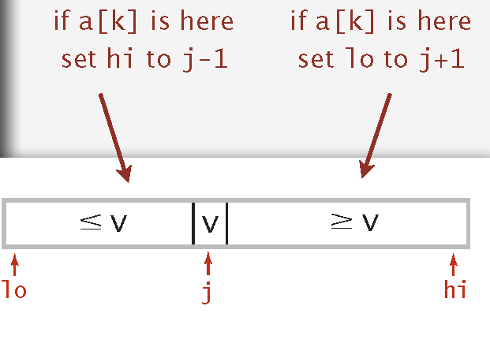

Java

```Java
public static Comparable select(Comparable[] a, int k) {
    int lo = 0, hi = a.length - 1;
    while (hi > lo) {
        int j = partition(a, lo, hi);
        if (j < k) lo = j + 1;
        else if (j > k) hi = j - 1;
        else return a[k];
    }
    return a[k];
}
```

C++

```C++
#include <algorithm>
#include <vector>

int partition(std::vector<int>& nums, int left, int right) {
    int pivot = nums[right];
    int i = left - 1;

    for (int j = left; j <= right - 1; j++) {
        if (nums[j] <= pivot) {
            i++;
            std::swap(nums[i], nums[j]);
        }
    }
    std::swap(nums[i + 1], nums[right]);
    return (i + 1);
}

int quickSelect(std::vector<int>& nums, int left, int right, int k) {
    if (left == right) {
        return nums[left];
    }

    int pivotIndex = partition(nums, left, right);

    if (k == pivotIndex) {
        return nums[k];
    } else if (k < pivotIndex) {
        return quickSelect(nums, left, pivotIndex - 1, k);
    } else {
        return quickSelect(nums, pivotIndex + 1, right, k);
    }
}

int findKthSmallest(std::vector<int>& nums, int k) {
    return quickSelect(nums, 0, nums.size() - 1, k - 1);
}
```

Python

```Python
def partition(nums, low, high):
    pivot = nums[high]
    i = low - 1
    for j in range(low, high):
        if nums[j] <= pivot:
            i += 1
            nums[i], nums[j] = nums[j], nums[i]
    nums[i + 1], nums[high] = nums[high], nums[i + 1]
    return i + 1


def quick_select(nums, k, low, high):
    if low == high:
        return nums[low]

    pivot_index = partition(nums, low, high)
    if k == pivot_index:
        return nums[k]
    elif k < pivot_index:
        return quick_select(nums, k, low, pivot_index - 1)
    else:
        return quick_select(nums, k, pivot_index + 1, high)


def find_kth_smallest(nums, k):
    if k < 0 or k >= len(nums):
        raise IndexError('k is out of bounds')
    return quick_select(nums, k, 0, len(nums) - 1)
```

### 7.3 Duplicate Keys

* Mergesort with duplicate keys: Always between
  <math>\frac {1}{2} NlgN</math>and <math>NlgN</math> compares.
* Quicksort with duplicate keys: Algorithm goes <format color = "OrangeRed">quadratic</format>
  unless partitioning stops on equal keys.
* Goal: Partitioning array into 3 parts so that:
    * Entries between <math>lt</math> and <math>gt</math> equal to partitioning item <math>v</math>.
    * No larger entries to left of <math>lt</math>.
    * No smaller entries to right of <math>gt</math>.

Sorting lower bound: If there are <em>n</em> distinct keys and the
<math>i ^ {th}</math> one occurs <math>x_{i}</math>, any compare-based
sorting algorithm must use at least

```tex
\lg\left(\frac{N!}{x_1!x_2!\ldots x_n!}\right) \sim \sum_{i=1}^{n} x_i \lg\left(\frac{x_i}{N}\right)
```

compares in the worst case. (linear when only a constant number
of distinctive keys)

Property: Quicksort with 3-way partitioning is entropy-optimal.

<procedure title = "Dijkstra 3-way Partitioning">
<step>
    Let <math>v</math> be partitioning item a[lo].
</step>
<step>
    Scan <math>i</math> from left to right.
    a[i] &lt; v: exchange a[lt] with a[i]; increment both <math>lt</math> and <math>i</math>.
    a[i] &gt; v: exchange a[gt] with a[i]; decrement <math>gt</math>.
    a[i] == v: increment <math>i</math>.
</step>
</procedure>

Java

```Java
private static void sort(Comparable[] a, int lo, int hi) {
    if (hi <= lo) return;
    int lt = lo, gt = hi;
    Comparable v = a[lo];
    int i = lo;
    while (i <= gt) {
        int cmp = a[i].compareTo(v);
        if (cmp < 0) exch(a, lt++, i++);
        else if (cmp > 0) exch(a, i, gt--);
        else i++;
        }

    sort(a, lo, lt - 1);
    sort(a, gt + 1, hi);
}
```

C++

```C++
#include <random>
#include <vector>
#include <algorithm>

void threeWayQuickSort(std::vector<int>& arr, int low, int high) {
    if (high <= low) return;

    int lt = low;
    int gt = high;
    int pivot = arr[low];
    int i = low;

    while (i <= gt) {
        if (arr[i] < pivot) {
            std::swap(arr[lt++], arr[i++]);
        } else if (arr[i] > pivot) {
            std::swap(arr[i], arr[gt--]);
        } else {
            i++;
        }
    }

    threeWayQuickSort(arr, low, lt - 1);
    threeWayQuickSort(arr, gt + 1, high);
}

void threeWayQuickSort(std::vector<int>& arr) {
    std::shuffle(arr.begin(), arr.end(), std::mt19937(std::random_device()()));
    threeWayQuickSort(arr, 0, arr.size() - 1);
}
```

Python

```Python
def quicksort3(arr, low, high):
    if low < high:
        # pivot is partitioning index, arr[pivot] is now at right place
        pivot, lt, gt = partition3(arr, low, high)

        # Separately sort elements before pivot and after pivot
        quicksort3(arr, low, lt - 1)
        quicksort3(arr, gt + 1, high)


def partition3(arr, low, high):
    pivot = arr[low]
    lt = low  # index for less than pivot
    gt = high  # index for greater than pivot
    i = low  # index for the current element

    while i <= gt:
        if arr[i] < pivot:
            arr[lt], arr[i] = arr[i], arr[lt]
            lt += 1
            i += 1
        elif arr[i] > pivot:
            arr[i], arr[gt] = arr[gt], arr[i]
            gt -= 1
        else:
            i += 1

    return pivot, lt, gt


def quicksort3_entry(arr):
    quicksort3(arr, 0, len(arr) - 1)
    return arr
```

## 8 Priority Queues

<p><format color = "BlueViolet">Applications:</format> </p>
<list type = "bullet">
<li>
<p>Event-driven simulation</p>
</li>
<li>
<p>Numerical computation</p>
</li>
<li>
<p>Data compression</p>
</li>
<li>
<p>Graph searching</p>
</li>
</list>

### 8.1 Binary Heap & Priority Queue Implementation

#### 8.1.1 Concepts & Built-In Implementations

<list type="decimal">
<li>
<p><format color = "BlueViolet">Binary tree</format>: Empty or node with links
to left and right binary trees.</p>
</li>
<li>
<p><format color = "BlueViolet">Complete binary tree</format>: Perfectly
balanced, except for bottom level.</p>
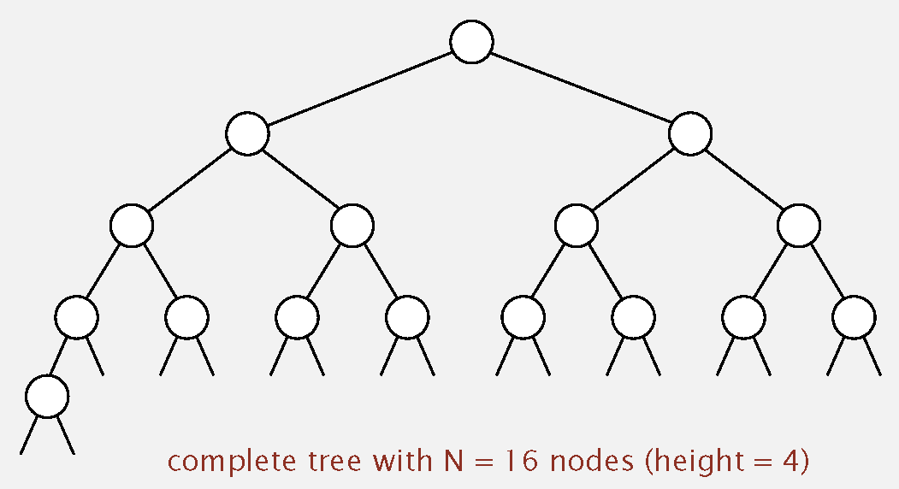
<p>Property: Height of complete binary tree with <math>N</math> nodes is
<math>\lfloor lg N \rfloor</math>.</p>
<p>Proof: Height only increases when <math>N</math> is a power of <math>2</math>.</p>
</li>
<li>
<p><format color = "BlueViolet">Binary heap</format>: Array representation of
a heap-ordered complete binary tree.</p>
<p>Properties:</p>
    <list type = "bullet">
    <li>
    <p>Key in nodes.</p>
    </li>
    <li>
    <p>Parent's key no smaller than children's keys.</p>
    </li>
    <li>
    <p>Largest key is <code>a[1]</code>, which is root of binary tree.</p>
    </li>
    <li>
    <p>Can use array indices to move through tree.</p>
    </li>   
    <li>
    <p>Parent of node at <math>k</math> is at <math>\frac {k}{2}</math>.</p>
    </li>
    <li>
    Children of node at <math>k</math> are at <math>2k</math> and <math>2k + 1</math>.
    </li>
</list>
</li>
</list>
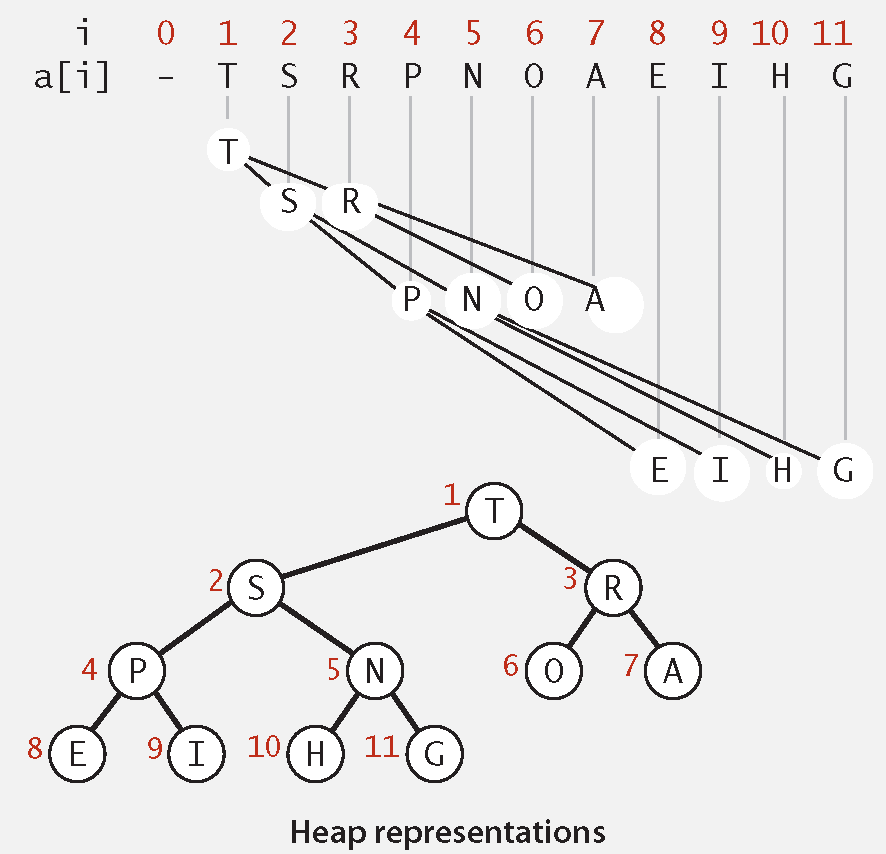

> This is the use of built-in priority queues.
>
{style = "note"}

Java

```Java
import java.util.PriorityQueue;

public class test {
    public static void main(String[] args) {
        PriorityQueue<Integer> pq = new PriorityQueue<Integer>();

        pq.add(10);
        pq.add(20);
        pq.add(15);

        System.out.println(pq.peek()); // Outputs 10
        System.out.println(pq.poll()); // Outputs 10 (Contains Removal)
        System.out.println(pq.peek()); // Outputs 15
    }
}
```

C++

```C++
#include <iostream>
#include <queue>
#include <vector>

int main() {
    std::priority_queue<std::pair<int, int>> pq;
    
    pq.emplace(3, 100); // 100 has priority 3
    pq.emplace(1, 40);  // 40 has priority 1
    pq.emplace(2, 60);  // 60 has priority 2
    
    while (!pq.empty()) {
        std::cout << "Value: " << pq.top().second << ", Priority: " << pq.top().first << std::endl;
        pq.pop();
    }

    return 0;
}
```

Python

```Python
import heapq

# Create a priority queue
priority_queue = []

# Add elements with priorities
heapq.heappush(priority_queue, (2, 'code'))
heapq.heappush(priority_queue, (1, 'eat'))
heapq.heappush(priority_queue, (3, 'sleep'))

# Remove and return the highest priority task
task = heapq.heappop(priority_queue)[1]

print(task)  # Outputs: 'eat'
```

#### 8.1.2 Binary-Heap Implementation of Priority Queues

> This is the binary-heap implementation of priority queues.
>
{style = "note"}

Java

```Java
public class MaxPQ<Key extends Comparable<Key>> {
    private Key[] pq;
    private int n;

    public MaxPQ(int capacity) {
        pq = (Key[]) new Comparable[capacity + 1];
    }

    public boolean isEmpty() {
        return n == 0;
    }

    public void insert(Key key) {
        if (n == pq.length - 1) {
            resize(2 * pq.length);
        }
        pq[++n] = key;
        swim(n);
    }

    public Key delMax() {
        Key max = pq[1];
        exch(1, n--);
        sink(1);
        pq[n+1] = null;
        if ((n > 0) && (n == (pq.length - 1) / 4)) {
            resize(pq.length / 2);
        }
        return max;
    }

    private void swim(int k) {
        while (k > 1 && less(k/2, k)) {
            exch(k, k/2);
            k = k/2;
        }
    }

    private void sink(int k) {
        while (2*k <= n) {
            int j = 2*k;
            if (j < n && less(j, j+1)) j++;
            if (!less(k, j)) break;
            exch(k, j);
            k = j;
        }
    }

    private boolean less(int i, int j) {
        return pq[i].compareTo(pq[j]) < 0;
    }

    private void exch(int i, int j) {
        Key swap = pq[i];
        pq[i] = pq[j];
        pq[j] = swap;
    }

    private void resize(int capacity) {
        Key[] temp = (Key[]) new Comparable[capacity];
        for (int i = 1; i <= n; i++) {
            temp[i] = pq[i];
        }
        pq = temp;
    }
}
```

C++

```C++
#include <vector>
#include <stdexcept>

class BinaryHeap {
public:
    BinaryHeap() : data(1) {} // Start indexing from 1 for easier calculations

    void insert(int value) {
        data.push_back(value); // Add the new value to the end
        swim(data.size() - 1); // Swim it up to its correct position
    }

    int delMax() {
        if (isEmpty()) {
            throw std::runtime_error("Heap is empty");
        }

        int max = data[1]; // The root is the max value
        std::swap(data[1], data.back()); // Swap it with the last value
        data.pop_back(); // Remove the last value (which is now the max)
        sink(1); // Sink the root down to its correct position

        return max;
    }

    bool isEmpty() const {
        return data.size() == 1;
    }

private:
    std::vector<int> data;

    void swim(int k) {
        while (k > 1 && data[k / 2] < data[k]) {
            std::swap(data[k], data[k / 2]);
            k = k / 2;
        }
    }

    void sink(int k) {
        while (2 * k <= data.size() - 1) {
            int j = 2 * k;
            if (j < data.size() - 1 && data[j] < data[j + 1]) {
                j++;
            }
            if (data[k] >= data[j]) {
                break;
            }
            std::swap(data[k], data[j]);
            k = j;
        }
    }
};
```

Python

```Python
class PriorityQueue:
    def __init__(self):
        self.heap = [0]
        self.size = 0

    def float(self, k):
        while k // 2 > 0:
            if self.heap[k] < self.heap[k // 2]:  # If current node is smaller than parent
                self.heap[k], self.heap[k // 2] = self.heap[k // 2], self.heap[k]  # Swap them
            k //= 2

    def insert(self, item):
        self.heap.append(item)
        self.size += 1
        self.float(self.size)

    def sink(self, k):
        while k * 2 <= self.size:
            mc = self.min_child(k)
            if self.heap[k] > self.heap[mc]:
                self.heap[k], self.heap[mc] = self.heap[mc], self.heap[k]
            k = mc

    def min_child(self, k):
        if k * 2 + 1 > self.size:
            return k * 2
        else:
            if self.heap[k*2] < self.heap[k*2+1]:
                return k * 2
            else:
                return k * 2 + 1

    def pop(self):
        retval = self.heap[1]
        self.heap[1] = self.heap[self.size]
        self.size -= 1
        self.heap.pop()
        self.sink(1)
        return retval
```

### 8.2 Indexed Priority Queue

<p><format color = "DarkOrange">Indexed Priority Queue:</format> 
Associate an index between <math>0</math> and <math>N - 1</math> 
with each key in the priority queue.</p>

<list type = "bullet">
<li>
    <p>Client can insert and delete-the-minimum.</p>
</li>
<li>
    <p>Client can change the key by specifying the index.</p>
</li>
</list>

<procedure title = "Indexed Priority Queue">
    <step>
        <p>Start with same code as MinPQ.</p>
    </step>
    <step>
        <p>Maintain parallel arrays keys[], pq[] and qp[] so that: 
        </p>
        <list type = "bullet">
            <li><p>keys[i] is the priority of i.</p></li>
            <li><p>pq[i] is the index of the key in heap position i.
            </p></li>
            <li><p>qp[i] is the heap position of the key with index i
            .</p></li>
        </list>
    </step>
    <step>
        <p>Use swim(qp[i]) implement decreaseKey(i, key).</p>
    </step>
</procedure>

Java

```Java
import java.util.NoSuchElementException;

public class IndexedPriorityQueue {
    private final int maxN;
    private int n;
    private final int[] pq;
    private final int[] qp;
    private final double[] keys;

    public IndexedPriorityQueue(int maxN) {
        if (maxN < 0) throw new IllegalArgumentException();
        this.maxN = maxN;
        n = 0;
        keys = new double[maxN + 1];
        pq = new int[maxN + 1];
        qp = new int[maxN + 1];
        for (int i = 0; i <= maxN; i++) qp[i] = -1;
    }

    public boolean isEmpty() {
        return n == 0;
    }

    public boolean contains(int i) {
        return qp[i] != -1;
    }

    public int size() {
        return n;
    }

    public void insert(int i, double key) {
        if (contains(i)) throw new IllegalArgumentException("Index is already in the priority queue");
        n++;
        qp[i] = n;
        pq[n] = i;
        keys[i] = key;
        swim(n);
    }

    public int delMin() {
        if (n == 0) throw new NoSuchElementException("Priority queue underflow");
        int min = pq[1];
        exch(1, n--);
        sink(1);
        qp[min] = -1;
        pq[n + 1] = -1;
        return min;
    }

    public void decreaseKey(int i, double key) {
        if (!contains(i)) throw new NoSuchElementException("Index is not in the priority queue");
        if (keys[i] <= key) throw new IllegalArgumentException("Calling decreaseKey() with a key greater than or equal to the key in the priority queue");
        keys[i] = key;
        swim(qp[i]);
    }

    private boolean greater(int i, int j) {
        return keys[pq[i]] > keys[pq[j]];
    }

    private void exch(int i, int j) {
        int swap = pq[i];
        pq[i] = pq[j];
        pq[j] = swap;
        qp[pq[i]] = i;
        qp[pq[j]] = j;
    }

    private void swim(int k) {
        while (k > 1 && greater(k / 2, k)) {
            exch(k, k / 2);
            k = k / 2;
        }
    }

    private void sink(int k) {
        while (2 * k <= n) {
            int j = 2 * k;
            if (j < n && greater(j, j + 1)) j++;
            if (!greater(k, j)) break;
            exch(k, j);
            k = j;
        }
    }
}
```

C++ (IndexedPriorityQueue.h)

```C++
#ifndef INDEXED_PRIORITY_QUEUE_H
#define INDEXED_PRIORITY_QUEUE_H

#include <vector>

class IndexedPriorityQueue {
public:
    explicit IndexedPriorityQueue(int maxN);
    [[nodiscard]] bool isEmpty() const;
    [[nodiscard]] bool contains(int i) const;
    [[nodiscard]] int size() const;
    void insert(int i, double key);
    int delMin();
    void decreaseKey(int i, double key);

private:
    int maxN;
    int n;
    std::vector<int> pq;
    std::vector<int> qp;
    std::vector<double> keys;

    [[nodiscard]] bool greater(int i, int j) const;
    void exch(int i, int j);
    void swim(int k);
    void sink(int k);
};

#endif // INDEXED_PRIORITY_QUEUE_H
```

C++ (IndexedPriorityQueue.cpp)

```C++
#include "IndexedPriorityQueue.h"
#include <stdexcept>

IndexedPriorityQueue::IndexedPriorityQueue(const int maxN) : maxN(maxN), n(0), pq(maxN + 1), qp(maxN + 1, -1), keys(maxN + 1) {
    if (maxN < 0) throw std::invalid_argument("maxN must be non-negative");
}

bool IndexedPriorityQueue::isEmpty() const {
    return n == 0;
}

bool IndexedPriorityQueue::contains(int i) const {
    return qp[i] != -1;
}

int IndexedPriorityQueue::size() const {
    return n;
}

void IndexedPriorityQueue::insert(const int i, const double key) {
    if (contains(i)) throw std::invalid_argument("Index is already in the priority queue");
    n++;
    qp[i] = n;
    pq[n] = i;
    keys[i] = key;
    swim(n);
}

int IndexedPriorityQueue::delMin() {
    if (n == 0) throw std::out_of_range("Priority queue underflow");
    const int min = pq[1];
    exch(1, n--);
    sink(1);
    qp[min] = -1;
    pq[n + 1] = -1;
    return min;
}

void IndexedPriorityQueue::decreaseKey(const int i, const double key) {
    if (!contains(i)) throw std::out_of_range("Index is not in the priority queue");
    if (keys[i] <= key) throw std::invalid_argument("Calling decreaseKey() with a key greater than or equal to the key in the priority queue");
    keys[i] = key;
    swim(qp[i]);
}

bool IndexedPriorityQueue::greater(const int i, const int j) const {
    return keys[pq[i]] > keys[pq[j]];
}

void IndexedPriorityQueue::exch(const int i, const int j) {
    int swap = pq[i];
    pq[i] = pq[j];
    pq[j] = swap;
    qp[pq[i]] = i;
    qp[pq[j]] = j;
}

void IndexedPriorityQueue::swim(int k) {
    while (k > 1 && greater(k / 2, k)) {
        exch(k, k / 2);
        k = k / 2;
    }
}

void IndexedPriorityQueue::sink(int k) {
    while (2 * k <= n) {
        int j = 2 * k;
        if (j < n && greater(j, j + 1)) j++;
        if (!greater(k, j)) break;
        exch(k, j);
        k = j;
    }
}
```

Python

```Python
class IndexedPriorityQueue:
    def __init__(self, maxN):
        if maxN < 0:
            raise ValueError("maxN must be non-negative")
        self.maxN = maxN
        self.n = 0
        self.keys = [None] * (maxN + 1)
        self.pq = [0] * (maxN + 1)
        self.qp = [-1] * (maxN + 1)

    def is_empty(self):
        return self.n == 0

    def contains(self, i):
        return self.qp[i] != -1

    def size(self):
        return self.n

    def insert(self, i, key):
        if self.contains(i):
            raise ValueError("Index is already in the priority queue")
        self.n += 1
        self.qp[i] = self.n
        self.pq[self.n] = i
        self.keys[i] = key
        self.swim(self.n)

    def del_min(self):
        if self.n == 0:
            raise IndexError("Priority queue underflow")
        min_index = self.pq[1]
        self.exch(1, self.n)
        self.n -= 1
        self.sink(1)
        self.qp[min_index] = -1
        self.pq[self.n + 1] = -1
        return min_index

    def decrease_key(self, i, key):
        if not self.contains(i):
            raise IndexError("Index is not in the priority queue")
        if self.keys[i] <= key:
            raise ValueError("Calling decrease_key() with a key greater than or equal to the key in the priority queue")
        self.keys[i] = key
        self.swim(self.qp[i])

    def greater(self, i, j):
        return self.keys[self.pq[i]] > self.keys[self.pq[j]]

    def exch(self, i, j):
        self.pq[i], self.pq[j] = self.pq[j], self.pq[i]
        self.qp[self.pq[i]] = i
        self.qp[self.pq[j]] = j

    def swim(self, k):
        while k > 1 and self.greater(k // 2, k):
            self.exch(k, k // 2)
            k //= 2

    def sink(self, k):
        while 2 * k <= self.n:
            j = 2 * k
            if j < self.n and self.greater(j, j + 1):
                j += 1
            if not self.greater(k, j):
                break
            self.exch(k, j)
            k = j
```

### 8.3 Heapsort {id="heapsort"}

<procedure title = "Heapsort">
    <step>
        <p><format color = "Fuchsia">Heap construction</format>: 
        Build max heap using bottom-up method.</p>
    </step>
    <step>
        <p><format color = "Fuchsia">Sortdown</format>: Repeatedly
        delete the largest remaining item.</p>
    </step>
</procedure>

<p><format color = "BlueViolet">Properties:</format> </p>

<list>
<li>
    <p>Heap construction uses <math>\leq 2N</math> compares and 
    exchanges.</p>
</li>
<li>
    <p>Heapsort uses <math>\leq 2N \log N</math> compares and 
    exchanges.</p>
</li>
<li>
    <p>Heapsort is an in-place algorithm with <math>N \log N</math> 
    worst-case.</p>
</li>
</list>

<tip>
<p>It is optimal for both time and space, but:</p>
<list>
    <li>
        <p>Inner loop longer than quick sort's.</p>
    </li>
    <li>
        <p>Makes poor use of cache memory.</p>
    </li>
    <li>
        <p>Not stable.</p>
    </li>
</list>
</tip>

<note>
For information about the performance of heapsort, please refer
to the <a href="Data-Structures-and-Algorithms-3.md" anchor="sortperf" 
summary="Table for Comparing Performance of Sorting Algorithm">table 
for sorting performance</a>.
</note>

Java

```Java
public class Heap {

    private Heap() { }

    public static void sort(Comparable[] pq) {
        int n = pq.length;
        for (int k = n/2; k >= 1; k--)
            sink(pq, k, n);
        int k = n;
        while (k > 1) {
            exch(pq, 1, k--);
            sink(pq, 1, k);
        }
    }

    private static void sink(Comparable[] pq, int k, int n) {
        while (2 * k <= n) {
            int j = 2 * k;
            if (j < n && less(pq, j, j+1)) j++;
            if (!less(pq, k, j)) break;
            exch(pq, k, j);
            k = j;
        }
    }

    private static boolean less(Comparable[] pq, int i, int j) {
        return pq[i-1].compareTo(pq[j-1]) < 0;
    }

    private static void exch(Object[] pq, int i, int j) {
        Object swap = pq[i-1];
        pq[i-1] = pq[j-1];
        pq[j-1] = swap;
    }

}
```

C++

```C++
#include <iostream>

void heapify(int arr[], int n, int i) {
    int largest = i;
    int left = 2 * i + 1;
    int right = 2 * i + 2;

    if (left < n && arr[left] > arr[largest])
        largest = left;

    if (right < n && arr[right] > arr[largest])
        largest = right;

    if (largest != i) {
        std::swap(arr[i], arr[largest]);
        heapify(arr, n, largest);
    }
}

void heapSort(int arr[], int n) {
    for (int i = n / 2 - 1; i >= 0; i--)
        heapify(arr, n, i);

    for (int i = n - 1; i >= 0; i--) {
        std::swap(arr[0], arr[i]);
        heapify(arr, i, 0);
    }
}
```

Python

```Python
def heapify(arr, n, i):
    largest = i
    left = 2 * i + 1
    right = 2 * i + 2

    if left < n and arr[i] < arr[left]:
        largest = left

    if right < n and arr[largest] < arr[right]:
        largest = right

    if largest != i:
        arr[i], arr[largest] = arr[largest], arr[i]
        heapify(arr, n, largest)

def heapSort(arr):
    n = len(arr)

    for i in range(n, -1, -1):
        heapify(arr, n, i)

    for i in range(n-1, 0, -1):
        arr[i], arr[0] = arr[0], arr[i]
        heapify(arr, i, 0)

def printArray(arr):
    for i in arr:
        print(i, end=" ")
    print()
```

## 9 Symbol Table & Binary Search Tree

### 9.1 Symbol Table & Elementary Implementation

<p><format color = "BlueViolet">Symbol table</format>: Key-value pair
abstraction.</p>

<list>
<li>
<p>Insert a value with a specified key.</p>
</li>
<li>
<p>Given a key, <format color = "OrangeRed">search</format> for the 
corresponding value.</p>
</li>
</list>

#### 9.1.1 Sequential Search (unordered list) {id="sequential-search"}

<p>Method: Maintain an (unordered) linked list of key-value pairs.</p>

<list type = "bullet">
<li>
<p><format color = "BlueViolet">Search</format>: Scan through all keys 
until find a match.</p>
</li>
<li>
<p><format color = "BlueViolet">Search</format>: Scan through all keys 
until find a match; if no match add to front.</p>
</li>
</list>

#### 9.1.2 Ordered Array {id="ordered-array"}

<p><format color = "BlueViolet">Method</format>: Maintain an ordered 
array of key-value pairs.</p>

```Java
    public Value get(Key key) {
        if(isEmpty) return null;
        int i = rank(key);
        if (i < N && keys[i].compareTo(key) == 0) return vals[i];
        else return null;
    }
    
    private int rank(Key key) {
        int lo = 0, hi = N - 1;
        while (lo <= hi) {
            int mid = lo + (hi - lo) / 2;
            int cmp = key.compareTo(keys[mid]);
            if (cmp < 0) hi = mid - 1;
            else if (cmp > 0) lo = mid + 1;
            else return mid;
        }
        return lo;
    }
```

### 9.2 Binary Search Trees {id="BST"}

<p>Def: A BST is a <format color = "OrangeRed">binary tree</format> in 
<format color = "OrangeRed">symmetric order.</format></p>

<p>A <format color = "BlueViolet">binary tree</format> is either:</p>
<list type = "bullet">
<li>Empty.</li>
<li>Two disjoint binary trees (left and right).</li>
</list>

<p><format color = "BlueViolet">Symmetric order</format>: Each node has
a key, and every node's key is:</p>
<list>
<li>Larger than all keys in the left subtree.</li>
<li>Smaller than all keys in the right subtree.</li>
</list>

<procedure title = "Basic Plan for BST Search" type = "choices">
<step>
If less, go left.
</step>
<step>
If greater, go right.
</step>
<step>
If equal, search hit.
</step>
</procedure>

<procedure title = "Basic Plan for BST Insertion" type = "choices">
<step>
If less, go left.
</step>
<step>
If greater, go right.
</step>
<step>
Search for keys, then two cases；
<list type = "bullet">
<li>
Key in tree => reset value
</li>
<li>
Key not in tree => add new node
</li>
</list>
</step>
</procedure>

<p>Property: If <math>N</math> distinct keys are inserted into a BST
in <format color = "OrangeRed">random order</format>, the expected number 
of compares for a search/insert is <math>\sim 2 \ln N</math>.
</p>

<p>Proof: 1-1 correspondence with quicksort partitioning.</p>

<p><format color = "BlueViolet">Floor</format>: Largest key &le; to a 
given key.</p>

<p><format color = "BlueViolet">Ceiling</format>: Smallest key &ge; to
a given key.</p>

<p><format color = "BlueViolet">Rank</format>: How many keys &lt; k</p>

<procedure title = "Basic Plan for Computing the Floor" type = "choices">
<step>
<p>
<math>k</math> equals to the key at the root. => The floor of 
<math>k</math> is <math>k</math>.
</p>
</step>
<step>
<p>
<math>k</math> is less than the key at the root. => The floor of
<math>k</math> is in the left subtree.
</p>
</step>
<step>
<p>
<math>k</math> is greater than the key at the root. => The floor of
<math>k</math> is in the right subtree (if there is any key &le; <math> k</math>); 
otherwise, it is the key at the root.
</p>
</step>
</procedure>

<procedure title = "Basic Plan for Deleting the Minimum" type = "choices">
<step>
<p>Go left until finding a node with a null left link.</p>
</step>
<step>
<p>Replace that node by its right link.</p>
</step>
<step>
<p>Update subtree counts.</p>
</step>
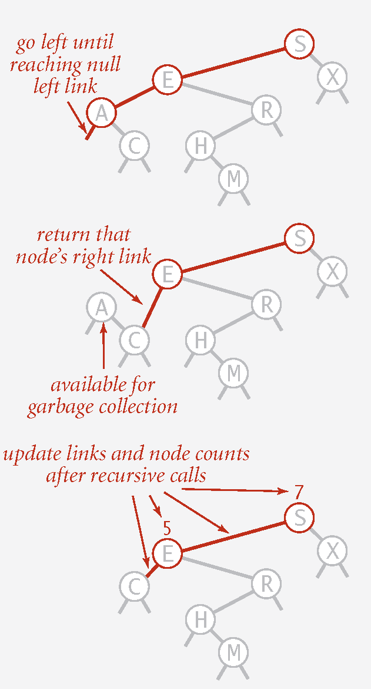
</procedure>

<procedure title = "Basic Plan for Habbard Deletion" type = "choices">
<step>
<p>0 children: Delete <math>t</math> by setting parent link to null.</p>
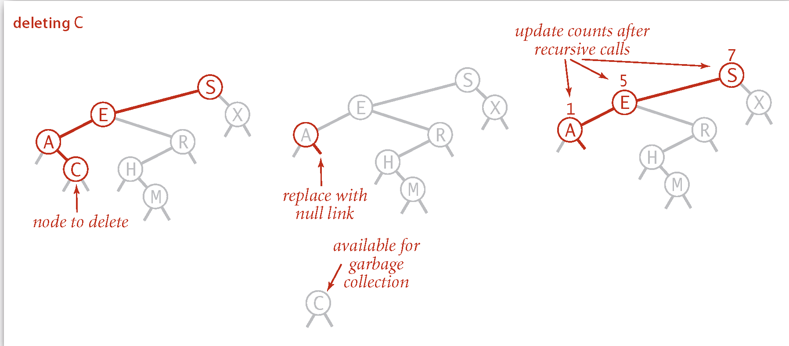
</step>
<step>
<p>1 child: Delete <math>t</math> by replacing parent link.</p>
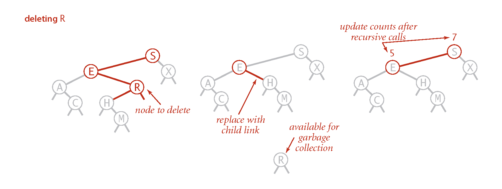
</step>
<step>
<p>2 children:</p>
<list type = "bullet">
<li>
<p>Find successor <math>x</math> of <math>t</math>.</p>
</li>
<li>
<p>Delete the minimum in its <math>t</math>'s right subtree.</p>
</li>
<li>
<p>Put <math>x</math> in <math>t</math>'s spot.</p>
</li>
</list>
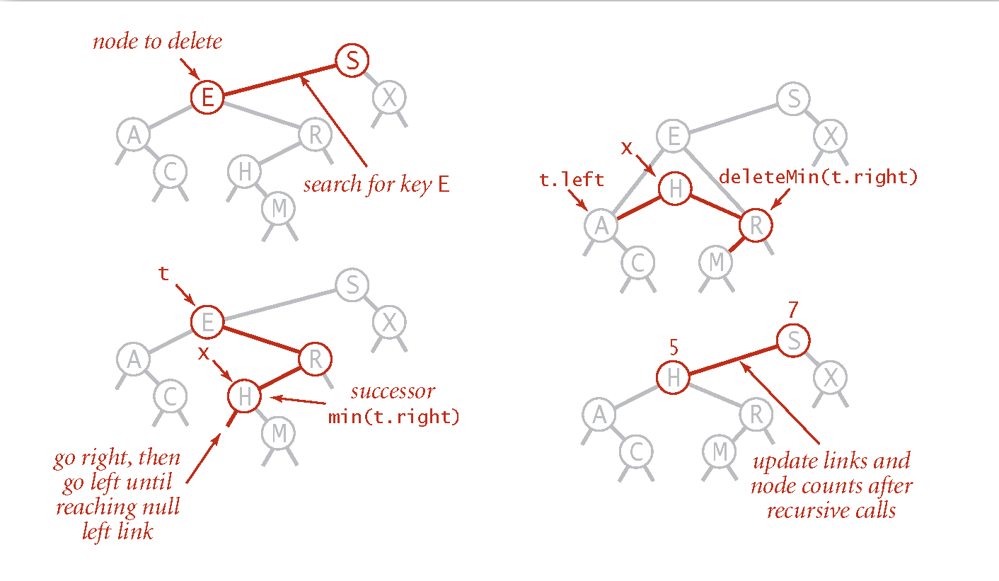
</step>
</procedure>

Java

```Java
public class BST<Key extends Comparable<Key>, Value> {
    private Node root;

    private class Node {
        private Key key;
        private Value val;
        private Node left, right;
        private int size;

        public Node(Key key, Value val, int size) {
            this.key = key;
            this.val = val;
            this.size = size;
        }
    }

    // BST Search
    public Value get(Key key) {
        Node x = root;
        while (x != null) {
            int cmp = key.compareTo(x.key);
            if (cmp < 0) x = x.left;
            else if (cmp > 0) x = x.right;
            else return x.val;
        }
        return null;
    }

    // BST Insertion
    public void put (Key key, Value val) {
        root = put(root, key, val);
    }

    private Node put(Node x, Key key, Value val) {
        if (x == null) return new Node(key, val, 1);
        int cmp = key.compareTo(x.key);
        if (cmp < 0) x.left = put(x.left, key, val);
        else if (cmp > 0) x.right = put(x.right, key, val);
        else x.val = val;
        x.size = 1 + size(x.left) + size(x.right);
        return x;
    }

    // Largest Key <= to a given key
    public Key floor(Key key) {
        Node x = floor(root, key);
        if (x == null) return null;
        return x.key;
    }

    private Node floor(Node x, Key key) {
        if (x == null) return null;
        int cmp = key.compareTo(x.key);
        if (cmp == 0) return x;
        if (cmp < 0) return floor(x.left, key);
        Node t = floor(x.right, key);
        if (t != null) return t;
        else return x;
    }
    
    public Key ceiling(Key key) {
        Node x = ceiling(root, key);
        if (x == null) return null;
        else return x.key;
    }

    private Node ceiling(Node x, Key key) {
        if (x == null) return null;
        int cmp = key.compareTo(x.key);
        if (cmp == 0) return x;
        if (cmp < 0) {
            Node t = ceiling(x.left, key);
            if (t != null) return t;
            else return x;
        }
        return ceiling(x.right, key);
    }

    // Number of nodes in the tree
    public int size() {
        return size(root);
    }

    private int size(Node x) {
        if (x == null) return 0;
        else return x.size;
    }

    // How many keys < k
    public int rank(Key key) {
        return rank(key, root);
    }

    private int rank(Key key, Node x) {
        if (x == null) return 0;
        int cmp = key.compareTo(x.key);
        if (cmp < 0) return rank(key, x.left);
        else if (cmp > 0) return 1 + size(x.left) + rank(key, x.right);
        else return size(x.left);
    }

    public void deleteMin(Key key) {
        root = deleteMin(root);
    }

    private Node deleteMin(Node x) {
        if (x.left == null) return x.right;
        x.left = deleteMin(x.left);
        x.size = size(x.left) + size(x.right) + 1;
        return x;
    }

    public void deleteMax() {
        root = deleteMax(root);
    }

    private Node deleteMax(Node x) {
        if (x.right == null) return x.left;
        x.right = deleteMax(x.right);
        x.size = size(x.left) + size(x.right) + 1;
        return x;
    }

    public void delete(Key key) {
        root = delete(root, key);
    }

    // Hibbard Deletion
    private Node delete(Node x, Key key) {
        if (x == null) return null;
        int cmp = key.compareTo(x.key);
        if (cmp < 0) x.left = delete(x.left, key);
        else if (cmp > 0) x.right = delete(x.right, key);
        else {
            if (x.right == null) return x.left;
            if (x.left == null) return x.right;
            Node t = x;
            x = min(t.right);
            x.right = deleteMin(t.right);
            x.left = t.left;
        }
        x.size = size(x.left) + size(x.right) + 1;
        return x;
    }
}
```

C++

```C++
#include <iostream>

class BST {
private:
    struct Node {
        int key;
        int val;
        Node* left;
        Node* right;
        int size;

        Node(int key, int val, int size) : key(key), val(val), size(size), left(nullptr), right(nullptr) {}
    };

    Node* root;

    Node* put(Node* x, int key, int val) {
        if (x == nullptr) return new Node(key, val, 1);
        if (key < x->key) x->left = put(x->left, key, val);
        else if (key > x->key) x->right = put(x->right, key, val);
        else x->val = val;
        x->size = 1 + size(x->left) + size(x->right);
        return x;
    }

    Node* floor(Node* x, int key) {
        if (x == nullptr) return nullptr;
        if (key == x->key) return x;
        if (key < x->key) return floor(x->left, key);
        Node* t = floor(x->right, key);
        if (t != nullptr) return t;
        else return x;
    }

    Node* ceiling(Node* x, int key) {
        if (x == nullptr) return nullptr;
        if (key == x->key) return x;
        if (key < x->key) {
            Node* t = ceiling(x->left, key);
            if (t != nullptr) return t;
            else return x;
        }
        return ceiling(x->right, key);
    }

    int size(Node* x) {
        if (x == nullptr) return 0;
        else return x->size;
    }

    int rank(int key, Node* x) {
        if (x == nullptr) return 0;
        if (key < x->key) return rank(key, x->left);
        else if (key > x->key) return 1 + size(x->left) + rank(key, x->right);
        else return size(x->left);
    }

    Node* deleteMin(Node* x) {
        if (x->left == nullptr) return x->right;
        x->left = deleteMin(x->left);
        x->size = size(x->left) + size(x->right) + 1;
        return x;
    }

    Node* deleteMax(Node* x) {
        if (x->right == nullptr) return x->left;
        x->right = deleteMax(x->right);
        x->size = size(x->left) + size(x->right) + 1;
        return x;
    }

    Node* deleteKey(Node* x, int key) {
        if (x == nullptr) return nullptr;
        if (key < x->key) x->left = deleteKey(x->left, key);
        else if (key > x->key) x->right = deleteKey(x->right, key);
        else {
            if (x->right == nullptr) return x->left;
            if (x->left == nullptr) return x->right;
            Node* t = x;
            x = min(t->right);
            x->right = deleteMin(t->right);
            x->left = t->left;
        }
        x->size = size(x->left) + size(x->right) + 1;
        return x;
    }

    Node* min(Node* x) {
        if (x->left == nullptr) return x;
        else return min(x->left);
    }

public:
    BST() : root(nullptr) {}

    void put(int key, int val) {
        root = put(root, key, val);
    }

    int floor(int key) {
        Node* x = floor(root, key);
        if (x == nullptr) return -1;
        return x->key;
    }
    
    int ceiling(int key) {
        Node* x = ceiling(root, key);
        if (x == nullptr) return nullptr;
        else return x->key;
    }

    int size() {
        return size(root);
    }

    int rank(int key) {
        return rank(key, root);
    }

    void deleteMin() {
        root = deleteMin(root);
    }

    void deleteMax() {
        root = deleteMax(root);
    }

    void deleteKey(int key) {
        root = deleteKey(root, key);
    }
};
```

Python

```Python
class Node:
    def __init__(self, key, val, size):
        self.key = key
        self.val = val
        self.size = size
        self.left = None
        self.right = None


class BST:
    def __init__(self):
        self.root = None

    def get(self, key):
        x = self.root
        while x is not None:
            if key < x.key:
                x = x.left
            elif key > x.key:
                x = x.right
            else:
                return x.val
        return None

    def put(self, key, val):
        self.root = self._put(self.root, key, val)

    def _put(self, x, key, val):
        if x is None:
            return Node(key, val, 1)
        if key < x.key:
            x.left = self._put(x.left, key, val)
        elif key > x.key:
            x.right = self._put(x.right, key, val)
        else:
            x.val = val
        x.size = 1 + self.size(x.left) + self.size(x.right)
        return x

    def floor(self, key):
        x = self._floor(self.root, key)
        if x is None:
            return None
        return x.key

    def _floor(self, x, key):
        if x is None:
            return None
        if key == x.key:
            return x
        if key < x.key:
            return self._floor(x.left, key)
        t = self._floor(x.right, key)
        if t is not None:
            return t
        else:
            return x
            
    def ceiling(self, key):
        x = self._ceiling(self.root, key)
        return None if x is None else x.key

    def _ceiling(self, x, key):
        if x is None:
            return None
        if key == x.key:
            return x
        if key < x.key:
            t = self._ceiling(x.left, key)
            return x if t is None else t
        return self._ceiling(x.right, key)

    def size(self, x=None):
        if x is None:
            x = self.root
        if x is None:
            return 0
        else:
            return x.size

    def rank(self, key):
        return self._rank(key, self.root)

    def _rank(self, key, x):
        if x is None:
            return 0
        if key < x.key:
            return self._rank(key, x.left)
        elif key > x.key:
            return 1 + self.size(x.left) + self._rank(key, x.right)
        else:
            return self.size(x.left)

    def deleteMin(self):
        self.root = self._deleteMin(self.root)

    def _deleteMin(self, x):
        if x.left is None:
            return x.right
        x.left = self._deleteMin(x.left)
        x.size = self.size(x.left) + self.size(x.right) + 1
        return x

    def deleteMax(self):
        self.root = self._deleteMax(self.root)

    def _deleteMax(self, x):
        if x.right is None:
            return x.left
        x.right = self._deleteMax(x.right)
        x.size = self.size(x.left) + self.size(x.right) + 1
        return x

    def delete(self, key):
        self.root = self._delete(self.root, key)

    def _delete(self, x, key):
        if x is None:
            return None
        if key < x.key:
            x.left = self._delete(x.left, key)
        elif key > x.key:
            x.right = self._delete(x.right, key)
        else:
            if x.right is None:
                return x.left
            if x.left is None:
                return x.right
            t = x
            x = self._min(t.right)
            x.right = self._deleteMin(t.right)
            x.left = t.left
        x.size = self.size(x.left) + self.size(x.right) + 1
        return x

    def _min(self, x):
        if x.left is None:
            return x
        else:
            return self._min(x.left)
```

### 9.3 Traversal

<p>To traverse binary trees with depth-first search, execute the 
following three operations in a certain order: </p>

<list type = "bullet">
<li>
<p><format color = "Fuchsia">N:</format> Visit the current node.</p>
</li>
<li>
<p><format color = "Fuchsia">L:</format> Recursively traverse the 
current node's left subtree.</p>
</li>
<li>
<p><format color = "Fuchsia">R:</format> Recursively traverse the 
current node's right subtree.</p>
</li>
</list>

<p>Three types of traversal: </p>

<list type = "alpha-lower">
<li>
<p><format color = "Red">Pre-order</format> => NLR</p>
</li>
<li>
<p><format color = "Green">Post-order</format> => LRN</p>
</li>
<li>
<p><format color = "Blue">In-order</format> => LNR</p>
</li>
</list>

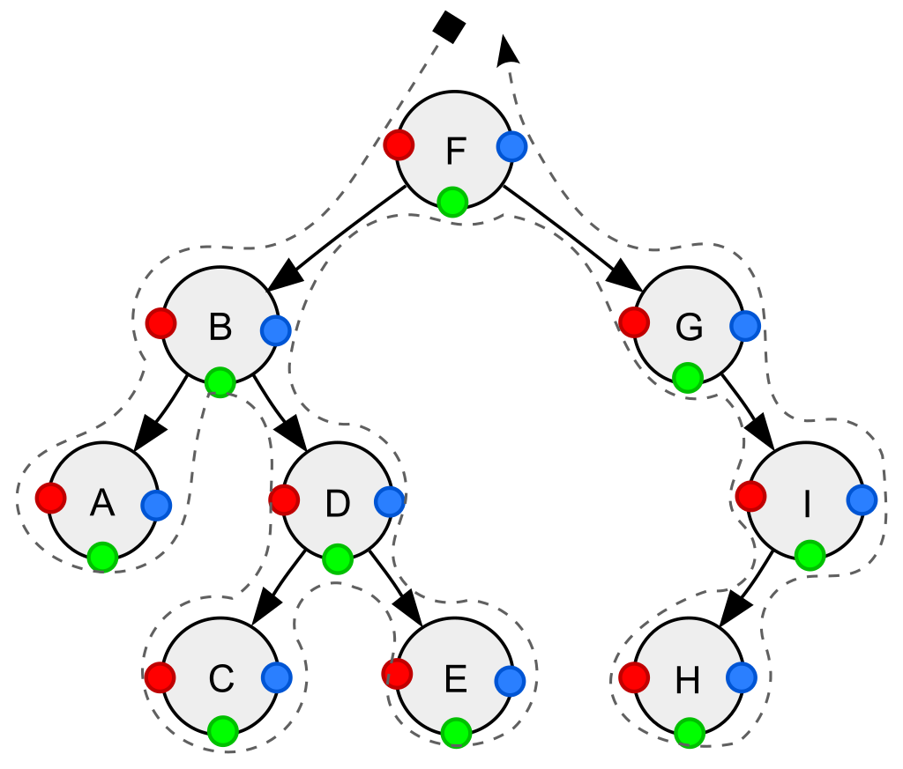

<p>Depth-first traversal (dotted path) of a binary tree:</p>
<list type = "alpha-lower">
<li>
<p><format color = "Red">Pre-order</format> <format style = "italic">
(node visited at position red)</format>:</p>
<p>F, B, A, D, C, E, G, I, H;</p>
</li>
<li>
<p><format color = "Green">In-order</format> <format style = "italic">
(node visited at position green)</format>:</p>
<p>A, B, C, D, E, F, G, H, I;</p>
</li>
<li>
<p><format color = "Blue">Post-order</format> <format style = "italic">
(node visited at position blue)</format>:</p>
<p>A, C, E, D, B, H, I, G, F.</p>
</li>
</list>

## 10 Balanced Search Trees

<table style = "none">
<tr>
    <td rowspan = "2">Implementation</td>
    <td colspan="3">Worst-Case Cost (after <math>N</math> inserts)
    </td>
    <td colspan = "3">Average Case (after <math>N</math> random 
    inserts)</td>
    <td rowspan = "2">Ordered Iteration?</td>
    <td rowspan = "2">Key Interface</td>
</tr>
<tr>
    <td>Search</td>
    <td>Insert</td>
    <td>Delete</td>
    <td>Search Hit</td>
    <td>Insert</td>
    <td>Delete</td>
</tr>
<tr>
    <td>Sequential Search (unordered list)</td>
    <td><math>N</math></td>
    <td><math>N</math></td>
    <td><math>N</math></td>
    <td><math>\frac {N}{2}</math></td>
    <td><math>N</math></td>
    <td><math>N</math></td>
    <td>no</td>
    <td><code>equals()</code></td>
</tr>
<tr>
    <td>Binary Search (ordered list)</td>
    <td><math>\lg N</math></td>
    <td><math>N</math></td>
    <td><math>N</math></td>
    <td><math>\lg N</math></td>
    <td><math>\frac {N}{2}</math></td>
    <td><math>\frac {N}{2}</math></td>
    <td>yes</td>
    <td><code>compareTo()</code></td>
</tr>
<tr>
    <td>BST</td>
    <td><math>N</math></td>
    <td><math>N</math></td>
    <td><math>N</math></td>
    <td><math>1.39 \log N</math></td>
    <td><math>1.39 \log N</math></td>
    <td>?</td>
    <td>yes</td>
    <td><code>compareTo()</code></td>
</tr>
<tr>
    <td>2-3 Tree</td>
    <td><math>c \log N</math></td>
    <td><math>c \log N</math></td>
    <td><math>c \log N</math></td>
    <td><math>c \log N</math></td>
    <td><math>c \log N</math></td>
    <td><math>c \log N</math></td>
    <td>yes</td>
    <td><code>compareTo()</code></td>
</tr>
<tr>
    <td>Red-Black BST</td>
    <td><math>2 \log N</math></td>
    <td><math>2 \log N</math></td>
    <td><math>2 \log N</math></td>
    <td><math>1.00 \lg N</math></td>
    <td><math>1.00 \lg N</math></td>
    <td><math>1.00 \lg N</math></td>
    <td>yes</td>
    <td><code>compareTo()</code></td>
</tr>
</table>

### 10.1 2-3 Trees {id="2-3-trees"}

<p>Basic properties: </p>

<list type = "bullet">
<li>
<p>Allow 1 or 2 keys per node.</p>
</li>
<li>
<p>2-node: one key, two children.</p>
</li>
<li>
<p>3-node: two keys, three children.</p>
</li>
</list>

<p>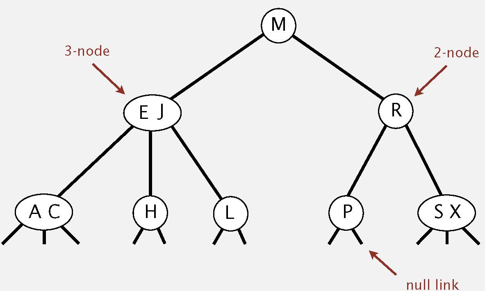</p>

<procedure title = "Basic Plan for Searching in 2-3 Tree">
<step>
<p>Compare search key against keys in node.</p>
</step>
<step>
<p>Find interval containing search key.</p>
</step>
<step>
<p>Follow associated key (recursively).</p>
</step>
</procedure>

<procedure title = "Basic Plan for Inserting into a 2-node At Bottom">
<step>
<p>Search for key, as usual.</p>
</step>
<step>
<p>Replace 2-node with 3-node.</p>
</step>
</procedure>

<procedure title = "Basic Plan for Inserting into a 3-node At Bottom">
<step>
<p>Add new key to 3-node to create a temporary 4-node.</p>
</step>
<step>
<p>Move middle key in 4-node into a parent.</p>
</step>
<step>
<p>Repeat up the tree, as necessary.</p>
</step>
<step>
<p>If you reach the root and it's a 4-node, split it into three 2-nodes.</p>
</step>
</procedure>

<p>Properties: </p>

<list type = "bullet">
<li>
<p>Maintain symmetric order and perfect balance: Every path from 
root to null link has same length.</p>
</li>
<li>
<p><format color = "BlueViolet">Worst case</format>: 
<math>\lg N</math> => all 2-nodes</p>
</li>
<li>
<p><format color = "BlueViolet">Best case</format>: 
<math>\log_{3} N \approx 0.631 \lg N</math> </p>
</li>
<li>
<p>Between 12 and 20 for a million nodes.</p>
</li>
<li>
<p>Between 18 and 30 for a billion nodes.</p>
</li>
<li>
<p>Guaranteed <format color = "OrangeRed">logarithmic</format> performance
for search and insert.</p>
</li>
</list>

<tip>
<p>But direct implementation is complicated, because:</p>
<list type = "bullet">
<li>
<p>Maintaining multiple node types is cumbersome.</p>
</li>
<li>
<p>Need multiple compares to move down tree.</p>
</li>
<li>
<p>Need to move back up the tree to split 4-nodes.</p>
</li>
<li>
<p>Large number of cases for splitting.</p>
</li>
</list>
</tip>

### 10.2 Red-Black BSTs {id="red-black-bsts"}

#### 10.2.1 Left-Leaning Red-Black BSTs

<list type = "alpha-lower">
<li>
<p><format color = "BlueViolet">Definition 1</format>: </p>
<list type = "bullet">
<li>
<p>Represent 2–3 tree as a BST.</p>
</li>
<li>
<p>Use "internal" left-leaning links as "glue" for 3–nodes.</p>
</li>
</list>
</li>
<li>
<p><format color = "BlueViolet">Definition 2</format>: A BST such 
that: </p>
<list type = "bullet">
<li>
<p>No node has two red links connected to it.</p>
</li>
<li>
<p>Every path from root to null link has the same number of black links.</p>
</li>
<li>
<p>Red links lean left.</p>
</li>
</list>
</li>
</list>
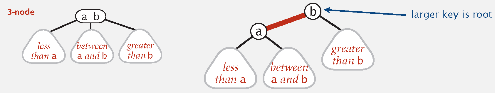

<note><p>1–1 correspondence between 2–3 and LLRB!</p></note>

#### 10.2.2 Elementary Red-Black BST Operations

<list type = "alpha-lower">
<li>
<p><format color = "BlueViolet">Left rotation:</format> Orient a 
(temporarily) right-leaning red link to lean left.</p>
</li>
<li>
<p><format color = "BlueViolet">Right rotation:</format> Orient a 
left-leaning red link to (temporarily) lean right.</p>
</li>
<li>
<p><format color = "BlueViolet">Color flip:</format> Recolor to split
a (temporary) 4-node.</p>
</li>
</list>

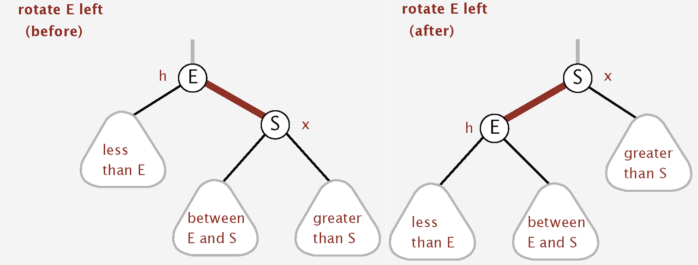


#### 10.2.3 Red-Black BST Operations

<warning><p>Most ops (e.g., search, floor, iteration, selection)
are the same as for elementary BST, but run faster because of better 
performance.</p></warning>

<procedure title = "Case 1: Insert into a 2-node at the bottom | 
Insert into a tree with exactly 1 node.">
<step>
<p>Do standard BST insert; color new link red.</p>
</step>
<step>
<p>If new red link is a right link, rotate left.</p>
</step>
</procedure>

<procedure title = "Case 2: Insert into a 3-node at the bottom | 
Insert into a tree with exactly 2 nodes.">
<step>
<p>Do standard BST insert; color new link red.</p>
</step>
<step>
<p>Rotate to balance the 4-node (if needed).</p>
</step>
<step>
<p>Flip colors to pass red link up one level.</p>
</step>
<step>
<p>Rotate to make lean left (if needed).</p>
</step>
<step>
<p>Repeat case 1 or case 2 up the tree (if needed).</p>
</step>
</procedure>

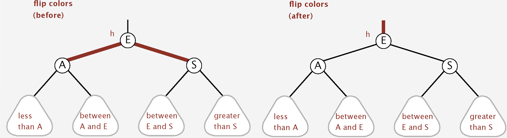

<procedure title = "Insertion for Red-Black BSTs" type = "choices">
<step>
<p>Right child red, left child black: <format color = "OrangeRed">rotate 
left</format>.</p>
</step>
<step>
<p>Left child, left-left grandchild red: <format color = "OrangeRed">rotate
right</format>.</p>
</step>
<step>
<p>Both children red: <format color = "OrangeRed">flip colors</format>.</p>
</step>
</procedure>

#### 10.2.4 Red-Black BST Implementations

Java

```Java
import java.util.NoSuchElementException;

public class RedBlackBST<Key extends Comparable<Key>, Value> {

    private static final boolean RED   = true;
    private static final boolean BLACK = false;

    private Node root;   

    // BST helper node data type
    private class Node {
        private Key key;          
        private Value val;         
        private Node left, right;  
        private boolean color;  
        private int size;          

        public Node(Key key, Value val, boolean color, int size) {
            this.key = key;
            this.val = val;
            this.color = color;
            this.size = size;
        }
    }

    public RedBlackBST() {
    }

    // is node x red; false if x is null ?
    private boolean isRed(Node x) {
        if (x == null) return false;
        return x.color == RED;
    }

    // number of node in subtree rooted at x; 0 if x is null
    private int size(Node x) {
        if (x == null) return 0;
        return x.size;
    }
    
    // Returns the number of key-value pairs in this symbol table.
    public int size() {
        return size(root);
    }

    // Is this symbol table empty?
    public boolean isEmpty() {
        return root == null;
    }

    // value associated with the given key in subtree rooted at x; null if no such key
    public Value get(Key key) {
        if (key == null) throw new IllegalArgumentException("argument to get() is null");
        return get(root, key);
    }
    
    private Value get(Node x, Key key) {
        while (x != null) {
            int cmp = key.compareTo(x.key);
            if      (cmp < 0) x = x.left;
            else if (cmp > 0) x = x.right;
            else              return x.val;
        }
        return null;
    }

    // Does this symbol table contain the given key?
    public boolean contains(Key key) {
        return get(key) != null;
    }
    
    // Inserts the specified key-value pair into the symbol table, overwriting the old
    // value with the new value if the symbol table already contains the specified key.
    // Deletes the specified key (and its associated value) from this symbol table
    // if the specified value is null.
     
    public void put(Key key, Value val) {
        if (key == null) throw new IllegalArgumentException("first argument to put() is null");
        if (val == null) {
            delete(key);
            return;
        }

        root = put(root, key, val);
        root.color = BLACK;
    }
    
    private Node put(Node h, Key key, Value val) {
        if (h == null) return new Node(key, val, RED, 1);

        int cmp = key.compareTo(h.key);
        if      (cmp < 0) h.left  = put(h.left,  key, val);
        else if (cmp > 0) h.right = put(h.right, key, val);
        else              h.val   = val;

        if (isRed(h.right) && !isRed(h.left))      h = rotateLeft(h);
        if (isRed(h.left)  &&  isRed(h.left.left)) h = rotateRight(h);
        if (isRed(h.left)  &&  isRed(h.right))     flipColors(h);
        h.size = size(h.left) + size(h.right) + 1;

        return h;
    }

    // delete the key-value pair with the minimum key rooted at h
    public void deleteMin() {
        if (isEmpty()) throw new NoSuchElementException("BST underflow");

        // if both children of root are black, set root to red
        if (!isRed(root.left) && !isRed(root.right))
            root.color = RED;

        root = deleteMin(root);
        if (!isEmpty()) root.color = BLACK;
    }

    private Node deleteMin(Node h) {
        if (h.left == null)
            return null;

        if (!isRed(h.left) && !isRed(h.left.left))
            h = moveRedLeft(h);

        h.left = deleteMin(h.left);
        return balance(h);
    }

    // delete the key-value pair with the maximum key rooted at h
    public void deleteMax() {
        if (isEmpty()) throw new NoSuchElementException("BST underflow");

        // if both children of root are black, set root to red
        if (!isRed(root.left) && !isRed(root.right))
            root.color = RED;

        root = deleteMax(root);
        if (!isEmpty()) root.color = BLACK;
    }

    private Node deleteMax(Node h) {
        if (isRed(h.left))
            h = rotateRight(h);

        if (h.right == null)
            return null;

        if (!isRed(h.right) && !isRed(h.right.left))
            h = moveRedRight(h);

        h.right = deleteMax(h.right);

        return balance(h);
    }

    public void delete(Key key) {
        if (key == null) throw new IllegalArgumentException("argument to delete() is null");
        if (!contains(key)) return;

        // if both children of root are black, set root to red
        if (!isRed(root.left) && !isRed(root.right))
            root.color = RED;

        root = delete(root, key);
        if (!isEmpty()) root.color = BLACK;
    }

    // delete the key-value pair with the given key rooted at h
    private Node delete(Node h, Key key) {
        if (key.compareTo(h.key) < 0)  {
            if (!isRed(h.left) && !isRed(h.left.left))
                h = moveRedLeft(h);
            h.left = delete(h.left, key);
        }
        else {
            if (isRed(h.left))
                h = rotateRight(h);
            if (key.compareTo(h.key) == 0 && (h.right == null))
                return null;
            if (!isRed(h.right) && !isRed(h.right.left))
                h = moveRedRight(h);
            if (key.compareTo(h.key) == 0) {
                Node x = min(h.right);
                h.key = x.key;
                h.val = x.val;
                h.right = deleteMin(h.right);
            }
            else h.right = delete(h.right, key);
        }
        return balance(h);
    }

    // make a left-leaning link lean to the right
    private Node rotateRight(Node h) {
        assert (h != null) && isRed(h.left);
        Node x = h.left;
        h.left = x.right;
        x.right = h;
        x.color = h.color;
        h.color = RED;
        x.size = h.size;
        h.size = size(h.left) + size(h.right) + 1;
        return x;
    }

    // make a right-leaning link lean to the left
    private Node rotateLeft(Node h) {
        assert (h != null) && isRed(h.right);
        Node x = h.right;
        h.right = x.left;
        x.left = h;
        x.color = h.color;
        h.color = RED;
        x.size = h.size;
        h.size = size(h.left) + size(h.right) + 1;
        return x;
    }

    // flip the colors of a node and its two children
    private void flipColors(Node h) {
        h.color = !h.color;
        h.left.color = !h.left.color;
        h.right.color = !h.right.color;
    }

    // Assuming that h is red and both h.left and h.left.left
    // are black, make h.left or one of its children red.
    private Node moveRedLeft(Node h) {
        flipColors(h);
        if (isRed(h.right.left)) {
            h.right = rotateRight(h.right);
            h = rotateLeft(h);
            flipColors(h);
        }
        return h;
    }

    // Assuming that h is red and both h.right and h.right.left
    // are black, make h.right or one of its children red.
    private Node moveRedRight(Node h) {
        flipColors(h);
        if (isRed(h.left.left)) {
            h = rotateRight(h);
            flipColors(h);
        }
        return h;
    }

    // restore red-black tree invariant
    private Node balance(Node h) {
        if (isRed(h.right) && !isRed(h.left))    h = rotateLeft(h);
        if (isRed(h.left) && isRed(h.left.left)) h = rotateRight(h);
        if (isRed(h.left) && isRed(h.right))     flipColors(h);

        h.size = size(h.left) + size(h.right) + 1;
        return h;
    }

    // Returns the height of the BST (for debugging).
    public int height() {
        return height(root);
    }

    private int height(Node x) {
        if (x == null) return -1;
        return 1 + Math.max(height(x.left), height(x.right));
    }

    // the smallest key in subtree rooted at x; null if no such key
    public Key min() {
        if (isEmpty()) throw new NoSuchElementException("calls min() with empty symbol table");
        return min(root).key;
    }

    private Node min(Node x) {
        // assert x != null;
        if (x.left == null) return x;
        else                return min(x.left);
    }

    // the largest key in the subtree rooted at x; null if no such key
    public Key max() {
        if (isEmpty()) throw new NoSuchElementException("calls max() with empty symbol table");
        return max(root).key;
    }

    private Node max(Node x) {
        if (x.right == null) return x;
        else                 return max(x.right);
    }

    // the largest key in the subtree rooted at x less than or equal to the given key
    public Key floor(Key key) {
        if (key == null) throw new IllegalArgumentException("argument to floor() is null");
        if (isEmpty()) throw new NoSuchElementException("calls floor() with empty symbol table");
        Node x = floor(root, key);
        if (x == null) throw new NoSuchElementException("argument to floor() is too small");
        else           return x.key;
    }

    private Node floor(Node x, Key key) {
        if (x == null) return null;
        int cmp = key.compareTo(x.key);
        if (cmp == 0) return x;
        if (cmp < 0)  return floor(x.left, key);
        Node t = floor(x.right, key);
        if (t != null) return t;
        else           return x;
    }

    // the smallest key in the subtree rooted at x greater than or equal to the given key
    public Key ceiling(Key key) {
        if (key == null) throw new IllegalArgumentException("argument to ceiling() is null");
        if (isEmpty()) throw new NoSuchElementException("calls ceiling() with empty symbol table");
        Node x = ceiling(root, key);
        if (x == null) throw new NoSuchElementException("argument to ceiling() is too large");
        else           return x.key;
    }

    private Node ceiling(Node x, Key key) {
        if (x == null) return null;
        int cmp = key.compareTo(x.key);
        if (cmp == 0) return x;
        if (cmp > 0)  return ceiling(x.right, key);
        Node t = ceiling(x.left, key);
        if (t != null) return t;
        else           return x;
    }

    // Return key in BST rooted at x of given rank.
    public Key select(int rank) {
        if (rank < 0 || rank >= size()) {
            throw new IllegalArgumentException("argument to select() is invalid: " + rank);
        }
        return select(root, rank);
    }

    private Key select(Node x, int rank) {
        if (x == null) return null;
        int leftSize = size(x.left);
        if      (leftSize > rank) return select(x.left,  rank);
        else if (leftSize < rank) return select(x.right, rank - leftSize - 1);
        else                      return x.key;
    }

    // Return the number of keys in the BST strictly less than key.
    public int rank(Key key) {
        if (key == null) throw new IllegalArgumentException("argument to rank() is null");
        return rank(key, root);
    }

    private int rank(Key key, Node x) {
        if (x == null) return 0;
        int cmp = key.compareTo(x.key);
        if      (cmp < 0) return rank(key, x.left);
        else if (cmp > 0) return 1 + size(x.left) + rank(key, x.right);
        else              return size(x.left);
    }

    public int size(Key lo, Key hi) {
        if (lo == null) throw new IllegalArgumentException("first argument to size() is null");
        if (hi == null) throw new IllegalArgumentException("second argument to size() is null");

        if (lo.compareTo(hi) > 0) return 0;
        if (contains(hi)) return rank(hi) - rank(lo) + 1;
        else              return rank(hi) - rank(lo);
    }
}
```

C++

```C++
#include <iostream>
#include <exception>
#include <stdexcept>

template <typename Key, typename Value>
class RedBlackBST {
private:
    struct Node {
        Key key;
        Value val;
        Node *left, *right;
        bool color;
        int size;

        Node(const Key& key, const Value& val, bool color, int size) : 
            key(key), val(val), left(nullptr), right(nullptr), color(color), size(size) {}
    };

    static const bool RED = true;
    static const bool BLACK = false;

    Node* root;

    // Helper functions for recursion
    bool isRed(Node* x) const {
        if (x == nullptr) return false;
        return x->color == RED;
    }

    int size(Node* x) const {
        if (x == nullptr) return 0;
        return x->size;
    }

    Node* rotateRight(Node* h) {
        if (h == nullptr || !isRed(h->left)) {
            throw std::runtime_error("Invalid rotateRight() call"); 
        }
        Node* x = h->left;
        h->left = x->right;
        x->right = h;
        x->color = h->color;
        h->color = RED;
        x->size = h->size;
        h->size = size(h->left) + size(h->right) + 1;
        return x;
    }

    Node* rotateLeft(Node* h) {
        if (h == nullptr || !isRed(h->right)) {
            throw std::runtime_error("Invalid rotateLeft() call"); 
        }
        Node* x = h->right;
        h->right = x->left;
        x->left = h;
        x->color = h->color;
        h->color = RED;
        x->size = h->size;
        h->size = size(h->left) + size(h->right) + 1;
        return x;
    }

    void flipColors(Node* h) {
        if (h == nullptr || h->left == nullptr || h->right == nullptr) {
            throw std::runtime_error("Invalid flipColors() call"); 
        }
        h->color = !h->color;
        h->left->color = !h->left->color;
        h->right->color = !h->right->color;
    }

    Node* moveRedLeft(Node* h) {
        flipColors(h);
        if (isRed(h->right->left)) {
            h->right = rotateRight(h->right);
            h = rotateLeft(h);
            flipColors(h);
        }
        return h;
    }

    Node* moveRedRight(Node* h) {
        flipColors(h);
        if (isRed(h->left->left)) { 
            h = rotateRight(h);
            flipColors(h);
        }
        return h;
    }

    Node* balance(Node* h) {
        if (isRed(h->right) && !isRed(h->left))    h = rotateLeft(h);
        if (isRed(h->left) && isRed(h->left->left)) h = rotateRight(h);
        if (isRed(h->left) && isRed(h->right))     flipColors(h);

        h->size = size(h->left) + size(h->right) + 1;
        return h;
    }

    Node* put(Node* h, const Key& key, const Value& val) {
        if (h == nullptr) return new Node(key, val, RED, 1);

        if (key < h->key) h->left  = put(h->left, key, val);
        else if (key > h->key) h->right = put(h->right, key, val);
        else h->val = val; 

        // Fix right-leaning red links and restore balance
        if (isRed(h->right) && !isRed(h->left)) h = rotateLeft(h);
        if (isRed(h->left)  && isRed(h->left->left)) h = rotateRight(h);
        if (isRed(h->left)  && isRed(h->right)) flipColors(h);

        h->size = 1 + size(h->left) + size(h->right);
        return h;
    }

    Node* deleteMin(Node* h) {
        if (h->left == nullptr) {
            delete h; 
            return nullptr;
        }

        if (!isRed(h->left) && !isRed(h->left->left))
            h = moveRedLeft(h);

        h->left = deleteMin(h->left);
        return balance(h);
    }

    Node* deleteMax(Node* h) {
        if (isRed(h->left))
            h = rotateRight(h);

        if (h->right == nullptr) {
            delete h;
            return nullptr; 
        }

        if (!isRed(h->right) && !isRed(h->right->left))
            h = moveRedRight(h);

        h->right = deleteMax(h->right);
        return balance(h);
    }

    Node* deleteNode(Node* h, const Key& key) {
        if (key < h->key)  {
            if (!isRed(h->left) && !isRed(h->left->left))
                h = moveRedLeft(h);
            h->left = deleteNode(h->left, key);
        }
        else {
            if (isRed(h->left))
                h = rotateRight(h);
            if (key == h->key && (h->right == nullptr)) {
                delete h; 
                return nullptr; 
            }
            if (!isRed(h->right) && !isRed(h->right->left))
                h = moveRedRight(h);
            if (key == h->key) {
                Node* x = min(h->right);
                h->key = x->key;
                h->val = x->val; 
                h->right = deleteMin(h->right);
            }
            else h->right = deleteNode(h->right, key);
        }
        return balance(h);
    }

    Node* min(Node* x) const {
        if (x->left == nullptr) return x;
        else                return min(x->left);
    }

    Node* max(Node* x) const {
        if (x->right == nullptr) return x;
        else                 return max(x->right);
    }

    Node* floor(Node* x, const Key& key) const {
        if (x == nullptr) return nullptr;
        if (key < x->key)  return floor(x->left, key);
        if (key == x->key) return x; 
        Node* t = floor(x->right, key);
        if (t != nullptr) return t;
        else           return x;
    }

    Node* ceiling(Node* x, const Key& key) const {
        if (x == nullptr) return nullptr;
        if (key > x->key)  return ceiling(x->right, key);
        if (key == x->key) return x;
        Node* t = ceiling(x->left, key);
        if (t != nullptr) return t;
        else           return x;
    }

    Key select(Node* x, int rank) const {
        if (x == nullptr) return Key(); // Return a default-constructed Key
        int leftSize = size(x->left);
        if (leftSize > rank) return select(x->left, rank);
        else if (leftSize < rank) return select(x->right, rank - leftSize - 1);
        else return x->key;
    }

    int rank(const Key& key, Node* x) const {
        if (x == nullptr) return 0;
        if (key < x->key) return rank(key, x->left);
        else if (key > x->key) return 1 + size(x->left) + rank(key, x->right);
        else return size(x->left);
    }

    int height(Node* x) const {
        if (x == nullptr) return -1;
        return 1 + std::max(height(x->left), height(x->right));
    }

    // Helper function to recursively delete all nodes in a subtree
    void deleteAllNodes(Node* node) {
        if (node == nullptr) return;
        deleteAllNodes(node->left);
        deleteAllNodes(node->right);
        delete node;
    }

public:
    RedBlackBST() : root(nullptr) {}

    ~RedBlackBST() {
        deleteAllNodes(root); 
    }

    int size() const {
        return size(root);
    }

    bool isEmpty() const {
        return root == nullptr;
    }

    Value get(const Key& key) const {
        if (key == Key()) throw std::invalid_argument("argument to get() is null");
        Node* x = root;
        while (x != nullptr) {
            if (key < x->key) x = x->left;
            else if (key > x->key) x = x->right;
            else return x->val;
        }
        return Value(); // Return a default-constructed Value if not found
    }

    bool contains(const Key& key) const {
        return get(key) != Value(); 
    }

    void put(const Key& key, const Value& val) {
        if (key == Key()) throw std::invalid_argument("argument to put() is null");
        root = put(root, key, val);
        root->color = BLACK;
    }

    void deleteMin() {
        if (isEmpty()) throw std::runtime_error("BST underflow");

        if (!isRed(root->left) && !isRed(root->right))
            root->color = RED;

        root = deleteMin(root);
        if (!isEmpty()) root->color = BLACK;
    }

    void deleteMax() {
        if (isEmpty()) throw std::runtime_error("BST underflow");

        if (!isRed(root->left) && !isRed(root->right))
            root->color = RED;

        root = deleteMax(root);
        if (!isEmpty()) root->color = BLACK;
    }

    void deleteKey(const Key& key) { 
        if (key == Key()) throw std::invalid_argument("argument to delete() is null");
        if (!contains(key)) return;

        if (!isRed(root->left) && !isRed(root->right))
            root->color = RED;

        root = deleteNode(root, key); 
        if (!isEmpty()) root->color = BLACK;
    }

    int height() const {
        return height(root);
    }

    Key min() const {
        if (isEmpty()) throw std::runtime_error("calls min() with empty symbol table");
        return min(root)->key;
    }

    Key max() const {
        if (isEmpty()) throw std::runtime_error("calls max() with empty symbol table");
        return max(root)->key;
    }

    Key floor(const Key& key) const {
        if (key == Key()) throw std::invalid_argument("argument to floor() is null");
        if (isEmpty()) throw std::runtime_error("calls floor() with empty symbol table");
        Node* x = floor(root, key);
        if (x == nullptr) throw std::runtime_error("argument to floor() is too small");
        else           return x->key;
    }

    Key ceiling(const Key& key) const {
        if (key == Key()) throw std::invalid_argument("argument to ceiling() is null");
        if (isEmpty()) throw std::runtime_error("calls ceiling() with empty symbol table");
        Node* x = ceiling(root, key);
        if (x == nullptr) throw std::runtime_error("argument to ceiling() is too large");
        else           return x->key;
    }

    Key select(int rank) const {
        if (rank < 0 || rank >= size()) {
            throw std::invalid_argument("argument to select() is invalid: " + std::to_string(rank));
        }
        return select(root, rank);
    }

    int rank(const Key& key) const {
        if (key == Key()) throw std::invalid_argument("argument to rank() is null");
        return rank(key, root);
    }

    int size(const Key& lo, const Key& hi) const {
        if (lo == Key()) throw std::invalid_argument("first argument to size() is null");
        if (hi == Key()) throw std::invalid_argument("second argument to size() is null");

        if (lo > hi) return 0;
        if (contains(hi)) return rank(hi) - rank(lo) + 1;
        else              return rank(hi) - rank(lo);
    }
};
```

Python

```Python
class Node:
    def __init__(self, key, val, color, size):
        self.key = key
        self.val = val
        self.left = None
        self.right = None
        self.color = color
        self.size = size


class RedBlackBST:
    RED = True
    BLACK = False

    def __init__(self):
        self.root = None

    def is_red(self, x):
        if x is None:
            return False
        return x.color == RedBlackBST.RED

    def size(self, x=None):
        if x is None:
            x = self.root
        if x is None:
            return 0
        return x.size

    def rotate_right(self, h):
        if not self.is_red(h.left):
            raise Exception("BST error")
        x = h.left
        h.left = x.right
        x.right = h
        x.color = h.color
        h.color = RedBlackBST.RED
        x.size = h.size
        h.size = 1 + self.size(h.left) + self.size(h.right)
        return x

    def rotate_left(self, h):
        if not self.is_red(h.right):
            raise Exception("BST error")
        x = h.right
        h.right = x.left
        x.left = h
        x.color = h.color
        h.color = RedBlackBST.RED
        x.size = h.size
        h.size = 1 + self.size(h.left) + self.size(h.right)
        return x

    def flip_colors(self, h):
        h.color = not h.color
        h.left.color = not h.left.color
        h.right.color = not h.right.color

    def move_red_left(self, h):
        self.flip_colors(h)
        if self.is_red(h.right.left):
            h.right = self.rotate_right(h.right)
            h = self.rotate_left(h)
            self.flip_colors(h)
        return h

    def move_red_right(self, h):
        self.flip_colors(h)
        if self.is_red(h.left.left):
            h = self.rotate_right(h)
            self.flip_colors(h)
        return h

    def balance(self, h):
        if self.is_red(h.right) and not self.is_red(h.left):
            h = self.rotate_left(h)
        if self.is_red(h.left) and self.is_red(h.left.left):
            h = self.rotate_right(h)
        if self.is_red(h.left) and self.is_red(h.right):
            self.flip_colors(h)
        h.size = 1 + self.size(h.left) + self.size(h.right)
        return h

    def put(self, key, val):
        if key is None:
            raise Exception("argument to put() is null")
        self.root = self._put(self.root, key, val)
        self.root.color = RedBlackBST.BLACK

    def _put(self, h, key, val):
        if h is None:
            return Node(key, val, RedBlackBST.RED, 1)
        if key < h.key:
            h.left = self._put(h.left, key, val)
        elif key > h.key:
            h.right = self._put(h.right, key, val)
        else:
            h.val = val

        if self.is_red(h.right) and not self.is_red(h.left):
            h = self.rotate_left(h)
        if self.is_red(h.left) and self.is_red(h.left.left):
            h = self.rotate_right(h)
        if self.is_red(h.left) and self.is_red(h.right):
            self.flip_colors(h)

        h.size = 1 + self.size(h.left) + self.size(h.right)
        return h

    def get(self, key):
        if key is None:
            raise Exception("argument to get() is null")
        return self._get(self.root, key)

    def _get(self, x, key):
        while x is not None:
            if key < x.key:
                x = x.left
            elif key > x.key:
                x = x.right
            else:
                return x.val
        return None

    def contains(self, key):
        return self.get(key) is not None

    def delete_min(self):
        if self.isEmpty():
            raise Exception("BST underflow")
        if not self.is_red(self.root.left) and not self.is_red(self.root.right):
            self.root.color = RedBlackBST.RED
        self.root = self._delete_min(self.root)
        if not self.isEmpty():
            self.root.color = RedBlackBST.BLACK

    def _delete_min(self, h):
        if h.left is None:
            return None
        if not self.is_red(h.left) and not self.is_red(h.left.left):
            h = self.move_red_left(h)
        h.left = self._delete_min(h.left)
        return self.balance(h)

    def delete_max(self):
        if self.isEmpty():
            raise Exception("BST underflow")
        if not self.is_red(self.root.left) and not self.is_red(self.root.right):
            self.root.color = RedBlackBST.RED
        self.root = self._delete_max(self.root)
        if not self.isEmpty():
            self.root.color = RedBlackBST.BLACK

    def _delete_max(self, h):
        if self.is_red(h.left):
            h = self.rotate_right(h)
        if h.right is None:
            return None
        if not self.is_red(h.right) and not self.is_red(h.right.left):
            h = self.move_red_right(h)
        h.right = self._delete_max(h.right)
        return self.balance(h)

    def delete(self, key):
        if key is None:
            raise Exception("argument to delete() is null")
        if not self.contains(key):
            return
        if not self.is_red(self.root.left) and not self.is_red(self.root.right):
            self.root.color = RedBlackBST.RED
        self.root = self._delete(self.root, key)
        if not self.isEmpty():
            self.root.color = RedBlackBST.BLACK

    def _delete(self, h, key):
        if key < h.key:
            if not self.is_red(h.left) and not self.is_red(h.left.left):
                h = self.move_red_left(h)
            h.left = self._delete(h.left, key)
        else:
            if self.is_red(h.left):
                h = self.rotate_right(h)
            if key == h.key and h.right is None:
                return None
            if not self.is_red(h.right) and not self.is_red(h.right.left):
                h = self.move_red_right(h)
            if key == h.key:
                x = self.min(h.right)
                h.key = x.key
                h.val = x.val
                h.right = self._delete_min(h.right)
            else:
                h.right = self._delete(h.right, key)
        return self.balance(h)

    def isEmpty(self):
        return self.root is None

    def height(self):
        return self._height(self.root)

    def _height(self, x):
        if x is None:
            return -1
        return 1 + max(self._height(x.left), self._height(x.right))

    def min(self, x=None):  # Add x as an argument
        if x is None:
            x = self.root  # Start from root if x is not provided
        if self.isEmpty():
            raise Exception("calls min() with empty symbol table")
        if x.left is None:
            return x
        else:
            return self.min(x.left)

    def _min(self, x):
        if x.left is None:
            return x
        else:
            return self._min(x.left)

    def max(self):
        if self.isEmpty():
            raise Exception("calls max() with empty symbol table")
        return self._max(self.root).key

    def _max(self, x):
        if x.right is None:
            return x
        else:
            return self._max(x.right)

    def floor(self, key):
        if key is None:
            raise Exception("argument to floor() is null")
        if self.isEmpty():
            raise Exception("calls floor() with empty symbol table")
        x = self._floor(self.root, key)
        if x is None:
            raise Exception("argument to floor() is too small")
        else:
            return x.key

    def _floor(self, x, key):
        if x is None:
            return None
        if key == x.key:
            return x
        elif key < x.key:
            return self._floor(x.left, key)
        t = self._floor(x.right, key)
        if t is not None:
            return t
        else:
            return x

    def ceiling(self, key):
        if key is None:
            raise Exception("argument to ceiling() is null")
        if self.isEmpty():
            raise Exception("calls ceiling() with empty symbol table")
        x = self._ceiling(self.root, key)
        if x is None:
            raise Exception("argument to ceiling() is too large")
        else:
            return x.key

    def _ceiling(self, x, key):
        if x is None:
            return None
        if key == x.key:
            return x
        elif key > x.key:
            return self._ceiling(x.right, key)
        t = self._ceiling(x.left, key)
        if t is not None:
            return t
        else:
            return x

    def select(self, rank):
        if rank < 0 or rank >= self.size():
            raise Exception("argument to select() is invalid: " + str(rank))
        return self._select(self.root, rank)

    def _select(self, x, rank):
        if x is None:
            return None
        left_size = self.size(x.left)
        if left_size > rank:
            return self._select(x.left, rank)
        elif left_size < rank:
            return self._select(x.right, rank - left_size - 1)
        else:
            return x.key

    def rank(self, key):
        if key is None:
            raise Exception("argument to rank() is null")
        return self._rank(key, self.root)

    def _rank(self, key, x):
        if x is None:
            return 0
        if key < x.key:
            return self._rank(key, x.left)
        elif key > x.key:
            return 1 + self.size(x.left) + self._rank(key, x.right)
        else:
            return self.size(x.left)

    def size_between(self, lo, hi):
        if lo is None:
            raise Exception("first argument to size() is null")
        if hi is None:
            raise Exception("second argument to size() is null")
        if lo > hi:
            return 0
        if self.contains(hi):
            return self.rank(hi) - self.rank(lo) + 1
        else:
            return self.rank(hi) - self.rank(lo)
```

#### 10.2.5 Red-Black BST Properties and Applications

<p>Properties: </p>

<list type = "alpha-lower">
<li>
<p>Height of tree is <math>\leq 2 \lg N</math> in the worst case.</p>
<p>Proof: Every path from root to null link has same number of black
links. Never two red links in-a-row.</p>
</li>
<li>
<p>Height of tree is <math>\sim 1.00 \lg N</math> in typical
applications.</p>
</li>
</list>

<p>Applications: Red-black trees are widely used as system symbol 
tables.</p>
<list>
<li>
<p><format color = "BlueViolet">Java</format>: 
java.util.TreeMap, java.util.TreeSet.</p>
</li>
<li>
<p><format color = "BlueViolet">C++ STL</format>: 
map, multimap, multiset.</p>
</li>
<li>
<p><format color = "BlueViolet">Linux kernel</format>: 
completely fair scheduler, linux/rbtree.h.
</p>
</li>
<li>
<p><format color = "BlueViolet">Emacs</format>: 
conservative stack scanning.</p>
</li>
</list>

### 10.3 B-Trees

<list type = "decimal">
<li>
<p>Background Information:</p>

<list type = "bullet">
<li>
<p><format color = "BlueViolet">Page</format>: Continuous block of
data (e.g., a file or 4,096-byte chunk).</p>
</li>
<li>
<p><format color = "BlueViolet">Probe</format>: First access to a 
page (e.g., from disk to memory).</p>
</li>
<li>
<p><format color = "BlueViolet">Property</format>: Time required for
a probe is much higher than time to access data within a page.</p>
</li>
<li>
<p><format color = "BlueViolet">Goal</format>: Access data using
minimum number of probes.</p>
</li>
</list>
</li>
<li>
<p>Definition:</p>

<p><format color = "BlueViolet">B-tree (Bayer-McCreight, 1972)</format>: 
Generalize 2-3 trees by allowing up to <math>M - 1</math> key-link
pairs per node.</p>
<list type = "bullet">
<li>
<p>At least 2 key-link pairs at root.</p>
</li>
<li>
<p>At least <math>\frac {M}{2}</math> key-link pairs in other 
nodes.</p>
</li>
<li>
<p>External nodes contain client keys.</p>
</li>
<li>
<p>Internal nodes contain copies of keys to guide search.</p>
</li>
</list>
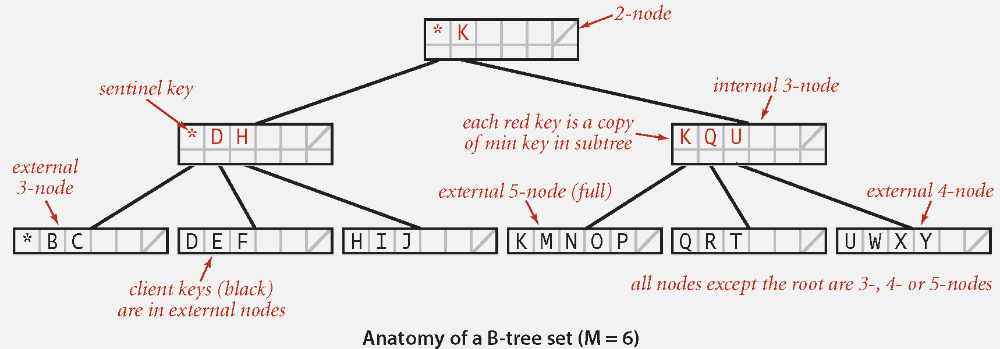
</li>
<li>
<p>Property: </p>

<p>A search or an insertion in a B-tree of order 
<math>M</math> with <math>N</math> keys requires between 
<math>log_{M-1} N</math> and <math>log_{M/2} N</math> probes.</p>

<p><format color = "BlueViolet">Proof</format>: All internal nodes 
(besides root) have between <math>\frac {M}{2}</math> and 
<math>M - 1</math> links.</p>

<p><format color = "BlueViolet">In practice</format>: Number of 
probes is at most 4.</p>

<p><format color = "BlueViolet">Optimization</format>: Always keep 
page root in memory.</p>
</li>
<li>
<p>Applications:</p>

<p>B-trees (and variants B+ Tree, B <sup>*</sup> Tree, B# Tree) are 
widely used for file systems and databases.</p>

<list>
<li>
<p><format color = "BlueViolet">Windows</format>: NTFS.</p>
</li>
<li>
<p><format color = "BlueViolet">Mac</format>: HFS, HFS+.</p>
</li>
<li>
<p><format color = "BlueViolet">Linux</format>: ReiserFS, XFS, Ext3FS, 
JFS.</p>
</li>
<li>
<p><format color = "BlueViolet">Databases</format>: ORACLE, DB2, 
INGRES, SQL, PostgreSQL.</p>
</li>
</list>
</li>
</list>

<procedure title = "Search in B-Tree">
    <step>
        <p>Start at root.</p>
    </step>
    <step>
        <p>Find interval containing search key.</p>
    </step>
    <step>
        <p>Follow associated link (recursively).</p>
    </step>
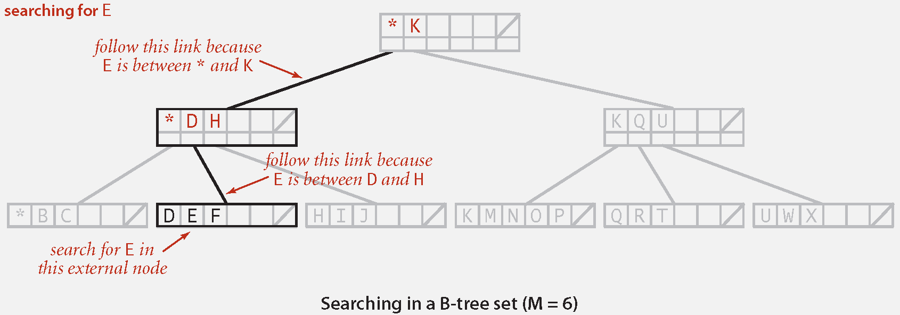
</procedure>

<procedure title = "Insert in B-Tree">
    <step>
        <p>Search for new key.</p>
    </step>
    <step>
        <p>Insert at bottom.</p>
    </step>
    <step>
        <p>Split nodes with <math>M</math> key-link pairs on the way up
        the tree.</p>
    </step>
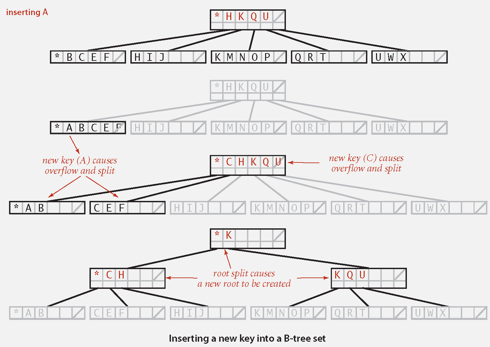
</procedure>

### 10.4 AVL Trees

<p>AVL trees maintain <format style = "bold">height-balance</format> 
(also called the <format style = "bold">AVL Property</format>).</p>

<list type = "alpha-lower">
<li>
<p><format color = "DarkOrange">Skew of a node:</format> The height of
of its right subtree minus that of its left subtree.</p>

<p>A node is height-blanced if <math>\text {skew} \in \{-1, 0, 1\}
</math>.</p>

<p><format color = "BlueViolet">Properties:</format> A binary tree 
with height-balanced nodes has height <math>h = O(\log n)</math>.</p>

<p>Proof: </p>

<code-block lang = "tex" style = "inline">
\begin{align}
F(0) = 1, F(1) = 2, F(h) &= 1 + F(h - 1) + F(h - 2) \\
&\geq 2F(h - 2) \\
F(h) \geq 2 ^ {\frac {h}{2}}
\end{align}
</code-block>
</li>
<li>
<p>Suppose adding or removing leaf from a height-balanced tree results
in imbalance, skews still have magnitude <math>\leq 2</math>.</p>

<p><format color = "Fuchsia">Case 1:</format> skew of F is 0 
or <format color = "Fuchsia">Case 2:</format> skew of F is 1
</p>
<p>=> Perform a left rotation on B.</p>
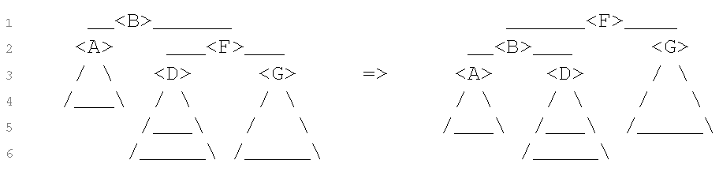

<p><format color = "Fuchsia">Case 3:</format> skew of F is −1
</p>
<p>Perform a right rotation on F, then a left rotation on B</p>
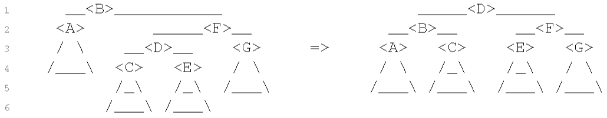
</li>
</list>

## 11 Geometric Applications of BSTs

<p><format color = "BlueViolet">Topic</format>: Intersections among 
<format color = "OrangeRed">geometric objects</format>.</p>

<p><format color = "BlueViolet">Applications</format>: CAD, games, 
movies, virtual reality, databases...</p>

### 11.1 1d Range Search

<list type = "bullet">
<li>
<p><format color = "DarkOrange">Range search</format>: find all key between
<math>k_{1}</math> and <math>k_{2}</math>.</p>
</li>
<li>
<p><format color = "DarkOrange">Range count</format>: # of keys between
<math>k_{1}</math> and <math>k_{2}</math>.</p>
</li>
<li>Geometric interpretation: Keys are point on a 
<format color = "OrangeRed">line</format>; find/count points in a given 
<format color = "OrangeRed">1d interval</format>.</li>
</list>

<procedure title = "1d range count">
<step>
<p>Recursively find all keys in left subtree (if any could fall 
in range).</p>
</step>
<step>
<p>Check key in current node.</p>
</step>
<step>
<p>Recursively find all keys in right subtree (if any could fall 
in range).</p>
</step>
</procedure>

<p><format color = "BlueViolet">Property</format>: Running
time proportinal to <math>R + \ log N</math></p>

### 11.2 Line Segment Intersection

<p><format color = "IndianRed">Goal</format>: Given <math>N</math> 
horizontal and vertical line segments, find all intersections 
(all <math>x</math>- and <math>y</math>-coordinates are distinct.</p>

<procedure title = "Sweep-Line Algorithm => Sweep Vertical Lines 
from Left to Right">
<step>
<p><math>x</math>-coordinates define events.</p>
</step>
<step>
<p><math>h</math>-segments (left endpoint): insert <math>y</math>- 
coordiantes into BST.</p>
</step>
<step>
<p><math>h</math>-segments (right endpoint): remove <math>y</math>- 
coordiantes from BST.</p>
</step>
<step>
<p><math>v</math>- segment: range search for interval of 
<math>y</math>-endpoints.</p>
</step>
</procedure>

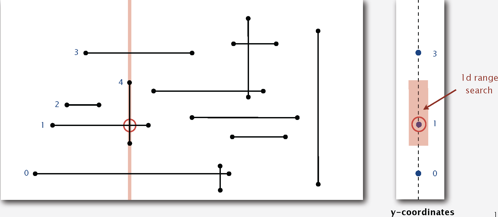

<p><format color = "LawnGreen">Properties</format>: The sweep-line 
algorithm takes time proportional to <math>N \log N + R</math> to 
find all <math>R</math> intersections among <math>N</math> 
orthogonal line segments.</p>

<p>Proof: </p>
<list type = "bullet">
<li>
<p>Put <math>x</math>-coordinates on a PQ (or sort). => 
<math>N \log N</math></p>
</li>
<li>
<p>Insert <math>y</math>-coordinates into BST. => 
<math>N \log N</math></p>
</li>
<li>
<p>Delete <math>y</math>-coordinates from BST. => 
<math>N \log N</math></p>
</li>
<li>
<p>Range searches in BST. => <math>N \log N + R</math></p>
</li>
</list>

### 11.3 Kd-Trees

<p><format color = "MediumVioletRed">Goal</format>: 2d orthogonal range search.</p>

<p><format color = "MediumVioletRed">Geometric interpretation</format>: 
Keys are point in the <format color = "OrangeRed">plane</format>;
find/count points in a given <format color = "OrangeRed">
<math>h-v</math> rectangle</format>.</p>

#### 11.3.1 Grid Implementation

<procedure title = "Grid Implementation">
<step>
<p>Divide space into <math>M</math> -by- <math>M</math> grid of 
squares.</p>
</step>
<step>
<p>Create list of points contained in each square.</p>
</step>
<step>
<p>Use 2d array to directly index relevant square.</p>
</step>
<step>
<p>Insert: add <math>(x, y)</math> to list for corresponding square.</p>
</step>
<step>
<p>Range search: examine only squares that intersect 2d range 
query.</p>
</step>
</procedure>

<p><format color = "BlueViolet">Properties: </format></p>

<list type = "bullet">
<li>
<p>Space: <math>M ^ {2} + N</math></p>
</li>
<li>
<p>Time: <math>1 + \frac {N}{M ^ {2}}</math> per square examined,
on average.</p>
</li>
</list>

<p><format color = "BlueViolet">Problems: </format></p>
<list type = "bullet">
<li>
<p><format color = "OrangeRed">Clustering</format>: a well-known 
phenomenon in geometric data.</p>
</li>
<li>
<p>Lists are too long, even though average length is short.</p>
</li>
<li>
<p>Need data structure that adapts gracefully to data.</p>
</li>
</list>

#### 11.3.2 Space-Partitioning Trees

<p><format color = "DarkOrange">Space-Partitioning Trees:</format> Use 
a tree to represent a recursive subdivision of a 2d space.</p>

<p><format color = "DarkOrange">2d Trees:</format> Recursively divide
space into two halfplanes.</p>

<p><format color = "BlueViolet">Applications:</format> Ray tracing,
2d range search, Flight simulators, N-body simulation, Nearest
neighbor search, Accelerate rendering in Doom, etc.</p>

##### Part &#8544; 2d Trees

<p><format color = "BlueViolet">Data Structure:</format> BST, but 
alternate using <math>x</math>- and <math>y</math>- coordinates as 
key.</p>

<list type = "bullet">
<li>
<p>Search gives rectangle containing point.</p>
</li>
<li>
<p>Insert further subdivides the plane.</p>
</li>
</list>


<procedure title = "Range Search - Find all points in a query 
axis-aligned rectangle">
<step>
<p>Check if point in node lies in given rectangle.</p>
</step>
<step>
<p>Recursively search left/bottom (if any could fall in rectangle).</p>
</step>
<step>
<p>Recursively search right/top (if any could fall in rectangle).</p>
</step>
</procedure>

<p><format color = "BlueViolet">Properties: </format></p>

<list type = "bullet">
<li>
<p>Typical case: <math>R + \log N</math></p>
</li>
<li>
<p>Worst case (assuming tree is balanced): <math>R + \sqrt{N}</math></p>
</li>
</list>

<procedure title = "Nearest Neighbor Search - Find closest point to 
query point">
<step>
<p>Check distance from point in node to query point.</p>
</step>
<step>
<p>Recursively search left/bottom (if it could contain a closer 
point).</p>
</step>
<step>
<p>Recursively search right/top (if it could contain a closer 
point).</p>
</step>
<step>
<p>Organize method so that it begins by searching for query point.</p>
</step>
</procedure>

<p><format color = "BlueViolet">Properties: </format></p>

<list type = "bullet">
<li>
<p>Typical case: <math>\log N</math></p>
</li>
<li>
<p>Worst case (even if tree is balanced): <math>N</math></p>
</li>
</list>

##### Part &#8545; Kd Trees

<p><format color = "DarkOrange">Kd Tree:</format> Recursively 
partition <math>k</math>-dimensional space into 2 halfspaces.</p>

<p><format color = "BlueViolet">Implementation:</format> BST, but
cycle through dimensions ala 2d trees.</p>

##### Part &#8546; N-body Simulation

<format color = "BlueViolet">Goal:</format> Simulate the motion 
of <math>N</math> particles, mutually affected by gravity.

<procedure title = "Appel's Algorithm for N-body Simulation">
<step>
<p>Build 3d-tree with <math>N</math> particles as nodes.</p>
</step>
<step>
<p>Store center-of-mass of subtree in each node.</p>
</step>
<step>
<p>To compute total force acting on a particle, traverse tree, but 
stop as soon as distance from particle to subdivision is sufficiently
large.</p>
</step>
</procedure>

<p><format color = "BlueViolet">Properties:</format> Running time
per step is <math>N \log N</math>.</p>

### 11.4 Interval Search Tree

<p>Create BST, where each node stores an interval <math>(lo, hi)
</math>.</p>

<list type = "bullet">
<li>
<p>Use left endpoint as BST <format color = "OrangeRed">key</format>
.</p>
</li>
<li>
<p>Store <format color = "BlueViolet">max endpoint</format> in 
subtree rooted at node.</p>
</li>
</list>

<procedure title = "Insertion for Interval Search Tree">
<step>
<p>Insert into BST, using <math>lo</math> as the key.</p>
</step>
<step>
<p>Update max in each node on search path.</p>
</step>
</procedure>

<procedure title = "Interval Search for Interval Search Tree" 
type = "choices">
<step>
<p>If interval in node intersects query interval, return it.</p>
</step>
<step>
<p>Else if left subtree is null, go right.</p>
</step>
<step>
<p>Else if max endpoint in left subtree is less than lo, go right.</p>
</step>
<step>
<p>Else go left.</p>
</step>
</procedure>

<p>Order of growth of running time for <math>N</math> intervals.</p>

<table style = "header-row">
<tr><td>operation</td><td>brute</td><td>interval search tree</td>
<td>best in theory</td></tr>
<tr><td>insert interval</td><td><math>1</math></td><td><math>\log N
</math></td><td><math>\log N</math></td></tr>
<tr><td>find interval</td><td><math>N</math></td><td><math>\log N
</math></td><td><math>\log N</math></td></tr>
<tr><td>delete interval</td><td><math>N</math></td><td><math>\log N
</math></td><td><math>\log N</math></td></tr>
<tr><td>find <format color = "OrangeRed">any one</format> interval
that intersects <math>(lo, hi)</math></td><td><math>N</math></td>
<td><math>\log N</math></td><td><math>\log N</math></td></tr>
<tr><td>find <format color = "OrangeRed">all</format> interval
that intersects <math>(lo, hi)</math></td><td><math>N</math></td>
<td><math>R \log N</math></td><td><math>R + \log N</math></td></tr>
</table>

### 11.5 Rectangle Intersection

<p><format color = "BlueViolet">Sweep-line Algorithm</format>: </p>

<list type = "bullet">
<li>
<p><math>x</math>-coordinates of left and right endpoints define 
events.</p>
</li>
<li>
<p>Maintain set of rectangles that intersect the sweep line in an 
interval search tree (using <math>y</math>-intervals of rectangle).</p>
</li>
<li>
<p>Left endpoint: interval search for <math>y</math>-interval of 
rectangle; insert <math>y</math>-interval.</p>
</li>
<li>
<p>Right endpoint: remove <math>y</math>-interval.</p>
</li>
</list>

<p><format color = "BlueViolet">Property:</format> Sweep line 
algorithm takes time proportional to <math>N \log N + R \log N</math> 
to find <math>R</math> intersections among a set of <math>N</math> 
rectangles.</p>

<p>Proof: </p>
<list type = "bullet">
<li>
<p>Put <math>x</math>-coordinates on a PQ (or sort) => 
<math>N \log N</math></p>
</li>
<li>
<p>Insert <math>y</math>-intervals into ST => <math>N \log N</math>
</p>
</li>
<li>
<p>Delete <math>y</math>-intervals from ST => <math>N \log N</math>
</p>
</li>
<li>
<p>Interval searches for y-intervals => <math>N \log N + R \log N
</math></p>
</li>
</list>