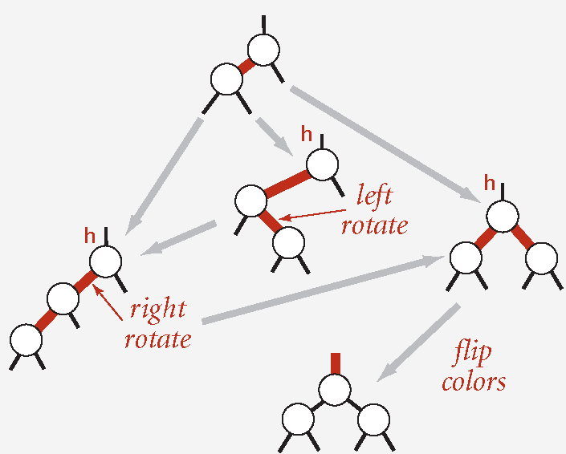
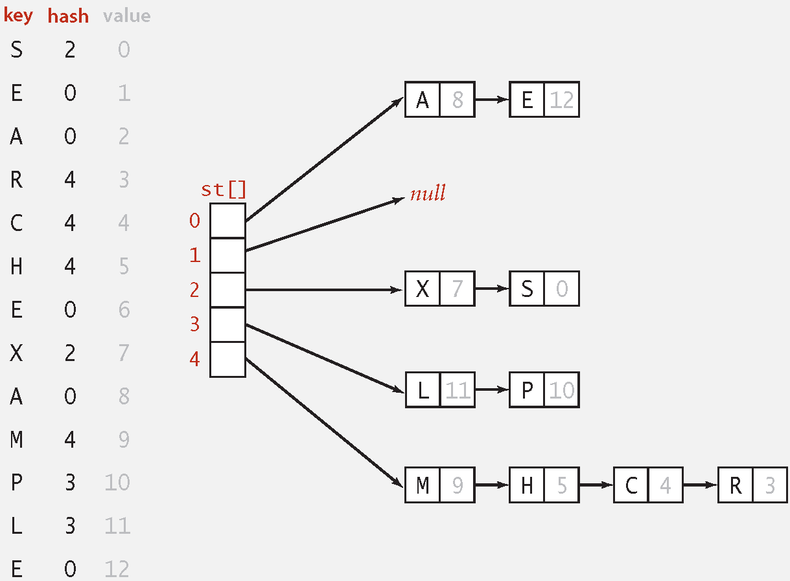
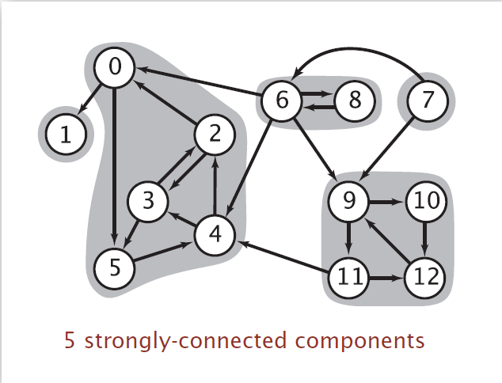
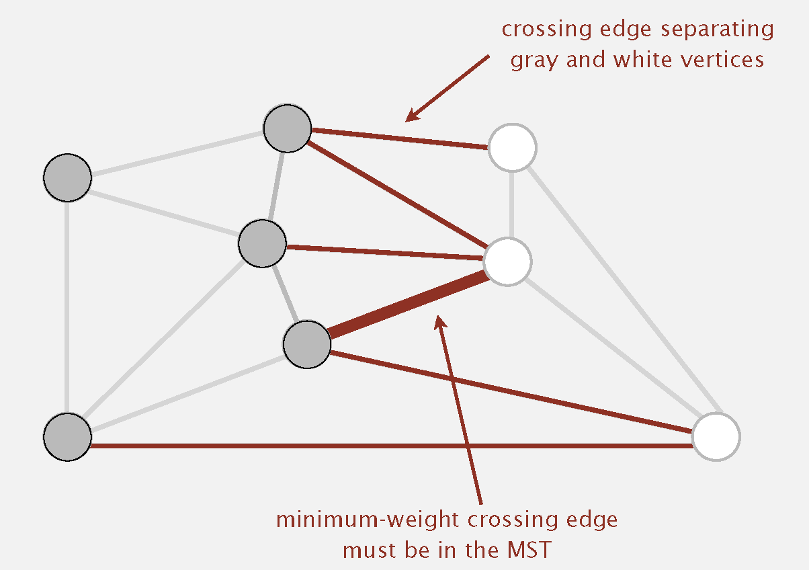
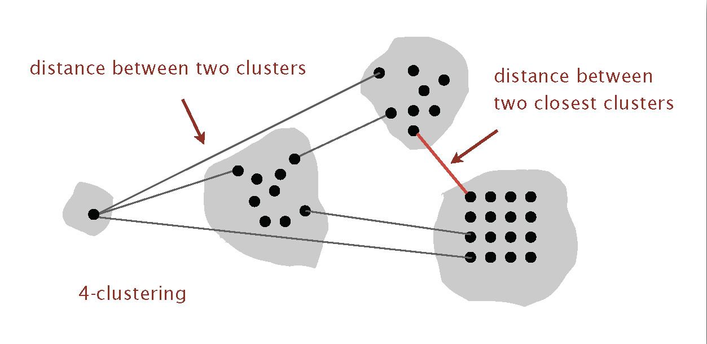

<show-structure for="chapter" depth="3"></show-structure>

# Part Ⅱ

<primary-label ref="finish"></primary-label>

## 10 Balanced Search Trees

<table style="none">
<tr>
    <td rowspan="2">Implementation</td>
    <td colspan="3">Worst-Case Cost (after <math>N</math> inserts)
    </td>
    <td colspan="3">Average Case (after <math>N</math> random 
    inserts)</td>
    <td rowspan="2">Ordered Iteration?</td>
    <td rowspan="2">Key Interface</td>
</tr>
<tr>
    <td>Search</td>
    <td>Insert</td>
    <td>Delete</td>
    <td>Search Hit</td>
    <td>Insert</td>
    <td>Delete</td>
</tr>
<tr>
    <td><a href="Data-Structures-and-Algorithms-1.md" 
    anchor="sequential-search" summary="Unordered List 
    Implementation">Sequential Search (unordered list)</a></td>
    <td><math>N</math></td>
    <td><math>N</math></td>
    <td><math>N</math></td>
    <td><math>\frac {N}{2}</math></td>
    <td><math>N</math></td>
    <td><math>N</math></td>
    <td>no</td>
    <td><code>equals()</code></td>
</tr>
<tr>
    <td><a href="Data-Structures-and-Algorithms-1.md" 
    anchor="ordered-array" summary="Ordered Array Implementation">
    Binary Search (ordered list)</a></td>
    <td><math>\lg N</math></td>
    <td><math>N</math></td>
    <td><math>N</math></td>
    <td><math>\lg N</math></td>
    <td><math>\frac {N}{2}</math></td>
    <td><math>\frac {N}{2}</math></td>
    <td>yes</td>
    <td><code>compareTo()</code></td>
</tr>
<tr>
    <td><a href="Data-Structures-and-Algorithms-1.md" 
    anchor="BST" summary="Binary Search Tree">BST</a></td>
    <td><math>N</math></td>
    <td><math>N</math></td>
    <td><math>N</math></td>
    <td><math>1.39 \log N</math></td>
    <td><math>1.39 \log N</math></td>
    <td>?</td>
    <td>yes</td>
    <td><code>compareTo()</code></td>
</tr>
<tr>
    <td><a anchor="2-3-trees" summary="2-3 Tree">2-3 Tree</a></td>
    <td><math>c \log N</math></td>
    <td><math>c \log N</math></td>
    <td><math>c \log N</math></td>
    <td><math>c \log N</math></td>
    <td><math>c \log N</math></td>
    <td><math>c \log N</math></td>
    <td>yes</td>
    <td><code>compareTo()</code></td>
</tr>
<tr>
    <td><a anchor="red-black-bsts" summary="Red-Black BSTs">
    Red-Black BST</a></td>
    <td><math>2 \log N</math></td>
    <td><math>2 \log N</math></td>
    <td><math>2 \log N</math></td>
    <td><math>1.00 \lg N</math></td>
    <td><math>1.00 \lg N</math></td>
    <td><math>1.00 \lg N</math></td>
    <td>yes</td>
    <td><code>compareTo()</code></td>
</tr>
</table>

### 10.1 2-3 Trees {id="2-3-trees"}

<p><format color="BlueViolet">2-3 Tree</format></p>

<list type="bullet">
<li>
    <p>Allow 1 or 2 keys per node.</p>
</li>
<li>
    <p>2-node: one key, two children.</p>
</li>
<li>
    <p>3-node: two keys, three children.</p>
</li>
</list>


<procedure title="Searching in 2-3 Tree">
<step>
    <p>Compare search key against keys in node.</p>
</step>
<step>
    <p>Find interval containing search key.</p>
</step>
<step>
    <p>Follow associated key (recursively).</p>
</step>
</procedure>

<procedure title="Inserting into a 2-node At Bottom">
<step>
    <p>Search for key, as usual.</p>
</step>
<step>
    <p>Replace 2-node with 3-node.</p>
</step>
</procedure>

<procedure title="Inserting into a 3-node At Bottom">
<step>
    <p>Add new key to 3-node to create a temporary 4-node.</p>
</step>
<step>
    <p>Move middle key in 4-node into a parent.</p>
</step>
<step>
    <p>Repeat up the tree, as necessary.</p>
</step>
<step>
    <p>If you reach the root and it's a 4-node, split it into three 2-
    nodes.</p>
</step>
</procedure>

<p><format color="BlueViolet">Properties</format></p>

<list type="bullet">
<li>
    <p><format color="Fuchsia">Maintain symmetric order and perfect 
    balance:</format> Every path from root to null link has same length.
    </p>
    <p><format color="LawnGreen">Proof:</format> </p>
</li>
<li>
    <p><format color="Fuchsia">Worst case</format>: 
    <math>\lg N</math> => all 2-nodes</p>
</li>
<li>
    <p><format color="Fuchsia">Best case</format>: <math>
    \log_{3} N \approx 0.631 \lg N</math> => all 3-nodes</p>
</li>
<li>
    <p>Between 12 and 20 for a million nodes.</p>
</li>
<li>
    <p>Between 18 and 30 for a billion nodes.</p>
</li>
<li>
    <p>Guaranteed <format color="OrangeRed">logarithmic</format> 
    performance for search and insert.</p>
</li>
</list>

<tip>
    <p>But direct implementation is complicated, because:</p>
    <list type="bullet">
    <li>
        <p>Maintaining multiple node types is cumbersome.</p>
    </li>
    <li>
        <p>Need multiple compares to move down tree.</p>
    </li>
    <li>
        <p>Need to move back up the tree to split 4-nodes.</p>
    </li>
    <li>
        <p>Large number of cases for splitting.</p>
    </li>
    </list>
</tip>

### 10.2 Red-Black BSTs {id="red-black-bsts"}

#### 10.2.1 Left-Leaning Red-Black BSTs

<list type="alpha-lower">
<li>
    <p><format color="Fuchsia">Definition 1</format>: </p>
    <list type="bullet">
    <li>
        <p>Represent 2–3 tree as a BST.</p>
    </li>
    <li>
        <p>Use "internal" left-leaning links as "glue" for 3–nodes.</p>
    </li>
    </list>
</li>

<li>
    <p><format color="Fuchsia">Definition 2</format>: A BST such that:</p>
    <list type="bullet">
    <li>
        <p>No node has two red links connected to it.</p>
    </li>
    <li>
        <p>Every path from root to null link has the same number of black
        links.</p>
    </li>
    <li>
        <p>Red links lean left.</p>
    </li>
    </list>
</li>

</list>


<note><p>1–1 correspondence between 2–3 and LLRB!</p></note>

#### 10.2.2 Elementary Red-Black BST Operations

<list type="alpha-lower">
<li>
    <p><format color="Fuchsia">Left rotation:</format> Orient a 
    (temporarily) right-leaning red link to lean left.</p>
    
</li>
<li>
    <p><format color="Fuchsia">Right rotation:</format> Orient a 
    left-leaning red link to (temporarily) lean right.</p>
    
</li>
<li>
    <p><format color="Fuchsia">Color flip:</format> Recolor to split
    a (temporary) 4-node.</p>
    
</li>
</list>

#### 10.2.3 Red-Black BST Operations

<warning>
<p>Most ops (e.g., search, floor, iteration, selection)
are the same as for elementary BST, but run faster because of better 
performance.</p>
</warning>

<procedure title="Case 1: Insert into a 2-node at the bottom | 
Insert into a tree with exactly 1 node">
<step>
<p>Do standard BST insert; color new link red.</p>
</step>
<step>
<p>If new red link is a right link, rotate left.</p>
</step>
</procedure>

<procedure title="Case 2: Insert into a 3-node at the bottom | 
Insert into a tree with exactly 2 nodes.">
<step>
    <p>Do standard BST insert; color new link red.</p>
</step>
<step>
    <p>Rotate to balance the 4-node (if needed).</p>
</step>
<step>
    <p>Flip colors to pass red link up one level.</p>
</step>
<step>
    <p>Rotate to make lean left (if needed).</p>
</step>
<step>
    <p>Repeat case 1 or case 2 up the tree (if needed).</p>
</step>
</procedure>



<procedure title="Insertion for Red-Black BSTs" type="choices">
<step>
    <p>Right child red, left child black: <format color="OrangeRed">rotate 
    left</format>.</p>
</step>
<step>
    <p>Left child, left-left grandchild red: <format color="OrangeRed">
    rotate right</format>.</p>
</step>
<step>
    <p>Both children red: <format color="OrangeRed">flip colors</format>.
    </p>
</step>
</procedure>

#### 10.2.4 Red-Black BST Implementations

<tabs>
    <tab title="Java">
    <code-block lang="java" collapsible="true">
import java.util.LinkedList;
import java.util.NoSuchElementException;
import java.util.Queue;
\/
public class RedBlackBST&lt;Key extends Comparable&lt;Key&gt;, Value&gt; {
\/
    private static final boolean RED = true;
    private static final boolean BLACK = false;
\/
    private Node root;
\/
    private class Node {
        private Key key;
        private Value val;
        private Node left, right;
        private boolean color;
        private int size;
\/
        public Node(Key key, Value val, boolean color, int size) {
            this.key = key;
            this.val = val;
            this.color=color;
            this.size = size;
        }
    }
\/
    public RedBlackBST() {
    }
\/
    private boolean isRed(Node x) {
        if (x == null) return false;
        return x.color == RED;
    }
\/
    private int size(Node x) {
        if (x == null) return 0;
        return x.size;
    }
\/
    public int size() {
        return size(root);
    }
\/
    public boolean isEmpty() {
        return root == null;
    }
\/
    public Value get(Key key) {
        if (key == null) throw new IllegalArgumentException("argument to get() is null");
        return get(root, key);
    }
\/
    private Value get(Node x, Key key) {
        while (x != null) {
            int cmp = key.compareTo(x.key);
            if (cmp &lt; 0) x = x.left;
            else if (cmp &gt; 0) x = x.right;
            else return x.val;
        }
        return null;
    }
\/
    public boolean contains(Key key) {
        return get(key) != null;
    }
\/
    public void put(Key key, Value val) {
        if (key == null) throw new IllegalArgumentException("first argument to put() is null");
        if (val == null) {
            delete(key);
            return;
        }
\/
        root = put(root, key, val);
        root.color=BLACK;
    }
\/
    private Node put(Node h, Key key, Value val) {
        if (h == null) return new Node(key, val, RED, 1);
\/
        int cmp = key.compareTo(h.key);
        if (cmp &lt; 0) h.left = put(h.left, key, val);
        else if (cmp &gt; 0) h.right = put(h.right, key, val);
        else h.val = val;
\/
        if (isRed(h.right) && !isRed(h.left)) h = rotateLeft(h);
        if (isRed(h.left) && isRed(h.left.left)) h = rotateRight(h);
        if (isRed(h.left) && isRed(h.right)) flipColors(h);
        h.size = size(h.left) + size(h.right) + 1;
\/
        return h;
    }
\/
    public void deleteMin() {
        if (isEmpty()) throw new NoSuchElementException("BST underflow");
\/
        if (!isRed(root.left) && !isRed(root.right))
            root.color=RED;
\/
        root = deleteMin(root);
        if (!isEmpty()) root.color=BLACK;
    }
\/
    private Node deleteMin(Node h) {
        if (h.left == null)
            return null;
\/
        if (!isRed(h.left) && !isRed(h.left.left))
            h = moveRedLeft(h);
\/
        h.left = deleteMin(h.left);
        return balance(h);
    }
\/
    public void deleteMax() {
        if (isEmpty()) throw new NoSuchElementException("BST underflow");
\/
        if (!isRed(root.left) && !isRed(root.right))
            root.color=RED;
\/
        root = deleteMax(root);
        if (!isEmpty()) root.color=BLACK;
    }
\/
    private Node deleteMax(Node h) {
        if (isRed(h.left))
            h = rotateRight(h);
\/
        if (h.right == null)
            return null;
\/
        if (!isRed(h.right) && !isRed(h.right.left))
            h = moveRedRight(h);
\/
        h.right = deleteMax(h.right);
\/
        return balance(h);
    }
\/
    public void delete(Key key) {
        if (key == null) throw new IllegalArgumentException("argument to delete() is null");
        if (!contains(key)) return;
\/
        if (!isRed(root.left) && !isRed(root.right))
            root.color=RED;
\/
        root = delete(root, key);
        if (!isEmpty()) root.color=BLACK;
    }
\/
    private Node delete(Node h, Key key) {
        if (key.compareTo(h.key) &lt; 0) {
            if (!isRed(h.left) && !isRed(h.left.left))
                h = moveRedLeft(h);
            h.left = delete(h.left, key);
        } else {
            if (isRed(h.left))
                h = rotateRight(h);
            if (key.compareTo(h.key) == 0 && (h.right == null))
                return null;
            if (!isRed(h.right) && !isRed(h.right.left))
                h = moveRedRight(h);
            if (key.compareTo(h.key) == 0) {
                Node x = min(h.right);
                h.key = x.key;
                h.val = x.val;
                h.right = deleteMin(h.right);
            } else h.right = delete(h.right, key);
        }
        return balance(h);
    }
\/
    private Node rotateRight(Node h) {
        assert (h != null) && isRed(h.left);
        Node x = h.left;
        h.left = x.right;
        x.right = h;
        x.color=h.color;
        h.color=RED;
        x.size = h.size;
        h.size = size(h.left) + size(h.right) + 1;
        return x;
    }
\/
    private Node rotateLeft(Node h) {
        assert (h != null) && isRed(h.right);
        Node x = h.right;
        h.right = x.left;
        x.left = h;
        x.color=h.color;
        h.color=RED;
        x.size = h.size;
        h.size = size(h.left) + size(h.right) + 1;
        return x;
    }
\/
    private void flipColors(Node h) {
        h.color=!h.color;
        h.left.color=!h.left.color;
        h.right.color=!h.right.color;
    }
\/
    private Node moveRedLeft(Node h) {
        flipColors(h);
        if (isRed(h.right.left)) {
            h.right = rotateRight(h.right);
            h = rotateLeft(h);
            flipColors(h);
        }
        return h;
    }
\/
    private Node moveRedRight(Node h) {
        flipColors(h);
        if (isRed(h.left.left)) {
            h = rotateRight(h);
            flipColors(h);
        }
        return h;
    }
\/
    private Node balance(Node h) {
        if (isRed(h.right) && !isRed(h.left)) h = rotateLeft(h);
        if (isRed(h.left) && isRed(h.left.left)) h = rotateRight(h);
        if (isRed(h.left) && isRed(h.right)) flipColors(h);
\/
        h.size = size(h.left) + size(h.right) + 1;
        return h;
    }
\/
    public int height() {
        return height(root);
    }
\/
    private int height(Node x) {
        if (x == null) return -1;
        return 1 + Math.max(height(x.left), height(x.right));
    }
\/
    public Key min() {
        if (isEmpty()) throw new NoSuchElementException("calls min() with empty symbol table");
        return min(root).key;
    }
\/
    private Node min(Node x) {
        if (x.left == null) return x;
        else return min(x.left);
    }
\/
    public Key max() {
        if (isEmpty()) throw new NoSuchElementException("calls max() with empty symbol table");
        return max(root).key;
    }
\/
    private Node max(Node x) {
        if (x.right == null) return x;
        else return max(x.right);
    }
\/
    public Key floor(Key key) {
        if (key == null) throw new IllegalArgumentException("argument to floor() is null");
        if (isEmpty()) throw new NoSuchElementException("calls floor() with empty symbol table");
        Node x = floor(root, key);
        if (x == null) throw new NoSuchElementException("argument to floor() is too small");
        else return x.key;
    }
\/
    private Node floor(Node x, Key key) {
        if (x == null) return null;
        int cmp = key.compareTo(x.key);
        if (cmp == 0) return x;
        if (cmp &lt; 0) return floor(x.left, key);
        Node t = floor(x.right, key);
        if (t != null) return t;
        else return x;
    }
\/
    public Key ceiling(Key key) {
        if (key == null) throw new IllegalArgumentException("argument to ceiling() is null");
        if (isEmpty()) throw new NoSuchElementException("calls ceiling() with empty symbol table");
        Node x = ceiling(root, key);
        if (x == null) throw new NoSuchElementException("argument to ceiling() is too large");
        else return x.key;
    }
\/
    private Node ceiling(Node x, Key key) {
        if (x == null) return null;
        int cmp = key.compareTo(x.key);
        if (cmp == 0) return x;
        if (cmp &gt; 0) return ceiling(x.right, key);
        Node t = ceiling(x.left, key);
        if (t != null) return t;
        else return x;
    }
\/
    public Key select(int rank) {
        if (rank &lt; 0 || rank &gt;= size()) {
            throw new IllegalArgumentException("argument to select() is invalid: " + rank);
        }
        return select(root, rank);
    }
\/
    private Key select(Node x, int rank) {
        if (x == null) return null;
        int leftSize = size(x.left);
        if (leftSize &gt; rank) return select(x.left, rank);
        else if (leftSize &lt; rank) return select(x.right, rank - leftSize - 1);
        else return x.key;
    }
\/
    public int rank(Key key) {
        if (key == null) throw new IllegalArgumentException("argument to rank() is null");
        return rank(key, root);
    }
\/
    private int rank(Key key, Node x) {
        if (x == null) return 0;
        int cmp = key.compareTo(x.key);
        if (cmp &lt; 0) return rank(key, x.left);
        else if (cmp &gt; 0) return 1 + size(x.left) + rank(key, x.right);
        else return size(x.left);
    }
\/
    public Iterable&lt;Key&gt; keys() {
        if (isEmpty()) return new LinkedList&lt;&gt;();
        return keys(min(), max());
    }
\/
    public Iterable&lt;Key&gt; keys(Key lo, Key hi) {
        if (lo == null) throw new IllegalArgumentException("first argument to keys() is null");
        if (hi == null) throw new IllegalArgumentException("second argument to keys() is null");
\/
        Queue&lt;Key&gt; queue = new LinkedList&lt;&gt;();
        keys(root, queue, lo, hi);
        return queue;
    }
\/
    private void keys(Node x, Queue&lt;Key&gt; queue, Key lo, Key hi) {
        if (x == null) return;
        int cmplo = lo.compareTo(x.key);
        int cmphi = hi.compareTo(x.key);
        if (cmplo &lt; 0) keys(x.left, queue, lo, hi);
        if (cmplo &lt;= 0 && cmphi &gt;= 0) queue.add(x.key);
        if (cmphi &gt; 0) keys(x.right, queue, lo, hi);
    }
\/
    public int size(Key lo, Key hi) {
        if (lo == null) throw new IllegalArgumentException("first argument to size() is null");
        if (hi == null) throw new IllegalArgumentException("second argument to size() is null");
\/
        if (lo.compareTo(hi) &gt; 0) return 0;
        if (contains(hi)) return rank(hi) - rank(lo) + 1;
        else return rank(hi) - rank(lo);
    }
\/
    private boolean check() {
        if (!isBST()) System.out.println("Not in symmetric order");
        if (!isSizeConsistent()) System.out.println("Subtree counts not consistent");
        if (!isRankConsistent()) System.out.println("Ranks not consistent");
        if (!is23()) System.out.println("Not a 2-3 tree");
        if (!isBalanced()) System.out.println("Not balanced");
        return isBST() && isSizeConsistent() && isRankConsistent() && is23() && isBalanced();
    }
\/
    private boolean isBST() {
        return isBST(root, null, null);
    }
\/
    private boolean isBST(Node x, Key min, Key max) {
        if (x == null) return true;
        if (min != null && x.key.compareTo(min) &lt;= 0) return false;
        if (max != null && x.key.compareTo(max) &gt;= 0) return false;
        return isBST(x.left, min, x.key) && isBST(x.right, x.key, max);
    }
\/
    private boolean isSizeConsistent() {
        return isSizeConsistent(root);
    }
\/
    private boolean isSizeConsistent(Node x) {
        if (x == null) return true;
        if (x.size != size(x.left) + size(x.right) + 1) return false;
        return isSizeConsistent(x.left) && isSizeConsistent(x.right);
    }
\/
    private boolean isRankConsistent() {
        for (int i = 0; i &lt; size(); i++)
            if (i != rank(select(i))) return false;
        for (Key key : keys())
            if (key.compareTo(select(rank(key))) != 0) return false;
        return true;
    }
\/
    private boolean is23() {
        return is23(root);
    }
\/
    private boolean is23(Node x) {
        if (x == null) return true;
        if (isRed(x.right)) return false;
        if (x != root && isRed(x) && isRed(x.left))
            return false;
        return is23(x.left) && is23(x.right);
    }
\/
    private boolean isBalanced() {
        int black = 0;
        Node x = root;
        while (x != null) {
            if (!isRed(x)) black++;
            x = x.left;
        }
        return isBalanced(root, black);
    }
\/
    private boolean isBalanced(Node x, int black) {
        if (x == null) return black == 0;
        if (!isRed(x)) black--;
        return isBalanced(x.left, black) && isBalanced(x.right, black);
    }
}
    </code-block>
    </tab>
    <tab title="C++">
    <code-block lang="c++" collapsible="true">
#ifndef REDBLACKBST_H
#define REDBLACKBST_H
\/
#include &lt;iostream&gt;
#include &lt;queue&gt;
#include &lt;stdexcept&gt;
#include &lt;cassert&gt;
\/
template &lt;typename Key, typename Value&gt;
class RedBlackBST {
private:
    static constexpr bool RED = true;
    static constexpr bool BLACK = false;
\/
    struct Node {
        Key key;
        Value val;
        Node *left, *right;
        bool color;
        int size;
\/
        Node(const Key& key, const Value& val, bool color, int size) : 
            key(key), val(val), left(nullptr), right(nullptr), color(color), size(size) {}
    };
\/
    Node* root;
\/
    static bool isRed(Node* x) {
        if (x == nullptr) return false;
        return x-&gt;color == RED;
    }
\/
    static int size(Node* x) {
        if (x == nullptr) return 0;
        return x-&gt;size;
    }
\/
    Node* put(Node* h, const Key& key, const Value& val) {
        if (h == nullptr) return new Node(key, val, RED, 1);
\/
        if (key &lt; h-&gt;key) h-&gt;left = put(h-&gt;left, key, val);
        else if (key &gt; h-&gt;key) h-&gt;right = put(h-&gt;right, key, val);
        else h-&gt;val = val;
\/
        if (isRed(h-&gt;right) && !isRed(h-&gt;left)) h = rotateLeft(h);
        if (isRed(h-&gt;left) && isRed(h-&gt;left-&gt;left)) h = rotateRight(h);
        if (isRed(h-&gt;left) && isRed(h-&gt;right)) flipColors(h);
        h-&gt;size = size(h-&gt;left) + size(h-&gt;right) + 1;
\/
        return h;
    }
\/
    Node* deleteMin(Node* h) {
        if (h-&gt;left == nullptr)
            return nullptr;
\/
        if (!isRed(h-&gt;left) && !isRed(h-&gt;left-&gt;left))
            h = moveRedLeft(h);
\/
        h-&gt;left = deleteMin(h-&gt;left);
        return balance(h);
    }
\/
    Node* deleteMax(Node* h) {
        if (isRed(h-&gt;left))
            h = rotateRight(h);
\/
        if (h-&gt;right == nullptr)
            return nullptr;
\/
        if (!isRed(h-&gt;right) && !isRed(h-&gt;right-&gt;left))
            h = moveRedRight(h);
\/
        h-&gt;right = deleteMax(h-&gt;right);
\/
        return balance(h);
    }
\/
    Node* deleteNode(Node* h, const Key& key) {
        if (key &lt; h-&gt;key) {
            if (!isRed(h-&gt;left) && !isRed(h-&gt;left-&gt;left))
                h = moveRedLeft(h);
            h-&gt;left = deleteNode(h-&gt;left, key);
        } else {
            if (isRed(h-&gt;left))
                h = rotateRight(h);
            if (key == h-&gt;key && (h-&gt;right == nullptr))
                return nullptr;
            if (!isRed(h-&gt;right) && !isRed(h-&gt;right-&gt;left))
                h = moveRedRight(h);
            if (key == h-&gt;key) {
                Node* x = min(h-&gt;right);
                h-&gt;key = x-&gt;key;
                h-&gt;val = x-&gt;val;
                h-&gt;right = deleteMin(h-&gt;right);
            } else h-&gt;right = deleteNode(h-&gt;right, key);
        }
        return balance(h);
    }
\/
    Node* rotateRight(Node* h) {
        assert(h != nullptr && isRed(h-&gt;left));
        Node* x = h-&gt;left;
        h-&gt;left = x-&gt;right;
        x-&gt;right = h;
        x-&gt;color=h-&gt;color;
        h-&gt;color=RED;
        x-&gt;size = h-&gt;size;
        h-&gt;size = size(h-&gt;left) + size(h-&gt;right) + 1;
        return x;
    }
\/
    Node* rotateLeft(Node* h) {
        assert(h != nullptr && isRed(h-&gt;right));
        Node* x = h-&gt;right;
        h-&gt;right = x-&gt;left;
        x-&gt;left = h;
        x-&gt;color=h-&gt;color;
        h-&gt;color=RED;
        x-&gt;size = h-&gt;size;
        h-&gt;size = size(h-&gt;left) + size(h-&gt;right) + 1;
        return x;
    }
\/
    static void flipColors(Node* h) {
        h-&gt;color=!h-&gt;color;
        h-&gt;left-&gt;color=!h-&gt;left-&gt;color;
        h-&gt;right-&gt;color=!h-&gt;right-&gt;color;
    }
\/
    Node* moveRedLeft(Node* h) {
        flipColors(h);
        if (isRed(h-&gt;right-&gt;left)) {
            h-&gt;right = rotateRight(h-&gt;right);
            h = rotateLeft(h);
            flipColors(h);
        }
        return h;
    }
\/
    Node* moveRedRight(Node* h) {
        flipColors(h);
        if (isRed(h-&gt;left-&gt;left)) {
            h = rotateRight(h);
            flipColors(h);
        }
        return h;
    }
\/
    Node* balance(Node* h) {
        if (isRed(h-&gt;right) && !isRed(h-&gt;left)) h = rotateLeft(h);
        if (isRed(h-&gt;left) && isRed(h-&gt;left-&gt;left)) h = rotateRight(h);
        if (isRed(h-&gt;left) && isRed(h-&gt;right)) flipColors(h);
\/
        h-&gt;size = size(h-&gt;left) + size(h-&gt;right) + 1;
        return h;
    }
\/
    Node* min(Node* x) const {
        if (x-&gt;left == nullptr) return x;
        else return min(x-&gt;left);
    }
\/
    Node* max(Node* x) const {
        if (x-&gt;right == nullptr) return x;
        else return max(x-&gt;right);
    }
\/
    Node* floor(Node* x, const Key& key) const {
        if (x == nullptr) return nullptr;
        if (key == x-&gt;key) return x;
        if (key &lt; x-&gt;key) return floor(x-&gt;left, key);
        Node* t = floor(x-&gt;right, key);
        if (t != nullptr) return t;
        else return x;
    }
\/
    Node* ceiling(Node* x, const Key& key) const {
        if (x == nullptr) return nullptr;
        if (key == x-&gt;key) return x;
        if (key &gt; x-&gt;key) return ceiling(x-&gt;right, key);
        Node* t = ceiling(x-&gt;left, key);
        if (t != nullptr) return t;
        else return x;
    }
\/
    Key select(Node* x, const int rank) const {
        if (x == nullptr) return Key(); 
        int leftSize = size(x-&gt;left);
        if (leftSize &gt; rank) return select(x-&gt;left, rank);
        else if (leftSize &lt; rank) return select(x-&gt;right, rank - leftSize - 1);
        else return x-&gt;key;
    }
\/
    int rank(const Key& key, Node* x) const {
        if (x == nullptr) return 0;
        if (key &lt; x-&gt;key) return rank(key, x-&gt;left);
        else if (key &gt; x-&gt;key) return 1 + size(x-&gt;left) + rank(key, x-&gt;right);
        else return size(x-&gt;left);
    }
\/
    void keys(Node* x, std::queue&lt;Key&gt;& queue, const Key& lo, const Key& hi) const {
        if (x == nullptr) return;
        if (lo &lt; x-&gt;key) keys(x-&gt;left, queue, lo, hi);
        if (lo &lt;= x-&gt;key && x-&gt;key &lt;= hi) queue.push(x-&gt;key);
        if (hi &gt; x-&gt;key) keys(x-&gt;right, queue, lo, hi);
    }
\/
    int height(Node* x) const {
        if (x == nullptr) return -1;
        return 1 + std::max(height(x-&gt;left), height(x-&gt;right));
    }
\/
public:
    RedBlackBST() : root(nullptr) {}
\/
    [[nodiscard]] int size() const {
        return size(root);
    }
\/
    [[nodiscard]] bool isEmpty() const {
        return root == nullptr;
    }
\/
    Value get(const Key& key) const {
        Node* x = root;
        while (x != nullptr) {
            if (key &lt; x-&gt;key) x = x-&gt;left;
            else if (key &gt; x-&gt;key) x = x-&gt;right;
            else return x-&gt;val;
        }
        return Value();
    }
\/
    bool contains(const Key& key) const {
        return get(key) != Value(); 
    }
\/
    void put(const Key& key, const Value& val) {
        root = put(root, key, val);
        root-&gt;color=BLACK;
    }
\/
    void deleteMin() {
        if (isEmpty()) throw std::runtime_error("BST underflow");
\/
        if (!isRed(root-&gt;left) && !isRed(root-&gt;right))
            root-&gt;color=RED;
\/
        root = deleteMin(root);
        if (!isEmpty()) root-&gt;color=BLACK;
    }
\/
    void deleteMax() {
        if (isEmpty()) throw std::runtime_error("BST underflow");
\/
        if (!isRed(root-&gt;left) && !isRed(root-&gt;right))
            root-&gt;color=RED;
\/
        root = deleteMax(root);
        if (!isEmpty()) root-&gt;color=BLACK;
    }
\/
    void deleteNode(const Key& key) {
        if (!contains(key)) return;
\/
        if (!isRed(root-&gt;left) && !isRed(root-&gt;right))
            root-&gt;color=RED;
\/
        root = deleteNode(root, key);
        if (!isEmpty()) root-&gt;color=BLACK;
    }
\/
    [[nodiscard]] int height() const {
        return height(root);
    }
\/
    Key min() const {
        if (isEmpty()) throw std::runtime_error("calls min() with empty symbol table");
        return min(root)-&gt;key;
    }
\/
    Key max() const {
        if (isEmpty()) throw std::runtime_error("calls max() with empty symbol table");
        return max(root)-&gt;key;
    }
\/
    Key floor(const Key& key) const {
        if (isEmpty()) throw std::runtime_error("calls floor() with empty symbol table");
        Node* x = floor(root, key);
        if (x == nullptr) throw std::runtime_error("argument to floor() is too small");
        else return x-&gt;key;
    }
\/
    Key ceiling(const Key& key) const {
        if (isEmpty()) throw std::runtime_error("calls ceiling() with empty symbol table");
        Node* x = ceiling(root, key);
        if (x == nullptr) throw std::runtime_error("argument to ceiling() is too large");
        else return x-&gt;key;
    }
\/
    Key select(int rank) const {
        if (rank &lt; 0 || rank &gt;= size()) {
            throw std::invalid_argument("argument to select() is invalid: " + std::to_string(rank));
        }
        return select(root, rank);
    }
\/
    int rank(const Key& key) const {
        return rank(key, root);
    }
\/
    std::queue&lt;Key&gt; keys() const {
        if (isEmpty()) return std::queue&lt;Key&gt;();
        return keys(min(), max());
    }
\/
    std::queue&lt;Key&gt; keys(const Key& lo, const Key& hi) const {
        if (isEmpty() || lo &gt; hi) return std::queue&lt;Key&gt;(); 
\/
        std::queue&lt;Key&gt; queue;
        keys(root, queue, lo, hi);
        return queue;
    }
\/
    int size(const Key& lo, const Key& hi) const {
        if (lo &gt; hi) return 0;
        if (contains(hi)) return rank(hi) - rank(lo) + 1;
        else return rank(hi) - rank(lo);
    }
};
\/
#endif // REDBLACKBST_H
    </code-block>
    </tab>
    <tab title="Python">
    <code-block lang="python" collapsible="true">
class Node:
    def __init__(self, key, val, color, size):
        self.key = key
        self.val = val
        self.left = None
        self.right = None
        self.color=color  # True for RED, False for BLACK
        self.size = size
\/
\/
class RedBlackBST:
    RED = True
    BLACK = False
\/
    def __init__(self):
        self.root = None
\/
    def is_red(self, x):
        if x is None:
            return False
        return x.color == RedBlackBST.RED
\/
    def size(self, x):
        if x is None:
            return 0
        return x.size
\/
    def __len__(self): 
        return self.size(self.root)
\/
    def is_empty(self):
        return self.root is None
\/
    def get(self, key):
        x = self.root
        while x is not None:
            if key &lt; x.key:
                x = x.left
            elif key &gt; x.key:
                x = x.right
            else:
                return x.val
        return None
\/
    def __contains__(self, key): 
        return self.get(key) is not None
\/
    def put(self, key, val):
        self.root = self._put(self.root, key, val)
        self.root.color=RedBlackBST.BLACK
\/
    def _put(self, h, key, val):
        if h is None:
            return Node(key, val, RedBlackBST.RED, 1)
\/
        if key &lt; h.key:
            h.left = self._put(h.left, key, val)
        elif key &gt; h.key:
            h.right = self._put(h.right, key, val)
        else:
            h.val = val
\/
        if self.is_red(h.right) and not self.is_red(h.left):
            h = self.rotate_left(h)
        if self.is_red(h.left) and self.is_red(h.left.left):
            h = self.rotate_right(h)
        if self.is_red(h.left) and self.is_red(h.right):
            self.flip_colors(h)
\/
        h.size = self.size(h.left) + self.size(h.right) + 1
        return h
\/
    def delete_min(self):
        if self.is_empty():
            raise Exception("BST underflow")
\/
        if not self.is_red(self.root.left) and not self.is_red(self.root.right):
            self.root.color=RedBlackBST.RED
\/
        self.root = self._delete_min(self.root)
        if not self.is_empty():
            self.root.color=RedBlackBST.BLACK
\/
    def _delete_min(self, h):
        if h.left is None:
            return None
\/
        if not self.is_red(h.left) and not self.is_red(h.left.left):
            h = self.move_red_left(h)
\/
        h.left = self._delete_min(h.left)
        return self.balance(h)
\/
    def delete_max(self):
        if self.is_empty():
            raise Exception("BST underflow")
\/
        if not self.is_red(self.root.left) and not self.is_red(self.root.right):
            self.root.color=RedBlackBST.RED
\/
        self.root = self._delete_max(self.root)
        if not self.is_empty():
            self.root.color=RedBlackBST.BLACK
\/
    def _delete_max(self, h):
        if self.is_red(h.left):
            h = self.rotate_right(h)
\/
        if h.right is None:
            return None
\/
        if not self.is_red(h.right) and not self.is_red(h.right.left):
            h = self.move_red_right(h)
\/
        h.right = self._delete_max(h.right)
        return self.balance(h)
\/
    def delete(self, key):
        if key is None:
            raise Exception("argument to delete() is null")
        if not self.__contains__(key):
            return
\/
        if not self.is_red(self.root.left) and not self.is_red(self.root.right):
            self.root.color=RedBlackBST.RED
\/
        self.root = self._delete(self.root, key)
        if not self.is_empty():
            self.root.color=RedBlackBST.BLACK
\/
    def _delete(self, h, key):
        if key &lt; h.key:
            if not self.is_red(h.left) and not self.is_red(h.left.left):
                h = self.move_red_left(h)
            h.left = self._delete(h.left, key)
        else:
            if self.is_red(h.left):
                h = self.rotate_right(h)
            if key == h.key and h.right is None:
                return None 
            if not self.is_red(h.right) and not self.is_red(h.right.left):
                h = self.move_red_right(h)
            if key == h.key:
                if h.right is not None: 
                    x = self._min(h.right) 
                    h.key = x.key
                    h.val = x.val
                    h.right = self._delete_min(h.right) 
                else:  
                    return h.left  
            else:
                h.right = self._delete(h.right, key)
\/
        return self.balance(h)
\/
    def rotate_right(self, h):
        assert h is not None and self.is_red(h.left)
        x = h.left
        h.left = x.right
        x.right = h
        x.color=h.color
        h.color=RedBlackBST.RED
        x.size = h.size
        h.size = self.size(h.left) + self.size(h.right) + 1
        return x
\/
    def rotate_left(self, h):
        assert h is not None and self.is_red(h.right)
        x = h.right
        h.right = x.left
        x.left = h
        x.color=h.color
        h.color=RedBlackBST.RED
        x.size = h.size
        h.size = self.size(h.left) + self.size(h.right) + 1
        return x
\/
    def flip_colors(self, h):
        assert h is not None and h.left is not None and h.right is not None
        h.color=not h.color
        h.left.color=not h.left.color
        h.right.color=not h.right.color
\/
    def move_red_left(self, h):
        self.flip_colors(h)
        if self.is_red(h.right.left):
            h.right = self.rotate_right(h.right)
            h = self.rotate_left(h)
            self.flip_colors(h)
        return h
\/
    def move_red_right(self, h):
        self.flip_colors(h)
        if self.is_red(h.left.left):
            h = self.rotate_right(h)
            self.flip_colors(h)
        return h
\/
    def balance(self, h):
        if self.is_red(h.right) and not self.is_red(h.left):
            h = self.rotate_left(h)
        if self.is_red(h.left) and self.is_red(h.left.left):
            h = self.rotate_right(h)
        if self.is_red(h.left) and self.is_red(h.right):
            self.flip_colors(h)
\/
        h.size = self.size(h.left) + self.size(h.right) + 1
        return h
\/
    def height(self):
        return self._height(self.root)
\/
    def _height(self, x):
        if x is None:
            return -1
        return 1 + max(self._height(x.left), self._height(x.right))
\/
    def min(self):
        if self.is_empty():
            raise Exception("calls min() with empty symbol table")
        return self._min(self.root).key
\/
    def _min(self, x):
        if x.left is None:
            return x
        else:
            return self._min(x.left)
\/
    def max(self):
        if self.is_empty():
            raise Exception("calls max() with empty symbol table")
        return self._max(self.root).key
\/
    def _max(self, x):
        if x.right is None:
            return x
        else:
            return self._max(x.right)
\/
    def floor(self, key):
        if key is None:
            raise Exception("argument to floor() is null")
        if self.is_empty():
            raise Exception("calls floor() with empty symbol table")
        x = self._floor(self.root, key)
        if x is None:
            raise Exception("argument to floor() is too small")
        else:
            return x.key
\/
    def _floor(self, x, key):
        if x is None:
            return None
        if key == x.key:
            return x
        if key &lt; x.key:
            return self._floor(x.left, key)
        t = self._floor(x.right, key)
        if t is not None:
            return t
        else:
            return x
\/
    def ceiling(self, key):
        if key is None:
            raise Exception("argument to ceiling() is null")
        if self.is_empty():
            raise Exception("calls ceiling() with empty symbol table")
        x = self._ceiling(self.root, key)
        if x is None:
            raise Exception("argument to ceiling() is too large")
        else:
            return x.key
\/
    def _ceiling(self, x, key):
        if x is None:
            return None
        if key == x.key:
            return x
        if key &gt; x.key:
            return self._ceiling(x.right, key)
        t = self._ceiling(x.left, key)
        if t is not None:
            return t
        else:
            return x
\/
    def select(self, rank):
        if rank &lt; 0 or rank &gt;= len(self):
            raise Exception("argument to select() is invalid: " + str(rank))
        return self._select(self.root, rank).key
\/
    def _select(self, x, rank):
        if x is None:
            return None
        left_size = self.size(x.left)
        if left_size &gt; rank:
            return self._select(x.left, rank)
        elif left_size &lt; rank:
            return self._select(x.right, rank - left_size - 1)
        else:
            return x
\/
    def rank(self, key):
        if key is None:
            raise Exception("argument to rank() is null")
        return self._rank(key, self.root)
\/
    def _rank(self, key, x):
        if x is None:
            return 0
        if key &lt; x.key:
            return self._rank(key, x.left)
        elif key &gt; x.key:
            return 1 + self.size(x.left) + self._rank(key, x.right)
        else:
            return self.size(x.left)
\/
    def keys(self):
        if self.is_empty():
            return []
        return self.keys_in_range(self.min(), self.max())
\/
    def keys_in_range(self, lo, hi):
        if lo is None:
            raise Exception("first argument to keys() is null")
        if hi is None:
            raise Exception("second argument to keys() is null")
\/
        queue = []
        self._keys_in_range(self.root, queue, lo, hi)
        return queue
\/
    def _keys_in_range(self, x, queue, lo, hi):
        if x is None:
            return
        if lo &lt; x.key:
            self._keys_in_range(x.left, queue, lo, hi)
        if lo &lt;= x.key &lt;= hi:
            queue.append(x.key)
        if hi &gt; x.key:
            self._keys_in_range(x.right, queue, lo, hi)
\/
    def size_in_range(self, lo, hi):
        if lo is None:
            raise Exception("first argument to size() is null")
        if hi is None:
            raise Exception("second argument to size() is null")
\/
        if lo &gt; hi:
            return 0
        if self.__contains__(hi):
            return self.rank(hi) - self.rank(lo) + 1
        else:
            return self.rank(hi) - self.rank(lo)
    </code-block>
    </tab>
</tabs>

#### 10.2.5 Red-Black BST Properties and Applications

<p><format color="BlueViolet">Properties</format></p>

<list type="alpha-lower">
<li>
    <p>Height of tree is <math>\leq 2 \lg N</math> in the worst case.</p>
    <p><format color="LawnGreen">Proof:</format> Every path from root to 
    null link has same number of black links. Never two red links in-a-row
    .</p>
</li>
<li>
    <p>Height of tree is <math>\sim 1.00 \lg N</math> in typical
    applications.</p>
</li>
</list>

<p><format color="BlueViolet">Applications:</format> Red-black trees are
widely used as system symbol tables.</p>

<list type="bullet">
<li>
    <p><format color="Fuchsia">Java:</format> java.util.TreeMap, 
    java.util.TreeSet</p>
</li>
<li>
    <p><format color="Fuchsia">C++ STL:</format> map, multimap, multiset
    </p>
</li>
<li>
    <p><format color="Fuchsia">Linux kernel:</format> completely fair 
    scheduler, linux/rbtree.h</p>
</li>
<li>
    <p><format color="Fuchsia">Emacs:</format> conservative stack 
    scanning</p>
</li>
</list>

### 10.3 B-Trees

<list type="decimal">
<li>
<p>Background Information:</p>

<list type="bullet">
<li>
<p><format color="BlueViolet">Page</format>: Continuous block of
data (e.g., a file or 4,096-byte chunk).</p>
</li>
<li>
<p><format color="BlueViolet">Probe</format>: First access to a 
page (e.g., from disk to memory).</p>
</li>
<li>
<p><format color="BlueViolet">Property</format>: Time required for
a probe is much higher than time to access data within a page.</p>
</li>
<li>
<p><format color="BlueViolet">Goal</format>: Access data using
minimum number of probes.</p>
</li>
</list>
</li>
<li>
<p>Definition:</p>

<p><format color="BlueViolet">B-tree (Bayer-McCreight, 1972)</format>: 
Generalize 2-3 trees by allowing up to <math>M - 1</math> key-link
pairs per node.</p>
<list type="bullet">
<li>
<p>At least 2 key-link pairs at root.</p>
</li>
<li>
<p>At least <math>\frac {M}{2}</math> key-link pairs in other 
nodes.</p>
</li>
<li>
<p>External nodes contain client keys.</p>
</li>
<li>
<p>Internal nodes contain copies of keys to guide search.</p>
</li>
</list>

</li>
<li>
<p>Property: </p>

<p>A search or an insertion in a B-tree of order 
<math>M</math> with <math>N</math> keys requires between 
<math>log_{M-1} N</math> and <math>log_{M/2} N</math> probes.</p>

<p><format color="BlueViolet">Proof</format>: All internal nodes 
(besides root) have between <math>\frac {M}{2}</math> and 
<math>M - 1</math> links.</p>

<p><format color="BlueViolet">In practice</format>: Number of 
probes is at most 4.</p>

<p><format color="BlueViolet">Optimization</format>: Always keep 
page root in memory.</p>
</li>
<li>
<p>Applications:</p>

<p>B-trees (and variants B+ Tree, B <sup>*</sup> Tree, B# Tree) are 
widely used for file systems and databases.</p>

<list>
<li>
<p><format color="BlueViolet">Windows</format>: NTFS.</p>
</li>
<li>
<p><format color="BlueViolet">Mac</format>: HFS, HFS+.</p>
</li>
<li>
<p><format color="BlueViolet">Linux</format>: ReiserFS, XFS, Ext3FS, 
JFS.</p>
</li>
<li>
<p><format color="BlueViolet">Databases</format>: ORACLE, DB2, 
INGRES, SQL, PostgreSQL.</p>
</li>
</list>
</li>
</list>

<procedure title = "Search in B-Tree">
    <step>
        <p>Start at root.</p>
    </step>
    <step>
        <p>Find interval containing search key.</p>
    </step>
    <step>
        <p>Follow associated link (recursively).</p>
    </step>

</procedure>

<procedure title = "Insert in B-Tree">
    <step>
        <p>Search for new key.</p>
    </step>
    <step>
        <p>Insert at bottom.</p>
    </step>
    <step>
        <p>Split nodes with <math>M</math> key-link pairs on the way up
        the tree.</p>
    </step>

</procedure>

### 10.4 AVL Trees

<p>AVL trees maintain <format style="bold">height-balance</format> 
(also called the <format style="bold">AVL Property</format>).</p>

<list type="alpha-lower">
<li>
<p><format color="DarkOrange">Skew of a node:</format> The height of
of its right subtree minus that of its left subtree.</p>

<p>A node is height-blanced if <math>\text {skew} \in \{-1, 0, 1\}
</math>.</p>

<p><format color="BlueViolet">Properties:</format> A binary tree 
with height-balanced nodes has height <math>h = O(\log n)</math>.</p>

<p>Proof: </p>

<code-block lang="tex" style="inline">
\begin{align}
F(0) = 1, F(1) = 2, F(h) &= 1 + F(h - 1) + F(h - 2) \\
&\geq 2F(h - 2) \\
F(h) \geq 2 ^ {\frac {h}{2}}
\end{align}
</code-block>
</li>
<li>
<p>Suppose adding or removing leaf from a height-balanced tree results
in imbalance, skews still have magnitude <math>\leq 2</math>.</p>

<p><format color="Fuchsia">Case 1:</format> skew of F is 0 
or <format color="Fuchsia">Case 2:</format> skew of F is 1
</p>
<p>=> Perform a left rotation on B.</p>


<p><format color="Fuchsia">Case 3:</format> skew of F is −1
</p>
<p>Perform a right rotation on F, then a left rotation on B</p>

</li>
</list>

## 11 Geometric Applications of BSTs

<p><format color="BlueViolet">Topic</format>: Intersections among 
<format color="OrangeRed">geometric objects</format>.</p>

<p><format color="BlueViolet">Applications</format>: CAD, games, 
movies, virtual reality, databases...</p>

### 11.1 1d Range Search

<list type="bullet">
<li>
<p><format color="DarkOrange">Range search</format>: find all key between
<math>k_{1}</math> and <math>k_{2}</math>.</p>
</li>
<li>
<p><format color="DarkOrange">Range count</format>: # of keys between
<math>k_{1}</math> and <math>k_{2}</math>.</p>
</li>
<li>Geometric interpretation: Keys are point on a 
<format color="OrangeRed">line</format>; find/count points in a given 
<format color="OrangeRed">1d interval</format>.</li>
</list>

<procedure title = "1d range count">
<step>
<p>Recursively find all keys in left subtree (if any could fall 
in range).</p>
</step>
<step>
<p>Check key in current node.</p>
</step>
<step>
<p>Recursively find all keys in right subtree (if any could fall 
in range).</p>
</step>
</procedure>

<p><format color="BlueViolet">Property</format>: Running
time proportinal to <math>R + \ log N</math></p>

### 11.2 Line Segment Intersection

<p><format color="IndianRed">Goal</format>: Given <math>N</math> 
horizontal and vertical line segments, find all intersections 
(all <math>x</math>- and <math>y</math>-coordinates are distinct.</p>

<procedure title = "Sweep-Line Algorithm => Sweep Vertical Lines 
from Left to Right">
<step>
<p><math>x</math>-coordinates define events.</p>
</step>
<step>
<p><math>h</math>-segments (left endpoint): insert <math>y</math>- 
coordiantes into BST.</p>
</step>
<step>
<p><math>h</math>-segments (right endpoint): remove <math>y</math>- 
coordiantes from BST.</p>
</step>
<step>
<p><math>v</math>- segment: range search for interval of 
<math>y</math>-endpoints.</p>
</step>
</procedure>


<p><format color="LawnGreen">Properties</format>: The sweep-line 
algorithm takes time proportional to <math>N \log N + R</math> to 
find all <math>R</math> intersections among <math>N</math> 
orthogonal line segments.</p>

<p>Proof: </p>
<list type="bullet">
<li>
<p>Put <math>x</math>-coordinates on a PQ (or sort). => 
<math>N \log N</math></p>
</li>
<li>
<p>Insert <math>y</math>-coordinates into BST. => 
<math>N \log N</math></p>
</li>
<li>
<p>Delete <math>y</math>-coordinates from BST. => 
<math>N \log N</math></p>
</li>
<li>
<p>Range searches in BST. => <math>N \log N + R</math></p>
</li>
</list>

### 11.3 Kd-Trees

<p><format color="MediumVioletRed">Goal</format>: 2d orthogonal range search.</p>

<p><format color="MediumVioletRed">Geometric interpretation</format>: 
Keys are point in the <format color="OrangeRed">plane</format>;
find/count points in a given <format color="OrangeRed">
<math>h-v</math> rectangle</format>.</p>

#### 11.3.1 Grid Implementation

<procedure title = "Grid Implementation">
<step>
<p>Divide space into <math>M</math> -by- <math>M</math> grid of 
squares.</p>
</step>
<step>
<p>Create list of points contained in each square.</p>
</step>
<step>
<p>Use 2d array to directly index relevant square.</p>
</step>
<step>
<p>Insert: add <math>(x, y)</math> to list for corresponding square.</p>
</step>
<step>
<p>Range search: examine only squares that intersect 2d range 
query.</p>
</step>
</procedure>

<p><format color="BlueViolet">Properties: </format></p>

<list type="bullet">
<li>
<p>Space: <math>M ^ {2} + N</math></p>
</li>
<li>
<p>Time: <math>1 + \frac {N}{M ^ {2}}</math> per square examined,
on average.</p>
</li>
</list>

<p><format color="BlueViolet">Problems: </format></p>
<list type="bullet">
<li>
<p><format color="OrangeRed">Clustering</format>: a well-known 
phenomenon in geometric data.</p>
</li>
<li>
<p>Lists are too long, even though average length is short.</p>
</li>
<li>
<p>Need data structure that adapts gracefully to data.</p>
</li>
</list>

#### 11.3.2 Space-Partitioning Trees

<p><format color="DarkOrange">Space-Partitioning Trees:</format> Use 
a tree to represent a recursive subdivision of a 2d space.</p>

<p><format color="DarkOrange">2d Trees:</format> Recursively divide
space into two halfplanes.</p>

<p><format color="BlueViolet">Applications:</format> Ray tracing,
2d range search, Flight simulators, N-body simulation, Nearest
neighbor search, Accelerate rendering in Doom, etc.</p>

##### Part &#8544; 2d Trees

<p><format color="BlueViolet">Data Structure:</format> BST, but 
alternate using <math>x</math>- and <math>y</math>- coordinates as 
key.</p>

<list type="bullet">
<li>
<p>Search gives rectangle containing point.</p>
</li>
<li>
<p>Insert further subdivides the plane.</p>
</li>
</list>


<procedure title = "Range Search - Find all points in a query 
axis-aligned rectangle">
<step>
<p>Check if point in node lies in given rectangle.</p>
</step>
<step>
<p>Recursively search left/bottom (if any could fall in rectangle).</p>
</step>
<step>
<p>Recursively search right/top (if any could fall in rectangle).</p>
</step>
</procedure>

<p><format color="BlueViolet">Properties: </format></p>

<list type="bullet">
<li>
<p>Typical case: <math>R + \log N</math></p>
</li>
<li>
<p>Worst case (assuming tree is balanced): <math>R + \sqrt{N}</math></p>
</li>
</list>

<procedure title = "Nearest Neighbor Search - Find closest point to 
query point">
<step>
<p>Check distance from point in node to query point.</p>
</step>
<step>
<p>Recursively search left/bottom (if it could contain a closer 
point).</p>
</step>
<step>
<p>Recursively search right/top (if it could contain a closer 
point).</p>
</step>
<step>
<p>Organize method so that it begins by searching for query point.</p>
</step>
</procedure>

<p><format color="BlueViolet">Properties: </format></p>

<list type="bullet">
<li>
<p>Typical case: <math>\log N</math></p>
</li>
<li>
<p>Worst case (even if tree is balanced): <math>N</math></p>
</li>
</list>

##### Part &#8545; Kd Trees

<p><format color="DarkOrange">Kd Tree:</format> Recursively 
partition <math>k</math>-dimensional space into 2 halfspaces.</p>

<p><format color="BlueViolet">Implementation:</format> BST, but
cycle through dimensions ala 2d trees.</p>

##### Part &#8546; N-body Simulation

<format color="BlueViolet">Goal:</format> Simulate the motion 
of <math>N</math> particles, mutually affected by gravity.

<procedure title = "Appel's Algorithm for N-body Simulation">
<step>
<p>Build 3d-tree with <math>N</math> particles as nodes.</p>
</step>
<step>
<p>Store center-of-mass of subtree in each node.</p>
</step>
<step>
<p>To compute total force acting on a particle, traverse tree, but 
stop as soon as distance from particle to subdivision is sufficiently
large.</p>
</step>
</procedure>

<p><format color="BlueViolet">Properties:</format> Running time
per step is <math>N \log N</math>.</p>

### 11.4 Interval Search Tree

<p>Create BST, where each node stores an interval <math>(lo, hi)
</math>.</p>

<list type="bullet">
<li>
<p>Use left endpoint as BST <format color="OrangeRed">key</format>
.</p>
</li>
<li>
<p>Store <format color="BlueViolet">max endpoint</format> in 
subtree rooted at node.</p>
</li>
</list>

<procedure title = "Insertion for Interval Search Tree">
<step>
<p>Insert into BST, using <math>lo</math> as the key.</p>
</step>
<step>
<p>Update max in each node on search path.</p>
</step>
</procedure>

<procedure title = "Interval Search for Interval Search Tree" 
type="choices">
<step>
<p>If interval in node intersects query interval, return it.</p>
</step>
<step>
<p>Else if left subtree is null, go right.</p>
</step>
<step>
<p>Else if max endpoint in left subtree is less than lo, go right.</p>
</step>
<step>
<p>Else go left.</p>
</step>
</procedure>

<p>Order of growth of running time for <math>N</math> intervals.</p>

<table style="header-row">
<tr><td>operation</td><td>brute</td><td>interval search tree</td>
<td>best in theory</td></tr>
<tr><td>insert interval</td><td><math>1</math></td><td><math>\log N
</math></td><td><math>\log N</math></td></tr>
<tr><td>find interval</td><td><math>N</math></td><td><math>\log N
</math></td><td><math>\log N</math></td></tr>
<tr><td>delete interval</td><td><math>N</math></td><td><math>\log N
</math></td><td><math>\log N</math></td></tr>
<tr><td>find <format color="OrangeRed">any one</format> interval
that intersects <math>(lo, hi)</math></td><td><math>N</math></td>
<td><math>\log N</math></td><td><math>\log N</math></td></tr>
<tr><td>find <format color="OrangeRed">all</format> interval
that intersects <math>(lo, hi)</math></td><td><math>N</math></td>
<td><math>R \log N</math></td><td><math>R + \log N</math></td></tr>
</table>

### 11.5 Rectangle Intersection

<p><format color="BlueViolet">Sweep-line Algorithm</format>: </p>

<list type="bullet">
<li>
<p><math>x</math>-coordinates of left and right endpoints define 
events.</p>
</li>
<li>
<p>Maintain set of rectangles that intersect the sweep line in an 
interval search tree (using <math>y</math>-intervals of rectangle).</p>
</li>
<li>
<p>Left endpoint: interval search for <math>y</math>-interval of 
rectangle; insert <math>y</math>-interval.</p>
</li>
<li>
<p>Right endpoint: remove <math>y</math>-interval.</p>
</li>
</list>

<p><format color="BlueViolet">Property:</format> Sweep line 
algorithm takes time proportional to <math>N \log N + R \log N</math> 
to find <math>R</math> intersections among a set of <math>N</math> 
rectangles.</p>

<p>Proof: </p>
<list type="bullet">
<li>
<p>Put <math>x</math>-coordinates on a PQ (or sort) => 
<math>N \log N</math></p>
</li>
<li>
<p>Insert <math>y</math>-intervals into ST => <math>N \log N</math>
</p>
</li>
<li>
<p>Delete <math>y</math>-intervals from ST => <math>N \log N</math>
</p>
</li>
<li>
<p>Interval searches for y-intervals => <math>N \log N + R \log N
</math></p>
</li>
</list>

## 12 Hash Tables

<table style="none">
<tr>
    <td rowspan = "2">Implementation</td>
    <td colspan="3">Worst-Case Cost (after <math>N</math> inserts)
    </td>
    <td colspan = "3">Average Case (after <math>N</math> random 
    inserts)</td>
    <td rowspan = "2">Ordered Iteration?</td>
    <td rowspan = "2">Key Interface</td>
</tr>
<tr>
    <td>Search</td>
    <td>Insert</td>
    <td>Delete</td>
    <td>Search Hit</td>
    <td>Insert</td>
    <td>Delete</td>
</tr>
<tr>
    <td><a href="Data-Structures-and-Algorithms-1.md" anchor
    ="sequential-search" summary="Sequential Search (unordered list)">
    Sequential Search (unordered list)</a></td>
    <td><math>N</math></td>
    <td><math>N</math></td>
    <td><math>N</math></td>
    <td><math>\frac {N}{2}</math></td>
    <td><math>N</math></td>
    <td><math>N</math></td>
    <td>no</td>
    <td><code>equals()</code></td>
</tr>
<tr>
    <td><a href="Data-Structures-and-Algorithms-1.md" anchor
    ="ordered-array" summary="Binary Search (ordered array)">
    Binary Search (ordered list)</a></td>
    <td><math>\lg N</math></td>
    <td><math>N</math></td>
    <td><math>N</math></td>
    <td><math>\lg N</math></td>
    <td><math>\frac {N}{2}</math></td>
    <td><math>\frac {N}{2}</math></td>
    <td>yes</td>
    <td><code>compareTo()</code></td>
</tr>
<tr>
    <td><a href="Data-Structures-and-Algorithms-1.md" anchor="BST" 
    summary="Binary Search Tree">BST</a></td>
    <td><math>N</math></td>
    <td><math>N</math></td>
    <td><math>N</math></td>
    <td><math>1.39 \log N</math></td>
    <td><math>1.39 \log N</math></td>
    <td>?</td>
    <td>yes</td>
    <td><code>compareTo()</code></td>
</tr>
<tr>
    <td><a anchor="2-3-trees" summary="2-3 Tree">2-3 Tree</a></td>
    <td><math>c \log N</math></td>
    <td><math>c \log N</math></td>
    <td><math>c \log N</math></td>
    <td><math>c \log N</math></td>
    <td><math>c \log N</math></td>
    <td><math>c \log N</math></td>
    <td>yes</td>
    <td><code>compareTo()</code></td>
</tr>
<tr>
    <td><a anchor="red-black-bsts" summary="Red-Black BST">
    Red-Black BST</a></td>
    <td><math>2 \log N</math></td>
    <td><math>2 \log N</math></td>
    <td><math>2 \log N</math></td>
    <td><math>1.00 \lg N</math></td>
    <td><math>1.00 \lg N</math></td>
    <td><math>1.00 \lg N</math></td>
    <td>yes</td>
    <td><code>compareTo()</code></td>
</tr>
<tr>
    <td><a anchor="separate-chaining" summary="Separate Chaining">
    Separate Chaining</a></td>
    <td><math>\log N</math></td>
    <td><math>\log N</math></td>
    <td><math>\log N</math></td>
    <td><math>3-5</math></td>
    <td><math>3-5</math></td>
    <td><math>3-5</math></td>
    <td>no</td>
    <td><code>equals</code><code>hashCode()</code></td>
</tr>
<tr>
    <td><a anchor="linear-probing" summary="Linear Probing">Linear 
    Probing</a></td>
    <td><math>\log N</math></td>
    <td><math>\log N</math></td>
    <td><math>\log N</math></td>
    <td><math>3-5</math></td>
    <td><math>3-5</math></td>
    <td><math>3-5</math></td>
    <td>no</td>
    <td><code>equals</code><code>hashCode()</code></td>
 </tr>
</table>

### 12.1 Hash Tables

<p><format color="BlueViolet">Definitions:</format> </p>

<list type="decimal">
<li>
<p><format color="OrangeRed">Hashing</format>: Save items in a 
key-indexed table (index is a function of the key).</p>
</li>
<li>
<p><format color="OrangeRed">Hash function</format>: Method for 
computing array index from key.</p>
<p>Issues:</p>
    <list type="alpha-lower">
    <li>
    <p><format color="Fuchsia">Equality test</format>: Method 
    for checking whether two keys are equal.</p>
    </li>
    <li>
    <p><format color="Fuchsia">Collision resolution</format>: 
    Algorithm and data structure to handle two keys that hash to the 
    same array index.</p>
    </li>
    </list>
</li>
<li>
<p><format color="OrangeRed">Hash code</format>: An int between 
<math>-2^31</math> and <math>2^31-1</math>.</p>
</li>
<li>
<p><format color="OrangeRed">Hash function</format>: An int 
between 0 and M-1 (for use of array index).</p>
</li>
</list>

<note>
<p>This is Horner's method to hash strings.</p>
</note>

```Java
public final class StringTest {
    private final char[] s = "Hello, World!".toCharArray();
    
    public int hash() {
        int hash = 0;
        for (int i = 0; i < s.length; i++) {
            hash = (31 * hash) + s[i];
        }
        return hash;
    }
}
```

### 12.2 Collision Solution &#8544; - Separate Chaining & Variant

#### 12.2.1 Separate Chaining {id="separate-chaining"}

<list type="alpha-lower">
<li>
<p><format color="Fuchsia">Hash:</format> map key to integer
<math>i</math> between <math>0</math> and <math>M - 1</math>.</p>
</li>
<li>
<p><format color="Fuchsia">Insert:</format> put at front of
<math>i ^ {\text{th}}</math> chain (if not already there).</p>
</li>
<li>
<p><format color="Fuchsia">Search:</format> need to search 
only <math>i ^ {\text{th}}</math> chain.</p>
</li>
</list>



<p><format color="BlueViolet">Properties:</format> </p>

<list type="bullet">
<li>
<p>Number of probes for search/insert/delete is proportional to 
<math>\frac {N}{M}</math>.
</p>
</li>
<li>
<p>Typical choice: <math>M \sim \frac {N}{5}</math> (constant 
operations)</p>
</li>
</list>

Java

```Java
public class SeparateChainingHashST {
    private final int M = 97; // number of chains
    private final Node[] st = new Node[M]; // array of chains

    private static class Node {
        private final Object key;
        private Object val;
        private final Node next;

        public Node(Object key, Object val, Node node) {
            this.key = key;
            this.val = val;
            this.next = node;
        }
    }

    private int hash(Object key) {
        return (key.hashCode() & 0x7fffffff) % M;  // no bug
    }

    public Object get(Object key) {
        int i = hash(key);
        for (Node x = st[i]; x != null; x = x.next)
            if (key.equals(x.key)) return x.val;
        return null;
    }

    public void put(Object key, Object val) {
        int i = hash(key);
        for (Node x = st[i]; x != null; x = x.next)
            if (key.equals(x.key)) { x.val = val; return; }
        st[i] = new Node(key, val, st[i]);
    }
}
```

C++

```C++
#include <list>
#include <vector>
#include <optional>

template<typename Key, typename Value>
class HashTable {
public:
    explicit HashTable(size_t size) : table(size) {}

    void insert(Key key, Value value) {
        size_t hashValue = hashFunction(key);
        auto& chain = table[hashValue];
        for (auto& pair : chain) {
            if (pair.first == key) {
                pair.second = value;
                return;
            }
        }
        chain.emplace_back(key, value);
    }

    std::optional<Value> get(Key key) {
        size_t hashValue = hashFunction(key);
        auto& chain = table[hashValue];
        for (auto& pair : chain) {
            if (pair.first == key) {
                return pair.second;
            }
        }
        return {};
    }

    void remove(Key key) {
        size_t hashValue = hashFunction(key);
        auto& chain = table[hashValue];
        chain.remove_if([key](auto pair) { return pair.first == key; });
    }

private:
    std::vector<std::list<std::pair<Key, Value>>> table;

    size_t hashFunction(Key key) {
        return key % table.size();
    }
};
```

#### 12.2.2 Variant - Two-Probe Hashing

<list type="bullet">
<li>
<p>Hash to two positions, insert key in shorter of the two chains.</p>
</li>
<li>
<p>Reduces expected length of the longest chain to <math>\log \log N
</math>.</p>
</li>
</list>

### 12.3 Collision Solution &#8545; - Open Addressing

#### 12.3.1 Linear Probing {id="linear-probing"}

<p><format color="DarkOrange">Open addressing:</format> When a new
key collides, find next empty slot, and put it there.</p>

<list type="alpha-lower">
<li>
<p><format color="Fuchsia">Hash:</format> Map key to integer 
<math>i</math> between <math>0</math> and <math>M - 1</math>.</p>
</li>
<li>
<p><format color="Fuchsia">Search:</format> Search table 
index <math>i</math>; if occupied but no match, try <math>i+1</math>,
<math>i+2</math>, etc..</p>
</li>
<li>
<p><format color="Fuchsia">Insert:</format> Put at table
index <math>i</math> if free; if not try <math>i+1</math>, <math>i+2
</math>, etc.</p>
</li>
</list>

<p>Under uniform hashing assumption, the average numbers of probes in
a linear probing hash table of size M that contains <math>N = \alpha M
</math> keys is:</p>

<list type="bullet">
<li>
<p><format color="Fuchsia">Search hit:</format> <math>\sim
\frac{1}{2} \left(1 + \frac{1}{1 - \alpha}\right)</math></p>
</li>
<li>
<p><format color="Fuchsia">Search miss / insert:</format> 
<math>\sim \frac{1}{2} \left(1 + \frac{1}{(1 - \alpha)^2}\right)
</math></p>
</li>
</list>

Java

```Java
public class LinearProbingHashST<Key, Value> {
    private final int M = 30001;
    private final Key[] keys = (Key[]) new Object[M];
    private final Value[] vals = (Value[]) new Object[M];

    /* Map key to integer i between 0 and M - 1. */
    private int hash(Key key) {
        return (key.hashCode() & 0x7fffffff) % M;
    }

    /* Put at table index i if free; if not try i+1, i+2, etc. */
    public void put(Key key, Value val) {
        int i;
        for (i = hash(key); keys[i] != null; i = (i + 1) % M) {
            if (keys[i].equals(key)) {
                vals[i] = val;
                return;
            }
        }
        keys[i] = key;
        vals[i] = val;
    }

    /* Search table index i; if occupied but not match, try i+1, i+2, etc. */
    public Value get(Key key) {
        for (int i = hash(key); keys[i] != null; i = (i + 1) % M)
            if (keys[i].equals(key))
                return vals[i];
        return null;
    }
}
```

Java (Princeton)

```Java
public class LinearProbingHashST<Key, Value> {

    // must be a power of 2
    private static final int INIT_CAPACITY = 4;

    private int n;           // number of key-value pairs in the symbol table
    private int m;           // size of linear probing table
    private Key[] keys;      // the keys
    private Value[] vals;    // the values


    public LinearProbingHashST() {
        this(INIT_CAPACITY);
    }

    public LinearProbingHashST(int capacity) {
        m = capacity;
        n = 0;
        keys = (Key[]) new Object[m];
        vals = (Value[]) new Object[m];
    }

    public int size() {
        return n;
    }

    public boolean isEmpty() {
        return size() == 0;
    }

    public boolean contains(Key key) {
        if (key == null) throw new IllegalArgumentException("argument to contains() is null");
        return get(key) != null;
    }

    // hash function for keys - returns value between 0 and m-1
    private int hashTextbook(Key key) {
        return (key.hashCode() & 0x7fffffff) % m;
    }

    // hash function for keys - returns value between 0 and m-1 (assumes m is a power of 2)
    // (from Java 7 implementation, protects against poor quality hashCode() implementations)
    private int hash(Key key) {
        int h = key.hashCode();
        h ^= (h >>> 20) ^ (h >>> 12) ^ (h >>> 7) ^ (h >>> 4);
        return h & (m - 1);
    }

    // resizes the hash table to the given capacity by re-hashing all of the keys
    private void resize(int capacity) {
        LinearProbingHashST<Key, Value> temp = new LinearProbingHashST<Key, Value>(capacity);
        for (int i = 0; i < m; i++) {
            if (keys[i] != null) {
                temp.put(keys[i], vals[i]);
            }
        }
        keys = temp.keys;
        vals = temp.vals;
        m = temp.m;
    }

    /**
     * Inserts the specified key-value pair into the symbol table, overwriting the old
     * value with the new value if the symbol table already contains the specified key.
     * Deletes the specified key (and its associated value) from this symbol table
     * if the specified value is {@code null}.
     */
    public void put(Key key, Value val) {
        if (key == null) throw new IllegalArgumentException("first argument to put() is null");

        if (val == null) {
            delete(key);
            return;
        }

        // double table size if 50% full
        if (n >= m / 2) resize(2 * m);

        int i;
        for (i = hash(key); keys[i] != null; i = (i + 1) % m) {
            if (keys[i].equals(key)) {
                vals[i] = val;
                return;
            }
        }
        keys[i] = key;
        vals[i] = val;
        n++;
    }

    // Returns the value associated with the specified key.
    public Value get(Key key) {
        if (key == null) throw new IllegalArgumentException("argument to get() is null");
        for (int i = hash(key); keys[i] != null; i = (i + 1) % m)
            if (keys[i].equals(key))
                return vals[i];
        return null;
    }

    /**
     * Removes the specified key and its associated value from this symbol table
     * (if the key is in this symbol table).
     */
    public void delete(Key key) {
        if (key == null) throw new IllegalArgumentException("argument to delete() is null");
        if (!contains(key)) return;

        // find position i of key
        int i = hash(key);
        while (!key.equals(keys[i])) {
            i = (i + 1) % m;
        }

        // delete key and associated value
        keys[i] = null;
        vals[i] = null;

        // rehash all keys in same cluster
        i = (i + 1) % m;
        while (keys[i] != null) {
            // delete keys[i] and vals[i] and reinsert
            Key keyToRehash = keys[i];
            Value valToRehash = vals[i];
            keys[i] = null;
            vals[i] = null;
            n--;
            put(keyToRehash, valToRehash);
            i = (i + 1) % m;
        }

        n--;

        // halves size of array if it's 12.5% full or less
        if (n > 0 && n <= m / 8) resize(m / 2);

        assert check();
    }

    // integrity check - don't check after each put() because
    // integrity not maintained during a call to delete()
    private boolean check() {

        // check that hash table is at most 50% full
        if (m < 2 * n) {
            System.err.println("Hash table size m = " + m + "; array size n = " + n);
            return false;
        }

        // check that each key in table can be found by get()
        for (int i = 0; i < m; i++) {
            if (keys[i] == null) continue;
            else if (get(keys[i]) != vals[i]) {
                System.err.println("get[" + keys[i] + "] = " + get(keys[i]) + "; vals[i] = " + vals[i]);
                return false;
            }
        }
        return true;
    }
}
```

C++

```C++
#include <vector>
#include <optional>

template<typename Key, typename Value>
struct HashNode {
    Key key;
    Value value;
    bool occupied;

    HashNode() : occupied(false) {}
    HashNode(Key key, Value value) : key(key), value(value), occupied(true) {}
};

template<typename Key, typename Value>
class HashTable {
private:
    std::vector<HashNode<Key, Value>> table;
    int tableSize;

    int hashFunction(Key key) {
        return key % tableSize;
    }

public:
    HashTable(int size) : table(size), tableSize(size) {}

    void insert(Key key, Value value) {
        int index = hashFunction(key);
        while (table[index].occupied) {
            index = (index + 1) % tableSize;
        }
        table[index] = HashNode<Key, Value>(key, value);
    }

    std::optional<Value> get(Key key) {
        int index = hashFunction(key);
        while (table[index].occupied) {
            if (table[index].key == key) {
                return table[index].value;
            }
            index = (index + 1) % tableSize;
        }
        return {};
    }

    void remove(Key key) {
        int index = hashFunction(key);
        while (table[index].occupied) {
            if (table[index].key == key) {
                table[index].occupied = false;
                return;
            }
            index = (index + 1) % tableSize;
        }
    }
};
```

<p><format color="BlueViolet">Knuth's Parking Problem</format></p>

<p>Cars arrive at a one-way street with <math>M</math> parking spaces. 
Each driver tries to park in their own space <math>i</math>: If space
<math>i</math> is taken, try <math>i + 1</math>, <math>i + 2</math>, 
etc. What is the mean displacement of the car?</p>

<list type="bullet">
<li>
<p><format color="Fuchsia">Half-full:</format> With 
<math>\frac {M}{2}</math> cars, mean displacement is <math>
\sim \frac {3}{2}</math>.</p>
</li>
<li>
<p><format color="Fuchsia">Full:</format> With 
<math>M</math> cars, mean displacement is <math>\sim \sqrt{\frac
{\pi M}{8}}</math>.</p>
</li>
</list>

#### 12.3.2 Varaint 1 - Double Hashing

<list type="bullet">
<li>
<p>Use linear probing, but skip a variable amount, not just 
1 each time.</p>
</li>
<li>
<p>Effectively eliminates clustering.</p>
</li>
<li>
<p>Can allow table to become nearly full.</p>
</li>
<li>
<p>More difficult to implement delete.</p>
</li>
</list>

<p><format color="Fuchsia">Insert:</format> Use the <math>
1 ^{st}</math> hash function to calculate index. If there is a 
collision, use <math>2 ^ {nd}</math> hash value for "step size" for
probing until an empty slot is found. (=> <math>(h1(key) + i * h2(key))
\% size</math>) </p>

#### 12.3.3 Variant 2 - Quadratic Probing

<p><format color="Fuchsia">Insert:</format> Use the hash 
function to calculate index. If there is a collision, probe the 
index using the following probing sequence: </p>

<list type="bullet">
<li>
<p><format color="DarkOrange">index 1:</format> 
<math>(h(key) + 1 ^ {2}) % tableSize</math></p>
</li>
<li>
<p><format color="DarkOrange">index 2:</format> 
<math>(h(key) + 2 ^ {2}) % tableSize</math></p>
</li>
<li>
<p><format color="DarkOrange">index 3:</format> 
<math>(h(key) + 3 ^ {2}) % tableSize</math></p>
</li>
</list>

#### 12.3.4 Variant 3 - Cuckoo Hashing

<list type="bullet">
<li>
<p>Hash key to two positions; insert key into either position; if 
occupied, reinsert displaced key into its alternative position (and
recur).</p>
</li>
<li>
<p>Constant worst case time for search.</p>
</li>
</list>

#### 12.3.5 Separate Chaining vs. Linear Probing

<p><format color="BlueViolet">Separate Chaining</format></p>

<list type="bullet">
<li>
<p>Easier to implement delete.</p>
</li>
<li>
<p>Performance degrades gracefully.</p>
</li>
<li>
<p>Clustering less sensitive to poorly-designed hash function.</p>
</li>
</list>

<p><format color="BlueViolet">Linear Probing</format></p>

<list type="bullet">
<li>
<p>Less wasted space.</p>
</li>
<li>
<p>Better cache performance.</p>
</li>
</list>

### 12.4 Hash Table vs. Balanced Search Tree

<p><format color="BlueViolet">Hash Table</format></p>

<list type="bullet">
<li>
<p>Simpler to code.</p>
</li>
<li>
<p>No effective alternative for unordered keys.</p>
</li>
<li>
<p>Faster for simple keys (a few arithmetic ops versus <math>log N
</math> compares).</p>
</li>
<li>
<p>Better system support in Java for strings (e.g., cached hash 
code).</p>
</li>
</list>

<p><format color="BlueViolet">Balanced Search Tree</format></p>

<list type="bullet">  
<li>
<p>Stronger performance guarantee.</p>
</li>
<li>
<p>Support for ordered ST operations.</p>
</li>
<li>
<p>Easier to implement <code>compareTo()</code> correctly than 
<code>equals()</code> and <code>hashCode()</code>.</p>
</li>
</list>

<p>Java systems includes both.</p>

<list type="bullet">
<li>
<p><format color="DarkOrange">Red-black BSTs:</format> 
<code>java.util.TreeMap</code>, <code>java.util.TreeSet</code>.</p>
</li>
<li>
<p><format color="DarkOrange">Hash tables:</format> 
<code>java.util.HashMap</code>, <code>java.util.IdentityHashMap</code>
.</p>
</li>
</list>

<p>C++ STL includes both.</p>

<list type="bullet">
<li>
<p><format color="DarkOrange">Red-black BSTs:</format> 
<code>std::set</code>, <code>std::map</code>.</p>
</li>
<li>
<p><format color="DarkOrange">Hash tables:</format> 
<code>std::unordered_map</code>, <code>std::unordered_set</code>
.</p>
</li>
</list>

<warning>
<p>Python uses hash tables to implement dictionaries, but no built
-in red-black BST!</p>
</warning>

## 13 Symbol Table Applications

### 13.1 Sets

<p><format color="BlueViolet">Mathematical Set</format>: 
A collection of distinct keys.</p>

#### 13.1.1 Sets in Java

<list type="decimal">

<li>
<p><code>HashSet</code></p>
<list type="alpha-lower">
<li>
<p><format color="DarkViolet">Implementation</format>: Uses a hash 
table (specifically, a <code>HashMap</code> internally) for storage.</p>
</li>
<li>
<p><format color="Lime">Features</format>: </p>
<list type="bullet">
<li>
<p>Efficient for adding, removing, and checking for the existence of 
elements (average <math>O(1)</math> time complexity).</p>
</li>
<li>
<p>Does not maintain insertion order.</p>
</li>
<li>
<p>Allows a single null element.</p>
</li>
</list>
</li>
</list>
</li>

<li>
<p><code>LinkedHashSet</code></p>
<list type="alpha-lower">
<li>
<p><format color="DarkViolet">Implementation</format>: Extends 
<code>HashSet</code> and maintains a doubly linked list to preserve
the order of element insertion.</p>
</li>
<li>
<p><format color="Lime">Features</format>: </p>
<list type="bullet">
<li>
<p>Elements are iterated in the order they were added.</p>
</li>
<li>
<p>Slightly slower than <code>HashSet</code> due to the linked list 
overhead.</p>
</li>
</list>
</li>
</list>
</li>

<li>
<p><code>TreeSet</code></p>
<list type="alpha-lower">
<li>
<p><format color="DarkViolet">Implementation</format>: Uses a 
red-black tree (a self-balancing binary search tree).</p>
</li>
<li>
<p><format color="Lime">Features</format>: </p>
<list type="bullet">
<li>
<p>Elements are stored in sorted order (natural order or using a 
<code>Comparator</code> provided during set creation).</p>
</li>
<li>
<p>Provides efficient retrieval of elements in a sorted range.</p>
</li>
<li>
<p>Slower than <code>HashSet</code> and <code>LinkedHashSet</code> 
for insertion and removal operations (logarithmic time complexity).</p>
</li>
<li>
<p>Does not allow <code>null</code> elements by default.</p>
</li>
</list>
</li>
</list>
</li>
</list>

Java

```Java
import java.util.HashSet;
import java.util.LinkedHashSet;
import java.util.Set;
import java.util.TreeSet;

public class SetExample {
    public static void main(String[] args) {
        // HashSet - No order guarantee
        Set<String> hashSet = new HashSet<>();
        hashSet.add("Apple");
        hashSet.add("Banana");
        hashSet.add("Orange");
        System.out.println("HashSet: " + hashSet); // Output may vary in order

        // LinkedHashSet - Maintains insertion order
        Set<String> linkedHashSet = new LinkedHashSet<>();
        linkedHashSet.add("Apple");
        linkedHashSet.add("Banana");
        linkedHashSet.add("Orange");
        System.out.println("LinkedHashSet: " + linkedHashSet); // Output: [Apple, Banana, Orange]

        // TreeSet - Sorted order
        Set<String> treeSet = new TreeSet<>();
        treeSet.add("Orange");
        treeSet.add("Apple");
        treeSet.add("Banana");
        System.out.println("TreeSet: " + treeSet); // Output: [Apple, Banana, Orange]
    }
}
```

<note>Implementation of <code>TreeSet</code>: Remove "value" from any
ST implementation.</note>

#### 13.1.2 Sets in C++

<list type="decimal">
<li>
<p><code>std::set</code> | <code>std::multiset</code></p>
<list type="alpha-lower">
<li>
<p><format color="DarkViolet">Implementation</format>: Usually 
implemented as a self-balancing binary search tree (often a 
red-black tree).</p>
</li>
<li>
<p><format color="Lime">Features</format>: </p>
<list type="bullet">
<li>
<p>Elements are stored in sorted order (by default, using 
<code>std::less</code>, which is the less-than operator &lt;)</p>
</li>
<li>
<p>Most operations like insertion, search, deletion, etc., have a 
time complexity of <math>O(log n)</math>, where <math>n</math> is 
the number of elements, making it efficient for larger datasets.</p>
</li>
</list>
</li>
</list>
</li>

<li>
<p><code>std::unordered_set</code> | <code>std::unordered_multiset</code></p>
<list type="alpha-lower">
<li>
<p><format color="DarkViolet">Implementation</format>: Using a hash table, 
which prioritizes fast average-case performance for operations 
like insertion, search, and deletion over maintaining a specific 
order.</p>
</li>
<li>
<p><format color="Lime">Features</format>: </p>
<list type="bullet">
<li>
<p>Offers O(1) average-case time complexity for insertion, 
search, and deletion operations. </p>
</li>
</list>
</li>
</list>
</li>
</list>

C++

```C++
#include <iostream>
#include <set>

int main() {
    std::set<int> uniqueNumbers;

    uniqueNumbers.insert(3);
    uniqueNumbers.insert(1);
    uniqueNumbers.insert(4);
    uniqueNumbers.insert(1); // Duplicate, won't be added

    std::cout << "Elements in the set: ";
    for (int num : uniqueNumbers) {
        std::cout << num << " ";
    } // Output: 1 3 4 

    return 0;
}
```

#### 13.1.3 Sets in Python

<p>For this part, please refer to 
<a href="Python-Programming.md" anchor = "sets" 
summary="How to use sets in Python">Sets in Python Programming</a></p>

### 13.2 Dictionary Clients

<note><p>This is the use of built-in dictionaries.</p></note>

Java

```Java
import java.util.HashMap;

public class Main {
    public static void main(String[] args) {
        HashMap<String, Integer> map = new HashMap<>();

        map.put("Alice", 25);
        map.put("Bob", 30);
        map.put("Charlie", 35);

        int age = map.get("Alice");
        System.out.println("Alice's age: " + age);
        boolean exists = map.containsKey("Bob");
        System.out.println("Is Bob in the map? " + exists);
        map.remove("Charlie");
        System.out.println(map);
    }
}
```

C++ (map -> Red-Black Trees)

```C++
#include <iostream>
#include <map>

int main() {
    std::map<std::string, int> myMap;
    myMap["apple"] = 1;
    myMap["banana"] = 2;
    myMap["cherry"] = 3;
    std::cout << "The value associated with key 'apple' is: " << myMap["apple"] << std::endl;
    for (const auto& pair : myMap) {
        std::cout << "Key: " << pair.first << ", Value: " << pair.second << std::endl;
    }
    return 0;
}
```

C++ (unordered map -> Hash Tables)

```C++
#include <iostream>
#include <unordered_map>

int main() {
    std::unordered_map<std::string, int> myMap;
    myMap["apple"] = 1;
    myMap["banana"] = 2;
    myMap["cherry"] = 3;
    std::cout << "The value associated with key 'apple' is: " << myMap["apple"] << std::endl;
    for (const auto& pair : myMap) {
        std::cout << "Key: " << pair.first << ", Value: " << pair.second << std::endl;
    }
    return 0;
}
```

<p>For dictionaries in Python, refer to
<a href="Python-Programming.md" anchor = "dictionaries" summary
= "How to use dictionaries in Python">Python Programming</a>.</p>

Python

```Python
person = {
    "name": "John",
    "age": 30,
    "city": "New York"
}
print(person["name"]) 
```

### 13.3 Indexing Clients

Java

```Java
import java.util.ArrayList;
import java.util.Arrays;
import java.util.List;
import java.util.TreeMap;

public class InvertedIndexJava {

    // Data structure to represent a document
    static class Document {
        int id;
        String content;

        Document(int id, String content) {
            this.id = id;
            this.content = content;
        }
    }

    // Function to build an inverted index using TreeMap (Red-Black Tree)
    static TreeMap<String, List<Integer>> buildInvertedIndex(List<Document> documents) {
        TreeMap<String, List<Integer>> index = new TreeMap<>();

        for (Document doc : documents) {
            String[] words = doc.content.toLowerCase().split("\\s+"); // Tokenize into words
            for (String word : words) {
                index.computeIfAbsent(word, k -> new ArrayList<>()).add(doc.id); 
            }
        }

        return index;
    }

    public static void main(String[] args) {
        List<Document> documents = Arrays.asList(
                new Document(1, "The quick brown fox jumps over the lazy dog"),
                new Document(2, "A lazy cat sleeps all day long"),
                new Document(3, "The quick rabbit jumps over the fence")
        );

        TreeMap<String, List<Integer>> invertedIndex = buildInvertedIndex(documents);

        // Example query: Find documents containing the word "jumps"
        String searchTerm = "jumps";
        if (invertedIndex.containsKey(searchTerm)) {
            System.out.println("Documents containing '" + searchTerm + "': " + invertedIndex.get(searchTerm));
        } else {
            System.out.println("No documents found containing '" + searchTerm + "'");
        }
    }
}
```

C++

```C++
#include <iostream>
#include <string>
#include <vector>
#include <map>

using namespace std;

// Data structure to represent a document
struct Document {
    int id;
    string content;
};

// Function to build an inverted index using a map (Red-Black Tree)
map<string, vector<int>> buildInvertedIndex(const vector<Document>& documents) {
    map<string, vector<int>> index;

    for (const Document& doc : documents) {
        // Tokenize the document content (split into words) - simplify for brevity
        string word; 
        for (char c : doc.content){
            if (isspace(c)){
                if (!word.empty()){ // Avoid adding empty words
                    index[word].push_back(doc.id);
                    word.clear();
                }
            }
            else {
                word += c;
            }
        }
        if (!word.empty()){ // Add the last word
            index[word].push_back(doc.id);
        }
    }

    return index;
}

int main() {
    vector<Document> documents = {
        {1, "The quick brown fox jumps over the lazy dog"},
        {2, "A lazy cat sleeps all day long"},
        {3, "The quick rabbit jumps over the fence"}
    };

    map<string, vector<int>> invertedIndex = buildInvertedIndex(documents);

    // Example query: Find documents containing the word "jumps"
    string searchTerm = "jumps";
    if (invertedIndex.find(searchTerm) != invertedIndex.end()) {
        cout << "Documents containing '" << searchTerm << "': ";
        for (int docId : invertedIndex[searchTerm]) {
            cout << docId << " ";
        }
        cout << endl;
    } else {
        cout << "No documents found containing '" << searchTerm << "'" << endl;
    }

    return 0;
}
```

### 13.4 Sparse Vectors

Java

```Java
import java.util.HashMap;
import java.util.Map;

public class SparseMatrixVectorMultiplication {

    public static class SparseMatrix {
        private int rows;
        private int cols;
        private Map<String, Double> data;

        public SparseMatrix(int rows, int cols) {
            this.rows = rows;
            this.cols = cols;
            this.data = new HashMap<>();
        }

        // Method to set a non-zero element in the matrix
        public void set(int row, int col, double value) {
            if (row < 0 || row >= rows || col < 0 || col >= cols) {
                throw new IllegalArgumentException("Invalid row or column index");
            }
            if (value != 0) {
                data.put(getKey(row, col), value);
            }
        }

        // Method to get an element from the matrix (returns 0 if not present)
        public double get(int row, int col) {
            if (row < 0 || row >= rows || col < 0 || col >= cols) {
                throw new IllegalArgumentException("Invalid row or column index");
            }
            return data.getOrDefault(getKey(row, col), 0.0);
        }

        // Helper method to generate key for the HashMap
        private String getKey(int row, int col) {
            return row + "," + col;
        }

        // Method to perform matrix-vector multiplication
        public double[] multiply(double[] vector) {
            if (vector.length != cols) {
                throw new IllegalArgumentException("Vector size mismatch");
            }

            double[] result = new double[rows];
            for (String key : data.keySet()) {
                String[] indices = key.split(",");
                int row = Integer.parseInt(indices[0]);
                int col = Integer.parseInt(indices[1]);
                result[row] += data.get(key) * vector[col];
            }
            return result;
        }
    }
}
```

C++

```C++
#include <iostream>
#include <unordered_map>
#include <vector>

using namespace std;

// Pair struct to store row and column indices
struct RowCol {
    int row;
    int col;

    // Hash function for unordered_map
    size_t operator()(const RowCol& rc) const {
        return hash<int>()(rc.row) ^ hash<int>()(rc.col);
    }

    // Equality comparison for unordered_map
    bool operator==(const RowCol& other) const {
        return row == other.row && col == other.col;
    }
};

class SparseMatrix {
private:
    int rows;
    int cols;
    unordered_map<RowCol, double> data; // Symbol table (hash map)

public:
    SparseMatrix(int rows, int cols) : rows(rows), cols(cols) {}

    // Set a non-zero element in the matrix
    void set(int row, int col, double value) {
        if (row < 0 || row >= rows || col < 0 || col >= cols) {
            throw out_of_range("Invalid row or column index");
        }
        if (value != 0) {
            data[{row, col}] = value; // Using RowCol struct as key
        }
    }

    // Get an element from the matrix (returns 0 if not present)
    double get(int row, int col) const {
        if (row < 0 || row >= rows || col < 0 || col >= cols) {
            throw out_of_range("Invalid row or column index");
        }
        return data.count({row, col}) ? data.at({row, col}) : 0.0; 
    }

    // Matrix-vector multiplication
    vector<double> multiply(const vector<double>& vec) const {
        if (vec.size() != cols) {
            throw invalid_argument("Vector size mismatch");
        }

        vector<double> result(rows, 0.0); // Initialize result vector with zeros
        for (const auto& entry : data) {
            int row = entry.first.row;
            int col = entry.first.col;
            result[row] += entry.second * vec[col];
        }
        return result;
    }
};
```

Python

```Python
class SparseMatrix:
    def __init__(self, rows, cols):
        self.rows = rows
        self.cols = cols
        self.data = {}  # Using a dictionary as a symbol table

    def set(self, row, col, value):
        if row < 0 or row >= self.rows or col < 0 or col >= self.cols:
            raise ValueError("Invalid row or column index")
        if value != 0:
            self.data[(row, col)] = value

    def get(self, row, col):
        if row < 0 or row >= self.rows or col < 0 or col >= self.cols:
            raise ValueError("Invalid row or column index")
        return self.data.get((row, col), 0)  # Return 0 if not found

    def multiply(self, vector):
        if len(vector) != self.cols:
            raise ValueError("Vector size mismatch")

        result = [0] * self.rows
        for (row, col), value in self.data.items():
            result[row] += value * vector[col]
        return result
```

<tip>
<p>What is the running time of multiplying the <math>n \times n</math> matirx
<math>A</math> with a dense vector <math>x</math> 
of length <math>n</math> ? => <math>n</math></p>
</tip>

## 14 Undirected Graphs

### 14.1 Introduction to Graphs

<p><format color="BlueViolet">Terminology:</format> </p>

<list type="alpha-lower">
<li>
<p><format color="DarkOrange">Graph:</format> Set of 
<format color="OrangeRed">vertices</format> connected pairwise by 
<format color="OrangeRed">edges</format>.</p>
</li>
<li>
<p><format color="DarkOrange">Path:</format> Sequence of vertices 
connected by edges.</p>
</li>
<li>
<p><format color="DarkOrange">Cycle:</format> Path whose first and 
last vertices are the same.</p>
</li>
<li>
<p>Two vertices are <format color="OrangeRed">connected</format> if
there is a path between them.</p>
</li>
</list>


### 14.2 Graph API

<p><format color="BlueViolet">Representation Types:</format> </p>

<list type="alpha-lower">
<li>
<p><format color="Fuchsia">Set-of-edges graph representation: 
</format> Maintain a list of the edges (linked list or array).</p>
</li>
<li>
<p><format color="Fuchsia">Adjacency-matrix graph 
representation:</format> Maintain a two-dimensional
<math>V</math> by <math>V</math> boolean array; for each edge 
<math>v-w</math> in the graph: <code>adj[v][w] = adj[w][v] = true</code>.</p>
</li>
<li>
<p><format color="Fuchsia">Adjacency-list graph 
representation:</format> Maintain vertex-indexed array of lists.</p>
</li>
</list>

<p>In practice: use adjacency-lists representation.</p>

<list type="bullet">
<li>
<p>Algorithms based on iterating over vertices adjacent to <math>v
</math>.</p>
</li>
<li>
<p>Real-world graphs tend to be <format color="OrangeRed">sparse
</format> (huge number of vertices, small average vertex degree).</p>
</li>
</list>

<tabs>
    <tab title="Java">
    <code-block lang="java" collapsible="true">
import java.util.ArrayList;
import java.util.LinkedList;
import java.util.List;
\/
public class UndirectedGraph {
\/
    private final int numVertices;
    private final List&lt;List&lt;Integer&gt;&gt; adjacencyList;
\/
    public UndirectedGraph(int numVertices) {
        this.numVertices = numVertices;
        adjacencyList = new ArrayList&lt;&gt;(numVertices);
        for (int i = 0; i &lt; numVertices; i++) {
            adjacencyList.add(new LinkedList&lt;&gt;());
        }
    }
\/
    public void addEdge(int source, int destination) {
        adjacencyList.get(source).add(destination);
        adjacencyList.get(destination).add(source);
    }
\/
    public int getNumVertices() {
        return numVertices;
    }
\/
    public List&lt;List&lt;Integer&gt;&gt; getAdjacencyList() {
        return adjacencyList;
    }
\/
    public void printGraph() {
        for (int i = 0; i &lt; numVertices; i++) {
            System.out.print("Vertex " + i + ":");
            for (Integer vertex : adjacencyList.get(i)) {
                System.out.print(" -&gt; " + vertex);
            }
            System.out.println();
        }
    }
}
    </code-block>
    </tab>
    <tab title="C++ (UndirectedGraph.h)">
    <code-block lang="c++" collapsible="true">
#ifndef UNDIRECTEDGRAPH_H
#define UNDIRECTEDGRAPH_H
#pragma once
\/
#include &lt;vector&gt;
#include &lt;list&gt;
\/
class UndirectedGraph {
private:
    int numVertices;
    std::vector&lt;std::list&lt;int&gt;&gt; adjacencyList;
\/
public:
    explicit UndirectedGraph(const int& numVertices);
    void addEdge(const int& source, const int& destination);
    [[nodiscard]] bool hasEdge(const int& source, const int& destination) const;
    [[nodiscard]] int getNumVertices() const;
    [[nodiscard]] const std::vector&lt;std::list&lt;int&gt;&gt;& getAdjacencyList() const;
    void printGraph() const;
};
\/
#endif //UNDIRECTEDGRAPH_H
    </code-block>
    </tab>
    <tab title="C++ (UndirecteGraph.cpp)">
    <code-block lang="c++" collapsible="true">
#include "UndirectedGraph.h"
#include &lt;iostream&gt;
#include &lt;algorithm&gt;
\/
UndirectedGraph::UndirectedGraph(const int& numVertices) :
    numVertices(numVertices), adjacencyList(numVertices) {}
\/
void UndirectedGraph::addEdge(const int& source, const int& destination) {
    adjacencyList[source].push_back(destination);
    adjacencyList[destination].push_back(source);
}
\/
bool UndirectedGraph::hasEdge(const int& source, const int& destination) const {
    return std::ranges::any_of(adjacencyList[source],
                               [&destination](const int& neighbor) {
                                   return neighbor == destination;
                               });
}
\/
int UndirectedGraph::getNumVertices() const {
    return numVertices;
}
\/
const std::vector&lt;std::list&lt;int&gt;&gt;& UndirectedGraph::getAdjacencyList() const {
    return adjacencyList;
}
\/
void UndirectedGraph::printGraph() const {
    for (int i = 0; i &lt; numVertices; ++i) {
        std::cout &lt;&lt; "Vertex " &lt;&lt; i &lt;&lt; ":";
        for (const int& neighbor : adjacencyList[i]) {
            std::cout &lt;&lt; " -&gt; " &lt;&lt; neighbor;
        }
        std::cout &lt;&lt; std::endl;
    }
}
    </code-block>
    </tab>
    <tab title="Python">
    <code-block lang="python" collapsible="true">
class UndirectedGraph:
    def __init__(self, num_vertices):
        self.num_vertices = num_vertices
        self.adjacency_list = [[] for _ in range(num_vertices)]
\/
    def add_edge(self, source, destination):
        self.adjacency_list[source].append(destination)
        self.adjacency_list[destination].append(source)
\/
    def get_num_vertices(self):
        return self.num_vertices
\/
    def get_adjacency_list(self):
        return self.adjacency_list
\/
    def print_graph(self):
        for i in range(self.num_vertices):
            print(f"Vertex {i}:", end="")
            for vertex in self.adjacency_list[i]:
                print(f" -&gt; {vertex}", end="")
            print()
    </code-block>
    </tab>
</tabs>

### 14.3 Depth-First Search

<p><format color="BlueViolet">Goal:</format> Systematically search
through a graph.</p>

<p><format color="BlueViolet">Typical applications:</format> </p>

<list type="bullet">
<li>
<p>Find all vertices connected to a given source vertex.</p>
</li>
<li>
<p>Find a path between two vertices.</p>
</li>
</list>

<procedure title = "Depth-First Search">
<step>
<p>Mark vertex <math>v</math> as visited.</p>
</step>
<step>
<p>Recursively visit all the unmarked vertices adjacent to <math>v
</math>.</p>
</step>
</procedure>

<p><format color="BlueViolet">Properties:</format> </p>

<list type="bullet">
<li>
<p>DFS marks all vertices connected to <math>s</math> in time 
proportional to the sum of their degrees.</p>
</li>
<li>
<p>After DFS, can find vertices connected to <math>s</math> in 
constant time and can find a path to s (if one exists) in time 
proportional to its length.</p>
</li>
</list>

<tabs>
    <tab title="Java">
    <code-block lang="java" collapsible="true">
import java.util.Stack;
\/
public class DepthFirstSearch {
    private final boolean[] marked;
    private final int[] edgeTo;
\/
    public DepthFirstSearch(UndirectedGraph graph, int source) {
        this.marked = new boolean[graph.getNumVertices()];
        this.edgeTo = new int[graph.getNumVertices()];
        dfs(graph, source);
    }
\/
    private void dfs(UndirectedGraph graph, int source) {
        Stack&lt;Integer&gt; stack = new Stack&lt;&gt;();
        marked[source] = true;
        stack.push(source);
\/
        while (!stack.isEmpty()) {
            int v = stack.pop();
            System.out.print(v + " ");
\/
            for (int w : graph.getAdjacencyList().get(v)) {
                if (!marked[w]) {
                    marked[w] = true;
                    edgeTo[w] = v;
                    stack.push(w);
                }
            }
        }
    }
\/    
    public void hasPathTo(int v) {
        return marked[v];
    }
\/
    public void printPathTo(int v) {
        if (!marked[v]) {
            System.out.println("No path from source to " + v);
            return;
        }
        Stack&lt;Integer&gt; path = new Stack&lt;&gt;();
        for (int x = v; x != 0; x = edgeTo[x]) {
            path.push(x);
        }
        path.push(0); 
\/
        System.out.print("Path: ");
        while (!path.isEmpty()) {
            System.out.print(path.pop());
            if (!path.isEmpty()) {
                System.out.print(" -&gt; ");
            }
        }
        System.out.println();
    }
}
    </code-block>
    </tab>
    <tab title="C++ (DepthFirstSearch.h)">
    <code-block lang="c++" collapsible="true">
#ifndef DEPTHFIRSTSEARCH_H
#define DEPTHFIRSTSEARCH_H
#pragma once
\/
#include &lt;vector&gt;
#include "UndirectedGraph.h"
\/
class DepthFirstSearch {
private:
    const UndirectedGraph& graph;
    std::vector&lt;bool&gt; marked;
    std::vector&lt;int&gt; edgeTo;
\/
public:
    DepthFirstSearch(const UndirectedGraph& graph, int source);
    void dfs(int v);
    [[nodiscard]] bool hasPathTo(int v) const;
    void printPathTo(int v) const;
};
\/
#endif //DEPTHFIRSTSEARCH_H
    </code-block>
    </tab>
    <tab title="C++ (DepthFirstSearch.cpp)">
    <code-block lang="c++" collapsible="true">
#include "DepthFirstSearch.h"
#include &lt;iostream&gt;
#include &lt;stack&gt;
\/
DepthFirstSearch::DepthFirstSearch(const UndirectedGraph& graph, const int source) :
    graph(graph),
    marked(graph.getNumVertices(), false),
    edgeTo(graph.getNumVertices(), -1)
{
    dfs(source);
}
\/
void DepthFirstSearch::dfs(const int v) {
    std::stack&lt;int&gt; stack;
    marked[v] = true;
    stack.push(v);
\/
    while (!stack.empty()) {
        const int current = stack.top();
        stack.pop();
        std::cout &lt;&lt; current &lt;&lt; " ";
\/
        for (int neighbor : this-&gt;graph.getAdjacencyList()[current]) {
            if (!marked[neighbor]) {
                marked[neighbor] = true;
                edgeTo[neighbor] = current;
                stack.push(neighbor);
            }
        }
    }
}
\/
bool DepthFirstSearch::hasPathTo(const int v) const {
    return marked[v];
}
\/
void DepthFirstSearch::printPathTo(const int v) const {
    if (!hasPathTo(v)) {
        std::cout &lt;&lt; "No path from source to " &lt;&lt; v &lt;&lt; std::endl;
        return;
    }
    std::stack&lt;int&gt; path;
    for (int x = v; x != edgeTo[v]; x = edgeTo[x]) {
        path.push(x);
    }
    path.push(edgeTo[v]);
\/
    std::cout &lt;&lt; "Path: ";
    while (!path.empty()) {
        std::cout &lt;&lt; path.top();
        path.pop();
        if (!path.empty()) {
            std::cout &lt;&lt; " -> ";
        }
    }
    std::cout &lt;&lt; std::endl;
}
    </code-block>
    </tab>
    <tab title="Python">
    <code-block lang="python" collapsible="true">
from UndirectedGraph import UndirectedGraph
\/
\/
class DepthFirstSearch:
    def __init__(self, graph: UndirectedGraph, source: int):
        self.marked = [False] * graph.get_num_vertices()
        self.edge_to = [None] * graph.get_num_vertices()
        self.dfs(graph, source)
\/
    def dfs(self, graph, source):
        stack = [source]
        self.marked[source] = True
\/
        while stack:
            v = stack.pop()
            print(v, end=" ")
\/
            for w in graph.get_adjacency_list()[v]:
                if not self.marked[w]:
                    self.marked[w] = True
                    self.edge_to[w] = v
                    stack.append(w)
\/
    def has_path_to(self, v):
        return self.marked[v]
\/ 
    def print_path_to(self, v):
        if not self.marked[v]:
            print(f"No path from source to {v}")
            return
\/
        path = []
        x = v
        while x is not None:
            path.append(x)
            x = self.edge_to[x]
\/
        print("Path:", " -&gt; ".join(map(str, path[::-1])))
    </code-block>
    </tab>
</tabs>

### 14.4 Breadth-First Search

<procedure title="Breadth-First Search">
<step>
    <p>Put s onto a FIFO queue, and mark s as visited.</p>
</step>
<step>
    <p>Repeat until the queue is empty.</p>
</step>
<step>
    <p>Remove the least recently added vertex v.</p>
</step>
<step>
    <p>Add each of v's unvisited neighbors to the queue, and mark them as 
    visited.</p>
</step>
</procedure>

<p><format color="BlueViolet">Property:</format> </p>

<p>BFS computes shortest paths (fewest number of edges) from s to 
all other vertices in a graph in time proportional to <math>E + V
</math>.</p>

<list type="bullet">
<li>
<p><format color="Fuchsia">Depth-first search:</format> put
unvisited vertices on <format color="OrangeRed">stack</format>.</p>
</li>
<li>
<p><format color="Fuchsia">Breadth-first search:</format> 
put unvisited vertices on <format color="OrangeRed">queue</format>
.</p>
</li>
</list>

<tabs>
    <tab title="Java">
    <code-block lang="java" collapsible="true">
import java.util.ArrayDeque;
import java.util.List;
import java.util.Queue;
\/
public class BreadthFirstSearch {
    private boolean[] marked;
    private int[] edgeTo;
    private int[] distanceTo;
\/
    public void bfs(UndirectedGraph graph, int startVertex) {
        marked = new boolean[graph.getNumVertices()];
        edgeTo = new int[graph.getNumVertices()];
        distanceTo = new int[graph.getNumVertices()];
\/
        Queue&lt;Integer&gt; queue = new ArrayDeque&lt;&gt;();
\/
        marked[startVertex] = true;
        distanceTo[startVertex] = 0;
        queue.offer(startVertex);
\/
        while (!queue.isEmpty()) {
            int currentVertex = queue.poll();
\/
            List&lt;List&lt;Integer&gt;&gt; adjList = graph.getAdjacencyList();
            for (int adjacentVertex : adjList.get(currentVertex)) {
                if (!marked[adjacentVertex]) {
                    marked[adjacentVertex] = true;
                    edgeTo[adjacentVertex] = currentVertex;
                    distanceTo[adjacentVertex] = distanceTo[currentVertex] + 1; // Update distance
                    queue.offer(adjacentVertex);
                }
            }
        }
    }
\/
    public int getDistance(int destination) {
        if (!marked[destination]) { 
            return -1; 
        }
        return distanceTo[destination];
    }
\/
    public void printPath(int start, int end) {
        if (start == end) {
            System.out.print(start);
            return;
        }
\/
        if (edgeTo[end] == 0) {
            System.out.print("No path exists");
            return;
        }
\/
        printPath(start, edgeTo[end]);
        System.out.print(" -&gt; " + end);
    }
}
    </code-block>
    </tab>
    <tab title="C++ (BreadthFirstSearch.h)">
    <code-block lang="c++" collapsible="true">
#ifndef BREADTHFIRSTSEARCH_H
#define BREADTHFIRSTSEARCH_H
#pragma once
\/
#include "UndirectedGraph.h"
#include &lt;vector&gt;
\/
class BreadthFirstSearch {
private:
    const UndirectedGraph& graph;
    int startVertex;
    std::vector&lt;bool&gt; marked;
    std::vector&lt;int&gt; edgeTo;
    std::vector&lt;int&gt; distanceTo;
\/
public:
    BreadthFirstSearch(const UndirectedGraph& graph, int startVertex);
    void bfs();
    [[nodiscard]] int getDistance(int destination) const;
    void printPath(int destination) const;
};
\/
#endif //BREADTHFIRSTSEARCH_H
    </code-block>
    </tab>
    <tab title="C++ (BreadthFirstSearch.cpp)">
    <code-block lang="c++" collapsible="true">
#include "BreadthFirstSearch.h"
#include &lt;iostream&gt;
#include &lt;queue&gt;
\/
BreadthFirstSearch::BreadthFirstSearch(const UndirectedGraph& graph, const int startVertex) :
    graph(graph), startVertex(startVertex),
    marked(graph.getNumVertices(), false),
    edgeTo(graph.getNumVertices(), -1),
    distanceTo(graph.getNumVertices(), 0) {}
\/
void BreadthFirstSearch::bfs() {
    std::queue&lt;int&gt; queue;
    marked[startVertex] = true;
    queue.push(startVertex);
\/
    while (!queue.empty()) {
        const int currentVertex = queue.front();
        queue.pop();
\/
        for (const int& neighbor : graph.getAdjacencyList()[currentVertex]) {
            if (!marked[neighbor]) {
                marked[neighbor] = true;
                edgeTo[neighbor] = currentVertex;
                distanceTo[neighbor] = distanceTo[currentVertex] + 1;
                queue.push(neighbor);
            }
        }
    }
}
\/
int BreadthFirstSearch::getDistance(const int destination) const {
    if (!marked[destination]) {
        return -1;
    }
    return distanceTo[destination];
}
\/
void BreadthFirstSearch::printPath(const int destination) const {
    if (startVertex == destination) {
        std::cout &lt;&lt; startVertex;
        return;
    }
\/
    if (edgeTo[destination] == -1) {
        std::cout &lt;&lt; "No path exists";
        return;
    }
\/
    printPath(edgeTo[destination]);
    std::cout &lt;&lt; " -&gt; " &lt;&lt; destination;
}
    </code-block>
    </tab>
    <tab title="Python">
    <code-block lang="python" collapsible="true">
from collections import deque
from UndirectedGraph import UndirectedGraph
import sys
\/
\/
class BreadthFirstSearch:
    def __init__(self, graph: UndirectedGraph, start_vertex: int):
        self.marked = [False] * graph.get_num_vertices()
        self.edge_to = [None] * graph.get_num_vertices()
        self.distance_to = [sys.maxsize] * graph.get_num_vertices()
\/
        self.bfs(graph, start_vertex)
\/
    def bfs(self, graph: UndirectedGraph, start_vertex: int):
        queue = deque([start_vertex])
        self.marked[start_vertex] = True
        self.distance_to[start_vertex] = 0
\/
        while queue:
            current_vertex = queue.popleft()
\/
            for adjacent_vertex in graph.get_adjacency_list()[current_vertex]:
                if not self.marked[adjacent_vertex]:
                    self.marked[adjacent_vertex] = True
                    self.edge_to[adjacent_vertex] = current_vertex
                    self.distance_to[adjacent_vertex] = self.distance_to[current_vertex] + 1
                    queue.append(adjacent_vertex)
\/
    def get_distance(self, destination: int) -> int:
        if not self.marked[destination]:
            return -1
        return self.distance_to[destination]
\/
    def print_path(self, start: int, end: int):
        if start == end:
            print(start, end="")
            return
\/
        if self.edge_to[end] is None:
            print("No path exists")
            return
\/
        self.print_path(start, self.edge_to[end])
        print(f" -&gt; {end}", end="")
    </code-block>
    </tab>
</tabs>

### 14.5 Connected Components

<p><format color="DarkOrange">Connected Components:</format> A 
connected component is maximal set of connected vertices.</p>

<procedure title="Find all Connected Components">
<step>
    <p>Mark vertex <math>v</math> as visited.</p>
</step>
<step>
    <p>Recursively visit all the unmarked vertices adjacent to <math>v
    </math>.</p>
</step>
</procedure>

<tabs>
    <tab title="Java">
    <code-block lang="java" collapsible="true">
import java.util.ArrayList;
import java.util.List;
\/
public class ConnectedComponents {
\/
    private final int[] id;
    private int count; 
\/
    public ConnectedComponents(UndirectedGraph graph) {
        int numVertices = graph.getNumVertices();
        id = new int[numVertices];
        count = 0;
\/  
        for (int i = 0; i &lt; numVertices; i++) {
            id[i] = i;
        }
\/        
        for (int i = 0; i &lt; numVertices; i++) {
            if (id[i] == i) { 
                dfs(graph, i);
                count++;
            }
        }
    }
\/
    private void dfs(UndirectedGraph graph, int v) {
        id[v] = count;
        for (int w : graph.getAdjacencyList().get(v)) {
            if (id[w] == w) {
                dfs(graph, w);
            }
        }
    }
\/
    public boolean isConnected(int v, int w) {
        return id[v] == id[w];
    }
\/
    public int getCount() {
        return count;
    }
\/
    public void printComponents() {
        System.out.println("Number of connected components: " + count);
        List&lt;List&lt;Integer&gt;&gt; components = new ArrayList&lt;&gt;(count);
        for (int i = 0; i &lt; count; i++) {
            components.add(new ArrayList&lt;&gt;());
        }
        for (int i = 0; i &lt; id.length; i++) {
            components.get(id[i]).add(i);
        }
        for (int i = 0; i &lt; count; i++) {
            System.out.println("Component " + i + ": " + components.get(i));
        }
    }
}
    </code-block>
    </tab>
    <tab title="C++ (ConnectedComponents.h)">
    <code-block lang="c++" collapsible="true">
#ifndef CONNECTEDCOMPONENTS_H 
#define CONNECTEDCOMPONENTS_H
\/
#include &lt;vector>&gt;
#include "UndirectedGraph.h" 
\/
class ConnectedComponents {
private:
    std::vector&lt;int&gt; id;
    int count;
\/
    void dfs(const UndirectedGraph& graph, int v); 
\/
public:
    explicit ConnectedComponents(const UndirectedGraph& graph);
    [[nodiscard]] bool isConnected(int v, int w) const;
    [[nodiscard]] int getCount() const; 
    void printComponents() const;
};
\/
#endif // CONNECTEDCOMPONENTS_H 
    </code-block>
    </tab>
    <tab title="C++ (ConnectedComponents.cpp)">
    <code-block lang="c++" collapsible="true">
#include "ConnectedComponents.h"
#include &lt;iostream&gt;
\/
ConnectedComponents::ConnectedComponents(const UndirectedGraph& graph) : count(0) {
    const int numVertices = graph.getNumVertices();
    id.resize(numVertices);
\/
    for (int i = 0; i &lt; numVertices; ++i) {
        id[i] = i; 
    }
\/    
    for (int i = 0; i &lt; numVertices; ++i) {
        if (id[i] == i) {
            dfs(graph, i);
            ++count;
        }
    }
}
\/
void ConnectedComponents::dfs(const UndirectedGraph& graph, int v) {
    id[v] = count;
    for (const int& w : graph.getAdjacencyList()[v]) {
        if (id[w] == w) { 
            dfs(graph, w);
        }
    }
}
\/
bool ConnectedComponents::isConnected(int v, int w) const {
    return id[v] == id[w];
}
\/
int ConnectedComponents::getCount() const {
    return count;
}
\/
void ConnectedComponents::printComponents() const {
    std::cout &lt;&lt; "Number of connected components: " &lt;&lt; count &lt;&lt; std::endl;
\/
    std::vector&lt;std::vector&lt;int&gt;&gt; components(count);
    for (int i = 0; i &lt; id.size(); ++i) {
        components[id[i]].push_back(i);
    }
\/
    for (int i = 0; i &lt; count; ++i) {
        std::cout &lt;&lt; "Component " &lt;&lt; i &lt;&lt; ": ";
        for (const int& vertex : components[i]) {
            std::cout &lt;&lt; vertex &lt;&lt; " ";
        }
        std::cout &lt;&lt; std::endl;
    }
}
    </code-block>
    </tab>
    <tab title="Python">
    <code-block lang="python" collapsible="true">
from UndirectedGraph import UndirectedGraph  
\/
\/
class ConnectedComponents:
    def __init__(self, graph: UndirectedGraph):
        self.id = list(range(graph.get_num_vertices()))  
        self.count = 0
\/
        for i in range(graph.get_num_vertices()):
            if self.id[i] == i:  
                self.dfs(graph, i)
                self.count += 1
\/
    def dfs(self, graph: UndirectedGraph, v: int):
        self.id[v] = self.count
        for w in graph.get_adjacency_list()[v]:
            if self.id[w] == w:
                self.dfs(graph, w)
\/
    def is_connected(self, v: int, w: int) -> bool:
        return self.id[v] == self.id[w]
\/
    def get_count(self) -&gt; int:
        return self.count
\/
    def print_components(self):
        print("Number of connected components:", self.count)
        components = [[] for _ in range(self.count)]
\/
        for i in range(len(self.id)):
            components[self.id[i]].append(i)
\/
        for i, component in enumerate(components):
            print(f"Component {i}: {component}")
    </code-block>
    </tab>
</tabs>

### 14.6 Important Questions

<list type="decimal">
<li>
<p><format color="PaleGoldenRod">Q:</format> Implement depth-first 
search in an undirected graph without using recursion.</p>
<p><format color="SkyBlue">A:</format> Simply replace a queue with
a stack in breadth-first search.</p>
</li>
<li>
<p>Given a connected graph with no cycles</p>
    <list type="bullet">
    <li>
    <p><format color="PaleGoldenRod">Q:</format> <format style=
    "italic">Diameter</format>: design a linear-time algorithm to find
    the longest simple path in the graph.</p>
    <p><format color="SkyBlue">A:</format> to compute the diameter,
    pick a vertex <math>s</math>; run BFS from <math>s</math>; then 
    run BFS again from the vertex that is furthest from <math>s</math>
    .</p>
    </li>
    <li>
    <p><format color="PaleGoldenRod">Q:</format> <format style =
    "italic">Center</format>: design a linear-time algorithm to find
    the center of the graph.</p>
    <p><format color="SkyBlue">A:</format> consider vertices on the 
    longest path.</p>
    </li>
    </list>
</li>
<li>
<p><format color="PaleGoldenRod">Q:</format> An Euler cycle in a 
graph is a cycle (not necessarily simple) that uses every edge in the
graph exactly one. Design a linear-time algorithm to determine whether 
a graph has an Euler cycle, and if so, find one.</p>
<p><format color="SkyBlue">A:</format> use depth-first search and 
piece together the cycles you discover.</p>
</li>
</list>

## 15 Directed Graphs

### 15.1 Introduction to Directed Graphs

<p>Directed graph: Set of vertices connected pairwise by <format color
= "OrangeRed">directed edges</format>.</p>


### 15.2 Directed Graph API

<tabs>
    <tab title="Java">
    <code-block lang="java" collapsible="true">
import java.util.ArrayList;
import java.util.List;
\/
public class DirectedGraph {
\/
    private final int numVertices;
    private int numEdges;
    private final List&lt;List&lt;Integer&gt;&gt; adjacencyList;
\/
    public DirectedGraph(int numVertices) {
        this.numVertices = numVertices;
        this.numEdges = 0;
        this.adjacencyList = new ArrayList&lt;&gt;();
        for (int i = 0; i &lt; numVertices; i++) {
            adjacencyList.add(i, new ArrayList&lt;&gt;());
        }
    }
\/
    public void addEdge(int source, int destination) {
        adjacencyList.get(source).add(destination);
        numEdges++;
    }
\/
    public int getNumVertices() {
        return numVertices;
    }
\/
    public int getNumEdges() {
        return numEdges;
    }
\/
    public List&lt;List&lt;Integer&gt;&gt; getAdjacencyList() {
        return adjacencyList;
    }
\/
    public void printGraph() {
        for (int v = 0; v &lt; numVertices; v++) {
            System.out.print("Adjacency list of vertex " + v + " : ");
            for (Integer neighbor : adjacencyList.get(v)) {
                System.out.print(neighbor + " ");
            }
            System.out.println();
        }
    }
}
    </code-block>
    </tab>
    <tab title="C++ (DirectedGraph.h)">
    <code-block lang="c++" collapsible="true">
#ifndef DIRECTEDGRAPH_H
#define DIRECTEDGRAPH_H
#pragma once
\/
#include &lt;vector&gt;
#include &lt;list&gt;
\/
class DirectedGraph {
private:
    int numVertices;
    std::vector&lt;std::list&lt;int&gt;&gt; adjacencyList;
\/
public:
    explicit DirectedGraph(const int& numVertices);
    void addEdge(const int& source, const int& destination);
    [[nodiscard]] bool hasEdge(const int& source, const int& destination) const;
    [[nodiscard]] int getNumVertices() const;
    [[nodiscard]] const std::vector&lt;std::list&lt;int&gt;&gt;& getAdjacencyList() const;
    void printGraph() const;
};
\/
#endif //DIRECTEDGRAPH_H
    </code-block>
    </tab>
    <tab title="C++ (DirectedGraph.cpp)">
    <code-block lang="c++" collapsible="true">
#include "DirectedGraph.h"
#include &lt;iostream&gt;
#include &lt;algorithm&gt;
\/
DirectedGraph::DirectedGraph(const int& numVertices) :
    numVertices(numVertices), adjacencyList(numVertices) {}
\/
void DirectedGraph::addEdge(const int& source, const int& destination) {
    adjacencyList[source].push_back(destination);
}
\/
bool DirectedGraph::hasEdge(const int& source, const int& destination) const {
    return std::ranges::any_of(adjacencyList[source],
    [&destination](const int& neighbor) {
        return neighbor == destination;
    });
}
\/
int DirectedGraph::getNumVertices() const {
    return numVertices;
}
\/
const std::vector&lt;std::list&lt;int&gt;&gt;& DirectedGraph::getAdjacencyList() const {
    return adjacencyList;
}
\/
void DirectedGraph::printGraph() const {
    for (int i = 0; i &lt; numVertices; ++i) {
        std::cout &lt;&lt; "Vertex " &lt;&lt; i &lt;&lt; ":";
        for (const int& neighbor : adjacencyList[i]) {
            std::cout &lt;&lt; " -> " &lt;&lt; neighbor;
        }
        std::cout &lt;&lt; std::endl;
    }
}
    </code-block>
    </tab>
    <tab title="Python">
    <code-block lang="python" collapsible="true">
class DirectedGraph:
    def __init__(self, num_vertices):
        self.num_vertices = num_vertices
        self.num_edges = 0
        self.adjacency_list = [[] for _ in range(num_vertices)]
\/
    def add_edge(self, source, destination):
        self.adjacency_list[source].append(destination)
        self.num_edges += 1
\/
    def get_num_vertices(self):
        return self.num_vertices
\/
    def get_num_edges(self):
        return self.num_edges
\/
    def print_graph(self):
        for v in range(self.num_vertices):
            print(f"Adjacency list of vertex {v} : ", end="")
            for neighbor in self.adjacency_list[v]:
                print(f"{neighbor} ", end="")
            print()
    </code-block>
    </tab>
</tabs>

### 15.3 Digraph Search

#### 15.3.1 Depth-First Search for Digraph

<note>
<p>Every undirected graph is a digraph (with edges in both 
directions).</p>
<p>DFS is a <format color="OrangeRed">digraph</format> algorithm, 
same method as for undirected graphs!</p>
</note>

<tabs>
    <tab title="Java">
    <code-block lang="java" collapsible="true">
import java.util.Stack;
\/
public class DirectedDepthFirstSearch {
    private final boolean[] marked;
    private final int[] edgeTo;
\/
    public DirectedDepthFirstSearch(DirectedGraph graph, int source) {
        this.marked = new boolean[graph.getNumVertices()];
        this.edgeTo = new int[graph.getNumVertices()];
        dfs(graph, source);
    }
\/
    private void dfs(DirectedGraph graph, int source) {
        Stack&lt;Integer&gt; stack = new Stack&lt;&gt;();
        marked[source] = true;
        stack.push(source);
\/
        while (!stack.isEmpty()) {
            int v = stack.pop();
            System.out.print(v + " ");
\/
            for (int w : graph.getAdjacencyList().get(v)) {
                if (!marked[w]) {
                    marked[w] = true;
                    edgeTo[w] = v;
                    stack.push(w);
                }
            }
        }
    }
\/
    public boolean hasPathTo(int v) {
        return marked[v];
    }
\/
    public void printPathTo(int v) {
        if (!marked[v]) {
            System.out.println("No path from source to " + v);
            return;
        }
        Stack&lt;Integer&gt; path = new Stack&lt;&gt;();
        for (int x = v; x != 0; x = edgeTo[x]) {
            path.push(x);
        }
        path.push(0);
\/
        System.out.print("Path: ");
        while (!path.isEmpty()) {
            System.out.print(path.pop());
            if (!path.isEmpty()) {
                System.out.print(" -&gt; ");
            }
        }
        System.out.println();
    }
}
    </code-block>
    </tab>
    <tab title="C++ (DirectedDepthFirstSearch.h)">
    <code-block lang="c++" collapsible="true">
#ifndef DIRECTEDDEPTHFIRSTSEARCH_H
#define DIRECTEDDEPTHFIRSTSEARCH_H
#pragma once
\/
#include &lt;vector&gt;
#include "DirectedGraph.h"
\/
class DirectedDepthFirstSearch {
private:
    const DirectedGraph& graph;
    std::vector&lt;bool&gt; marked;
    std::vector&lt;int&gt; edgeTo;
\/
public:
    DirectedDepthFirstSearch(const DirectedGraph& graph, int source);
    void dfs(int v);
    [[nodiscard]] bool hasPathTo(int v) const;
    void printPathTo(int v) const;
};
\/
#endif //DIRECTEDDEPTHFIRSTSEARCH_H
    </code-block>
    </tab>
    <tab title="C++ (DirectedDepthFirstSearch.cpp)">
    <code-block lang="c++" collapsible="true">
#include "DirectedDepthFirstSearch.h"
#include &lt;iostream&gt;
#include &lt;stack&gt;
\/
DirectedDepthFirstSearch::DirectedDepthFirstSearch(const DirectedGraph& graph, const int source) :
    graph(graph),
    marked(graph.getNumVertices(), false),
    edgeTo(graph.getNumVertices(), -1)
{
    dfs(source);
}
\/
void DirectedDepthFirstSearch::dfs(const int v) {
    std::stack&lt;int&gt; stack;
    marked[v] = true;
    stack.push(v);
\/
    while (!stack.empty()) {
        const int current = stack.top();
        stack.pop();
        std::cout &lt;&lt; current &lt;&lt; " ";
\/
        for (int neighbor : this-&gt;graph.getAdjacencyList()[current]) {
            if (!marked[neighbor]) {
                marked[neighbor] = true;
                edgeTo[neighbor] = current;
                stack.push(neighbor);
            }
        }
    }
}
\/
bool DirectedDepthFirstSearch::hasPathTo(const int v) const {
    return marked[v];
}
\/
void DirectedDepthFirstSearch::printPathTo(const int v) const {
    if (!hasPathTo(v)) {
        std::cout &lt;&lt; "No path from source to " &lt;&lt; v &lt;&lt; std::endl;
        return;
    }
    std::stack&lt;int&gt; path;
    for (int x = v; x != edgeTo[v]; x = edgeTo[x]) {
        path.push(x);
    }
    path.push(edgeTo[v]);
\/
    std::cout &lt;&lt; "Path: ";
    while (!path.empty()) {
        std::cout &lt;&lt; path.top();
        path.pop();
        if (!path.empty()) {
            std::cout &lt;&lt; " -> ";
        }
    }
    std::cout &lt;&lt; std::endl;
}
    </code-block>
    </tab>
    <tab title="Python">
    <code-block lang="python" collapsible="true">
from DirectedGraph import DirectedGraph
\/
\/
class DirectedDepthFirstSearch:
    def __init__(self, graph: DirectedGraph, source: int):
        self.marked = [False] * graph.get_num_vertices()
        self.edge_to = [None] * graph.get_num_vertices()
        self.dfs(graph, source)
\/
    def dfs(self, graph, source):
        stack = [source]
        self.marked[source] = True
\/
        while stack:
            v = stack.pop()
            print(v, end=" ")
\/
            for w in graph.get_adjacency_list()[v]:
                if not self.marked[w]:
                    self.marked[w] = True
                    self.edge_to[w] = v
                    stack.append(w)
\/
    def has_path_to(self, v):
        return self.marked[v]
\/
    def print_path_to(self, v):
        if not self.marked[v]:
            print(f"No path from source to {v}")
            return
\/
        path = []
        x = v
        while x is not None:
            path.append(x)
            x = self.edge_to[x]
\/
        print("Path:", " -&gt; ".join(map(str, path[::-1])))
    </code-block>
    </tab>
</tabs>

#### 15.3.2 Breadth-First Search for Digraph

<note>
<p>Every undirected graph is a digraph (with edges in both 
directions).</p>
<p>BFS is a <format color="OrangeRed">digraph</format> algorithm, 
same method as for undirected graphs!</p>
</note>

<p><format color="BlueViolet">Reachability application:</format> 
</p>

<list type="bullet">
<li>
    <p>Program control-flow analysis</p>
</li>
<li>
    <p>Mark-sweep garbage collector: if ao object is unreachable, it is 
    garbage.</p> 
</li>
</list>

<p><format color="BlueViolet">Application:</format> </p>

<list type="bullet">
<li>
    <p>Web crawler</p>
</li>
</list>

<tabs>
    <tab title="Java">
    <code-block lang="java" collapsible="true">
import java.util.ArrayDeque;
import java.util.List;
import java.util.Queue;
\/
public class BreadthFirstSearch {
    private boolean[] marked;
    private int[] edgeTo;
    private int[] distanceTo;
\/
    public void bfs(UndirectedGraph graph, int startVertex) {
        marked = new boolean[graph.getNumVertices()];
        edgeTo = new int[graph.getNumVertices()];
        distanceTo = new int[graph.getNumVertices()];
\/
        Queue&lt;Integer&gt; queue = new ArrayDeque&lt;&gt;();
\/
        marked[startVertex] = true;
        distanceTo[startVertex] = 0;
        queue.offer(startVertex);
\/
        while (!queue.isEmpty()) {
            int currentVertex = queue.poll();
\/
            List&lt;List&lt;Integer&gt;&gt; adjList = graph.getAdjacencyList();
            for (int adjacentVertex : adjList.get(currentVertex)) {
                if (!marked[adjacentVertex]) {
                    marked[adjacentVertex] = true;
                    edgeTo[adjacentVertex] = currentVertex;
                    distanceTo[adjacentVertex] = distanceTo[currentVertex] + 1; // Update distance
                    queue.offer(adjacentVertex);
                }
            }
        }
    }
\/
    public int getDistance(int destination) {
        if (!marked[destination]) { 
            return -1; 
        }
        return distanceTo[destination];
    }
\/
    public void printPath(int start, int end) {
        if (start == end) {
            System.out.print(start);
            return;
        }
\/
        if (edgeTo[end] == 0) {
            System.out.print("No path exists");
            return;
        }
\/
        printPath(start, edgeTo[end]);
        System.out.print(" -&gt; " + end);
    }
}
    </code-block>
    </tab>
    <tab title="C++ (BreadthFirstSearch.h)">
    <code-block lang="c++" collapsible="true">
#ifndef BREADTHFIRSTSEARCH_H
#define BREADTHFIRSTSEARCH_H
#pragma once
\/
#include "UndirectedGraph.h"
#include &lt;vector&gt;
\/
class BreadthFirstSearch {
private:
    const UndirectedGraph& graph;
    int startVertex;
    std::vector&lt;bool&gt; marked;
    std::vector&lt;int&gt; edgeTo;
    std::vector&lt;int&gt; distanceTo;
\/
public:
    BreadthFirstSearch(const UndirectedGraph& graph, int startVertex);
    void bfs();
    [[nodiscard]] int getDistance(int destination) const;
    void printPath(int destination) const;
};
\/
#endif //BREADTHFIRSTSEARCH_H
    </code-block>
    </tab>
    <tab title="C++ (BreadthFirstSearch.cpp)">
    <code-block lang="c++" collapsible="true">
#include "BreadthFirstSearch.h"
#include &lt;iostream&gt;
#include &lt;queue&gt;
\/
BreadthFirstSearch::BreadthFirstSearch(const UndirectedGraph& graph, const int startVertex) :
    graph(graph), startVertex(startVertex),
    marked(graph.getNumVertices(), false),
    edgeTo(graph.getNumVertices(), -1),
    distanceTo(graph.getNumVertices(), 0) {}
\/
void BreadthFirstSearch::bfs() {
    std::queue&lt;int&gt; queue;
    marked[startVertex] = true;
    queue.push(startVertex);
\/
    while (!queue.empty()) {
        const int currentVertex = queue.front();
        queue.pop();
\/
        for (const int& neighbor : graph.getAdjacencyList()[currentVertex]) {
            if (!marked[neighbor]) {
                marked[neighbor] = true;
                edgeTo[neighbor] = currentVertex;
                distanceTo[neighbor] = distanceTo[currentVertex] + 1;
                queue.push(neighbor);
            }
        }
    }
}
\/
int BreadthFirstSearch::getDistance(const int destination) const {
    if (!marked[destination]) {
        return -1;
    }
    return distanceTo[destination];
}
\/
void BreadthFirstSearch::printPath(const int destination) const {
    if (startVertex == destination) {
        std::cout &lt;&lt; startVertex;
        return;
    }
\/
    if (edgeTo[destination] == -1) {
        std::cout &lt;&lt; "No path exists";
        return;
    }
\/
    printPath(edgeTo[destination]);
    std::cout &lt;&lt; " -&gt; " &lt;&lt; destination;
}
    </code-block>
    </tab>
    <tab title="Python">
    <code-block lang="python" collapsible="true">
from collections import deque
from DirectedGraph import DirectedGraph
import sys
\/
\/
class BreadthFirstSearch:
    def __init__(self, graph: DirectedGraph, start_vertex: int):
        self.marked = [False] * graph.get_num_vertices()
        self.edge_to = [None] * graph.get_num_vertices()
        self.distance_to = [sys.maxsize] * graph.get_num_vertices()
\/
        self.bfs(graph, start_vertex)
\/
    def bfs(self, graph: UndirectedGraph, start_vertex: int):
        queue = deque([start_vertex])
        self.marked[start_vertex] = True
        self.distance_to[start_vertex] = 0
\/
        while queue:
            current_vertex = queue.popleft()
\/
            for adjacent_vertex in graph.get_adjacency_list()[current_vertex]:
                if not self.marked[adjacent_vertex]:
                    self.marked[adjacent_vertex] = True
                    self.edge_to[adjacent_vertex] = current_vertex
                    self.distance_to[adjacent_vertex] = self.distance_to[current_vertex] + 1
                    queue.append(adjacent_vertex)
\/
    def get_distance(self, destination: int) -&gt; int:
        if not self.marked[destination]:
            return -1
        return self.distance_to[destination]
\/
    def print_path(self, start: int, end: int):
        if start == end:
            print(start, end="")
            return
\/
        if self.edge_to[end] is None:
            print("No path exists")
            return
\/
        self.print_path(start, self.edge_to[end])
        print(f" -&gt; {end}", end="")
    </code-block>
    </tab>
</tabs>

### 15.4 Topological Sort

<p><format color="DarkOrange">DAG:</format> Directed <format color
="OrangeRed">Acyclic</format> Graph.</p>

<p><format color="DarkOrange">Topological sort:</format> Redraw DAG
so all edges point upwards.</p>

<p><format color="BlueViolet">Property:</format> A digraph has a
topological order iff no directed cycle.</p>

<p><format color="BlueViolet">Application:</format> Precedence 
scheduling, cycle inheritance, spreadsheet recalculation, etc.</p>

#### 15.4.1 Algorithm &#8544; - Depth-First Search

<procedure title="Topological Sort with DFS">
<step>
    <p>Run depth-first search.</p>
</step>
<step>
    <p>Return vertices in reverse postorder.</p>
</step>
</procedure>

<tabs>
    <tab title="Java">
    <code-block lang="java" collapsible="true">
import java.util.ArrayList;
import java.util.List;
import java.util.Stack;
\/
public class TopologicalSort {
    private final DirectedGraph graph;
    private final boolean[] visited;
    private final Stack&lt;Integer&gt; postorder;
\/
    public TopologicalSort(DirectedGraph graph) {
        this.graph = graph;
        this.visited = new boolean[graph.getNumVertices()];
        this.postorder = new Stack&lt;&gt;();
    }
\/
    public List&lt;Integer&gt; topologicalSort() {
        for (int v = 0; v &lt; graph.getNumVertices(); v++) {
            if (!visited[v]) {
                dfs(v);
            }
        }
        List&lt;Integer&gt; sortedVertices = new ArrayList&lt;&gt;();
        while (!postorder.isEmpty()) {
            sortedVertices.add(postorder.pop());
        }
        return sortedVertices;
    }
\/
    private void dfs(int v) {
        visited[v] = true;
        for (Integer neighbor : graph.getAdjacencyList().get(v)) {
            if (!visited[neighbor]) {
                dfs(neighbor);
            }
        }
        postorder.push(v);
    }
}
    </code-block>
    </tab>
    <tab title="C++ (TopologicalSort.h)">
    <code-block lang="c++" collapsible="true">
#ifndef TOPOLOGICALSORT_H
#define TOPOLOGICALSORT_H
#pragma once
\/
#include "DirectedGraph.h"
#include &lt;vector&gt;
#include &lt;stack&gt;
\/
class TopologicalSort {
private:
    const DirectedGraph& graph;
    std::vector&lt;bool&gt; visited;
    std::stack&lt;int&gt; postorder;
\/
    void dfs(int v);
\/
public:
    explicit TopologicalSort(const DirectedGraph& graph);
    std::vector&lt;int&gt; topologicalSort();
};
\/
#endif //TOPOLOGICALSORT_H
    </code-block>
    </tab>
    <tab title="C++ (TopologicalSort.cpp)">
    <code-block lang="c++" collapsible="true">
#include "TopologicalSort.h"
\/
TopologicalSort::TopologicalSort(const DirectedGraph &graph) :
    graph(graph), visited(graph.getNumVertices(), false) {}
\/
void TopologicalSort::dfs(const int v) {
    visited[v] = true;
    for (const int& neighbor : graph.getAdjacencyList()[v]) {
        if (!visited[neighbor]) {
            dfs(neighbor);
        }
    }
    postorder.push(v);
}
\/
std::vector&lt;int&gt; TopologicalSort::topologicalSort() {
    for (int v = 0; v &lt; graph.getNumVertices(); ++v) {
        if (!visited[v]) {
            dfs(v);
        }
    }
\/
    std::vector&lt;int&gt; sortedVertices;
    while (!postorder.empty()) {
        sortedVertices.push_back(postorder.top());
        postorder.pop();
    }
    return sortedVertices;
}
    </code-block>
    </tab>
    <tab title="Python">
    <code-block lang="python" collapsible="true">
class TopologicalSort:
    def __init__(self, graph):
        self.graph = graph  # Store the DirectedGraph object
        self.visited = [False] * self.graph.get_num_vertices()
        self.postorder = []
\/
    def topological_sort(self):
        for v in range(self.graph.get_num_vertices()):
            if not self.visited[v]:
                self.dfs(v)
        return self.postorder[::-1]
\/
    def dfs(self, v):
        self.visited[v] = True
        for neighbor in self.graph.adjacency_list[v]:
            if not self.visited[neighbor]:
                self.dfs(neighbor)
        self.postorder.append(v) 
    </code-block>
    </tab>
</tabs>

#### 15.4.2 Algorithm &#8545; - Kahn's Algorithm

<procedure title="Topological Sort with Kahn's Algorithm">
<step>
    <p>Calculate in-degrees.</p>
</step>
<step>
    <p>Find nodes with in-degree 0.</p>
</step>
<step>
    <p>Process nodes in topological order, and decrement in-degree of
    neighbors.</p>
</step>
</procedure>

<tabs>
    <tab title="Java">
    <code-block lang="java" collapsible="true">
import java.util.ArrayList;
import java.util.LinkedList;
import java.util.List;
import java.util.Queue;
\/
public class TopologicalSort {
\/
    public static List&lt;Integer&gt; topologicalSort(DirectedGraph graph) {
        int numVertices = graph.getNumVertices();
        List&lt;List&lt;Integer&gt;&gt; adjList = graph.getAdjacencyList();
\/
        int[] inDegree = new int[numVertices];
        for (int u = 0; u &lt; numVertices; u++) {
            for (int v : adjList.get(u)) {
                inDegree[v]++;
            }
        }
\/
        Queue&lt;Integer&gt; queue = new LinkedList&lt;&gt;();
        for (int i = 0; i &lt; numVertices; i++) {
            if (inDegree[i] == 0) {
                queue.offer(i);
            }
        }
\/
        List&lt;Integer&gt; sortedOrder = new ArrayList&lt;&gt;();
        while (!queue.isEmpty()) {
            int u = queue.poll();
            sortedOrder.add(u);
\/
            for (int v : adjList.get(u)) {
                if (--inDegree[v] == 0) {
                    queue.offer(v);
                }
            }
        }
\/
        if (sortedOrder.size() != numVertices) {
            System.err.println("Error: Graph contains a cycle!");
            return new ArrayList&lt;&gt;();
        }
\/
        return sortedOrder;
    }
}
    </code-block>
    </tab>
    <tab title="C++">
    <code-block lang="c++" collapsible="true">
#include "DirectedGraph.h"
#include &lt;iostream&gt;
#include &lt;queue&gt;
#include &lt;vector&gt;
\/
std::vector&lt;int&gt; topologicalSort(const DirectedGraph& graph) {
    const int numVertices = graph.getNumVertices();
    std::vector&lt;int&gt; inDegree(numVertices, 0);
    std::vector&lt;int&gt; sortedOrder;
    std::queue&lt;int&gt; queue;
\/
    for (int u = 0; u &lt; numVertices; ++u) {
        for (const int& v : graph.getAdjacencyList()[u]) {
            inDegree[v]++;
        }
    }
\/
    for (int i = 0; i &lt; numVertices; ++i) {
        if (inDegree[i] == 0) {
            queue.push(i);
        }
    }
\/
    while (!queue.empty()) {
        int u = queue.front();
        queue.pop();
        sortedOrder.push_back(u);
\/
        for (const int& v : graph.getAdjacencyList()[u]) {
            if (--inDegree[v] == 0) {
                queue.push(v);
            }
        }
    }
\/
    // Check for cycles!
    if (sortedOrder.size() != numVertices) {
        std::cerr &lt;&lt; "Error: Graph contains a cycle!" &lt;&lt; std::endl;
        return {};
    }
\/
    return sortedOrder;
}
    </code-block>
    </tab>
    <tab title="Python">
    <code-block lang="python" collapsible="true">
def topological_sort(graph):
    num_vertices = graph.get_num_vertices()
    in_degree = [0] * num_vertices
    sorted_order = []
    queue = []
\/
    for u in range(num_vertices):
        for v in graph.adjacency_list[u]:
            in_degree[v] += 1
\/
    for i in range(num_vertices):
        if in_degree[i] == 0:
            queue.append(i)
\/
    while queue:
        u = queue.pop(0)
        sorted_order.append(u)
\/
        for v in graph.adjacency_list[u]:
            in_degree[v] -= 1
            if in_degree[v] == 0:
                queue.append(v)
\/
    if len(sorted_order) != num_vertices:
        return None  
\/
    return sorted_order
    </code-block>
    </tab>
</tabs>

### 15.5 Strong Components

<table style="both">
<tr>
    <td></td>
    <td>Connected Components</td>
    <td>Strongly-Connected Components</td>
</tr>
<tr>
    <td>Definition</td>
    <td><math>v</math> and <math>w</math> are <format color="OrangeRed">
    connected</format> if there is a path between <math>v</math> and 
    <math>w</math></td>
    <td><math>v</math> and <math>w</math> are <format color="OrangeRed">
    strongly connected</format> if there is a directed path from 
    <math>v</math> to <math>w</math> and a directed graph from 
    <math>w</math> to <math>v</math></td>
</tr>
<tr>
    <td>Implementation</td>
    <td>DFS</td>
    <td>DFS & Reverse DFS</td>
</tr>
<tr>
    <td>Detail</td>
    <td>
    </td>
    <td></td>
</tr>
</table>

<procedure title="Strongly-Connected Components">
<step>
    <p>Computer topological order (reverse postorder) in kernel DAG.</p>
</step>
<step>
    <p>Run DFS, considering vertices in reverse topological order.</p>
</step>
</procedure>

<tabs>
    <tab title="Java">
    <code-block lang="java" collapsible="true">
import java.util.Stack;
\/
public class StronglyConnectedComponents {
\/
    private final DirectedGraph graph;
    private boolean[] visited;
    private final Stack&lt;Integer&gt; stack;
    private int sccCount;
\/
    public StronglyConnectedComponents(DirectedGraph graph) {
        this.graph = graph;
        this.visited = new boolean[graph.getNumVertices()];
        this.stack = new Stac&lt;&gt;();
        this.sccCount = 0;
    }
\/    
    public void findStronglyConnectedComponents() {
        for (int i = 0; i &lt; graph.getNumVertices(); i++) {
            if (!visited[i]) {
                dfsFirst(i);
            }
        }
\/
        DirectedGraph transposedGraph = transposeGraph();
\/
        visited = new boolean[graph.getNumVertices()];
        while (!stack.isEmpty()) {
            int vertex = stack.pop();
            if (!visited[vertex]) {
                sccCount++;
                System.out.print("SCC " + sccCount + ": ");
                dfsSecond(transposedGraph, vertex);
                System.out.println();
            }
        }
    }
\/
    private void dfsFirst(int vertex) {
        visited[vertex] = true;
        for (int neighbor : graph.getAdjacencyList().get(vertex)) {
            if (!visited[neighbor]) {
                dfsFirst(neighbor);
            }
        }
        stack.push(vertex);
    }
\/
    private void dfsSecond(DirectedGraph transposedGraph, int vertex) {
        visited[vertex] = true;
        System.out.print(vertex + " ");
        for (int neighbor : transposedGraph.getAdjacencyList().get(vertex)) {
            if (!visited[neighbor]) {
                dfsSecond(transposedGraph, neighbor);
            }
        }
    }
\/
    private DirectedGraph transposeGraph() {
        DirectedGraph transposedGraph = new DirectedGraph(graph.getNumVertices());
        for (int i = 0; i &lt; graph.getNumVertices(); i++) {
            for (int neighbor : graph.getAdjacencyList().get(i)) {
                transposedGraph.addEdge(neighbor, i);
            }
        }
        return transposedGraph;
    }
}
    </code-block>
    </tab>
    <tab title="C++ (StronglyConnectedComponents.h)">
    <code-block lang="c++" collapsible="true">
#ifndef STRONGLYCONNECTEDCOMPONENTS_H
#define STRONGLYCONNECTEDCOMPONENTS_H
#pragma once
\/
#include "DirectedGraph.h"
#include &lt;vector&gt;
#include &lt;stack&gt;
\/
class StronglyConnectedComponents {
private:
    const DirectedGraph& graph;
    std::vector&lt;bool&gt; visited;
    std::stack&lt;int&gt; finishingStack;
    int sccCount;
\/
    void dfsFirst(int vertex);
    void dfsSecond(const DirectedGraph& transposedGraph, int vertex);
\/
public:
    explicit StronglyConnectedComponents(const DirectedGraph& graph);
    void findStronglyConnectedComponents();
};
\/
#endif //STRONGLYCONNECTEDCOMPONENTS_H
    </code-block>
    </tab>
    <tab title="C++ (StronglyConnectedComponents.cpp)">
    <code-block lang="c++" collapsible="true">
#include "StronglyConnectedComponents.h"
#include &lt;iostream&gt;
\/
StronglyConnectedComponents::StronglyConnectedComponents(const DirectedGraph& graph) :
    graph(graph), visited(graph.getNumVertices(), false), sccCount(0) {}
\/
void StronglyConnectedComponents::dfsFirst(int vertex) {
    visited[vertex] = true;
    for (const int& neighbor : graph.getAdjacencyList()[vertex]) {
        if (!visited[neighbor]) {
            dfsFirst(neighbor);
        }
    }
    finishingStack.push(vertex);
}
\/
void StronglyConnectedComponents::dfsSecond(const DirectedGraph& transposedGraph, int vertex) {
    visited[vertex] = true;
    std::cout &lt;&lt; vertex &lt;&lt; " ";
    for (const int& neighbor : transposedGraph.getAdjacencyList()[vertex]) {
        if (!visited[neighbor]) {
            dfsSecond(transposedGraph, neighbor);
        }
    }
}
\/
void StronglyConnectedComponents::findStronglyConnectedComponents() {
    for (int i = 0; i &lt; graph.getNumVertices(); ++i) {
        if (!visited[i]) {
            dfsFirst(i);
        }
    }
\/        
    DirectedGraph transposedGraph(graph.getNumVertices());
    for (int i = 0; i &lt; graph.getNumVertices(); ++i) {
        for (const int& neighbor : graph.getAdjacencyList()[i]) {
            transposedGraph.addEdge(neighbor, i);
        }
    }
\/
    visited.assign(graph.getNumVertices(), false); 
    while (!finishingStack.empty()) {
        int vertex = finishingStack.top();
        finishingStack.pop();
\/
        if (!visited[vertex]) {
            std::cout &lt;&lt; "SCC " &lt;&lt; ++sccCount &lt;&lt; ": ";
            dfsSecond(transposedGraph, vertex);
            std::cout &lt;&lt; std::endl;
        }
    }
}
    </code-block>
    </tab>
    <tab title="Python">
    <code-block lang="python" collapsible="true">
class StronglyConnectedComponents:
    def __init__(self, graph):
        self.graph = graph
        self.visited = [False] * graph.num_vertices
        self.finishing_stack = []
        self.scc_count = 0
\/
    def dfs_first(self, vertex):
        self.visited[vertex] = True
        for neighbor in self.graph.adjacency_list[vertex]:
            if not self.visited[neighbor]:
                self.dfs_first(neighbor)
        self.finishing_stack.append(vertex)
\/
    def dfs_second(self, transposed_graph, vertex):
        self.visited[vertex] = True
        print(f"{vertex} ", end="")
        for neighbor in transposed_graph.adjacency_list[vertex]:
            if not self.visited[neighbor]:
                self.dfs_second(transposed_graph, neighbor)
\/
    def find_strongly_connected_components(self):
        # 1. DFS on original graph to get finishing times
        for i in range(self.graph.num_vertices):
            if not self.visited[i]:
                self.dfs_first(i)
\/
        transposed_graph = DirectedGraph(self.graph.num_vertices)
        for i in range(self.graph.num_vertices):
            for neighbor in self.graph.adjacency_list[i]:
                transposed_graph.add_edge(neighbor, i)
\/
        self.visited = [False] * self.graph.num_vertices
        while self.finishing_stack:
            vertex = self.finishing_stack.pop()
            if not self.visited[vertex]:
                self.scc_count += 1
                print(f"SCC {self.scc_count}: ", end="")
                self.dfs_second(transposed_graph, vertex)
                print()
    </code-block>
    </tab>
</tabs>

## 16 Minimum Spanning Trees

### 16.1 Introduction to MSTs

<p><format color="DarkOrange">Spanning tree:</format> A <format 
color="OrangeRed">spanning tree</format> is a subgraph <math>T
</math> that is both a <format color="OrangeRed">tree</format> 
(connected and acyclic) and <format color="OrangeRed">spanning
</format> (includes all of the vertices).</p>


<p><format color="BlueViolet">Application:</format></p>

<list type="bullet">
<li>
    <p>Dithering</p>
</li>
<li>
    <p>Cluster analysis</p>
</li>
<li>
    <p>Max bottleneck paths</p>
</li>
<li>
    <p>Real-time face verification</p>
</li>
<li>
    <p>LDPC codes for error correction</p>
</li>
<li>
    <p>Image registration with Renyi entropy</p>
</li>
<li>
    <p>Find road networks in satellite and aerial imagery</p>
</li>
<li>
    <p>Reducing data storage in sequencing amino acids in a protein</p>
</li>
<li>
    <p>Model locality of particle interactions in turbulent fluid flows
    </p>
</li>
<li>
    <p>Autoconfig protocol for Ethernet bridging to avoid cycles in a 
    network</p>
</li>
<li>
    <p>Approximation algorithms for NP-hard problems (e.g., TSP, Steiner 
    tree)</p>
</li>
<li>
    <p>Network design (communication, electrical, hydraulic, computer, 
    road).</p>
</li>
</list>

### 16.2 Greedy Algorithm

<p><format color="BlueViolet">Definitions:</format> </p>

<list type="bullet">
<li>
    <p><format color="DarkOrange">Cut:</format> A cut in a graph is a 
    partition of its vertices into two (nonempty) sets.</p>
</li>
<li>
    <p><format color="DarkOrange">Crossing edge:</format> A crossing 
    edge connects a vertex in one set with a vertex in the other.</p>
</li>
</list>



<procedure title="Greedy Algorithm for MST">
<step>
    <p>Start with all edges colored gray.</p>
</step>
<step>
    <p>Find cut with no black crossing edges; color its 
    min-weight edge black.</p>
</step>
<step>
    <p>Repeat until <math>V - 1</math> edges are colored black.</p>
</step>
</procedure>

<p><format color="BlueViolet">Correctness Proof</format> </p>

<list type="decimal">
<li>
    <p>Given any cut, the crossing edge of min weight is in MST.</p>
    <p><format color="LawnGreen">Proof:</format> </p>
    <p>Suppose min-weight crossing edge <math>e</math> is not in the 
    MST.</p>
    <list type="bullet">
    <li>
    <p>Adding <math>e</math> to the MST creates a cycle.</p>
    </li>
    <li>
    <p>Some other edge <math>f</math> in cycle must be a crossing 
    edge.</p>
    </li>
    <li>
    <p>Removing <math>f</math> and adding <math>e</math> is also a
    spanning edge.</p>
    </li>
    <li>
    <p>Since weight of <math>e</math> is less than the weight of 
    <math>f</math>, that spanning tree is lower height.</p>
    </li>
    <li>
    <p>Contradiction.</p>
    </li>
    </list>

</li>
<li>
<p>The greedy algorithm computes the MST.</p>

<p><format color="MediumVioletRed">Proof:</format> </p>
    <list type="bullet"> 
    <li>
    <p>Any edge colored black is in the MST (via cut property).</p>
    </li>
    <li>
    <p>Fewer than <math>V - 1</math> black edges => cut with no 
    black crossing edges. (consider cut whose vertices are one 
    connected component)</p>
    </li>
    </list>
</li>
</list>

<warning>
<p>The proof above is under the simplifying assumptions below: </p>
<list type="bullet">
<li>
    <p>Edge weights are distinct.</p>
</li>
<li>
    <p>Graph is connected.</p>
</li>
</list>
</warning>

### 16.3 Edge-weighted Graph Implementation

<p><format color="BlueViolet">Edge</format></p>

<tabs>
    <tab title="Java">
    <code-block lang="java" collapsible="true">
public class Edge implements Comparable&lt;Edge&gt; {
    private final int source;
    private final int destination;
    private final double weight;
\/
    public Edge(int source, int destination, double weight) {
        this.source = source;
        this.destination = destination;
        this.weight = weight;
    }
\/
    public int getEitherVertex() {
        return source;
    }
\/
    public int getOtherVertex(int vertex) {
        if (vertex == source) {
            return destination;
        } else if (vertex == destination) {
            return source;
        } else {
            throw new IllegalArgumentException("Invalid vertex");
        }
    }
\/
    public double getWeight() {
        return weight;
    }
\/
    @Override
    public String toString() {
        return "(" + source + " - " + destination + " : " + weight + ")";
    }
\/
    @Override
    public int compareTo(Edge other) {
        return Double.compare(this.weight, other.weight);
    }
}
    </code-block>
    </tab>
    <tab title="C++ (Edge.h)">
    <code-block lang="c++" collapsible="true">
#ifndef EDGE_H
#define EDGE_H
\/
#include &lt;string&gt;
\/
class Edge {
private:
    int source;
    int destination;
    double weight;
\/
public:
    Edge(int source, int destination, double weight);
    [[nodiscard]] int getEitherVertex() const;
    [[nodiscard]] int getOtherVertex(int vertex) const;
    [[nodiscard]] double getWeight() const;
    bool operator&lt;(const Edge& other) const;
    [[nodiscard]] std::string toString() const;
};
\/
#endif // EDGE_H
    </code-block>
    </tab>
    <tab title="C++ (Edge.cpp)">
    <code-block lang="c++" collapsible="true">
#include "Edge.h"
#include &lt;stdexcept&gt;
#include &lt;sstream&gt;
#include &lt;iomanip&gt;
\/
Edge::Edge(const int source, const int destination, const double weight)
    : source(source), destination(destination), weight(weight) {}
\/
int Edge::getEitherVertex() const {
    return source;
}
\/
int Edge::getOtherVertex(const int vertex) const {
    if (vertex == source) {
        return destination;
    } else if (vertex == destination) {
        return source;
    } else {
        throw std::invalid_argument("Invalid vertex");
    }
}
\/
double Edge::getWeight() const {
    return weight;
}
\/
bool Edge::operator&lt;(const Edge& other) const {
    return weight &lt; other.weight;
}
\/
std::string Edge::toString() const {
    std::ostringstream oss;
    oss &lt;&lt; "(" &lt;&lt; source &lt;&lt; " - " &lt;&lt; destination &lt;&lt; " : " &lt;&lt; std::fixed &lt;&lt; std::setprecision(2) &lt;&lt; weight &lt;&lt; ")";
    return oss.str();
}
    </code-block>
    </tab>
    <tab title="Python">
    <code-block lang="python" collapsible="true">
class Edge:
    def __init__(self, source: int, destination: int, weight: float):
        self.source = source
        self.destination = destination
        self.weight = weight
\/
    def get_either_vertex(self) -&gt; int:
        return self.source
\/
    def get_other_vertex(self, vertex: int) -&gt; int:
        if vertex == self.source:
            return self.destination
        elif vertex == self.destination:
            return self.source
        else:
            raise ValueError("Invalid vertex")
\/
    def get_weight(self) -&gt; float:
        return self.weight
\/
    def __str__(self) -&gt; str:
        return f"({self.source} - {self.destination} : {self.weight})"
\/
    def __lt__(self, other: 'Edge') -&gt; bool:
        return self.weight &lt; other.weight
    </code-block>
    </tab>
</tabs>

<p><format color="BlueViolet">Edge-weighted Graph</format></p>

<tabs>
    <tab title="Java">
    <code-block lang="java" collapsible="true">
import java.util.ArrayList;
import java.util.List;
\/
public class EdgeWeightedGraph {
    private final int vertices;
    private final List&lt;Edge&gt;[] adjacencyList;
\/
    public EdgeWeightedGraph(int vertices) {
        this.vertices = vertices;
        this.adjacencyList = new ArrayList[vertices];
        for (int i = 0; i &lt; vertices; i++) {
            adjacencyList[i] = new ArrayList&lt;&gt;();
        }
    }
\/
    public void addEdge(int source, int destination, double weight) {
        adjacencyList[source].add(new Edge(source, destination, weight));
        adjacencyList[destination].add(new Edge(destination, source, weight));
    }
\/
    public int getVertices() {
        return vertices;
    }
\/
    public List&lt;Edge&gt; getAdjacencyList(int vertex) {
        return adjacencyList[vertex];
    }
\/
    public void printGraph() {
        for (int i = 0; i &lt; vertices; i++) {
            List&lt;Edge&gt; edges = adjacencyList[i];
            System.out.print("Vertex " + i + ":");
            for (Edge edge : edges) {
                System.out.print(" " + edge);
            }
            System.out.println();
        }
    }
}
    </code-block>
    </tab>
    <tab title="C++ (EdgeWeightedGraph.h)">
    <code-block lang="c++" collapsible="true">
#ifndef EDGEWEIGHTEDGRAPH_H
#define EDGEWEIGHTEDGRAPH_H
\/
#include &lt;vector7gt;
#include "Edge.h"
\/
class EdgeWeightedGraph {
private:
    int vertices;
    std::vector&lt;std::vector&lt;Edge&gt;&gt; adjacencyList;
\/
public:
    explicit EdgeWeightedGraph(int vertices);
    void addEdge(int source, int destination, double weight);
    [[nodiscard]] int getVertices() const;
    [[nodiscard]] const std::vector&lt;Edge&gt;& getAdjacencyList(int vertex) const;
    void printGraph() const;
};
\/
#endif // EDGEWEIGHTEDGRAPH_H
    </code-block>
    </tab>
    <tab title="C++ (EdgeWeightedGraph.cpp)">
    <code-block lang="c++" collapsible="true">
#include "EdgeWeightedGraph.h"
#include &lt;iostream&gt;
\/
EdgeWeightedGraph::EdgeWeightedGraph(const int vertices)
    : vertices(vertices), adjacencyList(vertices) {}
\/
void EdgeWeightedGraph::addEdge(const int source, const int destination, const double weight) {
    const Edge edge(source, destination, weight);
    adjacencyList[source].push_back(edge);
    adjacencyList[destination].emplace_back(destination, source, weight);
}
\/
int EdgeWeightedGraph::getVertices() const {
    return vertices;
}
\/
const std::vector&lt;Edge&gt;& EdgeWeightedGraph::getAdjacencyList(int vertex) const {
    return adjacencyList[vertex];
}
\/
void EdgeWeightedGraph::printGraph() const {
    for (int i = 0; i &lt; vertices; ++i) {
        const std::vector&lt;Edge&gt;& edges = adjacencyList[i];
        std::cout &lt;&lt; "Vertex " &lt;&lt; i &lt;&lt; ":";
        for (const Edge& edge : edges) {
            std::cout &lt;&lt; " " &lt;&lt; edge.toString();
        }
        std::cout &lt;&lt; std::endl;
    }
}
    </code-block>
    </tab>
    <tab title="Python">
    <code-block lang="python" collapsible="true">
from Edge import Edge
\/
\/
class EdgeWeightedGraph:
    def __init__(self, vertices: int):
        self.vertices = vertices
        self.adjacency_list: list[list[Edge]] = [[] for _ in range(vertices)]
\/
    def add_edge(self, source: int, destination: int, weight: float):
        self.adjacency_list[source].append(Edge(source, destination, weight))
        self.adjacency_list[destination].append(Edge(destination, source, weight))
\/
    def get_vertices(self) -&gt; int:
        return self.vertices
\/
    def get_adjacency_list(self, vertex: int) -&gt; list[Edge]:
        return self.adjacency_list[vertex]
\/
    def print_graph(self):
        for i in range(self.vertices):
            print(f"Vertex {i}:", end="")
            for edge in self.adjacency_list[i]:
                print(f" {edge}", end="")
            print()
    </code-block>
    </tab>
</tabs>

### 16.4 Kruskal's Algorithm

<procedure title = "Kruskal's Algorithm">
    <step>
        <p>Consider edges in ascending order of weight.</p>
    </step>
    <step>
        <p>Add next edge to tree <math>T</math> unless doing so 
        would create a cycle.</p>
    </step>
</procedure>

<procedure title = "Union-Find for Cycle Challenge" type="choices">
    <step>
        <p>Maintain a set for each connected component in <math>T
        </math></p>
    </step>
    <step>
        <p>If <math>v</math> and <math>w</math> are in same set, 
        then adding <math>v-w</math> would create a cycle.</p>
    </step>
    <step>
        <p>To add <math>v-w</math> to <math>T</math>, merge sets 
        containing <math>v</math> and <math>w</math>.</p>
    </step>
</procedure>

<p><format color="BlueViolet">Correctness Proof:</format> </p>

<p>Kruskal's Algorithm is a special case of the greedy MST algorithm.
</p>

<list type="bullet">
<li>
<p>Suppose Kruskal's algorithm colors the edge <math>e = v–w</math> 
black.</p>
</li>
<li>
<p>Cut = set of vertices connected to <math>v</math> in tree <math>
T</math>.</p>
</li>
<li>
<p>No crossing edge is black.</p>
</li>
<li>
<p>No crossing edge has lower weight.</p>
</li>
</list>

<p><format color="BlueViolet">Property:</format> Kruskal's algorithm 
computes MST in time proportional to <math>E \log E</math> (in the 
worst case).</p>

<p>Proof: </p>

<table style="header-row">
<tr>
    <td>Operation</td>
    <td>Frequency</td>
    <td>Time per op</td>
</tr>
<tr>
    <td>Build pq</td>
    <td><math>1</math></td>
    <td><math>E \log E</math></td>
</tr>
<tr>
    <td>Delete-min</td>
    <td><math>E</math></td>
    <td><math>\log E</math></td>
</tr>
<tr>
    <td>Build pq</td>
    <td><math>V</math></td>
    <td><math>\log* V</math></td>
</tr>
<tr>
    <td>Connected</td>
    <td><math>E</math></td>
    <td><math>\log* E</math></td>
</tr>
</table>

<note>
<p>If edges are already sorted, order of growth is <math>E \log* V
</math>.</p>
</note>

<tabs>
    <tab title="Java">
    <code-block lang="java" collapsible="true">
import java.util.ArrayList;
import java.util.List;
import java.util.PriorityQueue;
\/
public class KruskalsAlgorithm {
    public static List&lt;Edge&gt; findMinimumSpanningTree(EdgeWeightedGraph graph) {
        int vertices = graph.getVertices();
        List&lt;Edge&gt; minimumSpanningTree = new ArrayList&lt;&gt;();
        PriorityQueue&lt;Edge&gt; minHeap = new PriorityQueue&lt;&gt;(graph.getVertices());
        UnionFind unionFind = new UnionFind(vertices);
\/
        for (int i = 0; i &lt; vertices; i++) {
            for (Edge edge : graph.getAdjacencyList(i)) {
                if (edge.getEitherVertex() &lt; i) {
                    minHeap.offer(edge);
                }
            }
        }
\/        
        while (!minHeap.isEmpty() && minimumSpanningTree.size() &lt; vertices - 1) {
            Edge edge = minHeap.poll();
            int source = edge.getEitherVertex();
            int destination = edge.getOtherVertex(source);
\/
            int sourceRoot = unionFind.find(source);
            int destinationRoot = unionFind.find(destination);
\/
            if (sourceRoot != destinationRoot) {
                minimumSpanningTree.add(edge);
                unionFind.union(sourceRoot, destinationRoot);
            }
        }
\/
        return minimumSpanningTree;
    }
}
    </code-block>
    </tab>
</tabs>

C++

```C++
#include "EdgeWeightedGraph.h"
#include &lt;queue&gt;
#include <vector>
\/
class UnionFind {
    public:
        explicit UnionFind(int size);
        int find(int element);
        void unionSets(int element1, int element2);

    private:
        std::vector<int> parent;
        std::vector<int> rank;
};

std::vector<Edge> findMinimumSpanningTree(const EdgeWeightedGraph& graph) {
    const int vertices = graph.getVertices();
    std::vector<Edge> minimumSpanningTree;
    std::priority_queue<Edge, std::vector<Edge>, std::greater<>> minHeap;
    UnionFind unionFind(vertices);

    for (int i = 0; i < vertices; ++i) {
        for (const Edge& edge : graph.getAdjacencyList(i)) {
            minHeap.push(edge);
        }
    }

    // Build the minimum spanning tree
    while (!minHeap.empty() && minimumSpanningTree.size() < vertices - 1) {
        Edge edge = minHeap.top();
        minHeap.pop();
        const int source = edge.getEitherVertex();
        int destination = edge.getOtherVertex(source);

        // **Corrected Condition:** Check if connecting these vertices creates a cycle
        if (unionFind.find(source) != unionFind.find(destination)) {
            minimumSpanningTree.push_back(edge);
            unionFind.unionSets(source, destination);
        }
    }

    return minimumSpanningTree;
}

UnionFind::UnionFind(const int size) : parent(size), rank(size, 1) {
    for (int i = 0; i < size; ++i) {
        parent[i] = i;
    }
}

int UnionFind::find(const int element) {
    if (parent[element] != element) {
        parent[element] = find(parent[element]);
    }
    return parent[element];
}

void UnionFind::unionSets(const int element1, const int element2) {
    const int root1 = find(element1);
    const int root2 = find(element2);

    if (root1 != root2) {
        if (rank[root1] > rank[root2]) {
            parent[root2] = root1;
        } else if (rank[root1] < rank[root2]) {
            parent[root1] = root2;
        } else {
            parent[root2] = root1;
            rank[root1]++;
        }
    }
}
```

Python

```Python
from typing import List
import heapq

from EdgeWeightedGraph import EdgeWeightedGraph, Edge


class KruskalsAlgorithm:
    @staticmethod
    def find_minimum_spanning_tree(graph: EdgeWeightedGraph) -> List[Edge]:
        vertices: int = graph.get_vertices()
        minimum_spanning_tree: List[Edge] = []
        min_heap: list[Edge] = []
        union_find = UnionFind(vertices)

        # Add edges to the min-heap, ensuring no duplicates
        for i in range(vertices):
            for edge in graph.get_adjacency_list(i):
                # Add edge only if its source vertex is smaller than its destination
                if edge.source < edge.destination:
                    heapq.heappush(min_heap, edge)

        while min_heap and len(minimum_spanning_tree) < vertices - 1:
            edge: Edge = heapq.heappop(min_heap)
            source: int = edge.get_either_vertex()
            destination: int = edge.get_other_vertex(source)

            source_root: int = union_find.find(source)
            destination_root: int = union_find.find(destination)

            if source_root != destination_root:
                minimum_spanning_tree.append(edge)
                union_find.union(source_root, destination_root)

        return minimum_spanning_tree


class UnionFind:
    def __init__(self, size: int):
        self.parent: List[int] = [i for i in range(size)]
        self.rank: List[int] = [1] * size

    def find(self, element: int) -> int:
        if self.parent[element] != element:
            self.parent[element] = self.find(self.parent[element])
        return self.parent[element]

    def union(self, element1: int, element2: int):
        root1: int = self.find(element1)
        root2: int = self.find(element2)

        if root1 != root2:
            if self.rank[root1] > self.rank[root2]:
                self.parent[root2] = root1
            elif self.rank[root1] < self.rank[root2]:
                self.parent[root1] = root2
            else:
                self.parent[root2] = root1
                self.rank[root1] += 1
```

### 16.5 Prim's Algorithm

<procedure title = "Prim's Algorithm">
    <step>
        <p>Start with vertex <math>0</math> and greedily grow tree 
        <math>T</math></p>
    </step>
    <step>
        <p>Add to <math>T</math> the min weight edge with exactly one 
        endpoint in <math>T</math>.</p>
    </step>
    <step>
        <p>Repeat until <math>V - 1</math> edges.</p>
    </step>
</procedure>

<p><format color="BlueViolet">Correctness Proof:</format> </p>

<p>Prim's Algorithm is a special case of the greedy MST algorithm.
</p>

<list>
<li>
<p>Suppose edge e = min weight edge connecting a vertex on the tree
to a vertex not on the tree.</p>
</li>
<li>
<p>Cut = set of vertices connected on tree.</p>
</li>
<li>
<p>No crossing edge is black.</p>
</li>
<li>
<p>No crossing edge has lower weight.</p>
</li>
</list>

#### 16.5.1 Lazy Implementation

<procedure title = "Lazy Implementation">
    <step>
        <p>Maintain a PQ of <format color="OrangeRed">edges
        </format> with (at least) one endpoint in T.</p>
    </step>
    <step>
        <p>Key = edge; priority = weight of edge.</p>
    </step>
    <step>
        <p>Delete-min to determine next edge <math>e = v-w</math> to
        add to <math>T</math>.</p>
    </step>
    <step>
        <p>Disregard if both endpoints <math>v</math> and <math>w
        </math> are in <math>T</math>.</p>
    </step>
    <step>
        <p>Otherwise, let <math>w</math> be the vertex not in <math>T
        </math>.</p>
        <p>Add to PQ any edge incident to <math>w</math> (assuming 
        other endpoint not in T)</p>
        <p>Add <math>e</math> to <math>T</math> and mark <math>w
        </math>.</p>
    </step>
</procedure>

<p><format color="BlueViolet">Property:</format> Lazy Prim's 
algorithm computes the MST in time proportional to <math>E \log E
</math> and extra space proportional to <math>E</math> (in the worst
case).</p>

<table style="header-row">
<tr><td>Operation</td><td>Frequency</td><td>Binary Heap</td></tr>
<tr><td>Delete min</td><td><math>E</math></td><td><math>\log E
</math></td></tr>
<tr><td>Insert</td><td><math>E</math></td><td><math>\log E</math>
</td></tr>
</table>

Java

```Java
import java.util.ArrayList;
import java.util.List;
import java.util.PriorityQueue;

public class PrimMSTLazy {
    private final boolean[] marked; 
    private final PriorityQueue<Edge> pq; 
    private final List<Edge> mst; 
    private double weight; 

    public PrimMSTLazy(EdgeWeightedGraph graph) {
        marked = new boolean[graph.getVertices()];
        pq = new PriorityQueue<>();
        mst = new ArrayList<>();
        weight = 0.0;

        visit(graph, 0);
        while (!pq.isEmpty()) {
            Edge e = pq.poll(); 

            int v = e.getEitherVertex();
            int w = e.getOtherVertex(v);

            if (marked[v] && marked[w]) continue; 
            mst.add(e); 
            weight += e.getWeight();

            if (!marked[v]) visit(graph, v); 
            if (!marked[w]) visit(graph, w); 
        }
    }

    private void visit(EdgeWeightedGraph graph, int v) {
        marked[v] = true; 

        for (Edge e : graph.getAdjacencyList(v)) {
            if (!marked[e.getOtherVertex(v)]) {
                pq.offer(e);
            }
        }
    }

    public Iterable<Edge> edges() {
        return mst;
    }

    public double weight() {
        return weight;
    }
}
```

C++

```C++
#include <iostream>
#include <vector>
#include <queue>
#include "EdgeWeightedGraph.h"

class PrimMSTLazy {
private:
    std::vector<bool> marked;
    std::priority_queue<Edge, std::vector<Edge>, std::greater<>> pq;
    std::vector<Edge> mst;
    double weight;

    void visit(const EdgeWeightedGraph& graph, int v) {
        marked[v] = true;
        for (const Edge& e : graph.getAdjacencyList(v)) {
            if (!marked[e.getOtherVertex(v)]) {
                pq.push(e);
            }
        }
    }

public:
    explicit PrimMSTLazy(const EdgeWeightedGraph& graph) : 
        marked(graph.getVertices(), false), weight(0.0)  {

        visit(graph, 0); 
        while (!pq.empty()) {
            Edge e = pq.top();
            pq.pop();

            int v = e.getEitherVertex();
            int w = e.getOtherVertex(v);

            if (marked[v] && marked[w]) continue; 
            mst.push_back(e);
            weight += e.getWeight();

            if (!marked[v]) visit(graph, v);
            if (!marked[w]) visit(graph, w);
        }
    }

    [[nodiscard]] const std::vector<Edge>& edges() const {
        return mst;
    }

    [[nodiscard]] double getWeight() const {
        return weight;
    }
};
```

Python

```Python
from typing import List, Iterable
import heapq  

from EdgeWeightedGraph import EdgeWeightedGraph, Edge


class PrimMSTLazy:
    def __init__(self, graph: EdgeWeightedGraph):
        self.marked: List[bool] = [False] * graph.get_vertices()
        self.pq: List[Edge] = []  # Min-heap for edges
        self.mst: List[Edge] = []  # Stores the MST edges
        self.weight: float = 0.0

        self._visit(graph, 0)  # Start from vertex 0
        while self.pq:
            edge: Edge = heapq.heappop(self.pq)

            v: int = edge.get_either_vertex()
            w: int = edge.get_other_vertex(v)

            if self.marked[v] and self.marked[w]:
                continue  # Ignore if both vertices are already in the MST

            self.mst.append(edge)
            self.weight += edge.get_weight()

            if not self.marked[v]:
                self._visit(graph, v)
            if not self.marked[w]:
                self._visit(graph, w)

    def _visit(self, graph: EdgeWeightedGraph, v: int):
        """Adds edges connected to vertex v to the priority queue."""
        self.marked[v] = True
        for edge in graph.get_adjacency_list(v):
            if not self.marked[edge.get_other_vertex(v)]:
                heapq.heappush(self.pq, edge)

    def edges(self) -> Iterable[Edge]:
        return self.mst

    def weight(self) -> float:
        return self.weight
```

#### 16.5.2 Eager Implementation

<p><format color="BlueViolet">Property:</format> </p>

<p>Running time depends on PQ implementation: <math>V</math> insert, 
<math>V</math> delete-min, <math>E</math> decrease-key.</p>

<table style="header-row">
<tr><td>PQ Implementation</td><td>Insert</td><td>Delete-Min</td><td>
Decrease-Key</td><td>Total</td></tr>
<tr><td>Array</td><td><math>1</math></td><td><math>V</math></td><td>
<math>1</math></td><td><math>V ^ {2}</math></td></tr>
<tr><td>Binary Heap</td><td><math>\log V</math></td><td><math>\log V
</math></td><td><math>\log V</math></td><td><math>E \log V</math>
</td></tr>
<tr><td><p>d-way Heap</p><p>(Johnson 1975)</p></td><td><math>
\log_{d} V</math></td><td><math>d \log_{d} V</math></td><td><math>
\log_{d} V</math></td><td><math>E \log_{\frac {E}{V}} V</math></td>
</tr>
<tr><td><p>Fibonacci Heap</p><p>(Fredman-Tarjan 1984)</p></td>
<td><math>1^{*}</math></td><td><math>\log V ^ {*}</math></td>
<td><math>1^{*}</math></td><td><math>E + \log V</math></td></tr>
</table>

<p>*: amortized</p>

<p><format color="BlueViolet">Bottom Line:</format> </p>

<list type="bullet">
<li>
    <p>Array implementation optimal for dense graph.</p>
</li>
<li>
    <p>Binary heap much faster for sparse graphs.</p>
</li>
<li>
    <p>4-way heap worth the trouble in performance-critical 
    situations.</p>
</li>
<li>
    <p>Fibonacci heap best in theory, but not worth implementing.</p>
</li>
</list>

Java

```Java
import java.util.ArrayList;
import java.util.List;

public class PrimMST {
    private final boolean[] marked;
    private final Edge[] edgeTo;
    private final double[] distTo; 
    private final IndexedPriorityQueue pq; 
    private final List<Edge> mst; 

    public PrimMST(EdgeWeightedGraph graph) {
        marked = new boolean[graph.getVertices()];
        edgeTo = new Edge[graph.getVertices()];
        distTo = new double[graph.getVertices()];
        pq = new IndexedPriorityQueue(graph.getVertices());
        mst = new ArrayList<>();

        for (int v = 0; v < graph.getVertices(); v++) {
            distTo[v] = Double.POSITIVE_INFINITY;
        }
        distTo[0] = 0.0;
        pq.insert(0, 0.0);
        while (!pq.isEmpty()) {
            visit(graph, pq.delMin());
        }
    }

    private void visit(EdgeWeightedGraph graph, int vertex) {
        marked[vertex] = true;
        for (Edge edge : graph.getAdjacencyList(vertex)) {
            int w = edge.getOtherVertex(vertex);
            if (marked[w]) continue;
            if (edge.getWeight() < distTo[w]) {
                edgeTo[w] = edge;
                distTo[w] = edge.getWeight();
                if (pq.contains(w)) {
                    pq.decreaseKey(w, distTo[w]);
                } else {
                    pq.insert(w, distTo[w]);
                }
            }
        }
    }

    public Iterable<Edge> edges() {
        for (int v = 1; v < edgeTo.length; v++) {
            if (edgeTo[v] != null) {
                mst.add(edgeTo[v]);
            }
        }
        return mst;
    }

    public double weight() {
        double weight = 0.0;
        for (Edge edge : mst) {
            weight += edge.getWeight();
        }
        return weight;
    }
}
```

C++

```C++
#include "IndexedPriorityQueue.h"
#include "EdgeWeightedGraph.h"
#include <vector>
#include <limits>

class PrimMST {
private:
    std::vector<bool> marked;
    std::vector<Edge> edgeTo;
    std::vector<double> distTo;
    IndexedPriorityQueue pq;
    std::vector<Edge> mst;

    void visit(const EdgeWeightedGraph& graph, int vertex) {
        marked[vertex] = true;
        for (const Edge& edge : graph.getAdjacencyList(vertex)) {
            const int w = edge.getOtherVertex(vertex);
            if (marked[w]) continue;
            if (edge.getWeight() < distTo[w]) {
                edgeTo[w] = edge;
                distTo[w] = edge.getWeight();
                if (pq.contains(w)) {
                    pq.decreaseKey(w, distTo[w]);
                } else {
                    pq.insert(w, distTo[w]);
                }
            }
        }
    }

public:
    explicit PrimMST(const EdgeWeightedGraph& graph) :
        marked(graph.getVertices(), false),
        edgeTo(graph.getVertices()),
        distTo(graph.getVertices(), std::numeric_limits<double>::infinity()),
        pq(graph.getVertices()) {

        distTo[0] = 0.0;
        pq.insert(0, 0.0);
        while (!pq.isEmpty()) {
            visit(graph, pq.delMin());
        }
    }

    const std::vector<Edge>& edges() {
        mst.clear();
        for (int v = 1; v < edgeTo.size(); v++) {
            if (edgeTo[v].getWeight() != 0.0) {
                mst.push_back(edgeTo[v]);
            }
        }
        return mst;
    }

    [[nodiscard]] double weight() const {
        double weight = 0.0;
        for (const Edge& edge : mst) {
            weight += edge.getWeight();
        }
        return weight;
    }
};
```

Python

```Python
from typing import List, Iterable

from EdgeWeightedGraph import EdgeWeightedGraph, Edge
from IndexedPriorityQueue import IndexedPriorityQueue 


class PrimMSTEager:
    def __init__(self, graph: EdgeWeightedGraph):
        self.marked: List[bool] = [False] * graph.get_vertices()
        self.edge_to: List[Edge] = [None] * graph.get_vertices()
        self.dist_to: List[float] = [float('inf')] * graph.get_vertices()
        self.pq: IndexedPriorityQueue = IndexedPriorityQueue(graph.get_vertices())
        self.mst: List[Edge] = []  # Stores MST edges

        self.dist_to[0] = 0.0  # Initialize source vertex
        self.pq.insert(0, 0.0)

        while not self.pq.is_empty():
            self._visit(graph, self.pq.del_min())

    def _visit(self, graph: EdgeWeightedGraph, vertex: int):
        self.marked[vertex] = True
        for edge in graph.get_adjacency_list(vertex):
            w: int = edge.get_other_vertex(vertex)
            if self.marked[w]:
                continue

            if edge.get_weight() < self.dist_to[w]:
                self.dist_to[w] = edge.get_weight()
                self.edge_to[w] = edge
                if self.pq.contains(w):
                    self.pq.decrease_key(w, self.dist_to[w])
                else:
                    self.pq.insert(w, self.dist_to[w])

    def edges(self) -> Iterable[Edge]:
        """Returns an iterable of edges in the MST."""
        for v in range(1, len(self.edge_to)):
            if self.edge_to[v] is not None:
                self.mst.append(self.edge_to[v])
        return self.mst

    def weight(self) -> float:
        """Returns the total weight of the MST."""
        return sum(edge.get_weight() for edge in self.mst)
```

### 16.6 MST Context

#### 16.6.1 Euclidean MST

<p><format color="OrangeRed">Euclidean MST:</format> Given <math>N
</math> points in the plane, find MST connecting them, where the
distances between point pairs are their <format color=
"OrangeRed">Euclidean</format> distances.</p>

<p><format color="LawnGreen">Methods:</format> Exploit geometry
and do it in <math>\sim cN \log N</math></p>

#### 16.6.2 Single Link Clustering

<p><format color="BlueViolet">Definitions:</format> </p>

<list type="bullet">
<li>
    <p><format color="DarkOrange">k-clustering:</format> Divide
    a set of objects calssify into <math>k</math> coherent groups.</p>
</li>
<li>
    <p><format color="DarkOrange">Distance Function:</format> 
    Numeric value specifying "closeness" of two objects.</p>
</li>
<li>
    <p><format color="DarkOrange">Single link:</format> Distance 
    between two clusters equals the distance between the two closest
    objects (one in each cluster).</p>
</li>
<li>
    <p><format color="DarkOrange">Single-link clustering:</format> 
    Given an integer k, find a k-clustering that maximizes the 
    distance between two closest clusters.</p>
</li>
</list>



<procedure title = '"Well-known" algorithm in science literature for single-link clustering:'>
    <step>
        <p>Form <math>V</math> clusters of one object each.</p>
    </step>
    <step>
        <p>Find the closest pair of objects such that each object is 
        in a different cluster, and merge the two clusters.</p>
    </step>
    <step>
        <p>Repeat until there are exactly <math>k</math> clusters.</p>
    </step>
</procedure>

<note>
<p>This is Kruskal's algorithm (stop when <math>k</math> connected 
components).</p>
<p>Run Prim's algorithm and delete <math>k–1</math> max weight edges.</p>
</note>

<p><format color="BlueViolet">Applications:</format> </p>

<list>
<li>
<p>Routing in mobile ad hoc networks.</p>
</li>
<li>
<p>Document categorization for web search.</p>
</li>
<li>
<p>Similarity searching in medical image databases.</p>
</li>
<li>
<p>Skycat: cluster <math>10 ^ {9}</math> sky objects into stars, 
quasars, galaxies.</p>
</li>
</list>

### 16.7 Important Questions

<list type="decimal">
<li>
    <p><format color="Fuchsia">Q: Bottleneck minimum spanning tree:
    </format> Given a connected edge-weighted graph, design an 
    efficient algorithm to find a minimum bottleneck spanning tree. 
    The bottleneck capacity of a spanning tree is the weights of its 
    largest edge. A minimum bottleneck spanning tree is a spanning 
    tree of minimum bottleneck capacity.</p>
    <p><format color="LawnGreen">A:</format> Prove that an MST is 
    a minimum bottleneck spanning tree.</p>
</li>
<li>
    <p><format color="Fuchsia">Q: Is an edge in a MST:</format> 
    Given an edge-weighted graph <math>G</math> and an edge <math>e
    </math>, design a linear-time algorithm to determine whether 
    <math>e</math> appears in some MST of <math>G</math>.</p>
    <p>Note: Since your algorithm must take linear time in the worst
    case, you cannot afford to compute the MST itself.</p>
    <p><format color="LawnGreen">A:</format> Consider the subgraph 
    <math>G'</math> of <math>G</math> containing only those edges 
    whose weight is strictly less than that of <math>e</math>.</p>
</li>
<li>
    <p><format color="Fuchsia">Q: Minimum-weight feedback edge set:
    </format> A feedback edge set of a graph is a subset of edges that
    contains at least one edge from every cycle in the graph. If the 
    edges of a feedback edge set are removed, the resulting graph is 
    acyclic. Given an edge-weighted graph, design an efficient 
    algorithm to find a feedback edge set of minimum weight. Assume 
    the edge weights are positive.</p>
    <p><format color="LawnGreen">A:</format> Complement of an MST.
    </p>
</li>
</list>