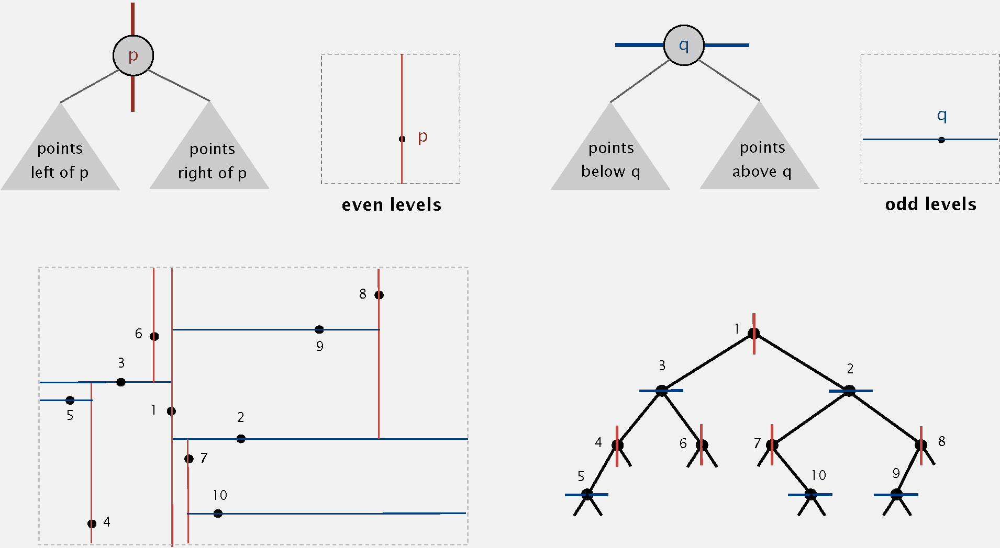
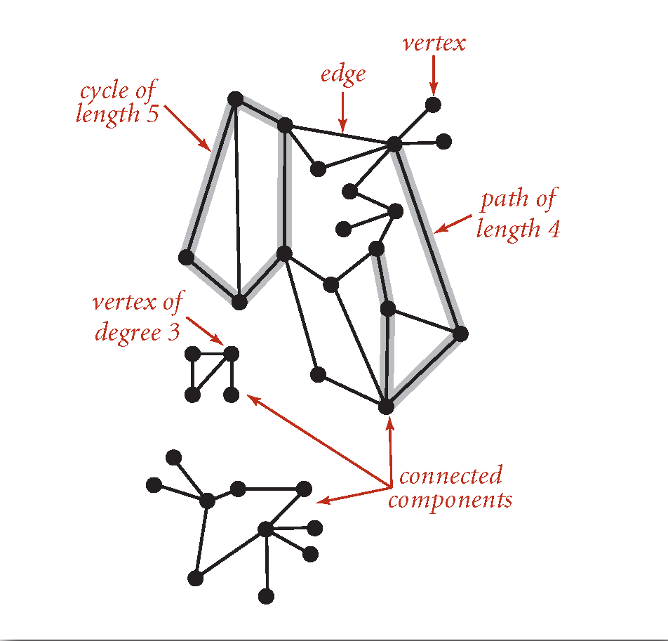
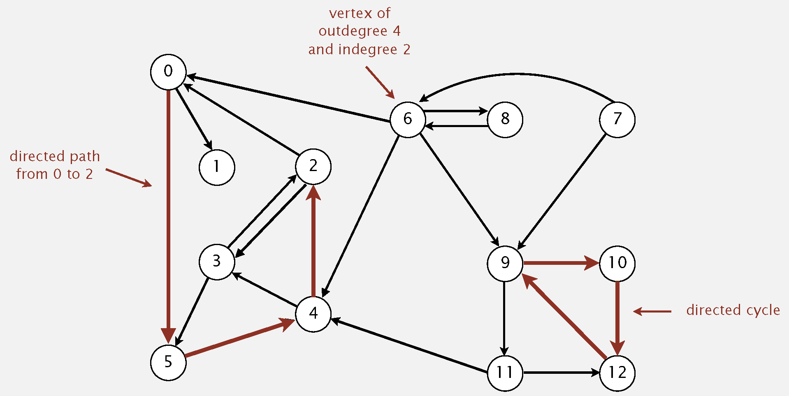
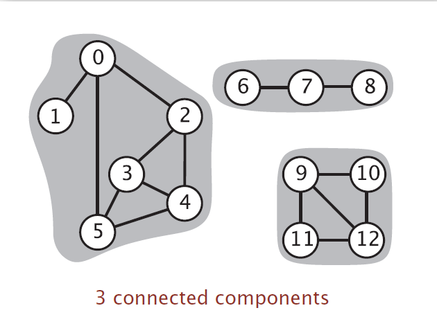
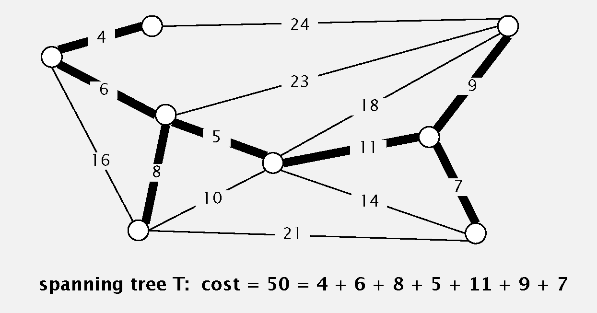
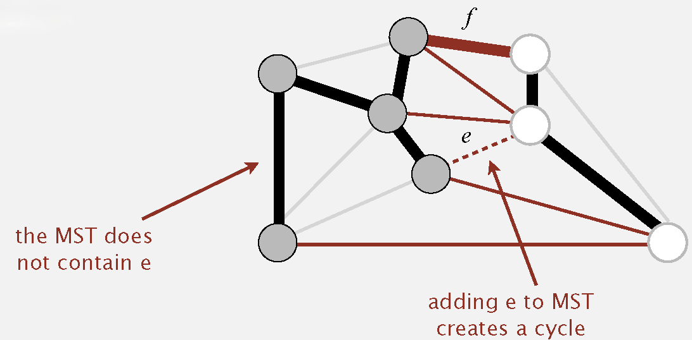
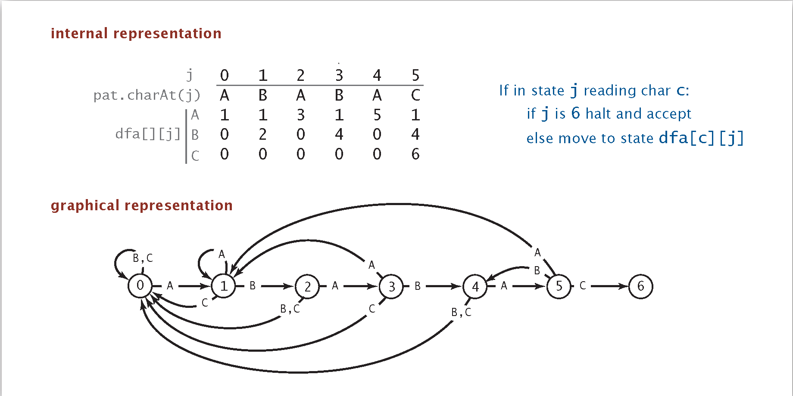

<show-structure for="chapter" depth="3"></show-structure>

# Data Structures and Algorithms 2

## 11 Geometric Applications of BSTs

<p><format color = "DodgerBlue">Topic</format>: Intersections among 
<format color = "OrangeRed">geometric objects</format>.</p>

<p><format color = "DodgerBlue">Applications</format>: CAD, games, 
movies, virtual reality, databases...</p>

### 11.1 1d Range Search

<list type = "bullet">
<li>
<p><format color = "OrangeRed">Range search</format>: find all key between
<math>k_{1}</math> and <math>k_{2}</math>.</p>
</li>
<li>
<p><format color = "OrangeRed">Range count</format>: # of keys between
<math>k_{1}</math> and <math>k_{2}</math>.</p>
</li>
<li>Geometric interpretation: Keys are point on a 
<format color = "OrangeRed">line</format>; find/count points in a given 
<format color = "OrangeRed">1d interval</format>.</li>
</list>

<procedure title = "1d range count">
<step>
<p>Recursively find all keys in left subtree (if any could fall 
in range).</p>
</step>
<step>
<p>Check key in current node.</p>
</step>
<step>
<p>Recursively find all keys in right subtree (if any could fall 
in range).</p>
</step>
</procedure>

<p><format color = "DodgerBlue">Proposition</format>: Running
time proportinal to <math>R + \ log N</math></p>

### 11.2 Line Segment Intersection

<p><format color = "DodgerBlue">Goal</format>: Given <math>N</math> 
horizontal and vertical line segments, find all intersections 
(all <math>x</math>- and <math>y</math>-coordinates are distinct.</p>

<procedure title = "Sweep-Line Algorithm => Sweep Vertical Lines 
from Left to Right">
<step>
<p><math>x</math>-coordinates define events.</p>
</step>
<step>
<p><math>h</math>-segments (left endpoint): insert <math>y</math>- 
coordiantes into BST.</p>
</step>
<step>
<p><math>h</math>-segments (right endpoint): remove <math>y</math>- 
coordiantes from BST.</p>
</step>
<step>
<p><math>v</math>- segment: range search for interval of 
<math>y</math>-endpoints.</p>
</step>
</procedure>


<p><format color = "DodgerBlue">Properties</format>: The sweep-line 
algorithm takes time proportional to <math>N \log N + R</math> to 
find all <math>R</math> intersections among <math>N</math> 
orthogonal line segments.</p>

<p>Proof: </p>
<list type = "bullet">
<li>
<p>Put <math>x</math>-coordinates on a PQ (or sort). => 
<math>N \log N</math></p>
</li>
<li>
<p>Insert <math>y</math>-coordinates into BST. => 
<math>N \log N</math></p>
</li>
<li>
<p>Delete <math>y</math>-coordinates from BST. => 
<math>N \log N</math></p>
</li>
<li>
<p>Range searches in BST. => <math>N \log N + R</math></p>
</li>
</list>

### 11.3 Kd-Trees

<p><format color = "DodgerBlue">Goal</format>: 2d orthogonal range search.</p>

<p><format color = "DodgerBlue">Geometric interpretation</format>: 
Keys are point in the <format color = "OrangeRed">plane</format>;
find/count points in a given <format color = "OrangeRed">
<math>h-v</math> rectangle</format>.</p>

#### 11.3.1 Grid Implementation

<procedure title = "Grid Implementation">
<step>
<p>Divide space into <math>M</math> -by- <math>M</math> grid of 
squares.</p>
</step>
<step>
<p>Create list of points contained in each square.</p>
</step>
<step>
<p>Use 2d array to directly index relevant square.</p>
</step>
<step>
<p>Insert: add <math>(x, y)</math> to list for corresponding square.</p>
</step>
<step>
<p>Range search: examine only squares that intersect 2d range 
query.</p>
</step>
</procedure>

<p><format color = "DodgerBlue">Properties: </format></p>

<list type = "bullet">
<li>
<p>Space: <math>M ^ {2} + N</math></p>
</li>
<li>
<p>Time: <math>1 + \frac {N}{M ^ {2}}</math> per square examined,
on average.</p>
</li>
</list>

<p><format color = "DodgerBlue">Problems: </format></p>
<list type = "bullet">
<li>
<p><format color = "OrangeRed">Clustering</format> a well-known 
phenomenon in geometric data.</p>
</li>
<li>
<p>Lists are too long, even though average length is short.</p>
</li>
<li>
<p>Need data structure that adapts gracefully to data.</p>
</li>
</list>

#### 11.3.2 Space-Partitioning Trees

<p><format color = "Chartreuse">Space-Partitioning Trees:</format> Use 
a tree to represent a recursive subdivision of a 2d space.</p>

<p><format color = "Chartreuse">2d Trees:</format> Recursively divide
space into two halfplanes.</p>

<p><format color = "DodgerBlue">Applications:</format> Ray tracing,
2d range search, Flight simulators, N-body simulation, Nearest
neighbor search, Accelerate rendering in Doom, etc.</p>

<format color = "Aqua">Part &#8544; 2d Trees</format> 

<p><format color = "DodgerBlue">Data Structure:</format> BST, but 
alternate using <math>x</math>- and <math>y</math>- coordinates as 
key.</p>

<list type = "bullet">
<li>
<p>Search gives rectangle containing point.</p>
</li>
<li>
<p>Insert further subdivides the plane.</p>
</li>
</list>



<procedure title = "Range Search - Find all points in a query 
axis-aligned rectangle">
<step>
<p>Check if point in node lies in given rectangle.</p>
</step>
<step>
<p>Recursively search left/bottom (if any could fall in rectangle).</p>
</step>
<step>
<p>Recursively search right/top (if any could fall in rectangle).</p>
</step>
</procedure>

<p><format color = "DodgerBlue">Properties: </format></p>

<list type = "bullet">
<li>
<p>Typical case: <math>R + \log N</math></p>
</li>
<li>
<p>Worst case (assuming tree is balanced): <math>R + \sqrt{N}</math></p>
</li>
</list>

<procedure title = "Nearest Neighbor Search - Find closest point to 
query point">
<step>
<p>Check distance from point in node to query point.</p>
</step>
<step>
<p>Recursively search left/bottom (if it could contain a closer 
point).</p>
</step>
<step>
<p>Recursively search right/top (if it could contain a closer 
point).</p>
</step>
<step>
<p>Organize method so that it begins by searching for query point.</p>
</step>
</procedure>

<p><format color = "DodgerBlue">Properties: </format></p>

<list type = "bullet">
<li>
<p>Typical case: <math>\log N</math></p>
</li>
<li>
<p>Worst case (even if tree is balanced): <math>N</math></p>
</li>
</list>

<format color = "Aqua">Part &#8545; Kd Trees</format> 

<p><format color = "Chartreuse">Kd Tree:</format> Recursively 
partition <math>k</math>-dimensional space into 2 halfspaces.</p>

<p><format color = "DodgerBlue">Implementation:</format> BST, but
cycle through dimensions ala 2d trees.</p>

<format color = "Aqua">Part &#8546; N-body Simulation</format>

<format color = "DodgerBlue">Goal:</format> Simulate the motion 
of <math>N</math> particles, mutually affected by gravity.

<procedure title = "Appel's Algorithm for N-body Simulation">
<step>
<p>Build 3d-tree with <math>N</math> particles as nodes.</p>
</step>
<step>
<p>Store center-of-mass of subtree in each node.</p>
</step>
<step>
<p>To compute total force acting on a particle, traverse tree, but 
stop as soon as distance from particle to subdivision is sufficiently
large.</p>
</step>
</procedure>

<p><format color = "DodgerBlue">Properties:</format> Running time
per step is <math>N \log N</math>.</p>

### 11.4 Interval Search Tree

<p>Create BST, where each node stores an interval <math>(lo, hi)
</math>.</p>

<list type = "bullet">
<li>
<p>Use left endpoint as BST <format color = "OrangeRed">key</format>
.</p>
</li>
<li>
<p>Store <format color = "BlueViolet">max endpoint</format> in 
subtree rooted at node.</p>
</li>
</list>

<procedure title = "Insertion for Interval Search Tree">
<step>
<p>Insert into BST, using <math>lo</math> as the key.</p>
</step>
<step>
<p>Update max in each node on search path.</p>
</step>
</procedure>

<procedure title = "Interval Search for Interval Search Tree" 
type = "choices">
<step>
<p>If interval in node intersects query interval, return it.</p>
</step>
<step>
<p>Else if left subtree is null, go right.</p>
</step>
<step>
<p>Else if max endpoint in left subtree is less than lo, go right.</p>
</step>
<step>
<p>Else go left.</p>
</step>
</procedure>

<p>Order of growth of running time for <math>N</math> intervals.</p>

<table style = "header-row">
<tr><td>operation</td><td>brute</td><td>interval search tree</td>
<td>best in theory</td></tr>
<tr><td>insert interval</td><td><math>1</math></td><td><math>\log N
</math></td><td><math>\log N</math></td></tr>
<tr><td>find interval</td><td><math>N</math></td><td><math>\log N
</math></td><td><math>\log N</math></td></tr>
<tr><td>delete interval</td><td><math>N</math></td><td><math>\log N
</math></td><td><math>\log N</math></td></tr>
<tr><td>find <format color = "OrangeRed">any one</format> interval
that intersects <math>(lo, hi)</math></td><td><math>N</math></td>
<td><math>\log N</math></td><td><math>\log N</math></td></tr>
<tr><td>find <format color = "OrangeRed">all</format> interval
that intersects <math>(lo, hi)</math></td><td><math>N</math></td>
<td><math>R \log N</math></td><td><math>R + \log N</math></td></tr>
</table>

### 11.5 Rectangle Intersection

<p><format color = "DodgerBlue">Sweep-line Algorithm</format>: </p>

<list type = "bullet">
<li>
<p><math>x</math>-coordinates of left and right endpoints define 
events.</p>
</li>
<li>
<p>Maintain set of rectangles that intersect the sweep line in an 
interval search tree (using <math>y</math>-intervals of rectangle).</p>
</li>
<li>
<p>Left endpoint: interval search for <math>y</math>-interval of 
rectangle; insert <math>y</math>-interval.</p>
</li>
<li>
<p>Right endpoint: remove <math>y</math>-interval.</p>
</li>
</list>

<p><format color = "DodgerBlue">Property:</format> Sweep line 
algorithm takes time proportional to <math>N \log N + R \log N</math> 
to find <math>R</math> intersections among a set of <math>N</math> 
rectangles.</p>

<p>Proof: </p>
<list type = "bullet">
<li>
<p>Put <math>x</math>-coordinates on a PQ (or sort) => 
<math>N \log N</math></p>
</li>
<li>
<p>Insert <math>y</math>-intervals into ST => <math>N \log N</math>
</p>
</li>
<li>
<p>Delete <math>y</math>-intervals from ST => <math>N \log N</math>
</p>
</li>
<li>
<p>Interval searches for y-intervals => <math>N \log N + R \log N
</math></p>
</li>
</list>

## 12 Hash Tables

<table style = "none">
<tr><td rowspan = "2">implementation</td><td colspan="3">worst-case 
cost (after <math>N</math> inserts)</td><td colspan = "3">
average case (after <math>N</math> random inserts)</td>
<td rowspan = "2">ordered iteration?</td><td rowspan = "2">
key interface</td></tr>
<tr><td>search</td><td>insert</td><td>delete</td><td>search hit</td>
<td>insert</td><td>delete</td></tr>
<tr><td>sequential search (unordered list)</td><td><math>N</math></td>
<td><math>N</math></td><td><math>N</math></td><td><math>
\frac {N}{2}</math></td><td><math>N</math></td><td><math>N</math>
</td><td>no</td><td><code>equals()</code></td></tr>
<tr><td>binary search (ordered list)</td><td><math>\lg N</math></td>
<td><math>N</math></td><td><math>N</math></td><td><math>
\lg N</math></td><td><math>\frac {N}{2}</math></td>
<td><math>\frac {N}{2}</math></td><td>yes</td>
<td><code>compareTo()</code></td></tr>
<tr><td>BST</td><td><math>N</math></td><td><math>N</math></td>
<td><math>N</math></td><td><math>1.39 \log N</math></td>
<td><math>1.39 \log N</math></td><td>?</td><td>yes</td>
<td><code>compareTo()</code></td></tr>
<tr><td>2-3 tree</td><td><math>c \log N</math></td>
<td><math>c \log N</math></td><td><math>c \log N</math></td>
<td><math>c \log N</math></td><td><math>c \log N</math></td>
<td><math>c \log N</math></td><td>yes</td><td><code>compareTo()</code></td></tr>
<tr><td>red-black BST</td><td><math>2 \log N</math></td>
<td><math>2 \log N</math></td><td><math>2 \log N</math></td>
<td><math>1.00 \lg N</math></td><td><math>1.00 \lg N</math></td>
<td><math>1.00 \lg N</math></td><td>yes</td><td><code>compareTo()
</code></td></tr>
<tr><td>separate chaining</td><td><math>\log N</math></td>
<td><math>\log N</math></td><td><math>\log N</math></td>
<td><math>3-5</math></td><td><math>3-5</math></td>
<td><math>3-5</math></td><td>no</td><td><code>equals
</code><code>hashCode()</code></td></tr>
<tr><td>linear probing</td><td><math>\log N</math></td>
<td><math>\log N</math></td><td><math>\log N</math></td>
<td><math>3-5</math></td><td><math>3-5</math></td>
<td><math>3-5</math></td><td>no</td><td><code>equals
</code><code>hashCode()</code></td></tr>
</table>

### 12.1 Hash Tables

<list type = "decimal">
<li>
<p><format color = "DodgerBlue">Hashing</format>: Save items in a key-indexed 
table (index is a function of the key).</p>
</li>
<li>
<p><format color = "DodgerBlue">Hash function</format>: Method for 
computing array index from key.</p>
<p>Issues:</p>
<list type = "alpha-lower">
<li>
<p><format color = "DodgerBlue">Equality test</format>: Method 
for checking whether two keys are equal.</p>
</li>
<li>
<p><format color = "DodgerBlue">Collision resolution</format>: 
Algorithm and data structure to handle two keys that hash to the 
same array index.</p>
</li>
</list>
</li>
<li>
<p><format color = "DodgerBlue">Hash code</format>: An int between 
<math>-2^31</math> and <math>2^31-1</math>.</p>
</li>
<li>
<p><format color = "DodgerBlue">Hash function</format>: An int 
between 0 and M-1 (for use of array index).</p>
</li>
</list>

<note>
<p>This is Horner's method to hash strings.</p>
</note>

```Java
public final class StringTest {
    private final char[] s = "Hello, World!".toCharArray();
    
    public int hash() {
        int hash = 0;
        for (int i = 0; i < s.length; i++) {
            hash = (31 * hash) + s[i];
        }
        return hash;
    }
}
```

### 12.2 Collision Solution &#8544; - Separate Chaining & Variant

#### 12.2.1 Separate Chaining

<list type = "alpha-lower">
<li>
<p><format color = "Fuchsia">Hash:</format> map key to integer
<math>i</math> between <math>0</math> and <math>M - 1</math>.</p>
</li>
<li>
<p><format color = "Fuchsia">Insert:</format> put at front of
<math>i ^ {th}</math> chain (if not already there).</p>
</li>
<li>
<p><format color = "Fuchsia">Search:</format> need to search 
only <math>i ^ {th}</math> chain.</p>
</li>
</list>


<list>
<li>
<p>Number of probes for search/insert/delete is proportional to 
<math>\frac {N}{M}</math>.
</p>
</li>
<li>
<p>Typical choice: <math>M \sim \frac {N}{5}</math> (constant 
operations)</p>
</li>
</list>

Java

```Java
public class SeparateChainingHashST {
    private final int M = 97; // number of chains
    private final Node[] st = new Node[M]; // array of chains

    private static class Node {
        private final Object key;
        private Object val;
        private final Node next;

        public Node(Object key, Object val, Node node) {
            this.key = key;
            this.val = val;
            this.next = node;
        }
    }

    private int hash(Object key) {
        return (key.hashCode() & 0x7fffffff) % M;  // no bug
    }

    public Object get(Object key) {
        int i = hash(key);
        for (Node x = st[i]; x != null; x = x.next)
            if (key.equals(x.key)) return x.val;
        return null;
    }

    public void put(Object key, Object val) {
        int i = hash(key);
        for (Node x = st[i]; x != null; x = x.next)
            if (key.equals(x.key)) { x.val = val; return; }
        st[i] = new Node(key, val, st[i]);
    }
}
```

C++

```C++
#include <list>
#include <vector>
#include <optional>

template<typename Key, typename Value>
class HashTable {
public:
    explicit HashTable(size_t size) : table(size) {}

    void insert(Key key, Value value) {
        size_t hashValue = hashFunction(key);
        auto& chain = table[hashValue];
        for (auto& pair : chain) {
            if (pair.first == key) {
                pair.second = value;
                return;
            }
        }
        chain.emplace_back(key, value);
    }

    std::optional<Value> get(Key key) {
        size_t hashValue = hashFunction(key);
        auto& chain = table[hashValue];
        for (auto& pair : chain) {
            if (pair.first == key) {
                return pair.second;
            }
        }
        return {};
    }

    void remove(Key key) {
        size_t hashValue = hashFunction(key);
        auto& chain = table[hashValue];
        chain.remove_if([key](auto pair) { return pair.first == key; });
    }

private:
    std::vector<std::list<std::pair<Key, Value>>> table;

    size_t hashFunction(Key key) {
        return key % table.size();
    }
};
```

#### 12.2.2 Variant - Two-Probe Hashing

<list type = "bullet">
<li>
<p>Hash to two positions, insert key in shorter of the two chains.</p>
</li>
<li>
<p>Reduces expected length of the longest chain to <math>\log \log N
</math>.</p>
</li>
</list>

### 12.3 Collision Solution &#8545; - Open Addressing

#### 12.3.1 Linear Probing

<p><format color = "Chartreuse">Open addressing:</format> When a new
key collides, find next empty slot, and put it there.</p>

<list type = "alpha-lower">
<li>
<p><format color = "Fuchsia">Hash:</format> Map key to integer 
<math>i</math> between <math>0</math> and <math>M - 1</math>.</p>
</li>
<li>
<p><format color = "Fuchsia">Search:</format> Search table 
index <math>i</math>; if occupied but no match, try <math>i+1</math>,
<math>i+2</math>, etc..</p>
</li>
<li>
<p><format color = "Fuchsia">Insert:</format> Put at table
index <math>i</math> if free; if not try <math>i+1</math>, <math>i+2
</math>, etc.</p>
</li>
</list>

<p>Under uniform hashing assumption, the average numbers of probes in
a linear probing hash table of size M that contains <math>N = \alpha M
</math> keys is:</p>

<list type = "bullet">
<li>
<p><format color = "Fuchsia">Search hit:</format> <math>\sim
\frac{1}{2} \left(1 + \frac{1}{1 - \alpha}\right)</math></p>
</li>
<li>
<p><format color = "Fuchsia">Search miss / insert:</format> 
<math>\sim \frac{1}{2} \left(1 + \frac{1}{(1 - \alpha)^2}\right)
</math></p>
</li>
</list>

Java

```Java
public class LinearProbingHashST<Key, Value> {
    private final int M = 30001;
    private final Key[] keys = (Key[]) new Object[M];
    private final Value[] vals = (Value[]) new Object[M];

    /* Map key to integer i between 0 and M - 1. */
    private int hash(Key key) {
        return (key.hashCode() & 0x7fffffff) % M;
    }

    /* Put at table index i if free; if not try i+1, i+2, etc. */
    public void put(Key key, Value val) {
        int i;
        for (i = hash(key); keys[i] != null; i = (i + 1) % M) {
            if (keys[i].equals(key)) {
                vals[i] = val;
                return;
            }
        }
        keys[i] = key;
        vals[i] = val;
    }

    /* Search table index i; if occupied but not match, try i+1, i+2, etc. */
    public Value get(Key key) {
        for (int i = hash(key); keys[i] != null; i = (i + 1) % M)
            if (keys[i].equals(key))
                return vals[i];
        return null;
    }
}
```

Java (Princeton)

```Java
public class LinearProbingHashST<Key, Value> {

    // must be a power of 2
    private static final int INIT_CAPACITY = 4;

    private int n;           // number of key-value pairs in the symbol table
    private int m;           // size of linear probing table
    private Key[] keys;      // the keys
    private Value[] vals;    // the values


    public LinearProbingHashST() {
        this(INIT_CAPACITY);
    }

    public LinearProbingHashST(int capacity) {
        m = capacity;
        n = 0;
        keys = (Key[]) new Object[m];
        vals = (Value[]) new Object[m];
    }

    public int size() {
        return n;
    }

    public boolean isEmpty() {
        return size() == 0;
    }

    public boolean contains(Key key) {
        if (key == null) throw new IllegalArgumentException("argument to contains() is null");
        return get(key) != null;
    }

    // hash function for keys - returns value between 0 and m-1
    private int hashTextbook(Key key) {
        return (key.hashCode() & 0x7fffffff) % m;
    }

    // hash function for keys - returns value between 0 and m-1 (assumes m is a power of 2)
    // (from Java 7 implementation, protects against poor quality hashCode() implementations)
    private int hash(Key key) {
        int h = key.hashCode();
        h ^= (h >>> 20) ^ (h >>> 12) ^ (h >>> 7) ^ (h >>> 4);
        return h & (m - 1);
    }

    // resizes the hash table to the given capacity by re-hashing all of the keys
    private void resize(int capacity) {
        LinearProbingHashST<Key, Value> temp = new LinearProbingHashST<Key, Value>(capacity);
        for (int i = 0; i < m; i++) {
            if (keys[i] != null) {
                temp.put(keys[i], vals[i]);
            }
        }
        keys = temp.keys;
        vals = temp.vals;
        m = temp.m;
    }

    /**
     * Inserts the specified key-value pair into the symbol table, overwriting the old
     * value with the new value if the symbol table already contains the specified key.
     * Deletes the specified key (and its associated value) from this symbol table
     * if the specified value is {@code null}.
     */
    public void put(Key key, Value val) {
        if (key == null) throw new IllegalArgumentException("first argument to put() is null");

        if (val == null) {
            delete(key);
            return;
        }

        // double table size if 50% full
        if (n >= m / 2) resize(2 * m);

        int i;
        for (i = hash(key); keys[i] != null; i = (i + 1) % m) {
            if (keys[i].equals(key)) {
                vals[i] = val;
                return;
            }
        }
        keys[i] = key;
        vals[i] = val;
        n++;
    }

    // Returns the value associated with the specified key.
    public Value get(Key key) {
        if (key == null) throw new IllegalArgumentException("argument to get() is null");
        for (int i = hash(key); keys[i] != null; i = (i + 1) % m)
            if (keys[i].equals(key))
                return vals[i];
        return null;
    }

    /**
     * Removes the specified key and its associated value from this symbol table
     * (if the key is in this symbol table).
     */
    public void delete(Key key) {
        if (key == null) throw new IllegalArgumentException("argument to delete() is null");
        if (!contains(key)) return;

        // find position i of key
        int i = hash(key);
        while (!key.equals(keys[i])) {
            i = (i + 1) % m;
        }

        // delete key and associated value
        keys[i] = null;
        vals[i] = null;

        // rehash all keys in same cluster
        i = (i + 1) % m;
        while (keys[i] != null) {
            // delete keys[i] and vals[i] and reinsert
            Key keyToRehash = keys[i];
            Value valToRehash = vals[i];
            keys[i] = null;
            vals[i] = null;
            n--;
            put(keyToRehash, valToRehash);
            i = (i + 1) % m;
        }

        n--;

        // halves size of array if it's 12.5% full or less
        if (n > 0 && n <= m / 8) resize(m / 2);

        assert check();
    }

    // integrity check - don't check after each put() because
    // integrity not maintained during a call to delete()
    private boolean check() {

        // check that hash table is at most 50% full
        if (m < 2 * n) {
            System.err.println("Hash table size m = " + m + "; array size n = " + n);
            return false;
        }

        // check that each key in table can be found by get()
        for (int i = 0; i < m; i++) {
            if (keys[i] == null) continue;
            else if (get(keys[i]) != vals[i]) {
                System.err.println("get[" + keys[i] + "] = " + get(keys[i]) + "; vals[i] = " + vals[i]);
                return false;
            }
        }
        return true;
    }
}
```

C++

```C++
#include <vector>
#include <optional>

template<typename Key, typename Value>
struct HashNode {
    Key key;
    Value value;
    bool occupied;

    HashNode() : occupied(false) {}
    HashNode(Key key, Value value) : key(key), value(value), occupied(true) {}
};

template<typename Key, typename Value>
class HashTable {
private:
    std::vector<HashNode<Key, Value>> table;
    int tableSize;

    int hashFunction(Key key) {
        return key % tableSize;
    }

public:
    HashTable(int size) : table(size), tableSize(size) {}

    void insert(Key key, Value value) {
        int index = hashFunction(key);
        while (table[index].occupied) {
            index = (index + 1) % tableSize;
        }
        table[index] = HashNode<Key, Value>(key, value);
    }

    std::optional<Value> get(Key key) {
        int index = hashFunction(key);
        while (table[index].occupied) {
            if (table[index].key == key) {
                return table[index].value;
            }
            index = (index + 1) % tableSize;
        }
        return {};
    }

    void remove(Key key) {
        int index = hashFunction(key);
        while (table[index].occupied) {
            if (table[index].key == key) {
                table[index].occupied = false;
                return;
            }
            index = (index + 1) % tableSize;
        }
    }
};
```

<p><format color = "Aqua">Knuth's Parking Problem</format></p>

<p>Cars arrive at a one-way street with <math>M</math> parking spaces. 
Each driver tries to park in their own space <math>i</math>: If space
<math>i</math> is taken, try <math>i + 1</math>, <math>i + 2</math>, 
etc. What is the mean displacement of the car?</p>

<list type = "bullet">
<li>
<p><format color = "Fuchsia">Half-full:</format> With 
<math>\frac {M}{2}</math> cars, mean displacement is <math>
\sim \frac {3}{2}</math>.</p>
</li>
<li>
<p><format color = "Fuchsia">Full:</format> With 
<math>M</math> cars, mean displacement is <math>\sim \sqrt{\frac
{\pi M}{8}}</math>.</p>
</li>
</list>

#### 12.3.2 Varaint 1 - Double Hashing

<list type = "bullet">
<li>
<p>Use linear probing, but skip a variable amount, not just 
1 each time.</p>
</li>
<li>
<p>Effectively eliminates clustering.</p>
</li>
<li>
<p>Can allow table to become nearly full.</p>
</li>
<li>
<p>More difficult to implement delete.</p>
</li>
</list>

<p><format color = "Fuchsia">Insert:</format> Use the <math>
1 ^{st}</math> hash function to calculate index. If there is a 
collision, use <math>2 ^ {nd}</math> hash value for "step size" for
probing until an empty slot is found. (=> <math>(h1(key) + i * h2(key))
\% size</math>) </p>

#### 12.3.3 Variant 2 - Quadratic Probing

<p><format color = "Fuchsia">Insert:</format> Use the hash 
function to calculate index. If there is a collision, probe the 
index using the following probing sequence: </p>

<list type = "bullet">
<li>
<p><format color = "Chartreuse">index 1:</format> 
<math>(h(key) + 1 ^ {2}) % tableSize</math></p>
</li>
<li>
<p><format color = "Chartreuse">index 2:</format> 
<math>(h(key) + 2 ^ {2}) % tableSize</math></p>
</li>
<li>
<p><format color = "Chartreuse">index 3:</format> 
<math>(h(key) + 3 ^ {2}) % tableSize</math></p>
</li>
</list>

#### 12.3.4 Variant 3 - Cuckoo Hashing

<list type = "bullet">
<li>
<p>Hash key to two positions; insert key into either position; if 
occupied, reinsert displaced key into its alternative position (and
recur).</p>
</li>
<li>
<p>Constant worst case time for search.</p>
</li>
</list>

#### 12.3.5 Separate Chaining vs. Linear Probing

<p><format color = "DodgerBlue">Separate Chaining</format></p>

<list type = "bullet">
<li>
<p>Easier to implement delete.</p>
</li>
<li>
<p>Performance degrades gracefully.</p>
</li>
<li>
<p>Clustering less sensitive to poorly-designed hash function.</p>
</li>
</list>

<p><format color = "DodgerBlue">Linear Probing</format></p>

<list type = "bullet">
<li>
<p>Less wasted space.</p>
</li>
<li>
<p>Better cache performance.</p>
</li>
</list>

### 12.4 Hash Table vs. Balanced Search Tree

<p><format color = "DodgerBlue">Hash Table</format></p>

<list type = "bullet">
<li>
<p>Simpler to code.</p>
</li>
<li>
<p>No effective alternative for unordered keys.</p>
</li>
<li>
<p>Faster for simple keys (a few arithmetic ops versus <math>log N
</math> compares).</p>
</li>
<li>
<p>Better system support in Java for strings (e.g., cached hash 
code).</p>
</li>
</list>

<p><format color = "DodgerBlue">Balanced Search Tree</format></p>

<list type = "bullet">  
<li>
<p>Stronger performance guarantee.</p>
</li>
<li>
<p>Support for ordered ST operations.</p>
</li>
<li>
<p>Easier to implement <code>compareTo()</code> correctly than 
<code>equals()</code> and <code>hashCode()</code>.</p>
</li>
</list>

<p>Java systems includes both.</p>

<list type = "bullet">
<li>
<p><format color = "Chartreuse">Red-black BSTs:</format> 
<code>java.util.TreeMap</code>, <code>java.util.TreeSet</code>.</p>
</li>
<li>
<p><format color = "Chartreuse">Hash tables:</format> 
<code>java.util.HashMap</code>, <code>java.util.IdentityHashMap</code>
.</p>
</li>
</list>

<p>C++ STL includes both.</p>

<list type = "bullet">
<li>
<p><format color = "Chartreuse">Red-black BSTs:</format> 
<code>std::set</code>, <code>std::map</code>.</p>
</li>
<li>
<p><format color = "Chartreuse">Hash tables:</format> 
<code>std::unordered_map</code>, <code>std::unordered_set</code>
.</p>
</li>
</list>

<warning>
<p>Python uses hash tables to implement dictionaries, but no built
-in red-black BST!</p>
</warning>

## 13 Symbol Table Applications

### 13.1 Sets

<p><format color = "DodgerBlue">Mathematical Set</format>: 
A collection of distinct keys.</p>

#### 13.1.1 Sets in Java

<list type = "decimal">

<li>
<p><code>HashSet</code></p>
<list type = "alpha-lower">
<li>
<p><format color = "DarkViolet">Implementation</format>: Uses a hash 
table (specifically, a <code>HashMap</code> internally) for storage.</p>
</li>
<li>
<p><format color = "Lime">Features</format>: </p>
<list type = "bullet">
<li>
<p>Efficient for adding, removing, and checking for the existence of 
elements (average <math>O(1)</math> time complexity).</p>
</li>
<li>
<p>Does not maintain insertion order.</p>
</li>
<li>
<p>Allows a single null element.</p>
</li>
</list>
</li>
</list>
</li>

<li>
<p><code>LinkedHashSet</code></p>
<list type = "alpha-lower">
<li>
<p><format color = "DarkViolet">Implementation</format>: Extends 
<code>HashSet</code> and maintains a doubly linked list to preserve
the order of element insertion.</p>
</li>
<li>
<p><format color = "Lime">Features</format>: </p>
<list type = "bullet">
<li>
<p>Elements are iterated in the order they were added.</p>
</li>
<li>
<p>Slightly slower than <code>HashSet</code> due to the linked list 
overhead.</p>
</li>
</list>
</li>
</list>
</li>

<li>
<p><code>TreeSet</code></p>
<list type = "alpha-lower">
<li>
<p><format color = "DarkViolet">Implementation</format>: Uses a 
red-black tree (a self-balancing binary search tree).</p>
</li>
<li>
<p><format color = "Lime">Features</format>: </p>
<list type = "bullet">
<li>
<p>Elements are stored in sorted order (natural order or using a 
<code>Comparator</code> provided during set creation).</p>
</li>
<li>
<p>Provides efficient retrieval of elements in a sorted range.</p>
</li>
<li>
<p>Slower than <code>HashSet</code> and <code>LinkedHashSet</code> 
for insertion and removal operations (logarithmic time complexity).</p>
</li>
<li>
<p>Does not allow <code>null</code> elements by default.</p>
</li>
</list>
</li>
</list>
</li>
</list>

Java

```Java
import java.util.HashSet;
import java.util.LinkedHashSet;
import java.util.Set;
import java.util.TreeSet;

public class SetExample {
    public static void main(String[] args) {
        // HashSet - No order guarantee
        Set<String> hashSet = new HashSet<>();
        hashSet.add("Apple");
        hashSet.add("Banana");
        hashSet.add("Orange");
        System.out.println("HashSet: " + hashSet); // Output may vary in order

        // LinkedHashSet - Maintains insertion order
        Set<String> linkedHashSet = new LinkedHashSet<>();
        linkedHashSet.add("Apple");
        linkedHashSet.add("Banana");
        linkedHashSet.add("Orange");
        System.out.println("LinkedHashSet: " + linkedHashSet); // Output: [Apple, Banana, Orange]

        // TreeSet - Sorted order
        Set<String> treeSet = new TreeSet<>();
        treeSet.add("Orange");
        treeSet.add("Apple");
        treeSet.add("Banana");
        System.out.println("TreeSet: " + treeSet); // Output: [Apple, Banana, Orange]
    }
}
```

<note>Implementation of <code>TreeSet</code>: Remove "value" from any
ST implementation.</note>

#### 13.1.2 Sets in C++

<list type = "decimal">
<li>
<p><code>std::set</code> | <code>std::multiset</code></p>
<list type = "alpha-lower">
<li>
<p><format color = "DarkViolet">Implementation</format>: Usually 
implemented as a self-balancing binary search tree (often a 
red-black tree).</p>
</li>
<li>
<p><format color = "Lime">Features</format>: </p>
<list type = "bullet">
<li>
<p>Elements are stored in sorted order (by default, using 
<code>std::less</code>, which is the less-than operator &lt;)</p>
</li>
<li>
<p>Most operations like insertion, search, deletion, etc., have a 
time complexity of <math>O(log n)</math>, where <math>n</math> is 
the number of elements, making it efficient for larger datasets.</p>
</li>
</list>
</li>
</list>
</li>

<li>
<p><code>std::unordered_set</code> | <code>std::unordered_multiset</code></p>
<list type = "alpha-lower">
<li>
<p><format color = "DarkViolet">Implementation</format>: Using a hash table, 
which prioritizes fast average-case performance for operations 
like insertion, search, and deletion over maintaining a specific 
order.</p>
</li>
<li>
<p><format color = "Lime">Features</format>: </p>
<list type = "bullet">
<li>
<p>Offers O(1) average-case time complexity for insertion, 
search, and deletion operations. </p>
</li>
</list>
</li>
</list>
</li>
</list>

C++

```C++
#include <iostream>
#include <set>

int main() {
    std::set<int> uniqueNumbers;

    uniqueNumbers.insert(3);
    uniqueNumbers.insert(1);
    uniqueNumbers.insert(4);
    uniqueNumbers.insert(1); // Duplicate, won't be added

    std::cout << "Elements in the set: ";
    for (int num : uniqueNumbers) {
        std::cout << num << " ";
    } // Output: 1 3 4 

    return 0;
}
```

#### 13.1.3 Sets in Python

<p>For this part, please refer to 
<a href = "Python-Programming.md" anchor = "sets" 
summary = "How to use sets in Python">Sets in Python Programming</a></p>

### 13.2 Dictionary Clients

<note><p>This is the use of built-in dictionaries.</p></note>

Java

```Java
import java.util.HashMap;

public class Main {
    public static void main(String[] args) {
        HashMap<String, Integer> map = new HashMap<>();

        map.put("Alice", 25);
        map.put("Bob", 30);
        map.put("Charlie", 35);

        int age = map.get("Alice");
        System.out.println("Alice's age: " + age);
        boolean exists = map.containsKey("Bob");
        System.out.println("Is Bob in the map? " + exists);
        map.remove("Charlie");
        System.out.println(map);
    }
}
```

C++ (map -> Red-Black Trees)

```C++
#include <iostream>
#include <map>

int main() {
    std::map<std::string, int> myMap;
    myMap["apple"] = 1;
    myMap["banana"] = 2;
    myMap["cherry"] = 3;
    std::cout << "The value associated with key 'apple' is: " << myMap["apple"] << std::endl;
    for (const auto& pair : myMap) {
        std::cout << "Key: " << pair.first << ", Value: " << pair.second << std::endl;
    }
    return 0;
}
```

C++ (unordered map -> Hash Tables)

```C++
#include <iostream>
#include <unordered_map>

int main() {
    std::unordered_map<std::string, int> myMap;
    myMap["apple"] = 1;
    myMap["banana"] = 2;
    myMap["cherry"] = 3;
    std::cout << "The value associated with key 'apple' is: " << myMap["apple"] << std::endl;
    for (const auto& pair : myMap) {
        std::cout << "Key: " << pair.first << ", Value: " << pair.second << std::endl;
    }
    return 0;
}
```

<p>For dictionaries in Python, refer to
<a href = "Python-Programming.md" anchor = "dictionaries" summary
= "How to use dictionaries in Python">Python Programming</a>.</p>

Python

```Python
person = {
    "name": "John",
    "age": 30,
    "city": "New York"
}
print(person["name"]) 
```

### 13.3 Indexing Clients

Java

```Java
import java.util.ArrayList;
import java.util.Arrays;
import java.util.List;
import java.util.TreeMap;

public class InvertedIndexJava {

    // Data structure to represent a document
    static class Document {
        int id;
        String content;

        Document(int id, String content) {
            this.id = id;
            this.content = content;
        }
    }

    // Function to build an inverted index using TreeMap (Red-Black Tree)
    static TreeMap<String, List<Integer>> buildInvertedIndex(List<Document> documents) {
        TreeMap<String, List<Integer>> index = new TreeMap<>();

        for (Document doc : documents) {
            String[] words = doc.content.toLowerCase().split("\\s+"); // Tokenize into words
            for (String word : words) {
                index.computeIfAbsent(word, k -> new ArrayList<>()).add(doc.id); 
            }
        }

        return index;
    }

    public static void main(String[] args) {
        List<Document> documents = Arrays.asList(
                new Document(1, "The quick brown fox jumps over the lazy dog"),
                new Document(2, "A lazy cat sleeps all day long"),
                new Document(3, "The quick rabbit jumps over the fence")
        );

        TreeMap<String, List<Integer>> invertedIndex = buildInvertedIndex(documents);

        // Example query: Find documents containing the word "jumps"
        String searchTerm = "jumps";
        if (invertedIndex.containsKey(searchTerm)) {
            System.out.println("Documents containing '" + searchTerm + "': " + invertedIndex.get(searchTerm));
        } else {
            System.out.println("No documents found containing '" + searchTerm + "'");
        }
    }
}
```

C++

```C++
#include <iostream>
#include <string>
#include <vector>
#include <map>

using namespace std;

// Data structure to represent a document
struct Document {
    int id;
    string content;
};

// Function to build an inverted index using a map (Red-Black Tree)
map<string, vector<int>> buildInvertedIndex(const vector<Document>& documents) {
    map<string, vector<int>> index;

    for (const Document& doc : documents) {
        // Tokenize the document content (split into words) - simplify for brevity
        string word; 
        for (char c : doc.content){
            if (isspace(c)){
                if (!word.empty()){ // Avoid adding empty words
                    index[word].push_back(doc.id);
                    word.clear();
                }
            }
            else {
                word += c;
            }
        }
        if (!word.empty()){ // Add the last word
            index[word].push_back(doc.id);
        }
    }

    return index;
}

int main() {
    vector<Document> documents = {
        {1, "The quick brown fox jumps over the lazy dog"},
        {2, "A lazy cat sleeps all day long"},
        {3, "The quick rabbit jumps over the fence"}
    };

    map<string, vector<int>> invertedIndex = buildInvertedIndex(documents);

    // Example query: Find documents containing the word "jumps"
    string searchTerm = "jumps";
    if (invertedIndex.find(searchTerm) != invertedIndex.end()) {
        cout << "Documents containing '" << searchTerm << "': ";
        for (int docId : invertedIndex[searchTerm]) {
            cout << docId << " ";
        }
        cout << endl;
    } else {
        cout << "No documents found containing '" << searchTerm << "'" << endl;
    }

    return 0;
}
```

### 13.4 Sparse Vectors

Java

```Java
import java.util.HashMap;
import java.util.Map;

public class SparseMatrixVectorMultiplication {

    public static class SparseMatrix {
        private int rows;
        private int cols;
        private Map<String, Double> data;

        public SparseMatrix(int rows, int cols) {
            this.rows = rows;
            this.cols = cols;
            this.data = new HashMap<>();
        }

        // Method to set a non-zero element in the matrix
        public void set(int row, int col, double value) {
            if (row < 0 || row >= rows || col < 0 || col >= cols) {
                throw new IllegalArgumentException("Invalid row or column index");
            }
            if (value != 0) {
                data.put(getKey(row, col), value);
            }
        }

        // Method to get an element from the matrix (returns 0 if not present)
        public double get(int row, int col) {
            if (row < 0 || row >= rows || col < 0 || col >= cols) {
                throw new IllegalArgumentException("Invalid row or column index");
            }
            return data.getOrDefault(getKey(row, col), 0.0);
        }

        // Helper method to generate key for the HashMap
        private String getKey(int row, int col) {
            return row + "," + col;
        }

        // Method to perform matrix-vector multiplication
        public double[] multiply(double[] vector) {
            if (vector.length != cols) {
                throw new IllegalArgumentException("Vector size mismatch");
            }

            double[] result = new double[rows];
            for (String key : data.keySet()) {
                String[] indices = key.split(",");
                int row = Integer.parseInt(indices[0]);
                int col = Integer.parseInt(indices[1]);
                result[row] += data.get(key) * vector[col];
            }
            return result;
        }
    }
}
```

C++

```C++
#include <iostream>
#include <unordered_map>
#include <vector>

using namespace std;

// Pair struct to store row and column indices
struct RowCol {
    int row;
    int col;

    // Hash function for unordered_map
    size_t operator()(const RowCol& rc) const {
        return hash<int>()(rc.row) ^ hash<int>()(rc.col);
    }

    // Equality comparison for unordered_map
    bool operator==(const RowCol& other) const {
        return row == other.row && col == other.col;
    }
};

class SparseMatrix {
private:
    int rows;
    int cols;
    unordered_map<RowCol, double> data; // Symbol table (hash map)

public:
    SparseMatrix(int rows, int cols) : rows(rows), cols(cols) {}

    // Set a non-zero element in the matrix
    void set(int row, int col, double value) {
        if (row < 0 || row >= rows || col < 0 || col >= cols) {
            throw out_of_range("Invalid row or column index");
        }
        if (value != 0) {
            data[{row, col}] = value; // Using RowCol struct as key
        }
    }

    // Get an element from the matrix (returns 0 if not present)
    double get(int row, int col) const {
        if (row < 0 || row >= rows || col < 0 || col >= cols) {
            throw out_of_range("Invalid row or column index");
        }
        return data.count({row, col}) ? data.at({row, col}) : 0.0; 
    }

    // Matrix-vector multiplication
    vector<double> multiply(const vector<double>& vec) const {
        if (vec.size() != cols) {
            throw invalid_argument("Vector size mismatch");
        }

        vector<double> result(rows, 0.0); // Initialize result vector with zeros
        for (const auto& entry : data) {
            int row = entry.first.row;
            int col = entry.first.col;
            result[row] += entry.second * vec[col];
        }
        return result;
    }
};
```

Python

```Python
class SparseMatrix:
    def __init__(self, rows, cols):
        self.rows = rows
        self.cols = cols
        self.data = {}  # Using a dictionary as a symbol table

    def set(self, row, col, value):
        if row < 0 or row >= self.rows or col < 0 or col >= self.cols:
            raise ValueError("Invalid row or column index")
        if value != 0:
            self.data[(row, col)] = value

    def get(self, row, col):
        if row < 0 or row >= self.rows or col < 0 or col >= self.cols:
            raise ValueError("Invalid row or column index")
        return self.data.get((row, col), 0)  # Return 0 if not found

    def multiply(self, vector):
        if len(vector) != self.cols:
            raise ValueError("Vector size mismatch")

        result = [0] * self.rows
        for (row, col), value in self.data.items():
            result[row] += value * vector[col]
        return result
```

<tip>
<p>What is the running time of multiplying the <math>n \times n</math> matirx
<math>A</math> with a dense vector <math>x</math> 
of length <math>n</math> ? => <math>n</math></p>
</tip>

## 14 Undirected Graphs

### 14.1 Introduction to Graphs

<p><format color = "DodgerBlue">Terminology:</format> </p>

<list type = "alpha-lower">
<li>
<p><format color = "Chartreuse">Graph:</format> Set of 
<format color = "OrangeRed">vertices</format> connected pairwise by 
<format color = "OrangeRed">edges</format>.</p>
</li>
<li>
<p><format color = "Chartreuse">Path:</format> Sequence of vertices 
connected by edges.</p>
</li>
<li>
<p><format color = "Chartreuse">Cycle:</format> Path whose first and 
last vertices are the same.</p>
</li>
<li>
<p>Two vertices are <format color = "OrangeRed">connected</format> if
there is a path between them.</p>
</li>
</list>



### 14.2 Graph API

<p><format color = "DodgerBlue">Representation Types:</format> </p>

<list type = "alpha-lower">
<li>
<p><format color = "Fuchsia">Set-of-edges graph representation: 
</format> Maintain a list of the edges (linked list or array).</p>
</li>
<li>
<p><format color = "Fuchsia">Adjacency-matrix graph 
representation:</format> Maintain a two-dimensional
<math>V</math> by <math>V</math> boolean array; for each edge 
<math>v-w</math> in the graph: <code>adj[v][w] = adj[w][v] = true</code>.</p>
</li>
<li>
<p><format color = "Fuchsia">Adjacency-list graph 
representation:</format> Maintain vertex-indexed array of lists.</p>
</li>
</list>

<p>In practice: use adjacency-lists representation.</p>

<list type = "bullet">
<li>
<p>Algorithms based on iterating over vertices adjacent to <math>v
</math>.</p>
</li>
<li>
<p>Real-world graphs tend to be <format color = "OrangeRed">sparse
</format> (huge number of vertices, small average vertex degree).</p>
</li>
</list>

Java

```Java
import java.util.ArrayList;
import java.util.LinkedList;
import java.util.List;

public class UndirectedGraph {

    private final int numVertices;
    private final List<List<Integer>> adjacencyList;

    public UndirectedGraph(int numVertices) {
        this.numVertices = numVertices;
        adjacencyList = new ArrayList<>(numVertices);
        for (int i = 0; i < numVertices; i++) {
            adjacencyList.add(new LinkedList<>());
        }
    }

    public void addEdge(int source, int destination) {
        adjacencyList.get(source).add(destination);
        adjacencyList.get(destination).add(source);
    }

    public int getNumVertices() {
        return numVertices;
    }

    public List<List<Integer>> getAdjacencyList() {
        return adjacencyList;
    }

    public void printGraph() {
        for (int i = 0; i < numVertices; i++) {
            System.out.print("Vertex " + i + ":");
            for (Integer vertex : adjacencyList.get(i)) {
                System.out.print(" -> " + vertex);
            }
            System.out.println();
        }
    }
}
```

C++ (UndirectedGraph.h)

```C++
#ifndef UNDIRECTEDGRAPH_H
#define UNDIRECTEDGRAPH_H
#pragma once

#include <vector>
#include <list>

class UndirectedGraph {
private:
    int numVertices;
    std::vector<std::list<int>> adjacencyList;

public:
    explicit UndirectedGraph(const int& numVertices);
    void addEdge(const int& source, const int& destination);
    [[nodiscard]] bool hasEdge(const int& source, const int& destination) const;
    [[nodiscard]] int getNumVertices() const;
    [[nodiscard]] const std::vector<std::list<int>>& getAdjacencyList() const;
    void printGraph() const;
};

#endif //UNDIRECTEDGRAPH_H
```

C++ (UndirectedGraph.cpp)

```C++
#include "UndirectedGraph.h"
#include <iostream>
#include <algorithm>

UndirectedGraph::UndirectedGraph(const int& numVertices) :
    numVertices(numVertices), adjacencyList(numVertices) {}

void UndirectedGraph::addEdge(const int& source, const int& destination) {
    adjacencyList[source].push_back(destination);
    adjacencyList[destination].push_back(source);
}

bool UndirectedGraph::hasEdge(const int& source, const int& destination) const {
    return std::ranges::any_of(adjacencyList[source],
                               [&destination](const int& neighbor) {
                                   return neighbor == destination;
                               });
}

int UndirectedGraph::getNumVertices() const {
    return numVertices;
}

const std::vector<std::list<int>>& UndirectedGraph::getAdjacencyList() const {
    return adjacencyList;
}

void UndirectedGraph::printGraph() const {
    for (int i = 0; i < numVertices; ++i) {
        std::cout << "Vertex " << i << ":";
        for (const int& neighbor : adjacencyList[i]) {
            std::cout << " -> " << neighbor;
        }
        std::cout << std::endl;
    }
}
```

Python

```Python
class UndirectedGraph:
    def __init__(self, num_vertices):
        self.num_vertices = num_vertices
        self.adjacency_list = [[] for _ in range(num_vertices)]

    def add_edge(self, source, destination):
        self.adjacency_list[source].append(destination)
        self.adjacency_list[destination].append(source)

    def get_num_vertices(self):
        return self.num_vertices

    def get_adjacency_list(self):
        return self.adjacency_list

    def print_graph(self):
        for i in range(self.num_vertices):
            print(f"Vertex {i}:", end="")
            for vertex in self.adjacency_list[i]:
                print(f" -> {vertex}", end="")
            print()
```

### 14.3 Depth-First Search

<p><format color = "DodgerBlue">Goal:</format> Systematically search
through a graph.</p>

<p><format color = "DodgerBlue">Typical applications:</format> </p>

<list type = "bullet">
<li>
<p>Find all vertices connected to a given source vertex.</p>
</li>
<li>
<p>Find a path between two vertices.</p>
</li>
</list>

<procedure title = "Depth-First Search">
<step>
<p>Mark vertex <math>v</math> as visited.</p>
</step>
<step>
<p>Recursively visit all the unmarked vertices adjacent to <math>v
</math>.</p>
</step>
</procedure>

<p><format color = "DodgerBlue">Properties:</format> </p>

<list type = "bullet">
<li>
<p>DFS marks all vertices connected to <math>s</math> in time 
proportional to the sum of their degrees.</p>
</li>
<li>
<p>After DFS, can find vertices connected to <math>s</math> in 
constant time and can find a path to s (if one exists) in time 
proportional to its length.</p>
</li>
</list>

Java

```Java
import java.util.Stack;

public class DepthFirstSearch {
    private final boolean[] marked;
    private final int[] edgeTo;

    public DepthFirstSearch(UndirectedGraph graph, int source) {
        this.marked = new boolean[graph.getNumVertices()];
        this.edgeTo = new int[graph.getNumVertices()];
        dfs(graph, source);
    }

    private void dfs(UndirectedGraph graph, int source) {
        Stack<Integer> stack = new Stack<>();
        marked[source] = true;
        stack.push(source);

        while (!stack.isEmpty()) {
            int v = stack.pop();
            System.out.print(v + " ");

            for (int w : graph.getAdjacencyList().get(v)) {
                if (!marked[w]) {
                    marked[w] = true;
                    edgeTo[w] = v;
                    stack.push(w);
                }
            }
        }
    }
    
    public void hasPathTo(int v) {
        return marked[v];
    }

    public void printPathTo(int v) {
        if (!marked[v]) {
            System.out.println("No path from source to " + v);
            return;
        }
        Stack<Integer> path = new Stack<>();
        for (int x = v; x != 0; x = edgeTo[x]) {
            path.push(x);
        }
        path.push(0); 

        System.out.print("Path: ");
        while (!path.isEmpty()) {
            System.out.print(path.pop());
            if (!path.isEmpty()) {
                System.out.print(" -> ");
            }
        }
        System.out.println();
    }
}
```

C++ (DepthFirstSearch.h)

```C++
#ifndef DEPTHFIRSTSEARCH_H
#define DEPTHFIRSTSEARCH_H
#pragma once

#include <vector>
#include "UndirectedGraph.h"

class DepthFirstSearch {
private:
    const UndirectedGraph& graph;
    std::vector<bool> marked;
    std::vector<int> edgeTo;

public:
    DepthFirstSearch(const UndirectedGraph& graph, int source);
    void dfs(int v);
    [[nodiscard]] bool hasPathTo(int v) const;
    void printPathTo(int v) const;
};

#endif //DEPTHFIRSTSEARCH_H
```

C++ (DepthFirstSearch.cpp)

```C++
#include "DepthFirstSearch.h"
#include <iostream>
#include <stack>

DepthFirstSearch::DepthFirstSearch(const UndirectedGraph& graph, const int source) :
    graph(graph),
    marked(graph.getNumVertices(), false),
    edgeTo(graph.getNumVertices(), -1)
{
    dfs(source);
}

void DepthFirstSearch::dfs(const int v) {
    std::stack<int> stack;
    marked[v] = true;
    stack.push(v);

    while (!stack.empty()) {
        const int current = stack.top();
        stack.pop();
        std::cout << current << " ";

        for (int neighbor : this->graph.getAdjacencyList()[current]) {
            if (!marked[neighbor]) {
                marked[neighbor] = true;
                edgeTo[neighbor] = current;
                stack.push(neighbor);
            }
        }
    }
}

bool DepthFirstSearch::hasPathTo(const int v) const {
    return marked[v];
}

void DepthFirstSearch::printPathTo(const int v) const {
    if (!hasPathTo(v)) {
        std::cout << "No path from source to " << v << std::endl;
        return;
    }
    std::stack<int> path;
    for (int x = v; x != edgeTo[v]; x = edgeTo[x]) {
        path.push(x);
    }
    path.push(edgeTo[v]);

    std::cout << "Path: ";
    while (!path.empty()) {
        std::cout << path.top();
        path.pop();
        if (!path.empty()) {
            std::cout << " -> ";
        }
    }
    std::cout << std::endl;
}
```

Python

```Python
from UndirectedGraph import UndirectedGraph


class DepthFirstSearch:
    def __init__(self, graph: UndirectedGraph, source: int):
        self.marked = [False] * graph.get_num_vertices()
        self.edge_to = [None] * graph.get_num_vertices()
        self.dfs(graph, source)

    def dfs(self, graph, source):
        stack = [source]
        self.marked[source] = True

        while stack:
            v = stack.pop()
            print(v, end=" ")

            for w in graph.get_adjacency_list()[v]:
                if not self.marked[w]:
                    self.marked[w] = True
                    self.edge_to[w] = v
                    stack.append(w)

    def has_path_to(self, v):
        return self.marked[v]

    def print_path_to(self, v):
        if not self.marked[v]:
            print(f"No path from source to {v}")
            return

        path = []
        x = v
        while x is not None:
            path.append(x)
            x = self.edge_to[x]

        print("Path:", " -> ".join(map(str, path[::-1])))
```

### 14.4 Breadth-First Search

<procedure title = "Breadth-First Search">
<step>
<p>Put s onto a FIFO queue, and mark s as visited.</p>
</step>
<step>
<p>Repeat until the queue is empty.</p>
</step>
<step>
<p>Remove the least recently added vertex v.</p>
</step>
<step>
<p>Add each of v's unvisited neighbors to the queue, and mark them as 
visited.</p>
</step>
</procedure>

<p><format color = "DodgerBlue">Property:</format> </p>

<p>BFS computes shortest paths (fewest number of edges) from s to 
all other vertices in a graph in time proportional to <math>E + V
</math>.</p>

<list type = "bullet">
<li>
<p><format color = "Fuchsia">Depth-first search:</format> put
unvisited vertices on <format color = "OrangeRed">stack</format>.</p>
</li>
<li>
<p><format color = "Fuchsia">Breadth-first search:</format> 
put unvisited vertices on <format color = "OrangeRed">queue</format>
.</p>
</li>
</list>

Java

```Java
import java.util.ArrayDeque;
import java.util.List;
import java.util.Queue;

public class BreadthFirstSearch {
    private boolean[] marked;
    private int[] edgeTo;
    private int[] distanceTo;

    public void bfs(UndirectedGraph graph, int startVertex) {
        marked = new boolean[graph.getNumVertices()];
        edgeTo = new int[graph.getNumVertices()];
        distanceTo = new int[graph.getNumVertices()];

        Queue<Integer> queue = new ArrayDeque<>();

        marked[startVertex] = true;
        distanceTo[startVertex] = 0;
        queue.offer(startVertex);

        while (!queue.isEmpty()) {
            int currentVertex = queue.poll();

            List<List<Integer>> adjList = graph.getAdjacencyList();
            for (int adjacentVertex : adjList.get(currentVertex)) {
                if (!marked[adjacentVertex]) {
                    marked[adjacentVertex] = true;
                    edgeTo[adjacentVertex] = currentVertex;
                    distanceTo[adjacentVertex] = distanceTo[currentVertex] + 1; // Update distance
                    queue.offer(adjacentVertex);
                }
            }
        }
    }

    public int getDistance(int destination) {
        if (!marked[destination]) { 
            return -1; 
        }
        return distanceTo[destination];
    }

    public void printPath(int start, int end) {
        if (start == end) {
            System.out.print(start);
            return;
        }

        if (edgeTo[end] == 0) {
            System.out.print("No path exists");
            return;
        }

        printPath(start, edgeTo[end]);
        System.out.print(" -> " + end);
    }
}
```

C++ (BreadthFirstSearch.h)

```C++
#ifndef BREADTHFIRSTSEARCH_H
#define BREADTHFIRSTSEARCH_H
#pragma once

#include "UndirectedGraph.h"
#include <vector>

class BreadthFirstSearch {
private:
    const UndirectedGraph& graph;
    int startVertex;
    std::vector<bool> marked;
    std::vector<int> edgeTo;
    std::vector<int> distanceTo;

public:
    BreadthFirstSearch(const UndirectedGraph& graph, int startVertex);
    void bfs();
    [[nodiscard]] int getDistance(int destination) const;
    void printPath(int destination) const;
};

#endif //BREADTHFIRSTSEARCH_H
```

C++ (BreadthFirstSearch.cpp)

```C++
#include "BreadthFirstSearch.h"
#include <iostream>
#include <queue>

BreadthFirstSearch::BreadthFirstSearch(const UndirectedGraph& graph, const int startVertex) :
    graph(graph), startVertex(startVertex),
    marked(graph.getNumVertices(), false),
    edgeTo(graph.getNumVertices(), -1),
    distanceTo(graph.getNumVertices(), 0) {}

void BreadthFirstSearch::bfs() {
    std::queue<int> queue;
    marked[startVertex] = true;
    queue.push(startVertex);

    while (!queue.empty()) {
        const int currentVertex = queue.front();
        queue.pop();

        for (const int& neighbor : graph.getAdjacencyList()[currentVertex]) {
            if (!marked[neighbor]) {
                marked[neighbor] = true;
                edgeTo[neighbor] = currentVertex;
                distanceTo[neighbor] = distanceTo[currentVertex] + 1;
                queue.push(neighbor);
            }
        }
    }
}

int BreadthFirstSearch::getDistance(const int destination) const {
    if (!marked[destination]) {
        return -1;
    }
    return distanceTo[destination];
}

void BreadthFirstSearch::printPath(const int destination) const {
    if (startVertex == destination) {
        std::cout << startVertex;
        return;
    }

    if (edgeTo[destination] == -1) {
        std::cout << "No path exists";
        return;
    }

    printPath(edgeTo[destination]);
    std::cout << " -> " << destination;
}
```

Python

```Python
from collections import deque
from UndirectedGraph import UndirectedGraph
import sys


class BreadthFirstSearch:
    def __init__(self, graph: UndirectedGraph, start_vertex: int):
        self.marked = [False] * graph.get_num_vertices()
        self.edge_to = [None] * graph.get_num_vertices()
        self.distance_to = [sys.maxsize] * graph.get_num_vertices()

        self.bfs(graph, start_vertex)

    def bfs(self, graph: UndirectedGraph, start_vertex: int):
        queue = deque([start_vertex])
        self.marked[start_vertex] = True
        self.distance_to[start_vertex] = 0

        while queue:
            current_vertex = queue.popleft()

            for adjacent_vertex in graph.get_adjacency_list()[current_vertex]:
                if not self.marked[adjacent_vertex]:
                    self.marked[adjacent_vertex] = True
                    self.edge_to[adjacent_vertex] = current_vertex
                    self.distance_to[adjacent_vertex] = self.distance_to[current_vertex] + 1
                    queue.append(adjacent_vertex)

    def get_distance(self, destination: int) -> int:
        if not self.marked[destination]:
            return -1
        return self.distance_to[destination]

    def print_path(self, start: int, end: int):
        if start == end:
            print(start, end="")
            return

        if self.edge_to[end] is None:
            print("No path exists")
            return

        self.print_path(start, self.edge_to[end])
        print(f" -> {end}", end="")
```

### 14.5 Connected Components

<p><format color = "Chartreuse">Connected Components:</format> A 
connected component is maximal set of connected vertices.</p>

<procedure title = "Find all Connected Components">
<step>
<p>Mark vertex <math>v</math> as visited.</p>
</step>
<step>
<p>Recursively visit all the unmarked vertices adjacent to <math>v
</math>.</p>
</step>
</procedure>

Java

```Java
import java.util.ArrayList;
import java.util.List;

public class ConnectedComponents {

    private final int[] id;
    private int count; 

    public ConnectedComponents(UndirectedGraph graph) {
        int numVertices = graph.getNumVertices();
        id = new int[numVertices];
        count = 0;
        
        for (int i = 0; i < numVertices; i++) {
            id[i] = i;
        }
        
        for (int i = 0; i < numVertices; i++) {
            if (id[i] == i) { 
                dfs(graph, i);
                count++;
            }
        }
    }

    private void dfs(UndirectedGraph graph, int v) {
        id[v] = count;
        for (int w : graph.getAdjacencyList().get(v)) {
            if (id[w] == w) {
                dfs(graph, w);
            }
        }
    }

    public boolean isConnected(int v, int w) {
        return id[v] == id[w];
    }

    public int getCount() {
        return count;
    }

    public void printComponents() {
        System.out.println("Number of connected components: " + count);
        List<List<Integer>> components = new ArrayList<>(count);
        for (int i = 0; i < count; i++) {
            components.add(new ArrayList<>());
        }
        for (int i = 0; i < id.length; i++) {
            components.get(id[i]).add(i);
        }
        for (int i = 0; i < count; i++) {
            System.out.println("Component " + i + ": " + components.get(i));
        }
    }
}
```

C++ (ConnectedComponents.h)

```C++
#ifndef CONNECTEDCOMPONENTS_H 
#define CONNECTEDCOMPONENTS_H

#include <vector>
#include "UndirectedGraph.h" 

class ConnectedComponents {
private:
    std::vector<int> id;
    int count;

    void dfs(const UndirectedGraph& graph, int v); 

public:
    explicit ConnectedComponents(const UndirectedGraph& graph);
    [[nodiscard]] bool isConnected(int v, int w) const;
    [[nodiscard]] int getCount() const; 
    void printComponents() const;
};

#endif // CONNECTEDCOMPONENTS_H 
```

C++ (ConnectedComponents.cpp)

```C++
#include "ConnectedComponents.h"
#include <iostream>

ConnectedComponents::ConnectedComponents(const UndirectedGraph& graph) : count(0) {
    const int numVertices = graph.getNumVertices();
    id.resize(numVertices);

    for (int i = 0; i < numVertices; ++i) {
        id[i] = i; 
    }

    for (int i = 0; i < numVertices; ++i) {
        if (id[i] == i) {
            dfs(graph, i);
            ++count;
        }
    }
}

void ConnectedComponents::dfs(const UndirectedGraph& graph, int v) {
    id[v] = count;
    for (const int& w : graph.getAdjacencyList()[v]) {
        if (id[w] == w) { 
            dfs(graph, w);
        }
    }
}

bool ConnectedComponents::isConnected(int v, int w) const {
    return id[v] == id[w];
}

int ConnectedComponents::getCount() const {
    return count;
}

void ConnectedComponents::printComponents() const {
    std::cout << "Number of connected components: " << count << std::endl;

    std::vector<std::vector<int>> components(count);
    for (int i = 0; i < id.size(); ++i) {
        components[id[i]].push_back(i);
    }

    for (int i = 0; i < count; ++i) {
        std::cout << "Component " << i << ": ";
        for (const int& vertex : components[i]) {
            std::cout << vertex << " ";
        }
        std::cout << std::endl;
    }
}
```

Python

```Python
from UndirectedGraph import UndirectedGraph  


class ConnectedComponents:
    def __init__(self, graph: UndirectedGraph):
        self.id = list(range(graph.get_num_vertices()))  
        self.count = 0

        for i in range(graph.get_num_vertices()):
            if self.id[i] == i:  
                self.dfs(graph, i)
                self.count += 1

    def dfs(self, graph: UndirectedGraph, v: int):
        self.id[v] = self.count
        for w in graph.get_adjacency_list()[v]:
            if self.id[w] == w:
                self.dfs(graph, w)

    def is_connected(self, v: int, w: int) -> bool:
        return self.id[v] == self.id[w]

    def get_count(self) -> int:
        return self.count

    def print_components(self):
        print("Number of connected components:", self.count)
        components = [[] for _ in range(self.count)]

        for i in range(len(self.id)):
            components[self.id[i]].append(i)

        for i, component in enumerate(components):
            print(f"Component {i}: {component}")
```

### 14.6 Important Questions

<list type = "decimal">
<li>
<p><format color = "PaleGoldenRod">Q:</format> Implement depth-first 
search in an undirected graph without using recursion.</p>
<p><format color = "SkyBlue">A:</format> Simply replace a queue with
a stack in breadth-first search.</p>
</li>
<li>
<p>Given a connected graph with no cycles</p>
    <list type = "bullet">
    <li>
    <p><format color = "PaleGoldenRod">Q:</format> <format style = 
    "italic">Diameter</format>: design a linear-time algorithm to find
    the longest simple path in the graph.</p>
    <p><format color = "SkyBlue">A:</format> to compute the diameter,
    pick a vertex <math>s</math>; run BFS from <math>s</math>; then 
    run BFS again from the vertex that is furthest from <math>s</math>
    .</p>
    </li>
    <li>
    <p><format color = "PaleGoldenRod">Q:</format> <format style =
    "italic">Center</format>: design a linear-time algorithm to find
    the center of the graph.</p>
    <p><format color = "SkyBlue">A:</format> consider vertices on the 
    longest path.</p>
    </li>
    </list>
</li>
<li>
<p><format color = "PaleGoldenRod">Q:</format> An Euler cycle in a 
graph is a cycle (not necessarily simple) that uses every edge in the
graph exactly one. Design a linear-time algorithm to determine whether 
a graph has an Euler cycle, and if so, find one.</p>
<p><format color = "SkyBlue">A:</format> use depth-first search and 
piece together the cycles you discover.</p>
</li>
</list>

## 15 Directed Graphs

### 15.1 Introduction to Directed Graphs

<p>Directed graph: Set of vertices connected pairwise by <format color
= "red">directed edges</format>.</p>



### 15.2 Directed Graph API

Java

```Java
import java.util.ArrayList;
import java.util.List;

public class DirectedGraph {

    private final int numVertices;
    private int numEdges;
    private final List<List<Integer>> adjacencyList;

    public DirectedGraph(int numVertices) {
        this.numVertices = numVertices;
        this.numEdges = 0;
        this.adjacencyList = new ArrayList<>();
        for (int i = 0; i < numVertices; i++) {
            adjacencyList.add(i, new ArrayList<>());
        }
    }

    public void addEdge(int source, int destination) {
        adjacencyList.get(source).add(destination);
        numEdges++;
    }

    public int getNumVertices() {
        return numVertices;
    }

    public int getNumEdges() {
        return numEdges;
    }

    public List<List<Integer>> getAdjacencyList() {
        return adjacencyList;
    }

    public void printGraph() {
        for (int v = 0; v < numVertices; v++) {
            System.out.print("Adjacency list of vertex " + v + " : ");
            for (Integer neighbor : adjacencyList.get(v)) {
                System.out.print(neighbor + " ");
            }
            System.out.println();
        }
    }
}
```

C++ (DirectedGraph.h)

```C++
#ifndef DIRECTEDGRAPH_H
#define DIRECTEDGRAPH_H
#pragma once

#include <vector>
#include <list>

class DirectedGraph {
private:
    int numVertices;
    std::vector<std::list<int>> adjacencyList;

public:
    explicit DirectedGraph(const int& numVertices);
    void addEdge(const int& source, const int& destination);
    [[nodiscard]] bool hasEdge(const int& source, const int& destination) const;
    [[nodiscard]] int getNumVertices() const;
    [[nodiscard]] const std::vector<std::list<int>>& getAdjacencyList() const;
    void printGraph() const;
};

#endif //DIRECTEDGRAPH_H
```

C++ (DirectedGraph.cpp)

```C++
#include "DirectedGraph.h"
#include <iostream>
#include <algorithm>

DirectedGraph::DirectedGraph(const int& numVertices) :
    numVertices(numVertices), adjacencyList(numVertices) {}

void DirectedGraph::addEdge(const int& source, const int& destination) {
    adjacencyList[source].push_back(destination);
}

bool DirectedGraph::hasEdge(const int& source, const int& destination) const {
    return std::ranges::any_of(adjacencyList[source],
                               [&destination](const int& neighbor) {
                                   return neighbor == destination;
                               });
}

int DirectedGraph::getNumVertices() const {
    return numVertices;
}

const std::vector<std::list<int>>& DirectedGraph::getAdjacencyList() const {
    return adjacencyList;
}

void DirectedGraph::printGraph() const {
    for (int i = 0; i < numVertices; ++i) {
        std::cout << "Vertex " << i << ":";
        for (const int& neighbor : adjacencyList[i]) {
            std::cout << " -> " << neighbor;
        }
        std::cout << std::endl;
    }
}
```

Python

```Python
class DirectedGraph:
    def __init__(self, num_vertices):
        self.num_vertices = num_vertices
        self.num_edges = 0
        self.adjacency_list = [[] for _ in range(num_vertices)]

    def add_edge(self, source, destination):
        self.adjacency_list[source].append(destination)
        self.num_edges += 1

    def get_num_vertices(self):
        return self.num_vertices

    def get_num_edges(self):
        return self.num_edges

    def print_graph(self):
        for v in range(self.num_vertices):
            print(f"Adjacency list of vertex {v} : ", end="")
            for neighbor in self.adjacency_list[v]:
                print(f"{neighbor} ", end="")
            print()
```

### 15.3 Digraph Search

#### 15.3.1 Depth-First Search for Digraph

<note>
<p>Every undirected graph is a digraph (with edges in both 
directions).</p>
<p>DFS is a <format color = "OrangeRed">digraph</format> algorithm, 
same method as for undirected graphs!</p>
</note>

Java

```Java
import java.util.Stack;

public class DirectedDepthFirstSearch {
    private final boolean[] marked;
    private final int[] edgeTo;

    public DirectedDepthFirstSearch(DirectedGraph graph, int source) {
        this.marked = new boolean[graph.getNumVertices()];
        this.edgeTo = new int[graph.getNumVertices()];
        dfs(graph, source);
    }

    private void dfs(DirectedGraph graph, int source) {
        Stack<Integer> stack = new Stack<>();
        marked[source] = true;
        stack.push(source);

        while (!stack.isEmpty()) {
            int v = stack.pop();
            System.out.print(v + " ");

            for (int w : graph.getAdjacencyList().get(v)) {
                if (!marked[w]) {
                    marked[w] = true;
                    edgeTo[w] = v;
                    stack.push(w);
                }
            }
        }
    }

    public boolean hasPathTo(int v) {
        return marked[v];
    }

    public void printPathTo(int v) {
        if (!marked[v]) {
            System.out.println("No path from source to " + v);
            return;
        }
        Stack<Integer> path = new Stack<>();
        for (int x = v; x != 0; x = edgeTo[x]) {
            path.push(x);
        }
        path.push(0);

        System.out.print("Path: ");
        while (!path.isEmpty()) {
            System.out.print(path.pop());
            if (!path.isEmpty()) {
                System.out.print(" -> ");
            }
        }
        System.out.println();
    }
}
```

C++ (DirectedDepthFirstSearch.h)

```C++
#ifndef DIRECTEDDEPTHFIRSTSEARCH_H
#define DIRECTEDDEPTHFIRSTSEARCH_H
#pragma once

#include <vector>
#include "DirectedGraph.h"

class DirectedDepthFirstSearch {
private:
    const DirectedGraph& graph;
    std::vector<bool> marked;
    std::vector<int> edgeTo;

public:
    DirectedDepthFirstSearch(const DirectedGraph& graph, int source);
    void dfs(int v);
    [[nodiscard]] bool hasPathTo(int v) const;
    void printPathTo(int v) const;
};

#endif //DIRECTEDDEPTHFIRSTSEARCH_H
```

C++ (DirectedDepthFirstSearch.cpp)

```C++
#include "DirectedDepthFirstSearch.h"
#include <iostream>
#include <stack>

DirectedDepthFirstSearch::DirectedDepthFirstSearch(const DirectedGraph& graph, const int source) :
    graph(graph),
    marked(graph.getNumVertices(), false),
    edgeTo(graph.getNumVertices(), -1)
{
    dfs(source);
}

void DirectedDepthFirstSearch::dfs(const int v) {
    std::stack<int> stack;
    marked[v] = true;
    stack.push(v);

    while (!stack.empty()) {
        const int current = stack.top();
        stack.pop();
        std::cout << current << " ";

        for (int neighbor : this->graph.getAdjacencyList()[current]) {
            if (!marked[neighbor]) {
                marked[neighbor] = true;
                edgeTo[neighbor] = current;
                stack.push(neighbor);
            }
        }
    }
}

bool DirectedDepthFirstSearch::hasPathTo(const int v) const {
    return marked[v];
}

void DirectedDepthFirstSearch::printPathTo(const int v) const {
    if (!hasPathTo(v)) {
        std::cout << "No path from source to " << v << std::endl;
        return;
    }
    std::stack<int> path;
    for (int x = v; x != edgeTo[v]; x = edgeTo[x]) {
        path.push(x);
    }
    path.push(edgeTo[v]);

    std::cout << "Path: ";
    while (!path.empty()) {
        std::cout << path.top();
        path.pop();
        if (!path.empty()) {
            std::cout << " -> ";
        }
    }
    std::cout << std::endl;
}
```

Python

```Python
from DirectedGraph import DirectedGraph


class DirectedDepthFirstSearch:
    def __init__(self, graph: DirectedGraph, source: int):
        self.marked = [False] * graph.get_num_vertices()
        self.edge_to = [None] * graph.get_num_vertices()
        self.dfs(graph, source)

    def dfs(self, graph, source):
        stack = [source]
        self.marked[source] = True

        while stack:
            v = stack.pop()
            print(v, end=" ")

            for w in graph.get_adjacency_list()[v]:
                if not self.marked[w]:
                    self.marked[w] = True
                    self.edge_to[w] = v
                    stack.append(w)

    def has_path_to(self, v):
        return self.marked[v]

    def print_path_to(self, v):
        if not self.marked[v]:
            print(f"No path from source to {v}")
            return

        path = []
        x = v
        while x is not None:
            path.append(x)
            x = self.edge_to[x]

        print("Path:", " -> ".join(map(str, path[::-1])))
```

#### 15.3.2 Breadth-First Search for Digraph

<note>
<p>Every undirected graph is a digraph (with edges in both 
directions).</p>
<p>BFS is a <format color = "OrangeRed">digraph</format> algorithm, 
same method as for undirected graphs!</p>
</note>

<p><format color = "DodgerBlue">Reachability application:</format> 
</p>

<list type = "bullet">
<li>
<p>Program control-flow analysis</p>
</li>
<li>
<p>Mark-sweep garbage collector: if ao object is unreachable, it is 
garbage.</p> 
</li>
</list>

<p><format color = "DodgerBlue">Application:</format> </p>

<list type = "bullet">
<li>
<p>Web crawler</p>
</li>
</list>

Java

```Java
ivate boolean[] marked;
    private int[] edgeTo;
    private int[] distanceTo;

    public void bfs(UndirectedGraph graph, int startVertex) {
        marked = new boolean[graph.getNumVertices()];
        edgeTo = new int[graph.getNumVertices()];
        distanceTo = new int[graph.getNumVertices()];

        Queue<Integer> queue = new ArrayDeque<>();

        marked[startVertex] = true;
        distanceTo[startVertex] = 0;
        queue.offer(startVertex);

        while (!queue.isEmpty()) {
            int currentVertex = queue.poll();

            List<List<Integer>> adjList = graph.getAdjacencyList();
            for (int adjacentVertex : adjList.get(currentVertex)) {
                if (!marked[adjacentVertex]) {
                    marked[adjacentVertex] = true;
                    edgeTo[adjacentVertex] = currentVertex;
                    distanceTo[adjacentVertex] = distanceTo[currentVertex] + 1; // Update distance
                    queue.offer(adjacentVertex);
                }
            }
        }
    }

    public int getDistance(int destination) {
        if (!marked[destination]) { 
            return -1; 
        }
        return distanceTo[destination];
    }

    public void printPath(int start, int end) {
        if (start == end) {
            System.out.print(start);
            return;
        }

        if (edgeTo[end] == 0) {
            System.out.print("No path exists");
            return;
        }

        printPath(start, edgeTo[end]);
        System.out.print(" -> " + end);
    }
}
```

C++ (BreadthFirstSearch.h)

```C++
#ifndef BREADTHFIRSTSEARCH_H
#define BREADTHFIRSTSEARCH_H
#pragma once

#include "UndirectedGraph.h"
#include <vector>

class BreadthFirstSearch {
private:
    const UndirectedGraph& graph;
    int startVertex;
    std::vector<bool> marked;
    std::vector<int> edgeTo;
    std::vector<int> distanceTo;

public:
    BreadthFirstSearch(const UndirectedGraph& graph, int startVertex);
    void bfs();
    [[nodiscard]] int getDistance(int destination) const;
    void printPath(int destination) const;
};

#endif //BREADTHFIRSTSEARCH_H
```

C++ (BreadthFirstSearch.cpp)

```C++
#include "BreadthFirstSearch.h"
#include <iostream>
#include <queue>

BreadthFirstSearch::BreadthFirstSearch(const UndirectedGraph& graph, const int startVertex) :
    graph(graph), startVertex(startVertex),
    marked(graph.getNumVertices(), false),
    edgeTo(graph.getNumVertices(), -1),
    distanceTo(graph.getNumVertices(), 0) {}

void BreadthFirstSearch::bfs() {
    std::queue<int> queue;
    marked[startVertex] = true;
    queue.push(startVertex);

    while (!queue.empty()) {
        const int currentVertex = queue.front();
        queue.pop();

        for (const int& neighbor : graph.getAdjacencyList()[currentVertex]) {
            if (!marked[neighbor]) {
                marked[neighbor] = true;
                edgeTo[neighbor] = currentVertex;
                distanceTo[neighbor] = distanceTo[currentVertex] + 1;
                queue.push(neighbor);
            }
        }
    }
}

int BreadthFirstSearch::getDistance(const int destination) const {
    if (!marked[destination]) {
        return -1;
    }
    return distanceTo[destination];
}

void BreadthFirstSearch::printPath(const int destination) const {
    if (startVertex == destination) {
        std::cout << startVertex;
        return;
    }

    if (edgeTo[destination] == -1) {
        std::cout << "No path exists";
        return;
    }

    printPath(edgeTo[destination]);
    std::cout << " -> " << destination;
}
```

Python

```Python
from collections import deque
from DirectedGraph import DirectedGraph
import sys


class BreadthFirstSearch:
    def __init__(self, graph: DirectedGraph, start_vertex: int):
        self.marked = [False] * graph.get_num_vertices()
        self.edge_to = [None] * graph.get_num_vertices()
        self.distance_to = [sys.maxsize] * graph.get_num_vertices()

        self.bfs(graph, start_vertex)

    def bfs(self, graph: UndirectedGraph, start_vertex: int):
        queue = deque([start_vertex])
        self.marked[start_vertex] = True
        self.distance_to[start_vertex] = 0

        while queue:
            current_vertex = queue.popleft()

            for adjacent_vertex in graph.get_adjacency_list()[current_vertex]:
                if not self.marked[adjacent_vertex]:
                    self.marked[adjacent_vertex] = True
                    self.edge_to[adjacent_vertex] = current_vertex
                    self.distance_to[adjacent_vertex] = self.distance_to[current_vertex] + 1
                    queue.append(adjacent_vertex)

    def get_distance(self, destination: int) -> int:
        if not self.marked[destination]:
            return -1
        return self.distance_to[destination]

    def print_path(self, start: int, end: int):
        if start == end:
            print(start, end="")
            return

        if self.edge_to[end] is None:
            print("No path exists")
            return

        self.print_path(start, self.edge_to[end])
        print(f" -> {end}", end="")
```

### 15.4 Topological Sort

<p><format color = "Chartreuse">DAG:</format> Directed <format color
= "OrangeRed">Acyclic</format> Graph.</p>

<p><format color = "Chartreuse">Topological sort:</format> Redraw DAG
so all edges point upwards.</p>

<p><format color = "DodgerBlue">Property:</format> A digraph has a
topological order iff no directed cycle.</p>

<p><format color = "DodgerBlue">Application:</format> Precedence 
scheduling, cycle inheritance, spreadsheet recalculation, etc.</p>

#### 15.4.1 Algorithm &#8544; - Depth-First Search

<procedure title = "Topological Sort with DFS">
<step>
<p>Run depth-first search.</p>
</step>
<step>
<p>Return vertices in reverse postorder.</p>
</step>
</procedure>

Java

```Java
import java.util.ArrayList;
import java.util.List;
import java.util.Stack;

public class TopologicalSort {
    private final DirectedGraph graph;
    private final boolean[] visited;
    private final Stack<Integer> postorder;

    public TopologicalSort(DirectedGraph graph) {
        this.graph = graph;
        this.visited = new boolean[graph.getNumVertices()];
        this.postorder = new Stack<>();
    }

    public List<Integer> topologicalSort() {
        for (int v = 0; v < graph.getNumVertices(); v++) {
            if (!visited[v]) {
                dfs(v);
            }
        }
        List<Integer> sortedVertices = new ArrayList<>();
        while (!postorder.isEmpty()) {
            sortedVertices.add(postorder.pop());
        }
        return sortedVertices;
    }

    private void dfs(int v) {
        visited[v] = true;
        for (Integer neighbor : graph.getAdjacencyList().get(v)) {
            if (!visited[neighbor]) {
                dfs(neighbor);
            }
        }
        postorder.push(v);
    }
}
```

C++ (TopologicalSort.h)

```C++
#ifndef TOPOLOGICALSORT_H
#define TOPOLOGICALSORT_H
#pragma once

#include "DirectedGraph.h"
#include <vector>
#include <stack>

class TopologicalSort {
private:
    const DirectedGraph& graph;
    std::vector<bool> visited;
    std::stack<int> postorder;

    void dfs(int v);

public:
    explicit TopologicalSort(const DirectedGraph& graph);
    std::vector<int> topologicalSort();
};

#endif //TOPOLOGICALSORT_H
```

C++ (TopologicalSort.cpp)

```C++
#include "TopologicalSort.h"

TopologicalSort::TopologicalSort(const DirectedGraph &graph) :
    graph(graph), visited(graph.getNumVertices(), false) {}

void TopologicalSort::dfs(const int v) {
    visited[v] = true;
    for (const int& neighbor : graph.getAdjacencyList()[v]) {
        if (!visited[neighbor]) {
            dfs(neighbor);
        }
    }
    postorder.push(v);
}

std::vector<int> TopologicalSort::topologicalSort() {
    for (int v = 0; v < graph.getNumVertices(); ++v) {
        if (!visited[v]) {
            dfs(v);
        }
    }

    std::vector<int> sortedVertices;
    while (!postorder.empty()) {
        sortedVertices.push_back(postorder.top());
        postorder.pop();
    }
    return sortedVertices;
}
```

Python

```Python
class TopologicalSort:
    def __init__(self, graph):
        self.graph = graph  # Store the DirectedGraph object
        self.visited = [False] * self.graph.get_num_vertices()
        self.postorder = []

    def topological_sort(self):
        for v in range(self.graph.get_num_vertices()):
            if not self.visited[v]:
                self.dfs(v)
        return self.postorder[::-1]

    def dfs(self, v):
        self.visited[v] = True
        # Access adjacency list from the DirectedGraph object
        for neighbor in self.graph.adjacency_list[v]:
            if not self.visited[neighbor]:
                self.dfs(neighbor)
        self.postorder.append(v) 
```

#### 15.4.2 Algorithm &#8545; - Kahn's Algorithm

<procedure title = "Topological Sort with Kahn's Algorithm">
<step>
<p>Calculate in-degrees.</p>
</step>
<step>
<p>Find nodes with in-degree 0.</p>
</step>
<step>
<p>Process nodes in topological order, and decrement in-degree of
neighbors.</p>
</step>
</procedure>

Java

```Java
import java.util.ArrayList;
import java.util.LinkedList;
import java.util.List;
import java.util.Queue;

public class TopologicalSort {

    public static List<Integer> topologicalSort(DirectedGraph graph) {
        int numVertices = graph.getNumVertices();
        List<List<Integer>> adjList = graph.getAdjacencyList();

        int[] inDegree = new int[numVertices];
        for (int u = 0; u < numVertices; u++) {
            for (int v : adjList.get(u)) {
                inDegree[v]++;
            }
        }

        Queue<Integer> queue = new LinkedList<>();
        for (int i = 0; i < numVertices; i++) {
            if (inDegree[i] == 0) {
                queue.offer(i);
            }
        }

        List<Integer> sortedOrder = new ArrayList<>();
        while (!queue.isEmpty()) {
            int u = queue.poll();
            sortedOrder.add(u);

            for (int v : adjList.get(u)) {
                if (--inDegree[v] == 0) {
                    queue.offer(v);
                }
            }
        }

        if (sortedOrder.size() != numVertices) {
            System.err.println("Error: Graph contains a cycle!");
            return new ArrayList<>();
        }

        return sortedOrder;
    }
}
```

C++

```C++
#include "DirectedGraph.h"
#include <iostream>
#include <queue>
#include <vector>

std::vector<int> topologicalSort(const DirectedGraph& graph) {
    const int numVertices = graph.getNumVertices();
    std::vector<int> inDegree(numVertices, 0);
    std::vector<int> sortedOrder;
    std::queue<int> queue;

    for (int u = 0; u < numVertices; ++u) {
        for (const int& v : graph.getAdjacencyList()[u]) {
            inDegree[v]++;
        }
    }

    for (int i = 0; i < numVertices; ++i) {
        if (inDegree[i] == 0) {
            queue.push(i);
        }
    }

    while (!queue.empty()) {
        int u = queue.front();
        queue.pop();
        sortedOrder.push_back(u);

        for (const int& v : graph.getAdjacencyList()[u]) {
            if (--inDegree[v] == 0) {
                queue.push(v);
            }
        }
    }

    // Check for cycles!
    if (sortedOrder.size() != numVertices) {
        std::cerr << "Error: Graph contains a cycle!" << std::endl;
        return {};
    }

    return sortedOrder;
}
```

Python

```Python
def topological_sort(graph):
    num_vertices = graph.get_num_vertices()
    in_degree = [0] * num_vertices
    sorted_order = []
    queue = []

    for u in range(num_vertices):
        for v in graph.adjacency_list[u]:
            in_degree[v] += 1

    for i in range(num_vertices):
        if in_degree[i] == 0:
            queue.append(i)

    while queue:
        u = queue.pop(0)
        sorted_order.append(u)

        for v in graph.adjacency_list[u]:
            in_degree[v] -= 1
            if in_degree[v] == 0:
                queue.append(v)

    if len(sorted_order) != num_vertices:
        return None  

    return sorted_order
```

### 15.5 Strong Components

<table style = "both">
<tr><td></td><td>Connected Components</td><td>Strongly-Connected
Components</td></tr>
<tr><td>Definition</td><td><math>v</math> and <math>w</math> are
<format color = "OrangeRed">connected</format> if there is a path
between <math>v</math> and <math>w</math></td><td><math>v</math> and
<math>w</math> are <format color = "OrangeRed">stringly connected
</format> if there is a directed path from <math>v</math> to 
<math>w</math> and a directed graph from <math>w</math> to <math>v
</math></td></tr>
<tr><td>Implementation</td><td>DFS</td><td>DFS & Reverse DFS</td></tr>
<tr><td>Detail</td><td></td><td>
</td></tr>
</table>

<procedure title = "Strongly-Connected Components">
<step>
<p>Computer topological order (reverse postorder) in kernel DAG.</p>
</step>
<step>
<p>Run DFS, considering vertices in reverse topological order.</p>
</step>
</procedure>

Java

```Java
import java.util.Stack;

public class StronglyConnectedComponents {

    private final DirectedGraph graph;
    private boolean[] visited;
    private final Stack<Integer> stack;
    private int sccCount;

    public StronglyConnectedComponents(DirectedGraph graph) {
        this.graph = graph;
        this.visited = new boolean[graph.getNumVertices()];
        this.stack = new Stack<>();
        this.sccCount = 0;
    }

    public void findStronglyConnectedComponents() {
        for (int i = 0; i < graph.getNumVertices(); i++) {
            if (!visited[i]) {
                dfsFirst(i);
            }
        }

        DirectedGraph transposedGraph = transposeGraph();

        visited = new boolean[graph.getNumVertices()];
        while (!stack.isEmpty()) {
            int vertex = stack.pop();
            if (!visited[vertex]) {
                sccCount++;
                System.out.print("SCC " + sccCount + ": ");
                dfsSecond(transposedGraph, vertex);
                System.out.println();
            }
        }
    }

    private void dfsFirst(int vertex) {
        visited[vertex] = true;
        for (int neighbor : graph.getAdjacencyList().get(vertex)) {
            if (!visited[neighbor]) {
                dfsFirst(neighbor);
            }
        }
        stack.push(vertex);
    }

    private void dfsSecond(DirectedGraph transposedGraph, int vertex) {
        visited[vertex] = true;
        System.out.print(vertex + " ");
        for (int neighbor : transposedGraph.getAdjacencyList().get(vertex)) {
            if (!visited[neighbor]) {
                dfsSecond(transposedGraph, neighbor);
            }
        }
    }

    private DirectedGraph transposeGraph() {
        DirectedGraph transposedGraph = new DirectedGraph(graph.getNumVertices());
        for (int i = 0; i < graph.getNumVertices(); i++) {
            for (int neighbor : graph.getAdjacencyList().get(i)) {
                transposedGraph.addEdge(neighbor, i);
            }
        }
        return transposedGraph;
    }
}
```

C++ (StronglyConnectedComponents.h)

```C++
#ifndef STRONGLYCONNECTEDCOMPONENTS_H
#define STRONGLYCONNECTEDCOMPONENTS_H
#pragma once

#include "DirectedGraph.h"
#include <vector>
#include <stack>

class StronglyConnectedComponents {
private:
    const DirectedGraph& graph;
    std::vector<bool> visited;
    std::stack<int> finishingStack;
    int sccCount;

    void dfsFirst(int vertex);
    void dfsSecond(const DirectedGraph& transposedGraph, int vertex);

public:
    explicit StronglyConnectedComponents(const DirectedGraph& graph);
    void findStronglyConnectedComponents();
};

#endif //STRONGLYCONNECTEDCOMPONENTS_H
```

C++ (StronglyConnectedComponents.cpp)

```C++
#include "StronglyConnectedComponents.h"
#include <iostream>

StronglyConnectedComponents::StronglyConnectedComponents(const DirectedGraph& graph) :
    graph(graph), visited(graph.getNumVertices(), false), sccCount(0) {}

void StronglyConnectedComponents::dfsFirst(int vertex) {
    visited[vertex] = true;
    for (const int& neighbor : graph.getAdjacencyList()[vertex]) {
        if (!visited[neighbor]) {
            dfsFirst(neighbor);
        }
    }
    finishingStack.push(vertex);
}

void StronglyConnectedComponents::dfsSecond(const DirectedGraph& transposedGraph, int vertex) {
    visited[vertex] = true;
    std::cout << vertex << " ";
    for (const int& neighbor : transposedGraph.getAdjacencyList()[vertex]) {
        if (!visited[neighbor]) {
            dfsSecond(transposedGraph, neighbor);
        }
    }
}

void StronglyConnectedComponents::findStronglyConnectedComponents() {
    for (int i = 0; i < graph.getNumVertices(); ++i) {
        if (!visited[i]) {
            dfsFirst(i);
        }
    }
    
    DirectedGraph transposedGraph(graph.getNumVertices());
    for (int i = 0; i < graph.getNumVertices(); ++i) {
        for (const int& neighbor : graph.getAdjacencyList()[i]) {
            transposedGraph.addEdge(neighbor, i);
        }
    }

    visited.assign(graph.getNumVertices(), false); 
    while (!finishingStack.empty()) {
        int vertex = finishingStack.top();
        finishingStack.pop();

        if (!visited[vertex]) {
            std::cout << "SCC " << ++sccCount << ": ";
            dfsSecond(transposedGraph, vertex);
            std::cout << std::endl;
        }
    }
}
```

Python

```Python
class StronglyConnectedComponents:
    def __init__(self, graph):
        self.graph = graph
        self.visited = [False] * graph.num_vertices
        self.finishing_stack = []
        self.scc_count = 0

    def dfs_first(self, vertex):
        self.visited[vertex] = True
        for neighbor in self.graph.adjacency_list[vertex]:
            if not self.visited[neighbor]:
                self.dfs_first(neighbor)
        self.finishing_stack.append(vertex)

    def dfs_second(self, transposed_graph, vertex):
        self.visited[vertex] = True
        print(f"{vertex} ", end="")
        for neighbor in transposed_graph.adjacency_list[vertex]:
            if not self.visited[neighbor]:
                self.dfs_second(transposed_graph, neighbor)

    def find_strongly_connected_components(self):
        # 1. DFS on original graph to get finishing times
        for i in range(self.graph.num_vertices):
            if not self.visited[i]:
                self.dfs_first(i)

        transposed_graph = DirectedGraph(self.graph.num_vertices)
        for i in range(self.graph.num_vertices):
            for neighbor in self.graph.adjacency_list[i]:
                transposed_graph.add_edge(neighbor, i)

        self.visited = [False] * self.graph.num_vertices
        while self.finishing_stack:
            vertex = self.finishing_stack.pop()
            if not self.visited[vertex]:
                self.scc_count += 1
                print(f"SCC {self.scc_count}: ", end="")
                self.dfs_second(transposed_graph, vertex)
                print()
```

## 16 Minimum Spanning Trees

### 16.1 Introduction to MSTs

<p><format color = "Chartreuse">Spanning tree:</format> A <format 
color = "OrangeRed">spanning tree</format> is a subgraph <math>T
</math> that is both a <format color = "OrangeRed">tree</format> 
(connected and acyclic) and <format color = "OrangeRed">spanning
</format> (includes all of the vertices).</p>



<p><format color = "DodgerBlue">Application:</format></p>

<list type = "bullet">
<li>
<p>Dithering</p>
</li>
<li>
<p>Cluster analysis</p>
</li>
<li>
<p>Max bottleneck paths</p>
</li>
<li>
<p>Real-time face verification</p>
</li>
<li>
<p>LDPC codes for error correction</p>
</li>
<li>
<p>Image registration with Renyi entropy</p>
</li>
<li>
<p>Find road networks in satellite and aerial imagery</p>
</li>
<li>
<p>Reducing data storage in sequencing amino acids in a protein</p>
</li>
<li>
<p>Model locality of particle interactions in turbulent fluid flows
</p>
</li>
<li>
<p>Autoconfig protocol for Ethernet bridging to avoid cycles in a 
network</p>
</li>
<li>
<p>Approximation algorithms for NP-hard problems (e.g., TSP, Steiner 
tree)</p>
</li>
<li>
<p>Network design (communication, electrical, hydraulic, computer, 
road).</p>
</li>
</list>

### 16.2 Greedy Algorithm

<p><format color = "DodgerBlue">Definition:</format> </p>

<list type = "bullet">
<li>
<p><format color = "Chartreuse">Cut:</format> A cut in a graph is a 
partition of its vertices into two (nonempty) sets.</p>
</li>
<li>
<p><format color = "Chartreuse">Crossing edge:</format> A crossing 
edge connects a vertex in one set with a vertex in the other.</p>
</li>
</list>


<procedure title = "Greedy Algorithm for MST">
    <step>
        <p>Start with all edges colored gray.</p>
    </step>
    <step>
        <p>Find cut with no black crossing edges; color its 
          min-weight edge black.</p>
    </step>
    <step>
        <p>Repeat until <math>V - 1</math> edges are colored black.
        </p>
    </step>
</procedure>

<p><format color = "DodgerBlue">Correctness Proof:</format> </p>

<list type = "decimal">
<li>
<p>Given any cut, the crossing edge of min weight is in MST.</p>

<p><format color = "MediumVioletRed">Proof:</format> </p>

<p>Suppose min-weight crossing edge <math>e</math> is not in the 
MST.</p>
    <list type = "bullet">
    <li>
    <p>Adding <math>e</math> to the MST creates a cycle.</p>
    </li>
    <li>
    <p>Some other edge <math>f</math> in cycle must be a crossing 
    edge.</p>
    </li>
    <li>
    <p>Removing <math>f</math> and adding <math>e</math> is also a
    spanning edge.</p>
    </li>
    <li>
    <p>Since weight of <math>e</math> is less than the weight of 
    <math>f</math>, that spanning tree is lower height.</p>
    </li>
    <li>
    <p>Contradiction.</p>
    </li>
    </list>

</li>
<li>
<p>The greedy algorithm computes the MST.</p>

<p><format color = "MediumVioletRed">Proof:</format> </p>
    <list type = "bullet"> 
    <li>
    <p>Any edge colored black is in the MST (via cut property).</p>
    </li>
    <li>
    <p>Fewer than <math>V - 1</math> black edges => cut with no 
    black crossing edges. (consider cut whose vertices are one 
    connected component)</p>
    </li>
    </list>
</li>
</list>

<warning>
<p>The proof above is under the simplifying assumptions below: </p>
<list type = "bullet">
<li>
<p>Edge weights are distinct.</p>
</li>
<li>
<p>Graph is connected.</p>
</li>
</list>
</warning>

### 16.3 Edge-weighted Graph API

Java (Edge.java)

```Java
public class Edge implements Comparable<Edge> {
    private final int source;
    private final int destination;
    private final double weight;

    public Edge(int source, int destination, double weight) {
        this.source = source;
        this.destination = destination;
        this.weight = weight;
    }

    public int getSource() {
        return source;
    }

    public int getDestination() {
        return destination;
    }

    public double getWeight() {
        return weight;
    }

    @Override
    public String toString() {
        return "(" + source + " - " + destination + " : " + weight + ")";
    }

    @Override
    public int compareTo(Edge other) {
        return Double.compare(this.weight, other.weight);
    }
}
```

Java (EdgeWeightedGraph.java)

```Java
import java.util.ArrayList;
import java.util.List;

public class EdgeWeightedGraph {
    private final int vertices;
    private final List<Edge>[] adjacencyList;

    public EdgeWeightedGraph(int vertices) {
        this.vertices = vertices;
        this.adjacencyList = new ArrayList[vertices];
        for (int i = 0; i < vertices; i++) {
            adjacencyList[i] = new ArrayList<>();
        }
    }

    public void addEdge(int source, int destination, double weight) {
        adjacencyList[source].add(new Edge(source, destination, weight));
        adjacencyList[destination].add(new Edge(destination, source, weight));
    }

    public int getVertices() {
        return vertices;
    }

    public List<Edge> getAdjacencyList(int vertex) {
        return adjacencyList[vertex];
    }

    public void printGraph() {
        for (int i = 0; i < vertices; i++) {
            List<Edge> edges = adjacencyList[i];
            System.out.print("Vertex " + i + ":");
            for (Edge edge : edges) {
                System.out.print(" " + edge);
            }
            System.out.println();
        }
    }
}
```

C++ (Edge.h)

```C++
#ifndef EDGE_H
#define EDGE_H

class Edge {
public:
    int source;
    int destination;
    double weight;

    Edge(int source, int destination, double weight);
};

#endif //EDGE_H
```

C++ (Edge.cpp)

```C++
#include "Edge.h"

Edge::Edge(const int source, const int destination, const double weight)
    : source(source), destination(destination), weight(weight) {}
```

C++ (EdgeWeightedGraph.h)

```C++
#ifndef EDGEWEIGHTEDGRAPH_H
#define EDGEWEIGHTEDGRAPH_H

#include "Edge.h"
#include <vector>

class EdgeWeightedGraph {
private:
    int vertices;
    std::vector<std::vector<Edge>> adjacencyList; 

public:
    explicit EdgeWeightedGraph(int vertices);
    void addEdge(int source, int destination, double weight);
    [[nodiscard]] int getVertices() const;
    [[nodiscard]] const std::vector<Edge>& getAdjacencyList(int vertex) const;
    void printGraph() const;
};

#endif //EDGEWEIGHTEDGRAPH_H
```

C++ (EdgeWeightedGraph.cpp)

```C++
#include "EdgeWeightedGraph.h"
#include <iostream>

EdgeWeightedGraph::EdgeWeightedGraph(const int vertices) : vertices(vertices), adjacencyList(vertices) {}

void EdgeWeightedGraph::addEdge(int source, int destination, double weight) {
    adjacencyList[source].emplace_back(source, destination, weight);
    adjacencyList[destination].emplace_back(destination, source, weight);
}

int EdgeWeightedGraph::getVertices() const {
    return vertices;
}

const std::vector<Edge>& EdgeWeightedGraph::getAdjacencyList(const int vertex) const {
    return adjacencyList[vertex];
}

void EdgeWeightedGraph::printGraph() const {
    for (int i = 0; i < vertices; ++i) {
        std::cout << "Vertex " << i << ":";
        for (const Edge& edge : adjacencyList[i]) {
            std::cout << " (" << edge.source << " - " << edge.destination << " : " << edge.weight << ")";
        }
        std::cout << std::endl;
    }
}
```

Python

```Python
class Edge:
    def __init__(self, source, destination, weight):
        self.source = source
        self.destination = destination
        self.weight = weight

    def __lt__(self, other):
        return self.weight < other.weight

    def __str__(self):
        return f"({self.source} - {self.destination} : {self.weight})"


class EdgeWeightedGraph:
    def __init__(self, vertices):
        self.vertices = vertices
        self.adjacency_list = [[] for _ in range(vertices)]

    def add_edge(self, source, destination, weight):
        self.adjacency_list[source].append(Edge(source, destination, weight))
        self.adjacency_list[destination].append(Edge(destination, source, weight))

    def get_vertices(self):
        return self.vertices

    def get_adjacency_list(self, vertex):
        return self.adjacency_list[vertex]

    def print_graph(self):
        for i in range(self.vertices):
            print(f"Vertex {i}:", end="")
            for edge in self.adjacency_list[i]:
                print(f" {edge}", end="")
            print()
```

### 16.4 Kruskal's Algorithm

<procedure title = "Kruskal's Algorithm">
    <step>
        <p>Consider edges in ascending order of weight.</p>
    </step>
    <step>
        <p>Add next edge to tree <math>T</math> unless doing so 
        would create a cycle.</p>
    </step>
</procedure>

<procedure title = "Union-Find for Cycle Challenge" type = "choices">
    <step>
        <p>Maintain a set for each connected component in <math>T
        </math></p>
    </step>
    <step>
        <p>If <math>v</math> and <math>w</math> are in same set, 
        then adding <math>v-w</math> would create a cycle.</p>
    </step>
    <step>
        <p>To add <math>v-w</math> to <math>T</math>, merge sets 
        containing <math>v</math> and <math>w</math>.</p>
    </step>
</procedure>

<p><format color = "DodgerBlue">Correctness Proof:</format> </p>

<p>Kruskal's Algorithm is a special case of the greedy MST algorithm.
</p>

<list type = "bullet">
<li>
<p>Suppose Kruskal's algorithm colors the edge <math>e = v–w</math> 
black.</p>
</li>
<li>
<p>Cut = set of vertices connected to <math>v</math> in tree <math>
T</math>.</p>
</li>
<li>
<p>No crossing edge is black.</p>
</li>
<li>
<p>No crossing edge has lower weight.</p>
</li>
</list>

<p><format color = "DodgerBlue">Property:</format> Kruskal's algorithm 
computes MST in time proportional to <math>E \log E</math> (in the 
worst case).</p>

<p>Proof: </p>

<table style = "header-row">
<tr><td>Operation</td><td>Frequency</td><td>Time per op</td></tr>
<tr><td>Build pq</td><td><math>1</math></td><td><math>E \log E
</math></td></tr>
<tr><td>Delete-min</td><td><math>E</math></td><td><math>\log E
</math></td></tr>
<tr><td>Build pq</td><td><math>V</math></td><td><math>\log* V
</math></td></tr>
<tr><td>Connected</td><td><math>E</math></td><td><math>\log* E
</math></td></tr>
</table>

<note>
<p>If edges are already sorted, order of growth is <math>E \log* V
</math>.</p>
</note>

Java

```Java
import java.util.ArrayList;
import java.util.List;
import java.util.PriorityQueue;

public class KruskalsAlgorithm {

    public static List<Edge> findMinimumSpanningTree(EdgeWeightedGraph graph) {
        int vertices = graph.getVertices();
        List<Edge> minimumSpanningTree = new ArrayList<>();
        PriorityQueue<Edge> minHeap = new PriorityQueue<>(graph.getVertices());
        UnionFind unionFind = new UnionFind(vertices);

        for (int i = 0; i < vertices; i++) {
            for (Edge edge : graph.getAdjacencyList(i)) {
                minHeap.offer(edge);
            }
        }

        while (!minHeap.isEmpty() && minimumSpanningTree.size() < vertices - 1) {
            Edge edge = minHeap.poll();
            int sourceRoot = unionFind.find(edge.getSource());
            int destinationRoot = unionFind.find(edge.getDestination());

            if (sourceRoot != destinationRoot) {
                minimumSpanningTree.add(edge);
                unionFind.union(sourceRoot, destinationRoot);
            }
        }

        return minimumSpanningTree;
    }

    static class UnionFind {
        private final int[] parent;
        private final int[] rank;

        public UnionFind(int size) {
            parent = new int[size];
            rank = new int[size];

            for (int i = 0; i < size; i++) {
                parent[i] = i;
                rank[i] = 1;
            }
        }

        public int find(int element) {
            if (parent[element] != element) {
                parent[element] = find(parent[element]); // Path compression
            }
            return parent[element];
        }

        public void union(int element1, int element2) {
            int root1 = find(element1);
            int root2 = find(element2);

            if (root1 != root2) {
                if (rank[root1] > rank[root2]) {
                    parent[root2] = root1;
                } else if (rank[root1] < rank[root2]) {
                    parent[root1] = root2;
                } else {
                    parent[root2] = root1;
                    rank[root1] += 1;
                }
            }
        }
    }
}
```

C++

```C++
#include "Edge.h"
#include "EdgeWeightedGraph.h"
#include <vector>
#include <queue>
#include <iostream>

class UnionFind
{
private:
    std::vector<int> parent;
    std::vector<int> rank;

public:
    explicit UnionFind(const int size) {
        parent.resize(size);
        rank.resize(size, 1);

        for (int i = 0; i < size; i++) {
            parent[i] = i;
        }
    }

    int find(const int element) {
        if (parent[element] != element) {
            parent[element] = find(parent[element]); // Path compression
        }
        return parent[element];
    }

    void unionSets(const int element1, const int element2) {
        const int root1 = find(element1);
        int root2 = find(element2);

        if (root1 != root2) {
            if (rank[root1] > rank[root2]) {
                parent[root2] = root1;
            } else if (rank[root1] < rank[root2]) {
                parent[root1] = root2;
            } else {
                parent[root2] = root1;
                rank[root1] += 1;
            }
        }
    }
};

bool operator<(const Edge& lhs, const Edge& rhs) {
    return lhs.weight > rhs.weight;
}

std::vector<Edge> kruskalsAlgorithm(const EdgeWeightedGraph& graph) {
    const int vertices = graph.getVertices();
    std::vector<Edge> minimumSpanningTree;
    std::priority_queue<Edge> minHeap;
    UnionFind unionFind(vertices);

    for (int i = 0; i < vertices; ++i) {
        for (const Edge& edge : graph.getAdjacencyList(i)) {
            minHeap.push(edge);
        }
    }

    while (!minHeap.empty() && minimumSpanningTree.size() < vertices - 1) {
        Edge edge = minHeap.top();
        minHeap.pop();
        const int sourceRoot = unionFind.find(edge.source);
        int destinationRoot = unionFind.find(edge.destination);

        if (sourceRoot != destinationRoot) {
            minimumSpanningTree.push_back(edge);
            unionFind.unionSets(sourceRoot, destinationRoot);
        }
    }

    return minimumSpanningTree;
}

int main() {
    EdgeWeightedGraph graph(4);
    graph.addEdge(0, 1, 10);
    graph.addEdge(0, 2, 6);
    graph.addEdge(0, 3, 5);
    graph.addEdge(1, 3, 15);
    graph.addEdge(2, 3, 4);

    std::vector<Edge> mst = kruskalsAlgorithm(graph);

    std::cout << "Minimum Spanning Tree Edges:\n";
    for (const Edge& edge : mst) {
        std::cout << "(" << edge.source << " - " << edge.destination << " : " << edge.weight << ")\n";
    }

    return 0;
}
```

Python

```Python
import heapq

from EdgeWeightedGraph import EdgeWeightedGraph


class UnionFind:
    def __init__(self, size):
        self.parent = [i for i in range(size)]
        self.rank = [1] * size

    def find(self, element):
        if self.parent[element] != element:
            self.parent[element] = self.find(self.parent[element])
        return self.parent[element]

    def union(self, element1, element2):
        root1 = self.find(element1)
        root2 = self.find(element2)
        if root1 != root2:
            if self.rank[root1] > self.rank[root2]:
                self.parent[root2] = root1
            elif self.rank[root1] < self.rank[root2]:
                self.parent[root1] = root2
            else:
                self.parent[root2] = root1
                self.rank[root1] += 1


def kruskals_algorithm(graph):
    vertices = graph.get_vertices()
    minimum_spanning_tree = []
    min_heap = []  # Use Python's heapq for min-heap
    union_find = UnionFind(vertices)

    for i in range(vertices):
        for edge in graph.get_adjacency_list(i):
            # heapq works with tuples, putting weight first for min-heap priority
            heapq.heappush(min_heap, (edge.weight, edge))

    while min_heap and len(minimum_spanning_tree) < vertices - 1:
        weight, edge = heapq.heappop(min_heap)
        source_root = union_find.find(edge.source)
        destination_root = union_find.find(edge.destination)

        if source_root != destination_root:
            minimum_spanning_tree.append(edge)
            union_find.union(source_root, destination_root)

    return minimum_spanning_tree
```

### 16.5 Prim's Algorithm

<procedure title = "Prim's Algorithm">
    <step>
        <p>Start with vertex <math>0</math> and greedily grow tree 
        <math>T</math></p>
    </step>
    <step>
        <p>Add to <math>T</math> the min weight edge with exactly one 
        endpoint in <math>T</math>.</p>
    </step>
    <step>
        <p>Repeat until <math>V - 1</math> edges.</p>
    </step>
</procedure>

## 17 Shortest Paths

### 17.1 Shortest Paths APIs

* Given an edge-weighted digraph, find the shortest path from <em>s</em>
  to <em>t</em>.

* Applications: Map routing, Seam carving, robot navigation, etc.

> This the implementation of weighted edge.
>
{style = "note"}

Java

```Java
public class DirectedEdge {
    private final int v;
    private final int w;
    private final double weight;

    public DirectedEdge(int v, int w, double weight) {
        if (v < 0) throw new IllegalArgumentException("Vertex names must be nonnegative integers");
        if (w < 0) throw new IllegalArgumentException("Vertex names must be nonnegative integers");
        if (Double.isNaN(weight)) throw new IllegalArgumentException("Weight is NaN");
        this.v = v;
        this.w = w;
        this.weight = weight;
    }

    public int from() {
        return v;
    }

    public int to() {
        return w;
    }

    public double weight() {
        return weight;
    }

    public String toString() {
        return v + "->" + w + " " + String.format("%5.2f", weight);
    }
}
```

C++

```C++
class DirectedEdge {
private:
    int v, w;
    double weight;

public:
    DirectedEdge(int v, int w, double weight) : v(v), w(w), weight(weight) {}

    double getWeight() const { 
        return weight; 
    }

    int from() const { 
        return v; 
    }

    int to() const { 
        return w; 
    }
};
```

```Python
class Edge:
    def __init__(self, v, w, weight):
        self.v = v
        self.w = w
        self.weight = weight

    def from_vertex(self):
        return self.v

    def to_vertex(self):
        return self.w

    def get_weight(self):
        return self.weight
```

> This is the implementation of edge-weighted digraph.
>
{style = "note"}

Java

```Java
import java.util.*;

public class EdgeWeightedDigraph {
    private final int V;
    private int E;
    private final LinkedList<DirectedEdge>[] adj;

    public EdgeWeightedDigraph(int V) {
        if (V < 0) throw new IllegalArgumentException("Number of vertices in a Digraph must be nonnegative");
        this.V = V;
        this.E = 0;
        adj = (LinkedList<DirectedEdge>[]) new LinkedList[V];
        for (int v = 0; v < V; v++) {
            adj[v] = new LinkedList<DirectedEdge>();
        }
    }

    public int V() {
        return V;
    }

    public int E() {
        return E;
    }

    public void addEdge(DirectedEdge e) {
        int v = e.from();
        adj[v].add(e);
        E++;
    }

    public Iterable<DirectedEdge> adj(int v) {
        return adj[v];
    }

    public Iterable<DirectedEdge> edges() {
        LinkedList<DirectedEdge> list = new LinkedList<DirectedEdge>();
        for (int v = 0; v < V; v++) {
            for (DirectedEdge e : adj(v)) {
                list.add(e);
            }
        }
        return list;
    }
}
```

C++

```C++
#include <vector>
#include <list>

class DirectedEdge {
private:
    int v, w;
    double weight;

public:
    DirectedEdge(int v, int w, double weight) : v(v), w(w), weight(weight) {}

    double getWeight() const {
        return weight;
    }

    int from() const {
        return v;
    }

    int to() const {
        return w;
    }
};

class EdgeWeightedDigraph {
private:
    int V; // number of vertices
    int E; // number of edges
    std::vector<std::list<DirectedEdge>> adj; // adjacency lists

public:
    EdgeWeightedDigraph(int V) : V(V), E(0), adj(V) {}

    int getV() const { return V; }

    int getE() const { return E; }

    void addEdge(DirectedEdge e) {
        int v = e.from();
        adj[v].push_back(e);
        E++;
    }

    const std::list<DirectedEdge> &getAdj(int v) const { return adj[v]; }
};
```

Python

```Python
class EdgeWeightedDigraph:
    def __init__(self, vertices):
        self.vertices = vertices
        self.edges = 0
        self.adj = [[] for _ in range(vertices)]

    def add_edge(self, edge):
        v = edge.from_vertex()
        self.adj[v].append(edge)
        self.edges += 1

    def adjacent_edges(self, v):
        return self.adj[v]

    def total_vertices(self):
        return self.vertices

    def total_edges(self):
        return self.edges
```

## 18 Substring Search

### 18.1 Introduction

<list>
<li>
<p><format color = "DodgerBlue">Goal</format>: Find pattern of length 
<math>M</math> in text of length <math>N</math> (typically 
<math>N</math> &gt;&gt; <math>M</math>).</p>
</li>
<li>
<p><format color = "DodgerBlue">Applications</format>: Find & replace,
computer forensics, identify patterns indicative of spam, 
electronic surveillance, screen scraping, etc.</p>
</li>
</list>

### 18.2 Brute-Force Substring Search

* Theoretical challenge: Linear-time guarantee.
  (Worst case: <math>\sim MN</math>)
* Practical challenge: Avoid backup in text stream. (Brute-force
  algorithm needs backup for every mismatch)

Java

```Java
public static int search (String pat, String txt) {
    int M = pat.length();
    int N = txt.length();
    int i, j;
    for (i = 0; i <= N - M; i++) {
        for (j = 0; j < M; j++) {
            if (txt.charAt(i + j) != pat.charAt(j)) {
                break;
            }
        }
        if (j == M) {
            return i;
        }
    }
    return N;
}
```

Java (Alternate Implementation)

```Java
/**
 * Same sequence of char compares as previous implementation.
 * <p>
 * {@code i} points to end of sequence of already-matched chars
 * in text.
 * <p>
 * {@code j} stores number of already-matchedchars (end of
 * sequence in pattern).
 */
public static int search(String pat, String txt) {
    int i, M = pat.length();
    int j, N = txt.length();
    for (i = 0, j = 0; i < N && j < M; i++) {
        if (txt.charAt(i) == pat.charAt(j)) {
            j++;
        } 
        else {
            i -= j;
            j = 0;
        }
    }
    if (j == M) {
        return i - M;
    } 
    else {
        return N;
    }
}
```

C++

```C++
int bruteForceSubstringSearch(const std::string& text, const std::string& pattern) {
    int n = text.length();
    int m = pattern.length();

    for (int i = 0; i <= n - m; i++) {
        int j;
        for (j = 0; j < m; j++) {
            if (text[i + j] != pattern[j]) {
                break;
            }
        }
        if (j == m) {
            return i;  
        }
    }
    return -1; 
}
```

Python

```Python
def brute_force_search(main_string, sub_string):
    len_main = len(main_string)
    len_sub = len(sub_string)

    for i in range(len_main - len_sub + 1):
        j = 0

        while(j < len_sub):
            if (main_string[i + j] != sub_string[j]):
                break
            j += 1

        if (j == len_sub):
            return i

    return -1
```

### 18.3 Knuth-Morris-Pratt

#### 18.3.1 Proposition

* KMP substring search accesses no more than <math>M + N</math>
  chars to search for a pattern of length <math>M</math> in a text of
  length <math>N</math>.

> Proof: Each pattern char accessed once when constructing DFA;
> each text char accessed once (in the worst case) when simulating
> DFA.
>
{style = "tip"}

* KMP constructs `dfa[][]` in time and space proportional to <math>RM</math>,
  where <math>R</math> is the alphabet size and <math>M</math> is the pattern
  length.

> Improved version of KMP constructs `nfa[]` in time and space
> proportional to <math>M</math>.
>
{style = "tip"}

#### 18.3.2 DFA

Deterministic Finite State Automaton (DFA) is an abstract
string-search machine.

* Finite number of states (including start and halt).
* Exactly one transition for each char in alphabet.
* Accept if sequence of transitions lead to halt state.



DFA state = number of characters in pattern that have been matched (length
of longest prefix of `pat[]` that is a suffix of `txt[0...i]`).

To compute DFA: If in state <math>j</math> and next char `c != pat.charAt(j)`,
then the last <math>j - 1</math> characters of input are `pat[1...j - 1]`,
followed by `c`. Simulate `pat[1...j - 1]` on DFA and take transition c.

For each state <math>j</math> and char `c != pat.charAt(j)`, set `dfa[c][j] = dfa[c][X]`,
then update `X = dfa[pat.charAt(j)][X]`. X is the simulation of `pat[1...j - 1]` on DFA.

> This is the implementation using DFA.
>
{style = "note"}

Java (Princeton)

```Java
public class KMP {
    private final int R;       // the radix
    private final int m;       // length of pattern
    private final int[][] dfa;       // the KMP automaton

    /**
     * Preprocesses the pattern string.
     *
     * @param pat the pattern string
     */
    public KMP(String pat) {
        this.R = 256;
        this.m = pat.length();

        // build DFA from pattern
        dfa = new int[R][m];
        dfa[pat.charAt(0)][0] = 1;
        for (int x = 0, j = 1; j < m; j++) {
            for (int c = 0; c < R; c++)
                dfa[c][j] = dfa[c][x];     // Copy mismatch cases.
            dfa[pat.charAt(j)][j] = j+1;   // Set match case.
            x = dfa[pat.charAt(j)][x];     // Update restart state.
        }
    }

    /**
     * Preprocesses the pattern string.
     *
     * @param pattern the pattern string
     * @param R the alphabet size
     */
    public KMP(char[] pattern, int R) {
        this.R = R;
        this.m = pattern.length;

        // build DFA from pattern
        int m = pattern.length;
        dfa = new int[R][m];
        dfa[pattern[0]][0] = 1;
        for (int x = 0, j = 1; j < m; j++) {
            for (int c = 0; c < R; c++)
                dfa[c][j] = dfa[c][x];     // Copy mismatch cases.
            dfa[pattern[j]][j] = j+1;      // Set match case.
            x = dfa[pattern[j]][x];        // Update restart state.
        }
    }

    /**
     * Returns the index of the first occurrence of the pattern string
     * in the text string.
     *
     * @param  txt the text string
     * @return the index of the first occurrence of the pattern string
     *         in the text string; N if no such match
     */
    public int search(String txt) {

        // simulate operation of DFA on text
        int n = txt.length();
        int i, j;
        for (i = 0, j = 0; i < n && j < m; i++) {
            j = dfa[txt.charAt(i)][j];
        }
        if (j == m) return i - m;    // found
        return n;                    // not found
    }

    /**
     * Returns the index of the first occurrence of the pattern string
     * in the text string.
     *
     * @param  text the text string
     * @return the index of the first occurrence of the pattern string
     *         in the text string; N if no such match
     */
    public int search(char[] text) {

        // simulate operation of DFA on text
        int n = text.length;
        int i, j;
        for (i = 0, j = 0; i < n && j < m; i++) {
            j = dfa[text[i]][j];
        }
        if (j == m) return i - m;    // found
        return n;                    // not found
    }
}
```

C++

```C++
#include <vector>
#include <string>

class KMP {
private:
    int R;       // the radix
    int m;       // length of pattern
    std::vector<std::vector<int>> dfa;       // the KMP automaton

public:
    // Preprocesses the pattern string.
    KMP(std::string pat) {
        this->R = 256;
        this->m = pat.length();

        // build DFA from pattern
        dfa = std::vector<std::vector<int>>(R, std::vector<int>(m));
        dfa[pat[0]][0] = 1;
        for (int x = 0, j = 1; j < m; j++) {
            for (int c = 0; c < R; c++)
                dfa[c][j] = dfa[c][x];     // Copy mismatch cases.
            dfa[pat[j]][j] = j+1;   // Set match case.
            x = dfa[pat[j]][x];     // Update restart state.
        }
    }

    // Returns the index of the first occurrence of the pattern string
    // in the text string.
    int search(std::string txt) {

        // simulate operation of DFA on text
        int n = txt.length();
        int i, j;
        for (i = 0, j = 0; i < n && j < m; i++) {
            j = dfa[txt[i]][j];
        }
        if (j == m) return i - m;    // found
        return n;                    // not found
    }
};
```

Python

```Python
class KMP:
    def __init__(self, pat):
        self.R = 256  # the radix
        self.m = len(pat)  # length of pattern

        # build DFA from pattern
        self.dfa = [[0 for _ in range(self.m)] for _ in range(self.R)]
        self.dfa[ord(pat[0])][0] = 1
        x = 0
        for j in range(1, self.m):
            for c in range(self.R):
                self.dfa[c][j] = self.dfa[c][x]  # Copy mismatch cases.
            self.dfa[ord(pat[j])][j] = j + 1  # Set match case.
            x = self.dfa[ord(pat[j])][x]  # Update restart state.

    def search(self, txt):
        # simulate operation of DFA on text
        n = len(txt)
        i, j = 0, 0
        while i < n and j < self.m:
            j = self.dfa[ord(txt[i])][j]
            i += 1
        if j == self.m:
            return i - self.m  # found
        return n  # not found
```

#### 18.3.3 NFA

Example: A B A B A C

lps: 0 0 1 2 3 0

Explanantion for k = lps&#91;k - 1&#93; in computePrefix:

* When k reaches 3, q = 5, the position now is <em>C</em>.
  The current prefix (also the suffix, without considering <em>C</em>)
  is "ABA".

  <format color = "OrangeRed">ABA</format> BA

  AB<format color = "OrangeRed">ABA</format>

* Since <em>C</em> is a mismatch for pattern&#91;3&#93; = <em>B</em>,
  we need to first find the longest prefix in "ABA" that is also
  a suffix.

  <format color = "OrangeRed">ABA</format><format color = "Aqua">B</format> AC

  AB<format color = "OrangeRed">ABA</format><format color = "Aqua">C</format>

* The longest prefix and suffix in <em>ABA</em> is <em>A</em>,
  which is given by lps&#91;q - 1&#93; = lps&#91;2&#93; = 1.

* At this time, we need to try again if <em>C</em> is a match for
  the character behind the pattern&#91;1&#93; = <em>B</em>,
  which is not.

  <format color = "OrangeRed">A</format><format color = "Aqua">B</format> ABAC

  ABAB<format color = "OrangeRed">A</format><format color = "Aqua">C</format>

* The longest prefix and suffix in "A" is "", k = 0, lps&#91;5&#93; = 0.

> This is the implementation using NFA.
>
{style = "tip"}

Java

```Java
public class KMP {
    private int[] computeTemporaryArray(char pattern[]) {
        int[] lps = new int[pattern.length];
        int index = 0;
        for (int i = 1; i < pattern.length;) {
            if (pattern[i] == pattern[index]) {
                lps[i] = index + 1;
                index++;
                i++;
            } else {
                if (index != 0) {
                    index = lps[index - 1];
                } else {
                    lps[i] = 0;
                    i++;
                }
            }
        }
        return lps;
    }

    public boolean KMP(char text[], char pattern[]) {
        int lps[] = computeTemporaryArray(pattern);
        int i = 0;
        int j = 0;
        while (i < text.length && j < pattern.length) {
            if (text[i] == pattern[j]) {
                i++;
                j++;
            } else {
                if (j != 0) {
                    j = lps[j - 1];
                } else {
                    i++;
                }
            }
        }
        if (j == pattern.length) {
            return true;
        }
        return false;
    }
}
```

C++

```C++
#include <vector>
#include <string>

std::vector<int> computePrefixFunction(const std::string& pattern) {
    int m = pattern.length();
    std::vector<int> lps(m);
    lps[0] = 0;

    int k = 0; // Length of the longest prefix & suffix
    for (int q = 1; q < m; q++) { // q is the position 
        while (k > 0 && pattern[k] != pattern[q])
            k = lps[k-1];  

        if (pattern[k] == pattern[q])
            k++;

        lps[q] = k;
    }

    return lps;
}

std::vector<int> KMP(const std::string& text, const std::string& pattern) {
    int n = text.length();
    int m = pattern.length();
    std::vector<int> longestPrefix = computePrefixFunction(pattern);
    std::vector<int> occurrences;

    int q = 0;
    for (int i = 0; i < n; i++) {
        while (q > 0 && pattern[q] != text[i])
            q = longestPrefix[q-1];

        if (pattern[q] == text[i])
            q++;

        if (q == m) {
            occurrences.push_back(i - m + 1);
            q = longestPrefix[q-1];
        }
    }

    return occurrences;
}
```

Python

```Python
class KMP:
    def __init__(self, pattern):
        self.table = None
        self.pattern = pattern
        self.build_table()

    def build_table(self):
        self.table = [-1] + [0] * len(self.pattern)
        j = -1
        for i in range(len(self.pattern)):
            while j >= 0 and self.pattern[j] != self.pattern[i]:
                j = self.table[j]
            j += 1
            if i + 1 < len(self.pattern) and self.pattern[j] != self.pattern[i + 1]:
                self.table[i + 1] = j
            else:
                self.table[i + 1] = self.table[j]

    def search(self, text):
        i = j = 0
        while i < len(text):
            while j >= 0 and text[i] != self.pattern[j]:
                j = self.table[j]
            i += 1
            j += 1
            if j == len(self.pattern):
                return i - j
        return -1
```

## 19 Catalan Number

### 19.1 Properties and Formulas

<list type = "decimal">
<li>
    <code-block lang = "tex" style = "inline">
        C_n = \frac{1}{n+1} \binom{2n}{n} = \frac{(2n)!}{(n + 1)!n!} 
    </code-block>
</li>
<li>
    <code-block lang = "tex" style = "inline">
        C_n = \binom{2n}{n} - \binom{2n}{n+1}
    </code-block>
</li>
<li>
    <code-block lang = "tex" style = "inline">
        C_n = \sum_{i=0}^{n} C_{i-1} C_{n-i}
    </code-block>
</li>
<li>
    <code-block lang = "tex" style = "inline">
        C_n = \frac{2(2n-1)}{n+1} C_{n-1}
    </code-block>
</li>
</list>

### 19.2 Applications

<list type = "decimal">
<li>
<p>It is the number of expressions containing <math>n</math> pairs of
parentheses which are correctly matched.</p>
<p>For <math>n = 3</math>, for example:</p>
<p>((())), (()()), (())(), ()(()), ()()().</p>
</li>
<li>
<p>It is the number of different ways <math>n + 1</math> factors can be
completely parenthesized (or the number of ways of associating <math>n</math> 
applications of a binary operator, as in the matrix chain 
multiplication problem).</p>
<p>For <math>n = 3</math>, for example:</p>
<p>((ab)c)d, (a(bc))d, (ab)(cd), a((bc)d), a(b(cd)).</p>
</li>
<li>
<p>It is the number of full binary trees with <math>n + 1</math> leaves,
or, equivalently, with a total of <math>n</math> internal nodes.</p>
<note>
<p>A full binary tree is a tree in which every node has either
0 or 2 children. (International Definiton)</p>
</note>
<p>For <math>n = 3</math>, for example:</p>
</li>
<li>
<p>It is the number of structurally unique BSTs (binary search
trees) which has exactly <math>n</math> nodes of unique values
from 1 to <math>n</math>.</p>
<p>For <math>n = 3</math>, for example:</p>
</li>
<li>
<p>It is the number of Dyck words of length <math>2n</math>. A Dyck word is a
string consisting of <math>n</math> X's and <math>n</math> Y's
such that no initial segment of the string has more Y's than X's.</p>
<p>For example, Dyck words for <math>n = 3</math>:</p>
<p>XXXYYY     XYXXYY     XYXYXY     XXYYXY     XXYXYY</p>
</li>
<li>
<p>It is the number of monotonic lattice paths along the edges of a
grid with <math>n \times n</math> square cells, which do not pass
above the diagonal.</p>
<note>
<list>
<li>
<p>A monotonic path is one which starts in the lower left corner,
finishes in the upper right corner, and consists entirely of
edges pointing rightwards or upwards.</p>
</li>
<li>
<p>Counting such paths is equivalent to counting Dyck words:
X stands for &quot;move right&quot; and Y stands for &quot;move up&quot;.</p>
</li>
</list>
</note>
</li>
<li>
<p>A convex polygon with <math>n + 2</math> sides can be cut into
triangles by connecting vertices with non-crossing line segments
(a form of polygon triangulation). The number of triangles formed
is <math>n</math> and it is the number of different ways that this
can be achieved.</p>
</li>
</list>

### 19.3 Implementation

Java

```Java
public static BigInteger catalan(int n) {
    BigInteger res = BigInteger.ONE;

    for (int i = 0; i < n; i++) {
        res = res.multiply(BigInteger.valueOf(2L * n - i));
        res = res.divide(BigInteger.valueOf(i + 1));
    }

    return res.divide(BigInteger.valueOf(n + 1));
}
```

C++

```C++
unsigned long int binomialCoeff(unsigned int n, unsigned int k) {
    if (k > n) return 0;
    if (k == 0 || k == n) return 1;

    unsigned long int res = 1;
    for (int i = 0; i < k; i++) {
        res *= (n - i);
        res /= (i + 1);
    }

    return res;
}

unsigned long int catalan(unsigned int n) {
    unsigned long int c = binomialCoeff(2*n, n);
    return c/(n+1);
}
```

Python

```Python
import math


def catalan_number(n):
    return math.comb(2 * n, n) // (n + 1)
```