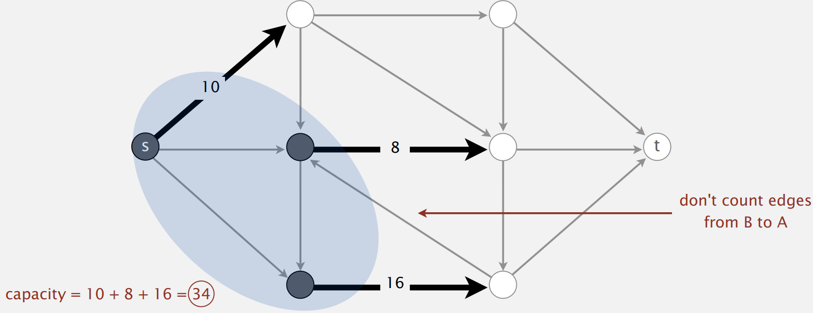
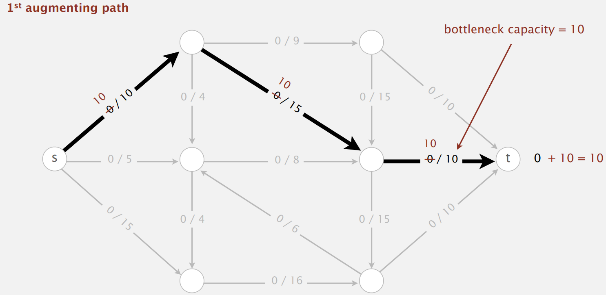
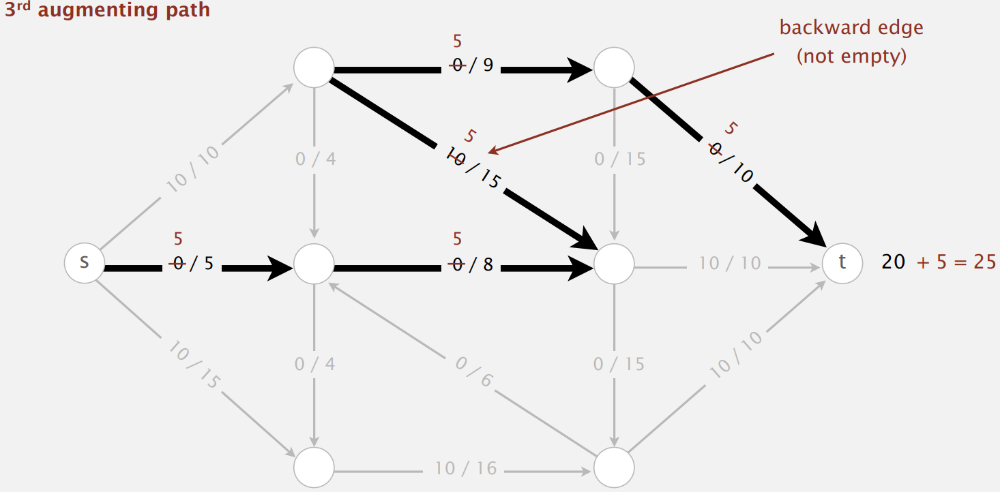

# Data Structures and Algorithms 3

## 18 Maximum Flow and Minimum Cut

### 18.1 Introduction

<p><format color = "BlueViolet">Definitions:</format> </p>

<p><format color = "DarkOrange"><math>st</math>-cut: </format> A 
<format color = "OrangeRed"><math>st</math>-cut (cut)</format> is a 
partition of the vertices into two disjoint sets, with <math>s
</math> in one set <math>A</math> and <math>t</math> in the other 
set <math>B</math>.</p>

<p><format color = "DarkOrange"><math>st</math>-cut capacity: </format> 
Its <format color = "OrangeRed">capacity</format> is the sum of the 
capacities of the edges from <math>A</math> to <math>B</math>.</p>

<note>
<p>Each edge has a positive capacity in edge-weighted digraph here.</p>
</note>



<p><format color = "BlueViolet">Minimum cut problem:</format> 
Find a cut of minimum capacity.</p>

<p><format color = "BlueViolet">Definitions:</format> </p>

<p><format color = "DarkOrange"><math>st</math>-flow:</format> An 
<format color = "OrangeRed"><math>st</math>-flow (flow)</format> is 
an assignment of values to the edges such that:</p>

<list type = "bullet">
<li>
<p>Capacity constraint: 0 ≤ edge's flow ≤ edge's capacity.</p>
</li>
<li>
<p>Local equilibrium: inflow = outflow at every vertex (except <math>s
</math> and <math>t</math>).</p>
</li>
</list>


<p><format color = "DarkOrange">Value of a flow:</format> 
The value of a flow is the inflow at <math>t</math> (assuming 
no edge points to <math>s</math> or from <math>t</math>.</p>

<p><format color = "BlueViolet">Maximum st-flow (maxflow) problem:
</format> Find a flow of maximum value.</p>

<warning>
<p>These two problems are dual!</p>
</warning>

### 18.2 Ford-Fulkerson Algorithm

<procedure title = "Ford-Fulkerson Algorithm">
<step>
    <p>Start with 0 flow.</p>
</step>
<step>
    <p>Find an undirected path from s to t such that: </p>
    <p>1. Can increase flow on forward edges (not full).</p>
    <p>2. Can decrease flow on backward edges (not empty).</p>
</step>
<step>
    <p>Terminates when all paths from s to t are blocked by either a
    full forward edge or an empty backward edge.</p>
</step>
</procedure>





### 18.3 Maxflow-Mincut Theorem

<p><format color = "BlueViolet">Definitions:</format> </p>

<p><format color = "OrangeRed">Net Flow: </format> The <format color = 
"OrangeRed">net flow across</format> a cut (<math>A</math>, <math>B
</math>) is the sum of the flows on its edges from <math>A</math> to 
<math>B</math> minus the sum of the flows on its edges from from 
<math>B</math> to <math>A</math>.</p>

<p><format color = "BlueViolet">Flow-value lemma:</format> Let <math>f
</math> be any flow and let (<math>A</math>, <math>B</math>) be any 
cut. Then, the net flow across (<math>A</math>, <math>B</math>) 
equals the value of <math>f</math>.</p>

## 19 Substring Search

### 19.1 Introduction

<list>
<li>
<p><format color = "BlueViolet">Goal</format>: Find pattern of length 
<math>M</math> in text of length <math>N</math> (typically 
<math>N</math> &gt;&gt; <math>M</math>).</p>
</li>
<li>
<p><format color = "BlueViolet">Applications</format>: Find & replace,
computer forensics, identify patterns indicative of spam, 
electronic surveillance, screen scraping, etc.</p>
</li>
</list>

### 19.2 Brute-Force Substring Search

* Theoretical challenge: Linear-time guarantee.
  (Worst case: <math>\sim MN</math>)
* Practical challenge: Avoid backup in text stream. (Brute-force
  algorithm needs backup for every mismatch)

Java

```Java
public static int search (String pat, String txt) {
    int M = pat.length();
    int N = txt.length();
    int i, j;
    for (i = 0; i <= N - M; i++) {
        for (j = 0; j < M; j++) {
            if (txt.charAt(i + j) != pat.charAt(j)) {
                break;
            }
        }
        if (j == M) {
            return i;
        }
    }
    return N;
}
```

Java (Alternate Implementation)

```Java
/**
 * Same sequence of char compares as previous implementation.
 * <p>
 * {@code i} points to end of sequence of already-matched chars
 * in text.
 * <p>
 * {@code j} stores number of already-matchedchars (end of
 * sequence in pattern).
 */
public static int search(String pat, String txt) {
    int i, M = pat.length();
    int j, N = txt.length();
    for (i = 0, j = 0; i < N && j < M; i++) {
        if (txt.charAt(i) == pat.charAt(j)) {
            j++;
        } 
        else {
            i -= j;
            j = 0;
        }
    }
    if (j == M) {
        return i - M;
    } 
    else {
        return N;
    }
}
```

C++

```C++
int bruteForceSubstringSearch(const std::string& text, const std::string& pattern) {
    int n = text.length();
    int m = pattern.length();

    for (int i = 0; i <= n - m; i++) {
        int j;
        for (j = 0; j < m; j++) {
            if (text[i + j] != pattern[j]) {
                break;
            }
        }
        if (j == m) {
            return i;  
        }
    }
    return -1; 
}
```

Python

```Python
def brute_force_search(main_string, sub_string):
    len_main = len(main_string)
    len_sub = len(sub_string)

    for i in range(len_main - len_sub + 1):
        j = 0

        while(j < len_sub):
            if (main_string[i + j] != sub_string[j]):
                break
            j += 1

        if (j == len_sub):
            return i

    return -1
```

### 19.3 Knuth-Morris-Pratt

#### 19.3.1 Proposition

* KMP substring search accesses no more than <math>M + N</math>
  chars to search for a pattern of length <math>M</math> in a text of
  length <math>N</math>.

> Proof: Each pattern char accessed once when constructing DFA;
> each text char accessed once (in the worst case) when simulating
> DFA.
>
{style = "tip"}

* KMP constructs `dfa[][]` in time and space proportional to <math>RM</math>,
  where <math>R</math> is the alphabet size and <math>M</math> is the pattern
  length.

> Improved version of KMP constructs `nfa[]` in time and space
> proportional to <math>M</math>.
>
{style = "tip"}

#### 19.3.2 DFA

Deterministic Finite State Automaton (DFA) is an abstract
string-search machine.

* Finite number of states (including start and halt).
* Exactly one transition for each char in alphabet.
* Accept if sequence of transitions lead to halt state.


DFA state = number of characters in pattern that have been matched (length
of longest prefix of `pat[]` that is a suffix of `txt[0...i]`).

To compute DFA: If in state <math>j</math> and next char `c != pat.charAt(j)`,
then the last <math>j - 1</math> characters of input are `pat[1...j - 1]`,
followed by `c`. Simulate `pat[1...j - 1]` on DFA and take transition c.

For each state <math>j</math> and char `c != pat.charAt(j)`, set `dfa[c][j] = dfa[c][X]`,
then update `X = dfa[pat.charAt(j)][X]`. X is the simulation of `pat[1...j - 1]` on DFA.

> This is the implementation using DFA.
>
{style = "note"}

Java (Princeton)

```Java
public class KMP {
    private final int R;       // the radix
    private final int m;       // length of pattern
    private final int[][] dfa;       // the KMP automaton

    /**
     * Preprocesses the pattern string.
     *
     * @param pat the pattern string
     */
    public KMP(String pat) {
        this.R = 256;
        this.m = pat.length();

        // build DFA from pattern
        dfa = new int[R][m];
        dfa[pat.charAt(0)][0] = 1;
        for (int x = 0, j = 1; j < m; j++) {
            for (int c = 0; c < R; c++)
                dfa[c][j] = dfa[c][x];     // Copy mismatch cases.
            dfa[pat.charAt(j)][j] = j+1;   // Set match case.
            x = dfa[pat.charAt(j)][x];     // Update restart state.
        }
    }

    /**
     * Preprocesses the pattern string.
     *
     * @param pattern the pattern string
     * @param R the alphabet size
     */
    public KMP(char[] pattern, int R) {
        this.R = R;
        this.m = pattern.length;

        // build DFA from pattern
        int m = pattern.length;
        dfa = new int[R][m];
        dfa[pattern[0]][0] = 1;
        for (int x = 0, j = 1; j < m; j++) {
            for (int c = 0; c < R; c++)
                dfa[c][j] = dfa[c][x];     // Copy mismatch cases.
            dfa[pattern[j]][j] = j+1;      // Set match case.
            x = dfa[pattern[j]][x];        // Update restart state.
        }
    }

    /**
     * Returns the index of the first occurrence of the pattern string
     * in the text string.
     *
     * @param  txt the text string
     * @return the index of the first occurrence of the pattern string
     *         in the text string; N if no such match
     */
    public int search(String txt) {

        // simulate operation of DFA on text
        int n = txt.length();
        int i, j;
        for (i = 0, j = 0; i < n && j < m; i++) {
            j = dfa[txt.charAt(i)][j];
        }
        if (j == m) return i - m;    // found
        return n;                    // not found
    }

    /**
     * Returns the index of the first occurrence of the pattern string
     * in the text string.
     *
     * @param  text the text string
     * @return the index of the first occurrence of the pattern string
     *         in the text string; N if no such match
     */
    public int search(char[] text) {

        // simulate operation of DFA on text
        int n = text.length;
        int i, j;
        for (i = 0, j = 0; i < n && j < m; i++) {
            j = dfa[text[i]][j];
        }
        if (j == m) return i - m;    // found
        return n;                    // not found
    }
}
```

C++

```C++
#include <vector>
#include <string>

class KMP {
private:
    int R;       // the radix
    int m;       // length of pattern
    std::vector<std::vector<int>> dfa;       // the KMP automaton

public:
    // Preprocesses the pattern string.
    KMP(std::string pat) {
        this->R = 256;
        this->m = pat.length();

        // build DFA from pattern
        dfa = std::vector<std::vector<int>>(R, std::vector<int>(m));
        dfa[pat[0]][0] = 1;
        for (int x = 0, j = 1; j < m; j++) {
            for (int c = 0; c < R; c++)
                dfa[c][j] = dfa[c][x];     // Copy mismatch cases.
            dfa[pat[j]][j] = j+1;   // Set match case.
            x = dfa[pat[j]][x];     // Update restart state.
        }
    }

    // Returns the index of the first occurrence of the pattern string
    // in the text string.
    int search(std::string txt) {

        // simulate operation of DFA on text
        int n = txt.length();
        int i, j;
        for (i = 0, j = 0; i < n && j < m; i++) {
            j = dfa[txt[i]][j];
        }
        if (j == m) return i - m;    // found
        return n;                    // not found
    }
};
```

Python

```Python
class KMP:
    def __init__(self, pat):
        self.R = 256  # the radix
        self.m = len(pat)  # length of pattern

        # build DFA from pattern
        self.dfa = [[0 for _ in range(self.m)] for _ in range(self.R)]
        self.dfa[ord(pat[0])][0] = 1
        x = 0
        for j in range(1, self.m):
            for c in range(self.R):
                self.dfa[c][j] = self.dfa[c][x]  # Copy mismatch cases.
            self.dfa[ord(pat[j])][j] = j + 1  # Set match case.
            x = self.dfa[ord(pat[j])][x]  # Update restart state.

    def search(self, txt):
        # simulate operation of DFA on text
        n = len(txt)
        i, j = 0, 0
        while i < n and j < self.m:
            j = self.dfa[ord(txt[i])][j]
            i += 1
        if j == self.m:
            return i - self.m  # found
        return n  # not found
```

#### 19.3.3 NFA

Example: A B A B A C

lps: 0 0 1 2 3 0

<p><format color = "BlueViolet">Explanantion for k = lps&#91;k - 1&#93; 
in computePrefix:</format> </p>

<list type = "bullet">
<li>
<p>When k reaches 3, q = 5, the position now is <math>C</math>.
The current prefix (also the suffix, without considering <math>C
</math>) is "ABA".</p>
<p><format color = "OrangeRed">ABA</format> BA</p>
<p>AB <format color = "OrangeRed">ABA</format></p>
</li>
<li>
<p>Since <em>C</em> is a mismatch for pattern&#91;3&#93; = <math>B
</math>, we need to first find the longest prefix in "ABA" that is 
also a suffix.</p>
<p><format color = "OrangeRed">ABA</format><format color = "Gold">B
</format> AC</p>
<p>AB <format color = "OrangeRed">ABA</format><format color = "Gold">C
</format></p>
</li>
<li>
<p>The longest prefix and suffix in <math>ABA</math> is <math>A</math>,
  which is given by lps&#91;q - 1&#93; = lps&#91;2&#93; = 1.</p>
</li>
<li>
<p>At this time, we need to try again if <math>C</math> is a match for
the character behind the pattern&#91;1&#93; = <math>B</math>,
which is not.</p>
<p><format color = "OrangeRed">A</format><format color = "Gold">B
</format> ABAC</p>
<p>ABAB <format color = "OrangeRed">A</format><format color = "Gold">C
</format></p>
</li>
<li>
<p>The longest prefix and suffix in "A" is "", k = 0, 
lps&#91;5&#93; = 0.</p>
</li>
</list>

> This is the implementation using NFA.
>
{style = "tip"}

Java

```Java
public class KMP {
    private int[] computeTemporaryArray(char pattern[]) {
        int[] lps = new int[pattern.length];
        int index = 0;
        for (int i = 1; i < pattern.length;) {
            if (pattern[i] == pattern[index]) {
                lps[i] = index + 1;
                index++;
                i++;
            } else {
                if (index != 0) {
                    index = lps[index - 1];
                } else {
                    lps[i] = 0;
                    i++;
                }
            }
        }
        return lps;
    }

    public boolean KMP(char text[], char pattern[]) {
        int lps[] = computeTemporaryArray(pattern);
        int i = 0;
        int j = 0;
        while (i < text.length && j < pattern.length) {
            if (text[i] == pattern[j]) {
                i++;
                j++;
            } else {
                if (j != 0) {
                    j = lps[j - 1];
                } else {
                    i++;
                }
            }
        }
        if (j == pattern.length) {
            return true;
        }
        return false;
    }
}
```

C++

```C++
#include <vector>
#include <string>

std::vector<int> computePrefixFunction(const std::string& pattern) {
    int m = pattern.length();
    std::vector<int> lps(m);
    lps[0] = 0;

    int k = 0; // Length of the longest prefix & suffix
    for (int q = 1; q < m; q++) { // q is the position 
        while (k > 0 && pattern[k] != pattern[q])
            k = lps[k-1];  

        if (pattern[k] == pattern[q])
            k++;

        lps[q] = k;
    }

    return lps;
}

std::vector<int> KMP(const std::string& text, const std::string& pattern) {
    int n = text.length();
    int m = pattern.length();
    std::vector<int> longestPrefix = computePrefixFunction(pattern);
    std::vector<int> occurrences;

    int q = 0;
    for (int i = 0; i < n; i++) {
        while (q > 0 && pattern[q] != text[i])
            q = longestPrefix[q-1];

        if (pattern[q] == text[i])
            q++;

        if (q == m) {
            occurrences.push_back(i - m + 1);
            q = longestPrefix[q-1];
        }
    }

    return occurrences;
}
```

Python

```Python
class KMP:
    def __init__(self, pattern):
        self.table = None
        self.pattern = pattern
        self.build_table()

    def build_table(self):
        self.table = [-1] + [0] * len(self.pattern)
        j = -1
        for i in range(len(self.pattern)):
            while j >= 0 and self.pattern[j] != self.pattern[i]:
                j = self.table[j]
            j += 1
            if i + 1 < len(self.pattern) and self.pattern[j] != self.pattern[i + 1]:
                self.table[i + 1] = j
            else:
                self.table[i + 1] = self.table[j]

    def search(self, text):
        i = j = 0
        while i < len(text):
            while j >= 0 and text[i] != self.pattern[j]:
                j = self.table[j]
            i += 1
            j += 1
            if j == len(self.pattern):
                return i - j
        return -1
```

## 19 Catalan Number

### 19.1 Properties and Formulas

<list type = "decimal">
<li>
    <code-block lang = "tex" style = "inline">
        C_n = \frac{1}{n+1} \binom{2n}{n} = \frac{(2n)!}{(n + 1)!n!} 
    </code-block>
</li>
<li>
    <code-block lang = "tex" style = "inline">
        C_n = \binom{2n}{n} - \binom{2n}{n+1}
    </code-block>
</li>
<li>
    <code-block lang = "tex" style = "inline">
        C_n = \sum_{i=0}^{n} C_{i-1} C_{n-i}
    </code-block>
</li>
<li>
    <code-block lang = "tex" style = "inline">
        C_n = \frac{2(2n-1)}{n+1} C_{n-1}
    </code-block>
</li>
</list>

### 19.2 Applications

<list type = "decimal">
<li>
<p>It is the number of expressions containing <math>n</math> pairs of
parentheses which are correctly matched.</p>
<p>For <math>n = 3</math>, for example:</p>
<p>((())), (()()), (())(), ()(()), ()()().</p>
</li>
<li>
<p>It is the number of different ways <math>n + 1</math> factors can be
completely parenthesized (or the number of ways of associating <math>n</math> 
applications of a binary operator, as in the matrix chain 
multiplication problem).</p>
<p>For <math>n = 3</math>, for example:</p>
<p>((ab)c)d, (a(bc))d, (ab)(cd), a((bc)d), a(b(cd)).</p>
</li>
<li>
<p>It is the number of full binary trees with <math>n + 1</math> leaves,
or, equivalently, with a total of <math>n</math> internal nodes.</p>
<note>
<p>A full binary tree is a tree in which every node has either
0 or 2 children. (International Definiton)</p>
</note>
<p>For <math>n = 3</math>, for example:</p>
</li>
<li>
<p>It is the number of structurally unique BSTs (binary search
trees) which has exactly <math>n</math> nodes of unique values
from 1 to <math>n</math>.</p>
<p>For <math>n = 3</math>, for example:</p>
</li>
<li>
<p>It is the number of Dyck words of length <math>2n</math>. A Dyck word is a
string consisting of <math>n</math> X's and <math>n</math> Y's
such that no initial segment of the string has more Y's than X's.</p>
<p>For example, Dyck words for <math>n = 3</math>:</p>
<p>XXXYYY     XYXXYY     XYXYXY     XXYYXY     XXYXYY</p>
</li>
<li>
<p>It is the number of monotonic lattice paths along the edges of a
grid with <math>n \times n</math> square cells, which do not pass
above the diagonal.</p>
<note>
<list>
<li>
<p>A monotonic path is one which starts in the lower left corner,
finishes in the upper right corner, and consists entirely of
edges pointing rightwards or upwards.</p>
</li>
<li>
<p>Counting such paths is equivalent to counting Dyck words:
X stands for &quot;move right&quot; and Y stands for &quot;move up&quot;.</p>
</li>
</list>
</note>
</li>
<li>
<p>A convex polygon with <math>n + 2</math> sides can be cut into
triangles by connecting vertices with non-crossing line segments
(a form of polygon triangulation). The number of triangles formed
is <math>n</math> and it is the number of different ways that this
can be achieved.</p>
</li>
</list>

### 19.3 Implementation

Java

```Java
public static BigInteger catalan(int n) {
    BigInteger res = BigInteger.ONE;

    for (int i = 0; i < n; i++) {
        res = res.multiply(BigInteger.valueOf(2L * n - i));
        res = res.divide(BigInteger.valueOf(i + 1));
    }

    return res.divide(BigInteger.valueOf(n + 1));
}
```

C++

```C++
unsigned long int binomialCoeff(unsigned int n, unsigned int k) {
    if (k > n) return 0;
    if (k == 0 || k == n) return 1;

    unsigned long int res = 1;
    for (int i = 0; i < k; i++) {
        res *= (n - i);
        res /= (i + 1);
    }

    return res;
}

unsigned long int catalan(unsigned int n) {
    unsigned long int c = binomialCoeff(2*n, n);
    return c/(n+1);
}
```

Python

```Python
import math


def catalan_number(n):
    return math.comb(2 * n, n) // (n + 1)
```