<show-structure for="chapter" depth="3"></show-structure>

# Part Ⅲ

<secondary-label ref="beta"></secondary-label>
<secondary-label ref="wip"></secondary-label>

## 16 Minimum Spanning Trees

### 16.1 Introduction to MSTs

<format color="DarkOrange">Spanning tree:</format> A <format 
color="OrangeRed">spanning tree</format> is a subgraph <math>T
</math> that is both a <format color="OrangeRed">tree</format> 
(connected and acyclic) and <format color="OrangeRed">spanning
</format> (includes all of the vertices).

<format color="BlueViolet">Application:</format>

<list type="bullet">
<li>
    
Dithering

</li>
<li>
    
Cluster analysis

</li>
<li>
    
Max bottleneck paths

</li>
<li>
    
Real-time face verification

</li>
<li>
    
LDPC codes for error correction

</li>
<li>
    
Image registration with Renyi entropy

</li>
<li>
    
Find road networks in satellite and aerial imagery

</li>
<li>
    
Reducing data storage in sequencing amino acids in a protein

</li>
<li>
    
Model locality of particle interactions in turbulent fluid flows
    

</li>
<li>
    
Autoconfig protocol for Ethernet bridging to avoid cycles in a 
    network

</li>
<li>
    
Approximation algorithms for NP-hard problems (e.g., TSP, Steiner 
    tree)

</li>
<li>
    
Network design (communication, electrical, hydraulic, computer, 
    road).

</li>
</list>

### 16.2 Greedy Algorithm

<format color="BlueViolet">Definitions</format>

<list type="bullet">
<li>
    
<format color="DarkOrange">Cut:</format> A cut in a graph is a 
    partition of its vertices into two (nonempty) sets.

</li>
<li>
    
<format color="DarkOrange">Crossing edge:</format> A crossing 
    edge connects a vertex in one set with a vertex in the other.

</li>
</list>

<procedure title="Greedy Algorithm for MST">
<step>
    
Start with all edges colored gray.

</step>
<step>
    
Find cut with no black crossing edges; color its 
    min-weight edge black.

</step>
<step>
    
Repeat until <math>V - 1</math> edges are colored black.

</step>
</procedure>

<format color="BlueViolet">Correctness Proof</format> 

<list type="decimal">
<li>
    
Given any cut, the crossing edge of min weight is in MST.

    
<format color="LawnGreen">Proof</format>

    
Suppose min-weight crossing edge <math>e</math> is not in the 
    MST.

    <list type="bullet">
    <li>
    
Adding <math>e</math> to the MST creates a cycle.

    </li>
    <li>
    
Some other edge <math>f</math> in cycle must be a crossing 
    edge.

    </li>
    <li>
    
Removing <math>f</math> and adding <math>e</math> is also a
    spanning edge.

    </li>
    <li>
    
Since weight of <math>e</math> is less than the weight of 
    <math>f</math>, that spanning tree is lower height.

    </li>
    <li>
    
Contradiction.

    </li>
    </list>

</li>
<li>

The greedy algorithm computes the MST.

<format color="MediumVioletRed">Proof</format>

    <list type="bullet"> 
    <li>
    
Any edge colored black is in the MST (via cut property).

    </li>
    <li>
    
Fewer than <math>V - 1</math> black edges => cut with no 
    black crossing edges. (consider cut whose vertices are one 
    connected component)

    </li>
    </list>
</li>
</list>

<warning>

The proof above is under the simplifying assumptions below: 

<list type="bullet">
<li>
    
Edge weights are distinct.

</li>
<li>
    
Graph is connected.

</li>
</list>
</warning>

### 16.3 Edge-weighted Graph Implementation

<format color="BlueViolet">Edge</format>

<tabs>
    <tab title="Java">
    <code-block lang="java" collapsible="true">
public class Edge implements Comparable&lt;Edge&gt; {
    private final int source;
    private final int destination;
    private final double weight;
\/
    public Edge(int source, int destination, double weight) {
        this.source = source;
        this.destination = destination;
        this.weight = weight;
    }
\/
    public int getEitherVertex() {
        return source;
    }
\/
    public int getOtherVertex(int vertex) {
        if (vertex == source) {
            return destination;
        } else if (vertex == destination) {
            return source;
        } else {
            throw new IllegalArgumentException("Invalid vertex");
        }
    }
\/
    public double getWeight() {
        return weight;
    }
\/
    @Override
    public String toString() {
        return "(" + source + " - " + destination + " : " + weight + ")";
    }
\/
    @Override
    public int compareTo(Edge other) {
        return Double.compare(this.weight, other.weight);
    }
}
    </code-block>
    </tab>
    <tab title="C++ (Edge.h)">
    <code-block lang="c++" collapsible="true">
#ifndef EDGE_H
#define EDGE_H
\/
#include &lt;string&gt;
\/
class Edge {
private:
    int source;
    int destination;
    double weight;
\/
public:
    Edge(int source, int destination, double weight);
    [[nodiscard]] int getEitherVertex() const;
    [[nodiscard]] int getOtherVertex(int vertex) const;
    [[nodiscard]] double getWeight() const;
    bool operator&lt;(const Edge& other) const;
    [[nodiscard]] std::string toString() const;
};
\/
#endif // EDGE_H
    </code-block>
    </tab>
    <tab title="C++ (Edge.cpp)">
    <code-block lang="c++" collapsible="true">
#include "Edge.h"
#include &lt;stdexcept&gt;
#include &lt;sstream&gt;
#include &lt;iomanip&gt;
\/
Edge::Edge(const int source, const int destination, const double weight)
    : source(source), destination(destination), weight(weight) {}
\/
int Edge::getEitherVertex() const {
    return source;
}
\/
int Edge::getOtherVertex(const int vertex) const {
    if (vertex == source) {
        return destination;
    } else if (vertex == destination) {
        return source;
    } else {
        throw std::invalid_argument("Invalid vertex");
    }
}
\/
double Edge::getWeight() const {
    return weight;
}
\/
bool Edge::operator&lt;(const Edge& other) const {
    return weight &lt; other.weight;
}
\/
std::string Edge::toString() const {
    std::ostringstream oss;
    oss &lt;&lt; "(" &lt;&lt; source &lt;&lt; " - " &lt;&lt; destination &lt;&lt; " : " &lt;&lt; std::fixed &lt;&lt; std::setprecision(2) &lt;&lt; weight &lt;&lt; ")";
    return oss.str();
}
    </code-block>
    </tab>
    <tab title="Python">
    <code-block lang="python" collapsible="true">
class Edge:
    def __init__(self, source: int, destination: int, weight: float):
        self.source = source
        self.destination = destination
        self.weight = weight
\/
    def get_either_vertex(self) -&gt; int:
        return self.source
\/
    def get_other_vertex(self, vertex: int) -&gt; int:
        if vertex == self.source:
            return self.destination
        elif vertex == self.destination:
            return self.source
        else:
            raise ValueError("Invalid vertex")
\/
    def get_weight(self) -&gt; float:
        return self.weight
\/
    def __str__(self) -&gt; str:
        return f"({self.source} - {self.destination} : {self.weight})"
\/
    def __lt__(self, other: 'Edge') -&gt; bool:
        return self.weight &lt; other.weight
    </code-block>
    </tab>
</tabs>

<format color="BlueViolet">Edge-weighted Graph</format>

<tabs>
    <tab title="Java">
    <code-block lang="java" collapsible="true">
import java.util.ArrayList;
import java.util.List;
\/
public class EdgeWeightedGraph {
    private final int vertices;
    private final List&lt;Edge&gt;[] adjacencyList;
\/
    public EdgeWeightedGraph(int vertices) {
        this.vertices = vertices;
        this.adjacencyList = new ArrayList[vertices];
        for (int i = 0; i &lt; vertices; i++) {
            adjacencyList[i] = new ArrayList&lt;&gt;();
        }
    }
\/
    public void addEdge(int source, int destination, double weight) {
        adjacencyList[source].add(new Edge(source, destination, weight));
        adjacencyList[destination].add(new Edge(destination, source, weight));
    }
\/
    public int getVertices() {
        return vertices;
    }
\/
    public List&lt;Edge&gt; getAdjacencyList(int vertex) {
        return adjacencyList[vertex];
    }
\/
    public void printGraph() {
        for (int i = 0; i &lt; vertices; i++) {
            List&lt;Edge&gt; edges = adjacencyList[i];
            System.out.print("Vertex " + i + ":");
            for (Edge edge : edges) {
                System.out.print(" " + edge);
            }
            System.out.println();
        }
    }
}
    </code-block>
    </tab>
    <tab title="C++ (EdgeWeightedGraph.h)">
    <code-block lang="c++" collapsible="true">
#ifndef EDGEWEIGHTEDGRAPH_H
#define EDGEWEIGHTEDGRAPH_H
\/
#include &lt;vector7gt;
#include "Edge.h"
\/
class EdgeWeightedGraph {
private:
    int vertices;
    std::vector&lt;std::vector&lt;Edge&gt;&gt; adjacencyList;
\/
public:
    explicit EdgeWeightedGraph(int vertices);
    void addEdge(int source, int destination, double weight);
    [[nodiscard]] int getVertices() const;
    [[nodiscard]] const std::vector&lt;Edge&gt;& getAdjacencyList(int vertex) const;
    void printGraph() const;
};
\/
#endif // EDGEWEIGHTEDGRAPH_H
    </code-block>
    </tab>
    <tab title="C++ (EdgeWeightedGraph.cpp)">
    <code-block lang="c++" collapsible="true">
#include "EdgeWeightedGraph.h"
#include &lt;iostream&gt;
\/
EdgeWeightedGraph::EdgeWeightedGraph(const int vertices)
    : vertices(vertices), adjacencyList(vertices) {}
\/
void EdgeWeightedGraph::addEdge(const int source, const int destination, const double weight) {
    const Edge edge(source, destination, weight);
    adjacencyList[source].push_back(edge);
    adjacencyList[destination].emplace_back(destination, source, weight);
}
\/
int EdgeWeightedGraph::getVertices() const {
    return vertices;
}
\/
const std::vector&lt;Edge&gt;& EdgeWeightedGraph::getAdjacencyList(int vertex) const {
    return adjacencyList[vertex];
}
\/
void EdgeWeightedGraph::printGraph() const {
    for (int i = 0; i &lt; vertices; ++i) {
        const std::vector&lt;Edge&gt;& edges = adjacencyList[i];
        std::cout &lt;&lt; "Vertex " &lt;&lt; i &lt;&lt; ":";
        for (const Edge& edge : edges) {
            std::cout &lt;&lt; " " &lt;&lt; edge.toString();
        }
        std::cout &lt;&lt; std::endl;
    }
}
    </code-block>
    </tab>
    <tab title="Python">
    <code-block lang="python" collapsible="true">
from Edge import Edge
\/
\/
class EdgeWeightedGraph:
    def __init__(self, vertices: int):
        self.vertices = vertices
        self.adjacency_list: list[list[Edge]] = [[] for _ in range(vertices)]
\/
    def add_edge(self, source: int, destination: int, weight: float):
        self.adjacency_list[source].append(Edge(source, destination, weight))
        self.adjacency_list[destination].append(Edge(destination, source, weight))
\/
    def get_vertices(self) -&gt; int:
        return self.vertices
\/
    def get_adjacency_list(self, vertex: int) -&gt; list[Edge]:
        return self.adjacency_list[vertex]
\/
    def print_graph(self):
        for i in range(self.vertices):
            print(f"Vertex {i}:", end="")
            for edge in self.adjacency_list[i]:
                print(f" {edge}", end="")
            print()
    </code-block>
    </tab>
</tabs>

### 16.4 Kruskal's Algorithm

<procedure title = "Kruskal's Algorithm">
    <step>
        
Consider edges in ascending order of weight.

    </step>
    <step>
        
Add next edge to tree <math>T</math> unless doing so 
        would create a cycle.

    </step>
</procedure>

<procedure title = "Union-Find for Cycle Challenge" type="choices">
    <step>
        
Maintain a set for each connected component in <math>T
        </math>

    </step>
    <step>
        
If <math>v</math> and <math>w</math> are in same set, 
        then adding <math>v-w</math> would create a cycle.

    </step>
    <step>
        
To add <math>v-w</math> to <math>T</math>, merge sets 
        containing <math>v</math> and <math>w</math>.

    </step>
</procedure>

<format color="BlueViolet">Correctness Proof</format>

Kruskal's Algorithm is a special case of the greedy MST algorithm.

<list type="bullet">
<li>

Suppose Kruskal's algorithm colors the edge <math>e = v–w</math> 
black.

</li>
<li>

Cut = set of vertices connected to <math>v</math> in tree <math>
T</math>.

</li>
<li>

No crossing edge is black.

</li>
<li>

No crossing edge has lower weight.

</li>
</list>

<format color="BlueViolet">Property:</format> Kruskal's algorithm 
computes MST in time proportional to <math>E \log E</math> (in the 
worst case).

<format color="LawnGreen">Proof</format>

<table style="header-row">
<tr>
    <td>Operation</td>
    <td>Frequency</td>
    <td>Time per op</td>
</tr>
<tr>
    <td>Build pq</td>
    <td><math>1</math></td>
    <td><math>E \log E</math></td>
</tr>
<tr>
    <td>Delete-min</td>
    <td><math>E</math></td>
    <td><math>\log E</math></td>
</tr>
<tr>
    <td>Build pq</td>
    <td><math>V</math></td>
    <td><math>\log* V</math></td>
</tr>
<tr>
    <td>Connected</td>
    <td><math>E</math></td>
    <td><math>\log* E</math></td>
</tr>
</table>

<note>

If edges are already sorted, order of growth is <math>E \log* V
</math>.

</note>

<tabs>
    <tab title="Java">
    <code-block lang="java" collapsible="true">
import java.util.ArrayList;
import java.util.List;
import java.util.PriorityQueue;
\/
public class KruskalsAlgorithm {
    public static List&lt;Edge&gt; findMinimumSpanningTree(EdgeWeightedGraph graph) {
        int vertices = graph.getVertices();
        List&lt;Edge&gt; minimumSpanningTree = new ArrayList&lt;&gt;();
        PriorityQueue&lt;Edge&gt; minHeap = new PriorityQueue&lt;&gt;(graph.getVertices());
        UnionFind unionFind = new UnionFind(vertices);
\/
        for (int i = 0; i &lt; vertices; i++) {
            for (Edge edge : graph.getAdjacencyList(i)) {
                if (edge.getEitherVertex() &lt; i) {
                    minHeap.offer(edge);
                }
            }
        }
\/        
        while (!minHeap.isEmpty() && minimumSpanningTree.size() &lt; vertices - 1) {
            Edge edge = minHeap.poll();
            int source = edge.getEitherVertex();
            int destination = edge.getOtherVertex(source);
\/
            int sourceRoot = unionFind.find(source);
            int destinationRoot = unionFind.find(destination);
\/
            if (sourceRoot != destinationRoot) {
                minimumSpanningTree.add(edge);
                unionFind.union(sourceRoot, destinationRoot);
            }
        }
\/
        return minimumSpanningTree;
    }
}
    </code-block>
    </tab>
    <tab title="C++">
    <code-block lang="c++" collapsible="true">
#include "EdgeWeightedGraph.h"
#include &lt;queue&gt;
#include &lt;vector&gt;
\/
class UnionFind {
    public:
        explicit UnionFind(int size);
        int find(int element);
        void unionSets(int element1, int element2);
\/
    private:
        std::vector&lt;int&gt; parent;
        std::vector&lt;int&gt; rank;
};
\/
std::vector&lt;Edge&gt; findMinimumSpanningTree(const EdgeWeightedGraph& graph) {
    const int vertices = graph.getVertices();
    std::vector&lt;Edge&gt; minimumSpanningTree;
    std::priority_queue&lt;Edge, std::vector&lt;Edge&gt;, std::greater&lt;&gt;&gt; minHeap;
    UnionFind unionFind(vertices);
\/
    for (int i = 0; i &lt; vertices; ++i) {
        for (const Edge& edge : graph.getAdjacencyList(i)) {
            minHeap.push(edge);
        }
    }
\/
    // Build the minimum spanning tree
    while (!minHeap.empty() && minimumSpanningTree.size() &lt; vertices - 1) {
        Edge edge = minHeap.top();
        minHeap.pop();
        const int source = edge.getEitherVertex();
        int destination = edge.getOtherVertex(source);
\/
        // **Corrected Condition:** Check if connecting these vertices creates a cycle
        if (unionFind.find(source) != unionFind.find(destination)) {
            minimumSpanningTree.push_back(edge);
            unionFind.unionSets(source, destination);
        }
    }
\/
    return minimumSpanningTree;
}
\/
UnionFind::UnionFind(const int size) : parent(size), rank(size, 1) {
    for (int i = 0; i &lt; size; ++i) {
        parent[i] = i;
    }
}
\/
int UnionFind::find(const int element) {
    if (parent[element] != element) {
        parent[element] = find(parent[element]);
    }
    return parent[element];
}
\/
void UnionFind::unionSets(const int element1, const int element2) {
    const int root1 = find(element1);
    const int root2 = find(element2);
\/
    if (root1 != root2) {
        if (rank[root1] &gt; rank[root2]) {
            parent[root2] = root1;
        } else if (rank[root1] &lt; rank[root2]) {
            parent[root1] = root2;
        } else {
            parent[root2] = root1;
            rank[root1]++;
        }
    }
}
    </code-block>
    </tab>
    <tab title="Python">
    <code-block lang="python" collapsible="true">
from typing import List
import heapq
\/
from EdgeWeightedGraph import EdgeWeightedGraph, Edge
\/
\/
class KruskalsAlgorithm:
    @staticmethod
    def find_minimum_spanning_tree(graph: EdgeWeightedGraph) -&gt; List[Edge]:
        vertices: int = graph.get_vertices()
        minimum_spanning_tree: List[Edge] = []
        min_heap: list[Edge] = []
        union_find = UnionFind(vertices)
\/
        # Add edges to the min-heap, ensuring no duplicates
        for i in range(vertices):
            for edge in graph.get_adjacency_list(i):
                # Add edge only if its source vertex is smaller than its destination
                if edge.source &lt; edge.destination:
                    heapq.heappush(min_heap, edge)
\/
        while min_heap and len(minimum_spanning_tree) &lt; vertices - 1:
            edge: Edge = heapq.heappop(min_heap)
            source: int = edge.get_either_vertex()
            destination: int = edge.get_other_vertex(source)
\/
            source_root: int = union_find.find(source)
            destination_root: int = union_find.find(destination)
\/
            if source_root != destination_root:
                minimum_spanning_tree.append(edge)
                union_find.union(source_root, destination_root)
\/
        return minimum_spanning_tree
\/
\/
class UnionFind:
    def __init__(self, size: int):
        self.parent: List[int] = [i for i in range(size)]
        self.rank: List[int] = [1] * size
\/
    def find(self, element: int) -&gt; int:
        if self.parent[element] != element:
            self.parent[element] = self.find(self.parent[element])
        return self.parent[element]
\/
    def union(self, element1: int, element2: int):
        root1: int = self.find(element1)
        root2: int = self.find(element2)
\/
        if root1 != root2:
            if self.rank[root1] &gt; self.rank[root2]:
                self.parent[root2] = root1
            elif self.rank[root1] &lt; self.rank[root2]:
                self.parent[root1] = root2
            else:
                self.parent[root2] = root1
                self.rank[root1] += 1
    </code-block>
    </tab>
</tabs>

### 16.5 Prim's Algorithm

<procedure title = "Prim's Algorithm">
    <step>
        
Start with vertex <math>0</math> and greedily grow tree 
        <math>T</math>

    </step>
    <step>
        
Add to <math>T</math> the min weight edge with exactly one 
        endpoint in <math>T</math>.

    </step>
    <step>
        
Repeat until <math>V - 1</math> edges.

    </step>
</procedure>

<format color="BlueViolet">Correctness Proof</format>

Prim's Algorithm is a special case of the greedy MST algorithm.

<list>
<li>

Suppose edge e = min weight edge connecting a vertex on the tree
to a vertex not on the tree.

</li>
<li>

Cut = set of vertices connected on tree.

</li>
<li>

No crossing edge is black.

</li>
<li>

No crossing edge has lower weight.

</li>
</list>

#### 16.5.1 Lazy Implementation

<procedure title = "Lazy Implementation">
    <step>
        
Maintain a PQ of <format color="OrangeRed">edges
        </format> with (at least) one endpoint in T.

    </step>
    <step>
        
Key = edge; priority = weight of edge.

    </step>
    <step>
        
Delete-min to determine next edge <math>e = v-w</math> to
        add to <math>T</math>.

    </step>
    <step>
        
Disregard if both endpoints <math>v</math> and <math>w
        </math> are in <math>T</math>.

    </step>
    <step>
        
Otherwise, let <math>w</math> be the vertex not in <math>T
        </math>.

        
Add to PQ any edge incident to <math>w</math> (assuming 
        other endpoint not in T)

        
Add <math>e</math> to <math>T</math> and mark <math>w
        </math>.

    </step>
</procedure>

<format color="BlueViolet">Property:</format> Lazy Prim's 
algorithm computes the MST in time proportional to <math>E \log E
</math> and extra space proportional to <math>E</math> (in the worst
case).

<table style="header-row">
<tr>
    <td>Operation</td>
    <td>Frequency</td>
    <td>Binary Heap</td>
</tr>
<tr>
    <td>Delete min</td>
    <td><math>E</math></td>
    <td><math>\log E</math></td>
</tr>
<tr>
    <td>Insert</td>
    <td><math>E</math></td>
    <td><math>\log E</math></td>
</tr>
</table>

<tabs>
    <tab title="Java">
    <code-block lang="java" collapsible="true">
import java.util.ArrayList;
import java.util.List;
import java.util.PriorityQueue;
\/
public class PrimMSTLazy {
    private final boolean[] marked; 
    private final PriorityQueue&lt;Edge&gt; pq; 
    private final List&lt;Edge&gt; mst; 
    private double weight; 
\/
    public PrimMSTLazy(EdgeWeightedGraph graph) {
        marked = new boolean[graph.getVertices()];
        pq = new PriorityQueue&lt;&gt;();
        mst = new ArrayList&lt;&gt;();
        weight = 0.0;
\/        
        visit(graph, 0);
        while (!pq.isEmpty()) {
            Edge e = pq.poll(); 
\/
            int v = e.getEitherVertex();
            int w = e.getOtherVertex(v);
\/
            if (marked[v] && marked[w]) continue; 
            mst.add(e); 
            weight += e.getWeight();
\/
            if (!marked[v]) visit(graph, v); 
            if (!marked[w]) visit(graph, w); 
        }
    }
\/
    private void visit(EdgeWeightedGraph graph, int v) {
        marked[v] = true; 
\/
        for (Edge e : graph.getAdjacencyList(v)) {
            if (!marked[e.getOtherVertex(v)]) {
                pq.offer(e);
            }
        }
    }
\/
    public Iterable&lt;Edge&gt; edges() {
        return mst;
    }
\/
    public double weight() {
        return weight;
    }
}
    </code-block>
    </tab>
    <tab title="C++">
    <code-block lang="c++" collapsible="true">
#include &lt;iostream&gt;
#include &lt;vector&gt;
#include &lt;queue&gt;
#include "EdgeWeightedGraph.h"
\/
class PrimMSTLazy {
private:
    std::vector&lt;bool&gt; marked;
    std::priority_queue&lt;Edge, std::vector&lt;Edge&gt;, std::greater&lt;&gt;&gt; pq;
    std::vector&lt;Edge&gt; mst;
    double weight;
\/
    void visit(const EdgeWeightedGraph& graph, int v) {
        marked[v] = true;
        for (const Edge& e : graph.getAdjacencyList(v)) {
            if (!marked[e.getOtherVertex(v)]) {
                pq.push(e);
            }
        }
    }
\/
public:
    explicit PrimMSTLazy(const EdgeWeightedGraph& graph) : 
        marked(graph.getVertices(), false), weight(0.0)  {
\/
        visit(graph, 0); 
        while (!pq.empty()) {
            Edge e = pq.top();
            pq.pop();
\/
            int v = e.getEitherVertex();
            int w = e.getOtherVertex(v);
\/
            if (marked[v] && marked[w]) continue; 
            mst.push_back(e);
            weight += e.getWeight();
\/
            if (!marked[v]) visit(graph, v);
            if (!marked[w]) visit(graph, w);
        }
    }
\/
    [[nodiscard]] const std::vector&lt;Edge&gt;& edges() const {
        return mst;
    }
\/
    [[nodiscard]] double getWeight() const {
        return weight;
    }
};
    </code-block>
    </tab>
    <tab title="Python">
    <code-block lang="python" collapsible="true">
from typing import List, Iterable
import heapq  
\/
from EdgeWeightedGraph import EdgeWeightedGraph, Edge
\/
\/
class PrimMSTLazy:
    def __init__(self, graph: EdgeWeightedGraph):
        self.marked: List[bool] = [False] * graph.get_vertices()
        self.pq: List[Edge] = []  # Min-heap for edges
        self.mst: List[Edge] = []  # Stores the MST edges
        self.weight: float = 0.0
\/
        self._visit(graph, 0)  # Start from vertex 0
        while self.pq:
            edge: Edge = heapq.heappop(self.pq)
\/
            v: int = edge.get_either_vertex()
            w: int = edge.get_other_vertex(v)
\/
            if self.marked[v] and self.marked[w]:
                continue  # Ignore if both vertices are already in the MST
\/
            self.mst.append(edge)
            self.weight += edge.get_weight()
\/
            if not self.marked[v]:
                self._visit(graph, v)
            if not self.marked[w]:
                self._visit(graph, w)
\/
    def _visit(self, graph: EdgeWeightedGraph, v: int):
        """Adds edges connected to vertex v to the priority queue."""
        self.marked[v] = True
        for edge in graph.get_adjacency_list(v):
            if not self.marked[edge.get_other_vertex(v)]:
                heapq.heappush(self.pq, edge)
\/
    def edges(self) -&gt; Iterable[Edge]:
        return self.mst
\/
    def weight(self) -&gt; float:
        return self.weight
    </code-block>
    </tab>
</tabs>

#### 16.5.2 Eager Implementation

<format color="BlueViolet">Property</format>

Running time depends on PQ implementation: <math>V</math> insert, 
<math>V</math> delete-min, <math>E</math> decrease-key.

<table style="header-row">
<tr>
    <td>PQ Implementation</td>
    <td>Insert</td>
    <td>Delete-Min</td>
    <td>Decrease-Key</td>
    <td>Total</td>
</tr>
<tr>
    <td>Array</td>
    <td><math>1</math></td>
    <td><math>V</math></td>
    <td><math>1</math></td>
    <td><math>V ^ {2}</math></td>
</tr>
<tr>
    <td>Binary Heap</td>
    <td><math>\log V</math></td>
    <td><math>\log V</math></td>
    <td><math>\log V</math></td>
    <td><math>E \log V</math></td>
</tr>
<tr>
    <td>
d-way Heap

(Johnson 1975)
</td>
    <td><math>\log_{d} V</math></td>
    <td><math>d \log_{d} V</math></td>
    <td><math>\log_{d} V</math></td>
    <td><math>E \log_{\frac {E}{V}} V</math></td>
</tr>
<tr>
    <td>
Fibonacci Heap

(Fredman-Tarjan 1984)
</td>
    <td><math>1^{*}</math></td><td><math>\log V ^ {*}</math></td>
    <td><math>1^{*}</math></td><td><math>E + \log V</math></td>
</tr>
</table>

*: amortized

<format color="BlueViolet">Bottom Line</format>

<list type="bullet">
<li>
    
Array implementation optimal for dense graph.

</li>
<li>
    
Binary heap much faster for sparse graphs.

</li>
<li>
    
4-way heap worth the trouble in performance-critical 
    situations.

</li>
<li>
    
Fibonacci heap best in theory, but not worth implementing.

</li>
</list>

<tabs>
    <tab title="Java">
    <code-block lang="java" collapsible="true">
import java.util.ArrayList;
import java.util.List;
\/
public class PrimMST {
    private final boolean[] marked;
    private final Edge[] edgeTo;
    private final double[] distTo; 
    private final IndexedPriorityQueue pq; 
    private final List&lt;Edge&gt; mst; 
\/
    public PrimMST(EdgeWeightedGraph graph) {
        marked = new boolean[graph.getVertices()];
        edgeTo = new Edge[graph.getVertices()];
        distTo = new double[graph.getVertices()];
        pq = new IndexedPriorityQueue(graph.getVertices());
        mst = new ArrayList&lt;&gt;();
\/
        for (int v = 0; v &lt; graph.getVertices(); v++) {
            distTo[v] = Double.POSITIVE_INFINITY;
        }
        distTo[0] = 0.0;
        pq.insert(0, 0.0);
        while (!pq.isEmpty()) {
            visit(graph, pq.delMin());
        }
    }
\/    
    private void visit(EdgeWeightedGraph graph, int vertex) {
        marked[vertex] = true;
        for (Edge edge : graph.getAdjacencyList(vertex)) {
            int w = edge.getOtherVertex(vertex);
            if (marked[w]) continue;
            if (edge.getWeight() &lt; distTo[w]) {
                edgeTo[w] = edge;
                distTo[w] = edge.getWeight();
                if (pq.contains(w)) {
                    pq.decreaseKey(w, distTo[w]);
                } else {
                    pq.insert(w, distTo[w]);
                }
            }
        }
    }
\/
    public Iterable&lt;Edge&gt; edges() {
        for (int v = 1; v &lt; edgeTo.length; v++) {
            if (edgeTo[v] != null) {
                mst.add(edgeTo[v]);
            }
        }
        return mst;
    }
\/
    public double weight() {
        double weight = 0.0;
        for (Edge edge : mst) {
            weight += edge.getWeight();
        }
        return weight;
    }
}
    </code-block>
    </tab>
    <tab title="C++">
    <code-block lang="c++" collapsible="true">
#include "IndexedPriorityQueue.h"
#include "EdgeWeightedGraph.h"
#include &lt;vector&gt;
#include &lt;limits&gt;
\/
class PrimMST {
private:
    std::vector&lt;bool&gt; marked;
    std::vector&lt;Edge&gt; edgeTo;
    std::vector&lt;double&gt; distTo;
    IndexedPriorityQueue pq;
    std::vector&lt;Edge&gt; mst;
\/    
    void visit(const EdgeWeightedGraph& graph, int vertex) {
        marked[vertex] = true;
        for (const Edge& edge : graph.getAdjacencyList(vertex)) {
            const int w = edge.getOtherVertex(vertex);
            if (marked[w]) continue;
            if (edge.getWeight() &lt; distTo[w]) {
                edgeTo[w] = edge;
                distTo[w] = edge.getWeight();
                if (pq.contains(w)) {
                    pq.decreaseKey(w, distTo[w]);
                } else {
                    pq.insert(w, distTo[w]);
                }
            }
        }
    }
\/
public:
    explicit PrimMST(const EdgeWeightedGraph& graph) :
        marked(graph.getVertices(), false),
        edgeTo(graph.getVertices()),
        distTo(graph.getVertices(), std::numeric_limits&lt;double&gt;::infinity()),
        pq(graph.getVertices()) {
\/
        distTo[0] = 0.0;
        pq.insert(0, 0.0);
        while (!pq.isEmpty()) {
            visit(graph, pq.delMin());
        }
    }
\/
    const std::vector&lt;Edge&gt;& edges() {
        mst.clear();
        for (int v = 1; v &lt; edgeTo.size(); v++) {
            if (edgeTo[v].getWeight() != 0.0) {
                mst.push_back(edgeTo[v]);
            }
        }
        return mst;
    }
\/
    [[nodiscard]] double weight() const {
        double weight = 0.0;
        for (const Edge& edge : mst) {
            weight += edge.getWeight();
        }
        return weight;
    }
};
    </code-block>
    </tab>
    <tab title="Python">
    <code-block lang="python" collapsible="true">
from typing import List, Iterable
\/
from EdgeWeightedGraph import EdgeWeightedGraph, Edge
from IndexedPriorityQueue import IndexedPriorityQueue 
\/
\/
class PrimMSTEager:
    def __init__(self, graph: EdgeWeightedGraph):
        self.marked: List[bool] = [False] * graph.get_vertices()
        self.edge_to: List[Edge] = [None] * graph.get_vertices()
        self.dist_to: List[float] = [float('inf')] * graph.get_vertices()
        self.pq: IndexedPriorityQueue = IndexedPriorityQueue(graph.get_vertices())
        self.mst: List[Edge] = []
\/
        self.dist_to[0] = 0.0  
        self.pq.insert(0, 0.0)
\/
        while not self.pq.is_empty():
            self._visit(graph, self.pq.del_min())
\/
    def _visit(self, graph: EdgeWeightedGraph, vertex: int):
        self.marked[vertex] = True
        for edge in graph.get_adjacency_list(vertex):
            w: int = edge.get_other_vertex(vertex)
            if self.marked[w]:
                continue
\/
            if edge.get_weight() &lt; self.dist_to[w]:
                self.dist_to[w] = edge.get_weight()
                self.edge_to[w] = edge
                if self.pq.contains(w):
                    self.pq.decrease_key(w, self.dist_to[w])
                else:
                    self.pq.insert(w, self.dist_to[w])
\/
    def edges(self) -&gt; Iterable[Edge]:
        """Returns an iterable of edges in the MST."""
        for v in range(1, len(self.edge_to)):
            if self.edge_to[v] is not None:
                self.mst.append(self.edge_to[v])
        return self.mst
\/
    def weight(self) -&gt; float:
        """Returns the total weight of the MST."""
        return sum(edge.get_weight() for edge in self.mst)
    </code-block>
    </tab>
</tabs>

### 16.6 MST Context

#### 16.6.1 Euclidean MST

<format color="OrangeRed">Euclidean MST:</format> Given <math>N
</math> points in the plane, find MST connecting them, where the
distances between point pairs are their <format color=
"OrangeRed">Euclidean</format> distances.

<format color="LawnGreen">Methods:</format> Exploit geometry
and do it in <math>\sim cN \log N</math>

#### 16.6.2 Single Link Clustering

<format color="BlueViolet">Definitions</format>

<list type="bullet">
<li>
    
<format color="DarkOrange">k-clustering:</format> Divide
    a set of objects calssify into <math>k</math> coherent groups.

</li>
<li>
    
<format color="DarkOrange">Distance Function:</format> 
    Numeric value specifying "closeness" of two objects.

</li>
<li>
    
<format color="DarkOrange">Single link:</format> Distance 
    between two clusters equals the distance between the two closest
    objects (one in each cluster).

</li>
<li>
    
<format color="DarkOrange">Single-link clustering:</format> 
    Given an integer k, find a k-clustering that maximizes the 
    distance between two closest clusters.

</li>
</list>

<procedure title = '"Well-known" algorithm in science literature for single-link clustering:'>
    <step>
        
Form <math>V</math> clusters of one object each.

    </step>
    <step>
        
Find the closest pair of objects such that each object is 
        in a different cluster, and merge the two clusters.

    </step>
    <step>
        
Repeat until there are exactly <math>k</math> clusters.

    </step>
</procedure>

<note>

This is Kruskal's algorithm (stop when <math>k</math> connected 
components).

Run Prim's algorithm and delete <math>k–1</math> max weight edges.

</note>

<format color="BlueViolet">Applications</format>

<list>
<li>

Routing in mobile ad hoc networks.

</li>
<li>

Document categorization for web search.

</li>
<li>

Similarity searching in medical image databases.

</li>
<li>

Skycat: cluster <math>10 ^ {9}</math> sky objects into stars, 
quasars, galaxies.

</li>
</list>

### 16.7 Important Questions

<list type="decimal">
<li>
    
<format color="Fuchsia">Q: Bottleneck minimum spanning tree:
    </format> Given a connected edge-weighted graph, design an 
    efficient algorithm to find a minimum bottleneck spanning tree. 
    The bottleneck capacity of a spanning tree is the weights of its 
    largest edge. A minimum bottleneck spanning tree is a spanning 
    tree of minimum bottleneck capacity.

    
<format color="LawnGreen">A:</format> Prove that an MST is 
    a minimum bottleneck spanning tree.

</li>
<li>
    
<format color="Fuchsia">Q: Is an edge in a MST:</format> 
    Given an edge-weighted graph <math>G</math> and an edge <math>e
    </math>, design a linear-time algorithm to determine whether 
    <math>e</math> appears in some MST of <math>G</math>.

    
Note: Since your algorithm must take linear time in the worst
    case, you cannot afford to compute the MST itself.

    
<format color="LawnGreen">A:</format> Consider the subgraph 
    <math>G'</math> of <math>G</math> containing only those edges 
    whose weight is strictly less than that of <math>e</math>.

</li>
<li>
    
<format color="Fuchsia">Q: Minimum-weight feedback edge set:
    </format> A feedback edge set of a graph is a subset of edges that
    contains at least one edge from every cycle in the graph. If the 
    edges of a feedback edge set are removed, the resulting graph is 
    acyclic. Given an edge-weighted graph, design an efficient 
    algorithm to find a feedback edge set of minimum weight. Assume 
    the edge weights are positive.

    
<format color="LawnGreen">A:</format> Complement of an MST.
    

</li>
</list>

## 17 Shortest Paths {id="shortest-paths"}

### 17.1 Shortest Paths APIs

<format color="BlueViolet">Goal:</format> Given an edge-weighted
digraph, find the shortest path from <math>s</math> to <math>t</math>
.

<list type="bullet">
<li>
    
Navigation

</li>
<li>
    
PERT/CPM

</li>
<li>
    
Map routing

</li>
<li>
    
Seam carving

</li>
<li>
    
Robot navigation

</li>
<li>
    
Texture mapping

</li>
<li>
    
Typesetting in TeX

</li>
<li>
    
Urban traffic planning

</li>
<li>
    
Optimal pipelining of VLSI chip

</li>
<li>
    
Telemarketer operator scheduling

</li>
<li>
    
Routing of telecommunications messages

</li>
<li>
    
Network routing protocols (OSPF, BGP, RIP)

</li>
<li>
    
Exploiting arbitrage opportunities in currency exchange

</li>
<li>
    
Optimal truck routing through given traffic congestion pattern

</li>
</list>

<format color="BlueViolet">Directed Edge</format>

<tabs>
    <tab title="Java">
    <code-block lang="java" collapsible="true">
public class DirectedEdge { 
    private final int v; 
    private final int w; 
    private final double weight;
\/
    public DirectedEdge(int v, int w, double weight) {
        this.v = v;
        this.w = w;
        this.weight = weight;
    }
\/
    public int from() {
        return v;
    }
\/
    public int to() {
        return w;
    }
\/
    public double weight() {
        return weight;
    }
\/
    @Override
    public String toString() {
        return v + "-&gt;" + w + " " + String.format("%5.2f", weight);
    }
}
    </code-block>
    </tab>
    <tab title="C++ (DirectedEdge.h)">
    <code-block lang="c++" collapsible="true">
#ifndef DIRECTEDEDGE_H
#define DIRECTEDEDGE_H
\/
#include &lt;iostream&gt;
\/
class DirectedEdge {
private:
    int v;
    int w;
    double weight;
\/
public:
    explicit DirectedEdge(int v = -1, int w = -1, double weight = 0.0); 
    [[nodiscard]] int from() const;
    [[nodiscard]] int to() const;
    [[nodiscard]] double getWeight() const;
    friend std::ostream& operator&lt;&lt;(std::ostream& out, const DirectedEdge& e);
};
\/
#endif // DIRECTEDEDGE_H
    </code-block>
    </tab>
    <tab title="C++ (DirectedEdge.cpp)">
    <code-block lang="c++" collapsible="true">
#include "DirectedEdge.h"
#include &lt;iostream&gt;
\/
DirectedEdge::DirectedEdge(const int v, const int w, const double weight)
: v(v), w(w), weight(weight) {}
\/
int DirectedEdge::from() const {
    return v;
}
\/
int DirectedEdge::to() const {
    return w;
}
\/
double DirectedEdge::getWeight() const {
    return weight;
}
\/
std::ostream& operator&lt;&lt;(std::ostream& out, const DirectedEdge& e) {
    out &lt;&lt; e.v &lt;&lt; "->" &lt;&lt; e.w &lt;&lt; " " &lt;&lt; e.weight;
    return out;
}
    </code-block>
    </tab>
    <tab title="Python">
    <code-block lang="python" collapsible="true">
class DirectedEdge:
    def __init__(self, v, w, weight):
        self.v = v
        self.w = w
        self.weight = weight
\/
    def from_vertex(self):
        return self.v
\/
    def to_vertex(self):
        return self.w
\/
    def get_weight(self):
        return self.weight
\/
    def __str__(self):
        return f"{self.v}-&gt;{self.w} ({self.weight})"
    </code-block>
    </tab>
</tabs>

<format color="BlueViolet">Edge-Weighted Digraph</format>

<tabs>
    <tab title="Java">
    <code-block lang="java" collapsible="true">
import java.util.ArrayList;
import java.util.List;
\/
public class EdgeWeightedDigraph {
    private final int V;
    private final List&lt;DirectedEdge&gt;[] adj;
\/
    public EdgeWeightedDigraph(int V) {
        this.V = V;
        adj = (List&lt;DirectedEdge&gt;[]) new ArrayList[V];
        for (int v = 0; v &lt; V; v++)
            adj[v] = new ArrayList&lt;DirectedEdge&gt;();
    }
\/
    public void addEdge(int source, int destination, double weight) {
        DirectedEdge e = new DirectedEdge(source, destination, weight);
        adj[source].add(e);
    }
\/
    public Iterable&lt;DirectedEdge&gt; adj(int v) {
        return adj[v];
    }
\/
    public int V() {
        return V;
    }
\/
    public int E() {
        int count = 0;
        for (int v = 0; v &lt; V; v++)
            count += adj[v].size();
        return count;
    }
\/
    public String toString() {
        StringBuilder s = new StringBuilder();
        s.append(V).append(" vertices, ").append(E()).append(" edges ").append("\n");
        for (int v = 0; v &lt; V; v++) {
            s.append(v).append(": ");
            for (DirectedEdge e : adj[v]) {
                s.append(e).append("  ");
            }
            s.append("\n");
        }
        return s.toString();
    }
}
    </code-block>
    </tab>
    <tab title="C++ (EdgeWeightedDigraph.h)">
    <code-block lang="c++" collapsible="true">
#ifndef EDGEWEIGHTEDDIGRAPH_H
#define EDGEWEIGHTEDDIGRAPH_H
\/
#include "DirectedEdge.h"
#include &lt;vector&gt;
#include &lt;iostream&gt;
\/
class EdgeWeightedDigraph {
private:
    int V;
    std::vector&lt;std::vector&lt;DirectedEdge&gt;&gt; adj;
\/
public:
    explicit EdgeWeightedDigraph(int V);
    void addEdge(int source, int destination, double weight);
    [[nodiscard]] std::vector&lt;DirectedEdge&gt; getAdj(int v) const;
    [[nodiscard]] int getV() const;
    [[nodiscard]] int getE() const;
    friend std::ostream& operator&lt;&lt;(std::ostream& out, const EdgeWeightedDigraph& G);
};
\/
#endif // EDGEWEIGHTEDDIGRAPH_H
    </code-block>
    </tab>
    <tab title="C++ (EdgeWeightedDigraph.cpp)">
    <code-block lang="c++" collapsible="true">
#include "EdgeWeightedDigraph.h"
\/
EdgeWeightedDigraph::EdgeWeightedDigraph(const int V) : V(V), adj(V) {}
\/
void EdgeWeightedDigraph::addEdge(const int source, const int destination,
    const double weight) {
    const DirectedEdge e(source, destination, weight);
    adj[source].push_back(e);
}
\/
std::vector&lt;DirectedEdge&gt; EdgeWeightedDigraph::getAdj(const int v) const {
    return adj[v];
}
\/
int EdgeWeightedDigraph::getV() const {
    return V;
}
\/
int EdgeWeightedDigraph::getE() const {
    std::size_t count = 0;
    for (int v = 0; v &lt; V; ++v) {
        count += adj[v].size();
    }
    return static_cast&lt;int&gt;(count);
}
\/
std::ostream& operator&lt;&lt;(std::ostream& out, const EdgeWeightedDigraph& G) {
    out &lt;&lt; G.V &lt;&lt; " vertices, " &lt;&lt; G.getE() &lt;&lt; " edges\n";
    for (int v = 0; v &lt; G.V; ++v) {
        out &lt;&lt; v &lt;&lt; ": ";
        for (const auto& e : G.adj[v]) {
            out &lt;&lt; e &lt;&lt; "  ";
        }
        out &lt;&lt; "\n";
    }
    return out;
}
    </code-block>
    </tab>
    <tab title="Python">
    <code-block lang="python" collapsible="true">
from DirecteEdge import DirectedEdge
\/
\/
class EdgeWeightedDigraph:
    def __init__(self, V):
        self.V = V
        self.adj = [[] for _ in range(V)]
\/
    def add_edge(self, source, destination, weight):
        e = DirectedEdge(source, destination, weight)
        self.adj[source].append(e)
\/
    def get_adj(self, v):
        return self.adj[v]
\/
    def get_V(self):
        return self.V
\/
    def get_E(self):
        count = 0
        for v in range(self.V):
            count += len(self.adj[v])
        return count
\/
    def __str__(self):
        s = f"{self.V} vertices, {self.get_E()} edges\n"
        for v in range(self.V):
            s += f"{v}: "
            for e in self.adj[v]:
                s += f"{e}  "
            s += "\n"
        return s
    </code-block>
    </tab>
</tabs>

### 17.2 Shortest Path Properties {id="shortest-path-properties"}

<format color="BlueViolet">Cost of undirected shortest paths:</format>
<math>E \log V + E</math>

<format color="LawnGreen">Proof:</format> Undirected shortest paths 
(with nonnegative weights) reduces to directed shortest path.

<list type="bullet">
<li>
    
<math>E \log V</math> cost of shortest paths in digraph

</li>
<li>
    
<math>E</math> cost of reduction

</li>
</list>

<procedure title="Edge Relaxation" type="choices">
<step>
    
<code>distTo[v]</code> is length of shortest <format color 
    ="OrangeRed">known</format> path from <math>s</math> to 
    <math>v</math>.

</step>
<step>
    
<code>distTo[w]</code> is length of shortest <format color
    ="OrangeRed">known</format> path from <math>s</math> to 
    <math>w</math>.

</step>
<step>
    
<code>edgeTo[w]</code> is last edge on shortest <format color 
    ="OrangeRed">known</format> path from <math>s</math> to 
    <math>w</math>.

</step>
<step>
    
If <math>e = v->w</math> gives shorter path to <math>w
    </math> through <math>v</math>, update both <code>distTo[w]
    </code> and <code>edgeTo[w]</code>.

</step>
</procedure>

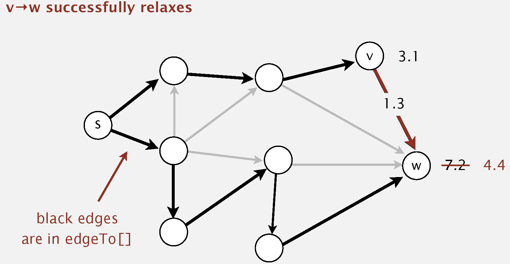

<format color="BlueViolet">Correctness Proof:</format> 
Shortest-paths optimality conditions

Let <math>G</math> be an edge-weighted digraph.

Then <code>distTo[]</code> are the shortest path distances from 
<math>s</math> iff:

<list type="bullet">
<li>
    
distTo[s] = 0.

</li>
<li>
    
For each vertex v, distTo[v] is the length of some path from 
    <math>s</math> to <math>v</math>.

</li>
<li>
    
For each edge <math>e = v -> w</math>, distTo[w] &leq; distTo[v] + 
    e.weight().

</li>
</list>

<format color="LawnGreen">Proof</format>

<list type="bullet">
<li>
    
Suppose that <math>s = v_{0} → v_{1} → v_{2} → ... → v_{k} = w
    </math> is a shortest path from <math>s</math> to <math>w</math>.

</li>
<li>

Then, 

<code-block lang = "tex">
\begin{align*}
\text{distTo}[v_{1}] & = \text{distTo}[v_{0}] + \text{e}_{1}.\text{weight}() \\
\text{distTo}[v_{2}] & = \text{distTo}[v_{2}] + \text{e}_{2}.\text{weight}() \\
... \\
\text{distTo}[v_{k}] & = \text{distTo}[v_{k - 1}] + \text{e}_{k}.\text{weight}() \\
\end{align*}
</code-block>
    
<math>\text{e}_{i}</math> = <math>\text{i}^{\text{th}}</math> edge
    on shortest path from <math>s</math> to <math>w</math>.

</li>
<li>
    
Add inequalities; simplify; and substitute 
    <math>\text{distTo}[v_{0}] = \text{distTo}[s] = 0</math>

<code-block lang="tex">
\text{distTo}[w] = \text{distTo}[v_{k}] \leq \text{e}_{1}.\text{weight}()
+ \text{e}_{2}.\text{weight}() + ... + \text{e}_{k}.\text{weight}()
</code-block>
    
<math>\text{e}_{1}.\text{weight}() + \text{e}_{2}.\text{weight}() 
    + ... + \text{e}_{k}.\text{weight}()</math> is the weight of shortest 
    path from <math>s</math> to <math>w</math>.

</li>
<li>
    
Thus, <code>distTo[w]</code> is the weight of shortest path to 
    <math>w</math>.

</li>
</list>

<format color="BlueViolet">Different Implementations</format> 

<list type="bullet">
<li>
    
Dijkstra's algorithm (nonnegative weights).

</li>
<li>
    
Topological sort algorithm (no directed cycles).

</li>
<li>
    
Bellman-Ford algorithm (no negative cycles).

</li>
</list>

### 17.3 Dijkstra's Algorithm

<procedure title="Dijkstra's Algorithm">
<step>
    
Consider vertices in increasing order of distance from s.

    
(non-tree vertex with the lowest <code>distTo[]</code> value)
    

</step>
<step>
    
Add vertex to tree and relaw all edges pointing from that vertex.
    

</step>
</procedure>

<format color="LawnGreen">Correctness Proof:</format> Dijkstra's 
algorithm computes a SPT in any edge-weighted digraph with 
<format color="OrangeRed">nonnegative</format> weights.

<list type="bullet">
<li>
    
Each edge <math>e = v→w</math> is relaxed exactly once 
    (when v is relaxed), leaving 
    <math>\text{distTo}[w] ≤ \text{distTo}[v] + \text{e.weight()}</math>.

</li>
<li>
    
Inequality holds until algorithm terminates because: 

    <list type="bullet">
    <li>
        
<code>distTo[w]</code> cannot increase => <code>distTo[]
        </code> values are monotone decreasing.

    </li>
    <li>
        
<code>distTo[v]</code> will not change => we choose lowest
        <code>distTo[]</code> value at each step and edge weights are
        nonnegative)

    </li>
    </list>
</li>
<li>
    
Thus, upon termination, shortest-paths optimality conditions 
    hold.

</li>
</list>

<format color="BlueViolet">Prim’s algorithm is essentially the 
same algorithm as Dijkstra's algorithm</format>

<list type="bullet">
<li>
    
Both are in a family of algorithms that compute a graph's 
    spanning tree.

</li>
<li>
    
<format color="Fuchsia">Prim's</format>: Closest vertex to 
    the <format color="OrangeRed">tree</format> (via an undirected 
    edge).

</li>
<li>
    
<format color="Fuchsia">Dijkstra's</format>: Closest vertex 
    to the <format color="OrangeRed">source</format> (via a 
    directed path).

</li>
</list>

<note>

DFS and BFS are also in this family of algorithms.

</note>

<tabs>
    <tab title="Java">
    <code-block lang="java" collapsible="true">
import java.util.ArrayList;
import java.util.Comparator;
import java.util.List;
import java.util.PriorityQueue;
\/
public class Dijkstra {
\/
    private final double[] distTo; 
    private final DirectedEdge[] edgeTo; 
    private final boolean[] marked; 
    private final PriorityQueue&lt;Integer&gt; pq;
\/
    public Dijkstra(EdgeWeightedDigraph G, int s) {
        distTo = new double[G.V()];
        edgeTo = new DirectedEdge[G.V()];
        marked = new boolean[G.V()];
        for (int v = 0; v &lt; G.V(); v++)
            distTo[v] = Double.POSITIVE_INFINITY;
        distTo[s] = 0.0;
        pq = new PriorityQueue&lt;&gt;(Comparator.comparingDouble(v -> distTo[v]));
        pq.offer(s);
        while (!pq.isEmpty()) {
            int v = pq.poll();
            marked[v] = true;
            for (DirectedEdge e : G.adj(v)) {
                relax(e);
            }
        }
    }
\/
    private void relax(DirectedEdge e) {
        int v = e.from();
        int w = e.to();
        if (distTo[w] &gt; distTo[v] + e.weight()) {
            distTo[w] = distTo[v] + e.weight();
            edgeTo[w] = e;
            if (!marked[w]) {
                pq.offer(w);
            }
        }
    }
\/
    public double distTo(int v) {
        return distTo[v];
    }
\/
    public boolean hasPathTo(int v) {
        return distTo[v] &lt; Double.POSITIVE_INFINITY;
    }
\/
    public Iterable&lt;DirectedEdge&gt pathTo(int v) {
        if (!hasPathTo(v)) return null;
        List&lt;DirectedEdge&gt; path = new ArrayList&lt;&gt;();
        for (DirectedEdge e = edgeTo[v]; e != null; e = edgeTo[e.from()]) {
            path.add(e);
        }
        return path;
    }
}
    </code-block>
    </tab>
    <tab title="C++ (Dijkstra.h)">
    <code-block lang="c++" collapsible="true">
#ifndef DIJKSTRA_H
#define DIJKSTRA_H
\/
#include "EdgeWeightedDigraph.h"
#include &lt;vector&gt;
#include &lt;queue&gt;
\/
class Dijkstra {
private:
    std::vector&lt;double&gt; distTo;
    std::vector&lt;DirectedEdge&gt; edgeTo;
    std::vector&lt;bool&gt; marked;
    std::priority_queue&lt;std::pair&lt;double, int&gt;, std::vector&lt;std::pair&lt;double, int&gt;&gt;,
                        std::greater&lt;&gt;&gt; pq;
\/
    void relax(const DirectedEdge& e);
\/
public:
    explicit Dijkstra(const EdgeWeightedDigraph& G, int s);
\/
    [[nodiscard]] double getdistTo(int v) const;
    [[nodiscard]] bool hasPathTo(int v) const;
    [[nodiscard]] std::vector&lt;DirectedEdge&gt; pathTo(int v) const;
};
\/
#endif // DIJKSTRA_H
    </code-block>
    </tab>
    <tab title="C++ (Dijkstra.cpp)">
    <code-block lang="c++" collapsible="true">
#include "dijkstra.h"
#include &lt;limits&gt;
\/
Dijkstra::Dijkstra(const EdgeWeightedDigraph& G, int s) :
    distTo(G.getV(), std::numeric_limits&lt;double&gt;::infinity()),
    edgeTo(G.getV(), DirectedEdge()),
    marked(G.getV(), false)
{
    distTo[s] = 0.0;
    pq.emplace(0.0, s);
\/
    while (!pq.empty()) {
        int v = pq.top().second;
        pq.pop();
\/
        if (marked[v]) continue; 
\/
        marked[v] = true;
        for (const auto& e : G.getAdj(v)) {
            relax(e);
        }
    }
}
\/
void Dijkstra::relax(const DirectedEdge& e) {
    int v = e.from();
    int w = e.to();
    if (distTo[w] &gt; distTo[v] + e.getWeight()) {
        distTo[w] = distTo[v] + e.getWeight();
        edgeTo[w] = e;
        pq.emplace(distTo[w], w);
    }
}
\/
double Dijkstra::getdistTo(int v) const {
    return distTo[v];
}
\/
bool Dijkstra::hasPathTo(int v) const {
    return distTo[v] &lt; std::numeric_limits&lt;double&gt;::infinity();
}
\/
std::vector&lt;DirectedEdge&gt; Dijkstra::pathTo(int v) const {
    if (!hasPathTo(v)) return {};
    std::vector&lt;DirectedEdge&gt; path;
    for (DirectedEdge e = edgeTo[v]; e.from() != -1; e = edgeTo[e.from()]) {
        path.push_back(e);
    }
    return path;
}
    </code-block>
    </tab>
    <tab title="Python">
    <code-block lang="python" collapsible="true">
from EdgeWeightedDigraph import EdgeWeightedDigraph
import heapq
\/
\/
class Dijkstra:
    def __init__(self, G, s):
        self.distTo = [float('inf')] * G.get_V()
        self.edgeTo = [None] * G.get_V()
        self.marked = [False] * G.get_V()
        self.pq = []  
\/
        self.distTo[s] = 0.0
        heapq.heappush(self.pq, (0.0, s))
\/
        while self.pq:
            _, v = heapq.heappop(self.pq)
\/
            if self.marked[v]:
                continue
\/
            self.marked[v] = True
            for e in G.get_adj(v):
                self.relax(e)
\/
    def relax(self, e):
        v = e.from_vertex()
        w = e.to_vertex()
        if self.distTo[w] &gt; self.distTo[v] + e.get_weight():
            self.distTo[w] = self.distTo[v] + e.get_weight()
            self.edgeTo[w] = e
            heapq.heappush(self.pq, (self.distTo[w], w))
\/
    def dist_to(self, v):
        return self.distTo[v]
\/
    def has_path_to(self, v):
        return self.distTo[v] &lt; float('inf')
\/
    def path_to(self, v):
        if not self.has_path_to(v):
            return None
        path = []
\/
        for e in reversed(self.edgeTo[v:v + 1]):  
            if e is not None:
                path.append(e)
        return path
    </code-block>
    </tab>
</tabs>

<format color="BlueViolet">Property</format>

Running time depends on PQ implementation: <math>V</math> insert, 
<math>V</math> delete-min, <math>E</math> decrease-key.

<table style="header-row">
<tr>
    <td>PQ Implementation</td>
    <td>Insert</td>
    <td>Delete-Min</td>
    <td>Decrease-Key</td>
    <td>Total</td>
</tr>
<tr>
    <td>Array</td>
    <td><math>1</math></td>
    <td><math>V</math></td>
    <td><math>1</math></td>
    <td><math>V ^ {2}</math></td>
</tr>
<tr>
    <td>Binary Heap</td>
    <td><math>\log V</math></td>
    <td><math>\log V</math></td>
    <td><math>\log V</math></td>
    <td><math>E \log V</math></td>
</tr>
<tr>
    <td>
d-way Heap

(Johnson 1975)
</td>
    <td><math>\log_{d} V</math></td>
    <td><math>d \log_{d} V</math></td>
    <td><math>\log_{d} V</math></td>
    <td><math>E \log_{\frac {E}{V}} V</math></td>
</tr>
<tr>
    <td>
Fibonacci Heap

(Fredman-Tarjan 1984)
</td>
    <td><math>1^{*}</math></td>
    <td><math>\log V ^ {*}</math></td>
    <td><math>1^{*}</math></td>
    <td><math>E + \log V</math></td>
</tr>
</table>

*: amortized

<format color="BlueViolet">Bottom Line</format>

<list type="bullet">
<li>
    
Array implementation optimal for dense graph.

</li>
<li>
    
Binary heap much faster for sparse graphs.

</li>
<li>
    
4-way heap worth the trouble in performance-critical 
    situations.

</li>
<li>
    
Fibonacci heap best in theory, but not worth implementing.

</li>
</list>

### 17.4 Edge-Weighted DAGs

<procedure title="Topological Sort Algorithm for Shortest Path">
<step>
    
Consider all vertices in topological order.

</step>
<step>
    
Relax all edges pointing from that vertex.

</step>
</procedure>

<format color="BlueViolet">Property:</format> Topological sort 
algorithm computes SPT in any edgeweighted DAG in time proportional 
to <math>E + V</math>.

<list type="bullet">
<li>
    
Each edge <math>e = v→w</math> is relaxed exactly once 
    (when v is relaxed), leaving 
    <math>\text{distTo}[w] ≤ \text{distTo}[v] + \text{e.weight()}</math>.

</li>
<li>
    
Inequality holds until algorithm terminates because: 

    <list type="bullet">
    <li>
        
<code>distTo[w]</code> cannot increase => <code>distTo[]
        </code> values are monotone decreasing.

    </li>
    <li>
        
<code>distTo[v]</code> will not change => we choose lowest
        <code>distTo[]</code> value at each step and edge weights are
        nonnegative)

    </li>
    </list>
</li>
<li>
    
Thus, upon termination, shortest-paths optimality conditions 
    hold.

</li>
</list>

<format color="BlueViolet">Longest paths in edge-weighted DAGs:
</format> 

Formulate as a shortest paths problem in edge-weighted DAGs.

<list type="bullet">
<li>
    
Negate all weights.

</li>
<li>
    
Find shortest paths.

</li>
<li>
    
Negate weights in result.

</li>
</list>

<note>

Topological sort algorithm works even with negative weights.

</note>

<tabs>
    <tab title="Java">
    <code-block lang="java" collapsible="true">
import java.util.*;
\/
public class ShortestPathTopological {
\/
    private final EdgeWeightedDigraph graph;
    private final int source;
    private final double[] distTo;
    private final DirectedEdge[] edgeTo;
\/
    public ShortestPathTopological(EdgeWeightedDigraph graph, int source) {
        this.graph = graph;
        this.source = source;
        distTo = new double[graph.V()];
        edgeTo = new DirectedEdge[graph.V()];
\/
        for (int v = 0; v &lt; graph.V(); v++) {
            distTo[v] = Double.POSITIVE_INFINITY;
        }
        distTo[source] = 0.0;
\/
        TopologicalSort topologicalSort = new TopologicalSort();
        List&lt;Integer&gt; sorted = topologicalSort.sort(graph);
\/
        for (int v : sorted) {
            relax(v);
        }
    }
\/
    private void relax(int v) {
        for (DirectedEdge edge : graph.adj(v)) {
            int w = edge.to();
            if (distTo[w] &gt; distTo[v] + edge.weight()) {
                distTo[w] = distTo[v] + edge.weight();
                edgeTo[w] = edge;
            }
        }
    }
\/
    public double distTo(int v) {
        return distTo[v];
    }
\/
    public boolean hasPathTo(int v) {
        return distTo[v] &lt; Double.POSITIVE_INFINITY;
    }
\/
    public Iterable&lt;DirectedEdge&gt; pathTo(int v) {
        if (!hasPathTo(v)) return null;
        List&lt;DirectedEdge&gt; path = new ArrayList&lt;&gt;();
        for (DirectedEdge e = edgeTo[v]; e != null; e = edgeTo[e.from()]) {
            path.addFirst(e); 
        }
        return path;
    }
\/
    private static class TopologicalSort {
        public List&lt;Integer&gt; sort(EdgeWeightedDigraph graph) {
            int V = graph.V();
            List&lt;Integer&gt; sorted = new ArrayList&lt;&gt;();
            int[] inDegree = new int[V];
            Queue&lt;Integer&gt; queue = new LinkedList&lt;&gt;();
\/
            for (int v = 0; v &lt; V; v++) {
                for (DirectedEdge edge : graph.adj(v)) {
                    inDegree[edge.to()]++;
                }
            }
\/
            for (int v = 0; v &lt; V; v++) {
                if (inDegree[v] == 0) {
                    queue.offer(v);
                }
            }
\/
            while (!queue.isEmpty()) {
                int u = queue.poll();
                sorted.add(u);
\/
                for (DirectedEdge edge : graph.adj(u)) {
                    int v = edge.to();
                    inDegree[v]--;
                    if (inDegree[v] == 0) {
                        queue.offer(v);
                    }
                }
            }
\/
            if (sorted.size() != V) {
                throw new IllegalArgumentException("Graph contains a cycle.");
            }
\/
            return sorted;
        }
    }
}
    </code-block>
    </tab>
    <tab title="C++ (ShortestPathTopological.h)">
    <code-block lang="c++" collapsible="true">
#ifndef SHORTESTPATHTOPOLOGICAL_H
#define SHORTESTPATHTOPOLOGICAL_H
\/
#include "EdgeWeightedDigraph.h"
#include &lt;vector&gt;
\/
class ShortestPathTopological {
private:
    const EdgeWeightedDigraph& graph;
    int source;
    std::vector&lt;double&gt; distTo;
    std::vector&lt;DirectedEdge&gt; edgeTo;
\/
    class TopologicalSort {
    public:
        explicit TopologicalSort(const EdgeWeightedDigraph& graph);
        [[nodiscard]] std::vector&lt;int&gt; sort() const;
    private:
        const EdgeWeightedDigraph& graph;
    };
\/
    void relax(int v);
\/
public:
    explicit ShortestPathTopological(const EdgeWeightedDigraph& graph, int source);
\/
    [[nodiscard]] double getdistTo(int v) const; 
\/
    [[nodiscard]] bool hasPathTo(int v) const; 
\/
    [[nodiscard]] std::vector&lt;DirectedEdge&gt; pathTo(int v) const;
};
\/
#endif // SHORTESTPATHTOPOLOGICAL_H
    </code-block>
    </tab>
    <tab title="C++ (ShortestPathTopological.cpp)">
    <code-block lang="c++" collapsible="true">
#include "ShortestPathTopological.h"
\/
#include &lt;algorithm&gt;
#include &lt;iostream&gt;
#include &lt;queue&gt;
#include &lt;limits&gt;
\/
ShortestPathTopological::ShortestPathTopological(const EdgeWeightedDigraph &graph, int source)
    : graph(graph), source(source), distTo(graph.getV(), std::numeric_limits&lt;double&gt;::infinity()),
      edgeTo(graph.getV()) {
    distTo[source] = 0.0;
\/
    TopologicalSort topologicalSort(graph);
    std::vector&lt;int&gt; sorted = topologicalSort.sort();
\/
    for (int v : sorted) {
        relax(v);
    }
}
\/
void ShortestPathTopological::relax(const int v) {
    for (const DirectedEdge& edge : graph.getAdj(v)) {
        int w = edge.to();
        if (distTo[w] &gt; distTo[v] + edge.getWeight()) {
            distTo[w] = distTo[v] + edge.getWeight();
            edgeTo[w] = edge;
        }
    }
}
\/
double ShortestPathTopological::getdistTo(const int v) const {
    return distTo[v];
}
\/
bool ShortestPathTopological::hasPathTo(const int v) const {
    return distTo[v] &lt; std::numeric_limits&lt;double&gt;::infinity();
}
\/
std::vector&lt;DirectedEdge&gt; ShortestPathTopological::pathTo(const int v) const {
    std::vector&lt;DirectedEdge&gt; path;
    if (!hasPathTo(v)) {
        return path;
    }
\/
    for (DirectedEdge e = edgeTo[v]; e.from() != -1; e = edgeTo[e.from()]) {
        path.push_back(e);
    }
    std::ranges::reverse(path);
    return path;
}
\/
ShortestPathTopological::TopologicalSort::TopologicalSort(const EdgeWeightedDigraph &graph) : graph(graph) {}
\/
std::vector&lt;int&gt; ShortestPathTopological::TopologicalSort::sort() const {
    const int V = graph.getV();
    std::vector&lt;int&gt; sorted;
    std::vector&lt;int&gt; inDegree(V, 0);
    std::queue&lt;int&gt; queue;
\/
    for (int v = 0; v &lt; V; ++v) {
        for (const DirectedEdge& e : graph.getAdj(v)) {
            inDegree[e.to()]++;
        }
    }
\/
    for (int v = 0; v &lt; V; ++v) {
        if (inDegree[v] == 0) {
            queue.push(v);
        }
    }
\/
    while (!queue.empty()) {
        int u = queue.front();
        queue.pop();
        sorted.push_back(u);
\/
        for (const DirectedEdge& e : graph.getAdj(u)) {
            int w = e.to();
            if (--inDegree[w] == 0) {
                queue.push(w);
            }
        }
    }
\/
    if (sorted.size() != static_cast&lt;size_t&gt;(V)) {
        throw std::runtime_error("Graph contains a cycle!");
    }
    return sorted;
}
    </code-block>
    </tab>
    <tab title="Python">
    <code-block lang="python" collapsible="true">
from collections import deque
from typing import List, Optional
\/
from DirectedEdge import DirectedEdge
from EdgeWeightedDigraph import EdgeWeightedDigraph
\/
\/
class ShortestPathTopological:
    def __init__(self, graph: EdgeWeightedDigraph, source: int):
        self.graph = graph
        self.source = source
        self.dist_to = [float('inf')] * graph.get_V()
        self.edge_to: List[Optional[DirectedEdge]] = [None] * graph.get_V()
        self.dist_to[source] = 0.0
\/
        topological_order = self._topological_sort()
        for v in topological_order:
            self._relax(v)
\/
    def _relax(self, v: int):
        for edge in self.graph.get_adj(v):
            w = edge.to_vertex()
            if self.dist_to[w] > self.dist_to[v] + edge.get_weight():
                self.dist_to[w] = self.dist_to[v] + edge.get_weight()
                self.edge_to[w] = edge
\/
    def get_dist_to(self, v: int) -&gt; float:
        return self.dist_to[v]
\/
    def has_path_to(self, v: int) -&gt; bool:
        return self.dist_to[v] &lt; float('inf')
\/
    def path_to(self, v: int) -&gt; Optional[List[str]]:
        if not self.has_path_to(v):
            return None
        path: List[DirectedEdge] = []
        e = self.edge_to[v]
        while e is not None:
            path.append(e)
            e = self.edge_to[e.from_vertex()]
        return [str(edge) for edge in path[::-1]]
\/
    def _topological_sort(self) -&gt; List[int]:
        V = self.graph.get_V()
        in_degree = [0] * V
        for v in range(V):
            for edge in self.graph.get_adj(v):
                in_degree[edge.to_vertex()] += 1
\/
        queue = deque([v for v in range(V) if in_degree[v] == 0])
        sorted_order = []
        while queue:
            u = queue.popleft()
            sorted_order.append(u)
            for edge in self.graph.get_adj(u):
                v = edge.to_vertex()
                in_degree[v] -= 1
                if in_degree[v] == 0:
                    queue.append(v)
\/
        if len(sorted_order) != V:
            raise ValueError("Graph contains a cycle.")
\/
        return sorted_order
    </code-block>
    </tab>
</tabs>

<format color="BlueViolet">Application Ⅰ - Content-Aware 
Resizing</format>

<format color="DarkOrange">Seam Carving:</format> Resize an image 
without distortion for display on cell phones and web browsers.

<list type="bullet">
<li>
    
Grid DAG: vertex = pixel; edge = from pixel to 3 downward 
    neighbors.

</li>
<li>
    
Weight of pixel = energy function of 8 neighboring pixels.
    

</li>
<li>
    
Seam = shortest path (sum of vertex weights) from top to 
    bottom.

</li>
</list>

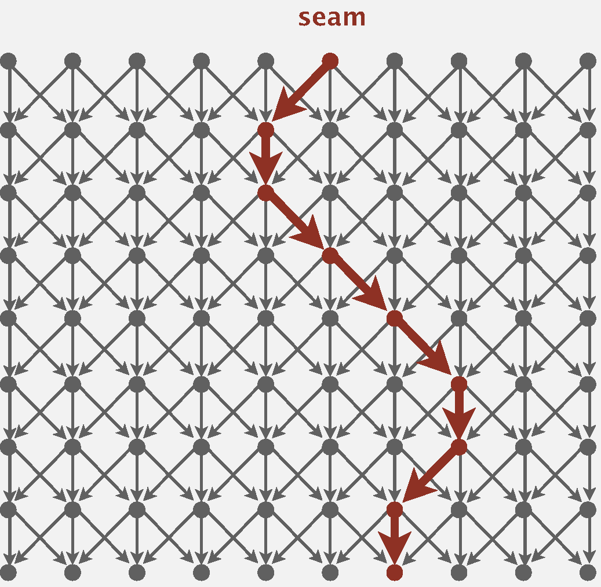

<format color="BlueViolet">Application &#8545; - Parallel Job 
Scheduling</format>

<format color="DarkOrange">Parallel Job Scheduling:</format> 
Given a set of jobs with durations and precedence constraints, 
schedule the jobs (by finding a start time for each) so as to achieve
the minimum completion time, while respecting the constraints.

To solve a parallel job-scheduling problem, create edge-weighted 
DAG, use <format color="OrangeRed">longest path</format> from the 
source to schedule each job:

<list>
<li>

Source and sink vertices.

</li>
<li>

Two vertices (begin and end) for each job.

</li>
<li>

Three edges for each job.

    <list>
    <li>
    
begin to end (weighted by duration)

    </li>
    <li>
    
source to begin (0 weight)

    </li>
    <li>
    
end to sink (0 weight)

    </li>
    </list>
</li>
<li>One edge for each precedence constraint (0 weight).</li>
</list>

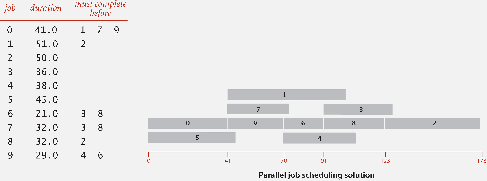

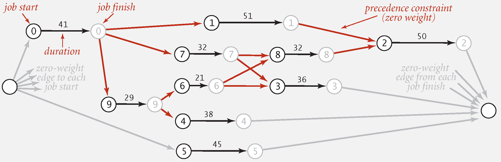

### 17.5 Negative Weights

<format color="DarkOrange">Negative Cycle:</format> A <format 
color="OrangeRed">negative cycle</format> is a directed cycle whose
sum of edge weights is negative.

<note>

Assuming all vertices reachable from s, a SPT exists iff no 
negative cycles.

</note>

<procedure title = "Bellman-Ford Algorithm">
<step>
    
Initialize distTo[s] = 0 and distTo[v] = &infin; for all 
    other vertices.

</step>
<step>
    
Repeat V times, relax each edge.

</step>
</procedure>

<format color="BlueViolet">Practical Improvement:</format> If 
distTo[v] does not change during pass <math>i</math>, no need to 
relax any edge pointing from v in pass <math>i+1</math> => 
maintain <format color="OrangeRed">queue</format> of vertices 
whose distTo[] changed.

<table style="header-row">
<tr>
    <td>Algorithm</td>
    <td>Restriction</td>
    <td>Typical Case</td>
    <td>Worst Case</td>
    <td>Extra Space</td>
</tr>
<tr>
    <td><format style="bold">Topological Sort</format></td>
    <td>No Directed Cycles</td><td><math>E + V</math></td>
    <td><math>E + V</math></td>
    <td><math>V</math></td>
</tr>
<tr>
    <td><format style="bold">
Dijkstra

(Binary Heap)
</format>
    </td>
    <td>No Negative Weights</td>
    <td><math>E \log V</math></td>
    <td><math>E \log V</math></td>
    <td><math>V</math></td>
</tr>
<tr>
    <td><format style="bold">Bellman-Ford</format></td>
    <td rowspan="2">No Negative Cycles</td>
    <td><math>EV</math></td>
    <td><math>EV</math></td>
    <td><math>V</math></td>
</tr>
<tr>
    <td><format style="bold">
Bellman-Ford

(queue-based)

    </format></td>
    <td><math>E + V</math></td>
    <td><math>EV</math></td>
    <td><math>V</math></td>
</tr>
</table>

<warning>
<list type="alpha-lower">
<li>

Directed cycles make the problem harder.

</li>
<li>

Negative weights make the problem harder.

</li>
<li>

Negative cycles makes the problem intractable.

</li>
</list>
</warning>

<tabs>
    <tab title="Java">
    <code-block lang="java" collapsible="true">
import java.util.ArrayList;
import java.util.LinkedList;
import java.util.List;
import java.util.Queue;
\/
public class BellmanFordSP {
    private final double[] distTo;
    private final DirectedEdge[] edgeTo;
    private final boolean[] onQueue;
    private final int[] cost;
    private final int s;
    private boolean hasNegativeCycle;
\/
    private final Queue&lt;Integer&gt; q;
\/
    public BellmanFordSP(EdgeWeightedDigraph G, int s) {
        this.s = s;
        distTo = new double[G.V()];
        edgeTo = new DirectedEdge[G.V()];
        onQueue = new boolean[G.V()];
        cost = new int[G.V()];
        for (int v = 0; v &lt; G.V(); v++)
            distTo[v] = Double.POSITIVE_INFINITY;
        distTo[s] = 0.0;
\/
        q = new LinkedList&lt;&gt;();
        q.add(s);
        onQueue[s] = true;
\/
        while (!q.isEmpty()) {
            int v = q.remove();
            onQueue[v] = false;
            relax(G, v);
        }
    }
\/
    private void relax(EdgeWeightedDigraph G, int v) {
        for (DirectedEdge e : G.adj(v)) {
            int w = e.to();
            if (distTo[w] &gt; distTo[v] + e.weight()) {
                distTo[w] = distTo[v] + e.weight();
                edgeTo[w] = e;
                cost[w]++;
\/
                if (!onQueue[w]) {
                    q.add(w);
                    onQueue[w] = true;
                }
\/
                if (cost[w] &gt;= G.V()) {
                    hasNegativeCycle = true;
                    return;
                }
            }
        }
    }
\/
    public double distTo(int v) {
        return distTo[v];
    }
\/
    public boolean hasPathTo(int v) {
        return distTo[v] &lt; Double.POSITIVE_INFINITY;
    }
\/
    public Iterable&lt;DirectedEdge&gt; pathTo(int v) {
        if (!hasPathTo(v)) return null;
        List&lt;DirectedEdge&gt; path = new ArrayList&lt;&gt;();
        for (DirectedEdge e = edgeTo[v]; e != null; e = edgeTo[e.from()]) {
            path.add(e);
        }
        return path;
    }
\/
    public boolean hasNegativeCycle() {
        return hasNegativeCycle;
    }
}
    </code-block>
    </tab>
    <tab title="C++ (BellmanFordSP.h)">
    <code-block lang="c++" collapsible="true">
#ifndef BELLMANFORDSP_H
#define BELLMANFORDSP_H
\/
#include "EdgeWeightedDigraph.h"
#include &lt;vector&gt;
#include &lt;queue&gt;
\/
class BellmanFordSP {
private:
    std::vector&lt;double&gt; distTo; 
    std::vector&lt;DirectedEdge&gt; edgeTo; 
    std::vector&lt;bool&gt; onQueue;
    std::vector&lt;int&gt; cost;    
    int s;                 
    bool hasNegativeCycle;   
\/
    std::queue&lt;int&gt; q;
\/
public:
    BellmanFordSP(const EdgeWeightedDigraph& G, int s);
    [[nodiscard]] double getdistTo(int v) const;
    [[nodiscard]] bool hasPathTo(int v) const;
    [[nodiscard]] std::vector&lt;DirectedEdge&gt; pathTo(int v) const;
    [[nodiscard]] bool NegativeCycle() const;
\/
private:
    void relax(const EdgeWeightedDigraph& G, int v);
};
\/
#endif // BELLMANFORDSP_H
    </code-block>
    </tab>
    <tab title="C++ (BellmanFordSP.cpp)">
    <code-block lang="c++" collapsible="true">
#include "BellmanFordSP.h"
#include &lt;limits&gt;
\/
BellmanFordSP::BellmanFordSP(const EdgeWeightedDigraph& G, const int s) :
    distTo(G.getV(), std::numeric_limits&lt;double&gt;::infinity()),
    edgeTo(G.getV(), DirectedEdge(-1, -1, 0.0)),
    onQueue(G.getV(), false),
    cost(G.getV(), 0),
    s(s),
    hasNegativeCycle(false) {
\/
    distTo[s] = 0.0;
    q.push(s);
    onQueue[s] = true;
\/
    while (!q.empty()) {
        int v = q.front();
        q.pop();
        onQueue[v] = false;
        relax(G, v);
    }
}
\/
double BellmanFordSP::getdistTo(const int v) const {
    return distTo[v];
}
\/
bool BellmanFordSP::hasPathTo(const int v) const {
    return distTo[v] &lt; std::numeric_limits&lt;double&gt;::infinity();
}
\/
std::vector&lt;DirectedEdge&gt; BellmanFordSP::pathTo(const int v) const {
    if (!hasPathTo(v)) {
        return {};
    }
    std::vector&lt;DirectedEdge&gt; path;
    for (DirectedEdge e = edgeTo[v]; e.from() != -1; e = edgeTo[e.from()]) {
        path.push_back(e);
    }
    return path;
}
\/
bool BellmanFordSP::NegativeCycle() const {
    return hasNegativeCycle;
}
\/
void BellmanFordSP::relax(const EdgeWeightedDigraph& G, const int v) {
    for (const DirectedEdge& e : G.getAdj(v)) {
        int w = e.to();
        if (distTo[w] &gt; distTo[v] + e.getWeight()) {
            distTo[w] = distTo[v] + e.getWeight();
            edgeTo[w] = e;
            cost[w]++;
\/
            if (!onQueue[w]) {
                q.push(w);
                onQueue[w] = true;
            }
\/
            if (cost[w] &gt;= G.getV()) {
                hasNegativeCycle = true;
                return;
            }
        }
    }
}
    </code-block>
    </tab>
    <tab title="Python">
    <code-block lang="python" collapsible="true">
from EdgeWeightedDigraph import EdgeWeightedDigraph
\/
class BellmanFordSP:
    def __init__(self, G, s):
        self.distTo = [float("inf") for _ in range(G.get_V())]
        self.edgeTo = [None for _ in range(G.get_V())]
        self.onQueue = [False for _ in range(G.get_V())]
        self.cost = [0 for _ in range(G.get_V())]
        self.s = s
        self.hasNegativeCycle = False
\/
        self.distTo[s] = 0.0
        self.q = [s]
        self.onQueue[s] = True
\/
        while self.q:
            v = self.q.pop(0)
            self.onQueue[v] = False
            self.relax(G, v)
\/
    def distTo(self, v):
        return self.distTo[v]
\/
    def hasPathTo(self, v):
        return self.distTo[v] != float("inf")
\/
    def pathTo(self, v):
        if not self.hasPathTo(v):
            return None
        path = []
        e = self.edgeTo[v]
        while e is not None:
            path.append(e)
            e = self.edgeTo[e.from_vertex()]
        return path
\/
    def hasNegativeCycle(self):
        return self.hasNegativeCycle
\/
    def relax(self, G, v):
        for e in G.get_adj(v):
            w = e.to_vertex()
            if self.distTo[w] &gt; self.distTo[v] + e.get_weight():
                self.distTo[w] = self.distTo[v] + e.get_weight()
                self.edgeTo[w] = e
                self.cost[w] += 1
\/
                if not self.onQueue[w]:
                    self.q.append(w)
                    self.onQueue[w] = True
\/
                if self.cost[w] &gt;= G.get_V():
                    self.hasNegativeCycle = True
                    return
    </code-block>
    </tab>
</tabs>

<format color="BlueViolet">Find A Negative Cycle</format>

If there is a negative cycle, Bellman-Ford gets stuck in loop,
updating distTo[] and edgeTo[] entries of vertices in the cycle.

If any vertex v is updated in phase V, there exists a negative
cycle (and can trace back edgeTo[v] entries to find it).

<format color="BlueViolet">Application - Arbitrage Detection
</format>

Currency exchange graph.

<list type="bullet">
<li>
    
Vertex = currency.

</li>
<li>
    
Edge = transaction, with weight equal to exchange rate.

</li>
<li>
    
Find a directed cycle whose product of edge weights is &gt; 1.

</li>
</list>

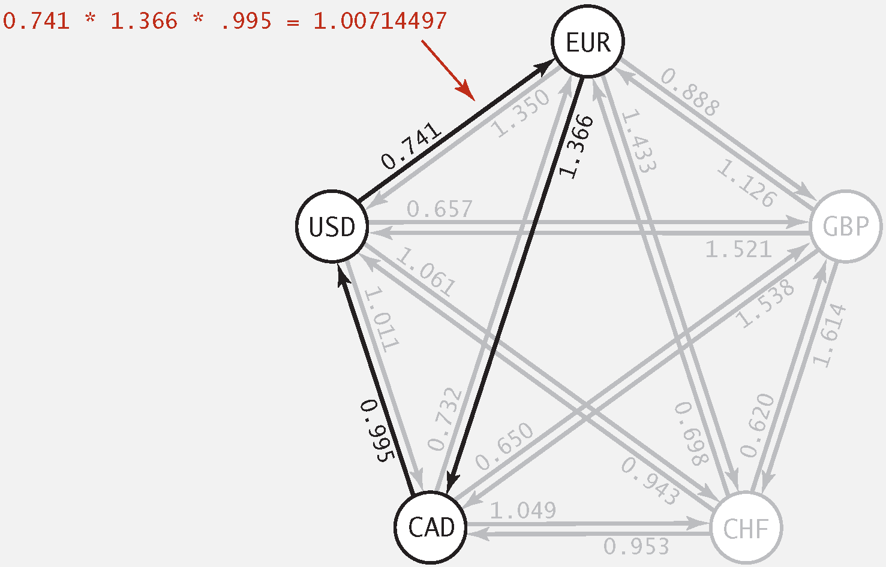

<procedure title="Arbitrage Detection">
<step>
    
Let weight of edge <math>v->w</math> be <math>- ln</math> 
    (exchange rate from currency <math>v</math> to <math>w</math>).

</step>
<step>
    
Multiplication turns to addition; <math>\gt 1</math> turns to 
    <math>\lt 0.</math>

</step>
<step>
    
Find a directed cycle whose sum of edge weights is <math>\lt 0
    </math> (negative cycle).

</step>
</procedure>

## 18 Maximum Flow and Minimum Cut

### 18.1 Introduction

<format color="BlueViolet">Definitions</format>

<format color="DarkOrange"><math>st</math>-cut: </format> A 
<format color="OrangeRed"><math>st</math>-cut (cut)</format> is a 
partition of the vertices into two disjoint sets, with <math>s
</math> in one set <math>A</math> and <math>t</math> in the other 
set <math>B</math>.

<format color="DarkOrange"><math>st</math>-cut capacity: </format> 
Its <format color="OrangeRed">capacity</format> is the sum of the 
capacities of the edges from <math>A</math> to <math>B</math>.

<note>

Each edge has a positive capacity in edge-weighted digraph here.

</note>

<format color="BlueViolet">Minimum cut problem:</format> 
Find a cut of minimum capacity.

<format color="BlueViolet">Definitions</format>

<format color="DarkOrange"><math>st</math>-flow:</format> An 
<format color="OrangeRed"><math>st</math>-flow (flow)</format> is 
an assignment of values to the edges such that:

<list type="bullet">
<li>

Capacity constraint: 0 ≤ edge's flow ≤ edge's capacity.

</li>
<li>

Local equilibrium: inflow = outflow at every vertex (except <math>s
</math> and <math>t</math>).

</li>
</list>

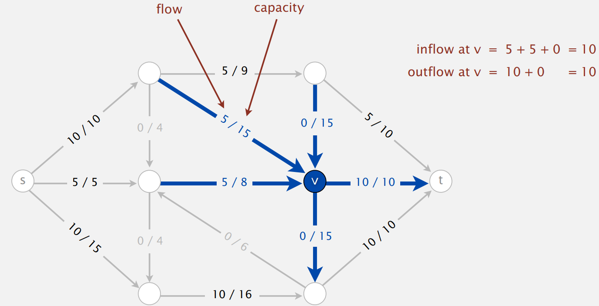

<format color="DarkOrange">Value of a flow:</format> 
The value of a flow is the inflow at <math>t</math> (assuming 
no edge points to <math>s</math> or from <math>t</math>.

<format color="BlueViolet">Maximum st-flow (maxflow) problem:
</format> Find a flow of maximum value.

<warning>

These two problems are dual!

</warning>

### 18.2 Ford-Fulkerson Algorithm

<procedure title = "Ford-Fulkerson Algorithm">
<step>
    
Start with 0 flow.

</step>
<step>
    
Find an undirected path from s to t such that: 

    
1. Can increase flow on forward edges (not full).

    
2. Can decrease flow on backward edges (not empty).

</step>
<step>
    
Terminates when all paths from s to t are blocked by either a
    full forward edge or an empty backward edge.

</step>
</procedure>

### 18.3 Maxflow-Mincut Theorem

<format color="BlueViolet">Definition</format>

<format color="OrangeRed">Net Flow:</format> The <format color=
"OrangeRed">net flow across</format> a cut (<math>A</math>, <math>B
</math>) is the sum of the flows on its edges from <math>A</math> to 
<math>B</math> minus the sum of the flows on its edges from from 
<math>B</math> to <math>A</math>.

<format color="BlueViolet">Flow-value lemma:</format> Let <math>f
</math> be any flow and let (<math>A</math>, <math>B</math>) be any 
cut. Then, the net flow across (<math>A</math>, <math>B</math>) 
equals the value of <math>f</math>.

<format color="LawnGreen">Proof:</format> By induction on the size of 
<math>B</math>.

<list type="bullet">
<li>
    
Base case: <math>B = {t}</math>

</li>
<li>
    
Induction step: remains true by local equilibrium when moving
    any vertex from <math>A</math> to <math>B</math>.

</li>
</list>

<format color="BlueViolet">Weak duality:</format> Let <math>f
</math> be any flow and let <math>(A, B)</math> be any cut. Then, the 
value of the flow ≤ the capacity of the cut.

<format color="LawnGreen">Proof</format>

Value of flow <math>f</math> = net flow across cut <math>(A, B)
</math> ≤ capacity of cut <math>(A, B)</math>.

<format color="BlueViolet">Augmenting path theorem:</format> A 
flow f is a maxflow iff no augmenting paths.

<format color="BlueViolet">Maxflow-mincut theorem:</format> Value 
of the maxflow = capacity of mincut.

<format color="LawnGreen">Proof:</format> The following three 
conditions are equivalent for any flow <math>f</math>.

<list type="decimal">
<li>
    
There exists a cut whose capacity equals the value of the flow 
    <math>f</math>.

</li>
<li>
    
<math>f</math> is a maxflow.

</li>
<li>
    
There is no augmenting path with respect to <math>f</math>.

</li>
</list>

<format color="Fuchsia">1 -> 2</format>

<list>
<li>
    
Suppose that <math>(A, B)</math> is a cut with capacity equal 
    to the value of <math>f</math>.

</li>
<li>
    
Then, the value of any flow <math>f'</math> ≤ capacity of 
    <math>(A, B)</math> = value of <math>f</math>.

</li>
<li>
    
Thus, <math>f</math> is a maxflow.

</li>
</list>

<format color="Fuchsia">2 -> 3:</format> We prove 
contrapositive: ~3 -> ~2

<list>
<li>
    
Suppose that there is an augmenting path with respect to 
    <math>f</math>.

</li>
<li>
    
Can improve flow <math>f</math> by sending flow along this path.
    

</li>
<li>
    
Thus, f is not a maxflow.

</li>
</list>

<format color="Fuchsia">3 -> 1:</format> Suppose that there is no
augmenting path with respect to <math>f</math>.

<list>
<li>
    
Let <math>(A, B)</math> be a cut where <math>A</math> is the set
    of vertices connected to <math>s</math> by an undirected path with 
    no full forward or empty backward edges.
</li>
<li>
    
By definition, <math>s</math> is in <math>A</math>; since no 
    augmenting path, <math>t</math> is in <math>B</math>.

</li>
<li>
    
Capacity of cut = net flow across cut (forward edges full; 
    backward edges empty) = value of flow <math>f</math> (
    flow-value lemma).

</li>
</list>

To compute mincut <math>(A, B)</math> from maxflow <math>f</math>: 

<list>
<li>
    
By augmenting path theorem, no augmenting paths with respect 
    to <math>f</math>.

</li>
<li>
    
Compute <math>A</math> = set of vertices connected to <math>s
    </math> by an undirected path with no full forward or empty 
    backward edges.

</li>
</list>

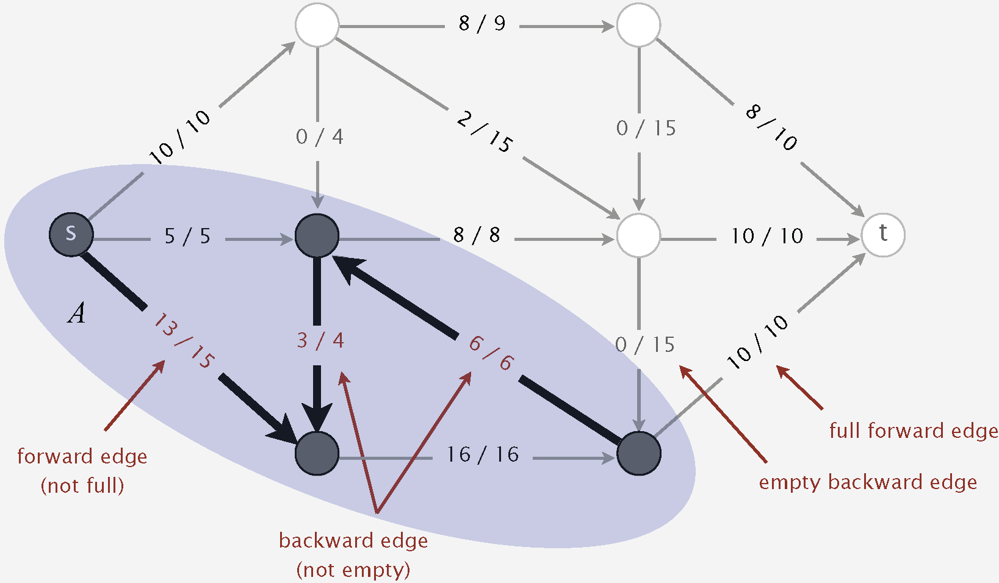

### 18.4 Running Time Analysis

<note>

Important special case: Edge capacities are integers between 1 and 
<math>U</math>.

</note>

<format color="BlueViolet">Properties</format>

<list type="decimal">
<li>
    
The flow is integer-valued throughout Ford-Fulkerson.

    
<format color="LawnGreen">Proof</format>

    <list type="bullet">
    <li>
        
Bottleneck capacity is an integer.

    </li>
    <li>
        
Flow on an edge increases/decreases by bottleneck capacity.
        

    </li>
    </list>
</li>
<li>
    
Number of augmentations ≤ the value of the maxflow.

    
<format color="LawnGreen">Proof:</format> Each augmentation 
    increases the value by at least 1.

</li>
<li>
    
<format color="Fuchsia">Integrality theorem:</format> There 
    exists an integer-valued maxflow.

    
<format color="LawnGreen">Proof:</format> Ford-Fulkerson 
    terminates and maxflow that it finds is integer-valued.

</li>
</list>

<format color="BlueViolet">Running time:</format> FF performance 
depends on choice of augmenting paths.

Digraph with <math>V</math> vertices, <math>E</math> edges, and 
integer capacities between 1 and <math>U</math>

<table style="header-row">
<tr>
    <td>Augmenting Path</td>
    <td>Number of Paths</td>
    <td>Implementation</td>
</tr>
<tr>
    <td>Shortest Path</td>
    <td><math>\leq \frac {1}{2} E V</math></td>
    <td>Queue (BFS)</td>
</tr>
<tr>
    <td>Fattest path</td>
    <td><math>\leq E \ln (E U)</math></td>
    <td>Priority Queue</td>
</tr>
<tr>
    <td>Random Path</td>
    <td><math>\leq E U</math></td>
    <td>Randomized Queue</td>
</tr>
<tr>
    <td>DFS Path</td>
    <td><math>\leq E U</math></td>
    <td>Stack (DFS)</td>
</tr>
</table>

### 18.5 Implementation

#### 18.5.1 Flow Edge

<format color="BlueViolet">Implementation</format>

Use residual capcity: 

<list type="bullet">
<li>
    
Forward edge: residual capacity <math>= c_{e} - f_{e}</math>.
    

</li>
<li>
    
Backward edge: residual capacity <math>= f_{e}</math>.

</li>
</list>

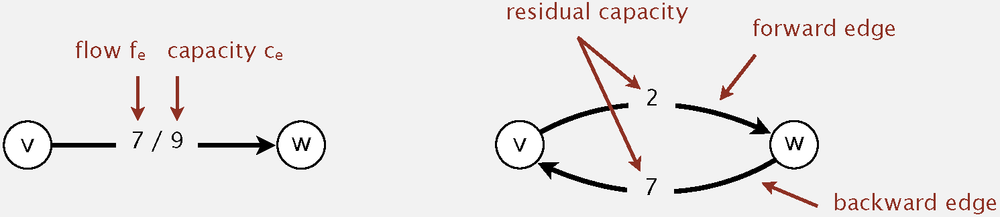

<tabs>
    <tab title="Java">
    <code-block lang="java" collapsible="true">
public class FlowEdge {
    private static final double FLOATING_POINT_EPSILON = 1.0E-10;
\/
    private final int v;
    private final int w;
    private final double capacity;
    private double flow;
\/
    public FlowEdge(int v, int w, double capacity) {
        if (v &lt; 0) throw new IllegalArgumentException("vertex index must be a non-negative integer");
        if (w &lt; 0) throw new IllegalArgumentException("vertex index must be a non-negative integer");
        if (!(capacity &gt;= 0.0)) throw new IllegalArgumentException("Edge capacity must be non-negative");
        this.v = v;
        this.w = w;
        this.capacity = capacity;
        this.flow = 0.0;
    }
\/
    public FlowEdge(int v, int w, double capacity, double flow) {
        if (v &lt; 0) throw new IllegalArgumentException("vertex index must be a non-negative integer");
        if (w &lt; 0) throw new IllegalArgumentException("vertex index must be a non-negative integer");
        if (!(capacity &gt;= 0.0)) throw new IllegalArgumentException("edge capacity must be non-negative");
        if (!(flow &lt;= capacity)) throw new IllegalArgumentException("flow exceeds capacity");
        if (!(flow &gt;= 0.0)) throw new IllegalArgumentException("flow must be non-negative");
        this.v = v;
        this.w = w;
        this.capacity = capacity;
        this.flow = flow;
    }
\/
    public FlowEdge(FlowEdge e) {
        this.v = e.v;
        this.w = e.w;
        this.capacity = e.capacity;
        this.flow = e.flow;
    }
\/
    public int from() {
        return v;
    }
\/
    public int to() {
        return w;
    }
\/
    public double capacity() {
        return capacity;
    }
\/
    public double flow() {
        return flow;
    }
\/
    public int other(int vertex) {
        if (vertex == v) return w;
        else if (vertex == w) return v;
        else throw new IllegalArgumentException("invalid endpoint");
    }
\/
    public double residualCapacityTo(int vertex) {
        if (vertex == v) return flow;             
        else if (vertex == w) return capacity - flow;  
        else throw new IllegalArgumentException("invalid endpoint");
    }
\/
    public void addResidualFlowTo(int vertex, double delta) {
        if (!(delta &gt;= 0.0)) throw new IllegalArgumentException("Delta must be non-negative");
\/
        if (vertex == v) flow -= delta;
        else if (vertex == w) flow += delta;
        else throw new IllegalArgumentException("invalid endpoint");
\/
        if (Math.abs(flow) &lt;= FLOATING_POINT_EPSILON)
            flow = 0;
        if (Math.abs(flow - capacity) &lt;= FLOATING_POINT_EPSILON)
            flow = capacity;
\/
        if (!(flow &gt;= 0.0)) throw new IllegalArgumentException("Flow is negative");
        if (!(flow &lt;= capacity)) throw new IllegalArgumentException("Flow exceeds capacity");
    }
\/
    public String toString() {
        return v + "-&gt;" + w + " " + flow + "/" + capacity;
    }
}
    </code-block>
    </tab>
    <tab title="C++ (FlowEdge.h)">
    <code-block lang="c++" collapsible="true">
#ifndef FLOWEDGE_H
#define FLOWEDGE_H
\/
#include &lt;iostream&gt;
\/
class FlowEdge {
private:
    static constexpr double FLOATING_POINT_EPSILON = 1.0E-10;
\/
    int v;
    int w;
    double capacity;
    double flow;
\/
public:
    FlowEdge(int v, int w, double capacity);
    FlowEdge(int v, int w, double capacity, double flow);
    FlowEdge(const FlowEdge& e);
\/
    [[nodiscard]] int from() const;
    [[nodiscard]] int to() const;
    [[nodiscard]] double getcapacity() const;
    [[nodiscard]] double getflow() const;
    [[nodiscard]] int other(int vertex) const;
    [[nodiscard]] double residualCapacityTo(int vertex) const;
    void addResidualFlowTo(int vertex, double delta);
\/
    friend std::ostream& operator&lt;&lt;(std::ostream& os, const FlowEdge& e); 
};
\/
#endif // FLOWEDGE_H
    </code-block>
    </tab>
    <tab title="C++ (FlowEdge.cpp)">
    <code-block lang="c++" collapsible="true">
#include "FlowEdge.h"
#include &lt;stdexcept&gt;
#include &lt;cmath&gt;
\/
FlowEdge::FlowEdge(const int v, const int w, const double capacity) : v(v), w(w), capacity(capacity), flow(0.0) {
    if (v &lt; 0) throw std::invalid_argument("vertex index must be a non-negative integer");
    if (w &lt; 0) throw std::invalid_argument("vertex index must be a non-negative integer");
    if (!(capacity &gt;= 0.0)) throw std::invalid_argument("Edge capacity must be non-negative");
}
\/
FlowEdge::FlowEdge(const int v, const int w, const double capacity, const double flow) : v(v), w(w), capacity(capacity), flow(flow) {
    if (v &lt; 0) throw std::invalid_argument("vertex index must be a non-negative integer");
    if (w &lt; 0) throw std::invalid_argument("vertex index must be a non-negative integer");
    if (!(capacity &gt;= 0.0)) throw std::invalid_argument("edge capacity must be non-negative");
    if (!(flow &lt;= capacity)) throw std::invalid_argument("flow exceeds capacity");
    if (!(flow &gt;= 0.0)) throw std::invalid_argument("flow must be non-negative");
}
\/
FlowEdge::FlowEdge(const FlowEdge& e) = default;
\/
int FlowEdge::from() const {
    return v;
}
\/
int FlowEdge::to() const {
    return w;
}
\/
double FlowEdge::getcapacity() const {
    return capacity;
}
\/
double FlowEdge::getflow() const {
    return flow;
}
\/
int FlowEdge::other(const int vertex) const {
    if (vertex == v) return w;
    else if (vertex == w) return v;
    else throw std::invalid_argument("invalid endpoint");
}
\/
double FlowEdge::residualCapacityTo(const int vertex) const {
    if (vertex == v) return flow;
    else if (vertex == w) return capacity - flow;
    else throw std::invalid_argument("invalid endpoint");
}
\/
void FlowEdge::addResidualFlowTo(const int vertex, const double delta) {
    if (!(delta &gt;= 0.0)) throw std::invalid_argument("Delta must be non-negative");
\/
    if (vertex == v) flow -= delta;
    else if (vertex == w) flow += delta;
    else throw std::invalid_argument("invalid endpoint");
\/
    if (std::abs(flow) &lt;= FLOATING_POINT_EPSILON)
        flow = 0;
    if (std::abs(flow - capacity) &lt;= FLOATING_POINT_EPSILON)
        flow = capacity;
\/
    if (!(flow &gt;= 0.0)) throw std::invalid_argument("Flow is negative");
    if (!(flow &lt;= capacity)) throw std::invalid_argument("Flow exceeds capacity");
}
\/
std::ostream& operator&lt;&lt;(std::ostream& os, const FlowEdge& e) {
    os &lt;&lt; e.v &lt;&lt; "-&gt;" &lt;&lt; e.w &lt;&lt; " " &lt;&lt; e.flow &lt;&lt; "/" &lt;&lt; e.capacity;
    return os;
}
    </code-block>
    </tab>
    <tab title="Python">
    <code-block lang="python" collapsible="true">
class FlowEdge:
    FLOATING_POINT_EPSILON = 1e-10
\/
    def __init__(self, v, w, capacity, flow=0.0):
        if v &lt; 0:
            raise ValueError("vertex index must be a non-negative integer")
        if w &lt; 0:
            raise ValueError("vertex index must be a non-negative integer")
        if capacity &lt; 0.0:
            raise ValueError("Edge capacity must be non-negative")
        if flow &gt; capacity:
            raise ValueError("flow exceeds capacity")
        if flow &lt; 0.0:
            raise ValueError("flow must be non-negative")
\/
        self._v = v
        self._w = w
        self._capacity = capacity
        self._flow = flow
\/
    def from_(self):
        return self._v
\/
    def to(self):
        return self._w
\/
    def capacity(self):
        return self._capacity
\/
    def flow(self):
        return self._flow
\/
    def other(self, vertex):
        if vertex == self._v:
            return self._w
        elif vertex == self._w:
            return self._v
        else:
            raise ValueError("invalid endpoint")
\/
    def residualCapacityTo(self, vertex):
        if vertex == self._v:
            return self._flow 
        elif vertex == self._w:
            return self._capacity - self._flow  
        else:
            raise ValueError("invalid endpoint")
\/
    def addResidualFlowTo(self, vertex, delta):
        if delta &lt; 0.0:
            raise ValueError("Delta must be non-negative")
\/
        if vertex == self._v:
            self._flow -= delta
        elif vertex == self._w:
            self._flow += delta
        else:
            raise ValueError("invalid endpoint")
\/
        if abs(self._flow) &lt;= self.FLOATING_POINT_EPSILON:
            self._flow = 0
        if abs(self._flow - self._capacity) &lt;= self.FLOATING_POINT_EPSILON:
            self._flow = self._capacity
\/
        if self._flow &lt; 0.0:
            raise ValueError("Flow is negative")
        if self._flow &gt; self._capacity:
            raise ValueError("Flow exceeds capacity")
\/
    def __str__(self):
        return f"{self._v}-&gt;{self._w} {self._flow}/{self._capacity}"
    </code-block>
    </tab>
</tabs>

#### 18.5.2 Flow Network

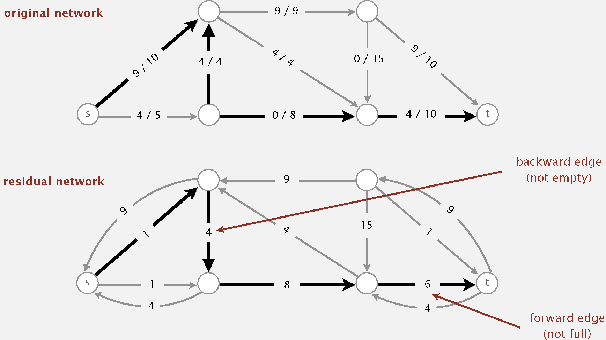

<tabs>
    <tab title="Java">
    <code-block lang="java" collapsible="true">
import java.util.ArrayList;
import java.util.List;
\/
public class FlowNetwork {
    private final int V;
    private int E;
    private final List&lt;FlowEdge&gt;[] adj;
\/
    public FlowNetwork(int V, int E, List&lt;int[]&gt; edges) {
        if (V &lt; 0) throw new IllegalArgumentException("Number of vertices in a Graph must be non-negative");
        if (E &lt; 0) throw new IllegalArgumentException("Number of edges must be non-negative");
        this.V = V;
        this.E = 0;
        adj = (List&lt;FlowEdge&gt;[]) new List[V];
        for (int v = 0; v &lt; V; v++)
            adj[v] = new ArrayList&lt;&gt;();
        for (int[] edge : edges) {
            int v = edge[0];
            int w = edge[1];
            double capacity = edge[2];
            validateVertex(v);
            validateVertex(w);
            addEdge(new FlowEdge(v, w, capacity));
        }
    }
\/
    public int V() {
        return V;
    }
\/
    public int E() {
        return E;
    }
\/
    private void validateVertex(int v) {
        if (v &lt; 0 || v &gt;= V)
            throw new IllegalArgumentException("vertex " + v + " is not between 0 and " + (V-1));
    }
\/
    public void addEdge(FlowEdge e) {
        int v = e.from();
        int w = e.to();
        validateVertex(v);
        validateVertex(w);
        adj[v].add(e);
        adj[w].add(e);
        E++;
    }
\/
    public Iterable&lt;FlowEdge&gt; adj(int v) {
        validateVertex(v);
        return adj[v];
    }
\/
    public Iterable&lt;FlowEdge&gt; edges() {
        List&lt;FlowEdge&gt; list = new ArrayList&lt;&gt;();
        for (int v = 0; v &lt; V; v++)
            for (FlowEdge e : adj(v)) {
                if (e.to() != v)
                    list.add(e);
            }
        return list;
    }
\/
    public String toString() {
        StringBuilder s = new StringBuilder();
        s.append(V).append(" ").append(E).append(System.lineSeparator());
        for (int v = 0; v &lt; V; v++) {
            s.append(v).append(":  ");
            for (FlowEdge e : adj[v]) {
                if (e.to() != v) s.append(e).append("  ");
            }
            s.append(System.lineSeparator());
        }
        return s.toString();
    }
}
    </code-block>
    </tab>
    <tab title="C++ (FlowNetwork.h)">
    <code-block lang="c++" collapsible="true">
#ifndef FLOWNETWORK_H
#define FLOWNETWORK_H
\/
#include &lt;vector&gt;
#include "FlowEdge.h"
\/
class FlowNetwork {
private:
    int V;
    int E;
    std::vector&lt;FlowEdge&gt; adj;
\/
    void validateVertex(int v) const;
\/
public:
    FlowNetwork(int V, int E, const std::vector&lt;std::vector&lt;int&gt;&gt;& edges);
\/
    [[nodiscard]] int getV() const;
    [[nodiscard]] int getE() const;
    void addEdge(const FlowEdge& e);
    [[nodiscard]] std::vector&lt;FlowEdge&gt; getadj(int v) const;
    [[nodiscard]] std::vector&lt;FlowEdge&gt; edges() const;
\/
    friend std::ostream& operator&lt;&lt;(std::ostream& os, const FlowNetwork& network);
};
\/
#endif // FLOWNETWORK_H
    </code-block>
    </tab>
    <tab title="C++ (FlowNetwork.cpp)">
    <code-block lang="c++" collapsible="true">
#include &lt;iostream&gt;
#include "FlowNetwork.h"
\/
FlowNetwork::FlowNetwork(int V, int E, const std::vector&lt;std::vector&lt;int&gt;&gt;& edges) : V(V), E(0) {
    if (V &lt; 0) throw std::invalid_argument("Number of vertices in a Graph must be non-negative");
    if (E &gt; 0) throw std::invalid_argument("Number of edges must be non-negative");
\/
    adj = new std::vector&lt;FlowEdge&gt;[V];
    for (const auto& edge : edges) {
        int v = edge[0];
        int w = edge[1];
        double capacity = edge[2];
        validateVertex(v);
        validateVertex(w);
        addEdge(FlowEdge(v, w, capacity));
    }
}
\/
int FlowNetwork::V() const {
    return V;
}
\/
int FlowNetwork::E() const {
    return E;
}
\/
void FlowNetwork::validateVertex(int v) const {
    if (v &lt; 0 || v &gt;= V)
        throw std::invalid_argument("vertex " + std::to_string(v) + " is not between 0 and " + std::to_string(V - 1));
}
\/
void FlowNetwork::addEdge(const FlowEdge& e) {
    int v = e.from();
    int w = e.to();
    validateVertex(v);
    validateVertex(w);
    adj[v].push_back(e);
    adj[w].push_back(e);
    E++;
}
\/
std::vector&lt;FlowEdge&gt; FlowNetwork::adj(int v) const {
    validateVertex(v);
    return adj[v];
}
\/
std::vector&lt;FlowEdge&gt; FlowNetwork::edges() const {
    std::vector&lt;FlowEdge&gt; list;
    for (int v = 0; v &lt; V; v++) {
        for (const FlowEdge& e : adj(v)) {
            if (e.to() != v)
                list.push_back(e);
        }
    }
    return list;
}
\/
std::ostream& operator&lt;&lt;(std::ostream& os, const FlowNetwork& network) {
    os &lt;&lt; network.V &lt;&lt; " " &lt;&lt; network.E &lt;&lt; std::endl;
    for (int v = 0; v &lt; network.V; v++) {
        os &lt;&lt; v &lt;&lt; ":  ";
        for (const FlowEdge& e : network.adj[v]) {
            if (e.to() != v) os &lt;&lt; e &lt;&lt; "  ";
        }
        os &lt;&lt; std::endl;
    }
    return os;
}
    </code-block>
    </tab>
    <tab title="Python">
    <code-block lang="python" collapsible="true">
from FlowEdge import FlowEdge
\/
class FlowNetwork:
    def __init__(self, V, E, edges):
        if V &lt; 0:
            raise ValueError("Number of vertices in a Graph must be non-negative")
        if E &lt; 0:
            raise ValueError("Number of edges must be non-negative")
\/
        self._V = V
        self._E = 0
        self._adj = [[] for _ in range(V)]
\/
        for edge in edges:
            v, w, capacity = edge
            self._validate_vertex(v)
            self._validate_vertex(w)
            self._add_edge(FlowEdge(v, w, capacity))
\/
    def V(self):
        return self._V
\/
    def E(self):
        return self._E
\/
    def _validate_vertex(self, v):
        if v &lt; 0 or v &gt;= self._V:
            raise ValueError(f"vertex {v} is not between 0 and {self._V - 1}")
\/
    def _add_edge(self, e):
        v = e.from_()
        w = e.to()
        self._validate_vertex(v)
        self._validate_vertex(w)
        self._adj[v].append(e)
        self._adj[w].append(e)
        self._E += 1
\/
    def adj(self, v):
        self._validate_vertex(v)
        return self._adj[v]
\/
    def edges(self):
        all_edges = []
        for v in range(self._V):
            for edge in self.adj(v):
                if edge.to() != v:
                    all_edges.append(edge)
        return all_edges
\/
    def __str__(self):
        s = f"{self._V} {self._E}\n"
        for v in range(self._V):
            s += f"{v}:  "
            for edge in self._adj[v]:
                if edge.to() != v:
                    s += str(edge) + "  "
            s += "\n"
        return s
    </code-block>
    </tab>
</tabs>

#### 18.5.3 Ford-Fulkerson Algorithm

<tabs>
    <tab title="Java">
    <code-block lang="java" collapsible="true">
import java.util.LinkedList;
import java.util.Queue;
\/
public class FordFulkerson {
    private static final double FLOATING_POINT_EPSILON = 1.0E-11;
\/
    private final int V;
    private boolean[] marked;
    private FlowEdge[] edgeTo;
    private double value;
\/
    public FordFulkerson(FlowNetwork G, int s, int t) {
        V = G.V();
        validate(s);
        validate(t);
        if (s == t) throw new IllegalArgumentException("Source equals sink");
        if (!isFeasible(G, s, t)) throw new IllegalArgumentException("Initial flow is infeasible");
\/
        value = excess(G, t);
        while (hasAugmentingPath(G, s, t)) {
            double bottle = Double.POSITIVE_INFINITY;
            for (int v = t; v != s; v = edgeTo[v].other(v)) {
                bottle = Math.min(bottle, edgeTo[v].residualCapacityTo(v));
            }
\/
            for (int v = t; v != s; v = edgeTo[v].other(v)) {
                edgeTo[v].addResidualFlowTo(v, bottle);
            }
\/
            value += bottle;
        }
\/
        assert check(G, s, t);
    }
\/
    public double value() {
        return value;
    }
\/
    public boolean inCut(int v) {
        validate(v);
        return marked[v];
    }
\/
    private void validate(int v) {
        if (v &lt; 0 || v &gt;= V)
            throw new IllegalArgumentException("vertex " + v + " is not between 0 and " + (V - 1));
    }
\/
    private boolean hasAugmentingPath(FlowNetwork G, int s, int t) {
        edgeTo = new FlowEdge[G.V()];
        marked = new boolean[G.V()];
\/
        Queue&lt;Integer&gt; queue = new LinkedList&lt;&gt;();
        queue.add(s);
        marked[s] = true;
        while (!queue.isEmpty() && !marked[t]) {
            int v = queue.remove();
\/
            for (FlowEdge e : G.adj(v)) {
                int w = e.other(v);
\/
                if (e.residualCapacityTo(w) &gt; 0) {
                    if (!marked[w]) {
                        edgeTo[w] = e;
                        marked[w] = true;
                        queue.add(w);
                    }
                }
            }
        }
\/
        return marked[t];
    }
\/
    private double excess(FlowNetwork G, int v) {
        double excess = 0.0;
        for (FlowEdge e : G.adj(v)) {
            if (v == e.from()) excess -= e.flow();
            else excess += e.flow();
        }
        return excess;
    }
\/
    private boolean isFeasible(FlowNetwork G, int s, int t) {
        for (int v = 0; v &lt; G.V(); v++) {
            for (FlowEdge e : G.adj(v)) {
                if (e.flow() &lt; -FLOATING_POINT_EPSILON || e.flow() &gt; e.capacity() + FLOATING_POINT_EPSILON) {
                    System.err.println("Edge does not satisfy capacity constraints: " + e);
                    return false;
                }
            }
        }
\/
        if (Math.abs(value + excess(G, s)) &gt; FLOATING_POINT_EPSILON) {
            System.err.println("Excess at source = " + excess(G, s));
            System.err.println("Max flow         = " + value);
            return false;
        }
        if (Math.abs(value - excess(G, t)) &gt; FLOATING_POINT_EPSILON) {
            System.err.println("Excess at sink   = " + excess(G, t));
            System.err.println("Max flow         = " + value);
            return false;
        }
        for (int v = 0; v &lt; G.V(); v++) {
            if (v == s || v == t) continue;
            else if (Math.abs(excess(G, v)) &gt; FLOATING_POINT_EPSILON) {
                System.err.println("Net flow out of " + v + " doesn't equal zero");
                return false;
            }
        }
        return true;
    }
\/
    private boolean check(FlowNetwork G, int s, int t) {
        if (!isFeasible(G, s, t)) {
            System.err.println("Flow is infeasible");
            return false;
        }
\/
        if (!inCut(s)) {
            System.err.println("source " + s + " is not on source side of min cut");
            return false;
        }
        if (inCut(t)) {
            System.err.println("sink " + t + " is on source side of min cut");
            return false;
        }
\/
        double mincutValue = 0.0;
        for (int v = 0; v &lt; G.V(); v++) {
            for (FlowEdge e : G.adj(v)) {
                if ((v == e.from()) && inCut(e.from()) && !inCut(e.to()))
                    mincutValue += e.capacity();
            }
        }
\/
        if (Math.abs(mincutValue - value) &gt; FLOATING_POINT_EPSILON) {
            System.err.println("Max flow value = " + value + ", min cut value = " + mincutValue);
            return false;
        }
\/
        return true;
    }
}
    </code-block>
    </tab>
    <tab title="C++ (FordFulkerson.h)">
    <code-block lang="c++" collapsible="true">
#ifndef FORDFULKERSON_H
#define FORDFULKERSON_H
\/
#include &lt;vector&gt;
#include "FlowEdge.h"
#include "FlowNetwork.h"
\/
class FordFulkerson {
private:
    static constexpr double FLOATING_POINT_EPSILON = 1.0E-11;
\/
    int V;
    std::vector&lt;bool&gt; marked;
    std::vector&lt;FlowEdge&gt; edgeTo;
    double value;
\/
    void validate(int v) const;
    bool hasAugmentingPath(const FlowNetwork& G, int s, int t);
    static double excess(const FlowNetwork& G, int v) ;
    [[nodiscard]] bool isFeasible(const FlowNetwork& G, int s, int t) const;
    [[nodiscard]] bool check(const FlowNetwork& G, int s, int t) const;
\/
public:
    FordFulkerson(const FlowNetwork& G, int s, int t);
\/
    [[nodiscard]] double getvalue() const;
    [[nodiscard]] bool inCut(int v) const;
};
\/
#endif // FORDFULKERSON_H
    </code-block>
    </tab>
    <tab title="C++ (FordFulkerson.cpp)">
    <code-block lang="c++" collapsible="true">
#include &lt;cassert&gt;
#include &lt;iostream&gt;
#include &lt;limits&gt;
#include &lt;queue&gt;
#include &lt;vector&gt;
#include "FordFulkerson.h"
\/
FordFulkerson::FordFulkerson(const FlowNetwork& G, const int s, const int t) : V(G.getV()), value(0.0) {
    validate(s);
    validate(t);
    if (s == t) throw std::invalid_argument("Source equals sink");
    if (!isFeasible(G, s, t)) throw std::invalid_argument("Initial flow is infeasible");
\/
    value = excess(G, t);
    while (hasAugmentingPath(G, s, t)) {
\/
        double bottle = std::numeric_limits&lt;double&gt;::infinity(); // Use numeric_limits for infinity
        for (int v = t; v != s; v = edgeTo[v].other(v)) {
            bottle = std::min(bottle, edgeTo[v].residualCapacityTo(v));
        }
\/
        for (int v = t; v != s; v = edgeTo[v].other(v)) {
            edgeTo[v].addResidualFlowTo(v, bottle);
        }
\/
        value += bottle;
    }
    assert(check(G, s, t));
}
\/
double FordFulkerson::getvalue() const {
    return value;
}
\/
bool FordFulkerson::inCut(int v) const {
    validate(v);
    return marked[v];
}
\/
void FordFulkerson::validate(int v) const {
    if (v &lt; 0 || v &gt;= V)
        throw std::invalid_argument("vertex " + std::to_string(v) + " is not between 0 and " + std::to_string(V - 1));
}
\/
bool FordFulkerson::hasAugmentingPath(const FlowNetwork& G, const int s, const int t) {
    edgeTo.assign(G.getV(), FlowEdge(0, 0, 0.0));
    marked.assign(G.getV(), false);
\/
    std::queue&lt;int&gt; queue;
    queue.push(s);
    marked[s] = true;
    while (!queue.empty() && !marked[t]) {
        const int v = queue.front();
        queue.pop();
\/
        for (const FlowEdge& e : G.getadj(v)) {
            const int w = e.other(v);
\/
            if (e.residualCapacityTo(w) &gt; 0) {
                if (!marked[w]) {
                    edgeTo[w] = e;
                    marked[w] = true;
                    queue.push(w);
                }
            }
        }
    }
    return marked[t];
}
\/
double FordFulkerson::excess(const FlowNetwork& G, const int v) {
    double excess = 0.0;
    for (const FlowEdge& e : G.getadj(v)) {
        if (v == e.from()) excess -= e.getflow();
        else excess += e.getflow();
    }
    return excess;
}
\/
bool FordFulkerson::isFeasible(const FlowNetwork& G, int s, int t) const {
    for (int v = 0; v &lt; G.getV(); v++) {
        for (const FlowEdge& e : G.getadj(v)) {
            if (e.getflow() &lt; -FLOATING_POINT_EPSILON || e.getflow() &gt; e.getcapacity() + FLOATING_POINT_EPSILON) {
                std::cerr &lt;&lt; "Edge does not satisfy capacity constraints: " &lt;&lt; e &lt;&lt; std::endl;
                return false;
            }
        }
    }
\/
    if (std::abs(value + excess(G, s)) &gt; FLOATING_POINT_EPSILON) {
        std::cerr &lt;&lt; "Excess at source = " &lt;&lt; excess(G, s) &lt;&lt; std::endl;
        std::cerr &lt;&lt; "Max flow         = " &lt;&lt; value &lt;&lt; std::endl;
        return false;
    }
    if (std::abs(value - excess(G, t)) &gt; FLOATING_POINT_EPSILON) {
        std::cerr &lt;&lt; "Excess at sink   = " &lt;&lt; excess(G, t) &lt;&lt; std::endl;
        std::cerr &lt;&lt; "Max flow         = " &lt;&lt; value &lt;&lt; std::endl;
        return false;
    }
    for (int v = 0; v &lt; G.getV(); v++) {
        if (v == s || v == t) continue;
        else if (std::abs(excess(G, v)) &gt; FLOATING_POINT_EPSILON) {
            std::cerr &lt;&lt; "Net flow out of " &lt;&lt; v &lt;&lt; " doesn't equal zero" &lt;&lt; std::endl;
            return false;
        }
    }
    return true;
}
\/
bool FordFulkerson::check(const FlowNetwork& G, int s, int t) const {
    if (!isFeasible(G, s, t)) {
        std::cerr &lt;&lt; "Flow is infeasible" &lt;&lt; std::endl;
        return false;
    }
\/
    if (!inCut(s)) {
        std::cerr &lt;&lt; "source " &lt;&lt; s &lt;&lt; " is not on source side of min cut" &lt;&lt; std::endl;
        return false;
    }
    if (inCut(t)) {
        std::cerr &lt;&lt; "sink " &lt;&lt; t &lt;&lt; " is on source side of min cut" &lt;&lt; std::endl;
        return false;
    }
\/
    double mincutValue = 0.0;
    for (int v = 0; v &lt; G.getV(); v++) {
        for (const FlowEdge& e : G.getadj(v)) {
            if ((v == e.from()) && inCut(e.from()) && !inCut(e.to()))
                mincutValue += e.getcapacity();
        }
    }
\/
    if (std::abs(mincutValue - value) &gt; FLOATING_POINT_EPSILON) {
        std::cerr &lt;&lt; "Max flow value = " &lt;&lt; value &lt;&lt; ", min cut value = " &lt;&lt; mincutValue &lt;&lt; std::endl;
        return false;
    }
\/
    return true;
}
    </code-block>
    </tab>
    <tab title="Python">
    <code-block lang="python" collapsible="true">
from collections import deque
\/
class FordFulkerson:
    FLOATING_POINT_EPSILON = 1e-11
\/
    def __init__(self, G, s, t):
        self._V = G.V()
        self._validate(s)
        self._validate(t)
        if s == t:
            raise ValueError("Source equals sink")
        if not self._is_feasible(G, s, t):
            raise ValueError("Initial flow is infeasible")
\/
        self._value = self._excess(G, t)
        while self._has_augmenting_path(G, s, t):
            # compute bottleneck capacity
            bottle = float('inf')
            for v in range(t, s -1, -1):
                if v != s:
                    bottle = min(bottle, self._edgeTo[v].residualCapacityTo(v))
                    v = self._edgeTo[v].other(v)
\/
            # augment flow
            for v in range(t, s-1, -1):
                if v != s:
                    self._edgeTo[v].addResidualFlowTo(v, bottle)
                    v = self._edgeTo[v].other(v)
\/
            self._value += bottle
\/
        # check optimality conditions
        assert self._check(G, s, t)
\/
    def value(self):
        return self._value
\/
    def in_cut(self, v):
        self._validate(v)
        return self._marked[v]
\/
    def _validate(self, v):
        if v &lt; 0 or v &gt;= self._V:
            raise ValueError(f"vertex {v} is not between 0 and {self._V - 1}")
\/
    def _has_augmenting_path(self, G, s, t):
        self._edgeTo = [None] * G.V()
        self._marked = [False] * G.V()
\/
        queue = deque()
        queue.append(s)
        self._marked[s] = True
        while queue and not self._marked[t]:
            v = queue.popleft()
\/
            for e in G.adj(v):
                w = e.other(v)
\/
                if e.residualCapacityTo(w) &gt; 0:
                    if not self._marked[w]:
                        self._edgeTo[w] = e
                        self._marked[w] = True
                        queue.append(w)
\/
        return self._marked[t]
\/
    def _excess(self, G, v):
        excess = 0.0
        for e in G.adj(v):
            if v == e.from_():
                excess -= e.flow()
            else:
                excess += e.flow()
        return excess
\/
    def _is_feasible(self, G, s, t):
        for v in range(G.V()):
            for e in G.adj(v):
                if e.flow() &lt; -self.FLOATING_POINT_EPSILON or e.flow() &gt; e.capacity() + self.FLOATING_POINT_EPSILON:
                    print(f"Edge does not satisfy capacity constraints: {e}")
                    return False
\/
        if abs(self._value + self._excess(G, s)) &gt; self.FLOATING_POINT_EPSILON:
            print(f"Excess at source = {self._excess(G, s)}")
            print(f"Max flow         = {self._value}")
            return False
        if abs(self._value - self._excess(G, t)) &gt; self.FLOATING_POINT_EPSILON:
            print(f"Excess at sink   = {self._excess(G, t)}")
            print(f"Max flow         = {self._value}")
            return False
        for v in range(G.V()):
            if v == s or v == t:
                continue
            elif abs(self._excess(G, v)) &gt; self.FLOATING_POINT_EPSILON:
                print(f"Net flow out of {v} doesn't equal zero")
                return False
        return True
\/
    def _check(self, G, s, t):
        if not self._is_feasible(G, s, t):
            print("Flow is infeasible")
            return False
\/
        if not self.in_cut(s):
            print(f"source {s} is not on source side of min cut")
            return False
        if self.in_cut(t):
            print(f"sink {t} is on source side of min cut")
            return False
\/
        mincut_value = 0.0
        for v in range(G.V()):
            for e in G.adj(v):
                if v == e.from_() and self.in_cut(e.from_()) and not self.in_cut(e.to()):
                    mincut_value += e.capacity()
\/
        if abs(mincut_value - self._value) &gt; self.FLOATING_POINT_EPSILON:
            print(f"Max flow value = {self._value}, min cut value = {mincut_value}")
            return False
\/
        return True
    </code-block>
    </tab>
</tabs>

### 18.6 Maxflow Applications

<format color="BlueViolet">Applications</format>

<list>
<li>
    
Data mining.

</li>
<li>
    
Open-pit mining.

</li>
<li>
    
<format color="OrangeRed">Bipartite matching.</format>

</li>
<li>
    
Network reliability.

</li>
<li>
    
<format color="OrangeRed">Baseball elimination.</format>

</li>
<li>
    
Image segmentation.

</li>
<li>
    
Network connectivity.

</li>
<li>
    
Distributed computing.

</li>
<li>
    
Security of statistical data.

</li>
<li>
    
Egalitarian stable matching.

</li>
<li>
    
Multi-camera scene reconstruction.

</li>
<li>
    
Sensor placement for homeland security.

</li>
<li>
    
Many, many, more.

</li>
</list>

#### 18.6.1 Bipartite Matching

N students apply for N jobs. Given a bipartite graph, find a 
perfect matching.

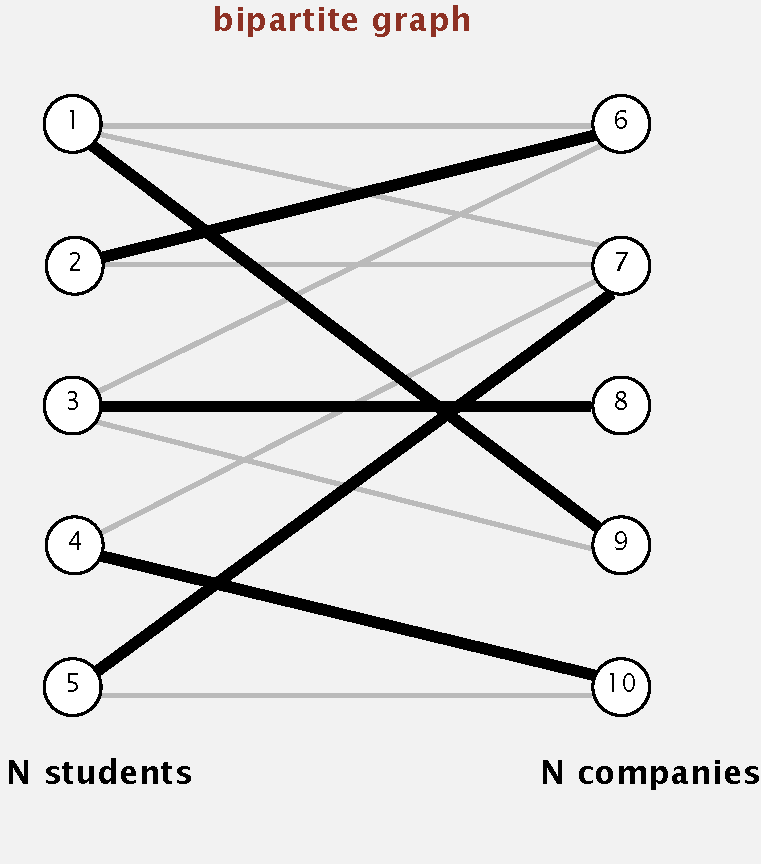

<procedure title="Bipartite Matching">
<step>
    
Create <math>s</math>, <math>t</math>, one vertex for each 
    student, and one vertex for each job.

</step>
<step>
    
Add edge from <math>s</math> to each student (capacity 1).

</step>
<step>
    
Add edge from each job to <math>t</math> (capacity 1).

</step>
<step>
    
Add edge from student to each job offered (infinite capacity).
    

</step>
<step>
    
1-1 correspondence between perfect matchings in bipartite graph
    and integer-valued maxflows of value <math>N</math>.

</step>
</procedure>

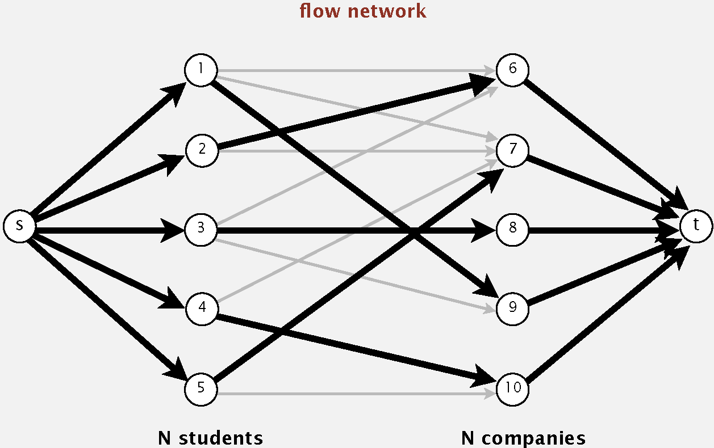

<format color="BlueViolet">When no perfect matching, mincut 
explains why</format>

Consider mincut (<math>A</math>, <math>B</math>): 

<list>
<li>Let <math>S</math> = students on <math>s</math> side of cut.</li>
<li>Let <math>T</math> = companies on <math>s</math> side of cut.</li>
<li>Fact: <math>\left| S \right| > \left| T \right|</math>; students 
in <math>S</math> can be matched only to companies in <math>T</math>.
</li>
</list>

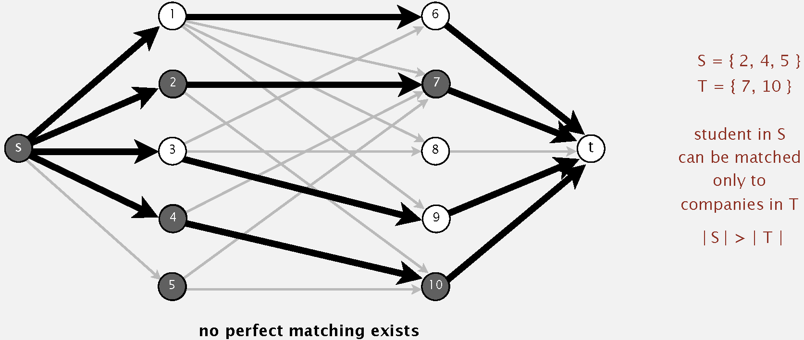

#### 18.6.2 Baseball Elimination

<format color="BlueViolet">Problem:</format> Which teams have a 
chance of finishing the season with the most wins?

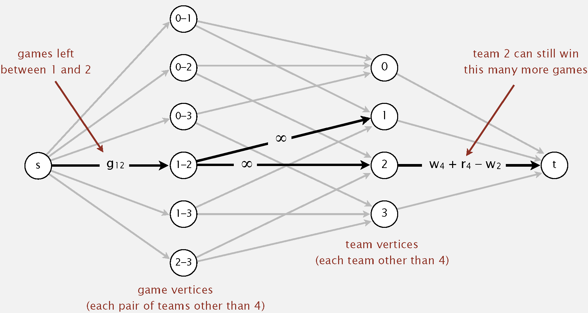

Team 4 not eliminated iff all edges pointing from s are full in 
maxflow.

<warning>
Team 4 not eliminated iff all edges pointing from s are full in 
maxflow.
</warning>

<note>
Push-relabel method with gap relabeling: <math>E^{\frac {3}{2}}
</math>.
</note>

## 19 Radix Sort

### 19.1 Strings in Java {id="strings-in-java"}

<format color="DarkOrange">String:</format> Sequence of characters.

<format color="BlueViolet">The char data type</format>

<list type="bullet">
<li><format color="Fuchsia">C char data type:</format> Typically an 
8-bit integer.
    <list type="bullet">
        <li>Supports 7-bit ASCII.</li>
        <li>Can represent only 256 characters.</li>
    </list>
</li>
<li><format color="Fuchsia">Java char data type:</format> A 16-bit 
unsigned integer.
    <list type="bullet">
        <li>Supports original 16-bit Unicode.</li>
        <li>Supports 21-bit Unicode 3.0 (awkwardly).</li>
    </list>
</li>
</list>

<format color="IndianRed">Examples</format>

<code-block lang="java" collapsible="true">
public class StringTest {
    public static void main(String[] args) {
        String s1 = "Hello";
        System.out.println(s1.length()); // 5
        System.out.println(s1.charAt(0)); // H
        System.out.println(s1.substring(0, 1)); // H
        System.out.println(s1.concat(" World")); // Hello World
    }
}
</code-block>

<table style="both">
<tr>
    <td colspan="2"></td>
    <td colspan="2">String</td>
    <td colspan="2">StringBuilder</td>
</tr>
<tr>
    <td colspan="2">Data Type in Java</td>
    <td colspan="2">Sequence of characters (immutable)</td>
    <td colspan="2">Sequence of characters (mutable)</td>
</tr>
<tr>
    <td colspan="2">Underlying Implementation</td>
    <td colspan="2">Immutable <code>char[]</code> array, offset, and 
    length</td>
    <td colspan="2">Resizing <code>char[]</code> array and length.
    </td>
</tr>
<tr>
    <td colspan="2"></td>
    <td>Guarantee</td>
    <td>Extra Space</td>
    <td>Guarantee</td>
    <td>Extra Space</td>
</tr>
<tr>
    <td rowspan="4">Operation</td>
    <td><code>length()</code></td>
    <td><math>1</math></td>
    <td><math>1</math></td>
    <td><math>1</math></td>
    <td><math>1</math></td>
</tr>
<tr>
    <td><code>charAt()</code></td>
    <td><math>1</math></td>
    <td><math>1</math></td>
    <td><math>1</math></td>
    <td><math>1</math></td>
</tr>
<tr>
    <td><code>substring()</code></td>
    <td><math>1</math></td>
    <td><math>1</math></td>
    <td><math>N</math></td>
    <td><math>N</math></td>
</tr>
<tr>
    <td><code>concat()</code></td>
    <td><math>N</math></td>
    <td><math>N</math></td>
    <td><math>1*</math></td>
    <td><math>1*</math></td>
</tr>
</table>

<note>
<list type="decimal">
<li>
    
<math>40 + 2N</math> bytes for a virgin String of length <math>
    N</math>.

</li>
<li>
    
StringBuffer data type is similar, but thread safe (and slower
    ).

</li>
</list>
</note>

### 19.2 Key-Indexed Counting

<format color="BlueViolet">Assumption:</format> Keys are integers 
between <math>0</math> and <math>R - 1</math>. Can use key as an array
index.

<format color="BlueViolet">Goal:</format> Sort an array of <math>N
</math> integers between <math>0</math> and <math>R - 1</math>.

<procedure title="Key-Indexed Counting">
<step>Count frequencies of each letter using key as index.</step>
<step>Compute frequency cumulates which specify destinations.</step>
<step>Access cumulates using key as index to move items.</step>
<step>Copy back into original array.</step>
</procedure>

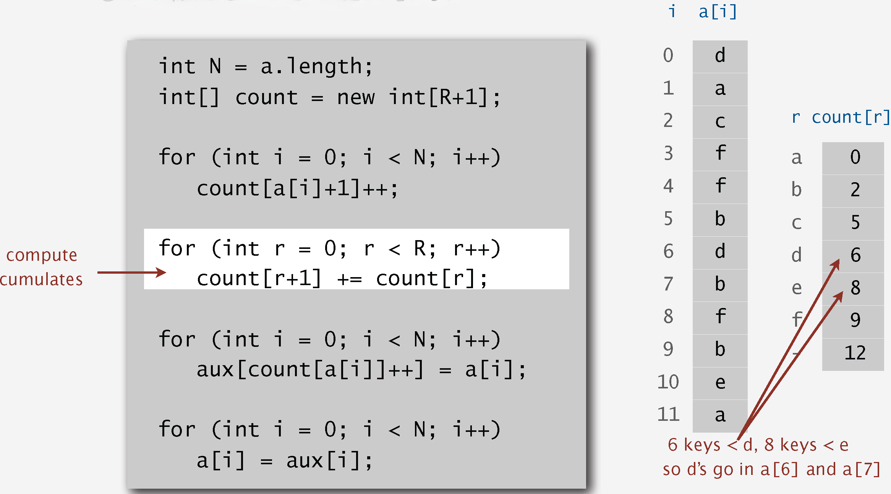

<format color="BlueViolet">Properties</format>

<list type="bullet">
<li>Key-indexed counting uses <math>\sim 11 N + 4 R</math> array 
accesses to sort <math>N</math> items whose keys are integers between
<math>0</math> and <math>R - 1</math>.</li>
<li>Key-indexed counting uses extra space proportional to <math>
N + R</math>.</li>
<li>Key-indexed counting is stable.</li>
</list>

<tabs>
    <tab title="Java">
    <code-block lang="java" collapsible="true">
public class KeyIndexedSorting {
    public static void sort(Squirrel[] students) {
        int N = students.length;
        int R = 5; // Assuming grades are from 0 to 4
\/
        int[] count = new int[R + 1];
        for (Squirrel student : students) {
            count[student.grade + 1]++;
        }
\/
        for (int r = 0; r &lt; R; r++) {
            count[r + 1] += count[r];
        }
\/
        Squirrel[] aux = new Squirrel[N];
        for (Squirrel student : students) {
            aux[count[student.grade]++] = student;
        }
\/
        System.arraycopy(aux, 0, students, 0, N);
    }
\/
    static class Squirrel {
        String name;
        int grade;
\/
        public Squirrel(String name, int grade) {
            this.name = name;
            this.grade = grade;
        }
\/
        @Override
        public String toString() {
            return name + " (Grade: " + grade + ")";
        }
    }
}
    </code-block>
    </tab>
    <tab title="C++">
    <code-block lang="c++" collapsible="true">
#include &lt;iostream&gt;
#include &lt;utility&gt;
#include &lt;vector&gt;
#include &lt;string&gt;
\/
struct Squirrel {
    std::string name;
    int grade;
\/
    Squirrel(std::string n, const int g) : name(std::move(n)), grade(g) {}
\/
    friend std::ostream& operator&lt;&lt;(std::ostream& os, const Squirrel& s) {
        os &lt;&lt; s.name &lt;&lt; " (Grade: " &lt;&lt; s.grade &lt;&lt; ")";
        return os;
    }
};
\/
void sort(std::vector&lt;Squirrel&gt;& students) {
    const int N = static_cast&lt;int&gt;(students.size());
    constexpr int R = 5; // Assuming grades are from 0 to 4
\/
    std::vector&lt;int&gt; count(R + 1, 0);
    for (int i = 0; i &lt; N; i++) {
        count[students[i].grade + 1]++;
    }
\/
    for (int r = 0; r &lt; R; r++) {
        count[r + 1] += count[r];
    }
\/
    std::vector&lt;Squirrel&gt; aux(N);
    for (int i = 0; i &lt; N; i++) {
        aux[count[students[i].grade]++] = students[i];
    }
\/
    students = aux;
}
    </code-block>
    </tab>
    <tab title="Python">
    <code-block lang="python" collapsible="true">
class Squirrel:
    def __init__(self, name, grade):
        self.name = name
        self.grade = grade
\/
    def __str__(self):
        return f"{self.name} (Grade: {self.grade})"
\/
def sort(students):
    N = len(students)
    R = 5  # Assuming grades are from 0 to 4
\/
    count = [0] * (R + 1)
    for student in students:
        count[student.grade + 1] += 1
\/
    for r in range(R):
        count[r + 1] += count[r]
\/
    aux = [None] * N
    for student in students:
        aux[count[student.grade]] = student
        count[student.grade] += 1
\/
    students[:] = aux 
    </code-block>
    </tab>
</tabs>

### 19.3 LSD Radix Sort {id="lsd"}

<procedure title="LSD Radix Sort">
<step>Consider characters from right to left.</step>
<step>Stably sort using dth character as the key (using key-indexed 
counting).</step>
</procedure>

<format color="BlueViolet">Correctness Proof:</format> LSD sorts 
fixed-length strings in ascending order.

<format color="LawnGreen">Proof</format>

After pass <math>i</math>, strings are sorted by last <math>i
</math> characters.

<list>
<li>If two strings differ on sort key, key-indexed sort puts them in
proper relative order.</li>
<li>If two strings agree on sort key, stability keeps them in proper
relative order.</li>
</list>

<format color="BlueViolet">Property:</format> LSD sort is stable.

Google (or presidential) Interview Question: Sort one million 
32-bit integers using LSD radix sort.

<note>
For information about the performance of insertion sort, please refer
to the <a anchor="sortperf" 
summary="Table for Comparing Performance of Sorting Algorithm">table 
for sorting performance</a>.
</note>

<tabs>
    <tab title="Java">
    <code-block lang="java" collapsible="true">
public class LSDStringSort {
    public static void sort(String[] a, int W) {
        int N = a.length;
        int R = 256; // extended ASCII alphabet size
        String[] aux = new String[N];
\/
        for (int d = W - 1; d &gt;= 0; d--) {
            int[] count = new int[R + 1];
            for (String string : a) {
                count[string.charAt(d) + 1]++;
            }
\/
            for (int r = 0; r &lt; R; r++) {
                count[r + 1] += count[r];
            }
\/
            for (String s : a) {
                aux[count[s.charAt(d)]++] = s;
            }
\/
            System.arraycopy(aux, 0, a, 0, N);
        }
    }
}
    </code-block>
    </tab>
    <tab title="C++">
    <code-block lang="c++" collapsible="true">
#include &lt;iostream&gt;
#include &lt;string&gt;
#include &lt;vector&gt;
\/
void lsdSort(std::vector&lt;std::string&gt;& a, const int w) {
    const int n = static_cast&lt;int&gt;(a.size());
    int R = 256; 
    std::vector&lt;std::string&gt; aux(n);
\/
    for (int d = w - 1; d &gt;= 0; d--) {
        std::vector&lt;int&gt; count(R + 1, 0);
\/
        for (int i = 0; i &lt; n; i++) {
            count[a[i][d] + 1]++;
        }
\/
        for (int r = 0; r &lt; R; r++) {
            count[r + 1] += count[r];
        }
\/
        for (int i = 0; i &lt; n; i++) {
            aux[count[a[i][d]]++] = a[i];
        }
\/
        for (int i = 0; i &lt; n; i++) {
            a[i] = aux[i];
        }
    }
}
    </code-block>
    </tab>
    <tab title="Python">
    <code-block lang="python" collapsible="true">
def lsd_sort(a, w):
    n = len(a)
    R = 256 
    aux = [""] * n
\/
    for d in range(w - 1, -1, -1):
        count = [0] * (R + 1)
\/
        for i in range(n):
            count[ord(a[i][d]) + 1] += 1
\/
        for r in range(R):
            count[r + 1] += count[r]
\/
        for i in range(n):
            aux[count[ord(a[i][d])]] = a[i]
            count[ord(a[i][d])] += 1
\/
        a[:] = aux 
    </code-block>
    </tab>
</tabs>

### 19.4 MSD Radix Sort {id="msd"}

<procedure title="MSD Radix Sort">
<step>Partition array into <math>R</math> pieces according to first 
character (use key-indexed counting).</step>
<step>Recursively sort all strings that start with each character 
(key-indexed counts delineate subarrays to sort).</step>
</procedure>

<format color="BlueViolet">Variable-length strings:</format> Treat
strings as if they had an extra char at end (smaller than any char)

<note>
C strings =>Have extra char '\0' at end => no extra work needed.
</note>

<format color="BlueViolet">Potential for Disastrous Performance:
</format> 

<list type="decimal">
<li>

Much too slow for small subarrays.

    <list type="bullet">
    <li>Each function call needs its own <code>count[]</code> array.
    </li>
    <li>ASCII (256 counts): 100x slower than copy pass for <math>
    N = 2</math>.</li>
    <li>Unicode (65,536 counts): 32,000x slower for <math>N = 2
    </math>.</li>
    </list>
</li>
<li>

Huge number of small subarrays because of recursion.

</li>
</list>

<format color="BlueViolet">Improvements</format>

Cutoff to insertion sort for small subarrays.

<list type="bullet">
<li>Insertion sort, but start at <math>d^{th}</math> character.</li>
<li>Implement <code>less()</code> so that it compares starting at 
<math>d^{th}</math> character.</li>
</list>

<format color="BlueViolet">Performance</format>

Number of characters examined.

<list>
<li>MSD examines just enough characters to sort the keys.</li>
<li>Number of characters examined depends on keys.</li>
<li>Can be sublinear in input size!</li>
</list>

<format color="BlueViolet">MSD String Sort vs. Quicksort for 
Strings</format>

<list type="alpha-lower">
<li>

<format color="Fuchsia">Disadvantages of MSD string sort:</format>

    <list type="bullet">
    <li>Extra space for aux[] arrays.</li>
    <li>Extra space for count[] arrays.</li>
    <li>Inner loop has a lot of instructions.</li>
    <li>Accesses memory "randomly" (cache inefficient).</li>
    </list>
</li>
<li>

<format color="Fuchsia">Disadvantage of quicksort</format>

    <list type="bullet">
    <li>Linearithmic number of string compares (not linear).</li>
    <li>Has to rescan many characters in keys with long prefix matches
    .</li>
    </list>
</li>
</list>

<note>
For information about the performance of MSD radix sort, please refer
to the <a anchor="sortperf" summary=
"Table for Comparing Performance of Sorting Algorithm">table for 
sorting performance</a>.
</note>

<tabs>
    <tab title="Java">
    <code-block lang="java" collapsible="true">
public class MSDStringSort {
    private static final int R = 256;
    private static final int CUTOFF = 15;
\/
    public static void sort(String[] a) {
        String[] aux = new String[a.length];
        sort(a, aux, 0, a.length - 1, 0);
    }
\/
    private static void sort(String[] a, String[] aux, int low, int high, int d) {
        if (high &lt;= low + CUTOFF) {
            insertionSort(a, low, high, d);
            return;
        }
\/
        int[] count = new int[R + 2];
        for (int i = low; i &lt;= high; i++) {
            int c = charAt(a[i], d);
            count[c + 2]++;
        }
\/
        for (int r = 0; r &lt; R + 1; r++) {
            count[r + 1] += count[r];
        }
\/
        for (int i = low; i &lt;= high; i++) {
            int c = charAt(a[i], d);
            aux[count[c + 1]++] = a[i];
        }
\/
        if (high + 1 - low &gt;= 0) System.arraycopy(aux, 0, a, low, high + 1 - low);
\/
        for (int r = 0; r &lt; R; r++) {
            sort(a, aux, low + count[r], low + count[r + 1] - 1, d + 1);
        }
    }
\/
    private static int charAt(String s, int d) {
        if (d &lt; s.length()) {
            return s.charAt(d);
        } else {
            return -1;
        }
    }
\/
    private static void insertionSort(String[] a, int low, int high, int d) {
        for (int i = low; i &lt;= high; i++) {
            for (int j = i; j &gt; low && less(a[j], a[j - 1], d); j--) {
                swap(a, j, j - 1);
            }
        }
    }
\/
    private static boolean less(String v, String w, int d) {
        return v.substring(d).compareTo(w.substring(d)) &lt; 0;
    }
\/
    private static void swap(String[] a, int i, int j) {
        String temp = a[i];
        a[i] = a[j];
        a[j] = temp;
    }
}
    </code-block>
    </tab>
    <tab title="C++">
    <code-block lang="c++" collapsible="true">
#include &lt;vector&gt;
#include &lt;string&gt;
#include &lt;algorithm&gt;
#include &lt;iostream&gt;
\/
class MSDStringSort {
private:
    static constexpr int R = 256;
    static constexpr int CUTOFF = 15;
\/
public:
    static void sort(std::vector&lt;std::string&gt;& a) {
        std::vector&lt;std::string&gt; aux(a.size());
        sort(a, aux, 0, static_cast&lt;int&gt;(a.size()) - 1, 0);
    }
\/
private:
    static void sort(std::vector&lt;std::string&gt;& a, std::vector&lt;std::string&gt;& aux, const int low, const int high, const int d) {
        if (high &lt;= low + CUTOFF) {
            insertionSort(a, low, high, d);
            return;
        }
\/
        std::vector&lt;int&gt; count(R + 2, 0);
        for (int i = low; i &lt;= high; i++) {
            const int c = charAt(a[i], d);
            count[c + 2]++;
        }
\/
        for (int r = 0; r &lt; R + 1; r++) {
            count[r + 1] += count[r];
        }
\/
        for (int i = low; i &lt;= high; i++) {
            const int c = charAt(a[i], d);
            aux[count[c + 1]++] = a[i];
        }
\/
        std::copy_n(aux.begin(), (high + 1 - low), a.begin() + low);
\/
        for (int r = 0; r &lt; R; r++) {
            sort(a, aux, low + count[r], low + count[r + 1] - 1, d + 1);
        }
    }
\/    
    static int charAt(const std::string& s, const int d) {
        if (d &lt; s.length()) {
            return s[d];
        } else {
            return -1;
        }
    }
\/
    static void insertionSort(std::vector&lt;std::string&gt;& a, const int low, const int high, const int d) {
        for (int i = low; i &lt;= high; i++) {
            for (int j = i; j &gt; low && less(a[j], a[j - 1], d); j--) {
                std::swap(a[j], a[j - 1]);
            }
        }
    }
\/
    static bool less(const std::string& v, const std::string& w, const int d) {
        return v.substr(d) &lt; w.substr(d);
    }
};
    </code-block>
    </tab>
    <tab title="Python">
    <code-block lang="python" collapsible="true">
def char_at(s, d):
    if d &lt; len(s):
        return ord(s[d])
    else:
        return -1
\/
def insertion_sort(arr, low, high, d):
    for i in range(low, high + 1):
        for j in range(i, low, -1):
            if arr[j][d:] &lt; arr[j - 1][d:]:
                arr[j], arr[j - 1] = arr[j - 1], arr[j]
            else:
                break
\/
def msd_string_sort(arr):
    CUTOFF = 15
    aux = [None] * len(arr)
    sort(arr, 0, len(arr) - 1, 0, aux, CUTOFF)
\/
def sort(arr, low, high, d, aux, CUTOFF):
    if high &lt;= low + CUTOFF:
        insertion_sort(arr, low, high, d)
        return
\/
    R = 256
    count = [0] * (R + 2)
\/
    for i in range(low, high + 1):
        c = char_at(arr[i], d)
        count[c + 2] += 1
\/
    for r in range(R + 1):
        count[r + 1] += count[r]
\/
    for i in range(low, high + 1):
        c = char_at(arr[i], d)
        aux[count[c + 1]] = arr[i]
        count[c + 1] += 1
\/
    for i in range(low, high + 1):
        arr[i] = aux[i - low]
\/
    for r in range(R):
        sort(arr, low + count[r], low + count[r + 1] - 1, d + 1, aux, CUTOFF)
    </code-block>
    </tab>
</tabs>

### 19.5 3-Way Radix Quicksort {id="3Q"}

Do 3-way partitioning on the <math>d^{th}</math> character.

<format color="BlueViolet">Properties</format>

<list>
<li>Less overhead than R-way partitioning in MSD string sort.</li>
<li>

Does not re-examine characters equal to the partitioning char.

(but does re-examine characters not equal to the partitioning char)

</li>
</list>

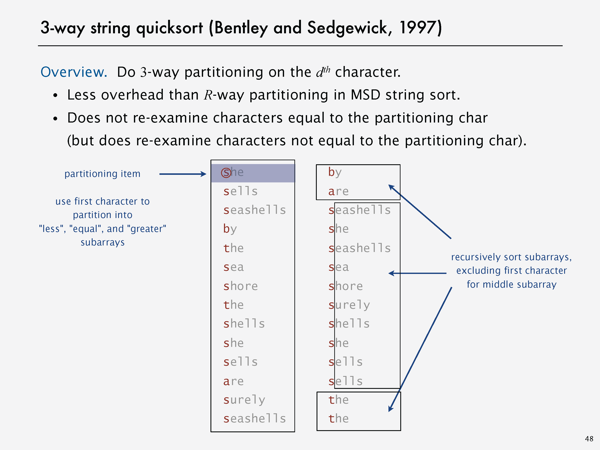

<format color="BlueViolet">3-Way String Quicksort vs. Standard 
Quicksort</format>

<list type="decimal">
<li>

<format color="Fuchsia">Standard quicksort</format>

    <list type="bullet">
    <li>Uses ~ 2 N ln N string compares on average.</li>
    <li>Costly for keys with long common prefixes (and this is a 
    common case!)</li>
    </list>
</li>
<li>

<format color="Fuchsia">3-way string (radix) quicksort</format>

    <list type="bullet">
    <li>Uses ~ 2 N ln N character compares on average for random strings.</li>
    <li>Avoids re-comparing long common prefixes.</li>
    </list>
</li>
</list>

<format color="BlueViolet">3-way String !uicksort vs. MSD String 
Sort</format>

<list type="decimal">
<li>

<format color="Fuchsia">MSD string sort</format>

    <list type="bullet">
    <li>Is cache-inefficient.</li>
    <li>Too much memory storing count[].</li>
    <li>Too much overhead reinitializing count[] and aux[].</li>
    </list>
</li>
<li>

<format color="Fuchsia">3-way string quicksort</format>

    <list>
    <li>Has a short inner loop.</li>
    <li>Is cache-friendly.</li>
    <li>Is in-place.</li>
    </list>
</li>
</list>

<tabs>
    <tab title="Java">
    <code-block lang="java" collapsible="true">
public class ThreeWayRadixQuicksortStrings {
\/
    private static final int CUTOFF = 15;
\/
    private static int charAt(String s, int d) {
        if (d &lt; s.length()) return s.charAt(d);
        else return -1;
    }
\/
    public static void sort(String[] a) {
        sort(a, 0, a.length - 1, 0);
    }
\/
    private static void sort(String[] a, int lo, int hi, int d) {
        if (hi &lt;= lo + CUTOFF) {
            insertionSort(a, lo, hi, d);
            return;
        }
\/
        int lt = lo, gt = hi;
        int v = charAt(a[lo], d);
        int i = lo + 1;
        while (i &lt;= gt) {
            int t = charAt(a[i], d);
            if (t &lt; v) exch(a, lt++, i++);
            else if (t &gt; v) exch(a, i, gt--);
            else i++;
        }
\/
        sort(a, lo, lt - 1, d);
        if (v &gt;= 0) sort(a, lt, gt, d + 1);
        sort(a, gt + 1, hi, d);
    }
\/
    private static void insertionSort(String[] a, int lo, int hi, int d) {
        for (int i = lo; i &lt;= hi; i++) {
            for (int j = i; j &gt; lo && less(a[j], a[j - 1], d); j--) {
                exch(a, j, j - 1);
            }
        }
    }
\/
    private static boolean less(String v, String w, int d) {
        for (int i = d; i &lt; Math.min(v.length(), w.length()); i++) {
            if (v.charAt(i) &lt; w.charAt(i)) return true;
            if (v.charAt(i) &gt; w.charAt(i)) return false;
        }
        return v.length() &lt; w.length();
    }
\/
    private static void exch(String[] a, int i, int j) {
        String temp = a[i];
        a[i] = a[j];
        a[j] = temp;
    }
}
    </code-block>
    </tab>
    <tab title="C++">
    <code-block lang="c++" collapsible="true">
#include &lt;iostream&gt;
#include &lt;vector&gt;
#include &lt;string&gt;
\/
class ThreeWayRadixQuicksortStrings {
private:
    static constexpr int CUTOFF = 15; 
\/
    static int charAt(const std::string& s, const int d) {
        if (d &lt; s.length()) return s[d];
        else return -1;
    }
\/
    static void sort(std::vector&lt;std::string&gt;& a, const int lo, const int hi, const int d) {
        if (hi &lt;= lo + CUTOFF) {
            insertionSort(a, lo, hi, d);
            return;
        }
\/
        int lt = lo, gt = hi;
        const int v = charAt(a[lo], d);
        int i = lo + 1;
        while (i &lt;= gt) {
            int t = charAt(a[i], d);
            if (t &lt; v) std::swap(a[lt++], a[i++]);
            else if (t &gt; v) std::swap(a[i], a[gt--]);
            else i++;
        }
\/
        sort(a, lo, lt - 1, d);
        if (v &gt;= 0) sort(a, lt, gt, d + 1);
        sort(a, gt + 1, hi, d);
    }
\/
    static void insertionSort(std::vector&lt;std::string&gt;& a, const int lo, const int hi, const int d) {
        for (int i = lo; i &lt;= hi; i++) {
            for (int j = i; j &gt; lo && less(a[j], a[j - 1], d); j--) {
                std::swap(a[j], a[j - 1]);
            }
        }
    }
\/
    static bool less(const std::string& v, const std::string& w, const int d) {
        for (int i = d; i &lt; std::min(v.length(), w.length()); i++) {
            if (v[i] &lt; w[i]) return true;
            if (v[i] &gt; w[i]) return false;
        }
        return v.length() &lt; w.length();
    }
\/
public:
    static void sort(std::vector&lt;std::string&gt;& a) {
        sort(a, 0, static_cast&lt;int&gt;(a.size()) - 1, 0);
    }
};
    </code-block>
    </tab>
    <tab title="Python">
    <code-block lang="python" collapsible="true">
CUTOFF = 15
\/
def char_at(s, d):
    if d &lt; len(s):
        return ord(s[d])
    else:
        return -1
\/
def insertion_sort(arr, lo, hi, d):
    for i in range(lo, hi + 1):
        for j in range(i, lo, -1):
            if arr[j][d:] &lt; arr[j - 1][d:]:
                arr[j], arr[j - 1] = arr[j - 1], arr[j]
            else:
                break
\/
def three_way_radix_quicksort(arr):
    def sort(arr, lo, hi, d):
        if hi &lt;= lo + CUTOFF:
            insertion_sort(arr, lo, hi, d)
            return
        lt, gt = lo, hi
        v = char_at(arr[lo], d)
        i = lo + 1
        while i &lt;= gt:
            t = char_at(arr[i], d)
            if t &lt; v:
                arr[lt], arr[i] = arr[i], arr[lt]
                lt += 1
                i += 1
            elif t &gt; v:
                arr[gt], arr[i] = arr[i], arr[gt]
                gt -= 1
            else:
                i += 1
        sort(arr, lo, lt - 1, d)
        if v &gt;= 0:
            sort(arr, lt, gt, d + 1)
        sort(arr, gt + 1, hi, d)
\/
    sort(arr, 0, len(arr) - 1, 0)
    </code-block>
    </tab>
</tabs>

<format color="BlueViolet">Summary of the Performance of Sorting 
Algorithms</format>

<table style="header-row" id="sortperf">
<tr>
    <td>Algorithm</td>
    <td>Guarantee</td>
    <td>Random</td>
    <td>Extra Space</td>
    <td>Stable?</td>
    <td>Operations on keys</td>
</tr>
<tr>
    <td><a href="Data-Structures-and-Algorithms-1.topic" anchor=
    "insertion-sort" summary="Insertion Sort">Insertion Sort</a></td>
    <td><math>\frac {1}{2} N^{2}</math></td>
    <td><math>\frac {1}{4} N^{2}</math></td>
    <td><math>1</math></td>
    <td>Yes</td>
    <td><code>compareTo()</code></td>
</tr>
<tr>
    <td><a href="Data-Structures-and-Algorithms-1.topic" anchor=
    "mergesort" summary="Mergesort">Mergesort</a></td>
    <td><math>N \lg N</math></td>
    <td><math>N \lg N</math></td>
    <td><math>N</math></td>
    <td>Yes</td>
    <td><code>compareTo()</code></td>
</tr>
<tr>
    <td><a href="Data-Structures-and-Algorithms-1.topic" anchor=
    "quicksort" summary="Quicksort">Quicksort</a></td>
    <td><math>1.39 N \lg N</math> *</td>
    <td><math>1.39 N \lg N</math></td>
    <td><math>c \lg N</math></td>
    <td>No</td>
    <td><code>compareTo()</code></td>
</tr>
<tr>
    <td><a href="Data-Structures-and-Algorithms-1.topic" anchor=
    "heapsort" summary="Heapsort">Heapsort</a></td>
    <td><math>2 N \lg N</math></td>
    <td><math>2 N \lg N</math></td>
    <td><math>1</math></td>
    <td>No</td>
    <td><code>compareTo()</code></td>
</tr>
<tr>
    <td><a anchor="lsd" summary="LSD Radix Sort">LSD&star;</a></td>
    <td><math>2 N W</math></td>
    <td><math>2 N W</math></td>
    <td><math>N + R</math></td>
    <td>Yes</td>
    <td><code>charAt()</code></td>
</tr>
<tr>
    <td><a anchor="msd" summary="MSD Radix Sort">MSD&starf;</a></td>
    <td><math>2 N W</math></td>
    <td><math>N \log_{R} N</math></td>
    <td><math>N + D R</math></td>
    <td>Yes</td>
    <td><code>charAt()</code></td>
</tr>
<tr>
    <td><a anchor="3Q" summary="3-Way Radix Quicksort">3-Way String 
    Quicksort</a></td>
    <td><math>1.39 W N \lg R</math> *</td>
    <td><math>1.39 N \lg N</math></td>
    <td><math>\log N + W</math></td>
    <td>No</td>
    <td><code>charAt()</code></td>
</tr>
</table>

*: probabilistic

&star;: fixed-length W keys

&starf;: average-length W keys

### 19.6 Suffix Arrays

<format color="BlueViolet">Keyword in context search:</format> 
Given a text of N characters, preprocess it to enable fast substring 
search (find all occurrences of query string context).

<format color="BlueViolet">Applications:</format> Linguistics, 
databases, web search, word processing, ...

<format color="BlueViolet">Keyword-in-context search:</format> 
suffix-sorting solution.

<list type="bullet">
<li>

<format color="Fuchsia">Preprocess:</format> <format color=
"OrangeRed">suffix sort</format> the text.

</li>
<li>

<format color="Fuchsia">Query:</format> binary search for query; 
scan until mismatch.

</li>
</list> 

## 20 Tries

### 20.1 R-Way Tries {id="rway"}

<format color="BlueViolet">Tries (from retrieval, but pronounced 
"try"):</format> Store characters in nodes (not keys), each node has
<math>R</math> children, one for each possible character.

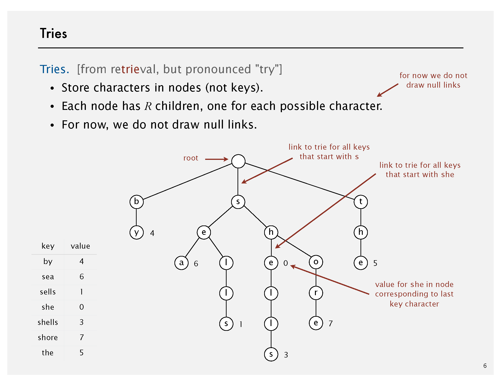

<procedure title="Trie Search">
<step>
    
Follow links corresponding to each character in the key.

</step>
<step>
    
<format color="Fuchsia">Search hit:</format> node where search
    ends has a non-null value.

</step>
<step>
    
<format color="Fuchsia">Search miss:</format> reach null link 
    or node where search ends has null value.

</step>
</procedure>

<procedure title="Trie Delete">
<step>
    
Find the node corresponding to key and set value to null.

</step>
<step>
    
If node has null value and all null links, remove that node 
    (and recur).

</step>
</procedure>

<tabs>
    <tab title="Java">
    <code-block lang="java" collapsible="true">
import java.util.HashMap;
\/
public class RWayTrie {
\/
    private static final int R = 256;
\/
    private final Node root;
\/
    private static class Node {
        private boolean isEndOfWord;
        private final HashMap&lt;Character, Node&gt; children;
\/
        public Node() {
            isEndOfWord = false;
            children = new HashMap&lt;&gt;();
        }
    }
\/
    public RWayTrie() {
        root = new Node();
    }
\/
    public void insert(String word) {
        Node current = root;
        for (char c : word.toCharArray()) {
            if (!current.children.containsKey(c)) {
                current.children.put(c, new Node());
            }
            current = current.children.get(c);
        }
        current.isEndOfWord = true;
    }
\/
    public boolean search(String word) {
        Node current = root;
        for (char c : word.toCharArray()) {
            if (!current.children.containsKey(c)) {
                return false;
            }
            current = current.children.get(c);
        }
        return current.isEndOfWord;
    }
\/
    public boolean startsWith(String prefix) {
        Node current = root;
        for (char c : prefix.toCharArray()) {
            if (!current.children.containsKey(c)) {
                return false;
            }
            current = current.children.get(c);
        }
        return true;
    }
}
    </code-block>
    </tab>
    <tab title="C++">
    <code-block lang="c++" collapsible="true">
#include &lt;iostream&gt;
#include &lt;unordered_map&gt;
#include &lt;ranges&gt;
\/
constexpr int R = 26;
\/
struct Node {
    bool isEndOfWord;
    std::unordered_map&lt;char, Node*&gt; children;
\/
    Node() : isEndOfWord(false) {}
};
\/
class RWayTrie {
private:
    Node* root;
\/
    static void deleteNode(Node* node) {
        if (node == nullptr) {
            return;
        }
\/
        for (Node* child : node-&gt;children | std::views::values) {
            deleteNode(child);
        }
\/
        delete node;
    }
\/
public:
    RWayTrie() {
        root = new Node();
    }
\/
    void insert(const std::string& word) const
    {
        Node* current = root;
        for (char c : word) {
            if (!current-&gt;children.contains(c)) {
                current-&gt;children[c] = new Node();
            }
            current = current-&gt;children[c];
        }
        current-&gt;isEndOfWord = true;
    }
\/
    [[nodiscard]] bool search(const std::string& word) const {
        Node* current = root;
        for (char c : word) {
            if (!current-&gt;children.contains(c)) {
                return false;
            }
            current = current-&gt;children[c];
        }
        return current-&gt;isEndOfWord;
    }
\/
    [[nodiscard]] bool startsWith(const std::string& prefix) const {
        Node* current = root;
        for (char c : prefix) {
            if (!current-&gt;children.contains(c)) {
                return false;
            }
            current = current-&gt;children[c];
        }
        return true;
    }
\/
    ~RWayTrie() {
        deleteNode(root);
    }
};
    </code-block>
    </tab>
    <tab title="Python">
    <code-block lang="python" collapsible="true">
class Node:
    def __init__(self):
        self.isEndOfWord = False
        self.children = {}  # Dictionary to store child nodes
\/
\/
class RWayTrie:
    def __init__(self):
        self.root = Node()
\/
    def insert(self, word):
        current = self.root
        for char in word:
            if char not in current.children:
                current.children[char] = Node()
            current = current.children[char]
        current.isEndOfWord = True
\/
    def search(self, word):
        current = self.root
        for char in word:
            if char not in current.children:
                return False
            current = current.children[char]
        return current.isEndOfWord
\/
    def startsWith(self, prefix):
        current = self.root
        for char in prefix:
            if char not in current.children:
                return False
            current = current.children[char]
        return True
    </code-block>
    </tab>
</tabs>

### 20.2 Ternary Search Tries {id="tst"}

<format color="BlueViolet">Ternary Search Trees</format>

<list type="bullet">
<li>
    
Store characters and values in nodes (not keys).

</li>
<li>
    
Each node has 3 children: smaller (left), equal (middle), 
    larger (right).

</li>
</list>

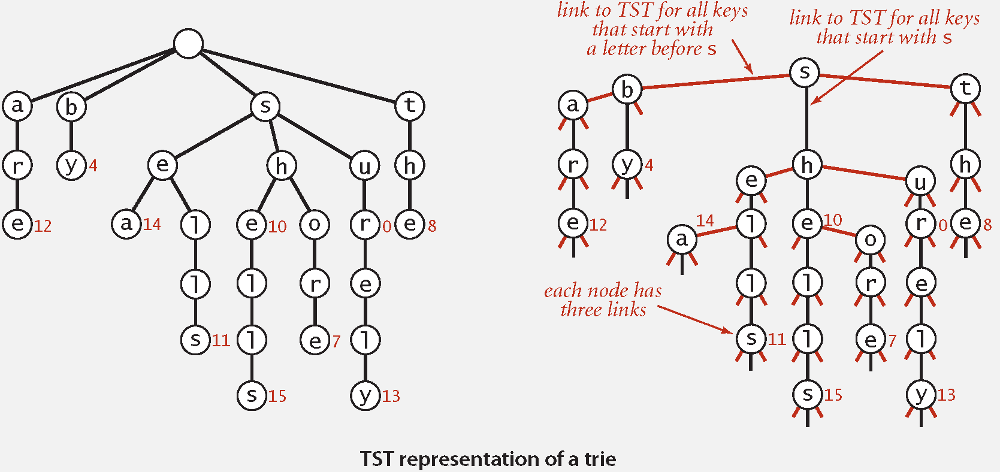

<procedure title="TST Search">
<step>
    
Follow links corresponding to each character in the key.

    <list type="bullet">
    <li>
    
If less, take left link; if greater, take right link.

    </li>
    <li>
    
If equal, take the middle link and move to the next key character.
    

    </li>
    </list>
</step>
<step>
    
Search hit & miss: 

    <list type="bullet">
    <li>
    
<format color="Fuchsia">Search hit:</format> Node where search 
    ends has a non-null value.

    </li>
    <li>
    
<format color="Fuchsia">Search miss:</format> Reach null link 
    or node where search ends has null value.

    </li>
    </list>
</step>
</procedure>

<tabs>
    <tab title="Java">
    <code-block lang="java" collapsible="true">
public class TernarySearchTree {
\/
    private Node root;
\/
    private static class Node {
        char data;
        boolean isEndOfString;
        Node left, equal, right;
\/
        public Node(char data) {
            this.data = data;
            this.isEndOfString = false;
            this.left = null;
            this.equal = null;
            this.right = null;
        }
    }
\/
    public TernarySearchTree() {
        root = null;
    }
\/
    public void insert(String word) {
        root = insertRecursive(root, word, 0);
    }
\/
    private Node insertRecursive(Node node, String word, int index) {
        char c = word.charAt(index);
\/
        if (node == null) {
            node = new Node(c);
        }
\/
        if (c &lt; node.data) {
            node.left = insertRecursive(node.left, word, index);
        } else if (c &gt; node.data) {
            node.right = insertRecursive(node.right, word, index);
        } else {
            if (index &lt; word.length() - 1) {
                node.equal = insertRecursive(node.equal, word, index + 1);
            } else {
                node.isEndOfString = true;
            }
        }
        return node;
    }
\/
    public boolean search(String word) {
        return searchRecursive(root, word, 0);
    }
\/
    private boolean searchRecursive(Node node, String word, int index) {
        if (node == null) {
            return false;
        }
\/
        char c = word.charAt(index);
\/
        if (c &lt; node.data) {
            return searchRecursive(node.left, word, index);
        } else if (c &gt; node.data) {
            return searchRecursive(node.right, word, index);
        } else {
            if (index == word.length() - 1) {
                return node.isEndOfString;
            } else {
                return searchRecursive(node.equal, word, index + 1);
            }
        }
    }
\/
    public void getWordsWithPrefix(String prefix) {
        Node node = getPrefixNode(root, prefix, 0);
        if (node != null) {
            traverseAndPrint(node, prefix);
        }
    }
\/
    private Node getPrefixNode(Node node, String prefix, int index) {
        if (node == null) {
            return null;
        }
\/
        char c = prefix.charAt(index);
\/
        if (c &lt; node.data) {
            return getPrefixNode(node.left, prefix, index);
        } else if (c &gt; node.data) {
            return getPrefixNode(node.right, prefix, index);
        } else {
            if (index == prefix.length() - 1) {
                return node;
            } else {
                return getPrefixNode(node.equal, prefix, index + 1);
            }
        }
    }
\/
    private void traverseAndPrint(Node node, String prefix) {
        if (node == null) {
            return;
        }
\/
        if (node.isEndOfString) {
            System.out.println(prefix);
        }
\/
        traverseAndPrint(node.left, prefix);
        traverseAndPrint(node.equal, prefix + node.data);
        traverseAndPrint(node.right, prefix);
    }
}
    </code-block>
    </tab>
    <tab title="C++">
    <code-block lang="c++" collapsible="true">
#include &lt;iostream&gt;
#include &lt;string&gt;
\/
class TernarySearchTree {
private:
    struct Node {
        char data;
        bool isEndOfString;
        Node *left, *equal, *right;
\/
        explicit Node(const char data) : data(data), isEndOfString(false), left(nullptr), equal(nullptr), right(nullptr) {}
    };
\/
    Node *root;
\/
    static Node* insertRecursive(Node* node, const std::string& word, const int index) {
        const char c = word[index];
\/
        if (node == nullptr) {
            node = new Node(c);
        }
\/
        if (c &lt; node-&gt;data) {
            node-&gt;left = insertRecursive(node-&gt;left, word, index);
        } else if (c &gt; node-&gt;data) {
            node-&gt;right = insertRecursive(node-&gt;right, word, index);
        } else {
            if (index &lt; word.length() - 1) {
                node-&gt;equal = insertRecursive(node-&gt;equal, word, index + 1);
            } else {
                node-&gt;isEndOfString = true;
            }
        }
        return node;
    }
\/
    static bool searchRecursive(const Node* node, const std::string& word, const int index) {
        if (node == nullptr) {
            return false;
        }
\/
        const char c = word[index];
\/
        if (c &lt; node-&gt;data) {
            return searchRecursive(node->left, word, index);
        } else if (c &gt; node-&gt;data) {
            return searchRecursive(node->right, word, index);
        } else {
            if (index == word.length() - 1) {
                return node-&gt;isEndOfString;
            } else {
                return searchRecursive(node-&gt;equal, word, index + 1);
            }
        }
    }
\/
    static Node* getPrefixNode(Node* node, const std::string& prefix, const int index) {
        if (node == nullptr) {
            return nullptr;
        }
\/
        const char c = prefix[index];
\/
        if (c &lt; node-&gt;data) {
            return getPrefixNode(node-&gt;left, prefix, index);
        } else if (c &gt; node-&gt;data) {
            return getPrefixNode(node-&gt;right, prefix, index);
        } else {
            if (index == prefix.length() - 1) {
                return node;
            } else {
                return getPrefixNode(node->equal, prefix, index + 1);
            }
        }
    }
\/
    static void traverseAndPrint(const Node* node, const std::string& prefix) {
        if (node == nullptr) {
            return;
        }
\/
        if (node-&gt;isEndOfString) {
            std::cout &lt;&lt; prefix &lt;&lt; std::endl;
        }
\/
        traverseAndPrint(node-&gt;left, prefix);
        traverseAndPrint(node-&gt;equal, prefix + node-&gt;data);
        traverseAndPrint(node-&gt;right, prefix);
    }
\/
    static void deleteNodes(const Node* node) {
        if (node == nullptr) {
            return;
        }
        deleteNodes(node-&gt;left);
        deleteNodes(node-&gt;equal);
        deleteNodes(node-&gt;right);
        delete node;
    }
\/
public:
    TernarySearchTree() : root(nullptr) {}
\/
    void insert(const std::string& word) {
        root = insertRecursive(root, word, 0);
    }
\/
    [[nodiscard]] bool search(const std::string& word) const{
        return searchRecursive(root, word, 0);
    }
\/
    void getWordsWithPrefix(const std::string& prefix) const {
        Node* node = getPrefixNode(root, prefix, 0);
        if (node != nullptr) {
            traverseAndPrint(node, prefix);
        }
    }
\/
    ~TernarySearchTree() {
        deleteNodes(root);
    }
};
    </code-block>
    </tab>
    <tab title="Python">
    <code-block lang="python" collapsible="true">
class Node:
    def __init__(self, data):
        self.data = data
        self.isEndOfString = False
        self.left = None
        self.equal = None
        self.right = None
\/
class TernarySearchTree:
    def __init__(self):
        self.root = None
\/
    def insert(self, word):
        self.root = self._insert_recursive(self.root, word, 0)
\/
    def _insert_recursive(self, node, word, index):
        c = word[index]
\/
        if node is None:
            node = Node(c)
\/
        if c &lt; node.data:
            node.left = self._insert_recursive(node.left, word, index)
        elif c &gt; node.data:
            node.right = self._insert_recursive(node.right, word, index)
        else:
            if index &lt; len(word) - 1:
                node.equal = self._insert_recursive(node.equal, word, index + 1)
            else:
                node.isEndOfString = True
        return node
\/
    def search(self, word):
        return self._search_recursive(self.root, word, 0)
\/
    def _search_recursive(self, node, word, index):
        if node is None:
            return False
\/
        c = word[index]
\/
        if c &lt; node.data:
            return self._search_recursive(node.left, word, index)
        elif c &gt; node.data:
            return self._search_recursive(node.right, word, index)
        else:
            if index == len(word) - 1:
                return node.isEndOfString
            else:
                return self._search_recursive(node.equal, word, index + 1)
\/
    def get_words_with_prefix(self, prefix):
        node = self._get_prefix_node(self.root, prefix, 0)
        if node is not None:
            self._traverse_and_print(node, prefix)
\/
    def _get_prefix_node(self, node, prefix, index):
        if node is None:
            return None
\/
        c = prefix[index]
\/
        if c &lt; node.data:
            return self._get_prefix_node(node.left, prefix, index)
        elif c &gt; node.data:
            return self._get_prefix_node(node.right, prefix, index)
        else:
            if index == len(prefix) - 1:
                return node
            else:
                return self._get_prefix_node(node.equal, prefix, index + 1)
\/
    def _traverse_and_print(self, node, prefix):
        if node is None:
            return
\/
        if node.isEndOfString:
            print(prefix)
\/
        self._traverse_and_print(node.left, prefix)
        self._traverse_and_print(node.equal, prefix + node.data)
        self._traverse_and_print(node.right, prefix)
    </code-block>
    </tab>
</tabs>

<format color="BlueViolet">TST with <math>R^{2}
</math> branching at root:</format> Hybrid of R-way trie and TST

<list type="bullet">
<li>
    
Do <math>R^{2}</math>-way branching at root.

</li>
<li>
    
Each of <math>R^{2}</math> root nodes points to a TST.

</li>
</list>

<format color="BlueViolet">TST vs. Hashing</format>

<table style="header-row">
<tr>
    <td>TSTs</td>
    <td>Hashing</td>
</tr>
<tr>
    <td>Works only for strings (or digital keys)</td>
    <td>Need to examine entire key</td>
</tr>
<tr>
    <td>Only examines just enough key characters</td>
    <td>Search hits and misses cost about the same</td>
</tr>
<tr>
    <td>Search miss may involve only a few characters</td>
    <td>Performance relies on hash function</td>
</tr>
<tr>
    <td>Supports ordered symbol table operations (plus others!)</td>
    <td>Does not support ordered symbol table operations</td>
</tr>
</table>

<note>

TSTs are: 

<list type="bullet">
<li>
    
Faster than hashing (especially for search misses).

</li>
<li>
    
More flexible than red-black BSTs.

</li>
</list>
</note>

<table style="none">
<tr>
    <td rowspan="2">Implementation</td>
    <td colspan="4">Character Accesses (typical case)</td>
</tr>
<tr>
    <td>Search Hit</td>
    <td>Search Miss</td>
    <td>Insert</td>
    <td>Space (references)</td>
</tr>
<tr>
    <td><a href="Data-Structures-and-Algorithms-2.md" anchor
    ="red-black-bsts" summary="Red-Black BSTs">Red-Black BST</a></td>
    <td><math>L+c \lg^{2} N</math></td>
    <td><math>c \lg^{2} N</math></td>
    <td><math>c \lg^{2} N</math></td>
    <td><math>4N</math></td>
</tr>
<tr>
    <td><a href="Data-Structures-and-Algorithms-2.md" anchor
    ="linear-probing" summary="Linear Probing">Hashing (linear 
    probing)</a></td>
    <td><math>L</math></td>
    <td><math>L</math></td>
    <td><math>L</math></td>
    <td><math>4N</math> to <math>16N</math></td>
</tr>
<tr>
    <td><a anchor="rway" summary="R-Way Tries">R-Way Trie</a></td>
    <td><math>L</math></td>
    <td><math>\log_{R} N</math></td>
    <td><math>L</math></td>
    <td><math>(R+1)N</math></td>
</tr>
<tr>
    <td><a anchor="tst" summary="TST">TST</a></td>
    <td><math>L+\ln N</math></td>
    <td><math>\ln N</math></td>
    <td><math>L+\ln N</math></td>
    <td><math>4N</math></td>
</tr>
<tr>
    <td><a anchor="tst-with-r2" summary="TST with R^2">TST with R^2
    </a></td>
    <td><math>L+\ln N</math></td>
    <td><math>\ln N</math></td>
    <td><math>L+\ln N</math></td>
    <td><math>4N + R^{2}</math></td>
</tr>
</table>