# Part Ⅳ

## 21 Substring Search

### 21.1 Introduction

<format color="BlueViolet">Goal</format>: Find pattern of length 
<math>M</math> in text of length <math>N</math> (typically 
<math>N \ll M</math>).

<format color="BlueViolet">Applications</format>: 

<list type="bullet">
<li>
    
Find & replace

</li>
<li>
    
Computer forensics

</li>
<li>
    
Identify patterns indicative of spam

</li>
<li>
    
Electronic surveillance

</li>
<li>
    
Screen scraping

</li>
</list>

### 21.2 Brute-Force Substring Search {id="brute-force"}

<format color="BlueViolet">Disadvantages</format>

<list type="bullet">
<li>
    
<format color="Fuchsia">Theoretical challenge:</format> Linear
    -time guarantee (Worst case: <math>\sim MN</math>).

</li>
<li>
    
<format color="Fuchsia">Practical challenge:</format> Avoid 
    backup in text stream (Brute-force algorithm needs backup for 
    every mismatch).
</li>
</list>

<tabs>
    <tab title="Java">
    <code-block lang="java" collapsible="true">
public static int search (String pat, String txt) {
    int M = pat.length();
    int N = txt.length();
    int i, j;
    for (i = 0; i &lt;= N - M; i++) {
        for (j = 0; j &lt; M; j++) {
            if (txt.charAt(i + j) != pat.charAt(j)) {
                break;
            }
        }
        if (j == M) {
            return i;
        }
    }
    return N;
}
    </code-block>
    </tab>
    <tab title="Java (alternate implementation)">
    <code-block lang="java" collapsible="true">
public static int search(String pat, String txt) {
    int i, M = pat.length();
    int j, N = txt.length();
    for (i = 0, j = 0; i &lt; N && j &lt; M; i++) {
        if (txt.charAt(i) == pat.charAt(j)) {
            j++;
        } 
        else {
            i -= j;
            j = 0;
        }
    }
    if (j == M) {
        return i - M;
    } 
    else {
        return N;
    }
}
    </code-block>
    </tab>
    <tab title="C++">
    <code-block lang="c++" collapsible="true">
int bruteForceSubstringSearch(const std::string& text, const std::string& pattern) {
    int n = text.length();
    int m = pattern.length();
\/
    for (int i = 0; i &lt;= n - m; i++) {
        int j;
        for (j = 0; j &lt; m; j++) {
            if (text[i + j] != pattern[j]) {
                break;
            }
        }
        if (j == m) {
            return i;  
        }
    }
    return -1; 
}
    </code-block>
    </tab>
    <tab title="Python">
    <code-block lang="python" collapsible="true">
def brute_force_search(main_string, sub_string):
    len_main = len(main_string)
    len_sub = len(sub_string)
\/
    for i in range(len_main - len_sub + 1):
        j = 0
\/
        while(j &lt; len_sub):
            if (main_string[i + j] != sub_string[j]):
                break
            j += 1
\/
        if (j == len_sub):
            return i
\/
    return -1
    </code-block>
    </tab>
</tabs>

### 21.3 Knuth-Morris-Pratt {id="KMP"}

#### 21.3.1 Proposition

<format color="BlueViolet">Property:</format> KMP substring search
accesses no more than <math>M + N</math> chars to search for a pattern
of length <math>M</math> in a text of length <math>N</math>.

<format color="LawnGreen">Proof:</format> Each pattern char 
accessed once when constructing DFA; each text char accessed once (in
the worst case) when simulating DFA.

<format color="BlueViolet">Property:</format> KMP constructs 
<code>dfa[][]</code> in time and space proportional to <math>RM</math>
, where <math>R</math> is the alphabet size and <math>M</math> is the
pattern length.

#### 21.3.2 DFA

<format color="DarkOrange">Deterministic Finite State Automaton 
(DFA)</format> is an abstract string-search machine.

<list type="bullet">
<li>
    
Finite number of states (including start and halt).

</li>
<li>
    
Exactly one transition for each char in alphabet.

</li>
<li>
    
Accept if sequence of transitions lead to halt state.

</li>
</list>

<note>

DFA state = number of characters in pattern that have been matched
(length of longest prefix of <code>pat[]</code> that is a suffix of
<code>txt[0...i]</code>).

</note>

<procedure title="DFA Construction">
<step>
    
If in state <math>j</math> (first <math>j</math> characters of
    pattern have already been matched and next char <code>c == pat.
    charAt(j)</code> (next char matches), go to <math>j+1</math> (now
    first <math>j+1</math> characters of pattern have been matched).
    

</step>
<step>
    
If in state <math>j</math> and next char <code>c != pat.charAt
    (j)</code>, then the last <math>j-1</math> characters of input are
    <code>pat[1...j - 1]</code>, followed by c. Simulate <code>
    pat[1...j - 1]</code> on DFA and take transition c (only longest 
    possible matched suffix now lies <code>pat[1...j - 1]</code> 
    followed by c).

</step>
</procedure>

<note>

Use state X to simulate <code>pat[1...j-1]</code>, takes only 
constant time!

</note>

<procedure title="DFA Construction for Code">
<step>
    
Copy <code>dfa[][X]</code> to <code>dfa[][j]</code> for 
    mismatch case.

</step>
<step>
    
Set <code>dfa[pat.charAt(j)][j]</code> to <math>j+1</math> for
    match case.

</step>
<step>
    
Update <math>X</math>.

</step>
</procedure>

<tabs>
    <tab title="Java">
    <code-block lang="java" collapsible="true">
public class KMP {
    private final int R;
    private final int m;
    private final int[][] dfa;
\/
    public KMP(String pat) {
        this.R = 256;
        this.m = pat.length();
\/
        dfa = new int[R][m];
        dfa[pat.charAt(0)][0] = 1;
        for (int x = 0, j = 1; j &lt; m; j++) {
            for (int c = 0; c &lt; R; c++)
                dfa[c][j] = dfa[c][x];
            dfa[pat.charAt(j)][j] = j + 1;
            x = dfa[pat.charAt(j)][x];
        }
    }
\/
    public KMP(char[] pattern, int R) {
        this.R = R;
        this.m = pattern.length;
\/
        int m = pattern.length;
        dfa = new int[R][m];
        dfa[pattern[0]][0] = 1;
        for (int x = 0, j = 1; j &lt; m; j++) {
            for (int c = 0; c &lt; R; c++)
                dfa[c][j] = dfa[c][x];
            dfa[pattern[j]][j] = j + 1;
            x = dfa[pattern[j]][x];
        }
    }
\/
    public int search(String txt) {
        int n = txt.length();
        int i, j;
        for (i = 0, j = 0; i &lt; n && j &lt; m; i++) {
            j = dfa[txt.charAt(i)][j];
        }
        if (j == m) return i - m;
        return n;
    }
\/
    public int search(char[] text) {
        int n = text.length;
        int i, j;
        for (i = 0, j = 0; i &lt; n && j &lt; m; i++) {
            j = dfa[text[i]][j];
        }
        if (j == m) return i - m;
        return n;
    }
}
    </code-block>
    </tab>
    <tab title="C++">
    <code-block lang="c++" collapsible="true">
#include &lt;string&gt;
#include &lt;vector&gt;
\/
class KMP {
private:
    const int R;
    const int m;
    std::vector&lt;std::vector&lt;int&gt;&gt; dfa;
\/
public:
explicit KMP(const std::string& pat) : R(256), m(static_cast&lt;int&gt;(pat.length())), dfa(R, std::vector&lt;int&gt;(m)) {
    dfa[pat[0]][0] = 1;
    for (int x = 0, j = 1; j &lt; m; j++) {
        for (int c = 0; c &lt; R; c++)
            dfa[c][j] = dfa[c][x];
        dfa[pat[j]][j] = j + 1;
        x = dfa[pat[j]][x];
    }
}
\/
    [[nodiscard]] int search(const std::string& txt) const {
        const int n = static_cast&lt;int&gt;(txt.length());
        int i, j;
        for (i = 0, j = 0; i &lt; n && j &lt; m; i++) {
            j = dfa[txt[i]][j];
        }
        if (j == m) return i - m;
        return n;
    }
};
    </code-block>
    </tab>
    <tab title="Python">
    <code-block lang="python" collapsible="true">
class KMP:
    def __init__(self, pat):
        self.R = 256
        self.m = len(pat)
        self.dfa = [[0] * self.m for _ in range(self.R)]
\/
        self.dfa[ord(pat[0])][0] = 1
        x = 0
        for j in range(1, self.m):
            for c in range(self.R):
                self.dfa[c][j] = self.dfa[c][x]
            self.dfa[ord(pat[j])][j] = j + 1
            x = self.dfa[ord(pat[j])][x]
\/
    def search(self, txt):
        n = len(txt)
        i, j = 0, 0
        while i &lt; n and j &lt; self.m:
            j = self.dfa[ord(txt[i])][j]
            i += 1
        if j == self.m:
            return i - self.m
        return n
    </code-block>
    </tab>
</tabs>

#### 21.3.3 NFA

<note>
    
nfa[i] or next[i] array represent the checkpoint for the 
    longest prefix <format color="OrangeRed">probable</format> of 
    pat[0...i] that is also the suffix of txt[0...i]

    
<format color="Fuchsia">Example</format>

    
pattern: ABABAC next[5] = 3

    
When text is ABABA_ and the char on _ is not C, check if the 
    char on _ is equal to pattern[3] = B.

    <list type="bullet">
    <li>
    
If equal, go to state 3 (longest prefix and also suffix is 
    'ABAB'

    </li>
    <li>
    
If not, roll back to next[3] and continue checking.

    </li>
    </list>
</note>

<procedure title="NFA Construction">
<step>
    
Use pointer j for comparison.

</step>
<step>
    
If i = 0, next[i] = -1.

</step>
<step>
    
If pat[i] != pat[j], it means current state j is possible.

</step>
<step>
    
If pat[i] == pat[j], it means current state j is impossible, 
    roll back.

</step>
</procedure>

<tabs>
    <tab title="Java">
    <code-block lang="java" collapsible="true">
public class KMPplus {
    private final String pattern;
    private final int[] next;
\/
    public KMPplus(String pattern) {
        this.pattern = pattern;
        int m = pattern.length();
        next = new int[m];
        int j = -1;
        for (int i = 0; i &lt; m; i++) {
            if (i == 0) next[i] = -1;
            else if (pattern.charAt(i) != pattern.charAt(j)) next[i] = j;
            else next[i] = next[j];
            while (j &gt;= 0 && pattern.charAt(i) != pattern.charAt(j)) {
                j = next[j];
            }
            j++;
        }
\/        
        for (int i = 0; i &lt; m; i++)
            System.out.println("next[" + i + "] = " + next[i]);
    }
\/
    public int search(String text) {
        int m = pattern.length();
        int n = text.length();
        int i, j;
        for (i = 0, j = 0; i &lt; n && j &lt; m; i++) {
            while (j &gt;= 0 && text.charAt(i) != pattern.charAt(j))
                j = next[j];
            j++;
        }
        if (j == m) return i - m;
        return n;
    }
}
    </code-block>
    </tab>
    <tab title="C++">
    <code-block lang="c++" collapsible="true">
#include &lt;string&gt;
#include &lt;vector&gt;
#include &lt;iostream&gt;
\/
class KMPplus {
private:
    const std::string pattern;
    std::vector&lt;int&gt; next;
\/
public:
    explicit KMPplus(const std::string& pattern) : pattern(pattern) {
        const int m = static_cast&lt;int&gt;(pattern.length());
        next.resize(m);
        int j = -1;
        for (int i = 0; i &lt; m; i++) {
            if (i == 0) next[i] = -1;
            else if (pattern[i] != pattern[j]) next[i] = j;
            else next[i] = next[j];
            while (j &gt;= 0 && pattern[i] != pattern[j]) {
                j = next[j];
            }
            j++;
        }
\/
        for (int i = 0; i &lt; m; i++)
            std::cout &lt;&lt; "next[" &lt;&lt; i &lt;&lt; "] = " &lt;&lt; next[i] &lt;&lt; std::endl;
    }
\/
    [[nodiscard]] int search(const std::string& text) const {
        const int m = static_cast&lt;int&gt;(pattern.length());
        const int n = static_cast&lt;int&gt;(text.length());
        int i, j;
        for (i = 0, j = 0; i &lt; n && j &lt; m; i++) {
            while (j &gt;= 0 && text[i] != pattern[j])
                j = next[j];
            j++;
        }
        if (j == m) return i - m;
        return n;
    }
};
    </code-block>
    </tab>
    <tab title="Python">
    <code-block lang="python" collapsible="true">
class KMPplus:
    def __init__(self, pattern):
        self.pattern = pattern
        m = len(pattern)
        self.next = [0] * m
        j = -1
        for i in range(m):
            if i == 0:
                self.next[i] = -1
            elif pattern[i] != pattern[j]:
                self.next[i] = j
            else:
                self.next[i] = self.next[j]
            while j &gt;= 0 and pattern[i] != pattern[j]:
                j = self.next[j]
            j += 1
\/
        for i in range(m):
            print(f"next[{i}] = {self.next[i]}")
\/
    def search(self, text):
        m = len(self.pattern)
        n = len(text)
        i, j = 0, 0
        while i &lt; n and j &lt; m:
            while j &gt;= 0 and text[i] != self.pattern[j]:
                j = self.next[j]
            j += 1
            i += 1
        if j == m:
            return i - m
        return n
    </code-block>
    </tab>
</tabs>

### 21.4 Boyer-Moore {id="Boyer-Moore"}

<procedure title="Boyer-Moore">
<step>
    
Scan characters in pattern from right to left.

</step>
<step>
    
Can skip as many as <math>M</math> text chars when finding one
    not in the pattern.

</step>
</procedure>

<format color="BlueViolet">How much to skip?</format>

<list type="alpha-lower">
<li>
    
<format color="Fuchsia">Mismatch character not in pattern.
    </format>

    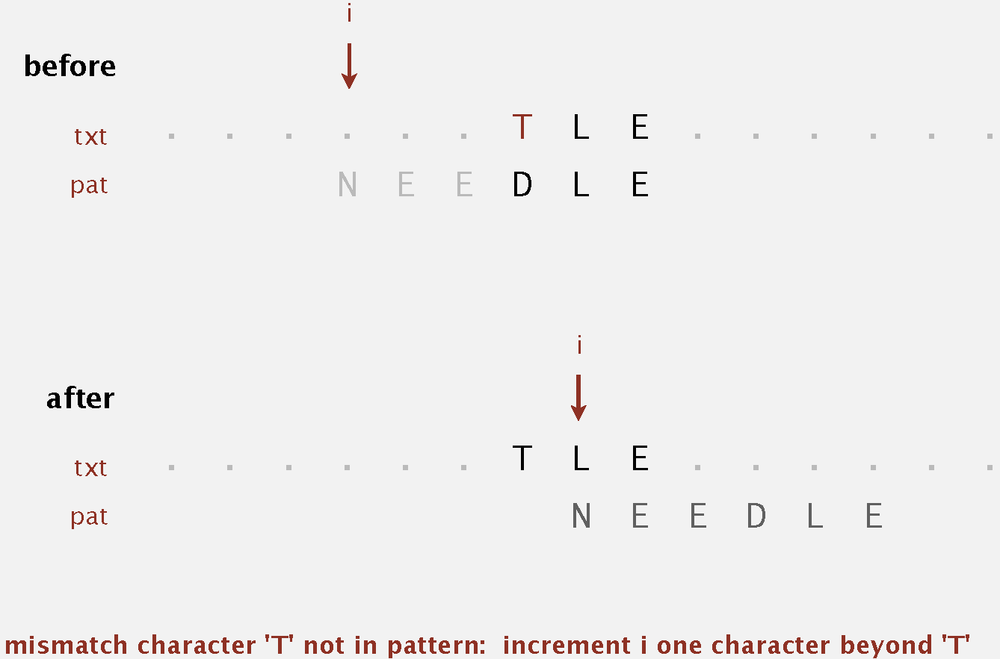
</li>

<li>
    
<format color="Fuchsia">Mismatch character in pattern.</format>
    

    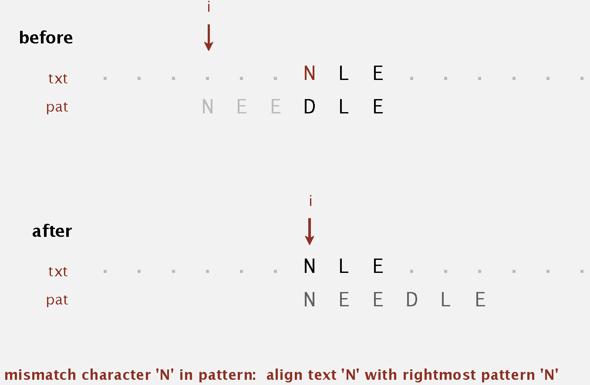
</li>

<li>
    
<format color="Fuchsia">Mismatch character in pattern (but 
    heuristic no help).</format>

    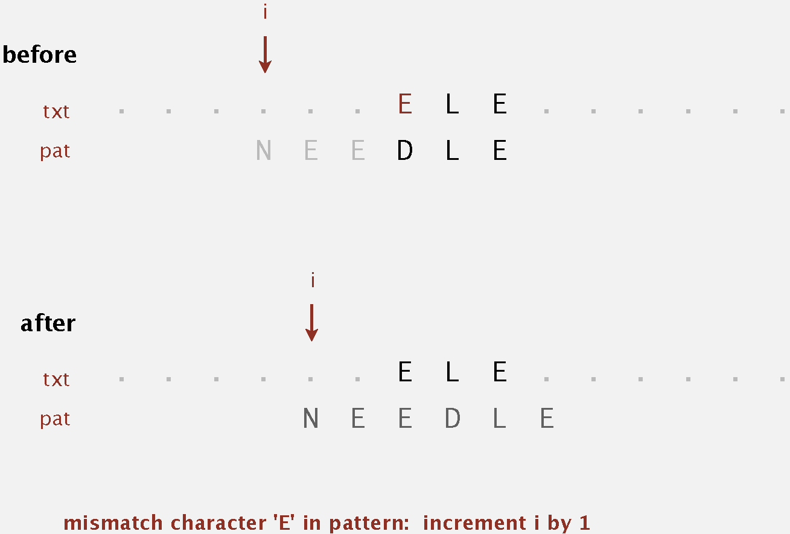
</li>

</list>

<note>

Precompute index of rightmost occurrence of character c in pattern
(-1 if character not in pattern).

</note>

<format color="BlueViolet">Property:</format> Substring search with 
the Boyer-Moore mismatched character heuristic takes about <math>
\sim \frac{N}{m}</math> character (sublinear) compares to search for 
a pattern of length <math>M</math> in a text of length <math>N</math>
.

<format color="BlueViolet">Worst Case:</format> Can be as bad as 
<math>\sim MN</math>.

<format color="BlueViolet">Boyer-Moore variant:</format> Can 
improve worst case to <math>\sim 3N</math> character compares
by adding a KMP-like rule to guard against repetitive patterns.

<tabs>
    <tab title="Java">
    <code-block lang="java" collapsible="true">
public class BoyerMoore {
    private final int R;
    private final int[] right;
    private char[] pattern;
    private String pat;
\/
    public BoyerMoore(String pat) {
        this.R = 256;
        this.pat = pat;
\/
        right = new int[R];
        for (int c = 0; c &lt; R; c++)
            right[c] = -1;
        for (int j = 0; j &lt; pat.length(); j++)
            right[pat.charAt(j)] = j;
    }
\/
    public BoyerMoore(char[] pattern, int R) {
        this.R = R;
        this.pattern = new char[pattern.length];
        System.arraycopy(pattern, 0, this.pattern, 0, pattern.length);
\/
        right = new int[R];
        for (int c = 0; c &lt; R; c++)
            right[c] = -1;
        for (int j = 0; j &lt; pattern.length; j++)
            right[pattern[j]] = j;
    }
\/
    public int search(String txt) {
        int M = pat.length();
        int N = txt.length();
        int skip;
        for (int i = 0; i &lt;= N - M; i += skip) {
            skip = 0;
            for (int j = M - 1; j &gt;= 0; j--) {
                if (pat.charAt(j) != txt.charAt(i + j)) {
                    skip = Math.max(1, j - right[txt.charAt(i + j)]);
                    break;
                }
            }
            if (skip == 0) return i;
        }
        return N;
    }
\/
    public int search(char[] text) {
        int M = pattern.length;
        int N = text.length;
        int skip;
        for (int i = 0; i &lt;= N - M; i += skip) {
            skip = 0;
            for (int j = M - 1; j &gt;= 0; j--) {
                if (pattern[j] != text[i + j]) {
                    skip = Math.max(1, j - right[text[i + j]]);
                    break;
                }
            }
            if (skip == 0) return i;
        }
        return N;
    }
}
    </code-block>
    </tab>
    <tab title="C++">
    <code-block lang="c++" collapsible="true">
#include &lt;iostream&gt;
#include &lt;string&gt;
#include &lt;vector&gt;
\/
class BoyerMoore {
private:
    int R;
    std::vector&lt;int&gt; right;
    std::string pat;
\/
public:
    explicit BoyerMoore(const std::string& pat) {
        this-&gt;R = 256;
        this-&gt;pat = pat;
\/
        this-&gt;right.resize(R, -1);
        for (int j = 0; j &lt; pat.size(); j++) {
            this-&gt;right[pat[j]] = j;
        }
    }
\/
    [[nodiscard]] int search(const std::string& txt) const {
        const int M = static_cast&lt;int&gt;(pat.size());
        const int N = static_cast&lt;int&gt;(txt.size());
        int skip;
        for (int i = 0; i &lt;= N - M; i += skip) {
            skip = 0;
            for (int j = M - 1; j &gt;= 0; j--) {
                if (pat[j] != txt[i + j]) {
                    skip = std::max(1, j - right[txt[i + j]]);
                    break;
                }
            }
            if (skip == 0) return i;
        }
        return N;
    }
};
    </code-block>
    </tab>
    <tab title="Python">
    <code-block lang="python" collapsible="true">
class BoyerMoore:
    def __init__(self, pat):
        self.R = 256
        self.pat = pat
        self.right = [-1] * self.R
\/
        for j in range(len(pat)):
            self.right[ord(pat[j])] = j
\/
    def search(self, txt):
        M = len(self.pat)
        N = len(txt)
        skip = 1 
\/
        for i in range(0, N - M + 1, skip):
            skip = 0
            for j in range(M - 1, -1, -1):
                if self.pat[j] != txt[i + j]:
                    skip = max(1, j - self.right[ord(txt[i + j])])
                    break
            if skip == 0:
                return i
        return N
    </code-block>
    </tab>
</tabs>

### 21.5 Rabin-Karp

<procedure title="Rabin-Karp (Modular Hashing)">
<step>
    
Compute a hash of pattern characters <math>0</math> to <math>
    M - 1</math>.

</step>
<step>
    
For each <math>i</math>, compute a hash of text characters 
    <math>i</math> to <math>M + i - 1</math>.

</step>
<step>
    
If pattern hash = text substring hash, check for a match.

</step>
</procedure>

<format color="BlueViolet">Modular Hashing Function:</format> 
Using the notation <math>t_{i}</math> for <code>txt.charAt(i)</code>,
we wish to compute:

<code-block lang="tex">
x_{i} = t_{i} R^{M-1} + t_{i+1} R^{M-2} + ... + t_{i+M-1} R^{0}   \mod Q
</code-block>

M-digit, base-R integer, modulo Q.

<tip>

<format color="BlueViolet">Horner's method:</format> Linear-time 
method to evaluate degree- <math>M</math> polynomial.

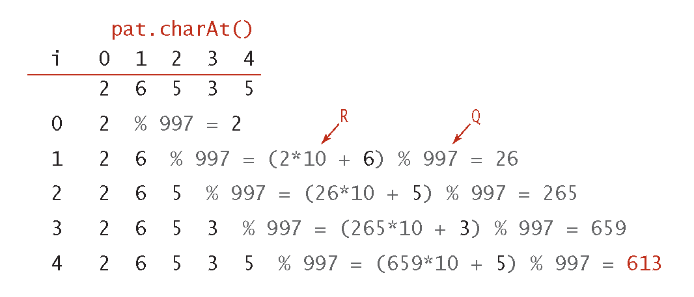
</tip>

Based on the function above, we can get:

<code-block lang="tex">
x_{i+1} = (x_{i} - t_{i} R^{M-1}) R + t_{i+M}
</code-block>

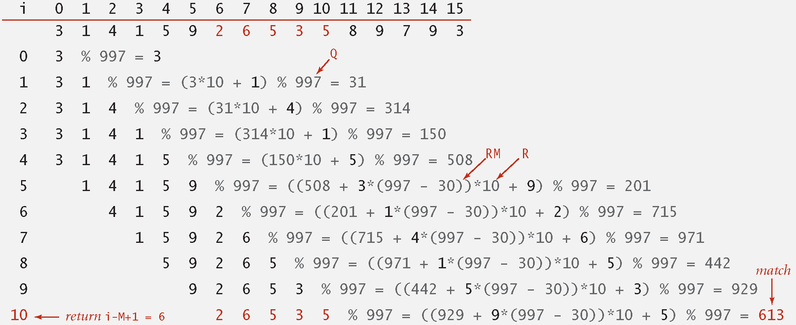

<tabs>
    <tab title="Java">
    <code-block lang="java" collapsible="true">
public class RabinKarp {
    private final long patHash;
    private final int M;
    private final long Q;
    private final int R;
    private long RM;
\/
    public RabinKarp(String pat) {
        M = pat.length();
        R = 256;
        Q = longRandomPrime();
        RM = 1;
        for (int i = 1; i &lt;= M - 1; i++)
            RM = (R * RM) % Q;
        patHash = hash(pat, M);
    }
\/
    private long hash(String key, int M) {
        long h = 0;
        for (int j = 0; j &lt; M; j++)
            h = (R * h + key.charAt(j)) % Q;
        return h;
    }
\/
    // Las Vegas version: does pat[] match txt[i..i-M+1] ?
    private boolean check(String txt, int i) {
        for (int j = 0; j &lt; M; j++)
            if (patHash != hash(txt.substring(i, i + M), M))
                return false;
        return true;
    }
\/
    // Monte Carlo version: always return true
    private static long longRandomPrime() {
        return (1L &lt;&lt; 31) - 1;
    }
\/
    public int search(String txt) {
        int N = txt.length();
        if (N &lt; M) return N;
        long txtHash = hash(txt, M);
\/
        if ((patHash == txtHash) && check(txt, 0))
            return 0;
\/
        for (int i = M; i &lt; N; i++) {
            txtHash = (txtHash + Q - RM * txt.charAt(i - M) % Q) % Q;
            txtHash = (txtHash * R + txt.charAt(i)) % Q;
\/
            int offset = i - M + 1;
            if ((patHash == txtHash) && check(txt, offset))
                return offset;
        }
\/
        return N;
    }
}
    </code-block>
    </tab>
    <tab title="C++">
    <code-block lang="c++" collapsible="true">
#include &lt;iostream&gt;
#include &lt;string&gt;
\/
class RabinKarp {
private:
    long long patHash;
    int M;
    long long Q;
    int R;
    long long RM;
    std::string pat;
\/
public:
    explicit RabinKarp(const std::string& pat) : pat(pat) {
        M = static_cast&lt;int&gt;(pat.length());
        R = 256;
        Q = longRandomPrime();
        RM = 1;
        for (int i = 1; i &lt;= M - 1; i++)
            RM = (R * RM) % Q;
        patHash = hash(pat, M);
    }
\/
    [[nodiscard]] long long hash(const std::string& key, const int M) const {
        long long h = 0;
        for (int j = 0; j &lt; M; j++)
            h = (R * h + key[j]) % Q;
        return h;
    }
\/
    // Las Vegas version: does pat[] match txt[i..i-M+1] ?
    [[nodiscard]] bool check(const std::string& txt, const int i) const {
        for (int j = 0; j &lt; M; j++)
            if (txt[i + j] != pat[j])
                return false;
        return true;
    }
\/
    // Monte Carlo version: always return true
\/
    static long long longRandomPrime() {
        return 16777213;
    }
\/
    [[nodiscard]] int search(const std::string& txt) const {
        const int N = static_cast&lt;int&gt;(txt.length());
        if (N &lt; M) return N;
        long long txtHash = hash(txt, M);
\/
        if ((patHash == txtHash) && check(txt, 0))
            return 0;
\/
        for (int i = M; i &lt; N; i++) {
            txtHash = (txtHash + Q - RM * txt[i - M] % Q) % Q;
            txtHash = (txtHash * R + txt[i]) % Q;
\/
            int offset = i - M + 1;
            if ((patHash == txtHash) && check(txt, offset))
                return offset;
        }
\/
        return N;
    }
};
    </code-block>
    </tab>
    <tab title="Python">
    <code-block lang="python" collapsible="true">
def long_random_prime():
    return (1 &lt;&lt; 31) - 1
\/
\/
class RabinKarp:
    def __init__(self, pat):
        self.pat = pat
        self.M = len(pat)
        self.R = 256
        self.Q = long_random_prime()
        self.RM = 1
        for i in range(1, self.M):
            self.RM = (self.R * self.RM) % self.Q
        self.pat_hash = self.hash(pat, self.M)
\/
    def hash(self, key, M):
        h = 0
        for j in range(M):
            h = (self.R * h + ord(key[j])) % self.Q
        return h
\/
    # Las Vegas version: does pat[] match txt[i..i-M+1] ?
    def check(self, txt, i):
        for j in range(self.M):
            if self.pat_hash != self.hash(txt[i:i+self.M], self.M):
                return False
        return True
\/
    # Monte Carlo version: always return true
\/
    def search(self, txt):
        N = len(txt)
        if N &lt; self.M:
            return N
        txt_hash = self.hash(txt, self.M)
\/
        if (self.pat_hash == txt_hash) and self.check(txt, 0):
            return 0
\/
        for i in range(self.M, N):
            txt_hash = (txt_hash + self.Q - self.RM * ord(txt[i - self.M]) % self.Q) % self.Q
            txt_hash = (txt_hash * self.R + ord(txt[i])) % self.Q
\/
            offset = i - self.M + 1
            if (self.pat_hash == txt_hash) and self.check(txt, offset):
                return offset
\/
        return N
    </code-block>
    </tab>
</tabs>

<format color="BlueViolet">Cost of searching for an <math>M</math>
-character pattern in an <math>N</math>-character text</format>

<table style="none">
<tr>
    <td rowspan="2">Algorithm</td>
    <td rowspan="2">Version</td>
    <td colspan="2">Operation Count</td>
    <td rowspan="2">Backup in Input?</td>
    <td rowspan="2">Correct?</td>
    <td rowspan="2">Extra Space</td>
</tr>
<tr>
    <td>Guarantee</td>
    <td>Typical</td>
</tr>
<tr>
    <td><a anchor="brute-force" summary="Brute Force Algorithm">Brute
    Force</a></td>
    <td>-</td>
    <td><math>MN</math></td>
    <td><math>1.1MN</math></td>
    <td>yes</td>
    <td>yes</td>
    <td><math>1</math></td>
</tr>
<tr>
    <td rowspan="2"><a anchor="KMP" summary="KMP">Knuth-Morris-Pratt
    </a></td>
    <td>full DFA</td>
    <td><math>2N</math></td>
    <td><math>1.1N</math></td>
    <td>no</td>
    <td>yes</td>
    <td><math>MR</math></td>
</tr>
<tr>
    <td>mismatch transitions only</td>
    <td><math>3N</math></td>
    <td><math>1.1N</math></td>
    <td>no</td>
    <td>yes</td>
    <td><math>R</math></td>
</tr>
<tr>
    <td rowspan="2"><a anchor="Boyer-Moore" summary="Boyer-Moore">
    Boyer-Moore</a></td>
    <td>full algorithm</td>
    <td><math>3N</math></td>
    <td><math>N/M</math></td>
    <td>yes</td>
    <td>yes</td>
    <td><math>R</math></td>
</tr>
<tr>
    <td>mismatched char heuristic only</td>
    <td><math>MN</math></td>
    <td><math>N/M</math></td>
    <td>yes</td>
    <td>yes</td>
    <td><math>R</math></td>
</tr>
<tr>
    <td rowspan="2">Rabin-Karp*</td>
    <td>Monte Carlo</td>
    <td><math>7N</math></td>
    <td><math>7N</math></td>
    <td>no</td>
    <td>yes*</td>
    <td><math>1</math></td>
</tr>
<tr>
    <td>Las Vegas</td>
    <td><math>7N</math> *</td>
    <td><math>7N</math></td>
    <td>yes</td>
    <td>yes</td>
    <td><math>1</math></td>
</tr>
</table>

*: probabilisitic guarantee, with uniform hash function

## 22 Regular Expressions

### 22.1 Regular Expressions

<format color="BlueViolet">Pattern Searching:</format> Find one of
a specified set of strings in text.

<format color="BlueViolet">Applications</format>

<list type="bullet">
<li>
    
Genomics: test for certain pattrn of base sequence

</li>
<li>
    
Syntax highlighting

</li>
<li>
    
Google code search

</li>
<li>
    
Scan for virus signatures

</li>
<li>
    
Process natural language

</li>
<li>
    
Specify a programming language

</li>
<li>
    
Access information in digital libraries

</li>
<li>
    
Search genome using PROSITE patterns

</li>
<li>
    
Filter text (spam, NetNanny, Carnivore, malware)

</li>
<li>
    
Validate data-entry fields (dates, email, URL, credit card)

</li>
<li>
    
Compile a Java program

</li>
<li>
    
Crawl and index the Web

</li>
<li>
    
Read in data stored in ad hoc input file format

</li>
<li>
    
Create Java documentation from Javadoc comments

</li>
<li>
    
...

</li>
</list>

<format color="DarkOrange">Regular Expressions:</format> A 
notation to specify a set of strings.

<table style="header-row">
<tr>
    <td>Operation</td>
    <td>Order</td>
    <td>Example RE</td>
    <td>Matches</td>
    <td>Does not Match</td>
</tr>
<tr>
    <td>Concatenaion</td>
    <td>3</td>
    <td>AABAAB</td>
    <td>AABAAB</td>
    <td>every other string</td>
</tr>
<tr>
    <td>Or</td>
    <td>4</td>
    <td>AA|BAAB</td>
    <td>
AA

    
BAAB
</td>
    <td>every other string</td>
</tr>
<tr>
    <td>Closure</td>
    <td>2</td>
    <td>AB*A</td>
    <td>
AA

    
ABA

    
ABBA

    
ABBBBBBBBA
</td>
    <td>
AB

    
ABABA
</td>
</tr>
<tr>
    <td rowspan="2">Parenthesis</td>
    <td rowspan="2">1</td>
    <td>A(A|B)AAB</td>
    <td>
AAAAB

    
ABAAB
</td>
    <td>every other string</td>
</tr>
<tr>
    <td>(AB)*A</td>
    <td>
A

    
ABABABABABA
</td>
    <td>
AA

    
ABBA
</td>
</tr>
</table>

<format color="BlueViolet">Shortcuts</format>

<table style="header-row">
<tr>
    <td>Operation</td>
    <td>Example RE</td>
    <td>Matches</td>
    <td>Does not Match</td>
</tr>
<tr>
    <td>Wildcard</td>
    <td>.U.U.U.</td>
    <td>
CUMULUS

    
JUGULUM
</td>
    <td>
SUCCUBUS

    
TUMULTUOUS
</td>
</tr>
<tr>
    <td>Character Class</td>
    <td>[A-Za-z][a-z]*</td>
    <td>
Word

    
Capitalized
</td>
    <td>
camelCase

    
4illegal
</td>
</tr>
<tr>
    <td>At Least 1</td>
    <td>A(BC)+DE</td>
    <td>
ABCDE

    
ABCBCDE
</td>
    <td>
ADE

    
BCDE
</td>
</tr>
<tr>
    <td>Exactly k</td>
    <td>[0-9]{5}-[0-9]{4}</td>
    <td>
08540-1321

    
19072-5541
</td>
    <td>
111111111

    
166-54-111
</td>
</tr>
</table>

<format color="BlueViolet">Examples</format>

<table style="header-row">
<tr>
    <td>Regular Expression</td>
    <td>Matches</td>
    <td>Does not Match</td>
</tr>
<tr>
    <td>
.*SPB.*

    
(substring search)
</td>
    <td>
RASPBERRY

    
CRISPBREAD
</td>
    <td>
SUBSPACE

    
SUBSPECIES
</td>
</tr>
<tr>
    <td>
[0-9]{3}-[0-9]{2}-[0-9]{4}

    
(U.S. Social Security numbers)
</td>
    <td>
166-11-4433

    
166-45-1111
</td>
    <td>
11-55555555

    
8675309
</td>
</tr>
<tr>
    <td>
[a-z]+@([a-z]+\.)+(edu|com)

    
(simplified email addresses)
</td>
    <td>
wayne@princeton.edu

    
rs@princeton.edu
</td>
    <td>spam@nowhere</td>
</tr>
<tr>
    <td>
[$_A-Za-z][$_A-Za-z0-9]*

    
(Java identifiers)
</td>
    <td>
ident3

    
PatternMatcher
</td>
    <td>
3a

    
ident#3
</td>
</tr>
</table>

<format color="BlueViolet">Caveat</format>

<list type="bullet">
<li>
    
Writing a RE is like writing a program.

</li>
<li>
    
Need to understand programming model.

</li>
<li>
    
Can be easier to write than read.

</li>
<li>
    
Can be difficult to debug.

</li>
</list>

### 22.2 REs and NFAs

<format color="BlueViolet">Kleene's theorem</format>

<list type="bullet">
<li>
    
For any DFA, there exists a RE that describes the same set of 
    strings.

</li>
<li>
    
For any RE, there exists a DFA that recognizes the same set of
    strings.

</li>
</list>

<format color="BlueViolet">Regular-expression-matching NFA:
</format> 

<list type="bullet">
<li>
    
We assume RE enclosed in parentheses.

</li>
<li>
    
One state per RE character (start = 0, accept = M).

</li>
<li>
    
Red <format color="OrangeRed">&epsilon;-transition</format> 
    (change state, but don't scan text).

</li>
<li>
    
Black match transition (change state and scan to next text 
    char).

</li>
<li>
    
Accept if <format color="OrangeRed">any</format> sequence of 
    transitions ends in accept state after scanning all text 
    characters.

</li>
</list>

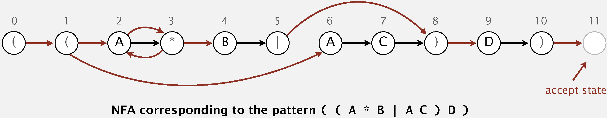

<procedure title="NFA Simulation">
<step>
    
Check whether input matches all possible states that NFA could
    be.

</step>
<step>
    
Reject otherwise.

</step>
</procedure>

<format color="BlueViolet">Construction</format>

<list type="bullet">
<li>
    
<format color="Fuchsia">Parenthesis:</format> Add &epsilon;
    -transition edge from parentheses to next state.

</li>
<li>
    
<format color="Fuchsia">Closure:</format> Add three &epsilon;
    -transition edges for each * operator.

    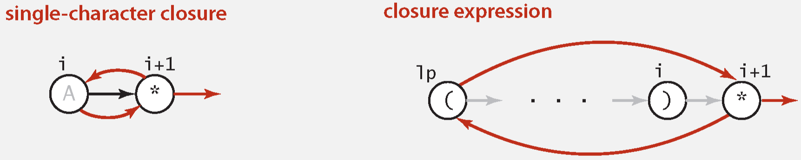
</li>
<li>
    
<format color="Fuchsia">Or:</format> Add two &epsilon;-
    transition edges for each | operator.

</li>
</list>

<procedure title="NFA Construction" type="choices">
<step>
    
<format color="Fuchsia">Left parenthesis</format>

    <list type="bullet">
    <li>
        
Add &epsilon;-transition to next state.

    </li>
    <li>
        
Push index of state corresponding to ( onto stack.

    </li>
    </list>
</step>
<step>
    
<format color="Fuchsia">Alphabet symbol</format>

    <list type="bullet">
    <li>
        
Add match transition to next state.

    </li>
    <li>
        
Do one-character lookahead: add &epsilon;-transition if 
        next character is *.

    </li>
    </list>
</step>
<step>
    
<format color="Fuchsia">Or symbol</format>

    <list type="bullet">
    <li>
        
Push index of state corresponding to | onto stack.

    </li>
    </list>
</step>
<step>
    
<format color="Fuchsia">Right parenthesis</format>

    <list type="bullet">
    <li>
        
Add &epsilon;-transition to next state.

    </li>
    <li>
        
Pop correponding ( and possibly intervening |; add 
        &epsilon;-transition edges for or.

    </li>
    <li>
        
Do one-character lookahead: add &epsilon;-transition if 
        next character is *.

    </li>
    </list>
</step>
</procedure>

<format color="BlueViolet">Property:</format> Determining whether 
an <math>N</math>-character text is recognized by the NFA 
corresponding to an <math>M</math>-character pattern takes time 
proportional to <math>M N</math> in the worst case.

<format color="LawnGreen">Proof:</format> For each of the <math>N
</math> text characters, we iterate through a set of states of
size no more than <math>M</math> and run DFS on the graph of 
&epsilon;-transitions.

<format color="BlueViolet">Property:</format> Building the NFA
corresponding to an <math>M</math>-character RE takes time and space 
proportional to <math>M</math>.

<format color="LawnGreen">Proof:</format> For each of the <math>M
</math> characters in the RE, we add at most three &epsilon;-transitions and 
execute at most two stack operations.

<format color="BlueViolet">Directed DFS Implementation</format>

<tabs>
    <tab title="Java">
    <code-block lang="java" collapsible="true">
import java.util.List;
\/
public class DirectedDFS {
    private final boolean[] marked;
    private int count;
\/
    public DirectedDFS(DirectedGraph G, int s) {
        marked = new boolean[G.getNumVertices()];
        validateVertex(s);
        dfs(G, s);
    }
\/    
    public DirectedDFS(DirectedGraph G, Iterable&lt;Integer&gt; sources) {
        marked = new boolean[G.getNumVertices()];
        validateVertices(sources);
        for (int v : sources) {
            if (!marked[v]) dfs(G, v);
        }
    }
\/
    private void dfs(DirectedGraph G, int v) {
        count++;
        marked[v] = true;
        List&lt;Integer&gt; neighbors = G.getAdjacencyList().get(v);
        for (int w : neighbors) {
            if (!marked[w]) dfs(G, w);
        }
    }
\/
    public boolean marked(int v) {
        validateVertex(v);
        return marked[v];
    }
\/
    public int count() {
        return count;
    }
\/
    private void validateVertex(int v) {
        int V = marked.length;
        if (v &lt; 0 || v &gt;= V)
            throw new IllegalArgumentException("vertex " + v + " is not between 0 and " + (V - 1));
    }
\/
    private void validateVertices(Iterable&lt;Integer&gt; vertices) {
        if (vertices == null) {
            throw new IllegalArgumentException("argument is null");
        }
        int vertexCount = 0;
        for (Integer v : vertices) {
            vertexCount++;
            if (v == null) {
                throw new IllegalArgumentException("vertex is null");
            }
            validateVertex(v);
        }
        if (vertexCount == 0) {
            throw new IllegalArgumentException("zero vertices");
        }
    }
}
    </code-block>
    </tab>
    <tab title="Python">
    <code-block lang="python" collapsible="true">
class DirectedDFS:
    def __init__(self, graph, source):
        self.marked = [False] * graph.get_num_vertices()
        self.count = 0
\/
        if isinstance(source, int):
            self._dfs(graph, source)
        elif isinstance(source, list):
            for s in source:
                if not self.marked[s]:
                    self._dfs(graph, s)
\/
    def _dfs(self, graph, v):
        self.count += 1
        self.marked[v] = True
        for w in graph.adjacency_list[v]:
            if not self.marked[w]:
                self._dfs(graph, w)
\/
    def marked_vertex(self, v):
        return self.marked[v]
\/
    def get_count(self):
        return self.count
    </code-block>
    </tab>
</tabs>

<format color="BlueViolet">NFA Implementation</format>

<tabs>
    <tab title="Java">
    <code-block lang="java" collapsible="true">
import java.util.ArrayList;
import java.util.List;
import java.util.Stack;
\/
public class NFA {
    private final DirectedGraph graph;
    private final String regexp;
    private final int m;
\/
    public NFA(String regexp) {
        this.regexp = regexp;
        m = regexp.length();
        Stack&lt;Integer&gt; ops = new Stack&lt;&gt;();
        graph = new DirectedGraph(m + 1);
        for (int i = 0; i &lt; m; i++) {
            int lp = i;
            if (regexp.charAt(i) == '(' || regexp.charAt(i) == '|')
                ops.push(i);
            else if (regexp.charAt(i) == ')') {
                int or = ops.pop();
\/
                if (regexp.charAt(or) == '|') {
                    lp = ops.pop();
                    graph.addEdge(lp, or + 1);
                    graph.addEdge(or, i);
                } else if (regexp.charAt(or) == '(')
                    lp = or;
                else assert false;
            }
\/
            if (i &lt; m - 1 && regexp.charAt(i + 1) == '*') {
                graph.addEdge(lp, i + 1);
                graph.addEdge(i + 1, lp);
            }
            if (regexp.charAt(i) == '(' || regexp.charAt(i) == '*' || regexp.charAt(i) == ')')
                graph.addEdge(i, i + 1);
        }
        if (!ops.isEmpty())
            throw new IllegalArgumentException("Invalid regular expression");
    }
\/
    public boolean recognizes(String txt) {
        DirectedDFS dfs = new DirectedDFS(graph, 0);
        List&lt;Integer&gt; pc = new ArrayList&lt;&gt;();
        for (int v = 0; v &lt; graph.getNumVertices(); v++)
            if (dfs.marked(v)) pc.add(v);
\/
        for (int i = 0; i &lt; txt.length(); i++) {
            if (txt.charAt(i) == '*' || txt.charAt(i) == '|' || txt.charAt(i) == '(' || txt.charAt(i) == ')')
                throw new IllegalArgumentException("text contains the metacharacter '" + txt.charAt(i) + "'");
\/
            List&lt;Integer&gt; match = new ArrayList&lt;&gt;();
            for (int v : pc) {
                if (v == m) continue;
                if ((regexp.charAt(v) == txt.charAt(i)) || regexp.charAt(v) == '.')
                    match.add(v + 1);
            }
            if (match.isEmpty()) continue;
\/
            dfs = new DirectedDFS(graph, match);
            pc = new ArrayList&lt;&gt;();
            for (int v = 0; v &lt; graph.getNumVertices(); v++)
                if (dfs.marked(v)) pc.add(v);
\/
            if (pc.isEmpty()) return false;
        }
\/
        for (int v : pc)
            if (v == m) return true;
        return false;
    }
}
    </code-block>
    </tab>
    <tab title="Python">
    <code-block lang="python" collapsible="true">
from DirectedGraph import DirectedGraph
from DirectedDFS import DirectedDFS
\/
class NFA:
    def __init__(self, regexp):
        self.regexp = regexp
        self.m = len(regexp)
        self.graph = DirectedGraph(self.m + 1)
        ops = []
\/
        for i in range(self.m):
            lp = i
            if regexp[i] == '(' or regexp[i] == '|':
                ops.append(i)
            elif regexp[i] == ')':
                or_op = ops.pop()
                if regexp[or_op] == '|':
                    lp = ops.pop()
                    self.graph.add_edge(lp, or_op + 1)
                    self.graph.add_edge(or_op, i)
                elif regexp[or_op] == '(':
                    lp = or_op
                else:
                    assert False
\/
            if i &lt; self.m - 1 and regexp[i + 1] == '*':
                self.graph.add_edge(lp, i + 1)
                self.graph.add_edge(i + 1, lp)
\/
            if regexp[i] == '(' or regexp[i] == '*' or regexp[i] == ')':
                self.graph.add_edge(i, i + 1)
\/
        if ops:
            raise ValueError("Invalid regular expression")
\/
    def recognizes(self, txt):
        dfs = DirectedDFS(self.graph, 0)
        pc = [v for v in range(self.graph.get_num_vertices()) if dfs.marked_vertex(v)]
\/
        for i in range(len(txt)):
            if txt[i] in ['*', '|', '(', ')']:
                raise ValueError(f"text contains the metacharacter '{txt[i]}'")
\/
            match = []
            for v in pc:
                if v == self.m:
                    continue
                if (self.regexp[v] == txt[i]) or self.regexp[v] == '.':
                    match.append(v + 1)
\/
            if not match:
                continue
\/
            dfs = DirectedDFS(self.graph, match)
            pc = [v for v in range(self.graph.get_num_vertices()) if dfs.marked_vertex(v)]
\/
            if not pc:
                return False
\/
        for v in pc:
            if v == self.m:
                return True
\/
        return False
    </code-block>
    </tab>
</tabs>

## 23 Data Compression

### 23.1 Data Compression Introduction

<format color="BlueViolet">Application</format>

<list type="bullet">
<li>
    
<format color="Fuchsia">Generic file compression</format>

    <list type="bullet">
    <li>
        
<format color="LawnGreen">Files:</format> GZIP, BZIP, 7z

    </li>
    <li>
        
<format color="LawnGreen">Archivers:</format> PKZIP

    </li>
    <li>
        
<format color="LawnGreen">File systems:</format> NTFS, HFS+, 
        ZFS

    </li>
    </list>
</li>
<li>
    
<format color="Fuchsia">Multimedia</format>

    <list type="bullet">
    <li>
        
<format color="LawnGreen">Images:</format> GIF, JPEG

    </li>
    <li>
        
<format color="LawnGreen">Sound:</format> MP3

    </li>
    <li>
        
<format color="LawnGreen">Video:</format> MPEG, DivX™, HDTV

    </li>
    </list>
</li>
<li>
    
<format color="Fuchsia">Communication</format>

    <list type="bullet">
    <li>
        
<format color="LawnGreen">ITU-T T4 Group 3 Fax</format>

    </li>
    <li>
        
<format color="LawnGreen">V.42bis modem</format>

    </li>
    <li>
        
<format color="LawnGreen">Skype</format>

    </li>
    </list>
</li>
</list>

### 23.2 Run-Length Coding

<format color="IndianRed">Example</format>

0 0 0 0 0 0 0 0 0 0 0 0 0 0 0 1 1 1 1 1 1 1 0 0 0 0 0 0 0 1 1 1 1 1 1 1 1 1 1 1

4-bit counts to represent alternating runs of 0s and 1s: 15 0s, then 
7 1s, then 7 0s, then 11 1s.

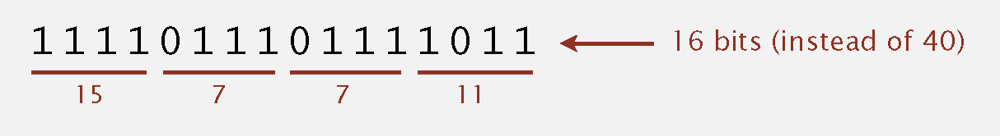

<format color="BlueViolet">Applications:</format> JPEG, ITU-T T4 Group
3 Fax, ...

<tabs>
    <tab title="Java">
    <code-block lang="java" collapsible="true">
import java.io.ByteArrayInputStream;
import java.io.ByteArrayOutputStream;
import java.io.IOException;
\/
public class RunLength {
    private static final int R = 256;
    private static final int LG_R = 8;
\/
    private RunLength() { }
\/
    public static byte[] expand(byte[] compressed) throws IOException {
        ByteArrayInputStream in = new ByteArrayInputStream(compressed);
        ByteArrayOutputStream out = new ByteArrayOutputStream();
\/
        boolean b = false;
        while (in.available() &gt; 0) {
            int run = in.read();
            for (int i = 0; i &lt; run; i++) {
                out.write(b ? 1 : 0); 
            }
            b = !b;
        }
        return out.toByteArray();
    }
\/
    public static byte[] compress(byte[] input) throws IOException {
        ByteArrayOutputStream out = new ByteArrayOutputStream();
        int run = 0;
        boolean old = false;
\/
        for (byte bVal : input) {
            boolean b = bVal != 0;
            if (b != old) {
                out.write(run);
                run = 1;
                old = !old;
            } else {
                if (run == R - 1) {
                    out.write(run);
                    run = 0;
                    out.write(run);
                }
                run++;
            }
        }
        out.write(run);
        return out.toByteArray();
    }
\/    
    private static void printByteArray(byte[] arr) {
        for (byte b : arr) {
            System.out.print(b + " ");
        }
        System.out.println();
    }
}
    </code-block>
    </tab>
    <tab title="C++">
    <code-block lang="c++" collapsible="true">
#include &lt;iostream&gt;
#include &lt;vector&gt;
#include &lt;sstream&gt;
\/
constexpr int R = 256;
constexpr int LG_R = 8;
\/
std::vector&lt;unsigned char&gt; expand(const std::vector&lt;unsigned char&gt;& compressed) {
    std::vector&lt;unsigned char&gt; expanded;
    bool b = false;
    for (const unsigned char run : compressed) {
        for (int i = 0; i &lt; run; ++i) {
            expanded.push_back(b ? 1 : 0);
        }
        b = !b;
    }
    return expanded;
}
\/
std::vector&lt;unsigned char&gt; compress(const std::vector&lt;unsigned char&gt;& input) {
    std::vector&lt;unsigned char&gt; compressed;
    int run = 0;
    bool old = false;
\/
    for (const unsigned char bVal : input) {
        bool b = bVal != 0;
        if (b != old) {
            compressed.push_back(run);
            run = 1;
            old = !old;
        } else {
            if (run == R - 1) {
                compressed.push_back(run);
                run = 0;
                compressed.push_back(run);
            }
            run++;
        }
    }
    compressed.push_back(run);
    return compressed;
}
\/
void printByteArray(const std::vector&lt;unsigned char&gt;& arr) {
    for (const unsigned char b : arr) {
        std::cout &lt;&lt; static_cast&lt;int&gt;(b) &lt;&lt; " "; 
    }
    std::cout &lt;&lt; std::endl;
}
    </code-block>
    </tab>
    <tab title="Python">
    <code-block lang="python" collapsible="true">
R = 256
LG_R = 8
\/
def expand(compressed):
    expanded = []
    b = False
    for run in compressed:
        expanded.extend([1 if b else 0] * run)
        b = not b
    return expanded
\/
def compress(input_data):
    compressed = []
    run = 0
    old = False
    for b_val in input_data:
        b = b_val != 0
        if b != old:
            compressed.append(run)
            run = 1
            old = not old
        else:
            if run == R - 1:
                compressed.append(run)
                run = 0
                compressed.append(run)
            run += 1
    compressed.append(run)
    return compressed
\/
def print_byte_array(arr):
    print(*arr)
    </code-block>
    </tab>
</tabs>

### 23.3 Huffman Coding

Inorder to produce prefix-free code, we need to ensure that no codeword
is a <format color="OrangeRed">prefix</format> of another.

### 23.4 LZW Coding

## 24 Reductions

### 24.1 Introduction

<format color="DarkOrange">Reduction:</format> Problem <math>X</math> 
reduces to problem <math>Y</math> if you can use an algorithm that solves
<math>Y</math> to help solve <math>X</math>.

Cost of solving <math>X</math> = total cost of solving <math>Y</math> 
+ cost of reduction

<format color="IndianRed">Example 1:</format> Finding the median reduces
to sorting

<procedure title="Find the media of N items">
<step>
    
Sort <math>N</math> items.

</step>
<step>
    
Return item in the middle.

</step>
</procedure>

<format color="LawnGreen">Cost of solving this problem:</format> <math>
N \log N + 1</math>

<format color="IndianRed">Example 2:</format> Element distinctness 
reduces to sorting

<procedure title="Element distinctness on N items">
<step>
    
Sort <math>N</math> items.

</step>
<step>
    
Check adjacent pairs for equality.

</step>
</procedure>

<format color="LawnGreen">Cost of solving this problem:</format> <math>
N \log N + N</math>

### 24.2 Designing Algorithms

<format color="IndianRed">Examples</format>

<list>
<li>
    
3-collinear reduces to sorting.

</li>
<li>
    
Finding the median reduces to sorting.

</li>
<li>
    
Element distinctness reduces to sorting.

</li>
<li>
    
CPM reduces to topological sort.

</li>
<li>
    
Arbitrage reduces to shortest paths.

</li>
<li>
    
Burrows-Wheeler transform reduces to suffix sort.

</li>
</list>

For more examples on algorithm designing using reductions, please visit 
<a href="Data-Structures-and-Algorithms-1.topic" anchor="convex-hull" 
summary="Convex Hull">convex hull</a> or <a href="Data-Structures-and-Algorithms-3.topic"  anchor="shortest-path-properties" 
summary="Shortest Path">shortest path</a>.

### 24.3 Establishing Lower Bounds

Very difficult to establish lower bounds from scratch => Use reductions

<format color="BlueViolet">Definition:</format> Problem <math>X</math> 
<format color="DarkOrange">linear-time reduces</format> to problem <math>Y</math> 
if <math>X</math> can be solved with:

<list type="bullet">
<li>
    
Linear number of standard computational steps.

</li>
<li>
    
Constant number of calls to <math>Y</math>.

</li>
</list>

<format color="BlueViolet">Property:</format> In quadratic decision 
tree model, any algorithm for sorting <math>N</math> integers requires 
<math>\Omega (N \log N)</math> steps. Sorting linear-time reduces to 
convex hull.

<format color="LawnGreen">Proof</format>

<list type="bullet">
<li>
    
<format color="Fuchsia">Sorting instance:</format> <math>x_1</math>, 
    <math>x_2</math>, ..., <math>x_N</math>

</li>
<li>
    
<format color="Fuchsia">Convex hull instance:</format> <math>(x_1, {x_{1}}^{2}</math>, 
    <math>(x_2, {x_{2}}^{2}</math>, ..., <math>(x_N, {x_{N}}^{2}</math>

</li>
<li>
    
Region <math>\{ x \mid x^2 \geq x \}</math> is convex => all 
    points are on hull.

</li>
<li>
    
Starting at point with most negative <math>x</math>, counterclockwise 
    order of hull points yields integers in ascending order.

</li>
</list>

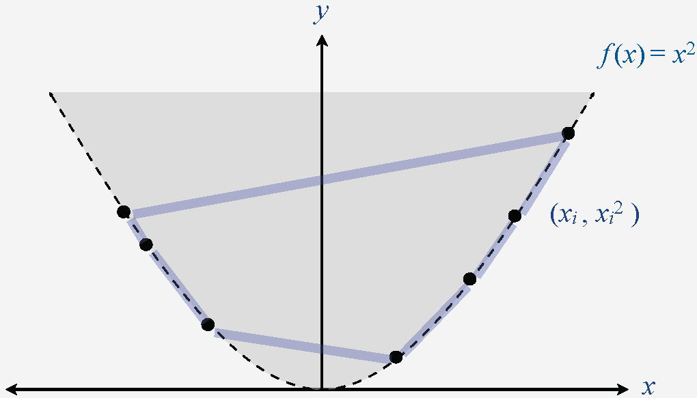

### 24.4 Classifying Problems

<format color="BlueViolet">Goal:</format> Classyify problem with algorithm
that matches lower bound.

<format color="BlueViolet">Integer Arithmetic Reductions</format>

<format color="BlueViolet">Goal:</format> Given two <math>N</math>-bit
integers, compute their product.

<table style="header-row">
<tr>
    <td>Problem</td>
    <td>Arithmetic</td>
    <td>Order of Growth</td>
</tr>
<tr>
    <td>Integer Multiplication</td>
    <td><math>a \times b</math></td>
    <td>M(N)</td>
</tr>
<tr>
    <td>Integer Division</td>
    <td><math>a / b</math>, <math>a \mod b</math></td>
    <td>M(N)</td>
</tr>
<tr>
    <td>Integer Square</td>
    <td><math>a^2</math></td>
    <td>M(N)</td>
</tr>
<tr>
    <td>Integer Square Root</td>
    <td><math>\left\lfloor \sqrt{a} \right\rfloor</math></td>
    <td>M(N)</td>
</tr>
</table>

Integer arithmetic problems with the same complexity as integer 
multiplication.

<format color="BlueViolet">Matrix Multiplication</format>

<format color="BlueViolet">Goal:</format> Given two <math>N</math>-by- <math>N</math> 
matrices, compute their product.

<table style="header-row">
<tr>
    <td>Problem</td>
    <td>Linear Algebra</td>
    <td>Order of Growth</td>
</tr>
<tr>
    <td>Matrix Multiplication</td>
    <td><math>A \times B</math></td>
    <td>MM(N)</td>
</tr>
<tr>
    <td>Matrix Inversion</td>
    <td><math>A^{-1}</math></td>
    <td>MM(N)</td>
</tr>
<tr>
    <td>Determinant</td>
    <td><math>\left| A \right|</math></td>
    <td>MM(N)</td>
</tr>
<tr>
    <td>System of Linear Equations</td>
    <td><math>Ax=b</math></td>
    <td>MM(N)</td>
</tr>
<tr>
    <td>LU Decomposition</td>
    <td><math>A=LU</math></td>
    <td>MM(N)</td>
</tr>
<tr>
    <td>Least Squares</td>
    <td>min <math>\left|\left| Ax-b \right|\right|_2</math></td>
    <td>MM(N)</td>
</tr>
</table>

Numerical linear algebra problems with the same complexity as matrix 
multiplication.

## 25 Linear Programming

<format color="DarkOrange">Linear Programming:</format> A problem-solving 
model for optimal allocation of scarce resources.

<list type="bullet">
<li>
    
<format color="Fuchsia">Agriculture:</format> Diet problem

</li>
<li>
    
<format color="Fuchsia">Computer science:</format> Compiler register
    allocation, data mining

</li>
<li>
    
<format color="Fuchsia">Electrical engineering:</format> VLSI design,
    optimal clocking

</li>
<li>
    
<format color="Fuchsia">Energy:</format> Blending petroleum products

</li>
<li>
    
<format color="Fuchsia">Economics:</format> Equilibrium theory, two-person 
    zero-sum games

</li>
<li>
    
<format color="Fuchsia">Environment:</format> Water quality management

</li>
<li>
    
<format color="Fuchsia">Finance:</format> Portfolio optimization

</li>
<li>
    
<format color="Fuchsia">Logistics:</format> Supply-chain management

</li>
<li>
    
<format color="Fuchsia">Management:</format> Hotel yield management

</li>
<li>
    
<format color="Fuchsia">Marketing:</format> Direct mail advertising

</li>
<li>
    
<format color="Fuchsia">Manufacturing:</format> Production line balancing,
    cutting stock

</li>
<li>
    
<format color="Fuchsia">Medicine:</format> Radioactive seed placement 
    in cancer treatment

</li>
<li>
    
<format color="Fuchsia">Operations research:</format> Airline crew 
    assignment, vehicle routing

</li>
<li>
    
<format color="Fuchsia">Physics:</format> Ground states of 3-D Ising 
    spin glasses

</li>
<li>
    
<format color="Fuchsia">Telecommunication:</format> Network design, 
    Internet routing

</li>
<li>
    
<format color="Fuchsia">Sports:</format> Scheduling ACC basketball, 
    handicapping horse races

</li>
</list>

### 25.1 Brewer's Problem

<format color="BlueViolet">Brewer's problem:</format> Small brewery 
produces ale and beer, Production limited by scarce resources: corn, hops,
barley malt.

<list type="bullet">
<li>
    
$13 profit per barrel: 5 pounds corn, 4 ounces hops, 35 pounds halt

</li>
<li>
    
$23 profit per barrel: 15 pounds corn, 4 ounces hops, 20 pounds halt

</li>
<li>
    
corn: 480 lbs

</li>
<li>
    
hops: 160 oz

</li>
<li>
    
malt: 1190 lbs

</li>
</list>

Now we have:

<code-block lang="tex">
\begin{align*}
\text{Maximize} \quad & 13x + 23y \\
\text{Subject to} \quad & 5x + 15y = 480 \\
& 4x + 4y = 160 \\
& 35x + 20y = 1190 \\
& x \geq 0, y \geq 0
\end{align*}
</code-block>

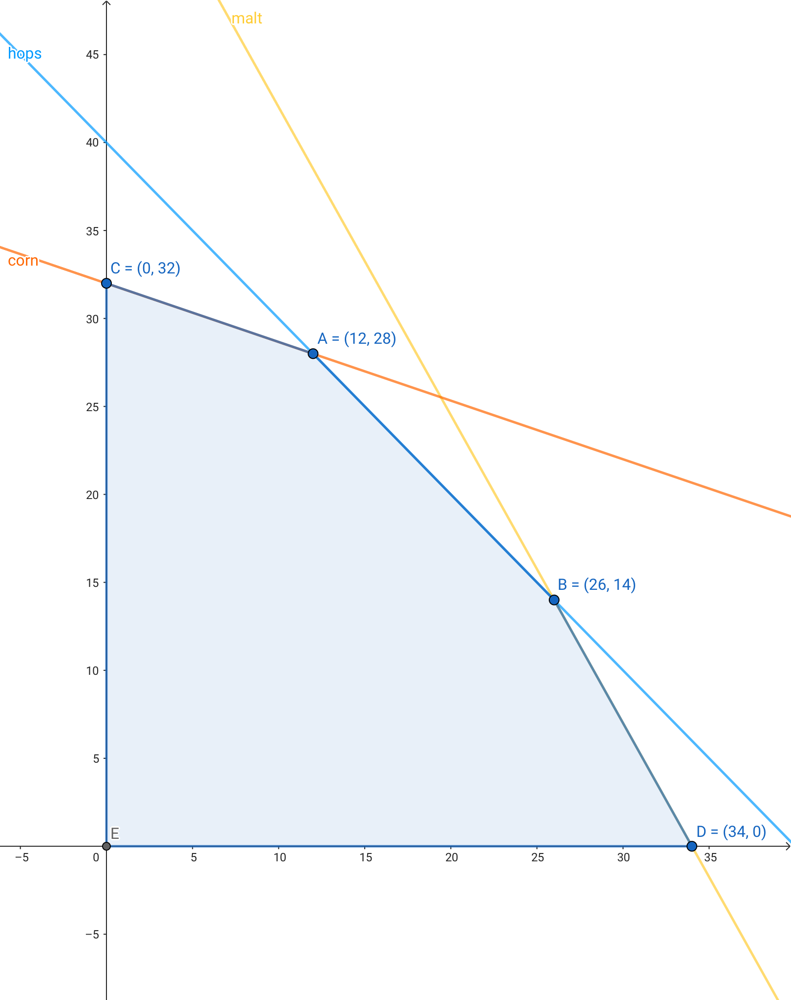

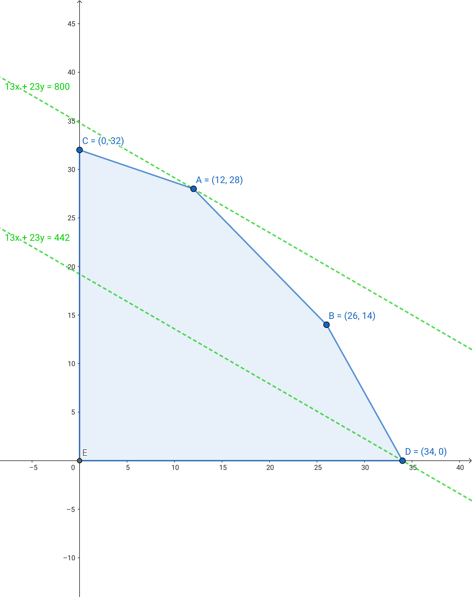

Standard form linear program

<tabs>
    <tab title="Primal Problem">
    <code-block lang="tex">
\begin{align*}
\text{Maximize} \quad c_1 x-1 + c_2 x_2 + \cdots + c_n x_n \\
\text{Subject to} \quad a_{11} x_1 + a_{12} x_2 + \cdots + a_{1n} x_n & \leq b_1 \\
a_{21} x_1 + a_{22} x_2 + \cdots + a_{2n} x_n & \leq b_2 \\
\vdots \\
a_{m1} x_1 + a_{m2} x_2 + \cdots + a_{mn} x_n & \leq b_m \\
x_1, x_2, \ldots, x_n & \geq 0
\end{align*}
    </code-block>
    </tab>
    <tab title="Matrix Version">
    <code-block lang="tex">
\begin{align*}
\text{Maximize} \quad \mathbf{c}^T \mathbf{x} \\
\text{Subject to} \quad \mathbf{A} \mathbf{x} & \leq \mathbf{b} \\
\mathbf{x} & \geq 0
\end{align*}
    </code-block>
    </tab>
</tabs>

<format color="BlueViolet">Extreme point property:</format> If there exists 
an optimal solution to (P),then there exists one that is an extreme point.

### 25.2 Simplex Algorithm

<procedure title="Generic Implementation">
<step>
    
Start at some extreme point.

</step>
<step>
    
Pivot from one extreme point to an adjacent one.

</step>
<step>
    
Repeat until optimal.

</step>
</procedure>

<procedure title="Simplex Algorithm - Basic feasible solution">
<step>
    
Set <math>n -m</math> nonbasic variables to <math>0</math>, solve 
    for remaining <math>m</math> variables.

</step>
<step>
    
Solve <math>m</math> equations in <math>m</math> unknowns.

</step>
<step>
    
If unique and feasible => BFS

</step>
<step>
    
BFS &lt;=&gt; extreme point

</step>
</procedure>

Recall:

<code-block lang="tex">
\begin{align*}
\text{Maximize} \quad & 13x + 23y \\
\text{Subject to} \quad & 5x + 15y = 480 \\
& 4x + 4y = 160 \\
& 35x + 20y = 1190 \\
& x \geq 0, y \geq 0
\end{align*}
</code-block>

Initialize:

<code-block lang="tex">
\begin{align*}
\text{Maximize} \quad & 13x + 23y -z \\
\text{Subject to} \quad & 5x + 15y + S_c = 480 \\
& 4x + 4y + S_h = 160 \\
& 35x + 20y + S_m = 1190 \\
& x, y, S_c, S_h, S_m \geq 0
\end{align*}
</code-block>

<list type="bullet">
<li>
    
Pivot 1: Substitute y = (1/15) (480 – 5A – SC) and add y into the basis
    (rewrite 2nd equation, eliminate y in 1st, 3rd, and 4th equations)

    <code-block lang="tex">
\begin{align*}
\text{Maximize} \quad & \frac {16}{3}x + \frac {23}{15}y -z = -736\\
\text{Subject to} \quad & \frac {1}{3}x + y + \frac {1}{15}S_c = 32 \\
& \frac {8}{3}x - \frac {4}{15}S_C + S_H = 32 \\
& \frac {85}{3}x - \frac {4}{3}S_C + S_M = 550 \\
& x, y, S_c, S_h, S_m \geq 0
\end{align*}
    </code-block>
    
basis = {B, S H, S M}

    
x = S C = 0

    
Z = 736

    
y = 32

    
S H = 32

    
S M = 550

    
<format color="Aqua">Q:</format> Why pivot on column 2 (corresponding 
    to variable <math>y</math>)?

    
<format color="PaleGoldenRod">A:</format> 

    <list type="bullet">
    <li>
        
Its objective function coefficient is positive.

        
(each unit increase in <math>y</math> from <math>0</math> increases 
        objective value by <math>$23</math>)

    </li>
    <li>
        
Pivoting on column 1 (corresponding to <math>x</math>) also OK.

    </li>
    </list>
    
<format color="Aqua">Q:</format> Why pivot on row 2?

    
<format color="PaleGoldenRod">A:</format> 
    
    <list type="bullet">
    <li>
        
Preserves feasibility by ensuring <math>\text{RHS} \geq 0</math>.

    </li>
    <li>
        
Minimum ratio rule: min { <math>480/15</math>, <math>160/4</math>, <math>1190/20</math> }
        

    </li>
    </list>
</li>
<li>
    
Pivot 2: Substitute x = (3/8) (32 + (4/15) S C – S H ) 
    and add x into the basis (rewrite 3rd equation, eliminate x in 1st, 2nd, 
    and 4th equations)

    <code-block lang="tex">
\begin{align*}
\text{Maximize} \quad - S_C - 2 S_H - Z = -800 \\
\text{Subject to} \quad y + \frac {1}{10}S_C + \frac {1}{8}S_H &= 28 \\
 x - \frac {1}{10} S_C + \frac {3}{8} S_H &= 12 \\
 \frac {25}{6} S_C - \frac {85}{8} S_H + S_M &= 550 \\
 x, y, S_c, S_h, S_m &\geq 0
\end{align*}
    </code-block>
    
basis = { x, y, S M }

    
S C = S H = 0

    
Z = 800

    
y = 28

    
x = 12

    
S M = 110

    
<format color="Aqua">Q:</format> When to stop pivoting?

    
<format color="PaleGoldenRod">A:</format> When no objective function 
    coefficient is positive.

    
<format color="Aqua">Q:</format> Why is resulting solution optimal?

    
<format color="PaleGoldenRod">A:</format> Any feasible solution 
    satisfies current system of equations.

    <list type="bullet">
    <li>
        
In particular: <math>Z = 800 – S_C – 2 S_H</math>

    </li>
    <li>
        
Thus, optimal objective value <math>Z* \leq 800</math> since 
        <math>S_C , S_H \geq 0</math>.

    </li>
    <li>
        
Current BFS has value <math>800</math> => optimal.

    </li>
    </list>
</li>
</list>

### 25.3 Implementation

<format color="BlueViolet">Bland's Rule:</format> Find entering column 
<math>q</math> using Bland's rule: index of first column whose objective function
coefficient is positive.

<format color="BlueViolet">Min-ratio Rule:</format> Find leaving row 
<math>p</math> using min ratio rule. (Bland's rule: if a tie, choose first 
such row)

<format color="BlueViolet">Pivot:</format> Pivot on element row <math>p</math>
, column <math>q</math>.

<format color="BlueViolet">Property:</format> In typical practical applications, 
simplex algorithm terminates after at most <math>2 (m + n)</math> pivots.

<tabs>
    <tab title="Java">
    <code-block lang="java" collapsible="true">
public class LinearProgramming {
    private static final double EPSILON = 1.0E-10;
    private final double&#91;&#93;&#91;&#93; a;
    private final int m;
    private final int n;
\/
    private final int&#91;&#93; basis;
\/
    public LinearProgramming(double&#91;&#93;&#91;&#93; A, double&#91;&#93; b, double&#91;&#93; c) {
        m = b.length;
        n = c.length;
        for (int i = 0; i &lt; m; i++) {
            if (!(b&#91;i&#93; &gt;= 0)) {
                throw new IllegalArgumentException("RHS must be nonnegative");
            }
        }
\/
        a = new double&#91;m + 1&#93;&#91;n + m + 1&#93;;
        for (int i = 0; i &lt; m; i++) {
            System.arraycopy(A&#91;i&#93;, 0, a&#91;i&#93;, 0, n);
        }
        for (int i = 0; i &lt; m; i++) {
            a&#91;i&#93;&#91;n + i&#93; = 1.0;
        }
        System.arraycopy(c, 0, a&#91;m&#93;, 0, n);
        for (int i = 0; i &lt; m; i++) {
            a&#91;i&#93;&#91;m + n&#93; = b&#91;i&#93;;
        }
\/
        basis = new int&#91;m&#93;;
        for (int i = 0; i &lt; m; i++) {
            basis&#91;i&#93; = n + i;
        }
\/
        solve();
        assert check(A, b, c);
    }
\/
    private void solve() {
        while (true) {
            int q = bland();
            if (q == -1) {
                break;
            }
\/
            int p = minRatioRule(q);
            if (p == -1) {
                throw new ArithmeticException("Linear program is unbounded");
            }
\/
            pivot(p, q);
\/
            basis&#91;p&#93; = q;
        }
    }
\/
    private int bland() {
        for (int j = 0; j &lt; m + n; j++) {
            if (a&#91;m&#93;&#91;j&#93; &gt; 0) {
                return j;
            }
        }
        return -1;
    }
\/
    private int minRatioRule(int q) {
        int p = -1;
        for (int i = 0; i &lt; m; i++) {
            if (a&#91;i&#93;&#91;q&#93; &lt;= EPSILON) {
                continue;
            } else if (p == -1) {
                p = i;
            } else if ((a&#91;i&#93;&#91;m + n&#93; / a&#91;i&#93;&#91;q&#93;) &lt; (a&#91;p&#93;&#91;m + n&#93; / a&#91;p&#93;&#91;q&#93;)) {
                p = i;
            }
        }
        return p;
    }
\/
    private void pivot(int p, int q) {
        for (int i = 0; i &lt;= m; i++) {
            for (int j = 0; j &lt;= m + n; j++) {
                if (i != p && j != q) {
                    a&#91;i&#93;&#91;j&#93; -= a&#91;p&#93;&#91;j&#93; * (a&#91;i&#93;&#91;q&#93; / a&#91;p&#93;&#91;q&#93;);
                }
            }
        }
\/
        for (int i = 0; i &lt;= m; i++) {
            if (i != p) {
                a&#91;i&#93;&#91;q&#93; = 0.0;
            }
        }
\/
        for (int j = 0; j &lt;= m + n; j++) {
            if (j != q) {
                a&#91;p&#93;&#91;j&#93; /= a&#91;p&#93;&#91;q&#93;;
            }
        }
        a&#91;p&#93;&#91;q&#93; = 1.0;
    }
\/
    public double value() {
        return -a&#91;m&#93;&#91;m + n&#93;;
    }
\/
    public double&#91;&#93; primal() {
        double&#91;&#93; x = new double&#91;n&#93;;
        for (int i = 0; i &lt; m; i++) {
            if (basis&#91;i&#93; &lt; n) {
                x&#91;basis&#91;i]] = a&#91;i&#93;&#91;m + n&#93;;
            }
        }
        return x;
    }
\/
    public double&#91;&#93; dual() {
        double&#91;&#93; y = new double&#91;m&#93;;
        for (int i = 0; i &lt; m; i++) {
            y&#91;i&#93; = -a&#91;m&#93;&#91;n + i&#93;;
            if (y&#91;i&#93; == -0.0) {
                y&#91;i&#93; = 0.0;
            }
        }
        return y;
    }
\/
    private boolean isPrimalFeasible(double&#91;&#93;&#91;&#93; A, double&#91;&#93; b) {
        double&#91;&#93; x = primal();
\/
        for (int j = 0; j &lt; x.length; j++) {
            if (x&#91;j&#93; &lt; -EPSILON) {
                System.out.println("x&#91;" + j + "&#93; = " + x&#91;j&#93; + " is negative");
                return false;
            }
        }
\/
        for (int i = 0; i &lt; m; i++) {
            double sum = 0.0;
            for (int j = 0; j &lt; n; j++) {
                sum += A&#91;i&#93;&#91;j&#93; * x&#91;j&#93;;
            }
            if (sum &gt; b&#91;i&#93; + EPSILON) {
                System.out.println("not primal feasible");
                System.out.println("b&#91;" + i + "&#93; = " + b&#91;i&#93; + ", sum = " + sum);
                return false;
            }
        }
        return true;
    }
\/
    private boolean isDualFeasible(double&#91;&#93;&#91;&#93; A, double&#91;&#93; c) {
        double&#91;&#93; y = dual();
\/
        for (int i = 0; i &lt; y.length; i++) {
            if (y&#91;i&#93; &lt; -EPSILON) {
                System.out.println("y&#91;" + i + "&#93; = " + y&#91;i&#93; + " is negative");
                return false;
            }
        }
\/
        for (int j = 0; j &lt; n; j++) {
            double sum = 0.0;
            for (int i = 0; i &lt; m; i++) {
                sum += A&#91;i&#93;&#91;j&#93; * y&#91;i&#93;;
            }
            if (sum &lt; c&#91;j&#93; - EPSILON) {
                System.out.println("not dual feasible");
                System.out.println("c&#91;" + j + "&#93; = " + c&#91;j&#93; + ", sum = " + sum);
                return false;
            }
        }
        return true;
    }
\/
    private boolean isOptimal(double&#91;&#93; b, double&#91;&#93; c) {
        double&#91;&#93; x = primal();
        double&#91;&#93; y = dual();
        double value = value();
\/
        double value1 = 0.0;
        for (int j = 0; j &lt; x.length; j++) {
            value1 += c&#91;j&#93; * x&#91;j&#93;;
        }
        double value2 = 0.0;
        for (int i = 0; i &lt; y.length; i++) {
            value2 += y&#91;i&#93; * b&#91;i&#93;;
        }
        if (Math.abs(value - value1) &gt; EPSILON || Math.abs(value - value2) &gt; EPSILON) {
            System.out.println("value = " + value + ", cx = " + value1 + ", yb = " + value2);
            return false;
        }
\/
        return true;
    }
\/
    private boolean check(double&#91;&#93;&#91;&#93; A, double&#91;&#93; b, double&#91;&#93; c) {
        return isPrimalFeasible(A, b) &amp;&amp; isDualFeasible(A, c) &amp;&amp; isOptimal(b, c);
    }
\/
    private static void test(double&#91;&#93;&#91;&#93; A, double&#91;&#93; b, double&#91;&#93; c) {
        LinearProgramming lp;
        try {
            lp = new LinearProgramming(A, b, c);
        } catch (ArithmeticException e) {
            System.out.println(e);
            return;
        }
\/
        System.out.println("value = " + lp.value());
        double&#91;&#93; x = lp.primal();
        for (int i = 0; i &lt; x.length; i++) {
            System.out.println("x&#91;" + i + "&#93; = " + x&#91;i&#93;);
        }
        double&#91;&#93; y = lp.dual();
        for (int j = 0; j &lt; y.length; j++) {
            System.out.println("y&#91;" + j + "&#93; = " + y&#91;j&#93;);
        }
    }
}
    </code-block>
    </tab>
    <tab title="C++">
    <code-block lang="c++" collapsible="true">
#include &lt;cassert&gt;
#include &lt;iostream&gt;
#include &lt;vector&gt;
#include &lt;cmath&gt;
#include &lt;random&gt;
\/
class LinearProgramming {
private:
    static constexpr double EPSILON = 1.0E-10;
    std::vector&lt;std::vector&lt;double&gt;&gt; a;
    int m;
    int n;
\/
    std::vector&lt;int&gt; basis;
\/
public:
    LinearProgramming(const std::vector&lt;std::vector&lt;double&gt;&gt;& A, const std::vector&lt;double&gt;& b, const std::vector&lt;double&gt;& c) {
        m = static_cast&lt;int&gt;(b.size());
        n = static_cast&lt;int&gt;(c.size());
        for (int i = 0; i &lt; m; i++) {
            if (!(b[i] &gt;= 0)) {
                throw std::runtime_error("RHS must be nonnegative");
            }
        }
\/
        a.resize(m + 1, std::vector&lt;double&gt;(n + m + 1));
        for (int i = 0; i &lt; m; i++) {
            for (int j = 0; j &lt; n; j++) {
                a[i][j] = A[i][j];
            }
        }
        for (int i = 0; i &lt; m; i++) {
            a[i][n + i] = 1.0;
        }
        for (int j = 0; j &lt; n; j++) {
            a[m][j] = c[j];
        }
        for (int i = 0; i &lt; m; i++) {
            a[i][m + n] = b[i];
        }
\/
        basis.resize(m);
        for (int i = 0; i &lt; m; i++) {
            basis[i] = n + i;
        }
\/
        solve();
\/
        assert(check(A, b, c));
    }
\/
private:
    void solve() {
        while (true) {
            const int q = bland();
            if (q == -1) {
                break;
            }
\/
            int p = minRatioRule(q);
            if (p == -1) {
                throw std::runtime_error("Linear program is unbounded");
            }
            pivot(p, q);
\/
            basis[p] = q;
        }
    }
\/
    [[nodiscard]] int bland() const {
        for (int j = 0; j &lt; m + n; j++) {
            if (a[m][j] &gt; 0) {
                return j;
            }
        }
        return -1;
    }
\/
    [[nodiscard]] int minRatioRule(const int q) const {
        int p = -1;
        for (int i = 0; i &lt; m; i++) {
            if (a[i][q] &lt;= EPSILON) {
                continue;
            } else if (p == -1) {
                p = i;
            } else if ((a[i][m + n] / a[i][q]) &lt; (a[p][m + n] / a[p][q])) {
                p = i;
            }
        }
        return p;
    }
\/
    void pivot(const int p, const int q) {
        for (int i = 0; i &lt;= m; i++) {
            for (int j = 0; j &lt;= m + n; j++) {
                if (i != p && j != q) {
                    a[i][j] -= a[p][j] * (a[i][q] / a[p][q]);
                }
            }
        }
\/
        for (int i = 0; i &lt;= m; i++) {
            if (i != p) {
                a[i][q] = 0.0;
            }
        }
\/
        for (int j = 0; j &lt;= m + n; j++) {
            if (j != q) {
                a[p][j] /= a[p][q];
            }
        }
        a[p][q] = 1.0;
    }
\/
public:
    [[nodiscard]] double value() const {
        return -a[m][m + n];
    }
\/
    [[nodiscard]] std::vector&lt;double&gt; primal() const {
        std::vector&lt;double&gt; x(n);
        for (int i = 0; i &lt; m; i++) {
            if (basis[i] &lt; n) {
                x[basis[i]] = a[i][m + n];
            }
        }
        return x;
    }
\/
    [[nodiscard]] std::vector&lt;double&gt; dual() const {
        std::vector&lt;double&gt; y(m);
        for (int i = 0; i &lt; m; i++) {
            y[i] = -a[m][n + i];
            if (y[i] == -0.0) {
                y[i] = 0.0;
            }
        }
        return y;
    }
\/
private:
    [[nodiscard]] bool isPrimalFeasible(const std::vector&lt;std::vector&lt;double&gt;&gt;& A, const std::vector&lt;double&gt;& b) const {
        const std::vector&lt;double&gt; x = primal();
\/
        for (int j = 0; j &lt; x.size(); j++) {
            if (x[j] &lt; -EPSILON) {
                std::cout &lt;&lt; "x[" &lt;&lt; j &lt;&lt; "] = " &lt;&lt; x[j] &lt;&lt; " is negative" &lt;&lt; std::endl;
                return false;
            }
        }
\/
        for (int i = 0; i &lt; m; i++) {
            double sum = 0.0;
            for (int j = 0; j &lt; n; j++) {
                sum += A[i][j] * x[j];
            }
            if (sum &gt; b[i] + EPSILON) {
                std::cout &lt;&lt; "not primal feasible" &lt;&lt; std::endl;
                std::cout &lt;&lt; "b[" &lt;&lt; i &lt;&lt; "] = " &lt;&lt; b[i] &lt;&lt; ", sum = " &lt;&lt; sum &lt;&lt; std::endl;
                return false;
            }
        }
        return true;
    }
\/
\/
    [[nodiscard]] bool isDualFeasible(const std::vector&lt;std::vector&lt;double&gt;&gt;& A, const std::vector&lt;double&gt;& c) const {
        std::vector&lt;double&gt; y = dual();
\/
        for (size_t i = 0; i &lt; y.size(); i++) {
            if (y[i] &lt; -EPSILON) {
                std::cout &lt;&lt; "y[" &lt;&lt; i &lt;&lt; "] = " &lt;&lt; y[i] &lt;&lt; " is negative" &lt;&lt; std::endl;
                return false;
            }
        }
\/
        for (int j = 0; j &lt; n; j++) {
            double sum = 0.0;
            for (int i = 0; i &lt; m; i++) {
                sum += A[i][j] * y[i];
            }
            if (sum &lt; c[j] - EPSILON) {
                std::cout &lt;&lt; "not dual feasible" &lt;&lt; std::endl;
                std::cout &lt;&lt; "c[" &lt;&lt; j &lt;&lt; "] = " &lt;&lt; c[j] &lt;&lt; ", sum = " &lt;&lt; sum &lt;&lt; std::endl;
                return false;
            }
        }
        return true;
    }
\/
    [[nodiscard]] bool isOptimal(const std::vector&lt;double&gt;& b, const std::vector&lt;double&gt;& c) const {
        const std::vector&lt;double&gt; x = primal();
        const std::vector&lt;double&gt; y = dual();
        const double value = this-&gt;value();
\/
        double value1 = 0.0;
        for (size_t j = 0; j &lt; x.size(); j++)
            value1 += c[j] * x[j];
        double value2 = 0.0;
        for (size_t i = 0; i &lt; y.size(); i++)
            value2 += y[i] * b[i];
        if (std::abs(value - value1) &gt; EPSILON || std::abs(value - value2) &gt; EPSILON) {
            std::cout &lt;&lt; "value = " &lt;&lt; value &lt;&lt; ", cx = " &lt;&lt; value1 &lt;&lt; ", yb = " &lt;&lt; value2 &lt;&lt; std::endl;
            return false;
        }
\/
        return true;
    }
\/
    [[nodiscard]] bool check(const std::vector&lt;std::vector&lt;double&gt;&gt;& A, const std::vector&lt;double&gt;& b, const std::vector&lt;double&gt;& c) const {
        return isPrimalFeasible(A, b) && isDualFeasible(A, c) && isOptimal(b, c);
    }
};
\/
void test(const std::vector&lt;std::vector&lt;double&gt;&gt;& A, const std::vector&lt;double&gt;& b, const std::vector&lt;double&gt;& c) {
    try {
        const LinearProgramming lp(A, b, c);
        std::cout &lt;&lt; "value = " &lt;&lt; lp.value() &lt;&lt; std::endl;
\/
        const std::vector&lt;double&gt; x = lp.primal();
        for (size_t i = 0; i &lt; x.size(); i++)
            std::cout &lt;&lt; "x[" &lt;&lt; i &lt;&lt; "] = " &lt;&lt; x[i] &lt;&lt; std::endl;
\/
        const std::vector&lt;double&gt; y = lp.dual();
        for (size_t j = 0; j &lt; y.size(); j++)
            std::cout &lt;&lt; "y[" &lt;&lt; j &lt;&lt; "] = " &lt;&lt; y[j] &lt;&lt; std::endl;
\/
    } catch (const std::runtime_error& error) {
        std::cerr &lt;&lt; error.what() &lt;&lt; std::endl;
    }
}
    </code-block>
    </tab>
    <tab title="Python">
    <code-block lang="python" collapsible="true">
import numpy as np
\/
EPSILON = 1e-10
\/
class LinearProgramming:
    def __init__(self, A, b, c):
        self.m = len(b)
        self.n = len(c)
\/
        if not all(b_i &gt;= 0 for b_i in b):
            raise ValueError("RHS must be nonnegative")
\/
        self.a = np.zeros((self.m + 1, self.n + self.m + 1))
        self.a[:self.m, :self.n] = A
        np.fill_diagonal(self.a[:self.m, self.n:self.n + self.m], 1.0)
        self.a[self.m, :self.n] = c
        self.a[:self.m, self.n + self.m] = b
\/
        self.basis = list(range(self.n, self.n + self.m))
        self.solve()
\/
        assert self.check(A, b, c)
\/
    def solve(self):
        while True:
            q = self.bland()
            if q == -1:
                break
\/
            p = self.min_ratio_rule(q)
            if p == -1:
                raise ArithmeticError("Linear program is unbounded")
\/
            self.pivot(p, q)
            self.basis[p] = q
\/
    def bland(self):
        for j in range(self.m + self.n):
            if self.a[self.m, j] &gt; 0:
                return j
        return -1
\/
    def min_ratio_rule(self, q):
        p = -1
        min_ratio = float('inf')
\/
        for i in range(self.m):
            if self.a[i, q] &gt; EPSILON:
                ratio = self.a[i, self.n + self.m] / self.a[i, q]
                if ratio &lt; min_ratio:
                    min_ratio = ratio
                    p = i
        return p
\/
    def pivot(self, p, q):
        self.a[p] /= self.a[p, q]
\/
        for i in range(self.m + 1):
            if i != p:
                self.a[i] -= self.a[i, q] * self.a[p]
\/
    def value(self):
        return -self.a[self.m, self.n + self.m]
\/
    def primal(self):
        x = np.zeros(self.n)
        for i in range(self.m):
            if self.basis[i] &lt; self.n:
                x[self.basis[i]] = self.a[i, self.n + self.m]
        return x
\/
    def dual(self):
        y = -self.a[self.m, self.n:self.n + self.m]
        return y
\/
    def is_primal_feasible(self, A, b):
        x = self.primal()
\/
        if any(x_j &lt; -EPSILON for x_j in x):
            print("Primal infeasible: x contains negative values.")
            return False
\/
        Ax = A @ x
        if any(Ax_i &gt; b_i + EPSILON for Ax_i, b_i in zip(Ax, b)):
            print("Primal infeasible: Ax &gt; b")
            return False
\/
        return True
\/
    def is_dual_feasible(self, A, c):
        y = self.dual()
\/
        if any(y_i &lt; -EPSILON for y_i in y):
            print("Dual infeasible: y contains negative values.")
            return False
\/
        yA = y @ A  
        if any(yA_j &lt; c_j - EPSILON for yA_j, c_j in zip(yA, c)):
            print("Dual infeasible: yA &lt; c")
            return False
\/
        return True
\/
    def is_optimal(self, b, c):
        x = self.primal()
        y = self.dual()
        value = self.value()
\/
        value1 = c @ x
        value2 = y @ b
\/
        if abs(value - value1) &gt; EPSILON or abs(value - value2) &gt; EPSILON:
            print(f"Not optimal: value = {value}, cx = {value1}, yb = {value2}")
            return False
\/
        return True
\/
    def check(self, A, b, c):
        return (self.is_primal_feasible(A, b) and
                self.is_dual_feasible(A, c) and
                self.is_optimal(b, c))
\/
def test(A, b, c):
    try:
        lp = LinearProgramming(A, b, c)
        print("value =", lp.value())
        print("x =", lp.primal())
        print("y =", lp.dual())
    except ArithmeticError as e:
        print(e)
    </code-block>
    </tab>
</tabs>

## 30 Catalan Number

### 30.1 Properties and Formulas

<list type="decimal">
<li>
    <code-block lang="tex">
        C_n = \frac{1}{n+1} \binom{2n}{n} = \frac{(2n)!}{(n + 1)!n!} 
    </code-block>
</li>
<li>
    <code-block lang = "tex" style = "inline">
        C_n = \binom{2n}{n} - \binom{2n}{n+1}
    </code-block>
</li>
<li>
    <code-block lang = "tex" style = "inline">
        C_n = \sum_{i=0}^{n} C_{i-1} C_{n-i}
    </code-block>
</li>
<li>
    <code-block lang = "tex" style = "inline">
        C_n = \frac{2(2n-1)}{n+1} C_{n-1}
    </code-block>
</li>
</list>

### 30.2 Applications

<list type="decimal">
<li>
    
It is the number of expressions containing <math>n</math> pairs of
    parentheses which are correctly matched.

    
For <math>n = 3</math>, for example:

    
((())), (()()), (())(), ()(()), ()()().

</li>
<li>
    
It is the number of different ways <math>n + 1</math> factors can be
    completely parenthesized (or the number of ways of associating <math>n</math> 
    applications of a binary operator, as in the matrix chain multiplication 
    problem).

    
For <math>n = 3</math>, for example:

    
((ab)c)d, (a(bc))d, (ab)(cd), a((bc)d), a(b(cd)).

</li>
<li>
    
It is the number of full binary trees with <math>n + 1</math> leaves
    , or, equivalently, with a total of <math>n</math> internal nodes.

    <note>
    
A full binary tree is a tree in which every node has either 0 or 2 
    children.

    </note>
    
For <math>n = 3</math>, for example:

    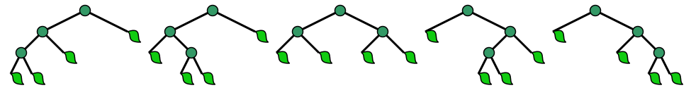
</li>
<li>
    
It is the number of structurally unique BSTs (binary search trees) 
    which has exactly <math>n</math> nodes of unique values from <math>1</math>
    to <math>n</math>.

    
For <math>n = 3</math>, for example:

    </li>
<li>
    
It is the number of Dyck words of length <math>2n</math>. A Dyck 
    word is a string consisting of <math>n</math> X's and <math>n</math> 
    Y's such that no initial segment of the string has more Y's than X's.
    

    
For example, Dyck words for <math>n = 3</math>:

    
XXXYYY     XYXXYY     XYXYXY     XXYYXY     XXYXYY

</li>
<li>
    
It is the number of monotonic lattice paths along the edges of a
    grid with <math>n \times n</math> square cells, which do not pass
    above the diagonal.

    <note>
    <list type="bullet">
    <li>
        
A monotonic path is one which starts in the lower left corner,
        finishes in the upper right corner, and consists entirely of
        edges pointing rightwards or upwards.

    </li>
    <li>
        
Counting such paths is equivalent to counting Dyck words:
        X stands for &quot;move right&quot; and Y stands for &quot;move up&quot;.

    </li>
    </list>
    </note>
</li>
<li>
    
A convex polygon with <math>n + 2</math> sides can be cut into
    triangles by connecting vertices with non-crossing line segments
    (a form of polygon triangulation). The number of triangles formed
    is <math>n</math> and it is the number of different ways that this
    can be achieved.

</li>
</list>

### 30.3 Implementation

<tabs>
    <tab title="Java">
    <code-block lang="java" collapsible="true">
public static BigInteger catalan(int n) {
    BigInteger res = BigInteger.ONE;
\/
    for (int i = 0; i &lt; n; i++) {
        res = res.multiply(BigInteger.valueOf(2L * n - i));
        res = res.divide(BigInteger.valueOf(i + 1));
    }
\/
    return res.divide(BigInteger.valueOf(n + 1));
}
    </code-block>
    </tab>
    <tab title="C++">
    <code-block lang="c++" collapsible="true">
unsigned long int binomialCoeff(unsigned int n, unsigned int k) {
    if (k &gt; n) return 0;
    if (k == 0 || k == n) return 1;
\/
    unsigned long int res = 1;
    for (int i = 0; i &lt; k; i++) {
        res *= (n - i);
        res /= (i + 1);
    }
\/
    return res;
}
\/
unsigned long int catalan(unsigned int n) {
    unsigned long int c = binomialCoeff(2*n, n);
    return c/(n+1);
}
    </code-block>
    </tab>
    <tab title="Python">
    <code-block lang="python" collapsible="true">
import math
\/
\/
def catalan_number(n):
return math.comb(2 * n, n) // (n + 1)
    </code-block>
    </tab>
</tabs>