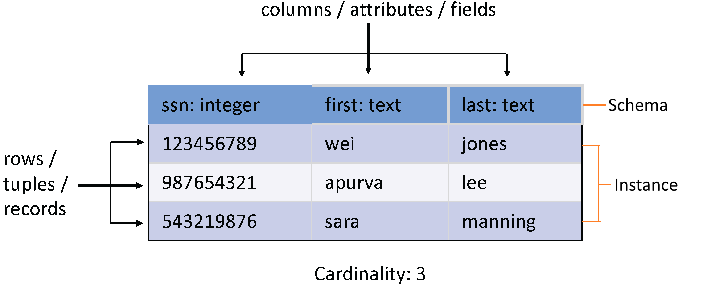

<show-structure for="chapter" depth="3"></show-structure>

# Database System

## 1 SQL

### 1.1 SQL Introduction

SQL = Structured Query Language

Although over 40 years old, it keeps re-emerging as the standard.

<format color="BlueViolet">Features:</format> 

<list type="bullet">
<li>
    
Declarative!

    <list type="bullet">
        <li>Specify <format style="italic">what</format> you want, not 
        <format style="italic">how</format> to get it.</li>  
    </list>
</li>
<li>
    
Implemented widely

    <list type="bullet">
        <li>With varying levels of efficiency, completeness.</li>  
    </list>
</li>
<li>

Constrained

<list type="bullet">
    <li>
        
Not targeted at Turing-complete tasks.

    </li>
</list>
</li>
<li>

General-purpose and feature-rich

<list type="bullet">
    <li>
        
Many years of added features.

    </li>
    <li>
        
Extensible: Callouts to other languages, databases.

    </li>
</list>
</li>
</list>

### 1.2 Relational Terminology

<format color="BlueViolet">Definitions:</format> 

<list type="bullet">
<li><format color="DarkOrange">Database:</format> Set of named Relations
.</li>
<li>

<format color="DarkOrange">Relation (aka Table):</format> 

    <list type="bullet">
        <li><format color="Fuchsia">Schema:</format> description (
        "metadata").</li>
        <li><format color="Fuchsia">Instance:</format> set of data 
        satisfying the schema.</li>
    </list>
</li>
<li><format color="DarkOrange">Attribute (aka Column, Field)</format></li>
<li><format color="DarkOrange">Tuple (aka Record, Row)</format></li>
<li><format color="DarkOrange">Cardinality:</format> Number of rows in a
table.</li>
</list>

<format color="BlueViolet">Properties:</format> 

<list type="bullet">
<li>
    
Schema is fixed, unique attribute names, atomic (aka primitive) 
    types.

</li>
<li>
    
Tables are NOT ordered, they are sets or multisets (bags).

</li>
<li>
    
Tables are FLAT, no nested attributes.

</li>
<li>
    
Tables DO NOT prescribe how they are implemented/stored on
    disk, which is called <format style="bold">physical data 
    independence</format>.

</li>
</list>

<warning>

Some important notes: 

<list type="alpha-lower">
<li>
    
Instance must follow the schema to be relations.

</li>
<li>
    
Each column has to have distinct names.

</li>
<li>
    
Every column must use atomic type!

</li>
</list>
</warning>