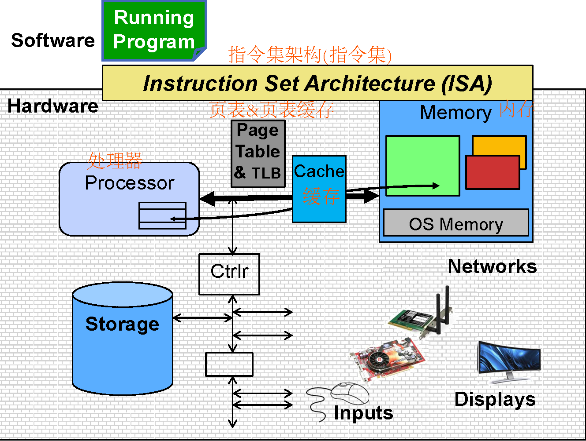
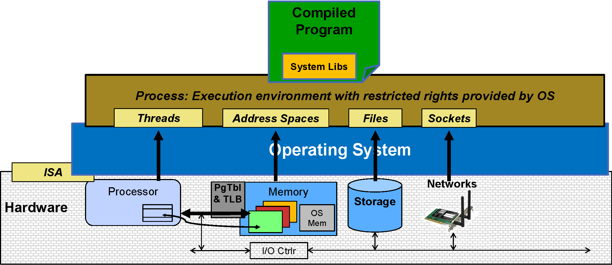

# Operating System

## 1 Introduction to Operating System

<format color = "BlueViolet">Definition:</format> Special layer of 
software that provides application software access to hardware resources.

<format color = "BlueViolet">What is an Operating System?</format>

<list type = "bullet">
<li>

<format color = "BlanchedAlmond">Illusionist:</format> Provide 
clean, easy-to-use abstractions of physical resources.

</li>
<li>

<format color = "BlanchedAlmond">Referee:</format> Manage 
protection, isolation, and sharing of resources.

</li>
<li>

<format color = "BlanchedAlmond">Glue:</format> Common services.

</li>
</list>

### 1.1 Operating System as Illusionist - Provide clean, easy-to-use abstractions of physical resources

<list type = "bullet">
<li>

Application's "machine" <format style = "italic">is</format> the
process abstraction provided by OS.

</li>
<li>

Each running program runs in its own process.

</li>
<li>

Processes provide nicer interfaces than raw hardware.

</li>
</list>

<format color = "DarkOrange">A process consists of: </format>

<list type = "bullet">
<li>

Address Space

</li>
<li>

One or more threads of control executing in that address space

</li>
<li>

Additional system state associated with it, e.g., open files, 
open sockets, etc.

</li>
</list>

<list type = "bullet">
<li>

OS translates from hardware interface to application interface.

</li>
<li>

OS provides each running program with its own process.

</li>
</list>

### 1.2 Operating System as Referee - Manage protection, isolation, and sharing of resources

