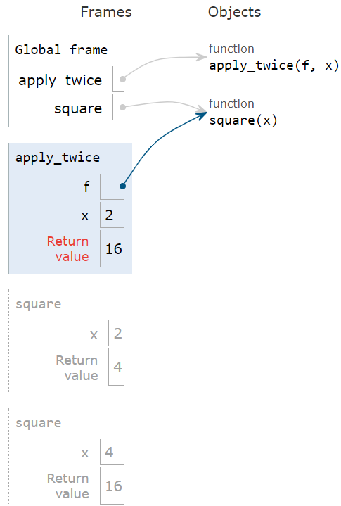
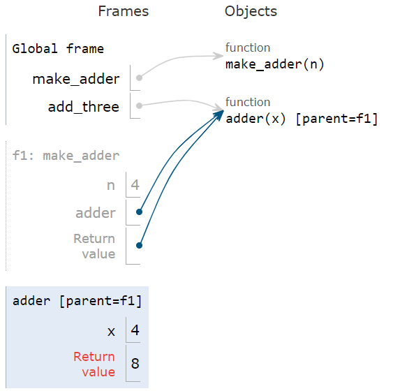
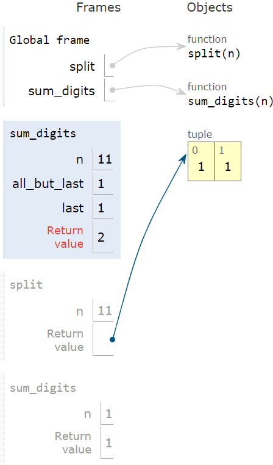
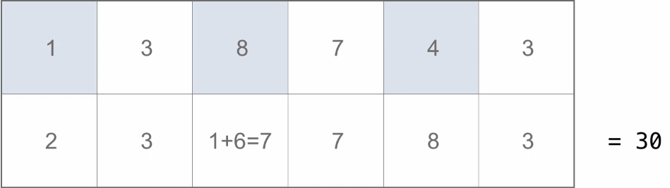

<show-structure for="chapter" depth="3"></show-structure>

# Python Programming

<primary-label ref="finish"></primary-label>

## 1 Basic Python Knowledge

### 1.1 Strings

#### 1.1.1 String Representation

<p>In Python, all objects produce two string representations: </p>

<list type="bullet">
<li>The <format color="Fuchsia">str</format> is legible to humans.
</li>
<li>The <format color="Fuchsia">repr</format> is legible to Python
interpreter.</li>
</list>

<list type="alpha-lower">

<li>
    <p><format color="Fuchsia">repr:</format> Provides a string 
    representation that can be used to recreate the object. It's 
    designed for debugging and introspection. It aims for a more 
    precise and detailed description, often including the object's 
    type.</p>
    <p><format color="BlueViolet">Examples:</format> </p>

<code-block lang="python" collapsible="true">
class MyClass:
    def __init__(self, value):
        self.value = value
    def __repr__(self):
        return f"MyClass({self.value})"
\/
obj = MyClass(10)
print(repr(obj))  # Output: MyClass(10)
</code-block>
</li>

<li>
    <p><format color="Fuchsia">repr:</format> Provides a human-
    readable string representation of the object. It's designed to be
    easily understood by humans.</p>
    <p><format color="BlueViolet">Examples:</format> </p>
    <code-block lang="python" collapsible="true">
class MyClass:
    def __init__(self, value):
        self.value = value
    def __str__(self):
        return f"MyClass with value: {self.value}"
\/
obj = MyClass(10)
print(str(obj))  # Output: MyClass with value: 10
</code-block> 
</li>

</list>

#### 1.1.2 Strings in Python

<p>For more information on strings, please visit 
<a href="Data-Structures-and-Algorithms-3.md" anchor="strings-in-java" 
summary="Strings in Java">strings in Java</a>.</p>

<p><format color="BlueViolet">Examples in Python:</format> </p>

<code-block lang="python" collapsible="true">
name = "Nate"
age = 19
\/
s = "My name is %s and I am %d years old" % (name, age)
s1 = "My name is {} and I am {} years old".format(name, age)
s2 = f"My name is {name} and I am {age} years old"
\/
print(f"2 + 2 = {(lambda x: x + x)(2)}") # 2 + 2 = 4
</code-block>

<code-block lang="python" collapsible="true">
s = "I have a dream!"
print(s[2:6]) # "have"
print(s[2:]) # "have a dream!"
print(s[-3:-1]) # "am"
print(s[-1:-3]) # "" No result!
print(s[::-1]) # "!maerd a evah I", -1 refers to the step
</code-block>

<code-block lang="python" collapsible="true">
s = "dream"
s1 = s.captialize() # "Dream"
s2 = "i have a dream!"
s3 = s2.title() # "I Have A Dream!"
s4 = "I HAVE A DREAM!"
s5 = s4.lower() # "i have a dream!"
</code-block>

<code-block lang="python" collapsible="true">
s = "    I have a dream!    "
s1 = s.strip() # "I have a dream!" strip() can remove whitespace, \n, \t
s2 = "I have a dream!"
s3 = s2.replace("dream", "car") # "I have a car!"
s4 = s2.split(" ") # ["I", "have", "a", "dream!"]
\/
s5 = "I have a dream!"
ret = s5.find("dream") # 9
ret = s5.find("car") # -1
ret = s5.index("dream") # 9
ret = s5.index("car") # ValueError
print("I" in s5) # True
print(s5.startswith("I")) # True
\/
s6 = "123"
ret = s6.isdigit() # True
</code-block>

### 1.2 Lists

<p><format color="BlueViolet">Examples:</format> </p>

<code-block lang="python" collapsible="true">
lst = ["I", "have", "a", "dream!"]
s = " ".join(lst) # "I have a dream!"
for item in lst:
    print(item) # I have a dream!
</code-block>

<code-block lang="python" collapsible="true">
lst = []
lst.append("I") # ["I"]
lst.insert(0, "have") # ["have", "I"]
lst.extend(["a", "dream!"]) # ["have", "I", "a", "dream!"]
\/
lst.pop() # "dream!"
lst.pop(0) # "have"
lst.remove("I") # ["a"]
lst.[0] = "me" # ["me"]
</code-block>

<code-block lang="python" collapsible="true">
lst = [1, 2, 4, 3, 5]
lst.sort() # [1, 2, 3, 4, 5]
lst.sort(reverse=True) # [5, 4, 3, 2, 1]
\/
lst = ["I", "have", "a", "dream!"]
lst[1] = lst[1].upper() # string operations must return a new string
print(lst) # ["I", "HAVE", "a", "dream!"]
</code-block>

### 1.3 Tuple

<p><format color="BlueViolet">Examples:</format> </p>

<code-block lang="python" collapsible="true">
t = ()
t = (1, 2, 3)
t[1] = 4 # TypeError -> Tuple is unchangeable!
\/
t = ("I have a dream!")
print(type(t)) # &lt;class 'str'&gt;
t = ("I have a dream!",)
print(type(t)) # &lt;class 'tuple'&gt;
\/
t = ("I", "have", ["a", "dream"])
t[2].append("!")
print(t) # ("I", "have", ["a", "dream", "!"])
# "Tuple is unchangeable" means the cache address of the tuple is unchangeable.
</code-block>

### 1.4 Set {id="sets"}

<code-block lang="python" collapsible="true">
s = {}
print(type(s)) # &lt;class 'dict'&gt;
s = {1, 2, 3}
s = set()
</code-block>

<p>Set cannot contain unhashable type aka mutable type.</p>

<list type="bullet">
<li>
    <p><format color="Fuchsia">Hashable type:</format> int, float, 
    string, tuple, bool.</p>
</li>
<li>
    <p><format color="Fuchsia">Unhashable type:</format> list, set, 
    dict.</p>
</li>
</list>

<code-block lang="python">
s = {1, 2, 3, []} # TypeError: unhashable type: 'list'
</code-block>

<code-block lang="python" collapsible="true">
s = set()
s.add(1)
s.add(2)
s.add(3)
\/
s.pop()
s.remove(2)
</code-block>

<code-block lang="python" collapsible="true">
s1 = {1, 2, 3}
s2 = {3, 4, 5}
print(s1 & s2) # {3}
print(s1.intersection(s2)) # {3}
\/
print(s1 | s2) # {1, 2, 3, 4, 5}
print(s1.union(s2)) # {1, 2, 3, 4, 5}
\/
print(s1 - s2) # {1, 2}
print(s1.difference(s2)) # {1, 2}
</code-block>

### 1.5 Dictionary {id="dictionaries"}

<note>
<p>Some important notes: </p>
<list type="bullet">
<li>
    <p>A key of a dictionary cannot be a list or a dictionary (or any 
    mutable type).</p>
</li>
<li>
    <p>Two keys cannnot be equal.</p>
</li>
</list>
</note>

<code-block lang="python">
dic = {1: "I", 2: "have", 3: "a", 4: "dream!"}
</code-block>

<code-block lang="python" collapsible="true">
dic = {} # dic = dict()
dic[1] = "I"
dic[2] = "have" # {1: "I", 2: "have"}
dic.setdefault(3, "a") # {1: "I", 2: "have", 3: "a"}
'''
If the key exists, skip; 
otherwise, add and set the key-value pair to default in dictionary.
'''
</code-block>

<code-block lang="python" collapsible="true">
dict = {1: "I", 2: "have", 3: "a", 4: "dream!"}
dict.pop(4) # {1: "I", 2: "have", 3: "a"}
\/
print(dict[0]) # KeyError
print(dict.get(0)) # None
</code-block>

<code-block lang="python" collapsible="true">
dict = {1: "I", 2: "have", 3: "a", 4: "dream!"}
for key in dict:
    print(key, dict[key])
\/
print(list(dict.keys())) # [1, 2, 3, 4]
print(list(dict.values())) # ["I", "have", "a", "dream!"]
\/
for item in dict.items():
    print(item)
\/
for key, value in dict.items():
    print(key, value)
</code-block>

<code-block lang="python" collapsible="true">
dict = {1: "I", 2: "have", 3: "a", 4: "dream!"}
for key in dict:
    dict.pop(key) # RuntimeError: dictionary changed size during iteration
</code-block>

<code-block lang="python" collapsible="true">
dict = {1: "I", 2: "have", 3: "a", 4: "dream!"}
for key in list(dict.keys()):
    dict.pop(key) # No error
</code-block>

### 1.6 Bytes

<list type="decimal">
<li>
    <p><format color="Fuchsia">ASCII:</format> 1 bytes, 8 bits.</p>
</li>
<li>
    <p><format color="Fuchsia">ANSI:</format> A standard. 2 bytes, 16 
    bits.</p>
    <list type="bullet">
    <li>
        <p><format color="LawnGreen">Mainland China:</format>
        GB2312 => GBK (Windows).</p>
    </li>
    <li>
        <p><format color="LawnGreen">Taiwan, China:</format> Big5.</p>
    </li>
    <li>
        <p><format color="LawnGreen">Japan:</format> JIS.</p>
    </li>
    </list>
</li>
<li>
    <p><format color="Fuchsia">Unicode:</format> </p>
    <list type="bullet">
    <li>
        <p><format color="LawnGreen">UCS-2:</format> 2 bytes, 16 bits
        .</p>
    </li>
    <li>
        <p><format color="LawnGreen">UCS-4:</format> 4 bytes, 32 bits
        .</p>
    </li>
    </list>
</li>
<li>
    <p><format color="Fuchsia">UTF:</format> All the same as Unicode, 
    except that the length is changeable.</p>
    <list type="bullet">
    <li>
        <p><format color="LawnGreen">English:</format> 1 byte, 8 bits
        .</p>
    </li>
    <li>
        <p><format color="LawnGreen">Some of European languages:
        </format> 2 bytes, 16 bits.</p>
    </li>
    <li>
        <p><format color="LawnGreen">Chinese:</format> 3 bytes, 24 
        bits.</p>
    </li>
    </list>
</li>
<li>
<p><format color="Fuchsia">UTF-16:</format> Shortest length is 16 
bits.</p>
</li>
</list>

### 1.7 Logical Operators

<p>Priority: </p>

<p>() => not => and => or</p>

## 2 Higher-Order Function

<p><format color="DarkOrange">Higher-order function:</format> 
A function that takes a function as an argument value or returns
a function as a return value.</p>

### 2.1 Higher-Order Function (Functions as Arguments)

<p><format color="BlueViolet">Examples:</format> </p>

<code-block lang="python" collapsible="true">
def summation(n, term):
    total, k = 0, 1
    while k &lt;= n:
        total, k = total + term(k), k + 1
    return total
\/
\/
def cube(k):
    return k * k * k
\/
\/
def sum_cubes(n):
    return summation(n, cube)
</code-block>

<code-block lang="python" collapsible="true">
def apply_twice(f, x):
    return f(f(x))
\/
\/
def square(x):
    return x * x
\/
\/
result = apply_twice(square, 2)
</code-block>

<procedure title="Apply a User-Defined Function">
<step>
    <p>Create a new frame.</p>
</step>
<step>
    <p>Bind formal parameters (f & x) to arguments.</p>
</step>
<step>
    <p>Execute the body: return f(f(x)).</p>
</step>
</procedure>

<note>
<p>This is the environment frame for the code above.</p>
</note>



### 2.2 Nested Definitions (Functions as Returned Values)

<code-block lang="python" collapsible="true">
def make_adder(n):
    def adder(x):
        return x + n
    return adder
</code-block>

<p>Propositions:</p>
<list type="bullet">
<li>
    <p>Every user-defined function has a parent frame (often global).
    </p>
</li>
<li>
    <p>The parent of a function is the frame in which it was defined.
    </p>
</li>
<li>
    <p>Every local frame has a parent frame (often global).</p>
</li>
<li>
    <p>The parent of a frame is the parent of function called.</p>
</li>
</list>



### 2.3 Lambda Expressions

<p><format color="BlueViolet">Important notes:</format> </p>

<list type="bullet">
<li>
    <p>No "return" keyword!</p>
</li>
<li>
    <p>Lambda expressions are not common in Python, but important in 
    general.</p>
</li>
<li>
    <p>Lambda expressions in Python cannot contain statements at all!
    </p>
</li>
</list>

<tabs>
    <tab title="Python">
    <code-block lang="python">
square = lambda x: x * x
    </code-block>
    </tab>
    <tab title="C++">
    <code-block lang="c++" collapsible="true">
auto lambda = [](int x, int y) {
    int sum = x + y;
    int product = x * y;
    return sum + product;
};
\/
int result = lambda(5, 7);  // result will be 47
    </code-block>
    </tab>
    <tab title="Java">
    <code-block lang="java" collapsible="true">
public static void main(String[] args) {
    IntBinaryOperator addAndMultiply = (x, y) -> {
        int sum = x + y;
        int product = x * y;
        return sum + product;
    };
\/
    int result = addAndMultiply.applyAsInt(5, 7);  // result will be 47
    System.out.println(result);
}    
    </code-block>
    </tab>
    <tab title="JavaScript">
    <code-block lang="javascript" collapsible="true">
let myFunction = (x, y) => {
    let sum = x + y;
    let product = x * y;
    return sum + product;
};
\/
let result = myFunction(5, 7);  // result will be 47
    </code-block>
    </tab>
</tabs>

<tip>
<list type="decimal">
<li>
    <p>C++, Java and JavaScript all support multiple lines of code in
    the lambda expression.</p>
</li>
<li>
    <p>For more information on lambda functions in C++, please visit 
    <a href="C-Programming.md" anchor="Lambda" summary= 
    "Lambda Functions in C++">C++ Programming</a>.</p>
</li>
</list>
</tip>

### 2.4 Currying

<p><format color="BlueViolet">Examples:</format> </p>

<code-block lang="python" collapsible="true">
def curry2(f):
    def g(x):
        def h(y):
            return f(x, y)
\/
        return h
\/
    return g
\/
\/
def add(x, y):
    return x + y
\/
\/
s = curry2(add)(1)(2)
</code-block>

## 3 Recursion

<p><format color="DarkOrange">Recursive Function:</format> 
A function is called <format style="italic">recursive</format> 
if the body of that function calls itself, either directly or 
indirectly.</p>

### 3.1 Self-Reference: Return by its own name

<code-block lang="python" collapsible="true">
def print_all(x):
    print(x)
    return print_all
\/  
print_all(1)(3)(5)
</code-block>


<code-block lang="python" collapsible="true">
def print_sums(x):
    print(x)
    def next_sum(y):
        return print_sums(x + y)
    return next_sum
\/
print_sums(1)(3)(5)
</code-block>


### 3.2 Recursion & Environment Diagrams

<p><format color="BlueViolet">Example 1:</format> </p>

<code-block lang="python" collapsible="true">
def split(n):
    return n // 10, n % 10
\/
def sum_digits(n):
    # Base Cases
    if n &lt; 10:
        return n
    else:
        all_but_last, last = split(n)
        return sum_digits(all_but_last) + last
</code-block>



<p>Example 2: </p>

<code-block lang="python" collapsible="true">
def fact(n):
    if n == 0:
        return 1
    else:
        return n * fact(n - 1)
</code-block>


### 3.3 Iteration & Recursion

<warning>
<p>Iteration is a special case of recursion!</p>
</warning>

<table style="both">
<tr>
    <td></td>
    <td>Iteration</td>
    <td>Recursion</td>
</tr>
<tr>
    <td>Sample Implementation</td>
    <td><p>Using while: </p>
<code-block lang="python" collapsible="true">
def fact_iter(n):
    total, k = 1, 1
    while k &lt;= n:
        total, k = total * k, k + 1
    return total
</code-block>
</td>
<td><p>Using recursion: </p>
<code-block lang="python" collapsible="true">
def fact(n):
    if n == 0:
        return 1
    else:
        return n * fact(n - 1)
</code-block>
</td>
</tr>
<tr>
    <td>Math</td>
<td>
<code-block lang="tex">
n! = \prod_{\substack{k = 1}} ^ {\substack{n}} k
</code-block>
</td>
<td>
<code-block lang="tex">
n! = 
\left\{
\begin{array}{ll}
1 & \text{if } n = 0 \\
n \cdot (n - 1)! & \text{otherwise} \\
\end{array}
\right.
</code-block>
</td>
</tr>
<tr>
    <td><p>Conversion</p>
    <p>(to another)</p></td>
    <td><p>More formulaic: </p>
    <p>The <format style="italic">state</format> of an iteration can
    be passed as arguments.</p></td>
    <td><p>Can be tricky: </p>
    <p>Find out what state must be maintained by the iterative 
    function.</p></td>
</tr>
</table>

### 3.4 Mutual Recursion

<p><format color="DarkOrange">Luhn Algorithm</format> - Used to 
verify credit card numbers.</p>

<list type="decimal">
<li>
<p>From the rightmost digit, which is the check digit, moving left, 
double the value of every second digit; if product of this doubling 
operation is greater than 9 (e.g., <math>7 \times 2 = 14</math>), 
then sum the digits of the products (e.g., 10: <math>1 + 0 = 1</math>, 
14: <math>1 + 4 = 5</math>).</p>
</li>
<li>
<p>Take the sum of all the digits. The Luhn sum of a valid credit 
card number is a multiple of 10.</p>
</li>
</list>



```Python
def luhn_sum(n):
    if n < 10:
        return n
    else:
        all_but_last, last = split(n)
        return luhn_sum_double(all_but_last) + last
        
def luhn_sum_double(n):
    all_but_last, last = split(n)
    luhn_digit = sum_digits(2 * last)
    if n < 10:
        return luhn_digit
    else:
        return luhn_sum(all_but_last) + luhn_digit
```

## 4 Iterators & Generators

### 4.1 Iterators

<p><format color="BlueViolet">Definitions:</format> </p>

<list type="alpha-lower">
<li>
    <p><format color="DarkOrange">Iterable:</format> An 
    object capable of returning its members one at a time.</p>
</li>
<li>
    <p><format color="DarkOrange">Iterator:</format> An 
    object that progressively provides access to each item of a 
    collection, in order.</p>
</li>
</list>

<warning>
<p>Iterators themselves are iterables!</p>
</warning>

<p><format color="BlueViolet">Types of iterables:</format> </p>

<list type="bullet">

</list>

<p><format color="BlueViolet">Operations on iterators:</format> </p>

<list type="bullet">
<li>
    <p><format color="OrangeRed">iter</format> (iterable): Return an 
    iterator over the elements of an iterable value.</p>
</li>
<li>
    <p><format color="OrangeRed">next</format> (iterable): Return the
    next element in an iterator.</p>
</li>
</list>

<p><format color="BlueViolet">Example usage:</format> </p>

```Python
s = [5, 2, 0]
iterator = iter(s)
item1 = next(iterator) # 5
item2 = next(iterator) # 2
item3 = next(iterator) # 0
item4 = next(iterator) # StopIteration
```

### 4.2 Iterables

<list>
<li>
<p>Lists: [1, 2, 3, 4]</p>
</li>
<li>
<p>Tuples: (10, 20, 30)</p>
</li>
<li>
<p>Strings: &quot;Hello&quot;</p>
</li>
<li>
<p>Dictionaries: {&quot;name&quot;: &quot;Alice&quot;, &quot;age&quot;:
30} (iterates over keys by default)</p>
</li>
<li>
<p>Sets: {1, 2, 3}</p>
</li>
<li>
<p>Ranges: range(1, 5)</p>
</li>
<li>
<p>File Objects: Used for reading data from files line by line.</p>
</li>
</list>

<p><format color="BlueViolet">Special case: Dictionaries</format></p>

<list type="bullet">
<li>
    <p>The order of items of a dictionary is the order in which they 
    were added (Python 3.6+).</p>
</li>
<li>
    <p>Historically, items appeared in an arbitrary order (Python 3.5
    and earlier).</p>
</li>
</list>

<p><format color="BlueViolet">Example usage:</format> </p>

```Python
# Iterate keys
d = {"MacOS": "Apple", "Windows": "Microsoft", "Linux": "Open Source"}
k = iter(d.keys()) # or iter(d)
print(next(k)) # MacOS

# Iterate values
v = iter(d.values())
print(next(v)) # Apple

# Iterate items
i = iter(d.items())
print(next(i)) # ('MacOS', 'Apple')
```

<note>
<p>During iteration, you can't change the size of dictionary, aka 
change the structure of it, which may initiate runtime error; you can, 
however, change the value of the key.</p>
</note>

<compare type="top-bottom" first-title = "change the size" second-title = "change the key">
    <code-block lang = "python">
        d = {"MacOS": "Apple", "Windows": "Microsoft", "Linux": "Open Source"}
        k = iter(d.values())
        print(next(k)) # Apple
        d["Android"] = "Google"
        print(next(k)) # RuntimeError: dictionary changed size during iteration
    </code-block>
    <code-block lang = "python">
        d = {"MacOS": "Apple", "Windows": "Microsoft", "Linux": "Open Source"}
        k = iter(d.values())
        print(next(k)) # Apple
        d["Windows"] = "Microsoft Corporation"
        print(next(k)) # Microsoft Corporation
    </code-block>
</compare>

### 4.3 Generators

<p><format color="BlueViolet">Definitions:</format> </p>

<list type="alpha-lower">
<li>
    <p><format color="DarkOrange">Generator:</format> A function that 
    <format color="OrangeRed">yields</format> value instead of
    <format color="OrangeRed">returning</format> them.</p>
</li>
<li>
    <p><format color="DarkOrange">Generator:</format> An iterator 
    created automatically by calling a generator function.</p>
</li>
</list>

<note>
<p>A normal function returns once; a generator function can yield 
multiple times.</p>
</note>

<p><format color="BlueViolet">Example usage:</format> </p>

```Python
def even(start, end):
    current = start + (start % 2)
    while current <= end:
        yield current
        current += 2
        
lst1 = list(even(1, 10)) # [2, 4, 6, 8, 10]
t = even(1, 10)
item1 = next(t) # 2
item2 = next(t) # 4
```

<p><format color="BlueViolet">Generators can yield form iterators:
</format></p>

<p>A <format color="OrangeRed">yield from</format> statement yields
all values from an iterator or iterable (Python 3.3).</p>

<p>Example 1: </p>

<compare first-title = "yield" second-title = "yield from">
    <code-block lang = "python">
        def a_then_b(a, b):
            for x in a:
                yield x
            for x in b:
                yield x
    </code-block>
    <code-block lang = "python">
        def a_then_b(a, b):
            yield from a
            yield from b
    </code-block>
</compare>

<p>Example 2: </p>

<compare type="top-bottom" first-title = "yield" second-title = "yield from">
    <code-block lang = "python">
        def countdown(k):
            if k > 0:
                yield k
                yield countdown(k - 1)
        t = countdown(3)
        item1 = next(t) # 3
        item2 = next(t) # &lt;generator object countdown at 0x0000021D7D3D3F90>
    </code-block>
    <code-block lang = "python">
        def countdown(k):
            if k > 0:
                yield k
                yield from countdown(k - 1)
        t = countdown(3) 
        item1 = next(t) # 3
        item2 = next(t) # 2
    </code-block>
</compare>

### 4.4 Built-In Iterator Functions

<p>Many built-in Python sequence operations return iterators that
compute results lazily.</p>

<p>To view the contents of an iterator, place the resulting elements 
into a container.</p>

<list type="bullet">
<li>
    <p><format color="OrangeRed">list</format> (iterable): 
    Create a list containing all x in iterable.</p>
</li>
<li>
    <p><format color="OrangeRed">tuple</format> (iterable): 
    Create a tuple containing all x in iterable.</p>
</li>
<li>
    <p><format color="OrangeRed">sorted</format> (iterable):
    Create a sorted list containing x in iterable.</p>
</li>
</list>

#### 4.4.1 Map

<p><format color="OrangeRed">map</format> (func, iterable): Iterate
over func(x) for x in iterable.</p>

<p><format color="BlueViolet">Example usage:</format> </p>

```Python
def square(x):
    return x * x
    
numbers = [1, 2, 3, 4]
squared_numbers = map(square, numbers)  # map object (iterator)
item1 = next(squared_numbers)  # 1
```

#### 4.4.2 Filter

<p><format color="OrangeRed">filter</format> (func, iterable): 
Iterate over x in iterable if func(x).</p>

<p><format color="BlueViolet">Example usage:</format> </p>

```Python
def square(x):
    return x * x

def is_even(x):
    return x % 2 == 0
    
numbers = [1, 2, 3, 4]
even_numbers = filter(is_even, numbers)  # filter object (iterator)
```

#### 4.4.3 zip

<p><format color="OrangeRed">zip</format> (first_iter, second_iter, ...):
Iterate over co-indexed (x, y) pairs.</p>

<p><format color="BlueViolet">Example usage:</format> </p>

<p>Example 1: </p>

```Python
list(zip([1, 2], [3, 4, 5], [6, 7]))  # [(1, 3, 6), (2, 4, 7)]
```

<p>Example 2: </p>

```Python
def palindrome(s):
    return all(a == b for a, b in zip(s, reversed(s)))
```

#### 4.4.4 reversed

<p><format color="OrangeRed">reversed</format> (sequence): Iterate
over x in a sequence in reverse order.</p>

<p><format color="BlueViolet">Example usage:</format> </p>

```Python
t = [1, 2, 3, 2, 1]
print(reverse(t) == t) # False
# Because reversed(t) is a list_reverseiterator object
print(list(reversed(t) == t) # True
```

#### 4.4.5 range iterator

<p><format color="BlueViolet">Example usage:</format> </p>

```Python
r = range(3, 6)
ri = iter(r) # range_iterator object
for i in ri:
    print(i)
# 3
# 4
# 5
```

## 5 Efficiency

### 5.1 Order of Growth

<p>For more information on order of growth, please refer to <a href 
= "Data-Structures-and-Algorithms.md" anchor = "Growth" 
summary = "Order of Growth">Data Structures and Algorithms 1</a>.</p>

### 5.2 Space

<list type="bullet">
<li>
    <p>At any moment there is a set of active environments. Values and 
    frames in active environments consume memory.</p>
</li>
<li>
    <p>Memory that is used for other values and frames can be 
    recycled.</p>
</li>
<li>
    <p><format color="Fuchsia">Active Environments:</format> </p>
    <list type="bullet">
        <li>
            <p>Environments for any function calls currently being
            evaluated => call the function but hasn't returned yet.</p>
        </li>
        <li>
            <p>Parent environments of functions named in active 
            environments => define a function in another function, so
            the function defined is not in the global frame, the 
            parent frame is needed.</p>
        </li>
    </list>
</li>
</list>

## 6 Object-Oriented Programming

### 6.1 Object-Oriented Programming in Python

<p>For more information about the details of Object-Oriented 
Programming, refer to <a href="C-Programming.md" anchor="object" 
summary = "Object-Oriented Programming">
Object-Oriented Programming in C++</a>.</p>

<note>
<p>The following content is details of OOP in Python.</p>
</note>

<warning>
<p>In Python, every value is an object!</p>
</warning>

```Python
class Account:
    # _init_ is a special method name for the function that constructs
    # an Account instance
    def __init__(self, account_holder):
        self.balance = 0
        self.holder = account_holder
        
    # self is the instance of the Account class on which deposit was
    # invoked
    def deposit(self, amount):
        self.balance = self.balance + amount
        return self.balance
        
    def withdraw(self, amount):
        if amount > self.balance:
            return "Insufficient funds"
        self.balance = self.balance - amount
        return self.balance
        

a = Account("Nate")
a.deposit(100)
a.withdraw(50)
print(a.balance) # 50
```

<list type="alpha-lower">
<li>
    <p>When a class is called: </p>
    <list type="bullet">
    <li>
        <p>A new instance of that class (aka an object) is created.</p>
    </li>
    <li>
        <p>The <format color="OrangeRed">_init_</format> method
        of the class is called with the new object as its first 
        argument (named <format color="OrangeRed">self</format>), 
        along with any additional arguments provided in the call 
        expression.</p>
    </li>
    <li>
        <p>An object's attributes can be accessed and modified using 
        dot expressions.</p>
    </li>
    <li>
        <p>Every object that is an instance of a class has a unique 
        identity.</p>
    </li>
    </list>
</li>
<li>
    <p>All invoked methods have access to the object via the self
    parameter, and so they can all access and manipulate the object's 
    attributes.</p>
</li>
</list>

### 6.2 Inheritance

<p>For more information about inheritance, please visit <a 
href="C-Programming.md" anchor="inheritance" 
summary = "Object-Oriented Programming">
Object-Oriented Programming in C++</a>.</p>

### 6.3 Special Method Functions

<p>Certain names are special because they have built-in behavior.</p>

<p>These names always start and end with two underscores.</p>

<list type="decimal">
<li><format color="Fuchsia">__init__</format> Method invoked 
automatically when an object is constructed</li>
<li><format color="Fuchsia">__repr__</format> Method invoked 
to display an object as a Python expression</li>
<li><format color="Fuchsia">__add__</format> Method invoked 
to add one object to another</li>
<li><format color="Fuchsia">__bool__</format> Method invoked 
to convert an object to True or False.</li>
<li><format color="Fuchsia">__float__</format> Method invoked 
to convert an object to a float (real number).</li>
</list>

## 7 Scheme

### 7.1 Scheme Fundamentals

<p>Scheme programs consist of expressions, which can be: </p>

<list type="bullet">
<li>Primitive expressions: 2, 3.3, true, +, quotient...</li>
<li>Combinations: (quotient 10 2), (not true)...</li>
</list>

<p>Numbers are self-evaluating; symbols are bound to values.</p>
<p>Call expressions include an operator and 0 or more operands in 
parenthesis.</p>

<p><format color="BlueViolet">Example:</format> </p>

<code-block lang="plain text">
(quotient 10 2) ; 5
(- (* 3 5) (+ 10 1)) ; 14
(- (* 2 2 3) 
    (+ 3 2 1)) ; 9
(number? 3) ; #t
</code-block>

<p><format color="BlueViolet">Special forms:</format> </p>

<p><format color="OrangeRed">Special forms:</format> A combination
taht is not a call expression is a <format style="italic">special
form</format>: </p>

<list type="bullet">
<li><format color="Fuchsia"><format style="bold">If</format> statement
:</format> (if &lt;predicate&gt; &lt;consequent&gt; &lt;alternative
&gt;)</li>
<li><format color="Fuchsia"><format style="bold">And</format> and 
<format style="bold">or</format>:</format> (and &lt;e <sub>1</sub>&gt;
... &lt;e <sub>n</sub>&gt;), (or &lt;e <sub>1</sub>&gt; ... &lt;e 
<sub>n</sub>&gt;)</li>
<li><format color="Fuchsia">Binding symbols:</format> (define &lt;
symbol&gt; &lt;expression&gt;)</li>
<li><format color="Fuchsia">New procedures:</format> (define &lt;
symbol&gt; &lt;formal parameters&gt;) &lt;body&gt;</li>
<li><format color="Fuchsia">Lambda Expressions:</format> (lambda 
(&lt;formal-parameters&gt;) &lt;body&gt;</li>
</list>

<p><format color="BlueViolet">Examples:</format> </p>

<code-block lang="plain text">
(define pi 3.14)
(define (abs x)
    (if (&gt;= x 0)
        x
        (- x)))
</code-block>

<compare first-title="Procedure" second-title="Lambda Expressions">
<code-block lang="plain text">
(define (plus4 x) (+ x 4))
</code-block>
<code-block lang="plain text">
(define plus4 (lambda (x) (+ x 4)))
</code-block>
</compare>

<p><format color="BlueViolet">Cond & Begin:</format> </p>

<p><format color="Magenta">Cond</format></p>

<compare first-title="if-elif-else in Python" second-title
="Cond in Scheme">
<code-block lang="python">
if x &gt; 10:
    print("big")
elif x &gt; 5:
    print("medium")
else:
    print("small")
</code-block>
<code-block lang="plain text">
(cond ((&gt; x 10) (print 'big))
      ((&gt; x 5)  (print 'medium))
      (else     (print 'small)))
</code-block>
</compare>

<p><format color="Magenta">Begin</format></p>

<compare first-title="Python" second-title="Scheme">
<code-block lang="python">
if x &gt; 10:
    print("big")
    print("guy")
else:
    print("small")
    print("fry")
</code-block>
<code-block lang="plain text">
(if (&gt; x 10)
    (begin
        (print 'big)
        (print 'guy))
    (begin
        (print 'small)
        (print 'fry)))
</code-block>
</compare>

<p><format color="BlueViolet">Let:</format> </p>

<compare first-title="Bound in Python" second-title="Not Bound in 
Scheme">
<code-block lang="python">
a = 3
b = 2 + 2
c = math.sqrt(a * a + b * b)
</code-block>
<code-block lang="plain text">
(let ((a 3)
      (b (+ 2 2)))
    (sqrt (+ (* a a) (* b b))))
</code-block>
</compare>

### 7.2 Scheme Lists

<list type="bullet">
<li>
    <p><format color="Fuchsia">cons:</format> Two-argument procedure 
    that creates a linked list.</p>
</li>
<li>
    <p><format color="Fuchsia">car:</format> Procedure that returns 
    the first element of the list.</p>
</li>
<li>
    <p><format color="Fuchsia">cdr:</format> Procedure that returns 
    the rest of a list.</p>
</li>
<li>
    <p><format color="Fuchsia">nil:</format> The empty list.</p>
</li>
</list>

<code-block lang="plain text">
(cons 1 (cons 2 (cons 3 nil))) ; (1 2 3)
</code-block>

<p><format color="BlueViolet">Symbolic programming:</format> </p>

<code-block lang="plain text">
(define a 1)
(define b 2)
(list a b) ; (1 2)
(list 'a 'b) ; (a b)
</code-block>

<p><format color="BlueViolet">Built-In List Processing Procedures
</format></p>

<list type="bullet">
<li>
    <p><format color="Fuchsia">(append s t):</format> list the 
    elements of s and t; append can be called on more than 2 lists.
    </p>
</li>
<li>
    <p><format color="Fuchsia">(map f s):</format> call a procedure
    f on each element of a list s and list the results.</p>
</li>
<li>
    <p><format color="Fuchsia">(filter f s):</format> call a procedure
    f on each element of a list s and list the elements for which a 
    true value is the result.</p>
</li>
<li>
    <p><format color="Fuchsia">(apply f s):</format> call a procedure
    f with the elements of a list as its arguments.</p>
</li>
</list>