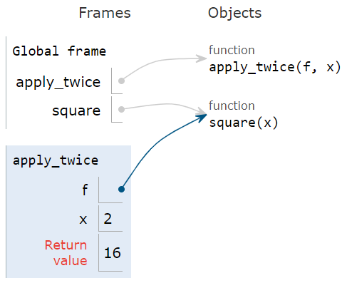
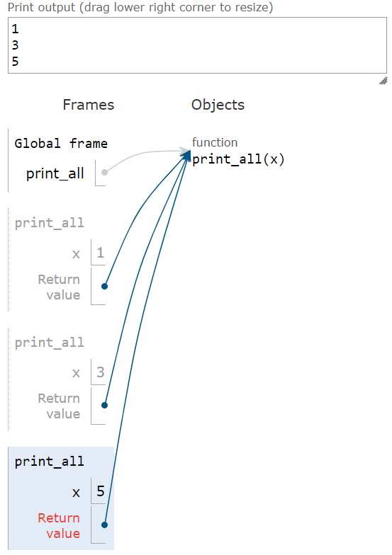
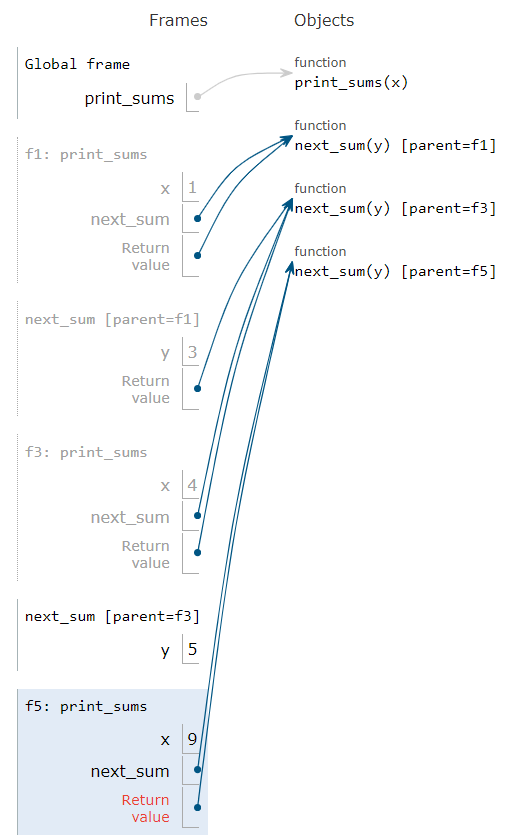
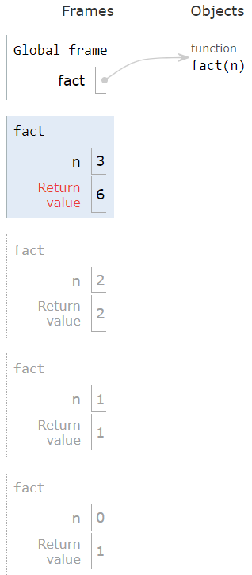

<show-structure for="chapter" depth="2"/>

# Python Programming

## 1 Basic Data Types

### 1.1 String

```Python
name = "Nate"
age = 19

s = "My name is %s and I am %d years old" % (name, age)
s1 = "My name is {} and I am {} years old".format(name, age)
s2 = f"My name is {name} and I am {age} years old"  # -> This is the best one!
```

```Python
s = "I have a dream!"
print(s[2:6]) # "have"
print(s[2:]) # "have a dream!"
print(s[-3:-1]) # "am"
print(s[-1:-3]) # "" No result!
print(s[::-1]) # "!maerd a evah I" -1 refers to the step
```

```Python
s = "dream"
s1 = s.captialize() # "Dream"
s2 = "i have a dream!"
s3 = s2.title() # "I Have A Dream!"
s4 = "I HAVE A DREAM!"
s5 = s4.lower() # "i have a dream!"
```

```Python
s = "    I have a dream!    "
s1 = s.strip() # "I have a dream!" strip() can remove whitespace, \n, \t
s2 = "I have a dream!"
s3 = s2.replace("dream", "car") # "I have a car!"
s4 = s2.split(" ") # ["I", "have", "a", "dream!"]

s5 = "I have a dream!"
ret = s5.find("dream") # 9
ret = s5.find("car") # -1
ret = s5.index("dream") # 9
ret = s5.index("car") # ValueError
print("I" in s5) # True
print(s5.startswith("I")) # True

s6 = "123"
ret = s6.isdigit() # True
```

### 1.2 List

```Python
lst = ["I", "have", "a", "dream!"]
s = " ".join(lst) # "I have a dream!"
for item in lst:
    print(item) # I have a dream!
```

```Python
lst = []
lst.append("I") # ["I"]
lst.insert(0, "have") # ["have", "I"]
lst.extend(["a", "dream!"]) # ["have", "I", "a", "dream!"]

lst.pop() # "dream!"
lst.pop(0) # "have"
lst.remove("I") # ["a"]
lst.[0] = "me" # ["me"]
```

```Python
lst = [1, 2, 4, 3, 5]
lst.sort() # [1, 2, 3, 4, 5]
lst.sort(reverse=True) # [5, 4, 3, 2, 1]

lst = ["I", "have", "a", "dream!"]
lst[1] = lst[1].upper() # string operations must return a new string
print(lst) # ["I", "HAVE", "a", "dream!"]
```

### 1.3 Tuple

```Python
t = ()
t = (1, 2, 3)
t[1] = 4 # TypeError -> Tuple is unchangeable!

t = ("I have a dream!")
print(type(t)) # <class 'str'>
t = ("I have a dream!",)
print(type(t)) # <class 'tuple'>

t = ("I", "have", ["a", "dream"])
t[2].append("!")
print(t) # ("I", "have", ["a", "dream", "!"]) 
# "Tuple is unchangeable" means the cache address of the tuple is unchangeable.
```

### 1.4 Set {id = "sets"}

```Python
s = {}
print(type(s)) # <class 'dict'>
s = {1, 2, 3}
s = set()
```

<p>Set cannot contain unhashable type aka mutable type.</p>

<list type = "bullet">
<li>
<p><format color = "BlanchedAlmond">Hashable type:</format> int, float, 
string, tuple, bool.</p>
</li>
<li>
<p><format color = "BlanchedAlmond">Unhashable type:</format> list, set, 
dict.</p>
</li>
</list>

```Python
s = {1, 2, 3, []} # TypeError: unhashable type: 'list'
```

```Python
s = set()
s.add(1)
s.add(2)
s.add(3)

s.pop() 
s.remove(2)
```

```Python
s1 = {1, 2, 3}
s2 = {3, 4, 5}
print(s1 & s2) # {3}
print(s1.intersection(s2)) # {3}

print(s1 | s2) # {1, 2, 3, 4, 5}
print(s1.union(s2)) # {1, 2, 3, 4, 5}

print(s1 - s2) # {1, 2}
print(s1.difference(s2)) # {1, 2}
```

### 1.5 Dictionary {id = "dictionaries"}

```Python
dic = {1: "I", 2: "have", 3: "a", 4: "dream!"}
```

```Python
dic = {} # dic = dict()
dic[1] = "I"
dic[2] = "have" # {1: "I", 2: "have"}
dic.setdefault(3, "a") # {1: "I", 2: "have", 3: "a"}
'''
If the key exists, skip; 
otherwise, add and set the key-value pair to default in dictionary.
'''
```

```Python
dict = {1: "I", 2: "have", 3: "a", 4: "dream!"}
dict.pop(4) # {1: "I", 2: "have", 3: "a"}

print(dict[0]) # KeyError
print(dict.get(0)) # None
```

```Python
dict = {1: "I", 2: "have", 3: "a", 4: "dream!"}
for key in dict:
    print(key, dict[key])
    
print(list(dict.keys())) # [1, 2, 3, 4]
print(list(dict.values())) # ["I", "have", "a", "dream!"]

for item in dict.items():
    print(item)
    
for key, value in dict.items():
    print(key, value)
```

```Python
dict = {1: "I", 2: "have", 3: "a", 4: "dream!"}
for key in dict:
    dict.pop(key) # RuntimeError: dictionary changed size during iteration
```

```Python
dict = {1: "I", 2: "have", 3: "a", 4: "dream!"}
for key in list(dict.keys()):
    dict.pop(key) # No error
```

### 1.6 Bytes

<list type = "decimal">
<li>
<p>ASCII: 1 bytes, 8 bits.</p>
</li>
<li>
<p>ANSI: A standard. 2 bytes, 16 bits.</p>
<list type = "bullet">
<li>
<p>Mainland China: GB2312 => GBK (Windows).</p>
</li>
<li>
<p>Taiwan, China: Big5.</p>
</li>
<li>
<p>Japan: JIS.</p>
</li>
</list>
</li>
<li>
<p>Unicode.</p>
<list type = "bullet">
<li>
<p>UCS-2: 2 bytes, 16 bits.</p>
</li>
<li>
<p>UCS-4: 4 bytes, 32 bits.</p>
</li>
</list>
</li>
<li>
<p>UTF: All the same as UNicode, except that the length is changeable.</p>
<list type = "bullet">
<li>
<p>English: 1 byte, 8 bits.</p>
</li>
<li>
<p>SOme of European languages: 2 bytes, 16 bits.</p>
</li>
<li>
<p>Chinese: 3 bytes, 24 bits.</p>
</li>
</list>
</li>
<li>
<p>UTF-16: Shortest length is 16 bits.</p>
</li>
</list>

## 2 Higher-Order Function

<p><format color = "Chartreuse">Higher-order function:</format> 
A function that takes a function as an argument value or returns
a function as a return value.</p>

### 2.1 Higher-Order Function (Functions as Arguments)

```Python
def summation(n, term):
    total, k = 0, 1
    while k <= n:
        total, k = total + term(k), k + 1
    return total


def cube(k):
    return k * k * k


def sum_cubes(n):
    return summation(n, cube)
```

```Python
def apply_twice(f, x):
    return f(f(x))


def square(x):
    return x * x


result = apply_twice(square, 2)
```

<procedure title = "Apply a User-Defined Function">
<step>
<p>Create a new frame.</p>
</step>
<step>
<p>Bind formal parameters (f & x) to arguments.</p>
</step>
<step>
<p>Execute the body: return f(f(x)).</p>
</step>
</procedure>

<note>
<p>This is the environment frame for the code above.</p>
</note>



### 2.2 Nested Definitions (Functions as Returned Values)

```Python
def make_adder(n):
    def adder(x):
        return x + n
    return adder
```

<p>Propositions:</p>
<list type = "bullet">
<li>
<p>Every user-defined function has a parent frame (often global).</p>
</li>
<li>
<p>The parent of a function is the frame in which it was defined.</p>
</li>
<li>
<p>Every local frame has a parent frame (often global).</p>
</li>
<li>
<p>The parent of a frame is the parent of function called.</p>
</li>
</list>


### 2.3 Lambda Expressions

<p>Important notes:</p>

<list type = "bullet">
<li>
<p>No "return" keyword!</p>
</li>
<li>
<p>Lambda expressions are not common in Python, but important in 
general.</p>
</li>
<li>
<p>Lambda expressions in Python cannot contain statements at all!</p>
</li>
</list>

Python

```Python
square = lambda x: x * x
```

<p>Lambda expressions (or similar) in other programming languages.</p>

<p>C++ (Multiple Lines of Codes Permitted)</p>

```C++
auto lambda = [](int x, int y) {
    int sum = x + y;
    int product = x * y;
    return sum + product;
};
int result = lambda(5, 7);  // result will be 47
```

<p>Java</p>

```Java
    public static void main(String[] args) {
        IntBinaryOperator add = (x, y) -> x + y;
        System.out.println(add.applyAsInt(10, 20));  // Output: 30
    }
```

<p>JavaScript (Arrow Function, Multiple Lines of Codes Permitted)</p>

```Javascript
let myFunction = (x, y) => {
    let sum = x + y;
    let product = x * y;
    return sum + product;
};

let result = myFunction(5, 7);  // result will be 47
```

### 2.4 Currying

```Python
def curry2(f):
    def g(x):
        def h(y):
            return f(x, y)

        return h

    return g


def add(x, y):
    return x + y


s = curry2(add)(1)(2)
```

## 3 Recursion

<p><format color = "Chartreuse">Recursive Function:</format> 
A function is called <format style = "italic">recursive</format> 
if the body of that function calls itself, either directly or 
indirectly.</p>

### 3.1 Self-Reference: Return by its own name

```Python
def print_all(x):
    print(x)
    return print_all
    
print_all(1)(3)(5)
```



```Python
def print_sums(x):
    print(x)
    def next_sum(y):
        return print_sums(x + y)
    return next_sum
    
print_sums(1)(3)(5)
```



### 3.2 Recursion & Environment Diagrams

<p>Example 1: </p>

```Python
def split(n):
    return n // 10, n % 10
    
def sum_digits(n):
    # Base Cases
    if n < 10:
        return n
    else:
        all_but_last, last = split(n)
        return sum_digits(all_but_last) + last
```


<p>Example 2: </p>

```Python
def fact(n):
    if n == 0:
        return 1
    else:
        return n * fact(n - 1)
```



### 3.3 Iteration & Recursion

<warning>
<p>Iteration is a special case of recursion!</p>
</warning>

<table style = "both">
<tr><td></td><td>Iteration</td><td>Recursion</td></tr>
<tr><td>Sample Implementation</td>
<td><p>Using while: </p>
<code-block lang = "python">
def fact_iter(n):
    total, k = 1, 1
    while k &lt;= n:
        total, k = total * k, k + 1
    return total
</code-block>
</td>
<td>
<p>Using recursion: </p>
<code-block lang = "python">
def fact(n):
    if n == 0:
        return 1
    else:
        return n * fact(n - 1)
</code-block>
</td></tr>
<tr>
<td>Math</td><td>
<code-block lang = "tex">
n! = \prod_{\substack{k = 1}} ^ {\substack{n}} k
</code-block>
</td>
<td>
<code-block lang = "tex">
n! = 
\left\{
\begin{array}{ll}
1 & \text{if } n = 0 \\
n \cdot (n - 1)! & \text{otherwise} \\
\end{array}
\right.
</code-block>
</td>
</tr>
<tr><td><p>Conversion</p><p>(to another)</p></td>
<td><p>More formulaic: </p>
<p>The <format style = "italic">state</format> of an iteration can
be passed as arguments.</p></td>
<td><p>Can be tricky: </p>
<p>Find out what state must be maintained by the iterative function.
</p></td>
</tr>
</table>

### 3.4 Mutual Recursion

<p><format color = "Chartreuse">Luhn Algorithm</format> - Used to 
verify credit card numbers.</p>

<list type = "decimal">
<li>
<p>From the rightmost digit, which is the check digit, moving left, 
double the value of every second digit; if product of this doubling 
operation is greater than 9 (e.g., <math>7 \times 2 = 14</math>), 
then sum the digits of the products (e.g., 10: <math>1 + 0 = 1</math>, 
14: <math>1 + 4 = 5</math>).</p>
</li>
<li>
<p>Take the sum of all the digits. The Luhn sum of a valid credit 
card number is a multiple of 10.</p>
</li>
</list>


```Python
def luhn_sum(n):
    if n < 10:
        return n
    else:
        all_but_last, last = split(n)
        return luhn_sum_double(all_but_last) + last
        
def luhn_sum_double(n):
    all_but_last, last = split(n)
    luhn_digit = sum_digits(2 * last)
    if n < 10:
        return luhn_digit
    else:
        return luhn_sum(all_but_last) + luhn_digit
```